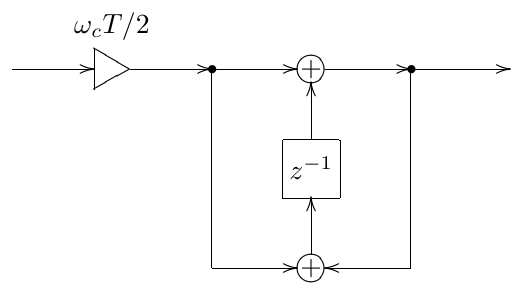

# The Art of VA Filter Design

Vadim Zavalishin

rev. 2.1.2 (February 14, 2020)

About this book: the book covers the theoretical and practical aspects of the
virtual analog filter design in the music DSP context. Only a basic amount of
DSP knowledge is assumed as a prerequisite. For digital musical instrument and
effect developers.

DISCLAIMER: THIS BOOK IS PROVIDED "AS IS", SOLELY AS AN EXPRESSION
OF THE AUTHOR'S BELIEFS AND OPINIONS AT THE TIME OF THE WRITING,
AND IS INTENDED FOR THE INFORMATIONAL PURPOSES ONLY.

(c) Vadim Zavalishin. The right is hereby granted to freely copy this revision of
the book in software or hard-copy form, as long as the book is copied in its full
entirety (including this copyright note) and its contents are not modified.

*To the memory of Elena Golushko,
may her soul travel the happiest path. . .*

# Preface

The classical way of presentation of the DSP theory is not very well suitable for
the purposes of virtual analog filter design. The linearity and time-invariance of
structures are not assumed merely to simplify certain analysis and design aspects,
but are handled more or less as an "ultimate truth". The connection to the
continuous-time (analog) world is lost most of the time. The key focus points,
particularly the discussed filter types, are of little interest to a digital music
instrument developer. This makes it difficult to apply the obtained knowledge in
the music DSP context, especially in the virtual analog filter design.

This book attempts to amend this deficiency. The concepts are introduced with
the musical VA filter design in mind. The depth of theoretical explanation is
restricted to an intuitive and practically applicable amount. The focus of the
book is the design of digital models of classical musical analog filter structures
using the *topology-preserving transform* approach, which can be considered as
a generalization of bilinear transform, zero-delay feedback and trapezoidal
integration methods. This results in digital filters having nice amplitude and
phase responses, nice time-varying behavior and plenty of options for
nonlinearities. In a way, this book can be seen as a detailed explanation of the
materials provided in the author's article "Preserving the LTI system topology
in s- to z-plane transforms."

The main purpose of this book is not to explain how to build high-quality
emulations of analog hardware (although the techniques explained in the book
can be an important and valuable tool for building VA emulations). Rather it is
about how to build high-quality time-varying digital filters. The author hopes
that these techniques will be used to construct new digital filters, rather than
only to build emulations of existing analog structures.

The prerequisites for the reader include familiarity with the basic DSP concepts,
complex algebra and the basic ideas of mathematical analysis. Some basic
knowledge of electronics may be helpful at one or two places, but is not critical
for the understanding of the presented materials.

The author apologizes for possible mistakes and messy explanations, as the
book didn't go through any serious proofreading.

## Preface to revision 2.0.0alpha

This preface starts with an excuse. With revision 2.0.0 the book receives a
major update, where the new material roughly falls into two different
categories: the practical side of VA DSP and a more theoretical part. The
latter arose from the desire to describe theoretical foundations for the subjects
which the book intended to cover. These foundations were not copied from other
texts (except where explicitly noted), but were done from scratch, the author
trying to present the subject in the most intuitive way.[^1] For that reason,
especially in the more theoretical part, the book possibly contains mistakes.

Certain pieces of information are simply ideas which the author spontaneously
had and tried to describe,[^2] not necessarily properly testing all of them.
This is another potential source of mistakes. One option would have been not
rushing the book release and making an exhaustive testing of the presented
material. During the same time the book text could have gone through a few
more polishing runs, possibly restructuring some of the material in an easier to
grasp way. However, this probably would have delayed the book's release by
half a year or, likely, much more, as after five months of overly intensive work
on the book the author (hopefully) deserves some relaxing. On the other hand,
the main intention of the book is not to provide a collection of ready to use
recipes, but rather to describe one possible way to think about the respective
matters and give some key pieces of information. Thus, readers, who understood
the text, should be able to correct the respective mistakes, if any, on their own.
From that perspective, the book in the present state should fulfill its goal.

Therefore the author decided to release the book in an *alpha* state with the
above reservations.[^3] Readers looking for a collection of time-proven recipes
might want to check other sources.

The author also has recieved a number of complaints in regards to the book
having too high requirements on the math side. It just so happens that certain
things simply need advanced math to be properly understood. Sacrificing the
exactness and the amount of information for the sake of a more accessible text
could have definitely been an option, but. . . that would have been a completely
different book. In that regard the new revision contains parts which are even
harder on the math side than the previous revisions, the math prerequisites for
these parts respectively being generally higher than for the rest of the book.
Such parts, however, may simply be skipped by the readers.

In regards to the usage of the math in the book, the author would like to make
one more remark. The book uses math notation not simply to provide some
calculation formulas or to do formal transformations. The math notation is also
used to express information, since quite in some cases it can do this much more
exactly than words. In that sense the respective formulas become an integral
part of the book's text, rather than some kind of a parallel stream of
information. E.g. the formula (2.4), which some readers find daunting, is
simply providing a detailed explanation to the statement that each partial can
be integrated independently.

Certain readers, being initially daunted by the look of the text, also believe
that they need to read some other filter DSP text before attempting this one.
This is not necessarily so, since this book strongly deviates in its presentation
from the classical DSP texts and this might create a collision in the beginner's
mind between two very different approaches to the material. Also, chances are,
after reading some other classical DSP text first, the reader will only find out
that this didn't help much in regards to understanding this book and was simply
an additional investment of time.

The part of DSP knowledge which is more or less required (although a pretty
surface level should suffice) is a basic understanding of discrete time sampling.
Also basic knowledge of Fourier theory could be helpful, but probably even that
is not a must, as the book introduces it in a, however condensed, but sufficient
for the understanding of the the further text form. No preliminary knowledge of
filters is needed. Also, in author's impression, often the real problem is
possibly an insufficient level of math knowledge or experience, which then leads
to a reader believing that some additional filter knowledge is needed first,
whereas what's lacking is rather purely the math skills. In this case, if the gap
is not very large, one could try to simply read through anyway, it might become
progressively better, or the part of the math which is not being understood may
happen to be not essential for practical application of the materials.

## Acknowledgements

The author would like to express his gratitude to a number of people who
helped him with the matters related to the creation of this book in one or
another way: Daniel Haver, Mate Galic, Tom Kurth, Nicolas Gross, Maike
Weber, Martijn Zwartjes, Mike Daliot and Jelena Mičetić Krowarz. Special
thanks to Stephan Schmitt, Egbert Jürgens, Tobias Baumbach, Steinunn
Arnardottir, Eike Jonas, Maximilian Zagler, Marin Vrbica and Philipp
Dransfeld.

The author is also grateful to a number of people on the KVR Audio DSP
forum and the music DSP mailing list for productive discussions regarding the
matters discussed in the book. Particularly to Martin Eisenberg for the
detailed and extensive discussion of the delayless feedback, to Dominique
Wurtz for the idea of the full equivalence of different BLT integrators, to Rene
Jeschke for the introduction of the transposed direct form II BLT integrator in
the TPT context, to Teemu Voipio and Max Mikhailov for their active
involvement into the related discussions and research and to Urs Heckmann for
being an active proponent of the ZDF techniques and actually (as far as the
author knows) starting the whole avalanche of their usage. Thanks to Robin
Schmidt, Richard Hoffmann, Francisco Garcia and Louis Couka for reporting a
number of mistakes in the book text.

One shouldn't underestimate the small but invaluable contribution by Helene
Kolpakova, whose questions and interest in the VA filter design matters have
triggered the initial idea of writing this book. Thanks to Julian Parker for
productive discussions, which stimulated the creation of the book's next
revision.

Last, but most importantly, big thanks to Bob Moog for inventing the
voltage-controlled transistor ladder filter.

## Prior work credits

Various flavors and applications of delayless feedback techniques were in prior
use for quite a while. Particularly there are works by A.Härmä, F.Avancini,
G.Borin, G.De Poli, F.Fontana, D.Rocchesso, T.Serafini and P.Zamboni,
although reportedly this subject has been appearing as far ago as in the 70s of
the 20th century.

[^1]: "Intuitive" here doesn't mean "easy to understand", but rather "when
    understood, it becomes easy".

[^2]: It is possible that some of these ideas are not new, but the author at
    the time of the writing was not aware of that. This might result in a lack
    of respective credits and in a different terminology, for which, should
    that happen to be the case, the author apologizes.

[^3]: The alpha state has been dropped in rev.2.1.0, as the author did some
    additional verification of the new materials.
