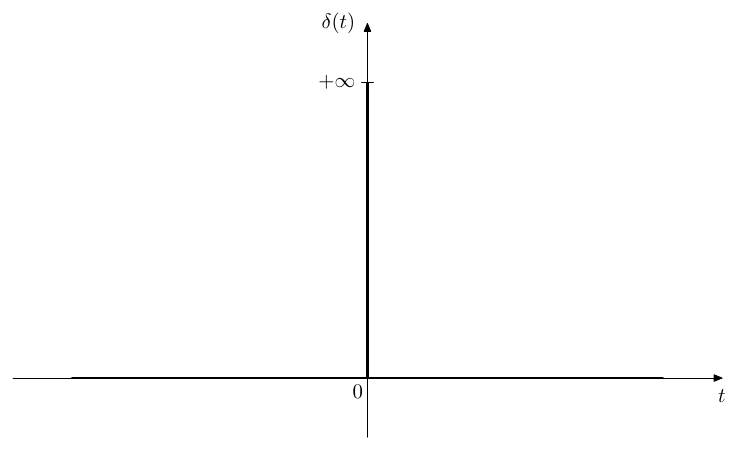

# Chapter 1: Fourier theory

When we are talking about filters we say that filters modify the frequency
content of the signal. E.g. a lowpass filter lets the low frequencies through,
while suppressing the high frequencies, a highpass filter does vice versa etc.
In this chapter we are going to develop a formal definition[^1] of the concept
of frequencies "contained" in a signal. We will later use this concept to
analyse the behavior of the filters.

## 1.1 Complex sinusoids

In order to talk about the filter theory we need to introduce complex sinusoidal
signals. Consider the complex identity:

$$
e^{jt} = \cos t + j \sin t \qquad (t \in \mathbb{R})
$$

(notice that, if $t$ is the time, then the point $e^{jt}$ is simply moving along
a unit circle in the complex plane). Then

$$
\cos t = \frac{e^{jt} + e^{-jt}}{2}
$$

and

$$
\sin t = \frac{e^{jt} - e^{-jt}}{2j}
$$

Then a real sinusoidal signal $a\cos(\omega t + \varphi)$ where $a$ is the real
amplitude and $\varphi$ is the initial phase can be represented as a sum of two
complex conjugate sinusoidal signals:

$$
a\cos(\omega t + \varphi) = \frac{a}{2}\left(e^{j(\omega t + \varphi)} + e^{-j(\omega t + \varphi)}\right)
= \left(\frac{a}{2}e^{j\varphi}\right)e^{j\omega t} + \left(\frac{a}{2}e^{-j\varphi}\right)e^{-j\omega t}
$$

Notice that we have a sum of two complex conjugate sinusoids $e^{\pm j\omega t}$
with respective complex conjugate amplitudes $(a/2)e^{\pm j\varphi}$. So, the
complex amplitude simultaneously encodes both the amplitude information (in its
absolute magnitude) and the phase information (in its argument). For the
positive-frequency component $(a/2)e^{j\varphi} \cdot e^{j\omega t}$, the complex
"amplitude" $a/2$ is a half of the real amplitude and the complex "phase"
$\varphi$ is equal to the real phase.

## 1.2 Fourier series

Let $x(t)$ be a real periodic signal of a period $T$:

$$
x(t) = x(t + T)
$$

Let $\omega = 2\pi/T$ be the fundamental frequency of that signal. Then $x(t)$
can be represented[^2] as a sum of a finite or infinite number of sinusoidal
signals of harmonically related frequencies $jn\omega$ plus the *DC offset*
term[^3] $a_0/2$:

$$
x(t) = \frac{a_0}{2} + \sum_{n=1}^{\infty} a_n \cos(jn\omega t + \varphi_n) \tag{1.1}
$$

The representation (1.1) is referred to as *real-form Fourier series*. The
respective sinusoidal terms are referred to as the *harmonics* or the harmonic
*partials* of the signal.

The set of partials contained in a signal (including the DC term) is referred to
as the signal's *spectrum*. Respectively, a periodic signal can be specified by
specifying its spectrum.

Using the complex sinusoid notation the same can be rewritten as

$$
x(t) = \sum_{n=-\infty}^{\infty} X_n e^{jn\omega t} \tag{1.2}
$$

where each harmonic term $a_n\cos(jn\omega t + \varphi_n)$ will be represented by
a sum of $X_n e^{jn\omega t}$ and $X_{-n}e^{-jn\omega t}$, where $X_n$ and
$X_{-n}$ are mutually conjugate: $X_n = X_{-n}^*$. The representation (1.2) is
referred to as *complex-form Fourier series* and respectively we can talk of a
*complex spectrum*. Note that we don't have an explicit DC offset partial in
this case, it is implicitly contained in the series as the term for $n = 0$.

It can be easily shown that the real- and complex-form coefficients are related
as

$$
\begin{aligned}
X_n &= \frac{a_n}{2}e^{j\varphi_n} \qquad (n > 0) \\
X_0 &= \frac{a_0}{2}
\end{aligned}
$$

This means that intuitively we can use the absolute magnitude and the argument
of $X_n$ (for positive-frequency terms) as the amplitudes and phases of the real
Fourier series partials.

Complex-form Fourier series can also be used to represent complex (rather than
real) periodic signals in exactly the same way, except that the equality
$X_n = X_{-n}^*$ doesn't hold anymore.

*Thus, any real periodic signal can be represented as a sum of harmonically
related real sinusoidal partials plus the DC offset. Alternatively, any periodic
signal can be represented as a sum of harmonically related complex sinusoidal
partials.*

## 1.3 Fourier integral

While periodic signals are representable as a sum of a countable number of
sinusoidal partials, a nonperiodic real signal can be represented[^4] as a sum
of an uncountable number of sinusoidal partials:

$$
x(t) = \int_0^{\infty} a(\omega)\cos\bigl(\omega t + \varphi(\omega)\bigr)\,\frac{d\omega}{2\pi} \tag{1.3}
$$

The representation (1.3) is referred to as *Fourier integral*.[^5] The DC offset
term doesn't explicitly appear in this case.

Even though the set of partials is uncountable this time, we still refer to it
as a *spectrum* of the signal. Thus, while periodic signals had discrete spectra
(consisting of a set of discrete partials at the harmonically related
frequencies), nonperiodic signals have continuous spectra.

The complex-form version of Fourier integral[^6] is

$$
x(t) = \int_{-\infty}^{\infty} X(\omega)e^{j\omega t}\,\frac{d\omega}{2\pi} \tag{1.4}
$$

For real $x(t)$ we have a Hermitian $X(\omega)$: $X(\omega) = X^*(-\omega)$, for
complex $x(t)$ there is no such restriction. The function $X(\omega)$ is referred
to as *Fourier transform* of $x(t)$.[^7]

It can be easily shown that the relationship between the parameters of the real
and complex forms of Fourier transform is

$$
X(\omega) = \frac{a(\omega)}{2}e^{j\varphi(\omega)} \qquad (\omega > 0)
$$

This means that intuitively we can use the absolute magnitude and the argument
of $X(\omega)$ (for positive frequencies) as the amplitudes and phases of the
real Fourier integral partials.

*Thus, any timelimited signal can be represented as a sum of an uncountable
number of sinusoidal partials of infinitely small amplitudes.*

## 1.4 Dirac delta function

The *Dirac delta function* $\delta(t)$ is intuitively defined as a very high and
a very short symmetric impulse with a unit area (Fig. 1.1):

$$
\begin{aligned}
&\delta(t) = \begin{cases} +\infty & \text{if } t = 0 \\ 0 & \text{if } t \neq 0 \end{cases} \\
&\delta(-t) = \delta(t) \\
&\int_{-\infty}^{\infty} \delta(t)\,dt = 1
\end{aligned}
$$

*Figure 1.1: Dirac delta function.*

Since the impulse is infinitely narrow and since it has a unit area,

$$
\int_{-\infty}^{\infty} f(\tau)\delta(\tau)\,d\tau = f(0) \qquad \forall f
$$

from where it follows that a convolution of any function $f(t)$ with
$\delta(t)$ doesn't change $f(t)$:

$$
(f * \delta)(t) = \int_{-\infty}^{\infty} f(\tau)\delta(t - \tau)\,d\tau = f(t)
$$

Dirac delta can be used to represent Fourier series by a Fourier integral. If we
let

$$
X(\omega) = \sum_{n=-\infty}^{\infty} 2\pi\delta(\omega - n\omega_f)X_n
$$

then

$$
\sum_{n=-\infty}^{\infty} X_n e^{jn\omega_f t} = \int_{-\infty}^{\infty} X(\omega)e^{j\omega t}\,\frac{d\omega}{2\pi}
$$

Notice that thereby the spectrum $X(\omega)$ is discrete, even though being
formally notated as a continuous function. From now on, we'll not separately
mention Fourier series, assuming that Fourier integral can represent any
necessary signal.

*Thus, most signals can be represented as a sum of (a possibly infinite number
of) sinusoidal partials.*

## 1.5 Laplace transform

Let $s = j\omega$. Then, a complex-form Fourier integral can be rewritten as

$$
x(t) = \int_{-j\infty}^{+j\infty} X(s)e^{st}\,\frac{ds}{2\pi j}
$$

where the integration is done in the complex plane along the straight line from
$-j\infty$ to $+j\infty$ (apparently $X(s)$ is a different function than
$X(\omega)$).[^8] For timelimited signals the function $X(s)$ can be defined on
the entire complex plane in such a way that the integration can be done along
any line which is parallel to the imaginary axis:

$$
x(t) = \int_{\sigma - j\infty}^{\sigma + j\infty} X(s)e^{st}\,\frac{ds}{2\pi j} \qquad (\sigma \in \mathbb{R}) \tag{1.5}
$$

In many other cases such $X(s)$ can be defined within some strip
$\sigma_1 < \operatorname{Re} s < \sigma_2$. Such function $X(s)$ is referred to
as bilateral *Laplace transform* of $x(t)$, whereas the representation (1.5) can
be referred to as *Laplace integral*.[^9] [^10]

Notice that the *complex exponential* $e^{st}$ is representable as

$$
e^{st} = e^{\operatorname{Re} s \cdot t} e^{\operatorname{Im} s \cdot t}
$$

Considering $e^{\operatorname{Re} s \cdot t}$ as the amplitude of the complex
sinusoid $e^{\operatorname{Im} s \cdot t}$ we notice that $e^{st}$ is:

- an exponentially decaying complex sinusoid if $\operatorname{Re} s < 0$,
- an exponentially growing complex sinusoid if $\operatorname{Re} s > 0$,
- a complex sinusoid of constant amplitude if $\operatorname{Re} s = 0$.

*Thus, most signals can be represented as a sum of (a possibly infinite number
of) complex exponential partials, where the amplitude growth or decay speed of
these partials can be relatively arbitrarily chosen.*

## Summary

The most important conclusion of this chapter is: any signal occurring in
practice can be represented as a sum of sinusoidal (real or complex) components.
The frequencies of these sinusoids can be referred to as the "frequencies
contained in the signal". The full set of these sinusoids, including their
amplitudes and phases, is refereed to as the spectrum of the signal.

For complex representation, the real amplitude and phase information is encoded
in the absolute magnitude and the argument of the complex amplitudes of the
positive-frequency partials (where the absolute magnitude of the complex
amplitude is a half of the real amplitude). It is also possible to use complex
exponentials instead of sinusoids.

[^1]: More precisely we will develop a number of definitions.

[^2]: Formally speaking, there are some restrictions on $x(t)$. It would be
    sufficient to require that $x(t)$ is bounded and continuous, except for a
    finite number of discontinuous jumps per period.

[^3]: The reason the DC offset term is notated as $a_0/2$ and not as $a_0$ has
    to do with simplifying the math notation in other related formulas.

[^4]: As with Fourier series, there are some restrictions on $x(t)$. It is
    sufficient to require $x(t)$ to be absolutely integrable, bounded and
    continuous (except for a finite number of discontinuous jumps per any finite
    range of the argument value). The most critical requirement here is probably
    the absolute integrability, which is particularly fulfilled for the
    timelimited signals.

[^5]: The $1/2\pi$ factor is typically used to simplify the notation in the
    theoretical analysis involving the computation. Intuitively, the integration
    is done with respect to the ordinary, rather than circular frequency:
    $$x(t) = \int_0^{\infty} a(f)\cos\bigl(2\pi f t + \varphi(f)\bigr)\,df$$
    Some texts do not use the $1/2\pi$ factor in this position, in which case it
    appears in other places instead.

[^6]: A more common term for (1.4) is *inverse Fourier transform*. However the
    term *inverse Fourier transform* stresses the fact that $x(t)$ is obtained
    by computing the inverse of some transform, whereas in this book we are more
    interested in the fact that $x(t)$ is representable as a combination of
    sinusoidal signals. The term *Fourier integral* better reflects this aspect.
    It also suggests a similarity to the Fourier series representation.

[^7]: The notation $X(\omega)$ for Fourier transform shouldn't be confused with
    the notation $X(s)$ for Laplace transform. Typically one can be told from the
    other by the semantics and the notation of the argument. Fourier transform
    has a real argument, most commonly denoted as $\omega$. Laplace transform has
    a complex argument, most commonly denoted as $s$.

[^8]: As already mentioned, the notation $X(\omega)$ for Fourier transform
    shouldn't be confused with the notation $X(s)$ for Laplace transform.
    Typically one can be told from the other by the semantics and the notation
    of the argument. Fourier transform has a real argument, most commonly
    denoted as $\omega$. Laplace transform has a complex argument, most commonly
    denoted as $s$.

[^9]: A more common term for (1.5) is *inverse Laplace transform*. However the
    term *inverse Laplace transform* stresses the fact that $x(t)$ is obtained
    by computing the inverse of some transform, whereas is this book we are more
    interested in the fact that $x(t)$ is representable as a combination of
    exponential signals. The term *Laplace integral* better reflects this aspect.

[^10]: The representation of periodic signals by Laplace integral (using Dirac
    delta function) is problematic for $\sigma \neq 0$. Nevertheless, we can
    represent them by a Laplace integral if we restrict $\sigma$ to $\sigma = 0$
    (that is $\operatorname{Re} s = 0$ for $X(s)$).
