# Chapter 2: Analog 1-pole filters

In this chapter we are going to introduce the basic analog RC-filter and use it
as an example to develop the key concepts of the analog filter analysis.

## 2.1 RC filter

Consider the circuit in Fig. 2.1, where the voltage $x(t)$ is the input signal and
the capacitor voltage $y(t)$ is the output signal. This circuit represents the
simplest 1-pole *lowpass filter*, which we are now going to analyse.

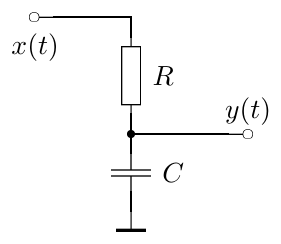

*Figure 2.1: A simple RC lowpass filter.*

Writing the equations for that circuit we have:

$$
\begin{aligned}
x &= U_R + U_C \\
y &= U_C \\
U_R &= RI \\
I &= \dot q_C \\
q_C &= C U_C
\end{aligned} \tag{2.1}
$$

where $U_R$ is the resistor voltage, $U_C$ is the capacitor voltage, $I$ is the
current through the circuit and $q_C$ is the capacitor charge. Reducing the
number of variables, we can simplify the equation system to:

$$
x = RC\dot y + y
$$

or

$$
\dot y = \frac{1}{RC}(x - y) \tag{2.2}
$$

or, integrating with respect to time:

$$
y = y(t_0) + \int_{t_0}^t \frac{1}{RC}\bigl(x(\tau) - y(\tau)\bigr)\,\mathrm{d}\tau
$$

where $t_0$ is the *initial time moment*. Introducing the notation $\omega_c = 1/RC$
we have

$$
y = y(t_0) + \int_{t_0}^t \omega_c\bigl(x(\tau) - y(\tau)\bigr)\,\mathrm{d}\tau \tag{2.3}
$$

We will reintroduce $\omega_c$ later as the *cutoff* of the filter.

Notice that we didn't factor $1/RC$ (or $\omega_c$) out of the integral for the
case when the value of $R$ is varying with time. The varying $R$ corresponds to
the varying cutoff of the filter, and this situation is highly typical in the
music DSP context.[^1]

## 2.2 Block diagrams

The integral equation (2.3) can be expressed in the block diagram form (Fig. 2.2).

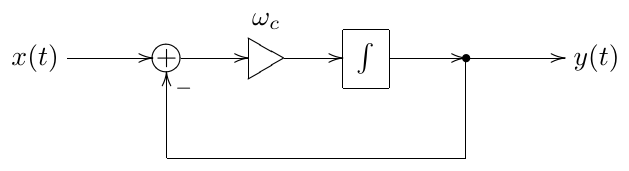

*Figure 2.2: A 1-pole RC lowpass filter in the block diagram form.*

The meaning of the elements of the diagram should be intuitively clear. The
*gain element* (represented by a triangle) multiplies the input signal by $\omega_c$.
Notice the inverting input of the summator, denoted by "$-$". The integrator
simply integrates the input signal:

$$
\mathrm{output}(t) = \mathrm{output}(t_0) + \int_{t_0}^t \mathrm{input}(\tau)\,\mathrm{d}\tau
$$

The representation of the system by the integral (rather than differential)
equation and the respective usage of the integrator element in the block
diagram has an important intuitive meaning. Intuitively, the capacitor
integrates the current flowing through it, accumulating it as its own charge:

$$
q_C(t) = q_C(t_0) + \int_{t_0}^t I(\tau)\,\mathrm{d}\tau
$$

or, equivalently

$$
U_C(t) = U_C(t_0) + \frac{1}{C}\int_{t_0}^t I(\tau)\,\mathrm{d}\tau
$$

One can observe from Fig. 2.2 that the output signal is always trying to
"reach" the input signal. Indeed, the difference $x - y$ is always "directed" from
$y$ to $x$. Since $\omega_c > 0$, the integrator will respectively increase or decrease
its output value in the respective direction. This corresponds to the fact that
the capacitor voltage in Fig. 2.1 is always trying to reach the input voltage.
Thus, the circuit works as a kind of smoother of the input signal.

## 2.3 Transfer function

Consider the integrator:

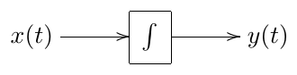

Suppose $x(t) = e^{st}$ (where $s = j\omega$ or, possibly, another complex value). Then

$$
y(t) = y(t_0) + \int_{t_0}^t e^{s\tau}\,\mathrm{d}\tau = y(t_0) + \frac{1}{s}e^{s\tau}\Big|_{\tau=t_0}^{t} = \frac{1}{s}e^{st} + \left(y(t_0) - \frac{1}{s}e^{st_0}\right)
$$

Thus, a complex sinusoid (or exponential) $e^{st}$ sent through an integrator
comes out as the same signal $e^{st}$ just with a different amplitude $1/s$ plus some
DC term $y(t_0) - e^{st_0}/s$. Similarly, a signal $X(s)e^{st}$ (where $X(s)$ is the complex
amplitude of the signal) comes out as $(X(s)/s)e^{st}$ plus some DC term. That is,
if we forget about the extra DC term, *the integrator simply multiplies the
amplitudes of complex exponential signals $e^{st}$ by $1/s$*.

Now, the good news is: for our purposes of filter analysis we can simply
*forget* about the extra DC term. The reason for this is the following. Suppose
the initial time moment $t_0$ was quite long ago ($t_0 \ll 0$). Suppose further that
the integrator is contained in a *stable* filter[^2]. It can be shown that in this
case the effect of the extra DC term on the output signal is negligible.[^3] Since
the initial state $y(t_0)$ is incorporated into the same DC term, it also means
that the effect of the initial state is negligible![^4]

Thus, we simply write (for an integrator):

$$
\int e^{s\tau}\,\mathrm{d}\tau = \frac{1}{s}e^{st}
$$

This means that $e^{st}$ is an *eigenfunction* of the integrator with the respective
eigenvalue $1/s$.

Since the integrator is linear,[^5] not only are we able to factor $X(s)$ out of the
integration:

$$
\int X(s)e^{s\tau}\,\mathrm{d}\tau = X(s)\int e^{s\tau}\,\mathrm{d}\tau = \frac{1}{s}X(s)e^{st}
$$

but we can also apply the integration independently to all Fourier (or
Laplace) partials of an arbitrary signal $x(t)$:

$$
\int \left( \int_{\sigma-j\infty}^{\sigma+j\infty} X(s)e^{s\tau}\,\frac{\mathrm{d}s}{2\pi j} \right) \mathrm{d}\tau = \int_{\sigma-j\infty}^{\sigma+j\infty} \left( \int X(s)e^{s\tau}\,\mathrm{d}\tau \right) \frac{\mathrm{d}s}{2\pi j} =
$$

$$
= \int_{\sigma-j\infty}^{\sigma+j\infty} \frac{X(s)}{s}e^{s\tau}\,\frac{\mathrm{d}s}{2\pi j} \tag{2.4}
$$

That is, the integrator changes the complex amplitude of each partial by a $1/s$
factor.

Consider again the structure in Fig. 2.2. Assuming the input signal $x(t)$ has
the form $e^{st}$ we can replace the integrator by a gain element with a $1/s$
factor. We symbolically reflect this by replacing the integrator symbol in the
diagram with the $1/s$ fraction (Fig. 2.3).[^6]

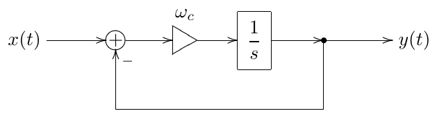

*Figure 2.3: A 1-pole RC lowpass filter in the block diagram form
with a 1/s notation for the integrator.*

So, suppose $x(t) = X(s)e^{st}$ and suppose we know $y(t)$. Then the input signal
for the integrator is $\omega_c(x-y)$. We now will further take for granted the
knowledge that $y(t)$ will be the same signal $e^{st}$ with some different complex
amplitude $Y(s)$, that is $y(t) = Y(s)e^{st}$ (notably, this holds only if $\omega_c$ is constant,
that is, if the system is *time-invariant*!!!)[^7] Then the input signal of the
integrator is $\omega_c(X(s) - Y(s))e^{st}$ and the integrator simply multiplies its
amplitude by $1/s$. Thus the output signal of the integrator is $\omega_c(x-y)/s$. But,
on the other hand $y(t)$ is the output signal of the integrator, thus

$$
y(t) = \omega_c \frac{x(t) - y(t)}{s}
$$

or

$$
Y(s)e^{st} = \omega_c \frac{X(s) - Y(s)}{s}e^{st}
$$

or

$$
Y(s) = \omega_c \frac{X(s) - Y(s)}{s}
$$

from where

$$
sY(s) = \omega_c X(s) - \omega_c Y(s)
$$

and

$$
Y(s) = \frac{\omega_c}{s + \omega_c}X(s)
$$

Thus, the circuit in Fig. 2.3 (or in Fig. 2.2) simply scales the amplitude of
the input sinusoidal (or exponential) signal $X(s)e^{st}$ by the $\omega_c/(s+\omega_c)$ factor.

Let's introduce the notation

$$
H(s) = \frac{\omega_c}{s + \omega_c} \tag{2.5}
$$

Then

$$
Y(s) = H(s)X(s) \tag{2.6}
$$

$H(s)$ is referred to as the *transfer function* of the structure in Fig. 2.3 (or
Fig. 2.2). Notice that $H(s)$ is a complex function of a complex argument.

For an arbitrary input signal $x(t)$ we can use the Laplace transform
representation

$$
x(t) = \int_{\sigma-j\infty}^{\sigma+j\infty} X(s)e^{st}\,\frac{\mathrm{d}s}{2\pi j}
$$

From the linearity[^8] of the circuit in Fig. 2.3, it follows that the result of
the application of the circuit to a linear combination of some signals is
equal to the linear combination of the results of the application of the
circuit to the individual signals. That is, for each input signal of the form
$X(s)e^{st}$ we obtain the output signal $H(s)X(s)e^{st}$. Then for an input signal which
is an integral sum of $X(s)e^{st}$, we obtain the output signal which is an integral
sum of $H(s)X(s)e^{st}$. That is

$$
y(t) = \int_{\sigma-j\infty}^{\sigma+j\infty} H(s)X(s)e^{st}\,\frac{\mathrm{d}s}{2\pi j} \tag{2.7}
$$

So, the circuit in Fig. 2.3 independently modifies the complex amplitudes of
the sinusoidal (or exponential) partials $e^{st}$ by the $H(s)$ factor!

Notably, the transfer function can be introduced for any system which is
linear and time-invariant. For the differential systems, whose block diagrams
consist of integrators, summators and fixed gains, the transfer function is
always a *non-strictly proper*[^9] rational function of $s$. Particularly, this
holds for the electronic circuits, where the differential elements are
capacitors and inductors, since these types of elements logically perform
integration (capacitors integrate the current to obtain the voltage, while
inductors integrate the voltage to obtain the current).

*It is important to realize that in the derivation of the transfer function
concept we used the linearity and time-invariance (the absence of parameter
modulation) of the structure. If these properties do not hold, the transfer
function can't be introduced! This means that all transfer function-based
analysis holds only in the case of fixed parameter values. In practice, if the
parameters are not changing too quickly, one can assume that they are
approximately constant during a certain time range. That is we can
"approximately" apply the transfer function concept (and the discussed later
derived concepts, such as amplitude and phase responses, poles and zeros,
stability criterion etc.) if the modulation of the parameter values is "not too
fast".*

## 2.4 Complex impedances

Actually, we could have obtained the transfer function of the circuit in
Fig. 2.1 using the concept of *complex impedances*.

Consider the capacitor equation:

$$
I = C\dot U
$$

If

$$
\begin{aligned}
I(t) &= I(s)e^{st} \\
U(t) &= U(s)e^{st}
\end{aligned}
$$

(where $I(t)$ and $I(s)$ are obviously two different functions, the same for
$U(t)$ and $U(s)$), then

$$
\dot U = sU(s)e^{st} = sU(t)
$$

and thus

$$
I(t) = I(s)e^{st} = C\dot U = CsU(s)e^{st} = sCU(t)
$$

that is

$$
I = sCU
$$

or

$$
U = \frac{1}{sC}I
$$

Now the latter equation looks almost like Ohm's law for a resistor: $U = RI$. The
complex value $1/sC$ is called the *complex impedance* of the capacitor. The same
equation can be written in the Laplace transform form: $U(s) = (1/sC)I(s)$.

For an inductor we have $U = L\dot I$ and respectively, for $I(t) = I(s)e^{st}$ and
$U(t) = U(s)e^{st}$ we obtain $U(t) = sLI(t)$ or $U(s) = sLI(s)$. Thus, the complex
impedance of the inductor is $sL$.

Using the complex impedances as if they were resistances (which we can do,
assuming the input signal has the form $X(s)e^{st}$), we simply write the voltage
division formula for the circuit in in Fig. 2.1:

$$
y(t) = \frac{U_C}{U_R + U_C}x(t)
$$

or, cancelling the common current factor $I(t)$ from the numerator and the
denominator, we obtain the impedances instead of voltages:

$$
y(t) = \frac{1/sC}{R + 1/sC}x(t)
$$

from where

$$
H(s) = \frac{y(t)}{x(t)} = \frac{1/sC}{R+1/sC} = \frac{1}{1+sRC} = \frac{1/RC}{s+1/RC} = \frac{\omega_c}{s+\omega_c}
$$

which coincides with (2.5).

## 2.5 Amplitude and phase responses

Consider again the structure in Fig. 2.3. Let $x(t)$ be a real signal and let

$$
x(t) = \int_{\sigma-j\infty}^{\sigma+j\infty} X(s)e^{st}\,\frac{\mathrm{d}s}{2\pi j}
$$

be its Laplace integral representation. Let $y(t)$ be the output signal (which is
obviously also real) and let

$$
y(t) = \int_{\sigma-j\infty}^{\sigma+j\infty} Y(s)e^{st}\,\frac{\mathrm{d}s}{2\pi j}
$$

be its Laplace integral representation. As we have shown, $Y(s) = H(s)X(s)$ where
$H(s)$ is the transfer function of the circuit.

The respective Fourier integral representation of $x(t)$ is apparently

$$
x(t) = \int_{-\infty}^{+\infty} X(j\omega)e^{j\omega t}\,\frac{\mathrm{d}\omega}{2\pi}
$$

where $X(j\omega)$ is the Laplace transform $X(s)$ evaluated at $s = j\omega$. The real
Fourier integral representation is then obtained as

$$
\begin{aligned}
a_x(\omega) &= 2\cdot|X(j\omega)| \\
\varphi_x(\omega) &= \arg X(j\omega)
\end{aligned}
$$

For $y(t)$ we respectively have[^10] [^11]

$$
\begin{aligned}
a_y(\omega) &= 2\cdot|Y(j\omega)| = 2\cdot|H(j\omega)X(j\omega)| = |H(j\omega)|\cdot a_x(\omega) \\
\varphi_y(\omega) &= \arg Y(j\omega) = \arg\bigl(H(j\omega)X(j\omega)\bigr) = \varphi_x(\omega) + \arg H(j\omega)
\end{aligned} \qquad (\omega \geq 0)
$$

Thus, the amplitudes of the real sinusoidal partials are magnified by the
$|H(j\omega)|$ factor and their phases are shifted by $\arg H(j\omega)$ ($\omega \geq 0$). The function
$|H(j\omega)|$ is referred to as the *amplitude response* of the circuit and the
function $\arg H(j\omega)$ is referred to as the *phase response* of the circuit. Note
that both the amplitude and the phase response are real functions of a real
argument $\omega$.

The complex-valued function $H(j\omega)$ of the real argument $\omega$ is referred to as
the *frequency response* of the circuit. Simply put, the frequency response is
equal to the transfer function evaluated on the imaginary axis.

*Since the transfer function concept works only in the linear time-invariant
case, so do the concepts of the amplitude, phase and frequency responses!*

## 2.6 Lowpass filtering

Consider again the transfer function of the structure in Fig. 2.2:

$$
H(s) = \frac{\omega_c}{s+\omega_c}
$$

The respective amplitude response is

$$
|H(j\omega)| = \left|\frac{\omega_c}{\omega_c+j\omega}\right|
$$

Apparently at $\omega = 0$ we have $H(0) = 1$. On the other hand, as $\omega$ grows, the
magnitude of the denominator grows as well and the function decays to zero:
$H(+j\infty) = 0$. This suggests the lowpass filtering behavior of the circuit: it
lets the partials with frequencies $\omega \ll \omega_c$ pass through and stops the partials
with frequencies $\omega \gg \omega_c$. The circuit is therefore referred to as a *lowpass
filter*, while the value $\omega_c$ is defined as the *cutoff* frequency of the circuit.

It is convenient to plot the amplitude response of the filter in a fully
logarithmic scale. The amplitude gain will then be plotted in decibels, while
the frequency axis will have a uniform spacing of octaves. For $H(s) = \omega_c/(s+\omega_c)$
the plot looks like the one in Fig. 2.4.

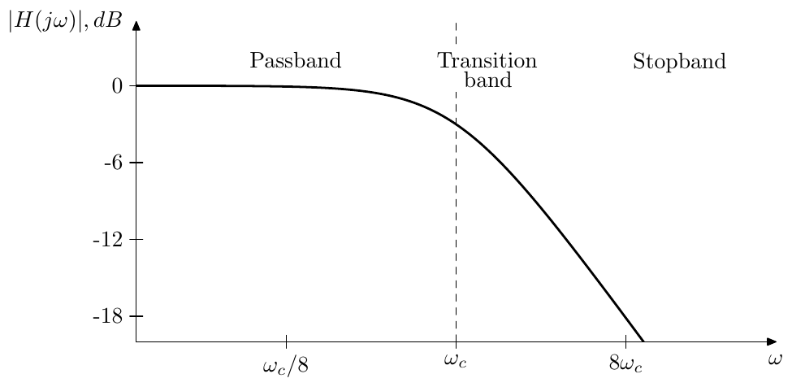

*Figure 2.4: Amplitude response of a 1-pole lowpass filter.*

The frequency range where $|H(j\omega)| \approx 1$ is referred to as the filter's *passband*.
The frequency range where $|H(j\omega)| \approx 0$ is referred to as the filter's *stopband*.
The frequency range between the passand and the stopband where $|H(j\omega)|$ is
changing from approximately 1 to approximately 0 is referred to as the
filter's *transition band*.[^12]

Notice that the plot falls off in an almost straight line as $\omega \to \infty$. Apparently,
at $\omega \gg \omega_c$ and respectively $|s| \gg \omega_c$ we have $H(s) \approx \omega_c/s$ and $|H(s)| \approx \omega_c/\omega$.
This is a hyperbola in the linear scale and a straight line in a fully
logarithmic scale. If $\omega$ doubles (corresponding to a step up by one octave),
the amplitude gain is approximately halved (that is, drops by approximately 6
decibel). We say that this lowpass filter has a *rolloff* of 6dB/oct.

Another property of this filter is that the amplitude drop at the cutoff is
$-3$dB. Indeed

$$
|H(j\omega_c)| = \left|\frac{\omega_c}{\omega_c+j\omega_c}\right| = \left|\frac{1}{1+j}\right| = \frac{1}{\sqrt2} \approx -3\mathrm{dB}
$$

The phase response of the 1-pole lowpass is respectively

$$
\arg H(j\omega) = \arg \frac{\omega_c}{\omega_c+j\omega}
$$

giving 0 at $\omega = 0$, $-\pi/4$ at the cutoff and $-\pi/2$ at $\omega \to +\infty$. With phase
response plots we don't want a logarithmic phase axis, but the logarithmic
frequency scale is usually desired. Fig. 2.5 illustrates.

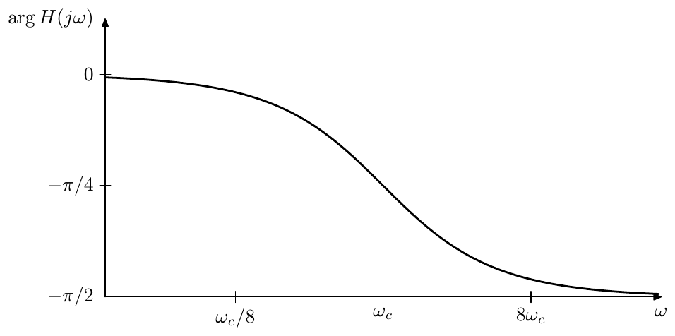

*Figure 2.5: Phase response of a 1-pole lowpass filter.*

Note that the phase response is close to zero in the passband, this will be a
property encountered in most of the filters that we deal with.

## 2.7 Cutoff parameterization

Suppose $\omega_c = 1$. Then the lowpass transfer function (2.5) turns into

$$
H(s) = \frac{1}{s+1}
$$

Now perform the substitution $s \leftarrow s/\omega_c$. We obtain

$$
H(s) = \frac{1}{s/\omega_c+1} = \frac{\omega_c}{s+\omega_c}
$$

which is again our familiar transfer function of the lowpass filter.

Consider the amplitude response graph of $1/(s+1)$ in a logarithmic scale. The
substitution $s \leftarrow s/\omega_c$ simply shifts this graph to the left or to the right
(depending on whether $\omega_c < 1$ or $\omega_c > 1$) without changing its shape. Thus,
the variation of the cutoff parameter doesn't change the shape of the
amplitude response graph (Fig. 2.6), or of the phase response graph, for that
matter (Fig. 2.7).

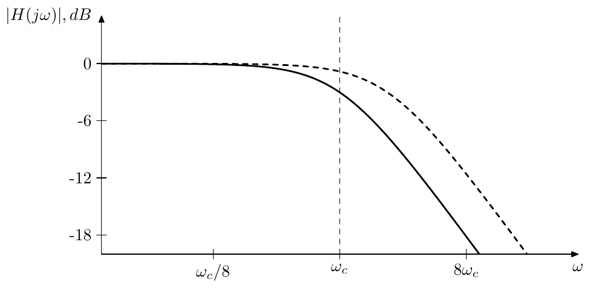

*Figure 2.6: 1-pole lowpass filter's amplitude response shift by a
cutoff change.*

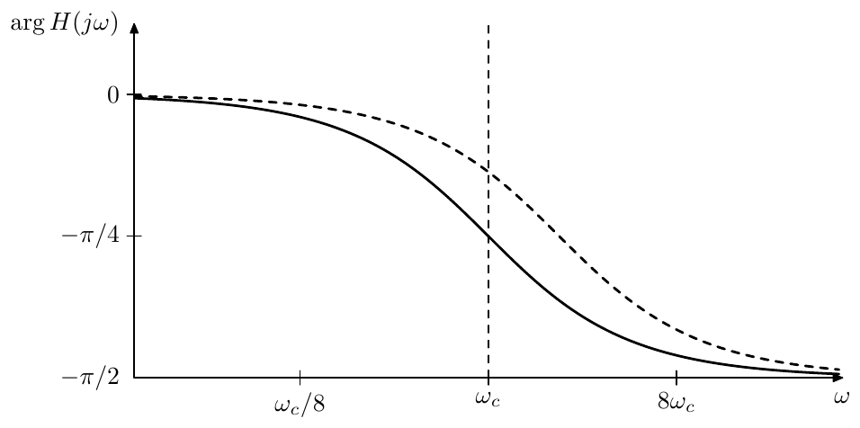

*Figure 2.7: 1-pole lowpass filter's phase response shift by a cutoff
change.*

The substitution $s \leftarrow s/\omega_c$ is a generic way to handle cutoff parameterization
for analog filters, because it doesn't change the response shapes. This has a
nice counterpart on the block diagram level. For all types of filters we simply visually
combine an $\omega_c$ gain and an integrator into a single block:[^13]

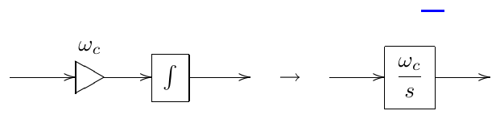

Apparently, the reason for the $\omega_c/s$ notation is that this is the transfer function of the serial connection of an $\omega_c$ gain and an integrator. Alternatively, we simply assume that the cutoff gain is contained inside the integrator:

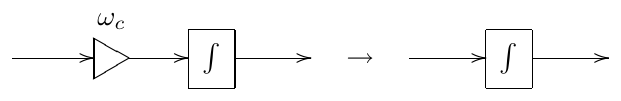

The internal representation of such integrator block is of course still a cutoff gain followed by an integrator. Whether the gain should precede the integrator or follow it may depend on the details of the analog prototype circuit. In the absence of the analog prototype it's better to put the gain *before* the integrator, because then the integrator will smooth the jumps and further artifacts arising out of the cutoff modulation. Another reason to put the cutoff gain before the integrator is that it has an important impact on the behavior of the filter in the time-varying case. We will discuss this aspect in Section 2.16.

With the cutoff gain implied inside the integrator block, the structure from Fig. 2.2 is further simplified to the one in Fig. 2.8:

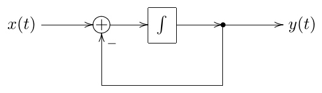

*Figure 2.8: A 1-pole RC lowpass filter with an implied cutoff.*

### Unit-cutoff notation

As a further shortcut arising out of the just discussed facts, it is common to assume $\omega_c = 1$ during the filter analysis. Particularly, the transfer function of a 1-pole lowpass filter is often written as

$$
H(s) = \frac{1}{s+1}
$$

It is assumed that the reader will perform the $s \leftarrow s/\omega_c$ substitution as necessary.

To illustrate the convenience of the unit cutoff notation we will obtain the explicit expression for the 1-pole lowpass phase response shown in Fig. 2.5:

$$
\arg H(j\omega) = \arg \frac{1}{1+j\omega} = -\arg(1+j\omega) = -\arctan\omega \tag{2.8}
$$

The formula (2.8) explains the apparent from Fig. 2.5 symmetry (relative to the point at $\omega = \omega_c$) of the phase response in the logarithmic frequency scale, as this symmetry is simply due to the property of the arctangent function:

$$
\arctan x + \arctan \frac{1}{x} = \frac{\pi}{2} \tag{2.9}
$$

## 2.8 Highpass filter

If instead of the capacitor voltage in Fig. 2.1 we pick up the resistor voltage as the output signal, we obtain the block diagram representation as in Fig. 2.9.

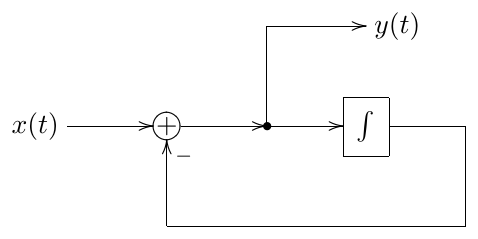

*Figure 2.9: A 1-pole highpass filter.*

Obtaining the transfer function of this filter we get

$$
H(s) = \frac{s}{s+\omega_c}
$$

or, in the unit-cutoff form,

$$
H(s) = \frac{s}{s+1}
$$

It's easy to see that $H(0) = 0$ and $H(+j\infty) = 1$, whereas the biggest change in the amplitude response occurs again around $\omega = \omega_c$. Thus, we have a *highpass filter* here. The amplitude response of this filter is shown in Fig. 2.10 (in the logarithmic scale).

It's not difficult to observe or show that this response is a mirrored version of the one in Fig. 2.4. Particularly, at $\omega \ll \omega_c$ we have $H(s) \approx s/\omega_c$, so when the frequency is halved (dropped by an octave), the amplitude gain is approximately halved as well (drops by approximately 6dB). Again, we have a 6dB/oct rolloff.

The phase response of the highpass is a $90^\circ$ shifted version of the lowpass phase response:

$$
\arg \frac{j\omega}{1+j\omega} = \frac{\pi}{2} + \frac{1}{1+j\omega}
$$

Fig. 2.11 illustrates. Note that the phase response in the passband is close to zero, same as we had for the lowpass.

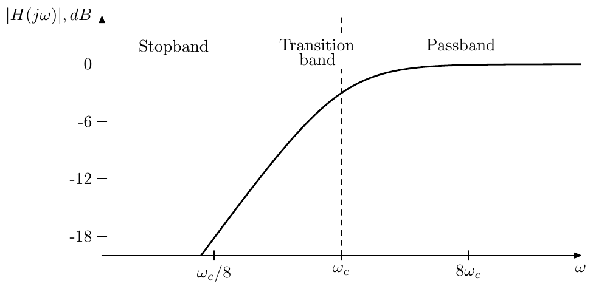

*Figure 2.10: Amplitude response of a 1-pole highpass filter.*

*Figure 2.11: Phase response of a 1-pole highpass filter.*

## 2.9 Poles and zeros

Poles and zeros are two very important concepts used in connection with filters. Now might be a good time to introduce them.

Consider the lowpass transfer function:

$$
H(s) = \frac{\omega_c}{s+\omega_c}
$$

Apparently, this function has a pole in the complex plane at $s = -\omega_c$. Similarly, the highpass transfer function

$$
H(s) = \frac{s}{s+\omega_c}
$$

also has a pole at $s = -\omega_c$, but it also has a zero at $s = 0$.

Recall that the transfer functions of linear time-invariant differential systems are nonstrictly proper rational functions of $s$. Writing any such function in the multiplicative form we obtain

$$
H(s) = g \cdot \frac{\prod_{n=1}^{N_z}(s-z_n)}{\prod_{n=1}^{N_p}(s-p_n)} \qquad (N_p \ge N_z \ge 0, \quad N_p \ge 1) \tag{2.10}
$$

where $N_p$ stands for the order of the denominator, simultaneously being the number of poles, and $N_z$ stands for the order of the numerator, simultaneously being the number of zeros. Thus such transfer functions always have poles and often have zeros. The poles and zeros of transfer function (especially the poles) play an important role in the filter analysis. For simplicity they are referred to as the poles and zeros of the filters.

The transfer functions of real linear time-invariant differential systems have real coefficients in the numerator and denominator polynomials. Apparently, this doesn't prevent them from having complex poles and zeros, however, being roots of real polynomials, those must come in complex conjugate pairs. E.g. a transfer function with a 3rd order denominator can have either three real poles, or one real and two complex conjugate poles.

The 1-pole lowpass and highpass filters discussed so far, each have one pole. For that reason they are referred to as 1-pole filters. Actually, the number of poles is always equal to the order of the filter or (which is the same) to the number of integrators in the filter.[^14] Therefore it is common, instead of e.g. a "4th-order filter" to say a "4-pole filter".

The number of poles therefore provides one possible way of classification of filters. It allows to get an approximate idea of how complex the filter is and also often allows to estimate some other filter properties without knowing lots of extra detail. The number of zeros in the filter is usually less important and therefore typically is not used for classification.

### Finite and infinite zeros/poles

Equation (2.10) assumes that all $p_n$ and $z_n$ are finite. However often (especially when dealing with complex numbers) it is convenient to include the infinity into the set of "allowed" values. Respectively, if $N_z < N_p$ we will say that $H(s)$ has a zero of order $N_p - N_z$ at the infinity. E.g. the 1-pole lowpass transfer function has a zero of order 1 at the infinity.

Conversely, if $N_p > N_z$ we could say that $H(s)$ has a pole of order $N_p - N_z$ at the infinity, however this situation won't occur for a transfer function of a differential filter, since $N_z$ cannot exceed $N_p$.

Apparently, zeros at the infinity are not a part of the explicit factoring (2.10) and occur implicity simply due to the difference of the numerator and denominator orders. Even though they don't show up in (2.10) they may occasionally show up in other formulas or transformations. Thus, whether the infinite zeros (or also poles, if we deal with other rational functions) are included into the set of zeros/poles under consideration depends on the context. Unless explicitly mentioned, usually only finite zeros and poles are meant, however the readers are encouraged to use their own judgement in this regard.

Notice that if zeros/poles at the infinity are included, the total number of zeros is always equal to the total number of poles.

### Rolloff

In (2.10) let $\omega \to +\infty$. Apparently, this is the same as simply letting $s \to \infty$ and therefore we obtain

$$
H(s) \sim \frac{g}{s^{N_p - N_z}} \qquad (s \to \infty)
$$

as the asymptotic behavior, which means that the amplitude response rolloff speed at $\omega \to +\infty$ is $6(N_p - N_z)$dB/oct.

Now suppose some of the zeros of $H(s)$ are located at $s = 0$ and let $N_{z0}$ be the number of such zeros. Then, for $\omega \to 0$ we obtain

$$
H(s) \sim g \cdot s^{N_{z0}} \qquad (s \to 0)
$$

(assuming there are no poles at $s = 0$). Therefore the amplitude response rolloff speed at $\omega \to 0$ is $6N_{z0}$dB/oct. Considering that $0 \le N_{z0} \le N_z \le N_p$, the rolloff speed at $\omega \to +\infty$ or at $\omega \to 0$ can't exceed $6N_p$dB/oct. Also, if all zeros of a filter are at $s = 0$ (that is $N_{z0} = N_z$) then the sum of the rolloff speeds at $\omega \to 0$ and $\omega \to +\infty$ is exactly $6N_p$dB/oct.

The case of 0dB/oct rolloff deserves a special attention. The 0dB/oct at $\omega \to +\infty$ occurs when $N_p = N_z$. Respectively $H(s) \to g$ as $s \to \infty$. Since $g$ must be real, it follows that so is $H(\infty)$, thus we arrive at the following statement: if $H(\infty) \neq 0$, then the phase response at the infinity is either $0^\circ$ or $180^\circ$. The same statement applies for $\omega \to 0$ if $N_{z0} = 0$, where we simply notice that $H(0)$ must be real due to $H(j\omega)$ being Hermitian.[^15] The close-to-zero phase response in the passbands of 1-pole low- and high-passes is a particular case of this property.

### Stability

The other, probably even more important property of the poles (but not zeros) is that they determine the stability of the filter. A filter is said to be *stable* (or, more exactly, BIBO-stable, where BIBO stands for "bounded input bounded output") if for any bounded input signal the resulting output signal is also bounded. In comparison, unstable filters "explode", that is, given a bounded input signal (e.g. a signal with the amplitude not exceeding unity), the output signal of such filter will grow indefinitely.

It is known that a filter[^16] is stable if and only if all its poles are located in the left complex semiplane (that is to the left of the imaginary axis).[^17] For our lowpass and highpass filters this is apparently true, as long as $\omega_c > 0$. If $\omega_c < 0$, the pole is moved to the right semiplane, the filter becomes unstable and will "explode". This behavior can be conveniently explained in terms of the *transient response* of the filters and we will do so later.

We have established by now that if we put a sinusoidal signal through a stable filter we will obtain an amplitude-modified and phase-shifted sinusoidal signal of the same frequency (after the effects of the initial state, if such were initially present, disappear). In an unstable filter the effects of the initial state do not decay with time, but, on the opposite, infinitely grow, thus the output will not be the same kind of a sinusoidal signal and it doesn't make much sense to take of amplitude and phase responses, except maybe formally.

It is possible to obtain an intuitive understanding of the effect of the pole position on the filter stability. Consider a transfer function of the form (2.10) and suppose all poles are initially in the left complex semiplane. Now imagine one of the poles (let's say $p_1$) starts moving towards the imaginary axis. As the pole gets closer to the axis, the $(s - p_1)$ factor in the denominator becomes smaller around $\omega = \operatorname{Im} p_1$ and thus the amplitude response at $\omega = \operatorname{Im} p_1$ grows. When $p_1$ gets onto the axis, the amplitude response at $\omega = \operatorname{Im} p_1$ is infinitely large (since $j\omega = p_1$, we have $H(j\omega) = H(p_1) = \infty$). This corresponds to the filter getting unstable.[^18]

It should be stressed once again, that the concepts of poles and zeros are bound to the concept of the transfer function and thus are properly defined only if the filter's parameters are not modulated. Sometimes one could talk about poles and/or zeros moving with time, but this is rather a convenient way to describe particular aspects of the change in the filter's parameters rather than a formally correct way. Although, if the poles and zeros are moving "slowly enough", this way of thinking could provide a good approximation of what's going on.

### Cutoff

The cutoff control is defined as $s \leftarrow s/\omega_c$ substitution. Given a transfer function denominator factor $(s - p)$, after the cutoff substitution it becomes $(s/\omega_c - p)$. The pole associated with this factor becomes defined by the equation

$$
s/\omega_c - p = 0
$$

which gives $s = \omega_c p$. This means that the pole position is changed from $p$ to $\omega_c p$.

Obviously, the same applies for zeros.

### Minimum and maximum phase

Consider a change to a filter's transfer function (2.10) where we flip one of the poles or zeros symmetrically with respect to the imaginary axis.[^19] E.g. we replace $p_1$ with $-p_1^*$ or $z_1$ with $-z_1^*$. Apparently, such change doesn't affect the amplitude response of the filter.

Indeed, a pole's contribution to the amplitude response is, according to (2.10), $|j\omega - p_n|$, which is the distance from the pole $p_n$ to the point $j\omega$. However the distance from the point $-p_n^*$ to $j\omega$ is exactly the same, thus replacing $p_n$ with $-p_n^*$ doesn't change the amplitude response (Fig. 2.12). The same applies to the situation when we change a zero from $z_n$ to $-z_n^*$.

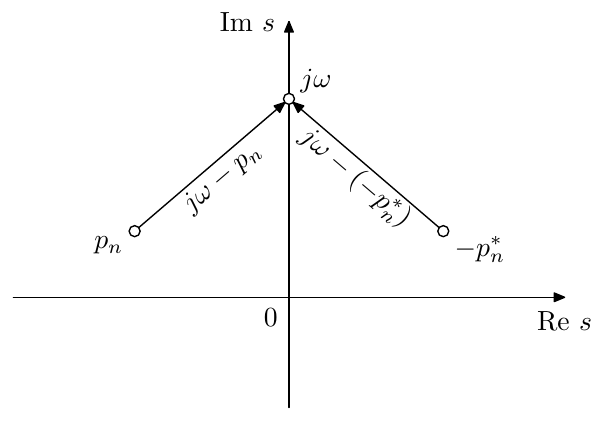

*Figure 2.12: Contribution to the amplitude response from two symmetric points.*

Flipping a pole symmetrically with respect to the imaginary axis normally doesn't make much sense, since this would turn a previously stable filter into an unstable one. Even though sometimes we will be specifically interested in using unstable filters (particularly if the filter is nonlinear), such flipping is not very useful. The point of the flipping is preserving the amplitude response and, as we mentioned, the concept of the amplitude response doesn't really work in the case of an unstable filter.

The situation is very different with zeros, though. Zeros can be located in both left and right semiplanes without endangering filter's stability. Therefore we could construct filters with identical amplitude responses, differing only in which of the zeros are positioned to the left and which to the right of the imaginary axis. Even though the amplitude response is not affected by this, the phase response apparently is, and this could be the reason to chose between the two possible positions of each (or all) of the zeros.

Qualitatively comparing the effect of the positioning a zero to the left or to the right, consider the following. A zero located to the left of the imaginary axis makes a contribution to the phase response which varies from $-90^\circ$ to $+90^\circ$ as $\omega$ goes from $-\infty$ to $+\infty$. A zero located on the right makes a contribution which varies from $+90^\circ$ to $-90^\circ$. That is, in the first case the phase is increasing by $180^\circ$ as $\omega$ goes from $-\infty$ to $+\infty$, in the second case it is decreasing by $180^\circ$.

The phase is defined modulo $360^\circ$ and generally we cannot compare two different values of the phase. E.g. if we have two values $\varphi_1 = +120^\circ$ and $\varphi_2 = -90^\circ$, we can't say for sure, whether $\varphi_1$ is larger than $\varphi_2$ by $210^\circ$, or whether $\varphi_1$ is smaller than $\varphi_2$ by $150^\circ$. So, we only can reliably compare continuous changes to the phase. In the case of comparing the positioning of a zero in the left or right complex semiplane, we can say that in one case the phase will be growing and in the other it will be decreasing.

If all zeros are in the left semiplane, then the phase will be increasing as much as possible, the total contribution of all zeros to the phase variation on $\omega \in (-\infty, +\infty)$ being equal to $+180^\circ \cdot N_z$. If all zeros are in the right semiplane, then the phase will be decreasing as much as possible, the total contribution being $-180^\circ \cdot N_z$. Assuming the filter is stable, all its poles are in the left semiplane. The factors corresponding to the poles are contained in the denominator of the transfer function, therefore left-semiplane poles contribute to the decreasing of the phase, the total contribution being $-180^\circ \cdot N_p$.

If all zeros are positioned in the left semiplane, the total phase variation is $-180^\circ \cdot (N_p - N_z)$. If all zeros are positioned in the right semiplane, the total phase variation is $-180^\circ \cdot (N_p + N_z)$. Since $0 \le N_z \le N_p$, the absolute total phase variation in the second case is as large as possible, whereas in the first case it is as small as possible. For that reason the filters and/or transfer functions having all zeros in the left semiplane are referred to as *minimum phase*, and respectively the filters and/or transfer functions having all zeros in the right semiplane are referred to as *maximum phase*.[^20]

## 2.10 LP to HP substitution

The symmetry between the lowpass and the highpass 1-pole amplitude responses has an algebraic explanation. The 1-pole highpass transfer function can be obtained from the 1-pole lowpass transfer function by the *LP to HP* (lowpass to highpass) *substitution*:

$$
s \leftarrow 1/s
$$

Applying the same substitution to a highpass 1-pole we obtain a lowpass 1-pole. The name "LP to HP substitution" originates from the fact that a number of filters are designed as lowpass filters and then are being transformed to their highpass versions. Occasionally we will also refer to the LP to HP substitution as *LP to HP transformation*, where essentially there won't be a difference between the two terms.

Recalling that $s = j\omega$, the respective transformation of the imaginary axis is $j\omega \leftarrow 1/j\omega$ or, equivalently

$$
\omega \leftarrow -1/\omega
$$

Recalling that the amplitude responses of real systems are symmetric between positive and negative frequencies ($|H(j\omega)| = |H(-j\omega)|$) we can also write

$$
\omega \leftarrow 1/\omega \qquad \text{(for amplitude response only)}
$$

Taking the logarithm of both sides gives:

$$
\log \omega \leftarrow -\log \omega \qquad \text{(for amplitude response only)}
$$

Thus, the amplitude response is flipped around $\omega = 1$ in the logarithmic scale.

The LP to HP substitutions also transforms the filter's poles and zeros by the same formula:

$$
s' = 1/s
$$

where we substitute pole and zero positions for $s$. Clearly this transformation maps the complex values in the left semiplane to the values in the left semiplane and the values in the right semiplane to the right semiplane. Thus, the LP to HP substitution exactly preserves the stability of the filters.

Notice that thereby a zero occuring at $s = 0$ will be transformed into a zero at the infinity and vice versa (this is the main example of why we sometimes need to consider zeros at the infinity). Particularly, the zero at $s = \infty$ of the 1-pole lowpass filter is transformed into the zero at $s = 0$ of the 1-pole highpass filter.

The LP to HP substitution can be performed not only algebraically (on a transfer function), but also directly on a block diagram, if we allow the usage of differentiators. Since the differentiator's transfer function is $H(s) = s$, replacing all integrators by differentiators will effectively perform the $1/s \leftarrow s$ substitution, which apparently is the same as the $s \leftarrow 1/s$ substitution. Shall the usage of the differentiators be forbidden, it might still be possible to convert differentiation to the integration by analytical transformations of the equations expressed by the block diagram.

## 2.11 Multimode filter

Actually, we can pick up the lowpass and highpass signals simultaneously from the same structure (Fig. 2.13). This is referred to as a *multimode filter*.

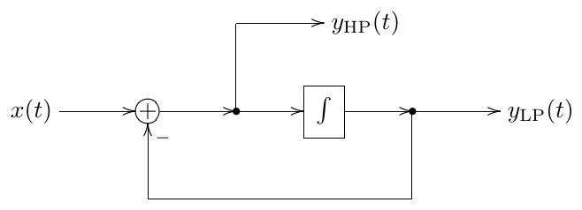

*Figure 2.13: A 1-pole multimode filter.*

It's easy to observe that $y_{\text{LP}}(t) + y_{\text{HP}}(t) = x(t)$, that is the input signal is split by the filter into the lowpass and highpass components. In the transfer function form this corresponds to

$$
H_{\text{LP}}(s) + H_{\text{HP}}(s) = \frac{\omega_c}{s+\omega_c} + \frac{s}{s+\omega_c} = 1
$$

The multimode filter can be used to implement almost any 1st-order stable differential filter by simply mixing its outputs. Indeed, let

$$
H(s) = \frac{b_1 s + b_0}{s + a_0}
$$

where we assume $a_0 \neq 0$.[^21] Letting $\omega_c = a_0$ we obtain

$$
H(s) = \frac{b_1 s + b_0}{s + \omega_c} = b_1 \frac{s}{s+\omega_c} + \frac{b_0}{\omega_c} \cdot \frac{\omega_c}{s+\omega_c} = b_1 H_{\text{HP}}(s) + \left(\frac{b_0}{\omega_c}\right) H_{\text{LP}}(s)
$$

Thus we simply need to set the filter's cutoff to $a_0$ and take the sum

$$
y = b_1 y_{\text{HP}}(t) + \left(\frac{b_0}{\omega_c}\right) y_{\text{LP}}(t)
$$

as the output signal.

Normally (although not always) we are interested in the filters whose responses do not change the shape under cutoff variation, but are solely shifted to the left or to the right in the logarithmic frequency scale. Such modal mixtures are easiest written in the unit-cutoff form:

$$
H(s) = \frac{b_1 s + b_0}{s+1} = b_1 \frac{s}{s+1} + b_0 \frac{1}{s+1}
$$

where we actually imply

$$
H(s) = \frac{b_1(s/\omega_c) + b_0}{(s/\omega_c) + 1}
$$

Respectively, the mixing coefficients become independent of the cutoff:

$$
y = b_1 y_{\text{HP}}(t) + b_0 y_{\text{LP}}(t)
$$

Fig. 2.14 illustrates.

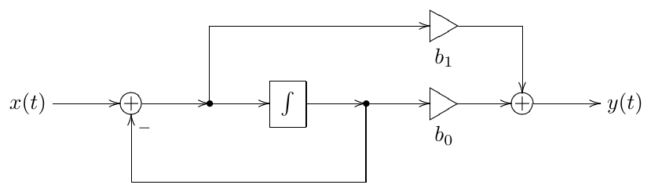

*Figure 2.14: Modal mixture with 1-pole multimode filter implementing $H(s) = (b_1 s + b_0)/(s + 1)$.*

## 2.12 Shelving filters

By adding/subtracting the lowpass-filtered signal to/from the unmodified input
signal one can build a low-shelving filter:

$$
y(t) = x(t) + K \cdot y_{\text{LP}}(t)
$$

The transfer function of the low-shelving filter is respectively:

$$
H(s) = 1 + K\frac{1}{s+1}
$$

The amplitude response is plotted Fig. 2.15. Typically $K \ge -1$. At $K = 0$
the signal is unchanged. At $K = -1$ the filter turns into a highpass.

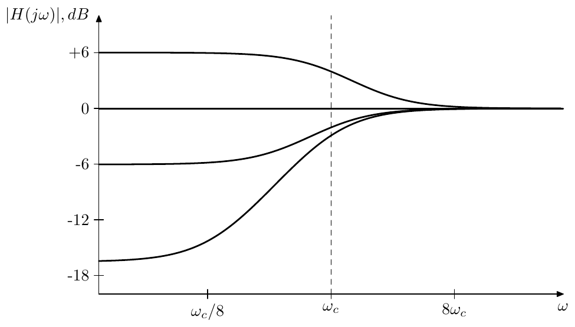

*Figure 2.15: Amplitude response of a 1-pole low-shelving filter (for
various $K$).*

The high-shelving filter is built in a similar way:

$$
y(t) = x(t) + K \cdot y_{\text{HP}}(t)
$$

and

$$
H(s) = 1 + K\frac{s}{s+1}
$$

The amplitude response is plotted Fig. 2.16.

Actually, it would be more convenient to specify with the fact that the
amplitude boost or drop for the "shelf" in decibels. It's not difficult to
realize that the decibel boost is

$$
G_{\text{dB}} = 20\log_{10}(K+1)
$$

Indeed, e.g. for the low-shelving filter at $\omega = 0$ (that is $s = 0$) we
have[^22]

$$
H(0) = 1 + K
$$

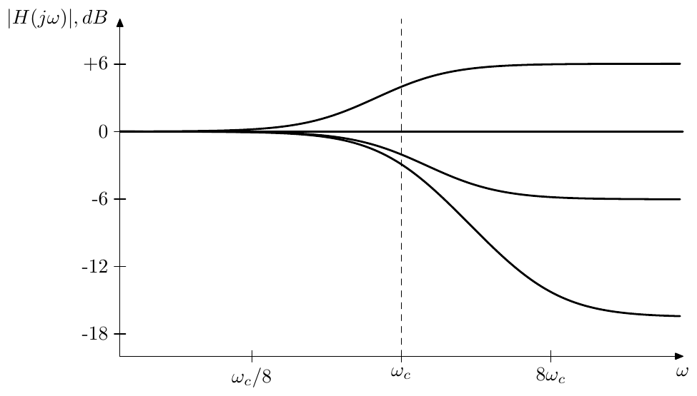

*Figure 2.16: Amplitude response of a 1-pole high-shelving filter
(for various $K$).*

We also obtain $H(+j\infty) = 1 + K$ for the high-shelving filter.

There is, however, a problem with the shelving filters built this way. Even
though these filters do work as a shelving filters, the definition of the
cutoff at $\omega = 1$ for such filters is not really convenient. Indeed,
looking at the amplitude response graphs in Figs. 2.15 and 2.16 we would
rather wish to have the cutoff point positioned exactly at the middle of the
respective slopes. A solution to this problem will be described in
Chapter 10.

## 2.13 Allpass filter

The ideas explained in the discussion of the minimum and maximum phase
properties of a filter can be used to construct an allpass flter. Since in
this chapter our focus is on 1-poles, we will construct a 1-pole allpass but
the same approach generalizes to an allpass of an arbitrary order.

Starting with an identity 1-pole transfer function

$$
H(s) = \frac{s+1}{s+1} \equiv 1
$$

and noticing that this is a minimum phase filter, let's flip its zero
symmetrically with respect to the imaginary axis, thereby turning it into a
maximum phase filter:

$$
H(s) = \frac{s-1}{s+1} \tag{2.11}
$$

As we discussed before, such change can't affect the amplitude response of
the filter and thus

$$
|H(j\omega)| = \left|\frac{j\omega-1}{j\omega+1}\right| \equiv 1
$$

On the other hand the phase response has changed from $\arg H(j\omega) \equiv
0$ to some decreasing function of $\omega$ (Fig. 2.17).

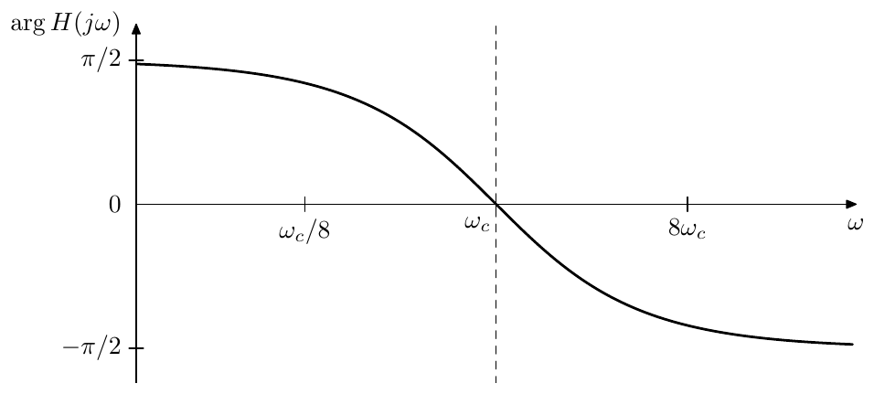

*Figure 2.17: Phase response of the 1-pole allpass filter (2.11).*

The filters whose purpose is to affect only the phase of the signal, not
touching the amplitude part at all, are referred to as allpass
filters.[^23] Obviously, (2.11) is a 1-pole allpass. However it's not the
only possible one.

Apparently, multiplying a transfer function by $-1$ doesn't change the
amplitude response. Therefore, multiplying the right-hand side of (2.11) by
$-1$ we obtain another 1-pole allpass.

$$
H(s) = \frac{1-s}{1+s} \tag{2.12}
$$

This one differs from the one in (2.11) by the fact that the phase response
of (2.12) is changing from $0$ to $-\pi$ (Fig. 2.18) whereas the phase of
(2.11) is changing from $+\pi/2$ to $-\pi/2$. Often it's more convenient, if
the allpass filter's phase response starts at zero, which could be a reason
for preferring (2.12) over (2.11).

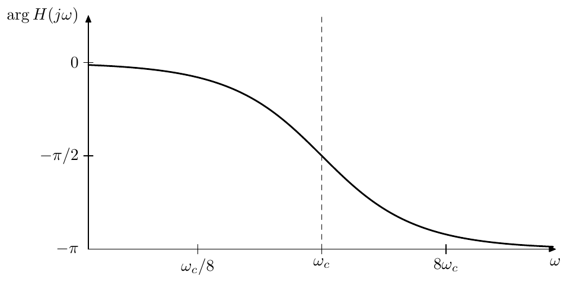

*Figure 2.18: Phase response of the 1-pole allpass filter (2.12).*

Notably, the phase response of the allpass (2.12) (Fig. 2.18) is the doubled
phase response of the 1-pole lowpass (Fig. 2.7). It is easy to realize that
the reason for this is that the numerator $(1-s)$ contributes exactly the
same amount to the phase response as the denominator $(1+s)$:

$$
\arg\frac{1-j\omega}{1+j\omega} = \arg(1-j\omega) - \arg(1+j\omega) = -2\arg(1+j\omega) = -2\arctan\omega \tag{2.13}
$$

where the symmetry of the phase response in Fig. 2.18 is due to (2.9).

Noticing that

$$
H(s) = \frac{1-s}{1+s} = \frac{1}{1+s} - \frac{s}{1+s} = H_{\text{LP}}(s) - H_{\text{HP}}(s)
$$

we find that the allpass (2.12) can be obtained by simply subtracting the
highpass output from the lowpass output of the multimode filter, the opposite
order of subtraction creating the (2.11) allpass.

As mentioned earlier, the same approach can in principle be used to
construct arbitrary allpasses. Starting with a stable filter

$$
H(s) = \frac{\displaystyle\prod_{n=1}^{N}(s-p_n)}{\displaystyle\prod_{n=1}^{N}(s-p_n)} \equiv 1
$$

we flip all zeros over to the right complex semiplane, turning $H(s)$ into a
maximum phase filter:

$$
H(s) = \frac{\displaystyle\prod_{n=1}^{N}(s+p_n^*)}{\displaystyle\prod_{n=1}^{N}(s-p_n)}
$$

where we might invert the result to make sure that $H(0) = 1$

$$
H(s) = (-1)^N \cdot \frac{\displaystyle\prod_{n=1}^{N}(s+p_n^*)}{\displaystyle\prod_{n=1}^{N}(s-p_n)}
$$

In practice, however, high order allpasses are often created by simply
connecting several of 1- and 2-pole allpasses in series.

## 2.14 Transposed multimode filter

We could apply the transposition to the block diagram in Fig. 2.13. The
transposition process is defined as reverting the direction of all signal
flow, where forks turn into summators and vice versa (Fig. 2.19).[^24] The
transposition keeps the transfer function relationship within each pair of
an input and an output (where the input becomes the output and vice versa).
Thus in Fig. 2.19 we have a lowpass and a highpass input and a single output.

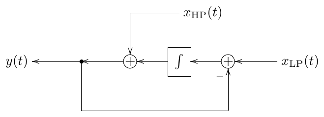

*Figure 2.19: A 1-pole transposed multimode filter.*

Looking carefully at Fig. 2.19 we would notice that the lowpass part of the
structure is fully identical to the non-transposed lowpass. The highpass part
differs solely by the relative order of the signal inversion and the
integrator in the feedback loop. It might seem therefore that the ability to
accept multiple inputs with different corresponding transfer functions is the
only essential difference of the transposed filter from the non-transposed
one.

This is not fully true, if time-varying usage of the filter is concerned.
Note that if the modal mixture is involved, the gains corresponding to the
transfer function numerator coefficients will precede the filter (Fig. 2.20).
Thus, if the mixing coefficients vary with time, the coefficient variations
will be smoothed down by the filter (especially the lowpass coefficient, but
also to an extent the highpass one), in a similar way to how the cutoff
placement prior to the integrator helps to smooth down cutoff variations.
Compare Fig. 2.20 to Fig. 2.14.

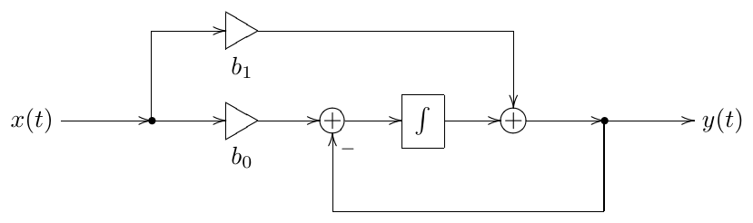

*Figure 2.20: 1-pole transposed multimode filter implementing
$H(s) = (b_1 s + b_0)/(s + 1)$.*

One particularly useful case of the transposed 1-pole's multi-input feature,
is feedback shaping. Imagine we are mixing an input signal $x_{\text{in}}(t)$
with a feedback signal $x_{\text{fbk}}(t)$, and we wish to filter each one of
those by a 1-pole filter, and the cutoffs of these 1-pole filters are
identical. That is, the transfer functions of those filters share a common
denominator. Then we could use a single transposed 1-pole multimode filter as
in Fig. 2.21. The mixing coefficients $A$, $B$, $C$ and $D$ define the
numerators of the respective two transfer functions.

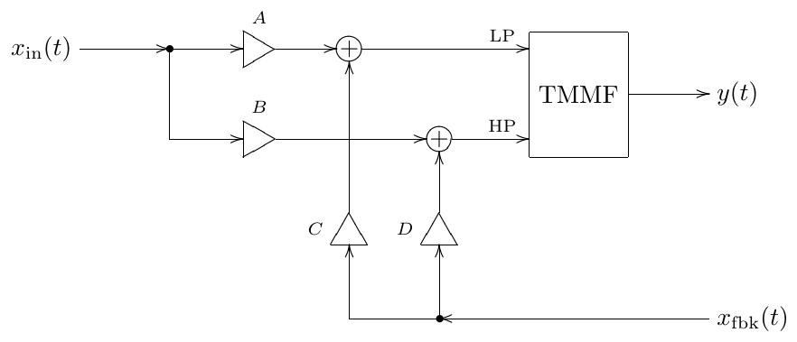

*Figure 2.21: A transposed multimode filter (TMMF) used for feedback
signal mixing.*

## 2.15 Transient response

For a 1-pole filter it is not difficult to obtain an explicit expression for
the filter's output, given the filter's input. Indeed, let's rewrite (2.2)
in terms of $\omega_c$:

$$
\dot{y}(t) = \omega_c \cdot (x(t) - y(t))
$$

We can further express $\omega_c$ in terms of the system pole $p = -\omega_c$:

$$
\dot{y} = p \cdot (y - x) \tag{2.14}
$$

Writing the system equation in terms of the pole will prove to be useful,
when we reuse the results obtained in this section in later chapters of the
book.

Rewriting (2.14) in a slightly different way we obtain

$$
\dot{y} - py = -px \tag{2.15}
$$

Multiplying both sides by $e^{-pt}$:

$$
e^{-pt}\dot{y} - pe^{-pt}y = -pe^{-pt}x
$$

and noticing that the left-hand size is a derivative of $e^{-pt}y(t)$ we have

$$
\frac{\mathrm{d}}{\mathrm{d}t}(e^{-pt}y) = -pe^{-pt}x
$$

Integrating both sides from 0 to $t$ with respect to $t$:

$$
e^{-pt}y(t) - y(0) = -p\int_0^t e^{-p\tau}x(\tau)\,\mathrm{d}\tau
$$

$$
e^{-pt}y(t) = y(0) - p\int_0^t e^{-p\tau}x(\tau)\,\mathrm{d}\tau
$$

Multiplying both sides by $e^{pt}$:

$$
y(t) = y(0)e^{pt} - p\int_0^t e^{p(t-\tau)}x(\tau)\,\mathrm{d}\tau \tag{2.16}
$$

we obtain a formula which allows us to *explicitly* compute the filter's
output, knowing the filter's input and initial state.

Now suppose $x(t) = X(s)e^{st}$. Then (2.16) implies

$$
\begin{aligned}
y(t) &= y(0)e^{pt} - pe^{pt}X(s)\int_0^t e^{(s-p)\tau}\,\mathrm{d}\tau = \\
&= y(0)e^{pt} - pe^{pt}X(s)\cdot\frac{e^{(s-p)\tau}}{s-p}\bigg|_{\tau=0}^{t} = \\
&= y(0)e^{pt} - pe^{pt}X(s)\cdot\frac{e^{(s-p)t}-1}{s-p} = \\
&= \left(y(0) - \frac{-p}{s-p}X(s)\right)e^{pt} + \frac{-p}{s-p}X(s)e^{st} = \\
&= (y(0) - H(s)X(s))\,e^{pt} + H(s)X(s)e^{st} = \\
&= (y(0) - H(s)x(0))\,e^{pt} + H(s)x(t) = \\
&= H(s)x(t) + (y(0) - H(s)x(0))\,e^{pt}
\end{aligned}
\tag{2.17}
$$

where

$$
H(s) = \frac{-p}{s-p} = \frac{\omega_c}{s+\omega_c}
$$

is the filter's transfer function.

Now look at the last expression of (2.17). The first term corresponds to
(2.6). This is the output of the filter which we would expect according to
our previous discussion. The second term looks new, but, since normally
$p < 0$, this term is exponentially decaying with time. Thus at some moment
the second term becomes negligible and only the first term remains. We say
that the filter has entered a *steady state* and refer to $H(s)x(t)$ as the
*steady-state response* of the filter (for the complex exponential input
signal $x(t) = X(s)e^{st}$). The other term, which is exponentially decaying
and exists only for a certain period of time is called the *transient
response*.

Now we would like to analyse the general case, when the input signal is a
sum of such exponential signals:

$$
x(t) = \int_{\sigma-j\infty}^{\sigma+j\infty} X(s)e^{st}\,\frac{\mathrm{d}s}{2\pi j}
$$

First, assuming $y(0) = 0$ and using the linearity of (2.16), we apply (2.17)
independently to each partial $X(s)e^{st}$ of $x(t)$, obtaining

$$
y(t) = \int H(s)X(s)e^{st}\,\frac{\mathrm{d}s}{2\pi j} - e^{pt}\int H(s)X(s)\,\frac{\mathrm{d}s}{2\pi j} \tag{2.18}
$$

Again, the first term corresponds to (2.6) and is the steady-state response.
Respectively, the second term, which is exponentially decaying (notice that
the integral in the second term is simply a constant, not changing with
$t$), is the transient response.

Comparing (2.18) to (2.16) we can realize that the difference between
$y(0) = 0$ and $y(0) \neq 0$ is simply the addition of the term $y(0)e^{pt}$.
Thus we simply add the missing term to (2.18) obtaining

$$
\begin{aligned}
y(t) &= \int H(s)X(s)e^{st}\,\frac{\mathrm{d}s}{2\pi j} + \left(y(0) - \int H(s)X(s)\,\frac{\mathrm{d}s}{2\pi j}\right)\cdot e^{pt} = \\
&= y_s(t) + (y(0) - y_s(0))\cdot e^{pt} = y_s(t) + y_t(t)
\end{aligned}
\tag{2.19}
$$

where

$$
y_s(t) = \int H(s)X(s)e^{st}\,\frac{\mathrm{d}s}{2\pi j} \tag{2.20a}
$$

$$
y_t(t) = (y(0) - y_s(0))\cdot e^{pt} \tag{2.20b}
$$

are the steady-state and transient responses.

Looking at (2.20) we can give the following interpretation to the
steady-state and transient responses. Steady-state response is the
"expected" response of the filter in terms of the spectrum of $x(t)$ and the
transfer function $H(s)$, this is the part of the filter's output that we
have been exclusively dealing with until now and this is the part that we
will continue being interested in most of the time. Particularly, this is
the part of the filter's output for which the terms amplitude and phase
response are making sense. However, at the initial time moment the filter's
output will usually not match the expected response ($y(0) \neq y_s(0)$),
since the initial filter state may be arbitrary. Even if $y(0) = 0$, we still
usually have $y_s(0) \neq 0$. But the integrator's state cannot change
abruptly[^25] and therefore there will be a difference between the actual and
"expected" outputs. This difference however decays exponentially as $e^{pt}$.
This exponentially decaying part, caused by a discrepancy between the
"expected" output and the actual state of the filter is the transient
response (Fig. 2.22).

The origin of the term "steady-state response" should be obvious by now. As
for the term "transient response" things might be a bit more subtle, but
actually it's also quite simple.

Suppose the input of the filter is receiving a steady signal, e.g. a
periodic wave and suppose the filter has entered the steady state by
$t = t_0$ (meaning that the transient response became negligibly small).
Suppose that at $t = t_0$ a *transient* occurs in the input signal: the
filter's input suddenly changes to some other steady signal, e.g. it has a
new waveform, or amplitude, or frequency, or all of that. This means that at
this moment the definition of the steady state also changes and the filter's
output does no longer match the "expected" signal. Thus, at $t = t_0$ we
suddenly have $y_s(t) \neq y(t)$ and a decaying transient response impulse is
generated. The transient response turns a sudden jump, which would have
occured in the filter's output due to the switching of the input signal, into
a continuous exponential "crossfade".

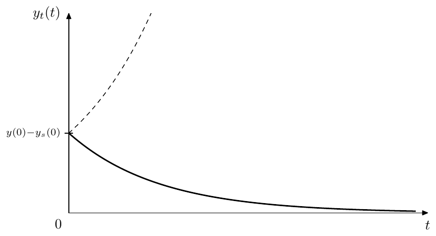

*Figure 2.22: Transient response of a 1-pole lowpass filter (dashed
line depicts the unstable case).*

### Highpass transient response

For a highpass, since $y_{\text{HP}}(t) = x(t) - y_{\text{LP}}(t) = x(t) - y$,
equation (2.19) converts into

$$
y_{\text{HP}}(t) = x(t) - (y_s(t) + y_t(t)) = (x(t) - y_s(t)) - y(t) = y_{\text{HPs}}(t) + y_{\text{HPt}}(t)
$$

where the highpass steady-state response is

$$
\begin{aligned}
y_{\text{HPs}}(t) &= x(t) - y_s(t) = x(t) - \int H(s)X(s)e^{st}\,\frac{\mathrm{d}s}{2\pi j} = \\
&= \int X(s)e^{st}\,\frac{\mathrm{d}s}{2\pi j} - \int H(s)X(s)e^{st}\,\frac{\mathrm{d}s}{2\pi j} = \\
&= \int (1-H(s))X(s)e^{st}\,\frac{\mathrm{d}s}{2\pi j} = \int H_{\text{HP}}(s)X(s)e^{st}\,\frac{\mathrm{d}s}{2\pi j}
\end{aligned}
$$

and the highpass transient response is

$$
\begin{aligned}
y_{\text{HPt}}(t) &= -y_t(t) = -(y(0) - y_s(0))\cdot e^{pt} = \\
&= ((x(t)-y(0)) - (x(t)-y_s(0)))\cdot e^{pt} = (y_{\text{HP}}(0) - y_{\text{HPs}}(0))\cdot e^{pt}
\end{aligned}
$$

That is we are having the same kind of exponentially decaying discrepancy
between the output signal and the steady-state signal, where the exponent
$e^{pt}$ itself is identical to the one in the lowpass transient response.

### Poles and stability

At this point we could get a first hint at the mechanism behind the
relationship between the filter poles and filter stability. The transient
response of the 1-pole filter decays as $e^{pt}$ (this means it it takes
longer time to reach a steady state at lower cutoffs). However, if $p > 0$,
the transient response doesn't decay, but instead infinitely grows with time
(as shown by the dashed line in Fig. 2.22), and we say that the filter
"explodes".

At $p = 0$ the 1-pole lowpass filter doesn't explode, but stays at the same
value (since $p = 0$ implies $\dot y = 0$ for this filter), corresponding to
the marginally stable case. But this actually happens because of the specific
form of the transfer function we are using: $H(s) = -p/(s-p)$. Thus, $p = 0$
simultaneously implies a zero total gain, which prevents the explosion.

However, in a more general case, a marginally stable 1-pole filter can
explode. We are going to discuss this using Jordan 1-poles.

### Steady state

The steady-state response is actually not a precisely defined concept, as it
has a subjective element. A bit earler we have been analysing the situation
of an abrupt change of the input signal causing a discrepancy between the
steady-state response and the actual output signal, this discrepancy being
responsible for the appearance of the transient response term. However we
don't have to understand this case as an abrupt change of the input signal.
Instead we could consider the input signal over the entire time duration as a
whole incorporating the abrupt change as an integral part of the signal. E.g.
instead of considering the input signal changing from $\sin t$ to
$2\sin(4t+1)$ at some moment $t = t_0$, we would formally consider a
non-periodic signal $x(t)$ defined as

$$
x(t) = \begin{cases} \sin t & \text{if } t < t_0 \\ 2\sin(4t+1) & \text{if } t \geq t_0 \end{cases}
$$

In that sense there would be just some non-periodic input signal $x(t)$ which
doesn't change to some other input signal. Then we would have a different
definition of the signal's spectrum, the spectrum being constant all the
time, rather than suddenly changing at $t = t_0$, which would mean there is
no transient at $t = t_0$. Thus we would also be having a different
definition of the steady state response, which wouldn't have a discrepancy
with the filter's output signal at $t = t_0$ either. Therefore there
wouldn't be a transient response impulse appearing at $t = t_0$. Thus, the
definition of the input signal has a subjective element, which results in the
same subjectivity of the definition of the steady-state response signal.

The formal definition of the steady-state response is the formula (2.20a).
Careful readers who are also familiar with Laplace transform theory might be
by now asking themselves the question, whether the multiplication of $X(s)$
by $H(s)$ has any effect on the region of convergence and, if yes, what are
the implications of this effect. Surprisingly, this question has a
connection to the subjectivity of the steady-state response.

The thing is that due to the subjectivity of the steady-state response, we
don't care too much about what the Laplace integral in (2.20a) converges to.
Most importantly, it does converge. And normally it will converge for any
$\operatorname{Re} s$ (with some additional care being taken in evaluation of
(2.20a) if the integration path $\operatorname{Re} s = \text{const}$ contains
some poles). It's just that as we horizontally shift the integration path
$\operatorname{Re} s = \text{const}$, and this path is thereby traversing
through the poles of $H(s)X(s)$, the integral (2.20a) will converge to some
other function, but it will converge nevertheless. In fact we even cannot say
what the Laplace transform's region of convergence for (2.20a) is. We could
say what the region of convergence is for $X(s)$, since we have the original
signal $x(t)$, but we cannot say what is the region of convergence for
$H(s)X(s)$, since its original signal would be $y_s(t)$ and we don't have an
exact definition of the latter.

Therefore we actually could choose which of the different resulting signals
delivered by (2.20a) (for different choices of the "region of convergence" of
$H(s)X(s)$) to take as the steady-state response. For one, we probably
shouldn't go outside of the region of convergence of $X(s)$, since otherwise
we would have a different input signal and the result would be simply wrong.
However, other than that we have total freedom. Given that all poles (or
actually, the only pole, since so far $H(s)$ is a 1-pole) of $H(s)$ are
located to the left of the imaginary axis (which is the case for the stable
filter), it probably makes most sense to choose the range of
$\operatorname{Re} s$ containing the imaginary axis as the region of
convergence of $H(s)X(s)$, because $H(s)$ evaluated on the imaginary axis
gives the amplitude and phase responses and thus the steady-state response
definition will be in agreement with amplitude and phase responses.

What shall we do, however, if $\operatorname{Re} p > 0$ (where $p$ is the
pole of $H(s)$), that is $H(s)$ is unstable? First, let's notice that as we
change the integration path in (2.20a) from $\operatorname{Re} s < p$ to
$\operatorname{Re} s > p$ the integral (2.20a) changes exactly by the residue
of $H(s)X(s)e^{st}$ at $s = p$ (it directly follows from the residue
theorem). But this residue is simply

$$
\operatorname{Res}_{s=p}\left(H(s)X(s)e^{st}\right) = \operatorname{Res}_{s=p}\left(\frac{a}{s-p}\cdot X(s)e^{st}\right) = aX(p)e^{pt} \qquad (\text{where } a = -p)
$$

Therefore the steady state response $y_s(t)$ defined by the integral (2.20a)
is changing by a term of the form $aX(p)e^{pt}$, which is then added to or
subtracted from the transient response to keep the sum $y(t)$ unchanged. But
the transient response already consists of a similar term, just with a
different amplitude. Thus the change from $\operatorname{Re} s < p$ to
$\operatorname{Re} s > p$ simply changes the transient response's amplitude.
Therefore, there is not much difference, whether in the unstable case we
evaluate (2.20a) for e.g. $\operatorname{Re} s = 0$ or for some
$\operatorname{Re} s > p$. It might therefore be simply more consistent to
always evaluate it for $\operatorname{Re} s = 0$, regardless of the
stability, but, as we just explained, this is not really a must.

Note that thereby, even though amplitude and phase responses make no sense
for unstable filters, the equation (2.20a) still applies, therefore the
transfer function $H(s)$ itself makes total sense regardless of the filter
stability.

### Jordan 1-pole

For the purposes of theoretical analysis of systems of higher order it is
sometimes helpful to use 1-poles where the input signal is not multiplied by
the cutoff $-p$:

$$
\dot y = py + x \tag{2.21}
$$

(Fig. 2.23). We also allow $p$ to take complex values. Such 1-poles are the
building elements of the state-space diagonal forms and of the so-called
*Jordan chains*. For that reason we will refer to (2.21) as a *Jordan
1-pole*.

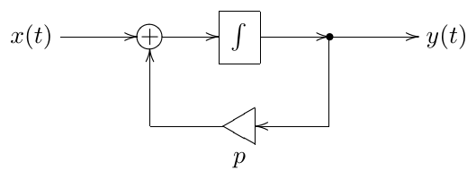

*Figure 2.23: Jordan 1-pole. Note that the integrator is not supposed to
internally contain the implicit cutoff gain!*

One could argue that there is not much difference between the 1-pole
equations (2.14) and (2.21) and respectively between Fig. 2.2 and Fig. 2.23,
since one could always represent the Jordan 1-pole via the ordinary 1-pole
lowpass by dividing the input signal of the latter by the cutoff. Also it
would be no problem to allow $p$ to take complex values in (2.14). This
approach however won't work if $p = 0$. For that reason, in certain cases it
is more conveninent to use a Jordan 1-pole instead.

Changing from (2.14) to (2.21) effectively takes away the $-p$ coefficient in
front of $x$ from all formulas derived from (2.14). Particularly, (2.16)
turns into

$$
y(t) = y(0)e^{pt} + \int_0^t e^{p(t-\tau)}x(\tau)\,d\tau \tag{2.22}
$$

and (2.17) turns into

$$
\begin{aligned}
y(t) &= y(0)e^{pt} + e^{pt}X(s)\int_0^t e^{(s-p)\tau}\,d\tau = \\
&= \left(y(0) - \frac{1}{s-p}X(s)\right)e^{pt} + \frac{1}{s-p}X(s)e^{st}
\end{aligned} \tag{2.23}
$$

where have

$$
y_s(t) = \frac{1}{s-p}X(s)e^{st} = H(s)x(t)
$$

and

$$
H(s) = \frac{1}{s-p}
$$

From this point on we'll continue the transient response analysis in terms
of Jordan 1-poles. The results can be always converted to ordinary 1-poles by
multiplying the input signal by $-p$.

### Hitting the pole

Suppose the input signal of the filter is $x(t) = X(p)e^{pt}$ (where $X(p)$
is the complex amplitude). In this case (2.23) cannot be applied, because the
denominator $s-p$ turns to zero and we have to compute the result
differently. From (2.22) we obtain

$$
y(t) = y(0)e^{pt} + X(p)\int_0^t e^{p(t-\tau)}e^{p\tau}\,d\tau = y(0)e^{pt} + X(p)te^{pt} \tag{2.24}
$$

Now there doesn't really seem to be a steady-state component in (2.24). The
second term might look a bit like the steady-state response. Clearly it's not
having the usual steady-state response form $H(p)X(p)e^{pt}$, but that would
be impossible since $H(p) = \infty$. Not only that, it's not even
proportional to the input signal (or, more precisely, the proportionality
coefficient is equal to $t$, thereby changing with time), thus not really
looking like any kind of a steady state. The first term doesn't work as a
steady-state response either, since it depends on the initial state of the
system.

Since the idea of the steady-state response is, to an extent, subjective, it
means the output which we expect from the system independently of the
initial state, we could formally introduce

$$
y_s(t) = X(p)te^{pt}
$$

as the steady-state response in this case, thereby further transforming
(2.24) as

$$
y(t) = y(0)e^{pt} + Xte^{pt} = (y(0) - y_s(0))e^{pt} + y_s(t) = y_t(t) + y_s(t)
$$

The benefit of this choice is that the transient response still consists of
a single $e^{pt}$ partial. The other option is letting

$$
y_s(t) \equiv 0
$$

which means that (2.24) entirely consists of the transient response.

In either case, the problem is that as $s \to p$ in (2.23), the steady-state
response defined by $y_s(t) = H(s)X(s)e^{st}$ becomes infinitely large and we
need to switch to a different steady-state response definition. Note, that
there is no jump in the output signal $y(t)$, nor does $y(t)$ become
infinitely large. The switching is occuring only in the way how we separate
$y(t)$ into steady-state and transient parts.

We could further illustrate what is going on by a detailed evaluation of
(2.23) at $s \to p$. The part which needs special attention is the integral
of $e^{(s-p)\tau}$:

$$
\lim_{s\to p}\int_0^t e^{(s-p)\tau}\,d\tau = \lim_{s\to p}\left.\frac{e^{(s-p)\tau}}{s-p}\right|_{\tau=0}^{t} = \lim_{s\to p}\frac{e^{(s-p)t}-1}{s-p} = t
$$

and thus $y(t) = y(0)e^{pt} + X(p)te^{pt}$, which matches our previous
result.

In the particular case of $p = 0$ the equation (2.24) turns into

$$
y(t) = y(0) + X(0)t
$$

thus the marginally stable system to which Fig. 2.23 turns at $p = 0$
explodes if $s = 0$, that is if $x(t)$ is constant.[^26]

### Jordan chains

Fur the purposes of further analysis of transient responses of systems of
higher orders it will be instructive to analyse the transient response
generated by serial chains of identical Jordan 1-poles, referred to as
*Jordan chains* (Fig. 2.24).

Given a complex exponential input signal $x(t) = X(s)e^{st}$, the output of
the first 1-pole will have the form

$$
y_1(t) = y_{s1}(t) + y_{t1}(t) = H_1(s)X(s)e^{st} + (y_1(0) - H_1(s)X(s))e^{pt}
$$

where

$$
H_1(s) = \frac{1}{s-p}
$$

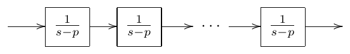

*Figure 2.24: Jordan chain*

The output of the second 1-pole will be therefore

$$
y_2(t) = H_1^2(s)X(s)e^{st} + (y_1(0) - H_1(s)X(s))te^{pt} + (y_2(0) - H_1^2(s)X(s))e^{pt}
$$

where we have used (2.23) and (2.24).

Before we obtain the output of the further 1-poles we first need to apply
(2.22) to $x(t) = Xt^n e^{pt}$ yielding

$$
y(t) = y(0)e^{pt} + X\frac{t^{n+1}}{(n+1)!}e^{pt}
$$

Then

$$
\begin{aligned}
y_3(t) &= H_1^3(s)X(s)e^{st} + (y_1(0) - H_1(s)X(s))\frac{t^2}{2}e^{pt} + \\
&\quad + (y_2(0) - H_1^2(s)X(s))te^{pt} + (y_3(0) - H_1^3(s)X(s))e^{pt}
\end{aligned}
$$

and, continuing in the same fashion, we obtain for the $n$-th 1-pole:

$$
y_n(t) = H_1^n(s)X(s)e^{st} + \sum_{\nu=0}^{n-1}(y_{n-\nu}(0) - H_1^{n-\nu}(s)X(s))\frac{t^\nu}{\nu!}e^{pt} \tag{2.25}
$$

Apparently the first term $H_1^n(s)X(s)e^{st}$ is the steady-state response
whereas the remaining terms are the transient response. In principle, one
could argue, that treating the remaining terms as transient response can be
questioned, since we have some ambiguity in the definition of the
steady-state response of the 1-poles if their poles are hit by their input
signals. However, while this argument might be valid in respect to individual
1-poles, from the point of view of the entire Jordan chain all terms
$t^\nu e^{pt}/\nu!$ are arising out of the mismatch between the chain's
internal state and the input signal, therefore we should stick to the
steady-state response definition $H_1^n(s)X(s)e^{st}$. This also matches the
fact that the transfer function of the entire Jordan chain is
$H_1^N(s) = 1/(s-p)^N$, where $N$ is the number of 1-poles in the chain.

## 2.16 Cutoff as time scaling

Almost all analysis of the filters which we have done so far applies only to
linear time-invariant filters. In practice, however, filter parameters are
often being modulated. This means that the filters no longer have the
time-invariant property and our analysis does not really apply. In general,
the analysis of time-varying filters is a pretty complicated problem.
However, in the specific (but pretty common) case of cutoff modulation there
is actually a way to apply the results obtained for the time-invariant case.

Imagine a system of an arbitrary order (therefore, containing one or more
integrators). Suppose the cutoff gain elements are always preceding the
integrators and suppose all integrators have the same cutoff gain (that is,
these gains always have the same value, even when modulated). For each such
integrator, given its input signal (which we denote as $x(t)$), its output
signal is defined by

$$
y(t) = y(t_0) + \int_{t_0}^t \omega_c x(\tau)\,d\tau
$$

If cutoffs are synchronously varying with time, we could reflect this
explicitly:

$$
y(t) = y(t_0) + \int_{t_0}^t \omega_c(\tau)x(\tau)\,d\tau \tag{2.26}
$$

We would like to introduce a new time variable $\tilde\tau$ defined by

$$
d\tilde\tau = \omega_c(\tau)\,d\tau
$$

and respectively write

$$
y(t) = y(t_0) + \int_{\tau=t_0}^t x(\tau)\,d\tilde\tau(\tau)
$$

Under the additional restriction $\omega_c(t) > 0$ the function
$\tilde\tau(\tau)$ becomes monotonic and we can introduce the warped time
$\tilde t$:

$$
d\tilde t = \omega_c(t)\,dt
$$

that is

$$
\tilde t = \int \omega_c(t)\,dt \tag{2.27}
$$

E.g. we could take

$$
\tilde t = \int_0^t \omega_c(\tau)\,d\tau
$$

If we further restrict $\omega_c(t)$ to be bounded to a positive finite
range:

$$
0 < \omega_{\min} \leq \omega_c(t) \leq \omega_{\max} < +\infty \tag{2.28}
$$

(which is a fairly reasonable restriction on the cutoff), the monotonic
function $\tilde t(t)$ will provide a 1:1 mapping between
$t \in (-\infty, +\infty)$ and $\tilde t \in (-\infty, +\infty)$. We can
therefore reexpress the signals $x(t)$ and $y(t)$ in terms of $\tilde t$,
obtaining some functions $\tilde x(\tilde t)$ and $\tilde y(\tilde t)$, and
ultimately

$$
\tilde y(\tilde t) = \tilde y(\tilde t_0) + \int_{\tilde t_0}^{\tilde t} \tilde x(\tilde\tau)\,d\tilde\tau \tag{2.29}
$$

This means that the variation of $\omega_c$ can be equivalently represented
as warping of the time axis, the cutoff gains in the warped time scale having
a constant unity value.[^27]

In principle the restriction (2.28) can be relaxed to simply
$\omega_c(t) \geq 0$, thereby allowing $\omega_c$ to become zero or to
infinitely grow. This somewhat complicates the reasoning about the warped
time $\tilde t$. E.g. if $\omega_c(t) = 0$ over a prolonged period of time,
then we need to compress the respective time range of $x(t)$ into a
zero-length time range of $\tilde x(\tilde t)$, essentially simply throwing
out the respective part of the signal. However, practically a zero cutoff
simply means that the system state is frozen. On the other hand, an
infinitely growing cutoff is nothing special, unless the cutoff grows to
infinity over a finite time range, which is quite an artificial situation, so
we will simply ignore this theoretical possibility.

### Equivalent topologies

The fact that cutoff modulation can be equivalently represented as warping of
the time scale has several implications of high importance. One implication
has to do with equivalence of systems with different topologies.

The term *topology* in this context simply refers to the components used in
the system's block diagram and the way they are connected to each other.
Often, the reason we would want to talk about the topology would be to put it
against the idea of the transfer function. More specifically: *there can be
systems with different topologies implementing the same transfer function*.
We have already seen the example of that: there is an ordinary 1-pole
multimode and a transposed 1-pole multimode, which both can be used to
implement one and the same transfer function.

According to our previous discussion, systems having identical transfer
functions will behave identically (at least in the absence of the transient
response arising out of a non-zero initial state of the system). However,
all of our analysis of system behavior, including the transient response,
was done under the assumption of time-invariance. This assumption is
actually critical: for a time-varying system the situation is more
complicated and two systems may behave differently even if they share the
same transfer function.[^28] We had a brief example of that in Section 2.7
where we compared different positionings of the cutoff gain relative to the
integrator.

However (2.29) means that if the cutoff modulation is compliant to (2.26)
(pre-integrator cutoff gain) and if the only time-varying aspect of the
system is the cutoff modulation, the systems will behave identically.
Indeed, we could use one and the same time-warping (2.27) for both of the
systems, thus, if they are identically behaving in the original
time-invariant case, so will they in the time-warped case.

This question will be addressed once again from a slightly more detailed
point in Section 7.12.

### Time-varying stability

A further implication of (2.29) is the fact that the stability of a system
cannot be destroyed by the cutoff modulation. This is true for an arbitrary
system, given all cutoff gains are preceding the integrators and are having
equal values all the time. Indeed, the warping of the time axis (2.27) can't
affect the BIBO property of the signals $x(t)$ and $y(t)$, thus stability is
unaffected by the time warping.[^29]

For the 1-pole filter, however, the time-varying stability can be checked in
a much simpler manner. As we should remember, the output signal equation for
a 1-pole lowpass, written in the differential form is

$$
\dot y = \omega_c(t)(x - y)
$$

This means that, as long as $\omega_c > 0$, the value of $y$ always "moves in
the direction towards the input signal" (or it doesn't move, if
$\omega_c = 0$). In this case, clearly, the absolute value of $y$ can't
exceed the maximum of the absolute value of $x$.[^30] On the contrary,
imagine $\omega_c < 0$, $x(t) = 0$ and $y(t) \neq 0$ (let's say $x(t)$ was
nonzero for a while and then we switched it off, leaving $y(t)$ at a nonzero
value). The differential equation turns into
$\dot y = -\omega_c y = |\omega_c| \cdot y$, which clearly produces an
indefinitely growing $y(t)$.

The 1-pole highpass filter's output is simply $x(t) - y(t)$ (where $y(t)$ is
the lowpass signal), therefore the highpass filter is stable if and only if
the lowpass filter is stable.

We have seen that cutoff is a very special filter parameter, such that its
modulation can't destroy the filter's stability (provided some reasonable
conditions are met). There are also some trivial cases, when the modulated
parameters are not a part of a feedback loop, such as e.g. the mixing gain of
a shelving filter. Apparently, such parameters when being varied can't
destroy the filter's stability as well. With the filter types which we
introduce later in this book there will be other parameters within feedback
loops which in principle can be modulated. Unfortunately, for the modulation
of such other parameters there is no simple answer (although sometimes the
stability can be proven by some means). Respectively there is no easy general
criterion for time-varying filter stability as there is for the
time-invariant case. Often, we simply hope that the modulation of the filter
parameters does not make the (otherwise stable) filter unstable. This is not
simply a theoretical statement, on the contrary, such cases, where the
modulation destabilizes a filter, do occur in practice.

## Summary

The analog 1-pole filter implementations are built around the idea of the
multimode 1-pole filter in Fig. 2.13. The transfer functions of the lowpass
and highpass 1-pole filters are

$$
H_{\text{LP}}(s) = \frac{\omega_c}{s+\omega_c}
$$

and

$$
H_{\text{HP}}(s) = \frac{s}{s+\omega_c}
$$

respectively. Other 1-pole filter types can be built by combining the
lowpass and the highpass signals.

[^1]: We didn't assume the varying $C$ because then our simplification of the
    equation system doesn't hold anymore, since $\dot q_C \neq C\dot U_C$ in this case.

[^2]: We will discuss the filter stability later, for now we'll simply mention
    that we're mostly interested in the stable filters for the purposes of the
    current discussion

[^3]: We will discuss the mechanisms behind that fact when we talk about
    *transient response*.

[^4]: In practice, typically, a zero initial state is assumed. Then,
    particularly, in the case of absence of the input signal, the output signal
    of the filter is zero from the very beginning (rather than for $t \gg t_0$).

[^5]: The linearity here is understood in the sense of the operator linearity.
    An operator $\hat H$ is linear, if
    $$\hat H\bigl(\lambda_1 f_1(t) + \lambda_2 f_2(t)\bigr) = \lambda_1 \hat H f_1(t) + \lambda_2 \hat H f_2(t)$$

[^6]: Often in such cases the input and output signal notation for the block
    diagram is replaced with $X(s)$ and $Y(s)$. Such diagram then "works" in terms
    of Laplace transform, the input of the diagram is the Laplace transform
    $X(s)$ of the input signal $x(t)$, the output is respectively the Laplace
    transform $Y(s)$ of the output signal $y(t)$. The integrators can then be seen
    as $s$-dependent gain elements, where the gain coefficient is $1/s$.

[^7]: In other words, we take for granted the fact that $e^{st}$ is an
    eigenfunction of the entire circuit.

[^8]: Here we again understand the linearity in the operator sense:
    $$\hat H\bigl(\lambda_1 f_1(t) + \lambda_2 f_2(t)\bigr) = \lambda_1 \hat H f_1(t) + \lambda_2 \hat H f_2(t)$$
    The operator here corresponds to the circuit in question: $y(t) = \hat H x(t)$
    where $x(t)$ and $y(t)$ are the input and output signals of the circuit.

[^9]: A rational function is nonstrictly proper, if the order of its numerator
    doesn't exceed the order of its denominator.

[^10]: This relationship holds only if $H(j\omega)$ is Hermitian: $H(j\omega) = H^*(-j\omega)$.
    If it weren't the case, the Hermitian property wouldn't hold for $Y(j\omega)$ and
    $y(t)$ couldn't have been a real signal (for a real input $x(t)$). Fortunately,
    for real systems $H(j\omega)$ is always Hermitian. Particularly, rational
    transfer functions $H(s)$ with real coefficients obviously result in
    Hermitian $H(j\omega)$.

[^11]: Formally, $\omega = 0$ requires special treatment in case of a Dirac delta
    component at $\omega = 0$ (arising particularly if the Fourier series is
    represented by a Fourier integral and there is a nonzero DC offset).
    Nevertheless, the resulting relationship between $a_y(0)$ and $a_x(0)$ is
    exactly the same as for $\omega > 0$, that is $a_y(0) = H(0)a_x(0)$. A more
    complicated but same argument holds for the phase.

[^12]: We introduce the concepts of pass-, stop- and transition bands only
    qualitatively, without attempting to give more exact definitions of the
    positions of the boundaries between the bands.

[^13]: Notice that including the cutoff gain into the integrator makes the integrator block invariant to the choice of the time units:
    $$
    y(t) = y(t_0) + \int_{t_0}^{t} \omega_c x(\tau)\,d\tau
    $$
    because the product $\omega_c\,d\tau$ is invariant to the choice of the time units. This will become important once we start building discrete-time models of filters, where we would often assume unit sampling period.

[^14]: In certain singular cases, depending on the particular definition details, these numbers might be not equal to each other.

[^15]: Of course, $H(0)$ and $H(\infty)$ are real regardless of the rolloff speeds. However zero values of $H$ do not have a defined phase response and can be approached from any direction on the complex plane of values of $H$. On the other hand a nonzero real value $H(0)$ or $H(\infty)$ means that $H(s)$ must be almost real in some neightborhood of $s = 0$ or $s = \infty$ respectively.

[^16]: More precisely a linear time-invariant system, which particularly implies fixed parameters. This remark is actually unnecessary in the context of the current statement, since, as we mentioned, the transfer function (and respectively the poles) are defined only for the linear time-invariant case.

[^17]: The case when some of the poles are exactly on the imaginary axis, while the remaining poles are in the left semiplane is referred to as *marginally stable* case. For some of the marginally stable filters the BIBO property may still theoretically hold. However since in practice (due to noise in analog systems or precision losses in their digital emulations) it's usually impossible to have the pole locations exactly defined and we will not concern ourselves with this boundary case. One additional property of filters with all poles in the left semiplane is that their state decays to zero in the absence of the input signal. Marginally stable filters do not have this property.

[^18]: The reason, why the stable area is the left (and not the right) complex semiplane, is discussed later in connection with transient response.

[^19]: Conjugation $p^*$ flips the pole $p$ symmetrically with respect to the real axis. Now if we additionally flip the result symmetrically with respect to the origin, the result $-p^*$ will be located symmetrically to $p$ with respect to the imaginary axis.

[^20]: The only filter which we discussed so far which was having a zero was the 1-pole highpass. It has the zero right on the imaginary axis and thus we can't really say whether it's minimum or maximum phase or "something in between". However later we will encounter some filters with zeros located off the imaginary axis and in some cases the choice between minimum and maximum phase will become really important.

[^21]: If $a_0 = 0$, it means that the pole of the filter is exactly at $s = 0$, which is a rather exotic situation to begin with. Even then, chances are that $b_0 = 0$ as well, in which case the filter either reduces to a multiplication by a gain ($H(s) = b_1$) or, if the coefficients vary, we can take the limiting value of $b_0/\omega_c$ in the respective formulas.

[^22]: $H(0) = 1 + K$ is not a fully trivial result here. We have it only
    because the lowpass filter doesn't change the signal's phase at
    $\omega = 0$. If instead it had e.g. inverted the phase, then we would
    have obtained $1 - K$ here.

[^23]: The most common VA use for the allpass filters is probably in
    phasers.

[^24]: The inverting input of the summator in the transposed version was
    obtained from the respective inverting input of the summator in the
    non-transposed version as follows. First the inverting input is replaced
    by an explicit inverting gain element (gain factor $-1$), then the
    transposition is performed, then the inverting gain is merged into the
    new summator.

[^25]: Assuming the input signal is finite. In theoretical filter analysis
    sometimes infinitely large input signals (most commonly $x(t) =
    \delta(t)$) are used. In such cases the filter state may change abruptly
    (and this is the whole purposes of using input signals such as
    $\delta(t)$.

[^26]: It's easy to see that this system is simply an integrator.

[^27]: Instead of unit cutoff we can have any other positive value, by simply
    linearly stretching the time axis in addition to the warping
    $\tilde t(t)$.

[^28]: Of course, strictly speaking time-varying systems do not have a
    transfer function. But it is intuitive to use the idea of a
    "time-varying transfer function", understood as the transfer function
    which is formally evaluated pretending the system's parameters are fixed
    at each time moment. E.g. if we have a 1-pole lowpass with a varying
    cutoff $\omega_c(t)$, we would say that its transfer function at each
    time moment is $H(s) = \omega_c(t)/(\omega_c(t)+s)$. Of course, this is
    not a true transfer function in the normal sense. Particularly, for an
    exponential input $e^{st}$ the filter's output is not equal to
    $y(t) = H(s,t)e^{st}$.

[^29]: Note that this applies only to the idealized continuous-time systems.
    After conversion to discrete time the same argument will not
    automatically hold and the stability of the resulting discrete time
    system will need to be proven again. However, it is not unreasonable to
    expect, given a discretization method which preserves time-invariant
    stability, that it will also at least approximately preserve the
    time-varying stability.

[^30]: If $\omega_c = 0$ then $y(t)$ doesn't change. This is the marginally
    stable case. Particularly, even if $x(t) = 0$, the output $y(t)$ will
    stay at whatever value it is, rather than decaying towards the zero.
