# Chapter 3: Time-discretization

Now that we have introduced the basic ideas of analog filter analysis, we will
develop an approach to convert analog filter models to the discrete time.

## 3.1 Discrete-time signals

The discussion of the basic concepts of discrete-time signal representation and
processing is outside the scope of this book. We are assuming that the reader
is familiar with the basic concepts of discrete-time signal processing, such as
sampling, sampling rate, sampling period, Nyquist frequency, analog-to-digital
and digital-to-analog signal conversion. However we are going to make some
remarks in this respect.

As many other texts do, we will use the square bracket notation to denote
discrete-time signals and round parentheses notation to denote continuous-time
signals: e.g. $x[n]$ and $x(t)$.

We will often assume a unit sampling rate $f_s = 1$ (and, respectively, a unit
sampling period $T = 1$), which puts the Nyquist frequency at $1/2$, or, in the
circular frequency terms, at $\pi$. Apparently, this can be achieved simply by a
corresponding choice of time units.

Theoretical DSP texts typically state that discrete-time signals have periodic
frequency spectra. This might be convenient for certain aspects of theoretical
analysis such as analog-to-digital and digital-to-analog signal conversion, but it's
highly unintuitive otherwise. It would be more intuitive, whenever talking of a
discrete-time signal, to imagine an ideal DAC connected to this signal, and think
that the discrete-time signal represents the respective continuous-time signal
produced by such DAC. Especially, since by sampling this continuous-time signal
we obtain the original discrete-time signal again. So the DAC and ADC conversions
are exact inverses of each other (in this case). Now, the continuous-time
signal produced by such DAC doesn't contain any partials above the Nyquist
frequency. Thus, its Fourier integral representation (assuming $T = 1$) is

$$
x[n] = \int_{-\pi}^{\pi} X(\omega)e^{j\omega n}\,\frac{d\omega}{2\pi}
$$

and its Laplace integral representation is

$$
x[n] = \int_{\sigma - j\pi}^{\sigma + j\pi} X(s)e^{sn}\,\frac{ds}{2\pi j}
$$

Introducing notation $z = e^s$ and noticing that

$$
ds = d(\log z) = \frac{dz}{z}
$$

we can rewrite the Laplace integral as

$$
x[n] = \oint X(z)z^n\,\frac{dz}{2\pi j z}
$$

(where $X(z)$ is apparently a different function than $X(s)$) where the integration
is done counterclockwise along a circle of radius $e^\sigma$ centered at the complex
plane's origin:[^1]

$$
z = e^s = e^{\sigma + j\omega} = e^\sigma \cdot e^{j\omega} \qquad (-\pi \le \omega \le \pi) \tag{3.1}
$$

We will refer the representation (3.1) as the *z-integral*.[^2] The function $X(z)$ is
referred to as the *z-transform* of $x[n]$.

In case of non-unit sampling period $T \neq 1$ the formulas are the same, except
that the frequency-related parameters get multiplied by $T$ (or divided by $f_s$), or
equivalently, the $n$ index gets multiplied by $T$ in continuous-time expressions:[^3]

$$
x[n] = \int_{-\pi f_s}^{\pi f_s} X(\omega)e^{j\omega T n}\,\frac{d\omega}{2\pi}
$$

$$
x[n] = \int_{\sigma - j\pi f_s}^{\sigma + j\pi f_s} X(s)e^{sTn}\,\frac{ds}{2\pi j}
$$

$$
z = e^{sT}
$$

$$
x[n] = \oint X(z)z^n\,\frac{dz}{2\pi j z} \qquad (z = e^{\sigma + j\omega T},\ -\pi f_s \le \omega \le \pi f_s)
$$

The notation $z^n$ is commonly used for discrete-time complex exponential
signals. A continuous-time signal $x(t) = e^{st}$ is written as $x[n] = z^n$ in discrete-
time, where $z = e^{sT}$. The Laplace-integral amplitude coefficient $X(s)$ in $X(s)e^{st}$
then may be replaced by a z-integral amplitude coefficient $X(z)$ such as in
$X(z)z^n$.

## 3.2 Naive integration

The most "interesting" element of analog filter block diagrams is obviously the
integrator. The time-discretization for other elements is trivial, so we should
concentrate on building the discrete-time models of the analog integrator.

The continuous-time integrator equation is

$$
y(t) = y(t_0) + \int_{t_0}^{t} x(\tau)\,d\tau
$$

In discrete time we could approximate the integration by a summation of the
input samples. Assuming for simplicity $T = 1$, we could have implemented a
discrete-time integrator as

$$
y[n] = y[n_0 - 1] + \sum_{\nu=n_0}^{n} x[\nu]
$$

We will refer to the above as the *naive* digital integrator.

A pseudocode routine for this integrator could simply consist of an accumulating
assignment:

```
// perform one sample tick of the integrator
integrator_output := integrator_output + integrator_input;
```

It takes the current state of the integrator stored in the *integrator_output* variable
and adds the current sample's value of the *integrator_input* on top of that.

In case of a non-unit sampling period $T \neq 1$ we have to multiply the accumulated
input values by $T$:[^4]

```
// perform one sample tick of the integrator
integrator_output := integrator_output + integrator_input*T;
```

## 3.3 Naive lowpass filter

We could further apply this "naive" approach to construct a discrete-time model
of the lowpass filter in Fig. 2.2. We will use the naive integrator as a basis for
this model.[^5]

Let the $x$ variable contain the current input sample of the filter. Considering
that the output of the filter in Fig. 2.2 coincides with the output of the
integrator, let the $y$ variable contain the integrator state and simultaneously
serve as the output sample. As we begin to process the next input sample, the
$y$ variable will contain the previous output value. At the end of the processing
of the sample (by the filter model) the $y$ variable will contain the new output
sample. In this setup, the input value for the integrator is apparently $(x - y)\omega_c$,
thus we simply have

```
// perform one sample tick of the lowpass filter
y := y + (x-y)*omega_c;
```

(mind that $\omega_c$ must have been scaled to the time units corresponding to the
unit sample period!)

A naive discrete-time model of the multimode filter in Fig. 2.13 could have
been implemented as:

```
// perform one sample tick of the multimode filter
hp := x-lp;
lp := lp + hp*omega_c;
```

where the integrator state is stored in the *lp* variable.

The above naive implementations (and any other similar naive implementations,
for that matter) work reasonably well as long as $\omega_c \ll 1$, that is
the cutoff must be much lower than the sampling rate. At larger $\omega_c$ the behavior
of the filter becomes rather strange, ultimately the filter gets unstable. We will
now develop some theoretical means to analyse the behavior of the discrete-time
filter models, figure out what are the problems with the naive implementations,
and then introduce another discretization approach.

## 3.4 Block diagrams

Let's express the naive discrete-time integrator in the form of a discrete-time
block diagram. The discrete-time block diagrams are constructed from the same
elements as continuous-time block diagrams, except that instead of integrators
they have *unit delays*. A unit delay simply delays the signal by one sample.
That is the output of a unit delay comes "one sample late" compared to the
input. Apparently, the implementation of a unit delay requires a variable, which
will be used to store the new incoming value and keep it there until the next
sample. Thus, a unit delay element has a *state*, while the other block diagram
elements are obviously stateless. This makes the unit delays in a way similar to
the integrators in the analog block diagrams, where the integrators are the only
elements with a state.

A unit delay element in a block diagram is denoted as:

$$
\longrightarrow \boxed{z^{-1}} \longrightarrow
$$

The reason for the notation $z^{-1}$ will be explained a little bit later. Using a unit
delay, we can create a block diagram for our naive integrator (Fig. 3.1). For an
arbitrary sampling period we obtain the structure in Fig. 3.2. For an integrator
with embedded cutoff gain we can combine the $\omega_c$ gain element with the $T$ gain
element (Fig. 3.3). Notice that the integrator thereby becomes invariant to the
choice of the time units, since $\omega_c T$ is invariant to this choice.

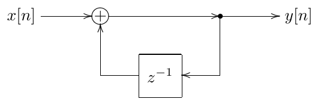

*Figure 3.1: Naive integrator for T = 1.*

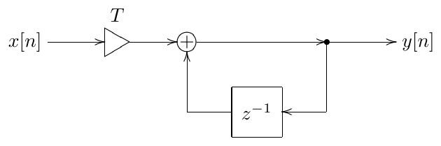

*Figure 3.2: Naive integrator for arbitrary T.*

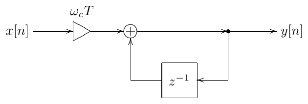

*Figure 3.3: Naive integrator with embedded cutoff.*

Now let's construct the block diagram of the naive 1-pole lowpass filter.
Recalling the implementation routine:

```
// perform one sample tick of the lowpass filter
y := y + (x-y)*omega_c;
```

we obtain the diagram in Fig. 3.4. The $z^{-1}$ element in the feedback from the
filter's output to the leftmost summator is occurring due to the fact that we are
picking up the *previous* value of $y$ in the routine when computing the difference
$x - y$.

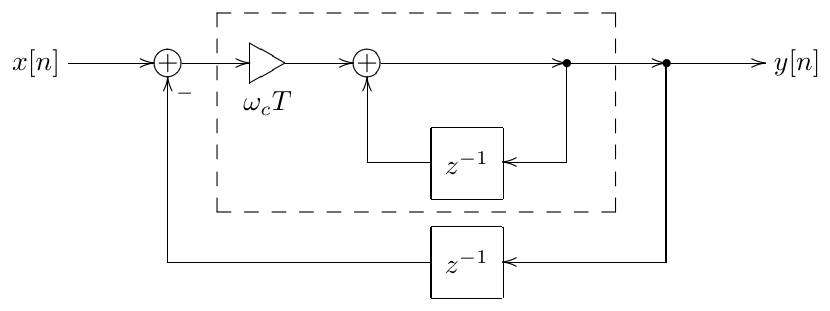

*Figure 3.4: Naive 1-pole lowpass filter (the dashed line denotes the integrator).*

This unit delay occurring in the discrete-time feedback is a common problem
in discrete-time implementations. This problem is solvable, however it doesn't
make too much sense to solve it for the naive integrator-based models, as the
increased complexity doesn't justify the improvement in sound. We will address
the problem of the zero-delay discrete-time feedback later, for now we'll concentrate
on the naive model in Fig. 3.4. This model can be simplified a bit, by
combining the two $z^{-1}$ elements into one (Fig. 3.5), so that the block diagram
explicitly contains a single state variable (as does its pseudocode counterpart).

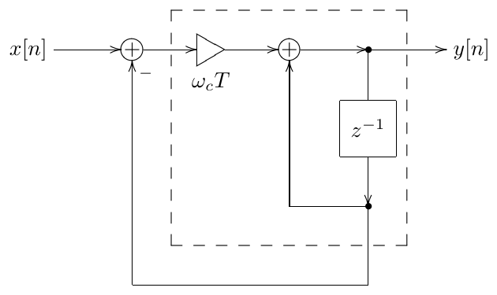

*Figure 3.5: Naive 1-pole lowpass filter with just one $z^{-1}$ element
(the dashed line denotes the integrator).*

## 3.5 Transfer function

Let $x[n]$ and $y[n]$ be respectively the input and the output signals of a unit
delay:

$$
x[n] \longrightarrow \boxed{z^{-1}} \longrightarrow y[n]
$$

For a complex exponential input $x[n] = e^{sn} = z^n$ we obtain

$$
y[n] = e^{s(n-1)} = e^{sn}e^{-s} = z^n z^{-1} = z^{-1} x[n]
$$

That is

$$
y[n] = z^{-1} x[n]
$$

That is, $z^{-1}$ is the *transfer function* of the unit delay! It is common to express
discrete-time transfer functions as functions of $z$ rather than functions of $s$. The
reason is that in this case the transfer functions are nonstrictly proper[^6] rational
functions, similarly to the continuous-time case, which is pretty convenient. So,
for a unit delay we could write $H(z) = z^{-1}$.

Now we can obtain the transfer function of the naive integrator in Fig. 3.1.
Suppose[^7] $x[n] = X(z)z^n$ and $y[n] = Y(z)z^n$, or shortly, $x = X(z)z^n$ and
$y = Y(z)z^n$. Then the output of the $z^{-1}$ element is $yz^{-1}$. The output of the
summator is then $x + yz^{-1}$, thus

$$
y = x + yz^{-1}
$$

from where

$$
y(1 - z^{-1}) = x
$$

and

$$
H(z) = \frac{y}{x} = \frac{1}{1 - z^{-1}}
$$

This is the transfer function of the naive integrator (for $T = 1$).

It is relatively common to express discrete-time transfer functions as rational
functions of $z^{-1}$ (like the one above) rather than rational functions of $z$.
However, for the purposes of the analysis it is also often convenient to have
them expressed as rational functions of $z$ (particularly, for finding their poles
and zeros). We can therefore multiply the numerator and the denominator of
the above $H(z)$ by $z$, obtaining:

$$
H(z) = \frac{z}{z - 1}
$$

Since $z = e^s$, the *frequency response* is obtained as $H(e^{j\omega})$. The amplitude
and phase responses are $|H(e^{j\omega})|$ and $\arg H(e^{j\omega})$ respectively.[^8]

For $T \neq 1$ we obtain

$$
H(z) = T\frac{z}{z - 1}
$$

and, since $z = e^{sT}$, the frequency response is $H(e^{j\omega T})$.

Now let's obtain the transfer function of the naive 1-pole lowpass filter in
Fig. 3.5, where, for the simplicity of notation, we assume $T = 1$. Assuming
complex exponentials $x = X(z)z^n$ and $y = Y(z)z^n$ we have $x$ and $yz^{-1}$ as
the inputs of the first summator. Respectively the integrator's input is
$\omega_c(x - yz^{-1})$. And the integrator output is the sum of $yz^{-1}$ and the integrator's
input. Therefore

$$
y = yz^{-1} + \omega_c(x - yz^{-1})
$$

From where

$$
\bigl(1 - (1 - \omega_c)z^{-1}\bigr)y = \omega_c x
$$

and

$$
H(z) = \frac{y}{x} = \frac{\omega_c}{1 - (1 - \omega_c)z^{-1}} = \frac{\omega_c z}{z - (1 - \omega_c)}
$$

The transfer function for $T \neq 1$ can be obtained by simply replacing $\omega_c$ by $\omega_c T$.

The respective amplitude response is plotted in Fig. 3.6. Comparing it to
the amplitude response of the analog prototype we can observe serious deviation
closer to the Nyquist frequency. The phase response (Fig. 3.7) has similar
deviation problems.

In principle, the amplitude response deviation can be drastically reduced
by correcting the filter's cutoff setting. E.g. one could notice that the second
of the amplitude responses in Fig. 3.6 is occurring a bit too far to the right,
compared to the analog response (which is what we're aiming at). Therefore
we could achieve a better matching between the two responses by reducing the
cutoff setting of the digital filter by a small amount. Depending on the formal
definition of the response matching, one could derive an analytical expression
for such cutoff correction. There are two main problems with that, though.

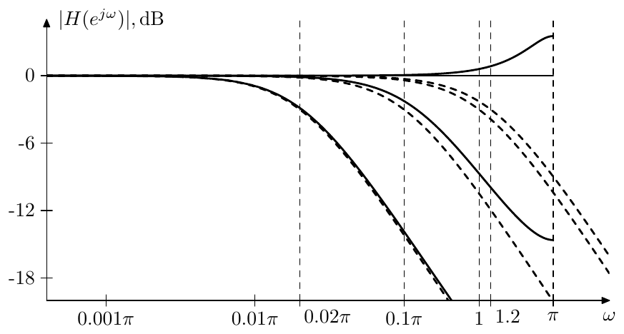

*Figure 3.6: Amplitude response of a naive 1-pole lowpass filter for a
number of different cutoffs. Dashed curves represent the respective
analog filter responses for the same cutoffs.*

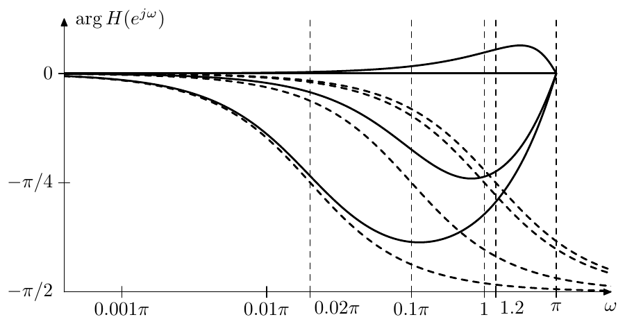

*Figure 3.7: Phase response of a naive 1-pole lowpass filter for a
number of different cutoffs. Dashed curves represent the respective
analog filter responses for the same cutoffs.*

One problem is that many other filters, e.g. a 2-pole resonating lowpass, have
more parameters, e.g. not only cutoff but also the resonance, and we potentially
may need to correct all of them, which results in much more involved math.
This problem is not as critical though, and there are some methods utilizing
this approach.

The other problem, though, is the phase response. Looking at Fig. 3.7 it
seems that no matter how we try to correct the filter's cutoff, the phase response
will be always zero at Nyquist, whereas we would desire something close to
$-\pi/2$. The effects of the deviation of the filter's phase response are mostly
quite subtle. Therefore it's somewhat difficult to judge how critical the phase
devations might be.[^9] However there's one absolutely objective and major issue
associated with the phase deviations. Attempting to mix outputs of two filters
with some deviations in either or both of the amplitude and phase responses
may easily lead to unexpected and undesired results. For that reason in this
book we will concentrate on a different method which is much more robust in
this respect.

### Poles and zeros

Discrete-time block diagrams are differing from continuous-time block diagrams
only by having $z^{-1}$ elements instead of integrators. Recalling that the transfer
function of an integrator is $s^{-1}$, we conclude that from the formal point of view
the difference is purely notational.

Now, the transfer functions of continuous-time block diagrams are non-
strictly proper rational functions of $s$. Respectively, the transfer functions of
discrete-time block diagrams are nonstrictly proper rational functions of $z$.

Thus, discrete-time transfer functions will have poles and zeros in a way similar
to continuous-time transfer functions. Similarly to continuous-time transfer
functions, the poles will define the stability of a linear time-invariant filter. Consider
that $z = e^{sT}$ and recall the stability criterion $\operatorname{Re} s < 0$ (where $s = p_n$,
where $p_n$ are the poles). Apparently, $\operatorname{Re} s < 0 \iff |z| < 1$. We might there-
fore intuitively expect the discrete-time stability criterion to be $|p_n| < 1$ where
$p_n$ are the discrete-time poles. This is indeed the case, a linear time-invariant
difference system[^10] is stable if and only if all its poles are located inside the
unit circle. We will give more detail about the mechanisms behind this in the
discussion of the discrete-time transient response in Sections 3.12 and 7.13.

## 3.6 Trapezoidal integration

Instead of naive integration, we could attempt using the trapezoidal integration
method ($T = 1$):

```
// perform one sample tick of the integrator
integrator_output := integrator_output +
    (integrator_input + previous_integrator_input)/2;
previous_integrator_input := integrator_input;
```

Notice that now we need two state variables per integrator: *integrator_output*
and *previous_integrator_input*. The block diagram of a trapezoidal integrator is
shown in Fig. 3.8. We'll refer to this integrator as a *direct form I trapezoidal
integrator*. The reason for this term will be explained later.

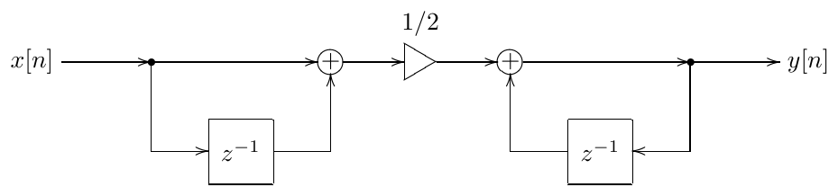

*Figure 3.8: Direct form I trapezoidal integrator (T = 1).*

We could also construct a trapezoidal integrator implementation with only
a single state variable. Consider the expression for the trapezoidal integrator's
output:

$$
y[n] = y[n_0 - 1] + \sum_{\nu=n_0}^{n} \frac{x[\nu - 1] + x[\nu]}{2} \tag{3.2}
$$

Suppose $y[n_0 - 1] = 0$ and $x[n_0 - 1] = 0$, corresponding to a zero initial state (recall
that both $y[n_0 - 1]$ and $x[n_0 - 1]$ are technically stored in the $z^{-1}$ elements).
Then

$$
\begin{aligned}
y[n] &= \sum_{\nu=n_0}^{n} \frac{x[\nu - 1] + x[\nu]}{2} = \frac{1}{2}\left(\sum_{\nu=n_0}^{n} x[\nu - 1] + \sum_{\nu=n_0}^{n} x[\nu]\right) = \\
&= \frac{1}{2}\left(\sum_{\nu=n_0+1}^{n} x[\nu - 1] + \sum_{\nu=n_0}^{n} x[\nu]\right) = \frac{1}{2}\left(\sum_{\nu=n_0}^{n-1} x[\nu] + \sum_{\nu=n_0}^{n} x[\nu]\right) = \\
&= \frac{u[n-1] + u[n]}{2}
\end{aligned}
$$

where

$$
u[n] = \sum_{\nu=n_0}^{n} x[\nu]
$$

Now notice that $u[n]$ is the output of a naive integrator, whose input signal
is $x[n]$. At the same time $y[n]$ is the average of the previous and the current
output values of the naive integrator. This can be implemented by the structure
in Fig. 3.9. Similar considerations apply for nonzero initial state. We'll refer to
the integrator in Fig. 3.9 as a *direct form II* or *canonical* trapezoidal integrator.
The reason for this term will be explained later.

We can develop yet another form of the bilinear integrator with a single state
variable. Let's rewrite (3.2) as

$$
y[n] = y[n_0 - 1] + \frac{x[n_0 - 1]}{2} + \sum_{\nu=n_0}^{n-1} x[\nu] + \frac{x[n]}{2}
$$

and let

$$
u[n-1] = y[n] - \frac{x[n]}{2} = y[n_0 - 1] + \frac{x[n_0 - 1]}{2} + \sum_{\nu=n_0}^{n-1} x[\nu]
$$

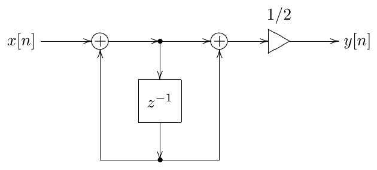

*Figure 3.9: Direct form II (canonical) trapezoidal integrator (T = 1).*

Notice that

$$
y[n] = u[n-1] + \frac{x[n]}{2} \tag{3.3a}
$$

and

$$
u[n] = u[n-1] + x[n] = y[n] + \frac{x[n]}{2} \tag{3.3b}
$$

Expressing (3.3a) and (3.3b) in a graphical form, we obtain the structure in
Fig. 3.10. We'll refer to the integrator in Fig. 3.10 as a *transposed direct form
II* or *transposed canonical* trapezoidal integrator. The reason for this term will
be explained later.

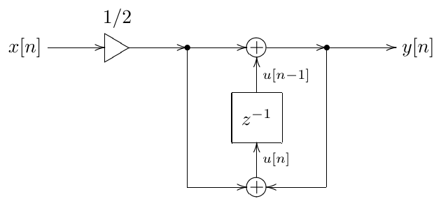

*Figure 3.10: Transposed direct form II (transposed canonical) trapezoidal integrator (T = 1).*

The positioning of the 1/2 gain prior to the integrator in Fig. 3.10 is quite
convenient, because we can combine the 1/2 gain with the cutoff gain into a
single gain element. In case of an arbitrary sampling period we could also
include the $T$ factor into the same gain element, thus obtaining the structure in
Fig. 3.11. A similar trick can be performed for the other two integrators, if we
move the 1/2 gain element to the input of the respective integrator. Since the
integrator is a linear time-invariant system, this doesn't affect the integrator's
behavior in a slightest way.

Typically one would prefer the direct form II integrators to the direct form I
integrator, because the former have only one state variable. In this book we will
mostly use the transposed direct form II integrator, because this is resulting in
slightly simpler zero-delay feedback equations and also offers a nice possibility
for the internal saturation in the integrator.

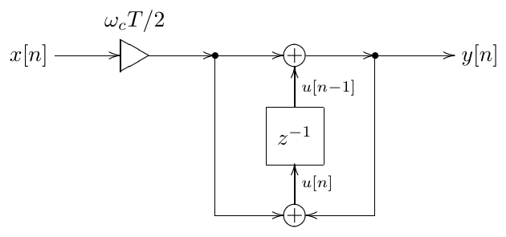

*Figure 3.11: Transposed direct form II (transposed canonical) trapezoidal integrator with "embedded" cutoff gain.*

The transfer functions of all three integrators are identical. Let's obtain
e.g. the transfer function of the transposed canonical integrator (in Fig. 3.10).
Assuming signals of the exponential form $z^n$, we can drop the index $[n]$, under-
standing it implicity, while the index $[n-1]$ will be replaced by the multiplication
by $z^{-1}$. Then (3.3) turn into

$$
\begin{aligned}
y &= uz^{-1} + \frac{x}{2} \\
u &= y + \frac{x}{2}
\end{aligned}
$$

Substituting the second equation into the first one we have

$$
\begin{aligned}
y &= \left(y + \frac{x}{2}\right)z^{-1} + \frac{x}{2} \\
yz &= y + \frac{x}{2} + \frac{x}{2}z \\
y(z-1) &= \frac{x}{2}(z+1)
\end{aligned}
$$

and the transfer function of the trapezoidal integrator is thus

$$
H(z) = \frac{y}{x} = \frac{1}{2}\cdot\frac{z+1}{z-1}
$$

For an arbitrary $T$ one has to multiply the result by $T$, to take the respective
gain element into account:

$$
H(z) = \frac{T}{2}\cdot\frac{z+1}{z-1}
$$

If also the cutoff gain is included, we obtain

$$
H(z) = \frac{\omega_c T}{2}\cdot\frac{z+1}{z-1}
$$

One can obtain the same results for the other two integrators.

What is so special about this transfer function, that makes the trapezoidal
integrator so superior to the naive one, is to be discussed next.

## 3.7 Bilinear transform

Suppose we take an arbitrary continuous-time block diagram, like the familiar
lowpass filter in Fig. 2.2 and replace all continuous-time integrators by discrete-
time trapezoidal integrators. On the transfer function level, this will correspond
to replacing all $s^{-1}$ with $\frac{T}{2}\cdot\frac{z+1}{z-1}$. That is, technically we perform a substitution

$$
s^{-1} = \frac{T}{2}\cdot\frac{z+1}{z-1}
$$

in the transfer function expression.

It would be more convenient to write this substitution explicitly as

$$
s = \frac{2}{T}\cdot\frac{z-1}{z+1} \tag{3.4}
$$

The substitution (3.4) is referred to as the *bilinear transform*, or shortly BLT.
For that reason we can also refer to trapezoidal integrators as *BLT integrators*.
Let's figure out, how does the bilinear transform affect the frequency response
of the filter, that is, what is the relationship between the original continuous-
time frequency response prior to the substitution and the resulting discrete-time
frequency response after the substitution.

Let $H_a(s)$ be the original continuous-time transfer function. Then the re-
spective discrete-time transfer function is

$$
H_d(z) = H_a\!\left(\frac{2}{T}\cdot\frac{z-1}{z+1}\right) \tag{3.5}
$$

Respectively, the discrete-time frequency response is

$$
\begin{aligned}
H_d(e^{j\omega T}) &= H_a\!\left(\frac{2}{T}\cdot\frac{e^{j\omega T}-1}{e^{j\omega T}+1}\right)
= H_a\!\left(\frac{2}{T}\cdot\frac{e^{j\omega T/2}-e^{-j\omega T/2}}{e^{j\omega T/2}+e^{-j\omega T/2}}\right) = \\
&= H_a\!\left(\frac{2}{T}j\tan\frac{\omega T}{2}\right)
\end{aligned}
$$

Notice that $H_a(s)$ in the last expression is evaluated on the imaginary axis!!!
That is, the bilinear transform maps the imaginary axis in the $s$-plane to the
unit circle in the $z$-plane! Now, $H_a\!\left(\frac{2}{T}j\tan\frac{\omega T}{2}\right)$ is the analog frequency response
evaluated at $\frac{2}{T}\tan\frac{\omega T}{2}$. That is, the digital frequency response at $\omega$ is equal to
the analog frequency response at $\frac{2}{T}\tan\frac{\omega T}{2}$. This means that the analog fre-
quency response in the range $0 \le \omega < +\infty$ is mapped into the digital frequency
range $0 \le \omega T < \pi$ ($0 \le \omega < \pi f_s$), that is from zero to Nyquist![^11] Denoting
the analog frequency as $\omega_a$ and the digital frequency as $\omega_d$ we can express the
argument mapping of the frequency response function as

$$
\omega_a = \frac{2}{T}\tan\frac{\omega_d T}{2} \tag{3.6}
$$

or, in a more symmetrical way

$$
\frac{\omega_a T}{2} = \tan\frac{\omega_d T}{2} \tag{3.7}
$$

Notice that for frequencies much smaller that Nyquist frequency we have $\omega T \ll
1$ and respectively $\omega_a \approx \omega_d$.

This is what is so unique about the bilinear transform. It simply warps the
frequency range $[0, +\infty)$ into the zero-to-Nyquist range, but otherwise doesn't
change the frequency response at all! Considering in comparison a naive inte-
grator, we would have obtained:

$$
\begin{aligned}
s^{-1} &= \frac{z}{z-1} \\
s &= \frac{z-1}{z} \tag{3.8}
\end{aligned}
$$

$$
H_d(z) = H_a\!\left(\frac{z-1}{z}\right)
$$

$$
H_d(e^{j\omega}) = H_a\!\left(\frac{e^{j\omega}-1}{e^{j\omega}}\right) = H_a\!\left(1-e^{-j\omega}\right)
$$

which means that the digital frequency response is equal to the analog transfer
function evaluated on a circle of radius 1 centered at $s = 1$. This hardly defines
a clear relationship between the two frequency responses.

So, by simply replacing the analog integrators with digital trapezoidal in-
tegrators, we obtain a digital filter whose frequency response is essentially the
same as the one of the analog prototype, except for the frequency warping.
Particularly, the relationship between the amplitude and phase responses of the
filter is fully preserved, which is particularly highly important if the filter is to
be used as a building block in a larger filter. Very close to perfect!

Furthermore, the bilinear transform maps the left complex semiplane in the
$s$-domain into the inner region of the unit circle in the $z$-domain. Indeed, let's
obtain the inverse bilinear transform formula. From (3.4) we have

$$
(z+1)\frac{sT}{2} = z - 1
$$

from where

$$
1 + \frac{sT}{2} = z\left(1 - \frac{sT}{2}\right)
$$

and

$$
z = \frac{1+\frac{sT}{2}}{1-\frac{sT}{2}} \tag{3.9}
$$

The equation (3.9) defines the *inverse bilinear transform*. Now, if $\operatorname{Re} s < 0$,
then, obviously

$$
\left|1+\frac{sT}{2}\right| < \left|1-\frac{sT}{2}\right|
$$

and $|z| < 1$. Thus, the left complex semiplane in the $s$-plane is mapped to the
inner region of the unit circle in the $z$-plane. In the same way one can show
that the right complex semiplane is mapped to the outer region of the unit
circle. And the imaginary axis is mapped to the unit circle itself. Comparing
the stability criterion of analog filters (the poles must be in the left complex
semiplane) to the one of digital filters (the poles must be inside the unit circle),
we conclude that the bilinear transform exactly preserves the stability of the
filters!

In comparison, for a naive integrator replacement we would have the follow-
ing. Inverting the (3.8) substitution we obtain

$$
\begin{aligned}
sz &= z - 1 \\
z(1-s) &= 1
\end{aligned}
$$

and

$$
z = \frac{1}{1-s}
$$

Assuming $\operatorname{Re} s < 0$ and considering that in this case

$$
\left|z-\frac{1}{2}\right| = \left|\frac{1}{1-s}-\frac{1}{2}\right| = \left|\frac{1-\frac{1}{2}+\frac{s}{2}}{1-s}\right| = \left|\frac{1}{2}\cdot\frac{1+s}{1-s}\right| < \frac{1}{2}
$$

we conclude that the left semiplane is mapped into a circle of radius 0.5 cen-
tered at $z = 0.5$. So the naive integrator overpreserves the stability, which is
not nice, since we would rather have digital filters behaving as closely to their
analog prototypes as possible. Considering that this comes in a package with a
poor frequency response transformation, we should rather stick with trapezoidal
integrators.

So, let's replace e.g. the integrator in the familiar lowpass filter structure in
Fig. 2.2 with a trapezoidal integrator. Performing the integrator replacement,
we obtain the structure in Fig. 3.12.[^12] We will refer to the trapezoidal integrator
replacement method as the *topology-preserving transform* (TPT) method. This
term will be explained and properly introduced later. For now, before we simply
attempt to implement the structure in Fig. 3.12 in code, we should become aware
of a few further issues.

## 3.8 Cutoff prewarping

Suppose we are using the lowpass filter structure in Fig. 3.12 and we wish to have
its cutoff at $\omega_c$. If we however simply put this $\omega_c$ parameter into the respective
integrator gain element $\omega_c T/2$, the frequency response itself and, specifically, its
value at the cutoff will be different from the expected one. Fig. 3.13 illustrates.
The $-3$dB level is specifically highlighted in Fig. 3.13, since this is the amplitude
response value of the 1-pole lowpass filter at the cutoff, thereby aiding the visual
identification of the cutoff point on the response curves.[^13]

Apparently, the difference between analog and digital response is occuring due
to the warping of the frequency axis (3.6). We would like to estimate the
frequency error introduced by the warping. To simplify the further discussion
let's rewrite (3.6) as a mapping function $\mu(\omega)$:

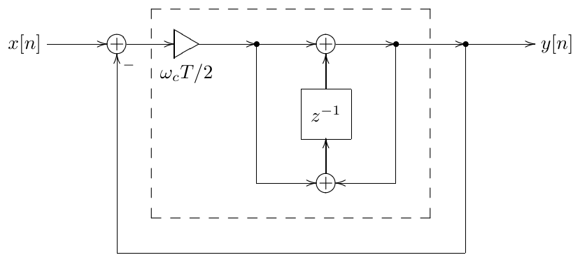

*Figure 3.12: 1-pole TPT lowpass filter (the dashed line denotes the trapezoidal integrator).*

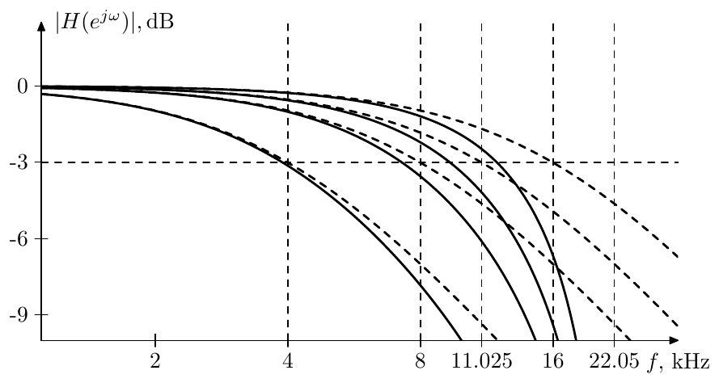

*Figure 3.13: Amplitude response of an unprewarped bilinear-transformed 1-pole lowpass filter for a number of different cutoffs. Dashed curves represent the respective analog filter responses for the same cutoffs. Sampling rate 44.1kHz.*

$$
\omega_a = \mu(\omega_d) = \frac{2}{T}\tan\frac{\omega_d T}{2} \tag{3.10}
$$

Now, given some desired analog response, we could take some point $\omega_a$ on
this response and ask ourselves, where is the same point located on the digital
response. According to (3.10), it is located at $\mu^{-1}(\omega_a)$ (where $\mu^{-1}$ is the function
inverse of $\mu$). Thus the ratio of the actual and desired frequencies is $\mu^{-1}(\omega_a)/\omega_a$,
or, in the octave scale:

$$
\Delta P = \log_2\frac{\mu^{-1}(\omega_a)}{\omega_a}
$$

The solid curve in Fig. 3.14 illustrates (note that Fig. 3.14 labels the $\Delta P$ axis
in semitones).

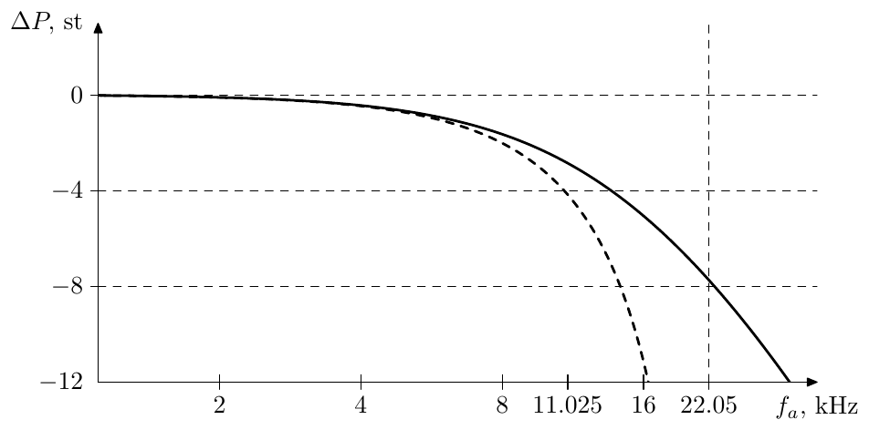

*Figure 3.14: Bilinear transform's detuning of analog frequencies plotted against analog frequency (solid curve) or digital frequency (dashed curve). Sampling rate 44.1kHz.*

We could also express the detuning of analog frequencies in terms of the
corresponding digital frequency. Given the digital frequency response, we take
some point $\omega_d$ and ask ourselves, where is the same point located on the analog
response. According to (3.10), it is located at $\mu(\omega_d)$ and thus the frequency
ratio is $\omega_d/\mu(\omega_d)$, respectively

$$
\Delta P = \log_2\frac{\omega_d}{\mu(\omega_d)}
$$

The dashed curve in Fig. 3.14 illustrates. Note that we are not talking about how
much the specified digital frequency will be detuned (because digital frequencies
are not getting detuned, they are already where they are), it's still about how
much the corresponding analog frequency will be detuned.

Thus, given an analog filter with a frequency response $H_a(j\omega)$, its digital
counterpart will have its frequencies detuned as shown in Fig. 3.14. Particularly,
the cutoff point, instead of being at the specified frequency $\omega = \omega_c$, will be at

$$
\omega_d = \mu^{-1}(\omega_c) \tag{3.11}
$$

In principle, one could argue that the frequency response change in Fig. 3.13
is not that drastic and could be tolerated, especially since the deviation occurs
mostly in the high frequency range, which is not the most audible part of the
frequency spectrum. This might have been the case with the 1-pole lowpass
filter, however for other filters with more complicated amplitude responses it
won't be as acceptable. Fig. 3.15 illustrates the frequency error for a 2-pole
resonating lowpass filter. The resonance peaks (which occur close to the filter's
cutoff) are very audible and so would be their detuning, which according to
Fig. 3.14 is in the range of semitones. Particularly, at 16kHz the dashed curve
in Fig. 3.14 shows a detuning of ca. 1 octave, meaning that we would have a
resonance at this point when it should have been occurring at ca. 32kHz.

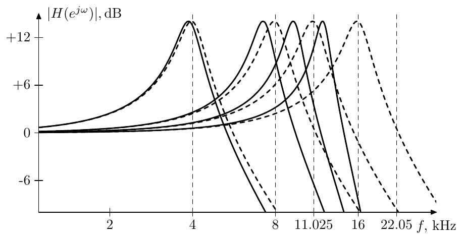

*Figure 3.15: Amplitude response of an unprewarped bilinear-transformed resonating 2-pole lowpass filter for a number of different cutoffs. Dashed curves represent the respective analog filter responses for the same cutoffs. Sampling rate 44.1kHz.*

### Prewarping at cutoff

As a general rule (to which there are exceptions), we would like the cutoff point
of the filter to be positioned exactly at the specified cutoff frequency $\omega_c$. In this
regard we could notice that if we used a different cutoff value

$$
\tilde\omega_c = \mu(\omega_c) \tag{3.12}
$$

then (3.11) would give

$$
\omega_d = \mu^{-1}(\tilde\omega_c) = \mu^{-1}(\mu(\omega_c)) = \omega_c
$$

and the cutoff point would be exactly where we wanted it to be. Fig. 3.16 illus-
trates. The cutoff correction (3.12) is a standard technique used in combination
with the bilinear transform. It is referred to as *cutoff prewarping*.

Technically, cutoff prewarping means that we use $\tilde\omega_c$ instead of $\omega_c$ in the
gains of the filter's integrators. However, the integrator gains are not exactly
$\omega_c$ but rather $\omega_c T/2$. From (3.12) and (3.10) we have

$$
\frac{\tilde\omega_c T}{2} = \frac{2}{T}\tan\frac{\omega_c T}{2}\cdot\frac{T}{2} = \tan\frac{\omega_c T}{2} \tag{3.13}
$$

Thus, we can directly apply (3.13) to compute the prewarped gains $\tilde\omega_c T/2$. Note
that (3.13) is essentially identical to (3.7).

The cutoff prewarping redistributes the frequency error shown in Fig. 3.14.
In the absence of prewarping the error was zero at $\omega = 0$ and monotonically
growing as $\omega$ increases. With the cutoff prewarping the error is zero at $\omega = \omega_c$
instead and grows further away from this point.

Indeed, let $H(j\omega)$ be unit-cutoff analog response of the filter in question.
And let's pick up an analog frequency $\omega_a$ and find the respective detuning. The
correct frequency response at $\omega_a$ is

$$
H_a(\omega_a) = H(j\omega_a/\omega_c) \tag{3.14a}
$$

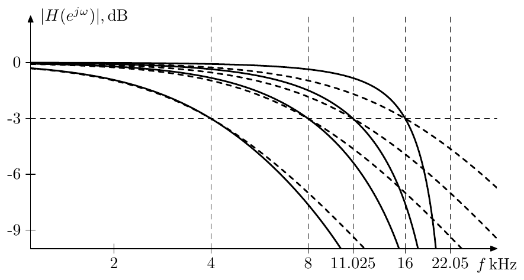

*Figure 3.16: Amplitude response of a prewarped bilinear-transformed 1-pole lowpass filter for a number of different cutoffs. Dashed curves represent the respective analog filter responses for the same cutoffs. Sampling rate 44.1kHz.*

On the other hand, given the prewarped cutoff $\tilde\omega_c = \mu(\omega_c)$, the digital
frequency response at some frequency $\omega_d$ is

$$
H_d(e^{j\omega_d}) = H(j\mu(\omega_d)/\tilde\omega_c) = H(j\mu(\omega_d)/\mu(\omega_c)) \tag{3.14b}
$$

We want to find such $\omega_d$ that the arguments of $H(j\omega)$ in (3.14a) and (3.14b)
are identical:

$$
\frac{\mu(\omega_d)}{\mu(\omega_c)} = \frac{\omega_a}{\omega_c} \tag{3.15}
$$

From where

$$
\omega_d = \mu^{-1}\!\left(\omega_a\frac{\mu(\omega_c)}{\omega_c}\right)
$$

The solid curves in Fig. 3.17 illustrate the respective detuning $\omega_a/\omega_d$ (in semi-
tones) of analog frequencies.

Alternatively from (3.15) we could express $\omega_a$ as a function of $\omega_d$:

$$
\omega_a = \frac{\omega_c}{\mu(\omega_c)}\mu(\omega_d)
$$

thus expressing the analog frequency detuning $\omega_a/\omega_d$ as a function of $\omega_d$. The
dashed curves in Fig. 3.17 illustrate.

Apparently, the maximum error to the left of $\omega = \omega_c$ is attained at $\omega = 0$.
Letting $\omega_a \to 0$ and, equivalently, $\omega_d \to 0$ we have $\mu(\omega_d) \sim \omega_d$ and (3.15) turns
into

$$
\frac{\omega_d}{\mu(\omega_c)} \sim \frac{\omega_a}{\omega_c}
$$

or

$$
\frac{\omega_d}{\omega_a} \sim \frac{\mu(\omega_c)}{\omega_c}
$$

and thus the detuning at $\omega = 0$ is

$$
\Delta P\Big|_{\omega=0} = \log_2\frac{\mu(\omega_c)}{\omega_c} \tag{3.16}
$$


*Figure 3.17: Prewarped bilinear transform's detuning of analog frequencies plotted against analog frequency (solid curves) or digital frequency (dashed curves). Different curves correspond to prewarping at different cutoff frequencies. Sampling rate 44.1kHz.*

### Other prewarping points

We have just developed the prewarping technique from the condition that the
cutoff point must be preserved by the mapping (3.6). However instead we could
have required any other point $\omega_p$ to be preserved.

Given the cutoff $\omega_c$, the analog response at $\omega_p$ is

$$
H_a(\omega_p) = H(j\omega_p/\omega_c) \tag{3.17a}
$$

On the other hand, given the prewarped cutoff $\tilde\omega_c$ (we want to prewarp at
a different point now, therefore we don't know yet, what is the relationship
between $\omega_c$ and $\tilde\omega_c$) the digital frequency response at $\omega_p$ is

$$
H_d(e^{j\omega_p}) = H(j\mu(\omega_p)/\tilde\omega_c) \tag{3.17b}
$$

We want to find such $\tilde\omega_c$ that the arguments of $H(j\omega)$ in (3.17a) and (3.17b)
are identical:

$$
\frac{\omega_p}{\omega_c} = \frac{\mu(\omega_p)}{\tilde\omega_c}
$$

and

$$
\tilde\omega_c = \frac{\mu(\omega_p)}{\omega_p}\omega_c \tag{3.18}
$$

Equation (3.18) is the generalized prewarping formula, where $\omega_p$ is the
frequency response point of zero detuning. We will refer to $\omega_p$ as the
*prewarping point*.

According to (3.18) prewarping at $\omega_p$ simply means that the cutoff
should be multiplied by $\mu(\omega_p)/\omega_p$. At $\omega_p = \omega_c$ this
multiplication reduces to (3.12).

In order to find the detuning at other frequencies, notice that equations
(3.14) turn into

$$
H_a(\omega_a) = H(j\omega_a/\omega_c)
$$

$$
H_d(e^{j\omega_d}) = H(j\mu(\omega_d)/\tilde\omega_c) = H\left(j\frac{\omega_p\mu(\omega_d)}{\omega_c\mu(\omega_p)}\right)
$$

from where, equating the arguments of $H(j\omega)$:

$$
\frac{\omega_p\mu(\omega_d)}{\omega_c\mu(\omega_p)} = \frac{\omega_a}{\omega_c}
$$

we have

$$
\frac{\mu(\omega_d)}{\mu(\omega_p)} = \frac{\omega_a}{\omega_p} \tag{3.19}
$$

Equation (3.19) is identical to (3.15) except that it has $\omega_p$ in place
of $\omega_c$. Thus we could reuse the results of the previous analysis of the
analog frequency detuning. In particular Fig. 3.17 fully applies, different
curves corresponding to different prewarping points. At the same time, (3.16)
simply turns to

$$
\Delta P\Big|_{\omega=0} = \log_2\frac{\mu(\omega_p)}{\omega_p} \tag{3.20}
$$

### Bounded cutoff prewarping

Even though cutoff prewarping is an absolutely standard technique and is often
used without any second thought, the need for a different choice of the
prewarping point is actually not as exotic as it might seem. Consider e.g. the
amplitude response of a 1-pole highpass filter prewarped by (3.12), shown in
Fig. 3.18. One can notice a huge discrepancy between analog and digital
amplitude responses occurring well into the audible frequency range
$[0, 16\text{kHz}]$. The error is getting particularly bad at cutoffs above
16kHz. In comparison, the responses of unprewarped filters in Fig. 3.19 even
look kind of better, especially if only the audible frequency range is
considered. This would be even more so, if higher sampling rates were
involved, where the audible range error in Fig. 3.19 would become smaller,
while the same error in Fig. 3.18 can still get as large, given a sufficiently
high cutoff value.

Apparently, the large error within the audible range in Fig. 3.18 is due to
the detuning error illustrated in Fig. 3.17. This error wasn't as obvious in
the case of the 1-pole lowpass filter, since this filter's amplitude response
is almost constant to the left of the cutoff point. On the other hand,
highpass filter's amplitude response is changing noticeably in the same area,
which makes the detuning error is made much more promiment.

Does this suggest that we shouldn't use cutoff prewarping with highpass
filters? In principle this is engineer's decision. However consider the
unprewarped resonating 2-pole highpass filter's amplitude response in Fig.
3.20. As with the
responating lowpass, the resonance peak detuning is quite prominent here.
Also the difference in the response value is magnified around the resonance
point. All in all, we'd rather prewarp the cutoff (Fig. 3.21) and tolerate the
detuning to the left of $\omega_c$.

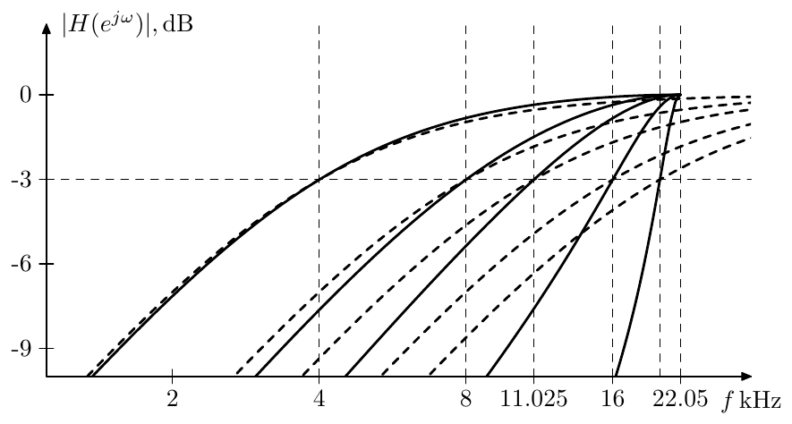
*Figure 3.18: Amplitude response of a prewarped bilinear-transformed 1-pole highpass filter for a number of different cutoffs. Dashed curves represent the respective analog filter responses for the same cutoffs. Sampling rate 44.1kHz.*

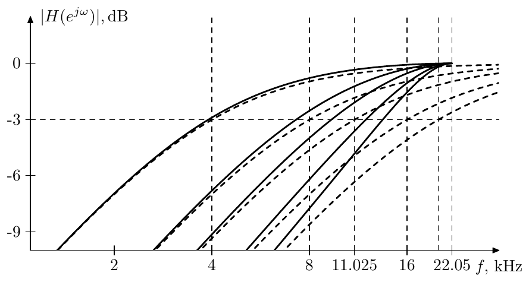
*Figure 3.19: Amplitude response of an unprewarped bilinear-transformed 1-pole highpass filter for a number of different cutoffs. Dashed curves represent the respective analog filter responses for the same cutoffs. Sampling rate 44.1kHz.*

However notice, that as the cutoff peak is getting out of the audible range,
we stop caring, where exactly it is positioned, since it can't be heard
anyway. So, why should we then tolerage the error in the audible range which
continues to increase even faster? Instead, at this moment we could fix the
prewarping point to the upper boundary of the audible range:

$$
\omega_p = \begin{cases} \omega_c & \text{if } \omega_c \le \omega_{\max} \\ \omega_{\max} & \text{if } \omega_c \ge \omega_{\max} \end{cases}
$$

or simply

$$
\omega_p = \min\{\omega_c, \omega_{\max}\} \tag{3.21}
$$

where $\omega_{\max}$ is some point around 16kHz. At least then the detuning
in the audible range won't grow any further than it is at
$\omega_c = \omega_{\max}$ (Fig. 3.22). The picture gets even better at higher
sampling rates (Fig. 3.23).

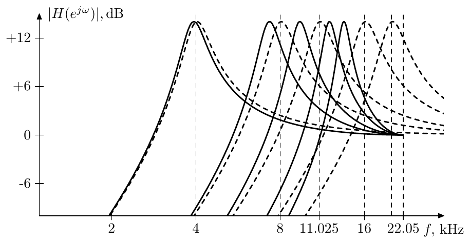
*Figure 3.20: Amplitude response of an unprewarped bilinear-transformed resonating 2-pole highpass filter for a number of different cutoffs. Dashed curves represent the respective analog filter responses for the same cutoffs. Sampling rate 44.1kHz.*

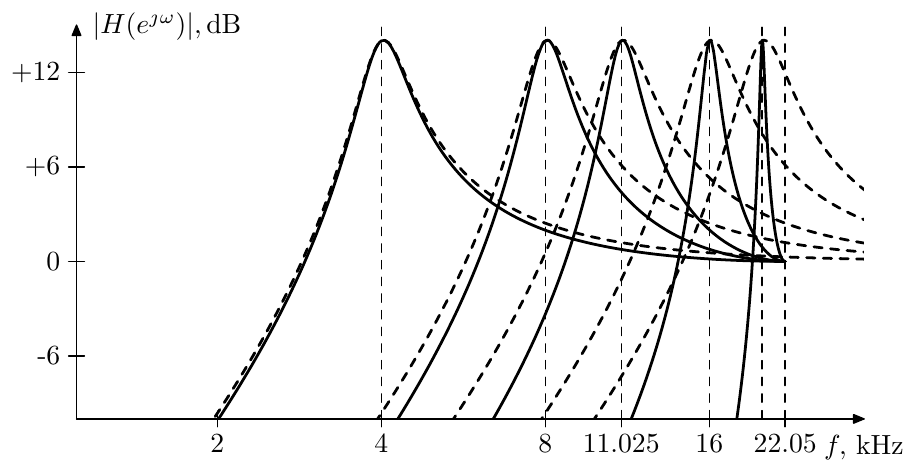
*Figure 3.21: Amplitude response of a prewarped bilinear-transformed resonating 2-pole highpass filter for a number of different cutoffs. Dashed curves represent the respective analog filter responses for the same cutoffs. Sampling rate 44.1kHz.*

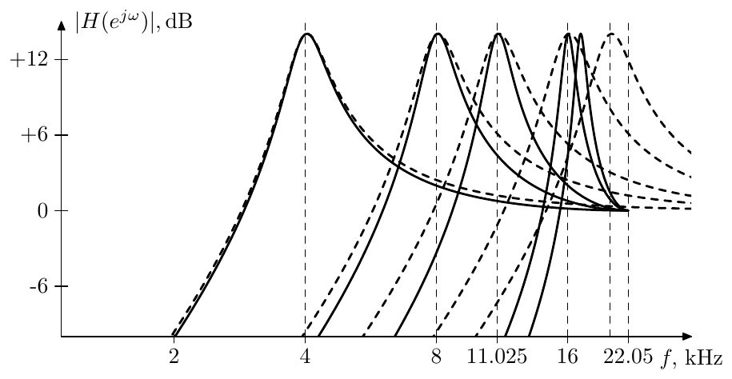
*Figure 3.22: Effect of cutoff prewarping bounded at 16kHz. Sampling rate 44.1kHz.*

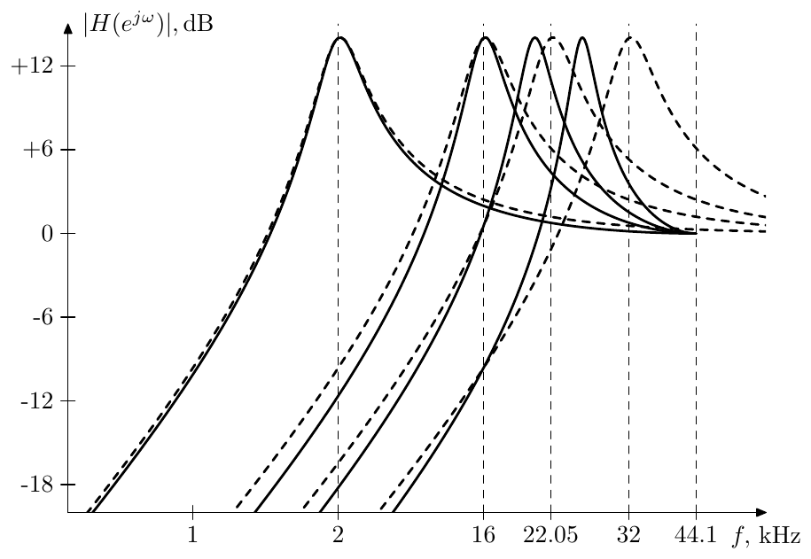
*Figure 3.23: Effect of cutoff prewarping bounded at 16kHz. Sampling rate 88.1kHz.*

Substituting (3.21) into (3.18) we obtain

$$
\tilde\omega_c = \frac{\mu(\min\{\omega_c,\omega_{\max}\})}{\min\{\omega_c,\omega_{\max}\}}\,\omega_c = \begin{cases} \mu(\omega_c) & \text{if } \omega_c \le \omega_{\max} \\[2mm] \dfrac{\mu(\omega_{\max})}{\omega_{\max}}\,\omega_c & \text{if } \omega_c \ge \omega_{\max} \end{cases} \tag{3.22}
$$

The mapping defined by (3.22) is shown in Fig. 3.24. Note that thereby we
become able to specify the cutoffs beyond Nyquist, and actually to specify
arbitrarily large cutoffs, since the new mapping curve is crossing the former
vertical asymptote at $\omega_c = \pi/2$.


*Figure 3.24: Bounded cutoff prewarping. The thick dashed line shows the unbounded prewarping continuation. The thin oblique dashed line is the continuation of the straight part of the prewarping curve. The black dot marks the breakpoint of the prewarping curve.*

The breakpoint at $\omega_c = \omega_{\max}$ in Fig. 3.24 can be somewhat
unexpected. In order to understand the mechanism behind its appearance
suppose $\omega_c$ is varying with time. Using (3.18) we compute the time
derivative of $\tilde\omega_c$:

$$
\dot{\tilde\omega}_c = \omega_c\frac{d}{dt}\frac{\mu(\omega_p)}{\omega_p} + \frac{\mu(\omega_p)}{\omega_p}\dot\omega_c
$$

As $\omega_c$ becomes larger than $\omega_{\max}$ the first term suddenly
disappears and there is a jump in $\dot{\tilde\omega}_c$. In other words, the
variation of the prewarping point makes its own contribution to
$\dot{\tilde\omega}_c$. As soon as the variation stops, the respective
contribution abruptly disappears.

The frequency detunings occurring in case of (3.22) can be found directly
from Fig. 3.17, keeping in mind that (3.22) is simply another expression of
(3.21).

### Continuous-speed prewarping

The breakpoint occurring in Fig. 3.24 might be undesirable if the cutoff is
being modulated, since there can be a sudden change of the perceived
modulation speed as the cutoff traverses through the prewarping breakpoint.
For that reason it might be desirable to smooth the breakpoint in one way or
the other. The simplest approach would be to continue the curve as a tangent
line after the breakpoint:

$$
\tilde\omega_c = \begin{cases} \mu(\omega_c) & \text{if } \omega_c \le \omega_{\max} \\ \mu(\omega_{\max}) + (\omega_c - \omega_{\max})\mu'(\omega_{\max}) & \text{if } \omega_c \ge \omega_{\max} \end{cases} \tag{3.23}
$$

where

$$
\mu'(\omega) = \frac{d}{d\omega}\left(\frac{2}{T}\tan\frac{\omega T}{2}\right) = \frac{1}{\cos^2\dfrac{\omega T}{2}} = 1 + \tan^2\frac{\omega T}{2} = 1 + \left(\frac{T}{2}\mu(\omega)\right)^2
$$

is the derivative of $\mu(\omega)$. Note, however, that this will no longer
keep $\omega_{\max}$ as the prewarping point and the situation would be
something in between (3.12) and (3.22).

At $\omega_c \to \infty$ from (3.23) we have

$$
\tilde\omega_c = \mu(\omega_{\max}) + (\omega_c - \omega_{\max})\mu'(\omega_{\max}) \sim \mu'(\omega_{\max})\omega_c \tag{3.24}
$$

Comparing the right-hand side of (3.24) to (3.18) we obtain the equation for
the effective prewarping point at infinity:

$$
\frac{\mu(\omega_p)}{\omega_p} = \mu'(\omega_{\max}) \tag{3.25}
$$

In principle $\omega_p$ can be found from (3.25), however we are not so much
interested in how far off will be the prewarping point, as in the estimation
of the associated increase in detuning. By (3.20)

$$
\Delta P\Big|_{\omega=0} = \log_2\frac{\mu(\omega_p)}{\omega_p} = \log_2\mu'(\omega_{\max}) \qquad (\text{at } \omega_c = \infty)
$$

which for $\omega_{\max} = 16$kHz at 44.1kHz sampling rate gives ca. 2.5
octaves, while at 88.2kHz sampling rate it gives only about 0.5 octave. In
comparison, at $\omega_c = \omega_{\max}$ (and respectively
$\omega_p = \omega_{\max}$) we would have a smaller value

$$
\Delta P\Big|_{\omega=0} = \log_2\frac{\mu(\omega_p)}{\omega_p} = \log_2\frac{\mu(\omega_{\max})}{\omega_{\max}}
$$

which for $\omega_{\max} = 16$kHz at 44.1kHz sampling rate gives ca. 1 octave,
while at 88.2kHz sampling rate it gives only about 2 semitones.

We have therefore found the effect of (3.23) on the detuning occurring at
$\omega = 0$ for $\omega_c \to \infty$. It would also be nice to estimate the
same effect at $\omega = \omega_{\max}$. By (3.19)

$$
\frac{\mu(\omega_d)}{\omega_a} = \frac{\mu(\omega_p)}{\omega_p}
$$

which by (3.25) becomes

$$
\frac{\mu(\omega_d)}{\omega_a} = \mu'(\omega_{\max})
$$

Letting $\omega_d = \omega_{\max}$ we have

$$
\omega_a = \frac{\mu(\omega_{\max})}{\mu'(\omega_{\max})} = \frac{\dfrac{2}{T}\tan\dfrac{\omega_{\max}T}{2}}{\cos^{-2}\left(\dfrac{\omega_{\max}T}{2}\right)} = \frac{1}{T}\sin(\omega_{\max}T)
$$

and the detuning itself is the logarithm of the ratio

$$
\frac{\omega_a}{\omega_d} = \frac{\omega_a}{\omega_{\max}} = \frac{\sin(\omega_{\max}T)}{\omega_{\max}T} = \operatorname{sinc}(\omega_{\max}T)
$$

For $\omega_{\max}=16$kHz at 44.1kHz sampling rate this gives ca. $-1.5$
octaves, while at 88.1kHz it gives ca. $-4$ semitones.

Since (as illustrated by Fig. 3.17) the detuning is a monotonic function of
$\omega$, at $\omega_c=\infty$ we are having the audible range detuning error
in the range of ca. $[-1.5, 2.5]$ octaves at 44.1kHz sampling rate and in the
range of ca. $[-4,6]$ semitones at 88.2kHz sampling rate. Therefore it is
more or less balanced out, although being a bit larger at higher frequencies.

Apparently, more elaborate ways of smoothing the breakpoint in Fig. 3.24 may
be designed, but we won't cover them here as the options are almost infinite.

### Prewarping of systems of filters

According to (3.18), prewarping is nothing more than a multiplication of the
cutoff gains of the integrators by $\mu(\omega_p)/\omega_p$, where $\omega_p$
is the prewarping point.

Suppose we are having a system consisting of several filters connected
together. When prewarping filters in such system, it would be a good idea to
choose a common prewarping point for all filters. In this case we multiply
their cutoffs by one and the same coefficient. Thereby their amplitude and
phase responses are shifted by one and the same amount (in the logarithmic
frequency axis), and they all retain the frequency response relationships
which existed between them prior to prewarping. Effectively this is the same
as changing the "common cutoff" of the filter system, and the frequency
response of the entire system is simply shifted horizontally by the same
amount, fully retaining its shape.

On the other hand by prewarping them independently we shift the frequency
response of each filter differently from the others and the amplitude and
phase relationships between those are thereby destroyed. Therefore the
amplitude and phase response shapes of the entire system of filters are not
preserved.

As an illustration consider a parallel connection of a 1-pole lowpass and a
1-pole highpass filter, the lowpass cutoff being $\omega_c/2$, the highpass
cutoff being $2\omega_c$ where $\omega_c$ is the formal cutoff of the system:

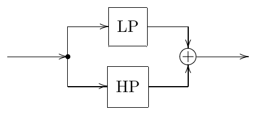

The transfer function of such system (written in the unit-cutoff form) is

$$
H(s) = \frac{1}{1+2s} + \frac{s/2}{1+s/2}
$$

The result of prewarping the lowpass and the highpass separately at their
respective cutoffs $\omega_c/2$ and $2\omega$ is shown in Fig. 3.25. Actually
for the $\omega_c = 11.025$kHz and $\omega_c=16$kHz the highpass cutoff
$2\omega_c$ needed to be clipped prior to prewaring, since it is equal or
exceeds Nyquist and cannot be directly prewarped by (3.12). Compare to Fig.
3.26 where the prewarping of both filters has been done at the common point
$\omega_c$.

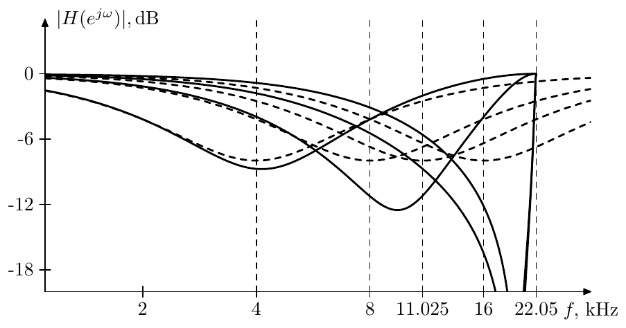
*Figure 3.25: Separate prewarping of system components (for a number of different cutoffs). Dashed curves represent the respective analog filter responses for the same cutoffs. Sampling rate 44.1kHz.*

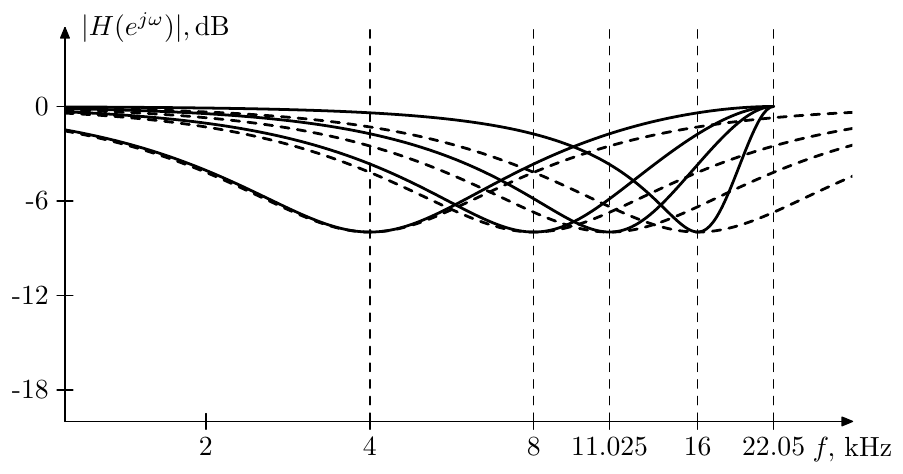
*Figure 3.26: Common-point prewarping of system components (for a number of different cutoffs). Dashed curves represent the respective analog filter responses for the same cutoffs. Sampling rate 44.1kHz.*

### Other prewarping techniques

With 1-pole lowpass and highpass filters the only available control parameter
is the filter cutoff. Thus the only option which we had for compensating the
bilinear transform's frequency detuning was correcting the cutoff value.
Other filters may have more parameters available. Usually their parameters
(e.g. resonance) will have a strong "vertical" effect on the amplitude
response and thus are not very suitable for compensating the frequency
detuning. However in some cases there will be further options of horizonally
altering the filter's amplitude (and phase) responses without causing
noticeable changes in the vertical direction. In such cases we will have
further options for more detailed compensation of the frequency detuning.

Note, however, that these compensations, being not expressible as cutoff
multiplication, may destroy the frequency response of a system of filters,
unless there is some other way to make them have identical effect on all of
the filters in the system. We will discuss some examples of this later in the
book.

## 3.9 Zero-delay feedback

There is a further problem with the trapezoidal integrator replacement in
the TPT method. Replacing the integrators with trapezoidal ones introduces
*delayless feedback loops* (that is, feedback loops not containing any delay
elements) into the structure. E.g. consider the structure in Fig. 3.12.
Carefully examining this structure, we find that it has a feedback loop which
doesn't contain any unit delay elements. This loop goes from the leftmost
summator through the gain, through the upper path of the integrator to the
filter's output and back through the large feedback path to the leftmost
summator.

Why is this delayless loop a problem? Let's consider for example the naive
lowpass filter structure in Fig. 3.5. Suppose we don't have the respective
program code representation and wish to obtain it from the block diagram. We
could do it in the following way. Consider Fig. 3.27, which is the same as
Fig. 3.5, except that it labels all signal points. At the beginning of the
computation of a new sample the signals $A$ and $B$ are already known.
$A = x[n]$ is the current input sample and $B$ is taken from the internal
state memory of the $z^{-1}$ element. Therefore we can compute $C = A - B$.
Then we can compute $D = (\omega_c T)C$ and finally $E = D + B$. The value of
$E$ is then stored into the internal memory of the $z^{-1}$ element (for the
next sample computation) and is also sent to the output as the new $y[n]$
value. Easy, right?

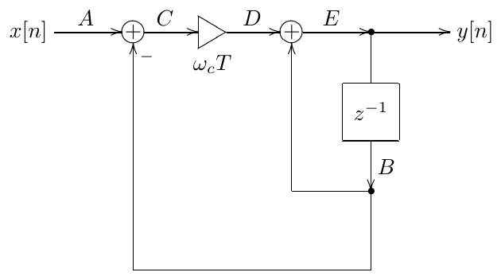
*Figure 3.27: Naive 1-pole lowpass filter and the respective signal computation order.*

Now the same approach doesn't work for the structure in Fig. 3.12. Because
there is a delayless loop, we can't find a starting point for the computation
within that loop.

The classical way of solving this problem is exactly the same as what we had
in the naive approach: introduce a $z^{-1}$ into the delayless feedback,
turning it into a feedback containing a unit delay (Fig. 3.28). Now there are
no delayless feedback paths and we can arrange the computation order in a
way similar to Fig. 3.27. This however destroys the resulting frequency
response, because the transfer function is now different. In fact the
obtained result is not significantly better (if better at all) than the one
from the naive approach. There are some serious artifacts in the frequency
response closer to the Nyquist frequency, if the filter cutoff is
sufficiently high.

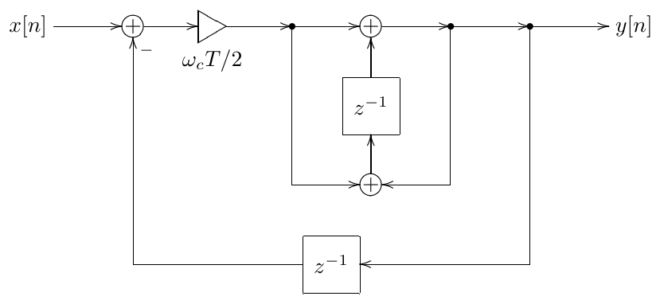
*Figure 3.28: Digital 1-pole lowpass filter with a trapezoidal integrator and an extra delay in the feedback.*

Therefore we shouldn't introduce any modifications into the structure and
solve the *zero-delay feedback* problem instead. The term "zero-delay
feedback" originates from the fact that we avoid introducing a one-sample
delay into the feedback (like in Fig. 3.28) and instead keep the feedback
delay equal to zero.

So, let's solve the zero-delay feedback problem for the structure in Fig.
3.12. Notice that this structure simply consists of a negative feedback loop
around a trapezoidal integrator, where the trapezoidal integrator structure
is exactly the one from Fig. 3.11. We will now introduce the concept of the
*instantaneous response* of this integrator structure.

So, consider the integrator structure in Fig. 3.11. Since there are no
delayless loops in the integrator, it's not difficult to obtain the
following expression for $y[n]$:

$$
y[n] = \frac{\omega_c T}{2}x[n] + u[n-1] \tag{3.26}
$$

Notice that, at the time $x[n]$ arrives at the integrator's input, all
values in the right-hand side of (3.26) are known (no unknown variables).
Introducing notation

$$
g = \frac{\omega_c T}{2}
$$

$$
s[n] = u[n-1]
$$

we have

$$
y[n] = gx[n] + s[n]
$$

or, dropping the discrete time argument notation for simplicity,

$$
y = gx + s
$$

That is, at any given time moment $n$, the output of the integrator $y$ is a
linear function of its input $x$, where the values of the parameters of this
linear function are known. The $g$ parameter doesn't depend on the internal
state of the integrator, while the $s$ parameter does depend on the internal
state of the integrator. We will refer to the linear function $f(x) = gx + s$
as the *instantaneous response* of the integrator at the respective implied
time moment $n$. The coefficient $g$ can be referred to as the *instantaneous
response gain* or simply *instantaneous gain*. The term $s$ can be referred to
as the *instantaneous response offset* or simply *instantaneous offset*.

Let's now redraw the filter structure in Fig. 3.12 as in Fig. 3.29. We have
changed the notation from $x$ to $\xi$ in the $gx + s$ expression to avoid the
confusion with the input signal $x[n]$ of the entire filter.

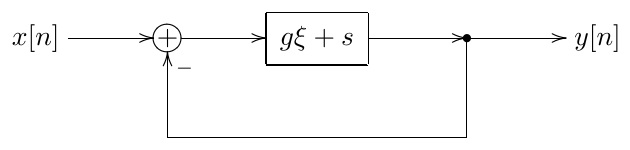

*Figure 3.29: 1-pole TPT lowpass filter with the integrator in the
instantaneous response form.*

Now we can easily write and solve the zero-delay feedback equation. Indeed,
suppose we already know the filter output $y[n]$. Then the output signal of
the feedback summator is $x[n] - y[n]$ and the output of the integrator is
respectively $g(x[n] - y[n]) + s$. Thus

$$
y[n] = g(x[n] - y[n]) + s
$$

or, dropping the time argument notation for simplicity,

$$
y = g(x - y) + s \tag{3.27}
$$

The equation (3.27) is the zero-delay feedback equation for the filter in
Fig. 3.29 (or, for that matter, in Fig. 3.12). Solving this equation, we obtain

$$
y(1+g) = gx + s
$$

and respectively

$$
y = \frac{gx+s}{1+g} \tag{3.28}
$$

Having found $y$ (that is, having predicted the output $y[n]$), we can then
proceed with computing the other signals in the structure in Fig. 3.12,
beginning with the output of the leftmost summator.[^14]

It's worth mentioning that (3.28) can be used to obtain the instantaneous
response of the entire filter from Fig. 3.12. Indeed, rewriting (3.28) as

$$
y = \frac{g}{1+g}x + \frac{s}{1+g}
$$

and introducing notations

$$
G = \frac{g}{1+g}
$$

$$
S = \frac{s}{1+g}
$$

we have

$$
y = Gx + S \tag{3.29}
$$

So, the instantaneous response of the entire lowpass filter in Fig. 3.12 is
again a linear function of the input. We could use the expression (3.29) e.g.
to solve the zero-delay feedback problem for some larger feedback loop
containing a 1-pole lowpass filter.

## 3.10 Implementations

### 1-pole lowpass

We are now going to convert the structure in Fig. 3.12 into a piece of code.
Let's introduce helper variables into Fig. 3.12 as shown in Fig. 3.30, where we
have used the already known to us fact that, given the integrator's
instantaneous response $gx + s$, the value of $s$ equals the output of the
$z^{-1}$ element.

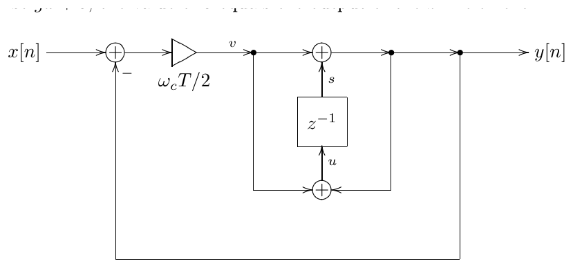

*Figure 3.30: 1-pole TPT lowpass filter with helper variables.*

We already know $y$ from (3.29). Since $g = \omega_c T/2$, we have

$$
\begin{aligned}
v = g(x-y) &= g\left(x - Gx - S\right) = g\left(x - \frac{g}{1+g}x - \frac{s}{1+g}\right) = \\
&= g\left(\frac{1}{1+g}x - \frac{s}{1+g}\right) = g\,\frac{x-s}{1+g}
\end{aligned} \tag{3.30}
$$

Now (3.30) gives a direct expression for $v$ in terms of known signals, not
using $y$. In order to avoid unnecessary computations, we can simply reobtain
$y$ using the obvious from Fig. 3.30 fact that $y$ is just a sum of $v$ and
$s$:

$$
y = v + s \tag{3.31}
$$

We also need the $z^{-1}$ input (which we need to store in the $z^{-1}$'s
memory) which is also obtained from Fig. 3.30 in an obvious way:

$$
u = y + v \tag{3.32}
$$

The equations (3.30), (3.31) and (3.32) can be directly expressed in program
code:

```
// perform one sample tick of the lowpass filter
// G = g/(1+g)
// the variable 's' contains the state of z^-1 block
v := (x-s)*G;
y := v + s;
s := y + v;
```

or instead expressed in a block diagram form (Fig. 3.31). Notice that the
block diagram doesn't contain any delayless loops anymore.

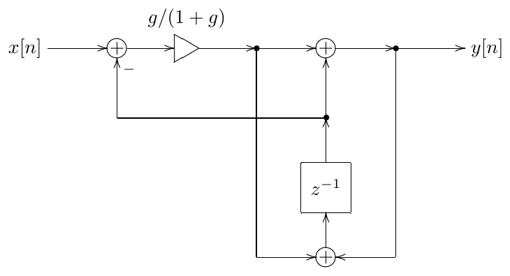

*Figure 3.31: 1-pole TPT lowpass filter with resolved zero-delay
feedback.*

### 1-pole multimode

The highpass signal can be obtained from the structure in Fig. 3.31 in a
trivial manner, since $y_{\text{HP}} = x - y_{\text{LP}}$, thereby turning
Fig. 3.31 into a multimode 1-pole.

### 1-pole highpass

If we need *only* the highpass signal, we could do it in a smaller number of
operations than in the multimode 1-pole. By noticing that

$$
y_{\text{HP}} = x - y_{\text{LP}} = x - (v+s) = (x-s) - v = (x-s) - \frac{g}{1+g}(x-s) = \frac{1}{1+g}(x-s)
$$

and that

$$
u = y_{\text{LP}} + v = s + 2v = s + \frac{2g}{1+g}
$$

we can implement the highpass filter as follows:

```
// perform one sample tick of the highpass filter
// Ghp = 1/(1+g)
// the variable 's' contains the state of z^-1 block
xs := x - s;
y := xs*Ghp;
s := s + y*2g;
```

however this way we have traded an addition/subtraction pair for one
multiplication, plus instead of one cutoff-dependent parameter $G$ we need to
store and access Ghp and 2g. Therefore this is not necessarily a performance
improvement.

### 1-pole allpass

The allpass signal can be obtained from the multimode 1-pole in a trivial
manner, recalling that $y_{\text{AP}} = y_{\text{LP}} - y_{\text{HP}}$.
However, if we need *only* the allpass signal, we could save a couple of
operations. Noticing that

$$
y_{\text{AP}} = y_{\text{LP}} - y_{\text{HP}} = v+s - (x - (v+s)) = (s+2v) - (x-s)
$$

and that $s + 2v = u$ is the new state of the $z^{-1}$ block, we obtain

```
// perform one sample tick of the allpass filter
// 2Glp=2g/(1+g)
// the variable 's' contains the state of z^-1 block
xs := x - s;
s := s + xs*2Glp;
y := s - xs;
```

## 3.11 Direct forms

Consider again the equation (3.5), which describes the application of the
bilinear transform to convert an analog transfer function to a digital one.
There is a classical method of digital filter design which is based directly
on this transformation, without using any integrator replacement techniques.
In the author's experience, for music DSP needs this method typically has a
largely inferior quality, compared to the TPT. Nevertheless we will describe
it here for completeness and for a couple of other reasons. Firstly, it would
be nice to try to analyse and understand the reasons for the problems of this
method. Secondly, this method could be useful once in a while. Particularly,
its deficiencies mostly disappear in the time-invariant (unmodulated or
sufficiently slowly modulated) case.

Having obtained a digital transfer function from (3.5), we could observe,
that, since the original analog transfer function was a rational function of
$s$, the resulting digital transfer function will necessarily be a rational
function of $z$. E.g. using the familiar 1-pole lowpass transfer function

$$
H_a(s) = \frac{\omega_c}{s+\omega_c}
$$

we obtain

$$
\begin{aligned}
H_d(z) = H_a\left(\frac{2}{T}\cdot\frac{z-1}{z+1}\right) &= \frac{\omega_c}{\frac{2}{T}\cdot\frac{z-1}{z+1}+\omega_c} = \\
&= \frac{\frac{\omega_c T}{2}(z+1)}{(z-1)+\frac{\omega_c T}{2}(z+1)} = \frac{\frac{\omega_c T}{2}(z+1)}{\left(1+\frac{\omega_c T}{2}\right)z - \left(1-\frac{\omega_c T}{2}\right)}
\end{aligned}
$$

Now, there are standard discrete-time structures allowing an implementation of
any given nonstrictly proper rational transfer function. It is easier to use
these structures, if the transfer function is expressed as a rational function
of $z^{-1}$ rather than the one of $z$. In our particular example, we can
multiply the numerator and the denominator by $z^{-1}$, obtaining

$$
H_d(z) = \frac{\frac{\omega_c T}{2}(1+z^{-1})}{\left(1+\frac{\omega_c T}{2}\right) - \left(1-\frac{\omega_c T}{2}\right)z^{-1}}
$$

The further requirement is to have the constant term in the denominator equal
to 1, which can be achieved by dividing everything by $1+\omega_c T/2$:

$$
H_d(z) = \frac{\dfrac{\frac{\omega_c T}{2}}{1+\frac{\omega_c T}{2}}(1+z^{-1})}{1 - \dfrac{1-\frac{\omega_c T}{2}}{1+\frac{\omega_c T}{2}}z^{-1}} \tag{3.33}
$$

Now suppose we have an arbitrary rational nonstrictly proper transfer function
of $z$, expressed via $z^{-1}$ and having the constant term in the denominator
equal to 1:

$$
H(z) = \frac{\displaystyle\sum_{n=0}^{N} b_n z^{-n}}{\displaystyle 1 - \sum_{n=1}^{N} a_n z^{-n}} \tag{3.34}
$$

This transfer function can be implemented by the structure in Fig. 3.32 or by
the structure in Fig. 3.33. One can verify (by computing the transfer
functions of the respective structures) that they indeed implement the
transfer function (3.34). There are also transposed versions of these
structures, which the readers should be able to construct on their own.

Let's use the direct form II to implement (3.33). Apparently, we have

$$
N = 1
$$

$$
b_0 = b_1 = \frac{\frac{\omega_c T}{2}}{1+\frac{\omega_c T}{2}}
$$

$$
a_1 = \frac{1-\frac{\omega_c T}{2}}{1+\frac{\omega_c T}{2}}
$$

and the direct form implementation itself is the one in Fig. 3.34 (we have
merged the $b_0$ and $b_1$ coefficients into a single gain element).

In the time-invariant (unmodulated) case the performance of the direct form
filter in Fig. 3.34 should be identical to the TPT filter in Fig. 3.12, since
both implement the same bilinear-transformed analog transfer function (2.5).
When the cutoff is modulated, however, the performance will be different.

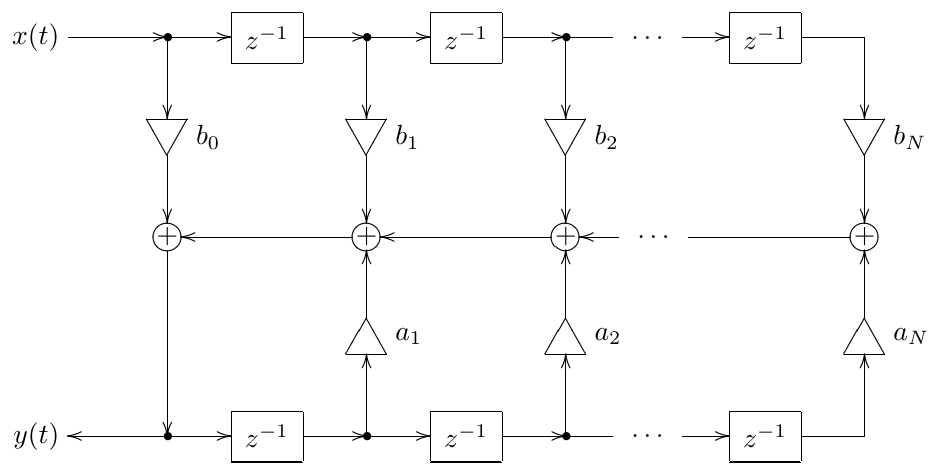

*Figure 3.32: Direct form I (DF1).*

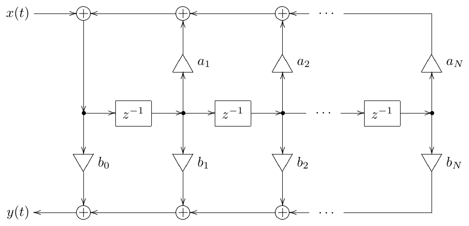

*Figure 3.33: Direct form II (DF2), a.k.a. canonical form.*

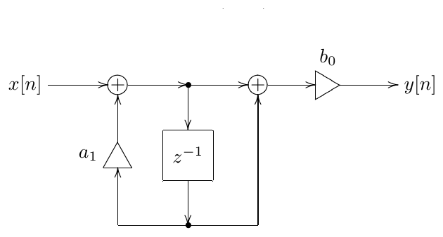

*Figure 3.34: Direct form II 1-pole lowpass filter.*

We have already discussed in Sections 2.7 and 2.16 that different topologies
may have different time-varying behavior even if they share the same transfer
function. Apparently, the difference in behavior between Fig. 3.34 and
Fig. 3.12 is another example of that. Comparing the implementations in
Figs. 3.34 and 3.12, we notice that the structure in Fig. 3.34 contains a gain
element at the output, the value of this gain being approximately proportional
to the cutoff (at low cutoffs). This will particularly produce unsmoothed
jumps in the output in response to jumps in the cutoff value. In the structure
in Fig. 3.12, on the other hand, the cutoff jumps will be smoothed by the
integrator. Thus, the difference between the two structures is similar to the
just discussed effect of the cutoff gain placement with the integrator.

We should conclude that, other things being equal, the structure in Fig. 3.34
is inferior to the one in Fig. 3.12 (or Fig. 3.31). In this respect consider
that Fig. 3.12 is trying to explicitly emulate the analog integration
behavior, *preserving the topology* of the original analog structure, while
Fig. 3.34 is concerned solely with implementing a correct transfer function.
Since Fig. 3.34 implements a classical approach to the bilinear transform
application for digital filter design (which ignores the filter topology)
we'll refer to the trapezoidal integration replacement technique as the
*topology-preserving bilinear transform* (or, shortly, TPBLT). Or, even
shorter, we can refer to this technique as simply the *topology-preserving
transform* (TPT), implicitly assuming that the bilinear transform is being
used.[^15]

In principle, sometimes there are possibilities to "manually fix" the
structures such as in Fig. 3.34. E.g. the time-varying performance of the
latter is drastically improved by moving the $b_0$ gain to the input. The
problem however is that this kind of fixing quickly gets more complicated (if
being possible at all) with larger filter structures. On the other hand, the
TPT method explicitly aims at emulating the time-varying behavior of the
analog prototype structure, which aspect is completely ignored by the
classical transform approach. Besides, if the structure contains
nonlinearities, preserving the topology becomes absolutely critical, because
otherwise these nonlinearites can not be placed in the digital model.[^16]
Also, the direct forms suffer from precision loss issues, the problem growing
bigger with the order of the system. For that reason in practice the direct
forms of orders higher than 2 are rarely used,[^17] but even 2nd-order direct
forms could already noticeably suffer from precision losses.

## 3.12 Transient response

Looking at the 1-pole lowpass filter's discrete-time transfer function (3.33)
and noticing that $\omega_c = -p$ where $p$ is the analog pole, we could
rewrite (3.33) as

$$
H(z) = \frac{\dfrac{\dfrac{-pT}{2}}{1-\dfrac{pT}{2}}\left(1+z^{-1}\right)}{1 - \dfrac{1+\dfrac{pT}{2}}{1-\dfrac{pT}{2}}z^{-1}}
$$

Comparing this to (3.9) we notice that

$$
\frac{1+\frac{pT}{2}}{1-\frac{pT}{2}} = \tilde{p}
$$

where $\tilde{p}$ is the result of the application of the inverse bilinear
transform formula (3.9) to $p$. Further noticing that

$$
\frac{\frac{-pT}{2}}{1-\frac{pT}{2}} = \frac{1}{2}\cdot\left(\frac{1-\frac{pT}{2}}{1-\frac{pT}{2}} - \frac{1+\frac{pT}{2}}{1-\frac{pT}{2}}\right) = \frac{1-\tilde{p}}{2} \tag{3.35}
$$

we rewrite $H(z)$ as

$$
H(z) = \frac{1-\tilde{p}}{2}\cdot\frac{1+z^{-1}}{1-\tilde{p}z^{-1}} = \frac{1-\tilde{p}}{2}\cdot\frac{z+1}{z-\tilde{p}}
$$

Thus $\tilde{p}$ is the pole of $H(z)$, as we should have expected.

On the other hand, applying trapezoidal integration to the 1-pole lowpass
differential equation in the pole form (2.14), we have

$$
y[n]-y[n-1] = pT\cdot\left(\frac{y[n]+y[n-1]}{2} - \frac{x[n]+x[n-1]}{2}\right)
$$

from where

$$
\left(1-\frac{pT}{2}\right)y[n] = \left(1+\frac{pT}{2}\right)y[n-1] - \frac{pT}{2}\cdot(x[n]+x[n-1])
$$

$$
\begin{aligned}
y[n] &= \frac{1+\frac{pT}{2}}{1-\frac{pT}{2}}y[n-1] + \frac{\frac{-pT}{2}}{1-\frac{pT}{2}}\cdot(x[n]+x[n-1]) = \\
&= \tilde{p}y[n-1] + (1-\tilde{p})\frac{x[n]+x[n-1]}{2}
\end{aligned}
$$

where we have used (3.35).

Now consider a complex exponential $x[n] = X(z)z^n$. For such $x[n]$ we have

$$
y[n] = \tilde{p}y[n-1] + (1-\tilde{p})\frac{1+z^{-1}}{2}X(z)z^n = \tilde{p}y[n-1] + \tilde{q}z^n \tag{3.36}
$$

where we introduced notation

$$
\tilde{q} = (1-\tilde{p})\frac{1+z^{-1}}{2}X(z)
$$

for conciseness. Recursively substituting (3.36) into itself at progessively
decreasing values of $n$ we obtain

$$
\begin{aligned}
y[n] &= \tilde{p}y[n-1] + \tilde{q}z^n = \\
&= \tilde{p}\left(\tilde{p}y[n-2] + \tilde{q}z^{n-1}\right) + \tilde{q}z^n = \\
&= \tilde{p}^2 y[n-2] + \left(\tilde{p}z^{-1} + 1\right)\tilde{q}z^n = \\
&= \tilde{p}^2\left(\tilde{p}y[n-3] + \tilde{q}z^{n-2}\right) + \left(\tilde{p}z^{-1}+1\right)\tilde{q}z^n = \\
&= \tilde{p}^3 y[n-3] + \left(\left(\tilde{p}z^{-1}\right)^2 + \tilde{p}z^{-1} + 1\right)\tilde{q}z^n = \\
&\ldots \\
&= \tilde{p}^n y[0] + \left(\left(\tilde{p}z^{-1}\right)^{n-1} + \left(\tilde{p}z^{-1}\right)^{n-2} + \ldots + \tilde{p}z^{-1} + 1\right)\tilde{q}z^n = \\
&= \tilde{p}^n y[0] + \frac{\left(\tilde{p}z^{-1}\right)^n - 1}{\tilde{p}z^{-1}-1}\tilde{q}z^n = \tilde{p}^n y[0] + \frac{\tilde{p}^n - z^n}{\tilde{p}-z}\tilde{q}z = \\
&= \tilde{p}^n y[0] + \frac{z^n-\tilde{p}^n}{z-\tilde{p}}(1-\tilde{p})\frac{z+1}{2}X(z) = \\
&= \tilde{p}^n y[0] + (z^n-\tilde{p}^n)H(z)X(z) = \\
&= H(z)X(z)z^n + (y[0]-H(z)X(z))\cdot\tilde{p}^n = \\
&= y_s[n] + (y[0]-y_s[0])\cdot\tilde{p}^n = y_s[n]+y_t[n]
\end{aligned}
$$

where

$$
y_s[n] = H(z)X(z)z^n
$$

$$
y_t[n] = (y[0]-y_s[0])\cdot p^n
$$

are the steady-state and transient responses respectively.

Thus, the discrete-time 1-pole transient response is a decaying exponent
$\tilde{p}^n$, provided the discrete-time system is stable and
$|\tilde{p}| < 1$. If $|\tilde{p}| > 1$ the transient response grows
infinitely.

## 3.13 Instantaneously unstable feedback

Writing the solution (3.28) for the zero-delay feedback equation (3.27) we in
fact have slightly jumped the gun. Why? Let's consider once again the
structure in Fig. 3.29 and suppose $g$ gets negative and starts growing in
magnitude further in the negative direction.[^18] When $g$ becomes equal to
$-1$, the denominator of (3.28) turns into zero. Something bad must be
happening at this moment.

### Instantaneous smoother

In order to understand the meaning of this situation, let's consider the
delayless feedback path as if it was an analog feedback. An analog signal
value can't change instantaneously. It can change very quickly, but not
instantaneously, it's always a continuous function of time. We could imagine
there is a smoother unit somewhere in the feedback path (Fig. 3.35). This
smoother unit has a very very fast response time. We introduce the notation
$\bar{y}$ for the output of the smoother.

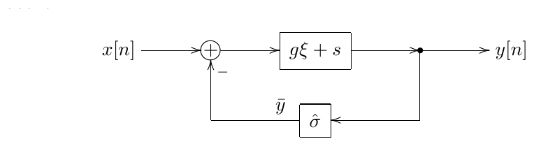

*Figure 3.35: Digital 1-pole lowpass filter with a trapezoidal integrator in
the instantaneous response form and a smoother unit $\hat{\sigma}$ in the
delayless feedback path.*

So, suppose we wish to compute a new output sample $y[n]$ for the new input
sample $x[n]$. At the time $x[n]$ "arrives" at the filter's input, the
smoother still holds the old output value $y[n-1]$. Let's freeze the discrete
time at this point (which formally means we simply are not going to update
the internal state of the $z^{-1}$ element). At the same time we will let the
continuous time $t$ run, formally starting at $t = 0$ at the discrete time
moment $n$.

In this time-frozen setup we can choose arbitrary units for the continuous
time $t$. The smoother equation can be written as

$$
\operatorname{sgn}\dot{\bar{y}}(t) = \operatorname{sgn}\bigl(y(t) - \bar{y}(t)\bigr)
$$

That is, we don't specify the details of the smoothing behavior, however the
smoother output always changes in the direction from $\bar{y}$ towards $y$ at
some (not necessarily constant) speed.[^19] Particularly, we can simply define
a constant speed smoother:

$$
\dot{\bar{y}} = \operatorname{sgn}(y - \bar{y})
$$

or we could use a 1-pole lowpass filter as a smoother:

$$
\dot{\bar{y}} = y - \bar{y}
$$

The initial value of the smoother is apparently $\bar{y}(0) = y[n-1]$.

Now consider that

$$
\begin{aligned}
\operatorname{sgn}\dot{\bar{y}}(t) &= \operatorname{sgn}\bigl(y(t) - \bar{y}(t)\bigr) = \operatorname{sgn}\bigl(g(x[n] - \bar{y}(t)) + s - \bar{y}(t)\bigr) = \\
&= \operatorname{sgn}\bigl((gx[n] + s) - (1+g)\bar{y}(t)\bigr) = \operatorname{sgn}\bigl(a - (1+g)\bar{y}(t)\bigr)
\end{aligned}
$$

where $a = gx[n] + s$ is constant in respect to $t$. First, assume
$1 + g > 0$. Further, suppose $a - (1+g)\bar{y}(0) > 0$. Then
$\dot{\bar{y}}(0) > 0$ and then the value of the expression
$a - (1+g)\bar{y}(t)$ will start decreasing until it turns to zero at some
$t$, at which point the smoothing process converges. On the other hand, if
$a - (1+g)\bar{y}(0) < 0$, then $\dot{\bar{y}}(0) < 0$ and the value of the
expression $a - (1+g)\bar{y}(t)$ will start increasing until it turns to zero
at some $t$, at which point the smoothing process converges. If
$a - (1+g)\bar{y}(0) = 0$ then the smoothing is already in a stable
equilibrium state.

So, in case $1 + g > 0$ the instantaneous feedback smoothing process always
converges. Now assume $1 + g \le 0$. Further, suppose $a - (1+g)\bar y(0) > 0$.
Then $\dot{\bar y}(0) > 0$ and then the value of the expression
$a - (1+g)\bar y(t)$ will start further increasing (or stay constant if
$1 + g = 0$). Thus, $\bar y(t)$ will grow indefinitely. Respectively, if
$a - (1+g)\bar y(0) < 0$, then $\bar y(t)$ will decrease indefinitely. This
indefinite growth/decrease will occur within the frozen discrete time.
Therefore we can say that $\bar y$ grows infinitely in an instant. We can refer
to this as to an *instantaneously unstable* zero-delay feedback loop.

The idea of the smoother introduced in Fig. 3.35 can be used as a general means
for analysing zero-delay feedback structures for instantaneous instability. We
will refer to this technique as *instantaneous smoother*.

### 1-pole lowpass as an instantaneous smoother

The analysis of the instantaneous stability can also be done using the analog
filter stability analysis means. Let the smoother be an analog 1-pole lowpass
filter with a unit cutoff (whose transfer function is $\frac{1}{s+1}$)[^20] and
notice that in that case the structure in Fig. 3.35 can be redrawn as in Fig.
3.36. This filter has two formal inputs $x[n]$ and $s$ and one output $y[n]$.

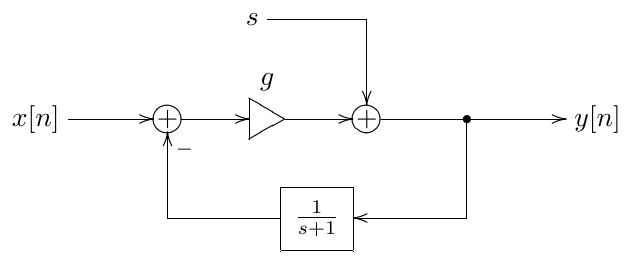

*Figure 3.36: An instantaneous representation of a digital 1-pole lowpass
filter with a trapezoidal integrator and an analog lowpass smoother.*

We can now e.g. obtain a transfer function from the $x[n]$ input to the $y[n]$
output. Ignoring the $s$ input signal (assuming it to be zero), for a
continuous-time complex exponential input signal arriving at the $x[n]$ input,
which we denote as $x[n](t)$, we have a respective continuous-time complex
exponential signal at the $y[n]$ output, which we denote as $y[n](t)$:

$$
y[n](t) = g\left(x[n](t) - \frac{1}{s+1}y[n](t)\right)
$$

from where

$$
y[n](t) = \frac{g}{1 + g\frac{1}{s+1}}x[n](t)
$$

that is

$$
H(s) = \frac{g}{1 + g\frac{1}{s+1}} = g\frac{s+1}{s+(1+g)}
$$

This transfer function has a pole at $s = -(1+g)$. Therefore, the structure is
stable if $1+g > 0$ and not stable otherwise.

The same transfer function analysis could have been done between the $s$ input
and the $y[n]$ output, in which case we would have obtained

$$
H(s) = \frac{s+1}{s+(1+g)}
$$

The poles of this transfer function however, are exactly the same, so it
doesn't matter.[^21]

### Generalized zero-delay feedback loop

The zero-delay feedback instantaneous response structure in Fig. 3.29 can be
considered as a particular case of a general one, drawn in Fig. 3.37, where the
input signal $x[n]$ has been incorporated into the $s$ term of the
instantaneous response $g\xi + s$ and the negative feedback has been
incorporated into the factor $g$. Indeed, Fig. 3.37 can be obtained from Fig.
3.29 via

$$
\begin{aligned}
G &= -g \\
S &= s + gx
\end{aligned}
$$

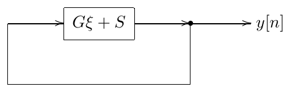

*Figure 3.37: General zero-delay feedback structure in the instantaneous
response form.*

The zero-delay feedback equation solution written for Fig. 3.37 is obviously

$$
y = \frac{S}{1-G} \tag{3.37}
$$

From the previous discussion it should be clear that the structure becomes
instantaneously unstable for $G \ge 1$, that is when the total instantaneous
gain of the feedback loop is 1 or more.

The solution form (3.37) therefore provides a generic means to check an
arbitrary zero-delay feedback loop for instantaneous instability. E.g.
rewriting (3.28) (which we had written for Fig. 3.29) in the form (3.37) we
obtain

$$
y = \frac{gx+s}{1-(-g)}
$$

where $-g$ is the total instantaneous gain of the feedback loop (including the
feedback inversion), and thus the structure is instantaneously unstable at
$-g \ge 1$ (or, equivalently, $g \le -1$).

It might be tempting to simply say that the instantaneously unstable
zero-delay feedback occurs whenever the denominator of the zero-delay feedback
equation's solution becomes zero or negative. However, this actually depends
on how did we arrive at the solution expression. E.g. if we multiply both the
numerator and the denominator of (3.28) by $-1$, the instantaneously unstable
case will occur for zero or positive denominator values. Therefore, we need to
make sure that our solution is written in the form (3.37) (where we need to
verify that $G$ is the total instantaneous gain of the feedback loop) and only
then can we say that zero or negative denominator values correspond to
instantaneously unstable feedback.

### Limits of bilinear transform

We have seen that for 1-poles the continuous- and discrete-time transient
responses are

$$
\begin{aligned}
y_t(t) &= (y(0) - y_s(0)) \cdot e^{pt} \\
y_t[n] &= (y[0] - y_s[0]) \cdot \tilde p^n
\end{aligned}
$$

where the discrete-time pole $\tilde p$ is obtained from continuous-time pole
$p$ via inverse bilinear transform (3.9).

In order to compare the transient responses we could compare the growth of $y$
over one sampling period $T$:

$$
\begin{aligned}
y_t(t) &= y_t(t-T) \cdot e^{pT} \\
y_t[n] &= y_t[n-1] \cdot \tilde p^n
\end{aligned}
$$

The comparison of $e^{pT}$ vs. $\tilde p$ is done in Fig. 3.38.

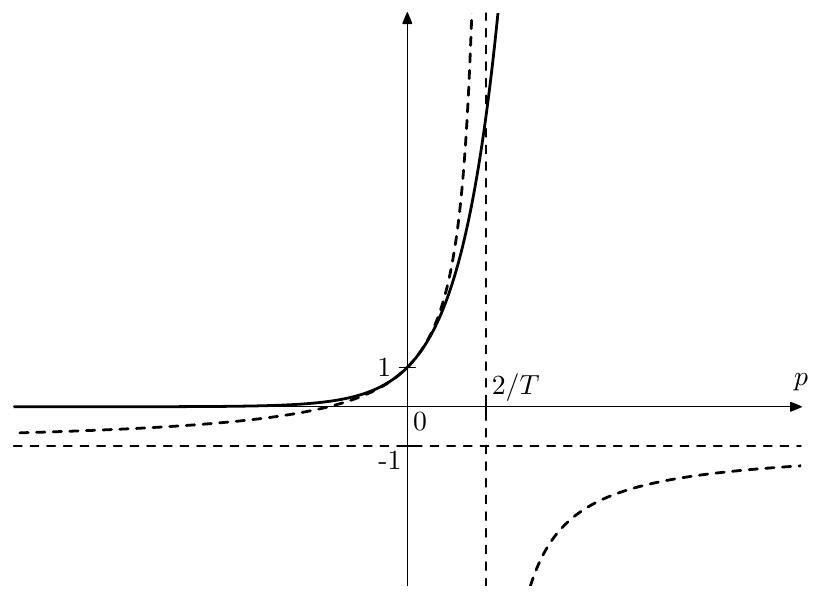

*Figure 3.38: $e^{-pT}$ (solid) vs. $\tilde p = (1+pT/2)/(1-pT/2)$ (thick
dashed) as functions of $p$. The two thin dashed lines are asymptotes of
$(1+pT/2)/(1-pT/2)$.*

One can notice that as $p \to 2/T - 0$ the value of $\tilde p$ grows too
quickly (compared to $e^{pT}$), approaching infinity. This means that
discrete-time transient response is growing infinitely fast at $p = 2/T$, or,
respectively as $pT/2 = 1$. At $p > 2/T$ the value of $\tilde p$ is getting
completely different from $e^{pT}$, particulary the sign of $y[n]$ begins to
alternate between successive samples.

Now recall that in the 1-pole zero-delay feedback equation (3.28) we had
$g = \omega_c T/2 = -pT/2$. Thus, as $g = -pT/2 \to -1+0$ the discrete-time
transient response is becoming infinitely fast. Close to this point and
further beyond it, trapezoidal integration doesn't deliver a reasonable
approximation to the continuous-time case anymore.

If we attempt to interpret the same in terms of bilinear transform, then we
already know (Fig. 3.38) that the inverse bilinear transform (3.9) is becoming
infinitely large at $s = 2/T$, that is the inverse bilinear transform formula
has a pole at $s = 2/T$. This means that, if we are having a continuous-time
system with a pole at $s \approx -2/T$ (which in case of the 1-pole lowpass
corresponds to $g = \omega_c T/2 \approx -1$), then after the bilinear
transform the system will have a pole at $z \approx \infty$, and the
transformation result doesn't work really well.

### Avoiding instantaneously unstable feedback

Alright, so we have found out that zero-delay feedback structures are
instantaneously unstable when the total instantaneous gain of the feedback
loop is greater than or equal to 1, but what can we do about it? Firstly, the
problem typically doesn't occur. Mostly, in (3.37) we have $G < 0$, e.g. in the
1-pole lowpass case we have $G = -g < 0$ for positive cutoff values. Even if
$G$ is or can become positive, the situation $G \ge 1$ occurs at really
excessive parameter settings. Therefore one can consider, whether these
extreme parameter settings are so necessary to support, and possibly simply
clip the filter parameters in such a way that the instantaneous instability
doesn't occur.

Secondly, let's notice that $g = \omega_c T/2$. Therefore another solution
could be to increase the sampling rate, which reduces the sampling period $T$
and respectively the value of $g$ (from an alternative point of view, it
shifts the inverse bilinear transform's pole $2/T$ further away from the
origin).

### Unstable bilinear transform

There is yet another idea, which is not widely used, but we are going to
discuss it anyway.[^22] So, the instantaneous instability is occurring at the
moment when one of the analog filter's poles hits the pole of the inverse
bilinear transform (3.9), which is located at $s = 2/T$. On the other hand,
recall that the bilinear transform is mapping the imaginary axis to the unit
circle, thus kind-of preserving the frequency response. If the system is not
stable, then the frequency response doesn't make sense. Formally, the reason
for this is that the inverse Laplace transform of transfer functions only
converges for $\sigma > \max\{\operatorname{Re} p_n\}$ where $p_n$ are the
poles of the transfer function, and respectively, if
$\max\{\operatorname{Re} p_n\} \ge 0$, it doesn't converge on the imaginary
axis ($\sigma = 0$). However, instead of the imaginary axis
$\operatorname{Re} s = \sigma = 0$, let's choose some other axis
$\operatorname{Re} s = \sigma > \max\{\operatorname{Re} p_n\}$ and use it
instead of the imaginary axis to compute the "frequency response".

We also need to find a discrete-time counterpart for $\operatorname{Re} s = \sigma$.
Considering that $\operatorname{Re} s$ defines the magnitude growth speed of
the exponentials $e^{st}$ we could choose a $z$-plane circle, on which the
magnitude growth speed of $z^n$ is the same as for $e^{\sigma t}$. Apparently,
this circle is $|z| = e^{\sigma T}$. So, we need to map
$\operatorname{Re} s = \sigma$ to $|z| = e^{\sigma T}$. Considering the
bilinear transform equation (3.4), we divide $z$ by $e^{\sigma T}$ to make sure
$ze^{-\sigma T}$ has a unit magnitude and shift the $s$-plane result by
$\sigma$:

$$
s = \sigma + \frac{2}{T}\cdot\frac{ze^{-\sigma T}-1}{ze^{-\sigma T}+1} \tag{3.38}
$$

We can refer to (3.38) as the *unstable bilinear transform*, where the word
"unstable" refers not to the instability of the transform itself, but rather
to the fact that it is designed to be applied to unstable filters.[^23] Notice
that at $\sigma = 0$ the unstable bilinear transform turns into an ordinary
bilinear transform. The inverse transform is obtained by

$$
\frac{(s-\sigma)T}{2}(ze^{-\sigma T}+1) = ze^{-\sigma T}-1
$$

from where

$$
ze^{-\sigma T}\left(1 - \frac{(s-\sigma)T}{2}\right) = 1 + \frac{(s-\sigma)T}{2}
$$

and

$$
z = e^{\sigma T}\frac{1+\frac{(s-\sigma)T}{2}}{1-\frac{(s-\sigma)T}{2}} \tag{3.39}
$$

Apparently the inverse unstable bilinear transform (3.39) has a pole at
$s = \sigma + \frac{2}{T}$. In order to avoid hitting that pole by the poles
of the filter's transfer function (or maybe even generally avoid the real
parts of the poles to go past that value) we could e.g. simply let

$$
\sigma = \max\{0,\ \operatorname{Re} p_n\}
$$

or we could position $\sigma$ midways:

$$
\sigma = \max\left\{0,\ \operatorname{Re} p_n - \frac{1}{T}\right\}
$$

In order to construct an integrator defined by (3.38) we first need to obtain
the expression for $1/s$ from (3.38):

$$
\begin{aligned}
\frac{1}{s} &= \frac{1}{\sigma + \frac{2}{T}\cdot\frac{ze^{-\sigma T}-1}{ze^{-\sigma T}+1}} = T\frac{ze^{-\sigma T}+1}{\sigma T(ze^{-\sigma T}+1)+2(ze^{-\sigma T}-1)} \\
&= T\frac{ze^{-\sigma T}+1}{(\sigma T+2)e^{-\sigma T}z+(\sigma T-2)} = T\frac{1+e^{\sigma T}z^{-1}}{(\sigma T+2)-(2-\sigma T)e^{\sigma T}z^{-1}} \\
&= \frac{T}{2+\sigma T}\cdot\frac{1+e^{\sigma T}z^{-1}}{1-\frac{2-\sigma T}{2+\sigma T}e^{\sigma T}z^{-1}}
\end{aligned}
$$

That is

$$
\frac{1}{s} = \frac{T}{2+\sigma T}\cdot\frac{1+e^{\sigma T}z^{-1}}{1-\frac{2-\sigma T}{2+\sigma T}e^{\sigma T}z^{-1}} \tag{3.40}
$$

A discrete-time structure implementing (3.40) could be e.g. the one in Fig.
3.39. Yet another approach could be to convert the right-hand side of (3.40)
to the analog domain by the inverse bilinear transform, construct an analog
implementation of the resulting transfer function and apply the trapezoidal
integrator replacement to convert back to the digital domain. It is
questionable, whether this produces better (or even different) results than
Fig. 3.39.

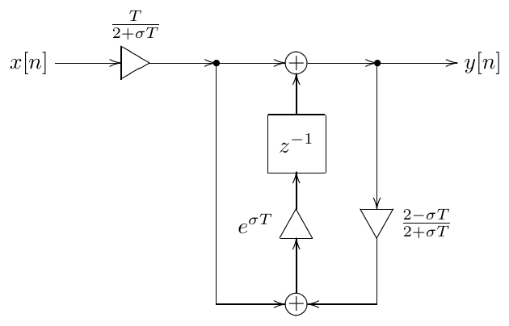

*Figure 3.39: Transposed direct form II-style "unstable" trapezoidal
integrator.*

## 3.14 Other replacement techniques

The trapezoidal integrator replacement technique can be seen as a particular
case of a more general set of replacement techniques. Suppose we have two
filters, whose frequency response functions are $F_1(\omega)$ and $F_2(\omega)$
respectively. The filters do not need to have the same nature, particularly
one can be an analog filter while the other can be a digital one. Suppose
further, there is a frequency axis mapping function $\omega' = \mu(\omega)$
such that

$$
F_2(\omega) = F_1(\mu(\omega))
$$

Typically $\mu(\omega)$ should map the entire domain of $F_2(\omega)$ onto the
entire domain of $F_1(\omega)$ (however the exceptions are possible).

To make the subsequent discussion more intuitive, we will assume that
$\mu(\omega)$ is monotone, although this is absolutely not a must.[^24] In this
case we could say that $F_2(\omega)$ is obtained from $F_1(\omega)$ by a
frequency axis warping. Particularly, this is exactly what happens in the
bilinear transform case (the mapping $\mu(\omega)$ is then defined by the
equation (3.6)). One cool thing about the frequency axis warping is that it
preserves the relationship between the amplitude and phase.

Suppose that we have a structure built around filters of frequency response
$F_1(\omega)$, and the rest of the structure doesn't contain any memory
elements (such as integrators or unit delays). Then the frequency response
$F(\omega)$ of this structure will be a function of $F_1(\omega)$:

$$
F(\omega) = \Phi(F_1(\omega))
$$

where the specifics of the function $\Phi(w)$ will be defined by the details
of the container structure. E.g. if the building-block filters are analog
integrators, then $F_1(\omega) = 1/j\omega$. For the filter in Fig. 2.2 we then
have

$$
\Phi(w) = \frac{w}{w+1}
$$

Indeed, substituting $F_1(\omega)$ into $\Phi(w)$ we obtain

$$
F(\omega) = \Phi(F_1(\omega)) = \Phi(1/j\omega) = \frac{1/j\omega}{1+1/j\omega} = \frac{1}{1+j\omega}
$$

which is the already familiar to us frequency response of the analog lowpass
filter.

Now, we can view the trapezoidal integrator replacement as a substitution of
$F_2$ instead of $F_1$, where $\mu(\omega)$ is obtained from (3.6):

$$
\omega_a = \mu(\omega_d) = \frac{2}{T}\tan\frac{\omega_d T}{2}
$$

The frequency response of the resulting filter is obviously equal to
$\Phi(F_2(\omega))$, where $F_2(\omega)$ is the frequency response of the
trapezoidal integrators (used in place of analog ones). But since
$F_2(\omega) = F_1(\mu(\omega))$.

$$
\Phi(F_2(\omega)) = \Phi(F_1(\mu(\omega)))
$$

which means that the frequency response $\Phi(F_2(\cdot))$ of the structure
with trapezoidal integrators is obtained from the frequency response
$\Phi(F_1(\cdot))$ of the structure with analog integrators simply by warping
the frequency axis. If the warping is not too strong, the frequency responses
will be very close to each other. This is exactly what is happening in the
trapezoidal integrator replacement and generally in the bilinear transform.

### Differentiator-based filters

We could have used some other two filters, with their respective frequency
responses $F_1$ and $F_2$. E.g. we could consider continuous-time systems
built around differentiators rather than integrators.[^25] The transfer
function of a differentiator is apparently simply $H(s) = s$, so we could use
(3.4) to build a discrete-time "trapezoidal differentiator". Particularly, if
we use the direct form II approach, it could look similarly to the integrator
in Fig. 3.9. When embedding the cutoff control into a differentiator (in the
form of a $1/\omega_c$ gain), it's probably better to position it after the
differentiator, to avoid the unnecessary "de-smoothing" of the control
modulation by the differentiator. Replacing the analog differentiators in a
structure by such digital trapezoidal differentiators we effectively perform a
differentiator-based TPT.

E.g. if we replace the integrator in the highpass filter in Fig. 2.9 by a
differentiator, we essentially perform a $1/s \leftarrow s$ substitution, thus
we should have obtained a (differentiator-based) lowpass filter. Remarkably,
if we perform a differentiator-based TPT on such filter, the obtained digital
structure is fully equivalent to the previously obtained integrator-based TPT
1-pole lowpass filter.

### Allpass substitution

One particularly interesting case occurs when $F_1$ and $F_2$ define two
different allpass frequency responses. That is $|F_1(\omega)| \equiv 1$ and
$|F_2(\omega)| \equiv 1$. In this case the mapping $\mu(\omega)$ is always
possible. Especially since the allpass responses (defined by rational transfer
functions of analog and digital systems) always cover the entire phase range
from $-\pi$ to $\pi$.[^26] In intuitive terms it means: for a filter built of
identical allpass elements, we can always replace those allpass elements with
an arbitrary other type of allpass elements (provided all other elements are
memoryless, that is there are only gains and summators). We will refer to this
process as *allpass substitution*. Whereas in the trapezoidal integrator
replacement we have replaced analog integrators by digital trapezoidal
integrators, in the allpass substitution we replace allpass filters of one
type by allpass filters of another type.

We can even replace digital allpass filters with analog ones and vice versa.
E.g., noticing that $z^{-1}$ elements *are* allpass filters, we could replace
them with analog allpass filters. One particularly interesting case arises out
of the inverse bilinear transform (3.9). From (3.9) we obtain

$$
z^{-1} = \frac{1-\frac{sT}{2}}{1+\frac{sT}{2}} \tag{3.41}
$$

The right-hand side of (3.41) obviously defines a stable 1-pole allpass
filter, whose cutoff is $2/T$. We could take a digital filter and replace all
$z^{-1}$ elements with an analog allpass filter structure implementing (3.41).
By doing this we would have performed a topology-preserving inverse bilinear
transform.

We could then apply the cutoff parametrization to these underlying analog
allpass elements:

$$
\frac{sT}{2} \leftarrow \frac{s}{\omega_c}
$$

so that we obtain

$$
z^{-1} = \frac{1-s/\omega_c}{1+s/\omega_c}
$$

The expression $s/\omega_c$ can be also rewritten as $sT/2\alpha$, where
$\alpha$ is the cutoff scaling factor:

$$
z^{-1} = \frac{1-sT/2\alpha}{1+sT/2\alpha} \tag{3.42}
$$

Finally, we can apply the trapezoidal integrator replacement to the
cutoff-scaled analog filter, converting it back to the digital domain. By
doing so, we have applied the cutoff scaling in the digital domain! On the
transfer function level this is equivalent to applying the bilinear transform
to (3.42), resulting in

$$
\begin{aligned}
z^{-1} &= \frac{1-sT/2\alpha}{1+sT/2\alpha} \leftarrow \frac{1-\frac{z-1}{\alpha(z+1)}}{1+\frac{z-1}{\alpha(z+1)}} \\
&= \frac{\alpha(z+1)-(z-1)}{\alpha(z+1)+(z-1)} = \frac{(\alpha-1)z+(\alpha+1)}{(\alpha+1)z+(\alpha-1)}
\end{aligned}
$$

That is, we have obtained a discrete-time allpass substitution

$$
z^{-1} \leftarrow \frac{(\alpha-1)z+(\alpha+1)}{(\alpha+1)z+(\alpha-1)}
$$

which applies cutoff scaling in the digital domain.[^27] The allpass filter

$$
H(z) = \frac{(\alpha-1)z+(\alpha+1)}{(\alpha+1)z+(\alpha-1)}
$$

should have been obtained, as described, by the trapezoidal integrator
replacement in an analog implementation of (3.42), alternatively we could use
a direct form implementation. Notice that this filter has a pole at
$z = (\alpha-1)/(\alpha+1)$. Since $|\alpha-1| < |\alpha+1|\ \forall \alpha > 0$,
the pole is always located inside the unit circle, and the filter is always
stable.

## Summary

We have considered three essentially different approaches to applying
time-discretization to analog filter models: naive, TPT (by trapezoidal
integrator replacement), and the classical bilinear transform (using direct
forms). The TPT approach combines the best features of the naive
implementation and the classical bilinear transform.

[^1]: As with Laplace transform, sometimes there are no restrictions on the radius $e^\sigma$ of the
    circle, sometimes there are.

[^2]: A more common term for (3.1) is the *inverse z-transform*, but we will prefer the *z-integral*
    term for the same reason as with Fourier and Laplace integrals.

[^3]: Formally the $\sigma$ parameter of the Laplace integral (and z-integral) should have been multiplied
    by $T$ as well, but it doesn't matter, since this parameter is chosen rather arbitrarily.

[^4]: Alternatively, we could, of course, scale the integrator's output by $T$, but this is less
    useful in practice, because the $T$ factor will be usually combined with the cutoff gain factor
    $\omega_c$ preceding the integrator.

[^5]: Based on the fact that the naive integration introduced above is identical to Euler
    backward-difference integration, there is an opinion that the naive approach (loosely defined
    as "take whatever values we have now at the integrator inputs and apply a single naive integration
    step to those") is identical to the Euler method. This is not 100% so. The readers are
    encouraged to formally apply backward- and forward-difference Euler methods to $\dot{y} = \omega_c(y-x)$
    to convince themselves that there are some differences. Particularly, the backward-difference
    method is implicit (requires solving an equation), while the forward-difference method produces
    the "future" value of the output. For more complicated systems the differences could
    be more drastic, although the author didn't explicitly verify that.

[^6]: Under the assumption of causality, which holds if the system is built of unit delays.

[^7]: As in continuous-time case, we take for granted the fact that complex exponentials $z^n$ are
    eigenfunctions of discrete-time linear time-invariant systems.

[^8]: Another way to look at this is to notice that in order for $z^n$ to be a complex sinusoid $e^{j\omega n}$
    we need to let $z = e^{j\omega}$.

[^9]: Many engineers seem to believe that the deviations in phase response are quite tolerable
    acoustically. The author's personal preference is to be on the safe side and not take the risks
    which are difficult to estimate. At least some caution in this regard would be recommended.

[^10]: Difference systems can be defined as those, whose block diagrams consist of gains, summators
    and unit delays. More precisely those are causal difference systems. There are also
    difference systems with a lookahead into the future, but we don't consider them in this book.

[^11]: A similar mapping obviously occurs for the negative frequencies.

[^12]: Note that thereby, should we become interested in the amplitude and phase responses of
    Fig. 3.12, we don't have to derive the discrete-time transfer function of Fig. 3.12. Instead
    we can simply take the amplitude and phase responses of the analog 1-pole (which are simpler
    to compute) and apply the mapping (3.7). This is the reason that we almost exclusively deal
    with analog transfer functions in this book, we simply don't need digital ones most of the
    time.

[^13]: Apparently, the picture in Fig. 3.13 will be the same at any other sampling rate, except
    that the frequency axis values will need to be relabelled proportionally to the sampling rate
    change. E.g. at 88.2kHz the labels would be 4, 8, 16, 22.05, 32 and 44.1kHz respectively. We
    could have labelled the axis in terms of normalized $\omega$ instead, but giving the absolute values
    is more illustrative. Particularly, the audible frequency range is easier to see.

[^14]: Notice that the choice of the signal point for the prediction is
    rather arbitrary. We could have chosen any other point within the
    delayless feedback loop.

[^15]: Apparently, naive filter design techniques also preserve the topology,
    but they do a rather poor job on the transfer functions. Classical
    bilinear transform approach does a good job on the transfer function, but
    doesn't preserved the topology. The topology-preserving transform
    achieves both goals simultaneously.

[^16]: This is related to the fact that transfer functions can be defined
    only for linear time-invariant systems. Nonlinear cases are obviously not
    linear, thus some critical information can be lost, if the conversion is
    done solely based on the transfer functions.

[^17]: A higher-order transfer function is typically decomposed into a
    product of transfer functions of 1st- and 2nd-order rational functions
    (with real coefficients!). Then it can be implemented by a serial
    connection of the respective 1st- and 2nd-order direct form filters.

[^18]: Of course, such lowpass filter formally has a negative cutoff value.
    It is also unstable. However unstable circuits are very important as the
    linear basis for the analysis and implementation of e.g. nonlinear
    self-oscillating filters. Therefore we wish to be able to handle unstable
    circuits as well.

[^19]: We also assume that the smoothing speed is sufficiently large to
    ensure that the smoothing process will converge at all cases where it
    potentially can converge (this statement should become clearer as we
    discuss more details).

[^20]: Apparently, the variable $s$ used in the transfer function
    $\frac{1}{s+1}$ is a different $s$ than the one used in the instantaneous
    response expression for the integrator. The author apologizes for the
    slight confusion.

[^21]: This is a common rule: the poles of a system with multiple inputs
    and/or multiple outputs are always the same regardless of the particular
    input-output pair for which the transfer function is being considered
    (exceptions in singular cases, arising out of pole/zero cancellation are
    possible, though).

[^22]: This idea has occurred to the author during the writing of the first
    revision of this book. The author didn't try it in practice yet, neither
    is he aware of other attempts.

    Sufficient theoretical analysis is not possible here due to the fact that
    practical applications of instantaneously unstable (or any unstable, for
    that matter) filters occur typically for non-linear filters, and there are
    not many theoretical analysis means for the latter. Hopefully there are no
    mistakes in the theoretical transformations, but even if there are
    mistakes, at least the idea itself could maybe work.

[^23]: Apparently, the unstable bilinear transform defines the same
    relationship between $\operatorname{Im} s$ and $\arg z$ as the ordinary
    bilinear transform. Therefore prewarping can be done in the same way as
    for the ordinary bilinear transform.

[^24]: Strictly speaking, we don't even care whether $\mu(\omega)$ is
    single-valued. We could have instead required that
    $$F_2(\mu_2(\omega)) = F_1(\mu_1(\omega))$$
    for some $\mu_1(\omega)$ and $\mu_2(\omega)$.

[^25]: The real-world analog electronic circuits are "built around"
    integrators rather than differentiators. However, formally one still can
    "invert" the causality direction in the equations and pretend that
    $\dot x(t)$ is defined by $x(t)$, and not vice versa.

[^26]: Actually, for $-\infty < \omega < +\infty$, they cover this range
    exactly $N$ times, where $N$ is the order of the filter.

[^27]: Differently from the analog domain, the digital cutoff scaling doesn't
    exactly shift the response along the frequency axis in a logarithmic
    scale, as some frequency axis warping is involved. The resulting frequency
    response change however is pretty well approximated as shiting in the
    lower frequency range.
