# Chapter 4: State variable filter

After having discussed 1-pole filters, we are going to instroduce a 2-pole
filter. With 2-pole filters there is more freedom in choosing the filter
topology than with 1-poles, where any implementation of the latter would
essentially be based on a feedback loop around an integrator. A 2-pole
topology of fundamental importance and high usability is a classical analog
model, commonly referred to as *state-variable filter* (SVF). It can also
serve as a basis for building arbitrary 2-pole filters by means of modal
mixture.

## 4.1 Analog model

The block diagram of the state-variable filter is shown in Fig. 4.1. The
three outputs are the highpass, bandpass and lowpass signals. As usual, one
can apply transposition to obtain a filter with highpass, bandpass and
lowpass inputs (Fig. 4.2).


*Figure 4.1: 2-pole multimode state-variable filter.*

The differential equations implied by Fig. 4.1 are

$$
\begin{aligned}
y_{\text{HP}} &= x - 2Ry_{\text{BP}} - y_{\text{LP}} \\
\dot y_{\text{BP}} &= \omega_c \cdot y_{\text{HP}} \\
\dot y_{\text{LP}} &= \omega_c \cdot y_{\text{BP}}
\end{aligned}
\tag{4.1}
$$

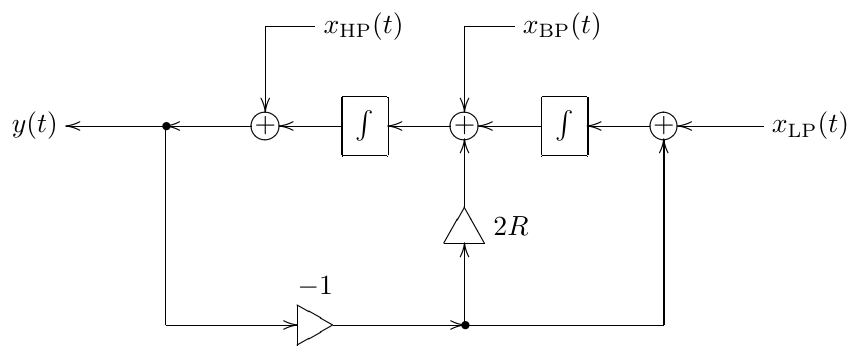

*Figure 4.2: Transposed 2-pole multimode state-variable filter.*

Rewriting them in terms of the lowpass signal $y = y_{\text{LP}}$ and
combining them together we obtain

$$
\frac{\ddot y}{\omega_c}^{2} + 2R\frac{\dot y}{\omega_c} + y = x \tag{4.2}
$$

or

$$
\ddot y + 2R\omega_c \dot y + \omega_c^2 y = \omega_c^2 x \tag{4.3}
$$

In a similar fashion one can easily obtain the transfer functions for the
output signals in Fig. 4.1. Assuming unit cutoff and complex exponential
signals, we have

$$
\begin{aligned}
y_{\text{HP}} &= x - 2Ry_{\text{BP}} - y_{\text{LP}}
\end{aligned}
$$

$$
\begin{aligned}
y_{\text{BP}} &= \frac{1}{s}y_{\text{HP}} \\
y_{\text{LP}} &= \frac{1}{s}y_{\text{BP}}
\end{aligned}
$$

from where

$$
y_{\text{HP}} = x - 2R \cdot \frac{1}{s}y_{\text{HP}} - \frac{1}{s^2}y_{\text{HP}}
$$

from where

$$
\left(1 + \frac{2R}{s} + \frac{1}{s^2}\right)y_{\text{HP}} = x
$$

and

$$
H_{\text{HP}}(s) = \frac{y_{\text{HP}}}{x} = \frac{1}{1 + \dfrac{2R}{s} + \dfrac{1}{s^2}} = \frac{s^2}{s^2+2Rs+1}
$$

Thus

$$
\begin{aligned}
H_{\text{HP}}(s) &= \frac{s^2}{s^2+2Rs+1} = \frac{s^2}{s^2+2R\omega_c s+\omega_c^2} \qquad (\omega_c = 1) \\
H_{\text{BP}}(s) &= \frac{s}{s^2+2Rs+1} = \frac{\omega_c s}{s^2+2R\omega_c s+\omega_c^2} \qquad (\omega_c = 1) \\
H_{\text{LP}}(s) &= \frac{1}{s^2+2Rs+1} = \frac{\omega_c^2}{s^2+2R\omega_c s+\omega_c^2} \qquad (\omega_c = 1)
\end{aligned}
$$

Notice that $y_{\text{LP}}(t)+2Ry_{\text{BP}}(t)+y_{\text{HP}}(t) = x(t)$, that
is, the input signal is split into lowpass, bandpass and highpass
components. The same can be expressed in the transfer function form:

$$
H_{\text{LP}}(s) + 2RH_{\text{BP}}(s) + H_{\text{HP}}(s) = 1 \tag{4.4}
$$

### Amplitude responses

The amplitude responses of the state-variable filter are plotted in Figs.
4.3, 4.4 and 4.5. The pass-, stop- and transition bands of the low- and
high-pass filters are defined in the same manner as for the 1-poles, where
the transition band now can contain a peak in the amplitude response. For
the bandpass the passband is located in the middle (around the cutoff), and
there is a stop- and a transition band on each side of the cutoff. The slope
rolloff speed is obviously -12dB/oct for the low- and high-pass, and
-6dB/oct for the bandpass.

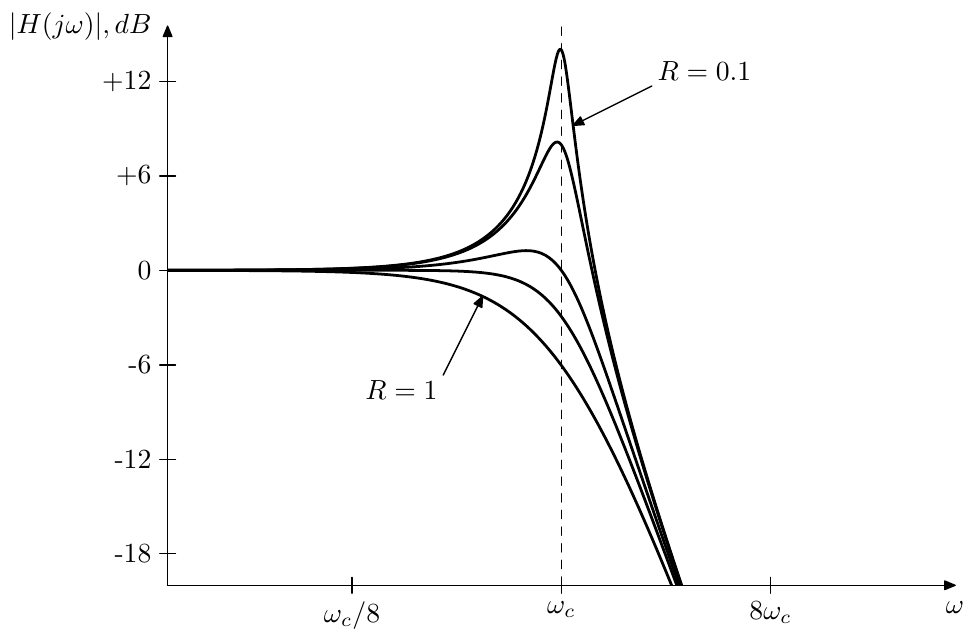

*Figure 4.3: Amplitude response of a 2-pole lowpass filter.*

One could observe that the highpass response is a mirrored version of the
lowpass response, while the bandpass response is symmetric by itself. The
symmetry between the lowpass and the highpass amplitude responses has a
clear algebraic explanation: applying the LP to HP substitution to a 2-pole
lowpass produces a 2-pole highpass and vice versa. The symmetry of the
bandpass amplitude response has the same explanation: applying the LP to HP
substitution to the 2-pole bandpass converts it into itself.

Since

$$
\left|s^2+2Rs+1\right|\Big|_{s=j} = |-1+2Rj+1| = 2R
$$

the amplitude response at the cutoff is 1/2R for all three filter types.
Except for the bandpass, the cutoff point $\omega = 1$ is not exactly the
peak location but it's pretty close (the smaller the value of R, the closer
is the true peak to $\omega = 1$).

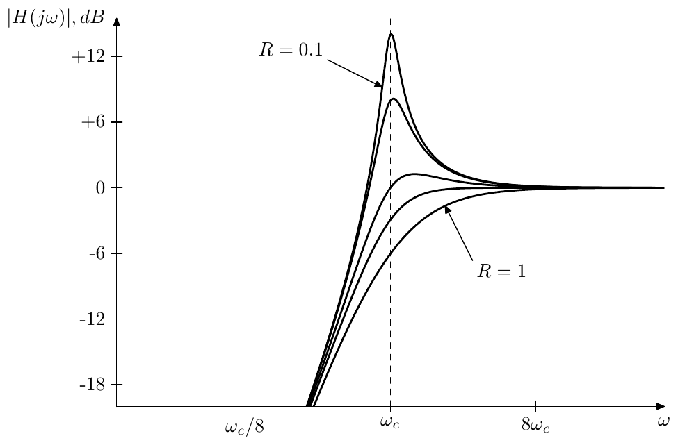

*Figure 4.4: Amplitude response of a 2-pole highpass filter.*

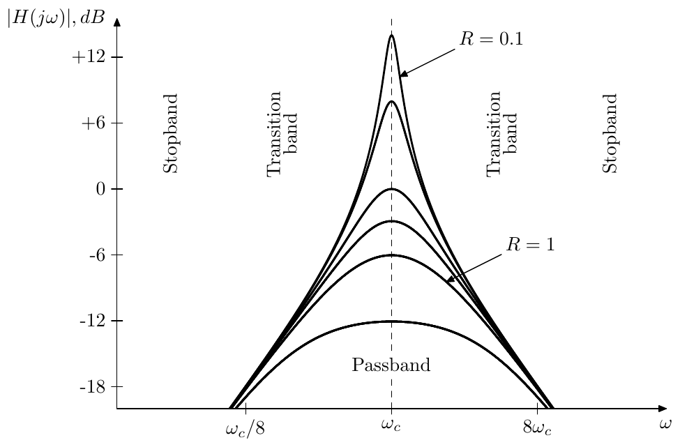

*Figure 4.5: Amplitude response of a 2-pole bandpass filter.*

### Phase responses

The phase response of the lowpass is

$$
\begin{aligned}
\arg H_{\text{LP}}(j\omega) &= \arg\frac{1}{1+2Rj\omega-\omega^2} = -\arg(1+2Rj\omega-\omega^2) = \\
&= -\arctan\frac{2R\omega}{1-\omega^2} = -\operatorname{arccot}\frac{1-\omega^2}{2R\omega} = -\operatorname{arccot}\frac{\omega^{-1}-\omega}{2R}
\end{aligned}
\tag{4.5}
$$

where we had to switch from arctan to arccot, since the principal value of
arctan gives wrong results for $\omega > 1$. Fig. 4.6 illustrates.


*Figure 4.6: Phase response of a 2-pole lowpass filter. Bandpass and
highpass responses are the same, except that they are shifted by $+90^\circ$ and
$180^\circ$ respectively.*

We could notice the 2-pole phase response has the same kind of symmetry
around the cutoff point in the logarithmic frequency scale as the 1-pole
filters. This property can be explained from (4.5) by noticing that the
substitution $\omega \leftarrow 1/\omega$ changes the sign of the argument
of arccot and by using the property of arccot

$$
\operatorname{arccot} x + \operatorname{arccot}(-x) = \pi
$$

We also could notice that the steepness of the phase response is affected
by the parameter R. Explicitly writing the phase response in a logarithmic
frequency scale we have

$$
\arg H_{\text{LP}}(je^x) = -\operatorname{arccot}\frac{e^{-jx}-e^{jx}}{2R} = -\operatorname{arccot}\frac{-\sinh x}{R} \tag{4.6}
$$

thus R simply scales the argument of arccot which results in stretching or
shrinking of the phase response.

The bandpass phase response is a $+90^\circ$-shifted lowpass response:

$$
\arg H_{\text{BP}}(j\omega) = \arg\frac{j\omega}{1+2Rj\omega-\omega^2} = \frac{\pi}{2} + \arg H_{\text{LP}}(s)
$$

The bandpass phase response is a $180^\circ$-shifted lowpass response:

$$
\arg H_{\text{HP}}(j\omega) = \arg\frac{(j\omega)^2}{1+2Rj\omega-\omega^2} = \pi + \arg H_{\text{LP}}(s)
$$

The phase response at the cutoff is $-90^\circ$ for the lowpass:

$$
\arg H_{\text{LP}}(j) = \arg\frac{1}{1+2Rj-1} = \arg\frac{1}{2Rj} = -\frac{\pi}{2}
$$

respectively giving $0^\circ$ for the bandpass and $+90^\circ$ for the highpass.

It can be also observed in Fig. 4.6 that the lowpass phase response is close
to zero in the passband, the same as for the 1-pole lowpass. As we shuld
have expected, the same also holds for the highpass's passband. Somewhat
remarkably, as we just established by evaluating the bandpass phase
response at the cutoff, the same property also holds for the bandpass's
passpand, although at small values of R the phase will be close to zero
only in a small neighborhood of the cutoff.

## 4.2 Resonance

With a 1-pole lowpass or highpass filter, the only parameter to control was
the filter cutoff, shifting the amplitude response to the left or to the
right in the logarithmic frequency scale. With 2-pole filters there is an
additional parameter R, which, as the reader could have noticed from Figs.
4.3, 4.4 and 4.5 controls the height of the amplitude response peak
occuring closely to $\omega = \omega_c$. A narrow peak in the amplitude
response is usually referred to as *resonance*. Thus, we can say that the R
parameter controls the amount of resonance in the filter.

On the other hand, from the same figures we can notice that the resonance
increases (the peak becomes higher and more narrow) as R decreases. It is
easy to verify that at R = 0 the resonance peak becomes infinitely high. A
little bit later we will also establish the fact that the state variable
filter is stable if and only if R > 0. Thus, the parameter R actually has
the function of decreasing or *damping* the resonance. For that reason we
refer to the R parameter as the *damping*.[^1] By controlling the damping
parameter we effectively control the filter's resonance.[^2]

### Damping and selfoscillation

At R = 0 and $x(t) \equiv 0$ the equation (4.3) turns into

$$
\ddot y = -\omega_c^2 y
$$

which is effectively a spring-mass equation

$$
m\ddot y = -ky
$$

or

$$
\ddot y = -\frac{k}{m}y
$$

where respectively $\omega_c = \sqrt{k/m}$. Starting from a non-zero initial
state such system will oscillate around the origin infinitely long. Thus,
in the absence of the damping signal path (Fig. 4.7), the filter will be
constantly *selfoscillating*.[^3] Notably, the selfoscillation is appearing
at the setting R = 0 where the resonance peak is getting infinitely high.
This is a general property of resonating filters and has to do with the
relationship between the filter poles and the filter's transient response,
both covered later in this chapter and additionally and in a more general
form in Chapter 7.

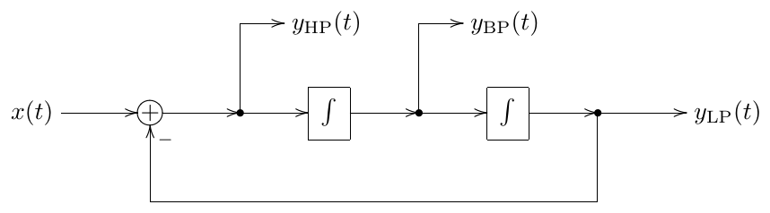

*Figure 4.7: 2-pole multimode state-variable filter without the damping
path (selfoscillating).*

The introduction of the damping signal

$$
\ddot y = -\omega_c^2 y - 2R\dot y
$$

reduces the amount of resonance in the filter, which in terms of a
spring-mass system works as a 1st-order energy dissipation term:

$$
m\ddot y = -ky - 2c\dot y
$$

This should give a better idea of why the R parameter is referred to as
damping.

By further adding an external force to the spring-mass system one
effectively adds the input signal.[^4]

### Resonance peak

We can find the exact position and the height of the resonance peak by
looking for the local maximum of the (squared) amplitude response. E.g. for
the lowpass amplitude response:

$$
|H_{\text{LP}}(j\omega)|^2 = \frac{1}{|(j\omega)^2+2Rj\omega+1|^2} = \frac{1}{(1-\omega^2)^2+4R^2\omega^2}
$$

Instead of looking for the maximum of $|H_{\text{LP}}(j\omega)|^2$ we can
look for the minumum of the reciprocal function:

$$
|H_{\text{LP}}(j\omega)|^{-2} = \omega^4 + 2(2R^2-1)\omega^2 + 1
$$

Clearly, $|H_{\text{LP}}(j\omega)|^{-2}$ is a quadratic polynomial in
$\omega^2$ with the minimum at $\omega^2 = 1-2R^2$. The resonance peak
position is thus

$$
\omega_{\text{peak}} = \sqrt{1-2R^2}
$$

where for $R \ge 1/\sqrt2$ (we are considering only positive values of R)
there is no minimum at $\omega^2 > 0$ and respectively no resonance peak.
Note that the peak thereby starts at $\omega = 0$ at $R = 1/\sqrt2$ and, as
R decreases to zero, moves towards $\omega = 1$.

The resonance peak height is simply the value of the amplitude response
evaluated at $\omega_{\text{peak}}$:

$$
\begin{aligned}
|H_{\text{LP}}(j\omega_{\text{peak}})|^2 &= \frac{1}{(1-(1-2R^2))^2+4R^2(1-2R^2)} = \frac{1}{4R^4+4R^2-8R^4} =
\end{aligned}
$$

$$
= \frac{1}{4R^2-4R^4} = \frac{1}{4R^2(1-R^2)} \qquad (R<1/\sqrt2)
$$

and

$$
|H_{\text{LP}}(j\omega_{\text{peak}})| = \frac{1}{2R\sqrt{1-R^2}} \qquad (R<1/\sqrt2)
$$

Thus at $R = 1/\sqrt2$ the peak height is formally
$|H_{\text{LP}}(j\omega_{\text{peak}})| = 1$, corresponding to the amplitude
response not having the peak yet. At $R \to 0$ we have
$|H_{\text{LP}}(j\omega_{\text{peak}})| \sim 1/2R$. The above expression
also allows us to find the value of R given a desired peak height A.
Starting from

$$
A = \frac{1}{2R\sqrt{1-R^2}} \tag{4.7}
$$

we have

$$
\begin{aligned}
2R\sqrt{1-R^2} &= A^{-1} \\
R^2(1-R^2) &= \frac{A^{-2}}{4} \\
R^4 - R^2 + \frac{A^{-2}}{4} &= 0
\end{aligned}
$$

$$
R^2 = \frac{1\pm\sqrt{1-A^{-2}}}{2}
$$

Taking into account the allowed range of R (which is $0 < R < 1/\sqrt2$),
we obtain

$$
R = \sqrt{\frac{1-\sqrt{1-A^{-2}}}{2}} \qquad (A \ge 1) \tag{4.8}
$$

Recalling that the amplitude response of the 2-pole highpass is simply a
symmetrically flipped amplitude response of the 2-pole lowpass, we realize
that the same considerations apply to the 2-pole highpass, except that the
expression for $\omega_{\text{peak}}$ needs to be reciprocated. For the
bandpass filter the amplitude response peak is always exactly at the
cutoff.

### Butterworth filter

The threshold value $R = 1/\sqrt2$ at which the resonance peak starts to
appear has another interesting property. At this setting the (logarithmic
frequency scale) amplitude responses of the 2-pole lowpass and highpass are
shrunk horizontally two times around the cutoff point, as compared to those
of 1-poles (the phase response is transformed in a more complicated way,
which is of little interest to us here). This is a particular case of a
*Butterworth filter*. Butterworth filters will be discussed in a
generalized form in Chapter 8, but we can also show this shrinking property
explicitly here. Indeed, for $R = 1/\sqrt2$ we have

$$
\begin{aligned}
\left|s^2+\sqrt2\cdot s+1\right|^2\Big|_{s=j\omega} &= \left|1-\omega^2+j\sqrt2\cdot\omega\right|^2 = (1-\omega^2)^2+2\omega^2 = \\
&= 1+\omega^4 = \left|1+j\omega^2\right|^2 = |1+s|^2\Big|_{s=j\omega^2}
\end{aligned}
$$

Now, the substitution $\omega \leftarrow \omega^2$ corresponds to the two
times shrinking in the logarithmic frequency scale:
$\log\omega \leftarrow 2\log\omega$. Thus, for the lowpass 2-pole we have

$$
\left|\frac{1}{s^2+\sqrt2\cdot s+1}\right|\Bigg|_{s=j\omega} = \left|\frac{1}{1+s}\right|\Bigg|_{s=j\omega^2}
$$

and for the highpass filter we have

$$
\left|\frac{s^2}{s^2+\sqrt2\cdot s+1}\right|\Bigg|_{s=j\omega} = \left|\frac{s}{1+s}\right|\Bigg|_{s=j\omega^2}
$$

The readers can refer to Fig. 8.13 for the illustration of the shrinking
effect. Since for $R < 1/\sqrt2$ the amplitude response obtains a resonance
peak, the Butterworth 2-pole filter is the one with the "sharpest" possible
cutoff among all non-resonating 2-poles.

## 4.3 Poles

Solving $s^2+2Rs+1=0$ we obtain the poles of the filter at

$$
p_{1,2} = -R\pm\sqrt{R^2-1} = \begin{cases} -R\pm\sqrt{R^2-1} & \text{if } |R| \ge 1 \\ -R\pm j\sqrt{1-R^2} & \text{if } -1 \le R \le 1 \end{cases}
$$

Thus, the poles are located in the left semiplane if and only if R > 0. As
with 1-poles, the location of the poles in the left semiplane is sufficient
and necessary for the filter to be stable.[^5]

For $|R| \le 1$ the poles are located on the unit circle

$$
(\operatorname{Re} p)^2 + (\operatorname{Im} p)^2 = (-R)^2 + (\sqrt{1-R^2})^2 = 1
$$

This also implies that R is equal to the cosine of the angle between the
negative real axis and the direction to the pole (Fig. 4.8).

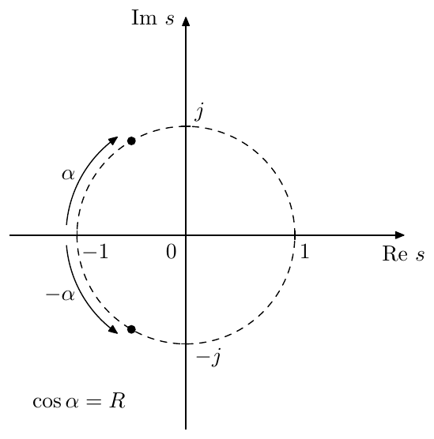

*Figure 4.8: Poles of a resonating 2-pole filter ($\omega_c = 1$).*

As R is getting close to zero, the poles are getting close to the
imaginary axis. By definition of a pole, the transfer function is
infinitely large at the poles, which means it is also having large values
on the imaginary axis close to the poles. This corresponds to the
resonance peak appearing in the amplitude response. At R = 0 the poles are
located right on the imaginary axis and the filter selfoscillates.

At $|R| \ge 1$ the poles are real and mutually reciprocal:[^6]

$$
(-R-\sqrt{R^2-1})\cdot(-R+\sqrt{R^2-1}) = 1
$$

(Fig. 4.9). The filter thus "falls apart" into a serial combination of two
1-pole filters:

$$
H_{\text{LP}}(s) = \frac{1}{s^2+2Rs+1} = \frac{1}{s-p_1}\cdot\frac{1}{s-p_2}
$$

$$
H_{BP}(s) = \frac{s}{s^2+2Rs+1} = \frac{s}{s-p_1}\cdot\frac{1}{s-p_2}
$$

$$
H_{HP}(s) = \frac{s^2}{s^2+2Rs+1} = \frac{s}{s-p_1}\cdot\frac{s}{s-p_2}
$$

where $p_1p_2 = 1$.[^7] These 1-pole filters become visible in the amplitude
responses at sufficiently large $R$ as two different "cutoff points" (Fig.
4.10).

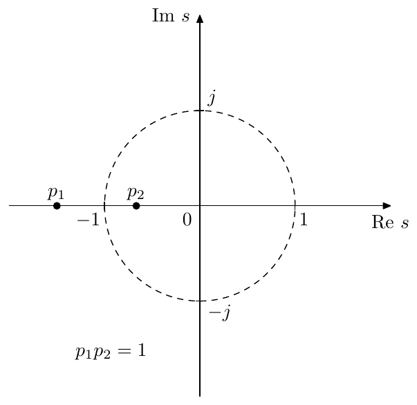

*Figure 4.9: Poles of a non-resonating 2-pole filter ($\omega_c = 1$).*

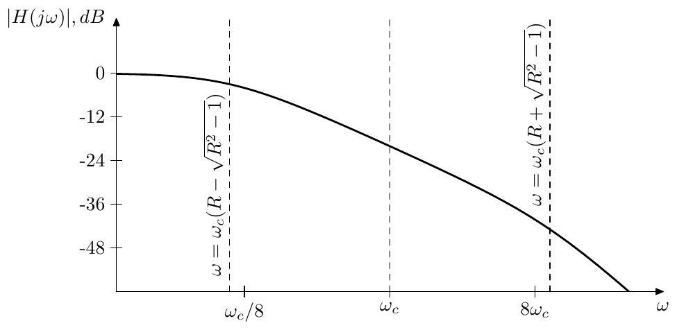

*Figure 4.10: Amplitude response of a non-resonating 2-pole lowpass filter.*

### Resonance redefined

The pole positions can give us another way of defining the point where we
consider the resonance to appear. Previously we have found that the resonance
peak appears at $R < 1/\sqrt{2}$. However, the amplitude response peak is only
one manifestation of the resonance effect. Another aspect of resonance is
that, as we shall see later, the transient response of the filter contains
sinusoidal oscillation, which occurs whenever the poles are complex.
Therefore, using the presence of transient oscillations as the alternative
definition of the resonance, we can say that the resonance occurs when
$R < 1$.

Similarly to $R = 1/\sqrt{2}$, the threshold setting $R = 1$ has a special
property. At this setting both poles are located at $s = -1$ and the transfer
function of the 2-pole lowpass becomes equal to the transfer function of two
serially connected 1-pole lowpasses:

$$
\frac{1}{s^2+2s+1} = \left(\frac{1}{s+1}\right)^2
$$

while the transfer function of the 2-pole highpass becomes equal to the
transfer function of two serially connected 1-pole highpasses:

$$
\frac{s^2}{s^2+2s+1} = \left(\frac{s}{s+1}\right)^2
$$

This means that at this value of $R$ the (decibel-scale) amplitude responses
of the 2-pole lowpass and highpass are stretched vertically two times compared
to those of the 1-pole lowpass and highpass (Fig. 4.11), and the same holds
for the phase responses (Fig. 4.12).

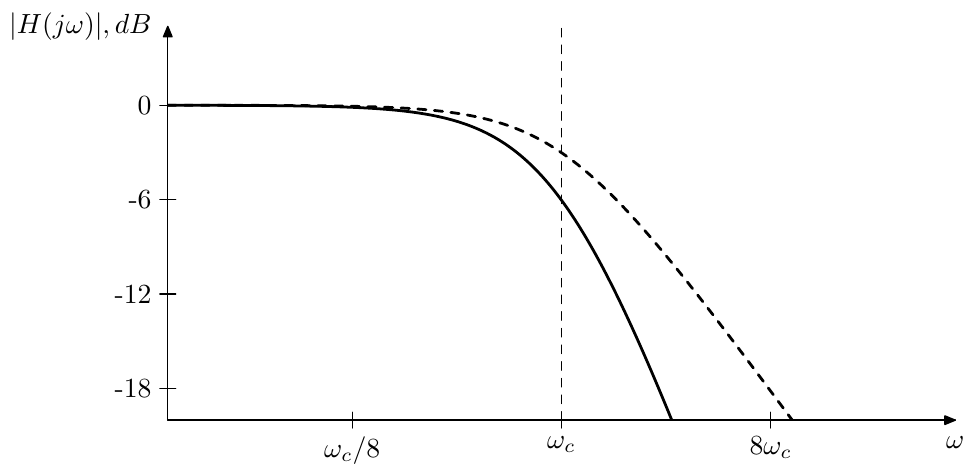

*Figure 4.11: Amplitude response of the 2-pole lowpass filter at $R = 1$
(solid line) compared to the amplitude response of the 1-pole lowpass filter
(dashed line).*

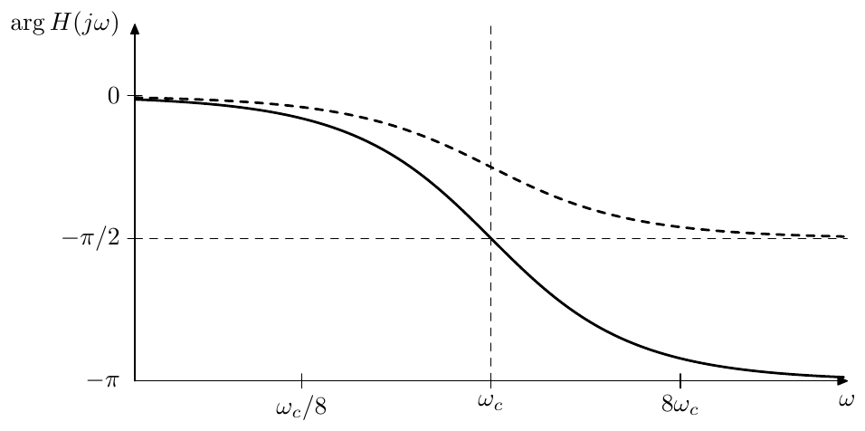

*Figure 4.12: Phase response of the 2-pole lowpass filter at $R = 1$ (solid
line) compared to the amplitude response of the 1-pole lowpass filter (dashed
line).*

### Non-unit cutoff

If $\omega_c \neq 1$ then the transfer function denominator becomes
$s^2+2R\omega_cs+\omega_c^2$ (or $(s/\omega_c)^2+2Rs/\omega_c+1$, if no
simplifications are performed on the entire transfer function) and the
formula for the poles becomes

$$
p_{1,2} = \omega_c \cdot \left(-R \pm \sqrt{R^2-1}\right) =
\begin{cases}
\omega_c \cdot \left(-R\pm\sqrt{R^2-1}\right) & \text{if } |R| \ge 1 \\
\omega_c \cdot \left(-R\pm j\sqrt{1-R^2}\right) & \text{if } -1 \le R \le 1
\end{cases}
\tag{4.9}
$$

The formula (4.9) can be obtained either by directly solving the quadratic
equation or by noticing that the cutoff substitution $s \leftarrow s/\omega_c$
scales the poles according to $p \leftarrow p\omega_c$. Complex poles are
therefore located on the circle of radius $\omega_c$ (Fig. 4.13), while real
poles have a geometric mean equal to $\omega_c$ (Fig. 4.14).

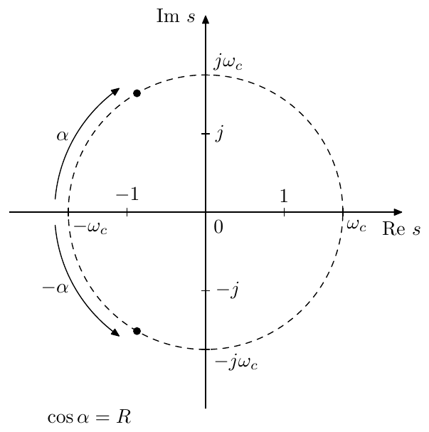

*Figure 4.13: Poles of a resonating 2-pole filter ($\omega_c \neq 1$).*

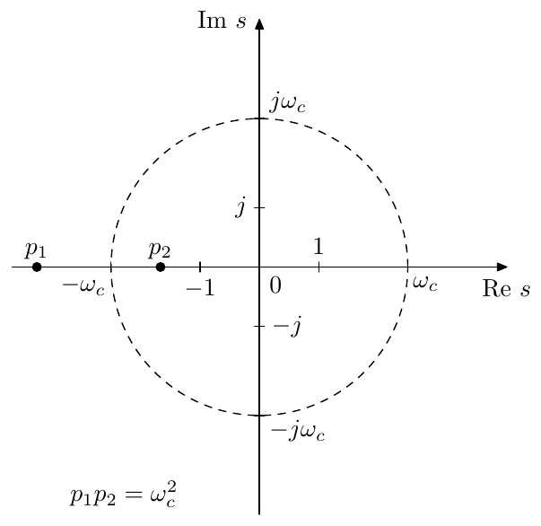

*Figure 4.14: Poles of a non-resonating 2-pole filter ($\omega_c \neq 1$).*

### Transfer function in terms of poles

Writing the lowpass transfer funtion in terms of poles we have for
$\omega_c = 1$

$$
H_{LP}(s) = \frac{1}{s^2+2Rs+1} = \frac{1}{s-p_1}\cdot\frac{1}{s-p_2}
= \frac{1}{s^2-(p_1+p_2)s+1}
$$

and for an arbitrary $\omega_c$ respectively

$$
H_{LP}(s) = \frac{\omega_c^2}{s^2+2R\omega_cs+\omega_c^2}
= \frac{p_1p_2}{s^2-(p_1+p_2)s+p_1p_2}
$$

Respectively

$$
-(p_1+p_2) = 2R\omega_c \tag{4.10a}
$$

$$
p_1p_2 = \omega_c^2 \tag{4.10b}
$$

from where

$$
\omega_c = \sqrt{p_1p_2} \tag{4.11a}
$$

$$
R = -\frac{p_1+p_2}{2\omega_c} = -\frac{(p_1+p_2)/2}{\sqrt{p_1p_2}} \tag{4.11b}
$$

In terms of $\omega_1 = -p_1$ and $\omega_2 = -p_2$ the same turns into

$$
\begin{aligned}
\omega_1+\omega_2 &= 2R\omega_c \\
\omega_1\omega_2 &= \omega_c^2
\end{aligned}
$$

and

$$
\omega_c = \sqrt{\omega_1\omega_2} \tag{4.12a}
$$

$$
R = \frac{\omega_1+\omega_2}{2\omega_c} = \frac{(\omega_1+\omega_2)/2}{\sqrt{\omega_1\omega_2}} \tag{4.12b}
$$

Notice that thereby $\omega_c$ is a geometric mean of the 1-pole cutoffs, and
$R$ is a ratio of their arithmetic and geometric means. Equations (4.12) can
be used to represent a series of two 1-poles with given cutoffs by an
SVF.[^8]

### Pole cutoff and damping

A pair of complex poles of an SVF must be a conjugate pair, therefore we have
$|p_1| = |p_2|$, $\operatorname{Re} p_1 = \operatorname{Re} p_2$ and
$\operatorname{Im} p_1 = -\operatorname{Im} p_2$. The equations (4.10) in
this case turn into

$$
\begin{aligned}
-2\operatorname{Re} p_n &= 2R\omega_c \\
|p_n|^2 &= \omega_c^2
\end{aligned}
\qquad (n = 1, 2)
$$

These relationships motivate the introduction of the notion of the
"associated cutoff and damping" of an arbitrary pair of conjugate poles $p$
and $p^*$, where we would have

$$
\begin{aligned}
-2\operatorname{Re} p &= 2R\omega_c \\
|p|^2 &= \omega_c^2
\end{aligned}
\qquad (n = 1, 2)
$$

and

$$
\begin{aligned}
\omega_c &= |p| \\
R &= \frac{-\operatorname{Re} p}{|p|}
\end{aligned}
\qquad (n = 1, 2) \tag{4.13}
$$

(Fig. 4.13 can serve as an illustration).

This idea is particularly convenient, if we imply that a particular
high-order transfer function is to be implemented as a cascade of 2-poles
(further discussed in Section 8.2), in which case (4.13) gives us ready
formulas for the computation of the cutoff and damping of the respective
2-pole. Also, unless the high-order transfer function is having coinciding
complex poles, the separation of complex poles into pairs of conjugate poles
is unambiguous.

The same can be done for real poles, if desired, where we can use (4.11)
instead of (4.13) but this would work only under the restriction that both
poles are having the same sign (Fig. 4.14 can serve as an illustration).[^9]
Also the grouping of such poles into pairs can be done in different ways.

Sometimes the same terminology is also convenient for zeros. Even though
formally it is not correct, since zeros are not directly associated with a
cutoff or damping, it is sometimes handy to treat a pair of zeros as roots of
a polynomial $s^2+2R\omega_cs+\omega_c^2$.

## 4.4 Digital model

Skipping the naive implementation, which the readers should be perfectly
capable of creating and analyzing themselves by now, we proceed with the
discussion of the TPT model.

Assuming $g\xi+s_n$ instantaneous responses for the two trapezoidal
integrators one can redraw Fig. 4.1 to obtain the discrete-time model in Fig.
4.15.

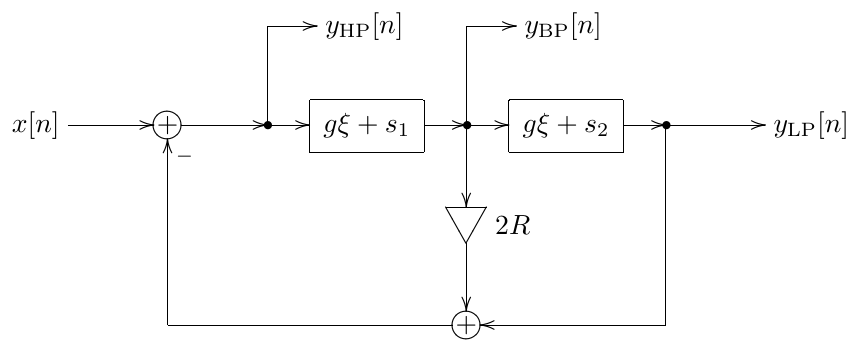

*Figure 4.15: TPT 2-pole multimode state-variable filter in the instantaneous
response form.*

Picking $y_{HP}$ as the zero-delay feedback equation's unknown[^10] we obtain
from Fig. 4.15:

$$
y_{HP} = x - 2R(gy_{HP}+s_1) - g(gy_{HP}+s_1) - s_2
$$

from where

$$
\left(1+2Rg+g^2\right) y_{HP} = x - 2Rs_1 - gs_1 - s_2
$$

from where

$$
y_{HP} = \frac{x-(2R+g)s_1-s_2}{1+2Rg+g^2} \tag{4.14}
$$

Apparently (4.14) has the form (3.37), where the total instantaneous gain of
the zero-delay feedback loop in Fig. 4.15 is $G = -(2Rg+g^2)$ and thus the
instantaneously unstable case occurs when the denominator of (4.14) is
negative. However, as long as $g > 0$ and $R > -1$, the denominator of (4.14)
is always positive:

$$
1+2Rg+g^2 > 1+2\cdot(-1)\cdot g+g^2 = (1-g)^2 \ge 0
$$

thus under these conditions the filter in not becoming instantaneously
unstable.

Using $y_{HP}$ we can proceed defining the remaining signals in the
structure, in the same way as we did for the 1-pole in Section 3.9. Assuming
that we are using trasposed direct form II integrators (Fig. 3.11), $s_n$ are
the states of the $z^{-1}$ elements in the respective integrators and
$g = \omega_cT/2$ (prewarped). Therefore by precomputing the values
$1/(1+2Rg+g^2)$ and $2R+g$ in advance, the formula (4.14) can be computed in
2 subtractions and 2 multiplications. What remains is the processing of both
integrators. A transposed direct form II integrator can be computed in 1
multiplication and 2 additons. Thus, the entire SVF processing routine needs
4 multiplications and 6 additions/subtractions:

```
// perform one sample tick of the SVF
HP := (x-g1*s1-s2)*d; // g1=2R+g, d=1/(1+2Rg+g^2)
v1 := g*HP; BP := v1+s1; s1 := BP+v1; // first integrator
v2 := g*BP; LP := v2+s2; s2 := LP+v2; // second integrator
```

If we are not interested in the highpass signal, we could obtain a more
optimal implementation by solving for $y_{BP}$ instead:

$$
y_{BP} = g(x-2Ry_{BP}-gy_{BP}-s_2)+s_1
$$

$$
(1+2Rg+g^2)y_{BP} = g(x-s_2)+s_1
$$

$$
y_{BP} = \frac{g(x-s_2)+s_1}{1+2Rg+g^2}
$$

This gives us:

```
// perform one sample tick of the SVF BP/LP
BP := (g*(x-s2)+s1)*d; // d=1/(1+2Rg+g^2)
v1 := BP-s1; s1 := BP+v1; // first integrator
v2 := g*BP; LP := v2+s2; s2 := LP+v2; // second integrator
```

This implementation has 3 multiplications and 6 additions/subtractions.

If we need only the BP signal, then we could further transform the
expressions used to update the integrators:

```
// perform one sample tick of the SVF BP
BP := (g*(x-s2)+s1)*d; // d=1/(1+2Rg+g^2)
BP2 := BP+BP; s1 := BP2-s1; // first integrator
v22 := g*BP2; s2 := s2+v22; // second integrator
```

That's 3 multiplications and 5 additions/subtractions.

## 4.5 Normalized bandpass filter

By multiplying the bandpass filter's output by $2R$:

$$
H_{BP1}(s) = 2RH_{BP}(s) = \frac{2Rs}{s^2+2Rs+1} \tag{4.15}
$$

we obtain a bandpass filter which has a unit gain (and zero phase response)
at the cutoff:

$$
H_{BP1}(j) = \frac{2Rj}{j^2+2Rj+1} = 1
$$

For that reason this version of the 2-pole bandpass filter is referred to as
a *unit-gain* or *normalized* bandpass. Fig. 4.16 illustrates the amplitude
response.

The normalized bandpass has a better defined passband than the ordinary
bandpass, since here we can define the frequency range where
$|H_{BP1}(j\omega)| \approx 1$ as the passband. Notably, in Fig. 4.16 one
observes that the width of the passband grows with $R$. At the same time from
Fig. 4.6 one can notice that the width of the band where the bandpass phase
response is close to zero also grows with $R$. Thus, the phase response of
the normalized bandpass filter is close to zero in the entire passband of the
filter, regardless of $R$.[^11]

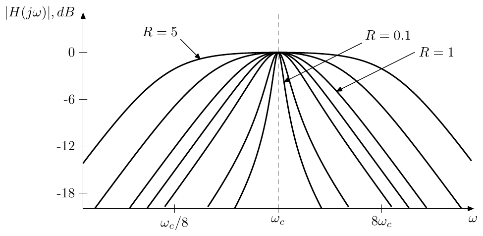

*Figure 4.16: Amplitude response of a 2-pole unit gain bandpass filter.*

Rewriting (4.4) in terms of the normalized bandpass we get

$$
H_{LP}(s) + H_{BP1}(s) + H_{HP}(s) = 1
$$

that is

$$
x(t) = y_{LP}(t) + y_{BP1}(t) + y_{HP}(t)
$$

### Topology

Notice that the unit gain bandpass signal can be directly picked up at the
output of the $2R$ gain element as shown in Fig. 4.17.

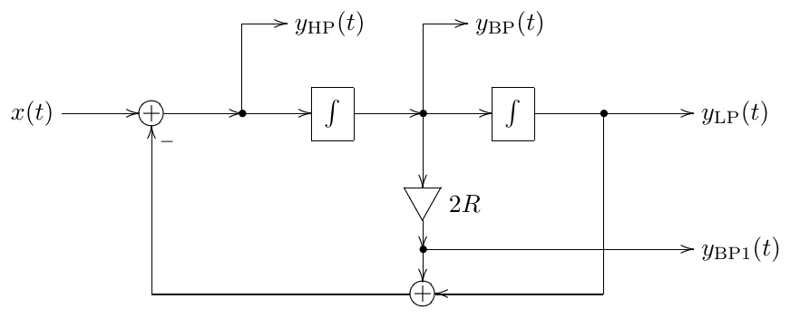

*Figure 4.17: State-variable filter with a normalized bandpass output.*

If the damping parameter is to be modulated at high rate, rather than
multiplying the bandpass output by $2R$, it might be better to multiply the
filter's input by $2R$:

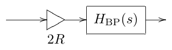

The reasoning is pretty much the same as for positioning the cutoff gains
before the integrators or for preferring the transposed (multi-input) filters
for modal mixing: we let the integrator smooth the jumps or quick changes in
the signal. This will be given for granted if we use the transposed version
of Fig. 4.17.

Instead of using the transposed version, we could inject the input signal
into the Fig. 4.17 filter structure as shown in Fig. 4.18. However, by
multplying the input rather than the output by $2R$ we have not only changed
the "BP" output signal to normalized bandpass, we have also changed the
amplitudes of the LP and HP outputs. Notably, Fig. 4.18 is essentially the
transposed version of Fig. 4.17, except for the relative placement of the
second integrator and an invertor.

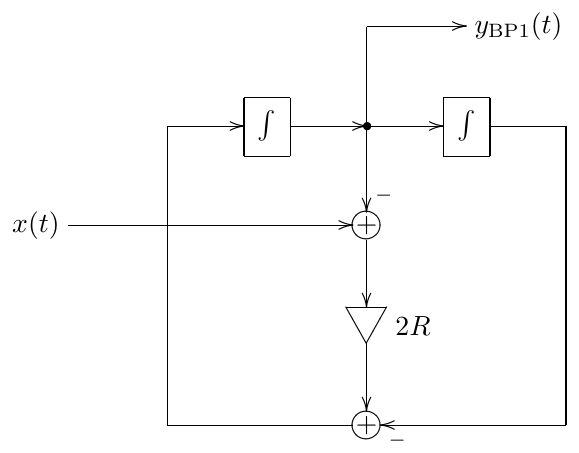

*Figure 4.18: Normalized bandpass state-variable filter with prefilter $2R$
gain.*

### Prewarping

The standard application of the bilinear transform prewarping technique
implies that we want the cutoff point to be positioned exactly at $\omega_c$
on the digital frequency axis. However with the normalized bandpass filter
the positioning of the left and right transition band slopes is more
important than the exact positioning of the cutoff. At the same time, the
damping parameter doesn't seem to have much (or any) vertical effect on the
amplitude response, mainly controlling the distance between the slopes. Thus
we have two degrees of control freedom (the cutoff and the damping) which we
could attempt to use to position the two slopes as exactly as possible.
Instead of developing the corresponding math just for the normalized bandpass
filter, though, we are going to do this in a more general manner in Section
4.6.

## 4.6 LP to BP/BS substitutions

The 2-pole unit gain bandpass response can be obtained from the lowpass
response $1/(1+s)$ by the so-called *LP to BP* (lowpass to bandpass)
*substitution*:

$$
s \leftarrow \frac{1}{R}\cdot\frac{s+s^{-1}}{2} \tag{4.16}
$$

We will also occasionally refer to the LP to BP substitution as the *LP to BP
transformation*, making no particular disctinction between both terms.

Since $s$ and $1/s$ are used symmetrically within the right-hand side of
(4.16), it immediately follows that the result of the substitution is
invariant relative to the LP to HP substitution $s \leftarrow 1/s$. Therefore
the result of the LP to BP substitution has an amplitude response which is
symmetric in the logarithmic frequency scale.

Using $s = j\omega$, we obtain

$$
j\omega \leftarrow \frac{1}{R}\cdot\frac{j\omega+1/j\omega}{2}
$$

or

$$
\omega \leftarrow \frac{1}{R}\cdot\frac{\omega-\omega^{-1}}{2}
$$

Denoting the new $\omega$ as $\omega'$ we write

$$
\omega = \frac{1}{R}\cdot\frac{\omega'-\omega'^{-1}}{2} \tag{4.17}
$$

Instead of trying to understand the mapping of $\omega$ to $\omega'$ it is
easier to understand the inverse mapping from $\omega'$ to $\omega$, as
explicitly specified by (4.17). Furthermore, it is more illustrative to
express $\omega'$ in the logarithmic scale:

$$
\begin{aligned}
\omega &= \frac{1}{R}\cdot\frac{e^{\ln\omega'}-e^{-\ln\omega'}}{2}
= \frac{1}{R}\sinh\ln\omega' && \text{if } \omega > 0
\end{aligned}
$$

$$
\omega = -\frac{1}{R}\cdot\frac{e^{\ln|\omega'|}-e^{-\ln|\omega'|}}{2}
= -\frac{1}{R}\sinh\ln|\omega'|  \text{if } \omega < 0
$$

Thus

$$
\omega = \frac{1}{R}\sinh\left(\operatorname{sgn}\omega'\cdot\ln|\omega'|\right) \tag{4.18}
$$

Since $\ln|\omega'|$ takes up the entire real range of values in each of the
cases $\omega > 0$ and $\omega < 0$ and respectively, so does
$\sinh(\operatorname{sgn}\omega'\cdot\ln|\omega'|)$,

$$
\begin{aligned}
\omega' \in (0,+\infty) &\iff \omega \in (-\infty,+\infty) \\
\omega' \in (-\infty,0) &\iff \omega \in (-\infty,+\infty)
\end{aligned}
$$

This means that the entire range $\omega \in (-\infty,+\infty)$ is mapped
once onto the positive frequencies $\omega'$ and once onto the negative
frequencies $\omega'$. Furthermore, the mapping and its inverse are strictly
increasing on each of the two segments $\omega > 0$ and $\omega < 0$, since
$d\omega/d\omega' > 0$. The unit frequencies $\omega' = \pm 1$ are mapped
from $\omega = 0$.

Since we are often dealing with unit-cutoff transfer functions
($\omega_c = 1$), it's interesting to see to which frequencies $\omega_c'$
the unit cutoff is mapped. Recalling
that the entire bipolar range of $\omega$ is mapped to the positive range of
$\omega'$, we need to include the negative cutoff point ($\omega_c = -1$) into
our transformation. On the other hand, we are interested only in positive
$\omega_c'$, since the negative-frequency range of the amplitude response is
symmetric to the positive-frequency range anyway. Under these reservations,
from (4.18) we have:

$$
\frac{1}{R}\sinh\ln\omega_c' = \pm 1
$$

from where $\ln\omega_c' = \pm\sinh^{-1}R$, or, changing the logarithm base:

$$
\log_2\omega_c' = \pm\frac{\sinh^{-1}R}{\ln 2}
$$

Note that the above immediately implies that the two points $\omega_c'$ are
located at mutually reciprocal positions.

The distance in octaves between the two $\omega_c'$ points can be defined as
the bandwidth of the transformation:

$$
\Delta = \frac{2}{\ln 2}\sinh^{-1}R \tag{4.19}
$$

Since the points $\omega_c'$ are mutually reciprocal, they are located at
$\pm\Delta/2$ octaves from $\omega = 1$.

Inverting (4.19) we can obtain the damping, given the bandwidth $\Delta$:

$$
R = \sinh\frac{\Delta\cdot\ln 2}{2} = \frac{2^{\Delta/2}-2^{-\Delta/2}}{2} \tag{4.20}
$$

### Frequency axis warping and parameter prewarping

An important consequence of the fact that the LP to BP substitution can be
seen as a mapping of the $\omega$ axis is that the only effect of the
variation of the $R$ parameter is the warping of the frequency axis. This
means that (like in the bilinear transform) the amplitude and phase responses
are warped identically and the relationship between amplitude and phase
responses is therefore preserved across the entire range of $\omega$.

If LP to BP substitution is involved, the resulting frequency response has
two points of interest which are the images $\omega_1'$ of the original point
at $\omega_1 = 1$, which often is the cutoff point of the original frequency
response.[^12] Given a digital implementation of such LP to BP substitution's
result, we can prewarp the $R$ parameter of the substitution in such a way
that the distance between the $\omega_1'$ points in the digital frequency
response is identical to the distance between those in analog frequency
response.

Indeed, given the original value of $R$, we can use (4.19) to compute the
distance $\Delta$ between the $\omega_1'$ points. We know that the points are
positioned at $\pm\Delta/2$ octaves from $\omega = 1$, or, if the substitution
result has its own cutoff parameter, from $\omega_c$. That is

$$
\omega_1' = \omega_c\cdot 2^{\pm\Delta/2}
$$

So, these are the frequencies at which the unit frequency's image points
would be normally located on an analog filter's response and where we want
them to be located on the digital filter's response. If $\omega_1'$ are the
points on the digital frequency response, then by (3.10) the corresponding
analog points should be located at

$$
\tilde\omega_1' = \mu(\omega_1') = \mu\left(\omega_c\cdot 2^{\pm\Delta/2}\right)
$$

At unit cutoff $\tilde\omega_c$ the points $\tilde\omega_1'$ would have been
mutually reciprocal. If the cutoff is not unity, then it must be equal to the
geometric mean of $\tilde\omega_1'$:

$$
\tilde\omega_c = \sqrt{\mu\left(\omega_c\cdot 2^{\Delta/2}\right)\cdot\mu\left(\omega_c\cdot 2^{-\Delta/2}\right)}
$$

while the bandwidth is simply the logarithm of the ratio of $\tilde\omega_1'$:

$$
\tilde\Delta = \log_2\frac{\mu\left(\omega_c\cdot 2^{\Delta/2}\right)}{\mu\left(\omega_c\cdot 2^{-\Delta/2}\right)}
$$

Given $\tilde\Delta$, we obtain $\tilde R$ from (4.20).

So, we have obtained the *prewarped* parameters $\tilde\omega_c$ and $\tilde
R$, which can be used to control a bilinear transform-based digital
implementation of an LP to BP substitution's result, thereby ensuring the
correct positioning of the $\omega_1'$ points. Particularly, treating the
normalized bandpass filter as the result of LP to BP substitution's
application to a 1-pole lowpass $1/(1+s)$, we could prewarp the bandpass
filter's parameters to have exact positioning of the -3dB points on the left
and right slopes (since these are the images of the 1-pole lowpass's unit
cutoff point).

In principle, any other two points could have been chosen as prewarping
points, where the math is much easier if these two points are located
symmetrically relatively to the cutoff in the logarithm frequency scale. We
will not go into further detail of this, as the basic ideas of deriving the
respective equations are exactly the same.

### Poles and stability

The transformation of the poles and zeros by the LP to BP transformation can
be obtained from

$$
s = \frac{1}{R}\cdot\frac{s'+s'^{-1}}{2} \tag{4.21}
$$

resulting in

$$
s' = Rs \pm \sqrt{R^2s^2-1}
$$

Regarding the stability preservation consider that the sum $(s'+1/s')$ in
(4.21) is located in the same complex semiplane (left or right) as $s'$.
Therefore, as long as $R > 0$, the original value $s$ is located in the same
semiplane as its images $s'$. which implies that the stability is preserved.
On the other hand, negative values of $R$ "flip" the stability.

### Topological LP to BP substitution

As for performing the LP to BP substitution in a block diagram, differently
from the LP to HP substitution, here we don't need differentiators. The
substitution can be performed by replacing all (unit-cutoff) integrators in
the system with the structure in Fig. 4.19, thereby substituting
$2Rs/(s^2+1)$ for $1/s$, which is algebraically equivalent to (4.16).[^13]

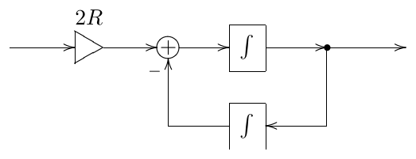

*Figure 4.19: "LP to BP" integrator.*

### LP to BS substitution

The *LP to BS* (lowpass to bandstop) *substitution*[^14] is obtained as a
series of LP to HP substitution followed by an LP to BP substitution. Indeed,
applying the LP to BP substitution to a 1-pole highpass, we obtain the 2-pole
notch ("bandstop") filter. Therefore, applying a series of LP to HP and LP to
BP substitutions to a 1-pole lowpass we also obtain the 2-pole notch filter.

Combining the LP to HP and LP to BP substitutions expressions in the
mentioned order gives an algebraic expression for the LP to BS substitution:

$$
\frac{1}{s} \leftarrow \frac{1}{R}\cdot\frac{s+s^{-1}}{2} \tag{4.22}
$$

The bandwidth considerations of the LP to BS substitution are pretty much
equivalent to those of LP to BP substitution and can be obtained by
considering the LP to BS substitution as an LP to BP substitution applied to
a result of the LP to HP substitution.

The block-diagram form of the LP to BS substitution can be obtained by
directly implementing the right-hand expression in (4.22) as a replacement
for the integrators. This however requires a differentiator for the
implementation of the $s$ term of the sum.

## 4.7 Further filter types

By mixing the lowpass, bandpass and highpass outputs one can obtain further
filter types. We are now going to discuss some of them.

Often it will be convenient to also include the input signal and the
normalized bandpass signal into the set of the mixing sources. Apparently
this doesn't bring any new possibilities in terms of the obtained transfer
functions, since the input signal can be obtained as a linear combination of
LP, BP and HP signals. However the mixing coefficients might look simpler in
certain cases. One can also go further and consider using different
topologies implementing a given 2-pole transfer function. Such topologies
could differ not only in which specific signals are mixed, but also whether
certain mixing coefficients are used at the input or at the output, whether
transposed or non-transposed SVF is being used, etc. We won't go here into
addressing this kind of detail, however the discussion of the topological
aspects of the normalized bandpass in Section 4.5 could serve as an example.

### Band-shelving filter

By adding/subtracting the unit gain bandpass signal to/from the input signal
one obtains the band-shelving filter (Fig. 4.20):

$$
H_{BS}(s) = 1 + K\cdot H_{BP1}(s) = 1 + 2RKH_{BP}(s) = 1 + \frac{2RKs}{s^2+2Rs+1}
$$

As with 1-pole shelving we can also specify the shelving boost in decibel:

$$
G_{dB} = 20\log_{10}(K+1)
$$

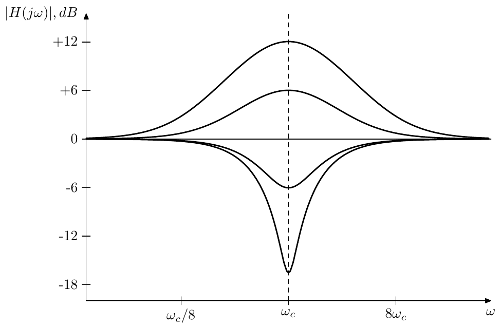

*Figure 4.20: Amplitude response of a 2-pole band-shelving filter
for $R = 1$ and varying $K$.*

The immediately noticeable problem in Fig. 4.20 is that the bandwidth of the
filter varies with the shelving boost $K$. A way to address this issue will
be described in Chapter 10.

### Low- and high-shelving filters

Attempting to obtain 2-pole low- and high-shelving filters in a
straightforward fashion:

$$
H_{LS}(s) = 1 + K\cdot H_{LP}(s) \qquad H_{HS}(s) = 1 + K\cdot H_{HP}(s)
$$

we notice that the amplitude responses of such filters have a strange dip
(for $K > 0$) or peak (for $K < 0$) even at a non-resonating setting of $R=1$
(Fig. 4.21). This peak/dip is due to a steeper phase response curve of the
2-pole lowpass and highpass filters compared to 1-poles. A way to build
2-pole low- and high-shelving filters, which do not have this problem, is
described in Chapter 10.

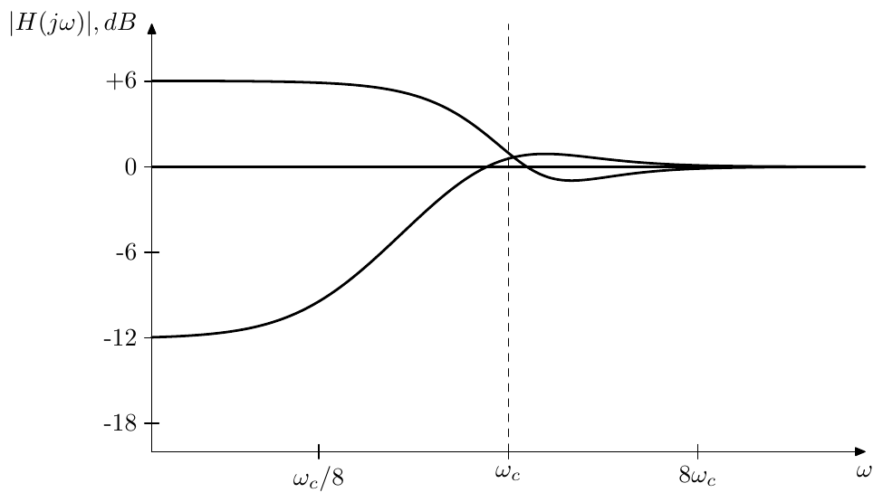

*Figure 4.21: Amplitude response of a naive 2-pole low-shelving
filter for $R = 1$ and varying $K$.*

### Notch filter

At $K = -1$ the band-shelving filter turns into a notch (or bandstop) filter
(Fig. 4.22):

$$
H_N(s) = 1 - H_{BP1}(s) = 1 - 2RH_{BP}(s) = \frac{s^2+1}{s^2+2Rs+1}
$$

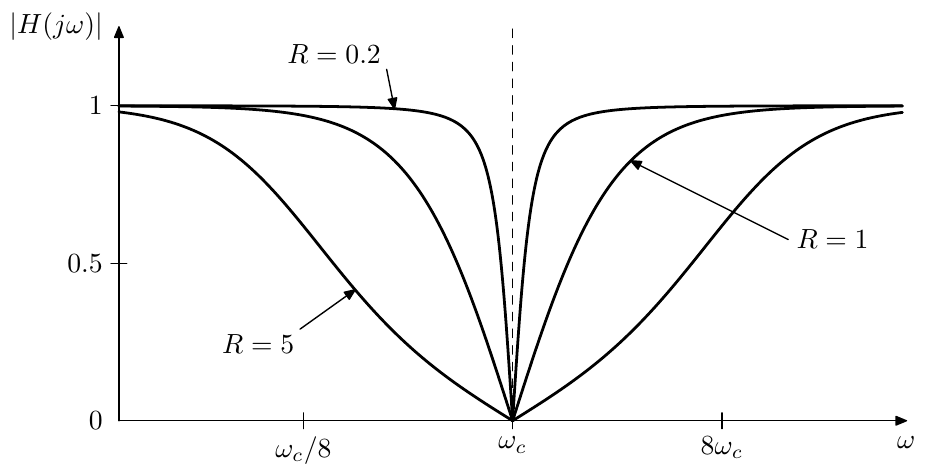

*Figure 4.22: Amplitude response of a 2-pole notch filter. The
amplitude scale is linear.*

### Allpass filter

At $K = -2$ the band-shelving filter turns into an allpass filter (Fig. 4.23):

$$
H_{AP}(s) = 1 - 2H_{BP1}(s) = 1 - 4RH_{BP}(s) = \frac{s^2-2Rs+1}{s^2+2Rs+1} \tag{4.23}
$$

It is not difficult to show that for purely imaginary $s$ the absolute
magnitudes of the transfer function's numerator and denominator are equal and
thus $|H_{AP}(j\omega)| = 1$.

We could also notice that the phase respose of the 2-pole allpass is simply
the doubled 2-pole lowpass phase response:

$$
\begin{aligned}
\arg H_{AP}(j\omega) &= \arg\frac{1-2Rj\omega-\omega^2}{1+2Rj\omega-\omega^2} = \\
&= \arg(1-2Rj\omega-\omega^2) - \arg(1+2Rj\omega-\omega^2) = \\
&= -2\arg(1+2Rj\omega-\omega^2) = 2\arg H_{LP}(j\omega)
\end{aligned} \tag{4.24}
$$

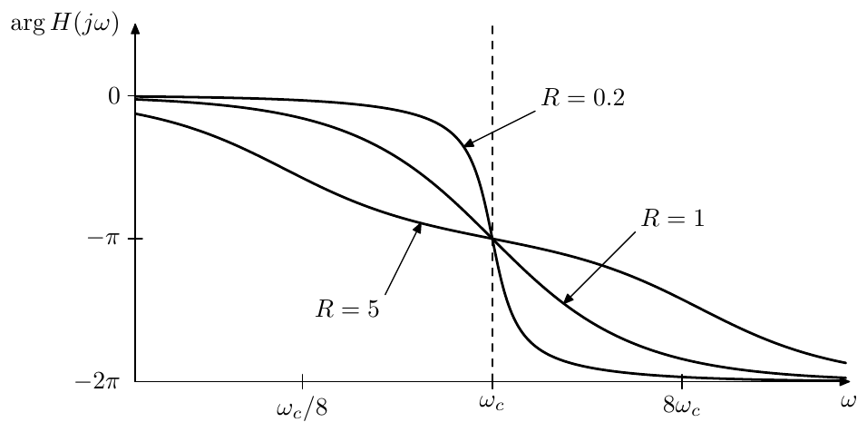

*Figure 4.23: Phase response of a 2-pole allpass filter.*

Thus the allpass phase response has the same symmetry around the cutoff
point and the damping parameter has a similar effect on the phase response
slope.

At $R \geq 1$ the 2-pole allpass can be decomposed into the product of 1-pole
allpasses:

$$
H_{AP}(s) = \frac{s-\omega_1}{s+\omega_1}\cdot\frac{s-\omega_2}{s+\omega_2} = \frac{\omega_1-s}{\omega_1+s}\cdot\frac{\omega_2-s}{\omega_2+s}
$$

where $\omega_n = -p_n$. At $R = 1$ we have $\omega_1 = \omega_2 = 1$ and the
filter turns into the squared 1-pole allpass:

$$
H_{AP}(s) = \left(\frac{s-1}{s+1}\right)^2 = \left(\frac{1-s}{1+s}\right)^2
$$

### Peaking filter

By subtracting the highpass signal from the lowpass signal (or also vice
versa) we obtain the peaking filter (Fig. 4.24):

$$
H_{PK}(s) = H_{LP}(s) - H_{HP}(s) = \frac{1-s^2}{s^2+2Rs+1}
$$

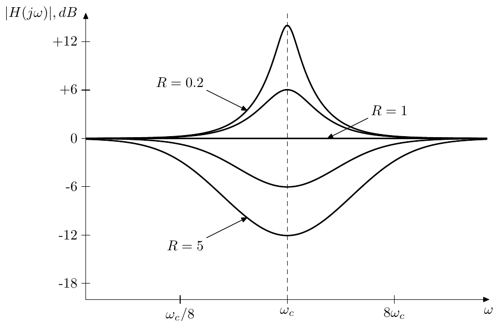

*Figure 4.24: Amplitude response of a 2-pole peaking filter.*

The peaking filter is a special kind of bandshelving filter. However, as one
can see from Fig. 4.24, the bandwidth of the filter varies drastically with
$R$, which often may be undesired. A "properly built" bandshelving filter
allows to avoid this problem. This topic is further discussed in Chapter 10.

### Arbitrary 2-pole transfer functions

It's easy to see that the state-variable filter can be used to implement any
2nd-order stable differential filter. Indeed, consider the generic 2nd-order
transfer function

$$
H(s) = \frac{b_2s^2+b_1s+b_0}{s^2+a_1s+a_0}
$$

where we assume $a_0 > 0$.[^15] Then

$$
\begin{aligned}
H(s) &= \frac{b_2s^2+b_1s+b_0}{s^2+2\dfrac{a_1}{2\sqrt{a_0}}\sqrt{a_0}\,s+\sqrt{a_0}^{\,2}} = \frac{b_2s^2+b_1s+b_0}{s^2+2R\omega_c s+\omega_c^2} = \\
&= b_2\frac{s^2}{s^2+2R\omega_c s+\omega_c^2} + \frac{b_1}{\omega_c}\cdot\frac{\omega_c s}{s^2+2R\omega_c s+\omega_c^2} + \frac{b_0}{\omega_c^2}\cdot\frac{\omega_c^2}{s^2+2R\omega_c s+\omega_c^2} = \\
&= b_2H_{HP}(s) + \frac{b_1}{\omega_c}H_{BP}(s) + \frac{b_0}{\omega_c^2}H_{LP}(s)
\end{aligned}
$$

where we introduced $\omega_c = \sqrt{a_0}$ and $R = a_1/\omega_c$.

## 4.8 Transient response

In the transient response analysis of the state-variable filter we will
concentrate on the lowpass output. The bandpass and highpass can be obtained
from the lowpass using (4.1):

$$
y_{BP} = \dot y_{LP}/\omega_c \tag{4.25a}
$$

$$
y_{HP} = \dot y_{BP}/\omega_c = \ddot y_{LP}/\omega_c^2 \tag{4.25b}
$$

Using (4.10) we rewrite (4.3) in terms of poles, obtaining

$$
\ddot y - (p_1+p_2)\dot y + p_1p_2 = p_1p_2x \tag{4.26}
$$

where $y = y_{LP}$. Let[^16]

$$
u_1 = \dot y - p_2y \tag{4.27a}
$$

$$
u_2 = \dot y - p_1y \tag{4.27b}
$$

Therefore

$$
\begin{aligned}
\dot u_1 &= \ddot y - p_2\dot y \\
\dot u_2 &= \ddot y - p_1\dot y
\end{aligned}
$$

and

$$
\begin{aligned}
(\dot u_1+\dot u_2) - (p_1u_1+p_2u_2) &= (2\ddot y-(p_1+p_2)\dot y) - ((p_1+p_2)\dot y-2p_1p_2y) = \\
&= 2\ddot y - 2(p_1+p)2)\dot y + 2p_1p_2y \tag{4.28}
\end{aligned}
$$

Noticing that the last expression is simply the doubled left-hand side of
(4.26) we obtain an equivalent form of (4.26):

$$
(\dot u_1+\dot u_2) - (p_1u_1+p_2u_2) = 2p_1p_2x \tag{4.29}
$$

Splitting the latter in two halves we have:

$$
\dot u_1 - p_1u_1 = p_1p_2x \tag{4.30a}
$$

$$
\dot u_2 - p_2u_2 = p_1p_2x \tag{4.30b}
$$

Adding both equations (4.30) back together, we obtain (4.29), which is
equivalent to (4.26). This means that if $u_1$ and $u_2$ are solutions of
(4.30) then using (4.27) we can find $y$ from $u_1$ and $u_2$, which will be
the solution of (4.26).

Now, each of the equations (4.30) is a Jordan 1-pole with input signal
$p_1p_2x$. Applying (2.22) we obtain

$$
u_n(t) = u_n(0)e^{p_nt} + p_1p_2\int_0^t e^{p_n(t-\tau)}x(\tau)\,d\tau \qquad (n=1,2)
$$

or, for $x(t) = X(s)e^{st}$, we have from (2.23):

$$
u_n(t) = H_n(s)x(t) + \bigl(u_n(0)-H_n(s)x(0)\bigr)e^{p_nt} = u_{sn}(t) + u_{tn}(t) \tag{4.31}
$$

where

$$
H_n(s) = \frac{p_1p_2}{s-p_n}
$$

and where $u_{sn}(t)$ and $u_{tn}(t)$ denote the steady-state and transient
response parts of $u_n(t)$ respectively. Expressing $y$ via $u_n$ from (4.27)
we have

$$
y = \frac{u_1-u_2}{p_1-p_2} \tag{4.32}
$$

For the steady-state response we therefore obtain from (4.31):

$$
y_s(t) = \frac{u_{s1}-u_{s2}}{p_1-p_2} = \frac{H_1(s)-H_2(s)}{p_1-p_2}x(t) = H(s)x(t)
$$

where

$$
\begin{aligned}
H(s) &= \frac{H_1(s)-H_2(s)}{p_1-p_2} = \dfrac{\dfrac{p_1p_2}{s-p_1}-\dfrac{p_1p_2}{s-p_2}}{p_1-p_2} = \\
&= \frac{p_1p_2}{p_1-p_2}\cdot\frac{(s-p_2)-(s-p_1)}{s^2-(p_1+p_2)s+p_1p_2s} = \\
&= \frac{p_1p_2}{s^2-(p_1+p_2)s+p_1p_2s} = \frac{\omega_c^2}{s^2+2R\omega_c+\omega_c^2} \tag{4.33}
\end{aligned}
$$

is the familiar 2-pole lowpass transfer function. The steady-state response
$y_s(t)$ is therefore having the same form $H(s)x(t)$ for a complex
exponential $x(t) = X(s)e^{st}$ as in case of the 1-pole filter. For signals
of general form we respectively obtain the same formula (2.20a) as for
1-poles.

For the transient response we have

$$
\begin{aligned}
y_t(t) &= \frac{u_{t1}-u_{t2}}{p_1-p_2} = \\
&= \frac{\dot y(0)-p_2y(0)-H_1(s)x(0)}{p_1-p_2}\cdot e^{p_1t} - \frac{\dot y(0)-p_1y(0)-H_2(s)x(0)}{p_1-p_2}\cdot e^{p_2t} = \\
&= \frac{\dot y(0)-p_2(y(0)-G_1(s)x(0))}{p_1-p_2}\cdot e^{p_1t} - \frac{\dot y(0)-p_1(y(0)-G_2(s)x(0))}{p_1-p_2}\cdot e^{p_2t} \tag{4.34}
\end{aligned}
$$

where we introduce the ordinary (except that $p_n$ may be complex) 1-pole
lowpass transfer functions

$$
G_n(s) = \frac{-p_n}{s-p_n}
$$

Provided $\operatorname{Re} p_{1,2} < 0$ we are having a sum of two exponentially decaying
terms. Since $y(0) = y_s(0) + y_t(0)$, the initial value of this sum is
$y_t(0) = y(0) - y_s(0)$, the same as in the 1-pole case, so we're having an exponentially
decaying discrepancy between the output signal and the steady-state response. However the
decaying is now being "distributed" between two exponents $e^{p_1 t}$ and $e^{p_2 t}$. Also
notice that while in the 1-pole case the decaying was only affected by the initial state
$y(0)$, in the 2-pole case $\dot y(0)$ is also a part of the initial state and therefore also
affects the decaying shape. Apparently, $y(0)$ is the state of the second ("lowpass")
integrator of the SVF, while, according to (4.25a), $\dot y(0)$ is essentially the state of
the first ("bandpass") integrator.

At $\operatorname{Re} p_{1,2} > 0$ the transient response grows infinitely and the filter
explodes.

### Steady-state response

In regards to the choice of the steady-state response, there is a similar ambiguity arising
out of evaluating the inverse Laplace transform of $H(s)X(s)$ to the left or to the right of
the poles of $H(s)$. We won't specifically go into the analysis of this situation for the real
poles occurring in the case $|R| > 1$. Complex poles occurring in the case $|R| < 1$ deserve
some specical attention.

Apparently $\operatorname{Re} p_1 = \operatorname{Re} p_2$ in this case, and we wish to know
how much does the inverse Laplace transform change when we switch the integration path from
$\operatorname{Re} s < \operatorname{Re} p_n$ to $\operatorname{Re} s > \operatorname{Re} p_n$.
By the residue theorem this change will be equal to the sum of the residues of $H(s)X(s)e^{st}$
at $s = p_1$ and $s = p_2$ respectively, which is

$$
\operatorname{Res}_{s=p_1} H(s)X(s)e^{st} + \operatorname{Res}_{s=p_2} H(s)X(s)e^{st}
= \frac{p_1 p_2}{p_1 - p_2}\left(X(p_1)e^{p_1 t} - X(p_2)e^{p_2 t}\right) \tag{4.35}
$$

(where we have used (4.33)). That is we are again obtaining the terms which already exist in
the transient response and the integration path choice only affects the amplitudes of the
transient response partials, as long as we are staying within the region of convergence of
$X(s)$.

The case of coinciding poles requires a separate analysis which can be done as a limiting case
$R \to \pm 1$. The respective discussion is occurring later in this section. Even though we
don't specifically address the question of evaluation of the inverse Laplace transform in the
steady-state response there, it should be clear what the principles would be.

### Continuity

Since the input signal of an SVF passes through two integrators on the way to the lowpass
output, the lowpass signal should not only always be continuous but should also always have a
continuous 1st derivative. Therefore the appearance of $\dot y(0)$ besides $y(0)$ in the
transient response expression must have somehow taken care of that. Let's verify that this is
indeed the case.

Evaluating (4.34) at $t = 0$ using we obtain

$$
\begin{aligned}
y_t(0) &= \frac{\dot y(0) - p_2 y(0) - H_1(s)x(0)}{p_1-p_2} - \frac{\dot y(0) - p_1 y(0) - H_2(s)x(0)}{p_1-p_2} = \\
&= y(0) - \frac{H_1(s)-H_2(s)}{p_1-p_2}x(0) = y(0) - H(s)x(0) = y(0) - y_s(0)
\end{aligned}
$$

where we have used (4.33). Evaluating the derivative of (4.34) at $t = 0$ we obtain

$$
\begin{aligned}
\dot y_t(0) &= p_1\frac{\dot y(0) - p_2 y(0) - H_1(s)x(0)}{p_1-p_2} - p_2\frac{\dot y(0) - p_1 y(0) - H_2(s)x(0)}{p_1-p_2} = \\
&= \dot y(0) + \frac{-p_1 H_1(s) + p_2 H_2(s)}{p_1-p_2}\cdot p_1 p_2 x(0) = \\
&= \dot y(0) + \frac{\dfrac{-p_1}{s-p_1} - \dfrac{-p_2}{s-p_2}}{p_1-p_2}\cdot p_1 p_2 x(0) = \\
&= \dot y(0) + \frac{(-p_1)(s-p_2)-(-p_2)(s-p_1)}{p_1-p_2}\cdot\frac{p_1 p_2}{(s-p_1)(s-p_2)}x(0) = \\
&= \dot y(0) - \frac{p_1 p_2 \cdot s}{s^2-(p_1+p_2)s+p_1p_2}x(0) = \dot y(0) - \frac{\omega^2 s}{s^2+2R\omega_c s+\omega_c^2}x(0) = \\
&= \dot y(0) - \frac{\omega^2}{s^2+2R\omega_c s+\omega_c^2}\cdot sX(s)e^{st}\Big|_{t=0} = \dot y(0) - \dot y_s(0)
\end{aligned}
$$

which confirms our expectations.

### Complex vs. real poles

If $p_{1,2}$ are complex we have

$$
e^{p_n t} = e^{t\operatorname{Re}p_n}\cdot(\cos(t\operatorname{Im}p_n)+j\sin(t\operatorname{Im}p_n))
$$

The mutual conjugate property of poles will ensure that the two terms of (4.34) are mutually
conjugate as well, therefore the addition result is purely real and has the form

$$
\begin{aligned}
y_t(t) &= a\cdot e^{t\operatorname{Re}p_1}\cdot\cos\left(|\operatorname{Im}p_1|\cdot t+\varphi\right) = \\
&= a\cdot e^{t\operatorname{Re}p_2}\cdot\cos\left(|\operatorname{Im}p_2|\cdot t+\varphi\right) = \\
&= a\cdot e^{-R\omega_c t}\cdot\cos\left(\omega_c\sqrt{1-R^2}\cdot t+\varphi\right)
\end{aligned}
\tag{4.36}
$$

The transient response therefore is a sinusoidal oscillation of frequency $|\operatorname{Im}p_n|$
decaying (or exploding) as $e^{t\operatorname{Re}p_n}$. Fig. 4.25 illustrates.

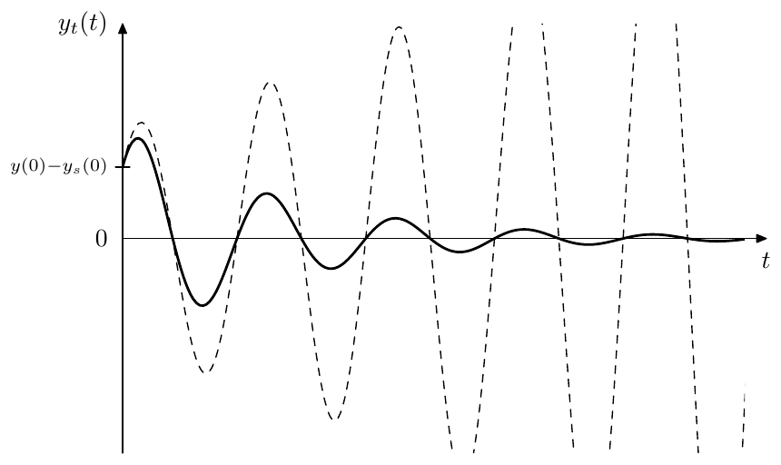

*Figure 4.25: Transient response of a resonating 2-pole lowpass filter (dashed line depicts the unstable case).*

For purely real poles the transient response contains just two real exponents of the form
$e^{p_n t}$, thereby having no oscillations. However, it can still contain one "swing" at
certain combinations of the amplitudes of the transient partials $e^{p_1 t}$ and $e^{p_2 t}$
(Fig. 4.26).

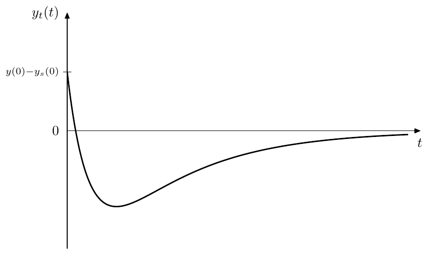

*Figure 4.26: Transient response of a non-resonating 1-pole lowpass filter (for the case of a single zero-crossing).*

### Strong resonance case

The decay speed of the transient response oscillation (4.36) gets slower as $R$ decreases,
which leads to an increased perceived duration of the transient in the output signal.
Therefore at high resonance settings a transient in the input signal will produce audible
ringing at resonance frequency, even if the steady-state signal doesn't contain it.

A pretty characteristic and easy to analyse case occurs if we suddenly switch off the filter's
input signal. At this moment the steady-state response instantaneously turns to zero and (4.34)
turns into

$$
\begin{aligned}
y_t(t) &= \frac{\dot y(0) - p_2 y(0)}{p_1-p_2}\cdot e^{p_1 t} - \frac{\dot y(0) - p_1 y(0)}{p_1-p_2}\cdot e^{p_2 t} = \\
&= \frac{\dot y(0) - p_1^* y(0)}{2j\operatorname{Im}p_1}\cdot e^{p_1 t} - \frac{\dot y(0) - p_1 y(0)}{2j\operatorname{Im}p_1}\cdot e^{p_2 t} = \\
&= \frac{\dot y(0) - p_1^* y(0)}{2j\operatorname{Im}p_1}\cdot e^{p_1 t} + \frac{\dot y(0) - p_1 y(0)}{2j^*\operatorname{Im}p_1}\cdot e^{p_1^* t} = \\
&= 2\operatorname{Re}\left(\frac{\dot y(0)-p_1^* y(0)}{2j\operatorname{Im}p_1}e^{p_1 t}\right) = \operatorname{Re}\left(\frac{\dot y(0)-p_1^* y(0)}{j\operatorname{Im}p_1}e^{p_1 t}\right)
\end{aligned}
$$

Therefore

$$
y(t) = y_s(t)+y_t(t) = 0+y_t(t) = \operatorname{Re}\left(\frac{\dot y(0)-p_1^* y(0)}{j\operatorname{Im}p_1}e^{p_1 t}\right)
$$

Unless both $y(0) = 0$ and $\dot y(0) = 0$, the signal $y(t)$ will have a non-zero amplitude and
according to (4.36) we are having a sinusoid of frequency $\omega_c\sqrt{1-R^2}$ decaying as
$e^{-R\omega_c t}$.

The opposite situation of a signal being turned on is a kind of a dual case of turning a signal
off. Indeed, let $x_0(t)$ be some infinitely long (that is $t \in (-\infty,\infty)$) steady input
signal and let $y_0(t)$ be the respective output signal. Assuming that the filter is stable and
that the initial time moment was at $t = -\infty$, by any finite time moment $t$ the transient
response component of $y_0(t)$ has decayed to zero, and $y_0(t)$ consists solely of the
steady-state response. Let

$$
x_1(t) = \begin{cases} x_0(t) & \text{if } t<0 \\ 0 & \text{if } t\geq 0 \end{cases}
$$

be another infinitely long signal decribing the case of the signal $x_0(t)$ being turned off and
let $y_1(t)$ be the respective output signal. The signal $x_1(t)$ contains a transient at
$t = 0$, thus $y_1(t)$ contains a non-zero transient response component for $t \geq 0$. The case
of $x_0(t)$ being turned on is respectively described by

$$
x_2(t) = x_0(t) - x_1(t) = \begin{cases} 0 & \text{if } t<0 \\ x_0(t) & \text{if } t\geq 0\end{cases}
$$

and we let $y_2(t)$ denote the corresponding output signal. Since the system is linear, the
output signals are related in the same way as the input signals:

$$
y_2(t) = y_0(t) - y_1(t)
$$

However $y_0(t)$ doesn't contain any transient response, therefore the only transient response
present in $y_2(t)$ is coming from $y_1(t)$, simply having the opposite sign.

The effect of the transient response is particularly remarkable if the input signal is a
sinusoid of the same frequency $\omega_c\sqrt{1-R^2}$ as the transient response. First
considering the case of turning such sinusoid off we take

$$
x_0(t) = a_{\text{in}}\cos(\omega_c\sqrt{1-R^2}\cdot t+\varphi_{\text{in}})
$$

$$
x_1(t) = \begin{cases} x_0(t) & \text{if } t<0 \\ 0 & \text{if } t\geq 0 \end{cases}
$$

We must have the same sinusoid at the output:

$$
y_0(t) = a_{\text{out}}\cos(\omega_c\sqrt{1-R^2}\cdot t+\varphi_{\text{out}})
$$

$$
y_1(t) = \begin{cases} a_{\text{out}}\cos(\omega_c\sqrt{1-R^2}\cdot t+\varphi_{\text{out}}) & \text{if } t<0 \\ a_t e^{-R\omega_c t}\cdot\cos(\omega_c\sqrt{1-R^2}\cdot t+\varphi_t) & \text{if } t\geq 0\end{cases}
$$

where the transient response's amplitude and phase $a_t$ and $\varphi_t$ may differ from the
steady-state response's $a_{\text{out}}$ and $\varphi_{\text{out}}$ due to the additional
factor $e^{-R\omega_c t}$ appearing in the signal. However from the requirement of continuity of
$y_1(t)$ and $\dot y_1(t)$ at $t = 0$ we may conclude that $a_t \to a_{\text{out}}$ and
$\varphi_t \to \varphi_{\text{out}}$ for $R \to 0$.

Now let's consider the case of turning the signal on. We let $x_2(t) = x_0(t) - x_1(t)$. Since
we already know that $y_2(t) = 0$ for $t < 0$, we are interested only in $y_2(t)$ for $t \geq 0$
where we have

$$
\begin{aligned}
y_2(t) &= y_0(t) - y_1(t) = \\
&= a_{\text{out}}\cos(\omega_c\sqrt{1-R^2}\cdot t+\varphi_{\text{out}}) - a_t e^{-R\omega_c t}\cdot\cos(\omega_c\sqrt{1-R^2}\cdot t+\varphi_t)
\end{aligned}
$$

Since at $R \approx 0$ we have $a_t \approx a_{\text{out}}$ and $\varphi_t \approx \varphi_{\text{out}}$,
we may in this case rewrite the above as

$$
y_2(t) \approx (1-e^{-R\omega_c t})\cdot a_{\text{out}}\cos(\omega_c\sqrt{1-R^2}\cdot t+\varphi_{\text{out}}) \qquad (R\approx0)
$$

That is the sinusoid in the output signal is exponentially fading in as $1-e^{-R\omega_c t}$.
Effectively the transient response is suppressing the steady state signal in the beginning and
then slowly lets it fade in (Fig. 4.27).

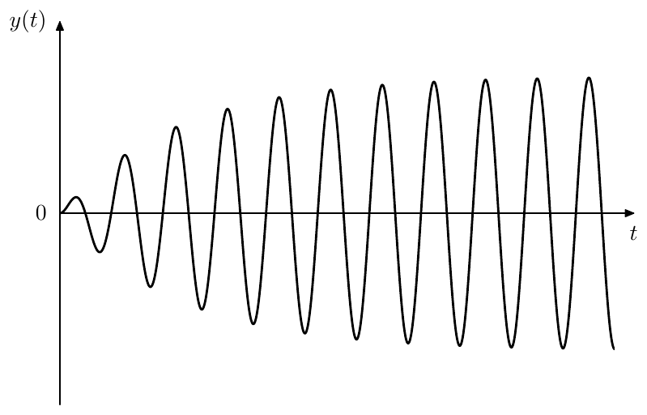

*Figure 4.27: Initial suppression of the steady-state signal at $\omega = \omega_c\sqrt{1-R^2}$ by the transient response.*

### Selfoscillation

At $R = 0$ the transient response oscillates at a constant amplitude, the frequency of the
oscillation being $\omega_c$ and coinciding with the infinitely high peak of the amplitude
response. Thus, if in the absence of the input signal the system is somehow in a non-zero
state, it will stay in this state forever, producing a sinusoid of frequency $\omega_c$. Such
state of oscillating without an input signal is referred to as *selfoscillation*.

At $R < 0$ the transient response turns into an infinitely growing signal, while the
oscillation frequency becomes lower than $\omega_c$ according to (4.36). In nonlinear filters
at $-1 < R < 0$ the growing amplitude of the oscillating transient response will be limited by
the saturation, which thereby prevents the filter from exploding. In either case, apparently it
is the transient response which is responsible for the selfoscillation of the filter.

We can therefore refer to $-1 < R \leq 0$ as the selfoscillation range of the filter. The
boundary $R = 0$ at which the selfoscillation appears may be referred to as *selfoscillation
point*.[^17]

At the selfoscillation point the poles of the system are located right on the imaginary axis
and we can "hit" them with an input sinusoidal signal of frequency $\omega_c$. Since
$H(\pm j\omega_c) = \infty$, the steady-state response $H(s)X(s)e^{st}$ becomes infinite too and
we need a different choice of the steady-state response signal.

A real sinusoidal signal of frequency $\omega_c$ consists of two complex sinusoidal signals of
frequencies $\pm\omega_c$. Each of these two signals hits the respective complex pole of the
system at $p_{1,2} = \pm j\omega_c$. As we should recall from the discussion in Section 2.15,
when a system pole $p$ is hit by an input $e^{pt}$, the output of the system consists of a
linear combination of partials $e^{pt}$ and $te^{pt}$, where we cannot unambiguously select the
steady-state response part. From two conjugate poles $p_1$ and $p_2$ we'll get a linear
combination of $e^{p_1 t}$ and $te^{p_1 t}$ and another one of $e^{p_2 t}$ and $te^{p_2 t}$.
After these signals are further combined by (4.32) we'll get a real signal of the form

$$
y(t) = a_1\cdot\cos(\omega_c t+\varphi_1) + a_2\cdot t\cos(\omega_c t+\varphi_2)
$$

Thus, the output signal is a sinusoid of frequency $\omega_c$ with the amplitude asymptotically
growing as a linear function of time.[^18] Clearly, this is a marginal case between the
sinusoidal output stabilizing with time if $R > 0$, as e.g. shown in Fig. 4.27, and
exponentially exploding if $R < 0$.

### Coinciding poles

A special situation occurs if $R = \pm 1$ and thus $p_1 = p_2$. The denominator $p_1-p_2$
therefore turns to zero, but we can treat this as a limiting case of $R \to \pm 1$. Let
$p_{1,2} = p \pm \Delta$ (where $p_{1,2} \to p$ and $\Delta \to 0$). Noticing that

$$
G_1(s) \to \frac{-p}{s-p} \qquad G_2(s) \to \frac{-p}{s-p}
$$

we can replace $G_n(s)$ in (4.34) with $-p/(s-p)$ before taking the limit:

$$
\begin{aligned}
y_t(t) &= \frac{\dot y(0)-p_2\left(y(0)-\dfrac{-p}{s-p}x(0)\right)}{p_1-p_2}\cdot e^{p_1 t} - \frac{\dot y(0)-p_1\left(y(0)-\dfrac{-p}{s-p}x(0)\right)}{p_1-p_2}\cdot e^{p_2 t} = \\
&= \dot y(0)\cdot\frac{e^{p_1 t}-e^{p_2 t}}{p_1-p_2} + \left(y(0)-\frac{-p}{s-p}x(0)\right)\cdot\frac{-p_2 e^{p_1 t}+p_1 e^{p_2 t}}{p_1-p_2}
\end{aligned}
\tag{4.37}
$$

In the first term of (4.37) we have

$$
\begin{aligned}
\frac{e^{p_1 t}-e^{p_2 t}}{p_1-p_2} &= \frac{e^{\Delta t}-e^{-\Delta t}}{2\Delta}\cdot e^{pt} = \\
&= \frac{e^{\Delta t}-e^{-\Delta t}}{2\Delta t}\cdot te^{pt} = \frac{\sinh\Delta t}{\Delta t}\cdot te^{pt}\to te^{pt} \qquad (\Delta \to 0)
\end{aligned}
$$

and in the second term respectively

$$
\begin{aligned}
\frac{-p_2e^{p_1t}+p_1e^{p_2t}}{p_1-p_2} &= \frac{-(p-\Delta)e^{\Delta t}+(p+\Delta)e^{-\Delta t}}{2\Delta}\cdot e^{pt} = \\
&= -p\frac{e^{\Delta t}-e^{-\Delta t}}{2\Delta}\cdot e^{pt} + \Delta\frac{e^{\Delta t}+e^{-\Delta t}}{2\Delta}\cdot e^{pt} = \\
&= -p\frac{\sinh\Delta t}{\Delta t}\cdot te^{pt} + \cosh\Delta t\cdot e^{pt}\to -pte^{pt}+e^{pt} \qquad (\Delta \to 0)
\end{aligned}
$$

and (4.37) at $\Delta = 0$ can be rewritten as

$$
\begin{aligned}
y_t(t) &= \dot y(0)\cdot te^{pt} + \left(y(0)-\frac{-p}{s-p}x(0)\right)\cdot(-pte^{pt}+e^{pt}) = \\
&= \left(y(0)-\frac{-p}{s-p}x(0)\right)\cdot e^{pt} + \left(\dot y(0)-p\cdot\left(y(0)-\frac{-p}{s-p}x(0)\right)\right)\cdot te^{pt}
\end{aligned}
$$

Thus, in the case of $p_1 = p_2$ the terms contained in the transient response are having the
form $e^{pt}$ or $te^{pt}$.

The change (4.35) in the inverse Laplace transform in the steady-state response as we take the
integral to the left or to the right of the poles of $H(s)$ respectively becomes

$$
\begin{aligned}
\operatorname{Res}_{s=p+\Delta} H(s)X(s)e^{st} + \operatorname{Res}_{s=p-\Delta} H(s)X(s)e^{st} &\sim \\
&\sim \frac{p^2}{2\Delta}\left(X(p+\Delta)e^{(p+\Delta)t}-X(p-\Delta)e^{(p-\Delta)t}\right) = \\
&= p^2\frac{X(p+\Delta)e^{(p+\Delta)t}-X(p-\Delta)e^{(p-\Delta)t}}{2\Delta} \to \\
&\to p^2\frac{X'(p)e^{pt}+X(p)te^{pt}+X'(p)e^{pt}+X(p)te^{pt}}{2} = \\
&= p^2\left(X'(p)e^{pt}+X(p)te^{pt}\right) \qquad (\Delta \to 0)
\end{aligned}
$$

where we have used l'Hôpital's rule.[^19] Thus, the change is again solely in the amplitudes of
the transient response partials.

It is important to realize that the different form of the transient response components at
$R = \pm 1$ doesn't imply that the filter behavior is abruptly switched at this point. The
switching of the mathematical expression is solely due to the limitations of the mathematical
notation, but doesn't correspond to a jump in any of the signals.

The same result could have been obtained formally by introducing the helper variables $u_1$ and
$u_2$ differently:[^20]

$$
\begin{aligned}
u_1 &= \dot y - py \\
u_2 &= y
\end{aligned}
$$

(where $p = p_1 = p_2$) thereby obtaining the equations

$$
\begin{aligned}
\dot u_1 - pu_1 &= p^2 x \\
\dot u_2 - pu_2 &= u_1
\end{aligned}
$$

which can be solved using 1-pole techniques. Since $u_2$ is the input signal for $u_1$ we have a
serial connection of 1-poles, building up a Jordan chain. As we should remember from the
discussion of Jordan chains in Section 2.15, the transient response will consist of the
partials of the form $e^{pt}$ and $te^{pt}$. However, due to a completely different
substitution of variables, we wouldn't have known, whether the output is changing in a
continuous way as $R$ crosses the point $R = 1$. On the other hand, obtaining the result as a
limiting case, as we did earlier, gives an answer to that question.

### Bandpass and highpass

Notice that (4.25) can be applied separately to steady-state and transient responses (in the
sense that the results will still give correct separation of the signal into the steady-state
and transient parts). Indeed, e.g. applying (4.25a) to a complex exponential
$y_{\text{LP}} = Y(s)e^{st}$ we obtain

$$
\dot y_{\text{LP}}/\omega_c = sY(s)e^{st}/\omega_c = y_{\text{LP}}\cdot s/\omega_c
$$

which matches $H_{\text{BP}}(s) = s/\omega_c \cdot H_{\text{LP}}(s)$. Therefore
$\dot y_{\text{LP}}/\omega_c$, when applied to a lowpass steady-state response
$y_{\text{LPs}}(t)$, will give bandpass steady-state response, etc.

This means that the transient response for the bandpass and highpass signals can be obtained by
differentiating the lowpass transient response according to (4.25), resulting in a sum of the
same kind of exponential terms $e^{p_1 t}$ and $e^{p_2 t}$ (or $e^{pt}$ and $te^{pt}$ in case
$p_1 = p_2$). We won't write the resulting expressions explicitly here.

## Summary

The state-variable filter has the structure shown in Fig. 4.1. Contrarily to the ladder filter,
the resonance strength in the SVF is controlled by controlling the damping signal. The
multimode outputs have the transfer functions

$$
\begin{aligned}
H_{\text{HP}}(s) &= \frac{s^2}{s^2+2Rs+1} \\
H_{\text{BP}}(s) &= \frac{s}{s^2+2Rs+1} \\
H_{\text{LP}}(s) &= \frac{1}{s^2+2Rs+1}
\end{aligned}
$$

and can be combined to build further filter types.

[^1]: A more correct term, used in theory of harmonic oscillations, is
    *damping ratio*, where the commonly used notation for the same
    parameter is $\zeta$.

[^2]: The "resonance" control for the SVF filter can be introduced in a
    number of different ways. One common approach is to use the parameter
    $Q = 1/2R$, however this doesn't allow to go easily into the
    selfoscillation range in the nonlinear versions of this filter, also
    the math is generally more elegant in terms of R than in terms of Q.
    Another option is using $r = 1-R$, which differs from the resonance
    control parameter $k$ of SKF/TSK filters (discussed in Section 5.8)
    just by a factor of 2, the selfoscillation occuring at $r = 1$. Other,
    more sophisticated mappings, can be used for a "more natural feel" of
    the resonance control.

[^3]: The selfoscillating state at R = 0 is a marginally stable state. As
    mentioned earlier, due to the noise present in the system (such as
    numerical errors in a digital implementation), we shouldn't expect to
    be able to exactly hold a system in a marginally stable state. In
    order to have reliable selfoscillation one usually needs to introduce
    nonlinear elements into the system. E.g. by introducing the
    saturating behavior one would be able to lower R below 0, thereby
    increasing the resonance even further, without making the filter
    explode. So, while selfoscillation formally appears at R = 0, it is
    becoming reliable at R < 0, given that nonlinearities prevent the
    filter from exploding.

[^4]: Thereby the differential equation becomes formally equivalent to an
    SVF, but there still is an essential difference. The state of a
    spring-mass system consists of a position $y(t)$ and a velocity
    $\dot y(t)$. Changes to the system parameters will therefore directly
    change the kinetic and potential energies, which can result in a
    sudden increase or reduction of the amplitude of the swinging. In
    comparison, in the SVF the system state consists of the "lowpass"
    integrator's state $y(t)$ and "bandpass" integrator's state, which
    according to (4.1) is $\dot y(t)/\omega_c$. In this case changes to
    the filter parameters will affect the filter's output in a more
    gradual way. Particulary, according to (2.29), changes to the cutoff
    will not affect the output amplitude at all.

[^5]: Later we will discuss the transient response of the SVF and the
    respective effects of the poles position on the stability.

[^6]: Actually, the poles are mutually reciprocal at any R (since their
    product should be equal to the constant term of the denominator). For
    complex poles the reciprocal property manifests itself as conjugate
    symmetry of the poles, since the poles are lying on the unit circle
    and the reciprocation does not change their absolute magnitude.

[^7]: Of course the same decomposition is formally possible for complex
    poles, but a 1-pole filter with a complex pole cannot be implemented as a
    real system.

[^8]: Apparently, (4.12) defines only the denominator of the SVF's transfer
    function. The numerator would need to be computed separately.

[^9]: Apparently (4.11) can be used all the time, regardless of whether the
    poles are complex or real. It's just that in case of complex poles we
    have simpler and more intuitive formulas (4.13).

[^10]: The state-variable filter has two feedback paths sharing a common
    path segment. In order to obtain a single feedback equation rather than
    an equation system we should pick a signal on this common path as the
    unknown variable.

[^11]: This can be confirmed in a more rigorous manner by the fact (which we
    establish in Section 4.6) that the frequency response of the 2-pole
    normalized bandpass filter can be obtained from the frequency response of
    the 1-pole lowpass filter by a frequency axis mapping.

[^12]: We are using $\omega_1$ and $\omega_1'$ instead of previously used
    $\omega_c'$ and $\omega_c$ notation for the respective point, since we are
    going to need $\omega_c$ to denote the substitution result's cutoff.

[^13]: For a differentiator, a similar substitution structure (containing an
    integrator and a differentiator) is trivially obtained from the
    right-hand side of (4.16).

[^14]: Notice that BS here stands for "bandstop" and not for "band-shelving".
    The alternative name for the substitution could have been "LP to notch",
    but "LP to bandstop" seems to be commonly used, so we'll stick to that
    one.

[^15]: If $a_0 = 0$, this means that either one or both of the poles of
    $H(s)$ are at $s = 0$. If $a_0 < 0$ this means that we are having two real
    poles of opposite signs. Both situations correspond to pretty exotic
    unstable cases.

[^16]: The substitution (4.27) can be obtained, knowing in advance the
    transient response form $y = C_1e^{p_1t} + C_2e^{p_2t}$ and expressing
    $e^{p_nt}$ via $y$ and $\dot y$. Alternatively, it can be found by
    diagonalizing the state-space form.

[^17]: The other boundary $R = -1$ is hardly ever being reached, therefore we won't introduce a
    special name for it.

[^18]: Notice that as the ratio of the amplitudes of the two sinusoids changes, the phase of
    their sum (which in principle is a sinusoid of the same frequency but of a different
    amplitude and phase) will slightly drift.

[^19]: More rigorously speaking, we have used l'Hôpital's rule as a short way to express the
    following: we expand $X(p\pm\Delta)$ and $e^{(p\pm\Delta)t}$ into Taylor series with respect
    to $\Delta$, followed by expanding the respective products and cancelling the terms
    containing $\Delta$ with the denominator. One also could expand just $X(p\pm\Delta)$ into
    Taylor series with respect to $\Delta$ and then convert $e^{(p\pm\Delta)t}$ into sinh and
    cosh in the same way as in the transient response derivation.

[^20]: This corresponds to using Jordan normal form in the state space representation.
