# Chapter 5: Ladder filter

In this chapter we are going to discuss the most classical analog filter
model: the transistor ladder filter. The main idea of this structure, which is
to create resonance by means of a feedback loop, is encountered in many other
filter designs, some of which we are also going to discuss. We will be
referring to the class of such filters as simply *ladder filters*.[^1]

## 5.1 Analog model

The most classical example of a ladder filter is transistor ladder filter,
which implements a 4-pole lowpass structure shown in Fig. 5.1.[^2] The
structure in Fig. 5.1 is not limited to transistor-based analog
implementations. Particularly, there are many implementations of the same
structure based on OTAs (operational transconductance amplifiers). The
difference between transistor- and OTA-based ladders is, however, lying in the
nonlinear behavior, which we are not touching at this point yet. The linear
aspects of both are identical.

The LP$_1$ blocks denote four identical (same cutoff) 1-pole lowpass filters
(Fig. 2.2). The $k$ coefficient controls the amount of negative feedback,
which creates resonance in the filter. Typically $k \geq 0$, although $k < 0$
is also sometimes used.

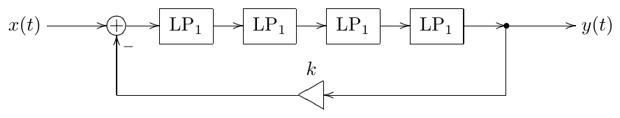

*Figure 5.1: Transistor (4-pole lowpass) ladder filter.*

Let
$$
H_1(s) = \frac{1}{1+s}
$$
be the 1-pole lowpass transfer function. Assuming complex exponential $x$ and
$y$ we write
$$
y = H_1^4(s) \cdot (x - ky)
$$
from where
$$
y(1 + kH_1^4(s)) = H_1^4(s) \cdot x
$$
and the transfer function of the ladder filter is
$$
H(s) = \frac{y}{x} = \frac{H_1^4(s)}{1 + kH_1^4(s)}
= \frac{\frac{1}{(1+s)^4}}{1 + k\frac{1}{(1+s)^4}} = \frac{1}{k + (1+s)^4} \tag{5.1}
$$

At $k = 0$ the filter behaves as 4 serially connected 1-pole lowpass filters.

The poles of the filter are respectively found from
$$
k + (1+s)^4 = 0
$$
giving
$$
s = -1 + (-k)^{1/4}
$$
where the raising to the 1/4th power is understood in the complex sense,
therefore giving 4 different values:
$$
s = -1 + \frac{\pm1 \pm j}{\sqrt2}k^{1/4} \qquad (k \geq 0) \tag{5.2}
$$
(this time $k^{1/4}$ is understood in the real sense). Thus there are 4-poles
and we can also refer to this filter as a *4-pole lowpass ladder* filter.

At $k = 0$ all poles are located at $s = -1$, as $k$ grows they move apart in
4 straight lines, all going at "$45^\circ$ angles" (Fig. 5.2). As $k$ grows from 0 to
4 the two of the poles (at $s = -1 + \frac{1 \pm j}{\sqrt2}k^{1/4}$) are
moving towards the imaginary axis, producing a resonance peak in the
amplitude response (Fig. 5.3). At $k = 4$ they hit the imaginary axis:
$$
\operatorname{Re}\left(-1 + \frac{1 \pm j}{\sqrt2}4^{1/4}\right) = 0
$$
and the filter becomes unstable.[^3]

In Fig. 5.3 one could notice that, as the resonance increases, the filter
gain at low frequencies begins to drop. Indeed, substituting $s = 0$ into
(5.1) we obtain
$$
H(0) = \frac{1}{1+k}
$$
This is a general issue with ladder filter designs.

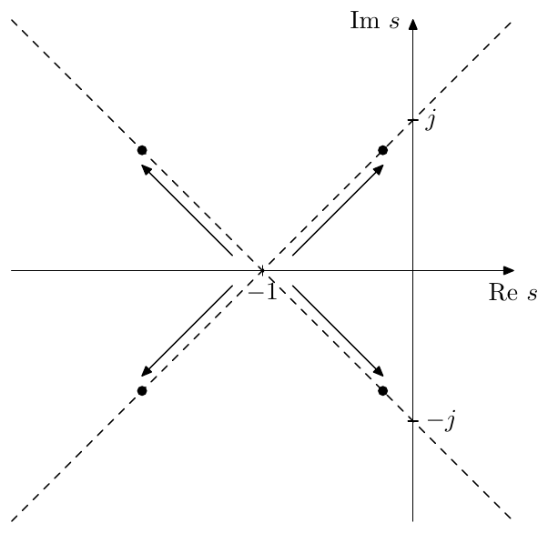

*Figure 5.2: Poles of the 4-pole lowpass ladder filter.*

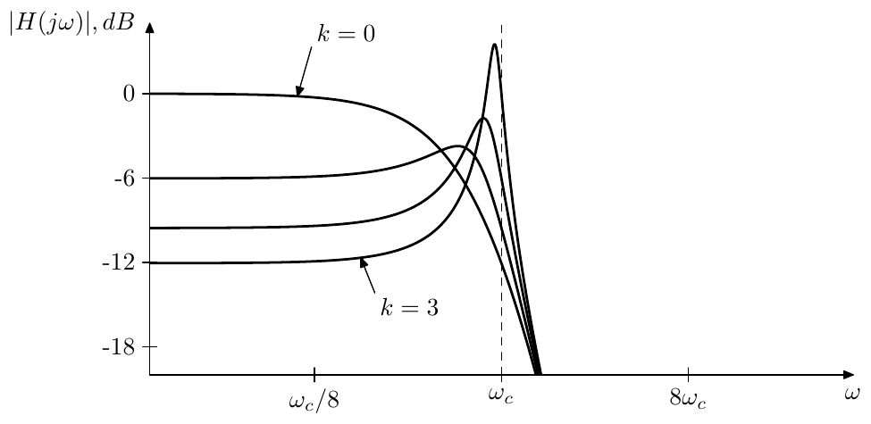

*Figure 5.3: Amplitude response of the 4-pole lowpass ladder filter for various $k$.*

## 5.2 Feedback and resonance

Before we continue with discussing more practical aspects of the ladder
filter, we'd like to make one important observation considering the resonance
peaks created by the ladder filter feedback.

In Fig. 5.3 we can see that, similarly to the 2-pole case, the resonance
frequency is approaching the filter cutoff frequency as the filter approaches
selfoscillation at $k = 4$. This is a manifestation of a more general
principle concerning ladder filters as such. Consider a general ladder filter
in Fig. 5.4, where $G(s)$ denotes a more or less arbitrary structure, whose
transfer function is $G(s)$. Notice that the feedback in Fig. 5.4 is not
inverted.

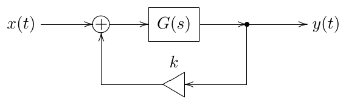

*Figure 5.4: Structure of a generic ladder filter.*

The transfer function of the entire structure is therefore
$$
H(s) = \frac{G(s)}{1 - kG(s)} = \frac{1}{G^{-1}(s) - k} \tag{5.3}
$$
and the poles are defined by the equation
$$
G^{-1}(s) = k \tag{5.4}
$$
That is at $k = 0$ the poles of $H(s)$ are the zeros of $G^{-1}(s)$ (the
latter obviously simply being the poles of $G(s)$). As $k$ begins to deviate
from zero, the solutions of (5.4) will move in the $s$-plane, usually in a
continuous fashion. E.g. for the 4-pole lowpass ladder (Fig. 5.1) we had
$G^{-1}(s) = (s+1)^4$ and (5.4) takes the form $(s+1)^4 = -k$, where we take
$-k$ instead of $k$ because of the inverted feedback in Fig. 5.1.

The value of $k$ at which the filter starts to selfoscillate should
correspond to some of the poles being located on the imaginary axis. At this
moment the infinitely high resonance peak in the amplitude response is
occurring exactly at these pole positions. Denoting a purely imaginary pole
position as $j\omega$, we rewrite (5.4) for such poles as
$$
G^{-1}(j\omega) = k
$$
or
$$
kG(j\omega) = 1 \tag{5.5}
$$
We can refer to (5.5) as the *selfoscillation equation for a feedback loop*.
This equation implies that selfoscillation appears at the moment when the
total frequency response across the feedback loop $kG(j\omega)$ exactly
equals 1 at some frequency $\omega$. That is the total amplitude gain must be
1, and the total phase shift must be $0^\circ$.

This is actually a pretty remarkable result. Of course it is quite intuitive
that selfoscillation tends to occur at frequencies where the feedback signal
doesn't cancel the input signal, but rather boosts it. And such boosting
tends to be strongest at frequencies where we have a $0^\circ$ total phase shift
across the feedback loop. However, what is quite counterintuitive, is that
selfoscillation can appear (as $k$ is reaching the respective threshold
value) *only* at such frequencies.[^4]

Therefore for $k > 0$ the selfoscillation appears at frequencies where the
phase response of $G(s)$ is $0^\circ$. For $k < 0$ the selfoscillation appears at
frequencies where the phase response of $G(s)$ is $180^\circ$. The respective
value of $k$ can be found from (5.5) giving
$$
k = \frac{1}{G(j\omega)} \tag{5.6}
$$
or, rewriting (5.6) in terms of the amplitude response of $G(s)$:
$$
k = \pm\frac{1}{|G(j\omega)|} \tag{5.7}
$$
where we take the plus sign if the phase response of $G(s)$ at $\omega$ is
$0^\circ$ and the minus sign if the phase response of $G(s)$ at $\omega$ is
$180^\circ$.

The just discussed effects are the reason that we used negative feedback in
the 4-pole lowpass ladder filter. We want the resonance to occur at the
filter's cutoff. The phase response of a single 1-pole lowpass at the cutoff
frequency is $-45^\circ$, respectively the phase response of a chain of four
1-poles is $-180^\circ$, exactly what we need for the resonance peak, if we use
negative feedback.

At the same time, the amplitude response of a 1-pole lowpass at the cutoff is
$|1/(1+j)| = 1/\sqrt2$, respectively the amplitude response of a chain of
four 1-poles is $(1/\sqrt2)^4 = 1/4$. According to (5.7), the infinite
resonance is attained at $k = 1/(1/4) = 4$.

At $\omega = 0$ a chain of four 1-pole lowpasses will have a phase shift of
$0^\circ$, while the amplitude response at $\omega = 0$ is 1. Therefore, in Fig.
5.1 the "selfoscillation" at $\omega = 0$ will occur at $k = -1$. However the
amplitude response peak at $\omega = 0$ hardly can count as resonance.

## 5.3 Digital model

A naive digital implementation of the ladder filter shouldn't pose any
problems. We will therefore immediately skip to the TPT approach.

Recalling the instantaneous response of a single 1-pole lowpass filter
(3.29), we can construct the instantaneous response of a serial connection of
four of such filters. Indeed, let's denote the instantaneous responses of the
respective 1-poles as $f_n(\xi) = g\xi + s_n$ (obviously, the coefficient $g$
is identical for all four, whereas $s_n$ depends on the filter state and
therefore cannot be assumed identical). Combining two such filters in series
we have
$$
f_2(f_1(\xi)) = g(g\xi + s_1) + s_2 = g^2\xi + gs_1 + s_2
$$
Adding the third one:
$$
f_3(f_2(f_1(\xi))) = g(g^2\xi + gs_1 + s_2) + s_3 = g^3\xi + g^2s_1 + gs_2 + s_3
$$
and the fourth one:
$$
\begin{aligned}
f_4(f_3(f_2(f_1(\xi)))) &= g(g^3\xi + g^2s_1 + gs_2 + s_3) = \\
&= g^4\xi + g^3s_1 + g^2s_2 + gs_3 + s_4 = G\xi + S
\end{aligned}
$$
where
$$
G = g^4
$$
$$
S = g^3s_1 + g^2s_2 + gs_3 + s_4
$$
Using the obtained instantaneous response $G\xi + S$ of the series of 4
1-poles, we can redraw the ladder filter structure as in Fig. 5.5.

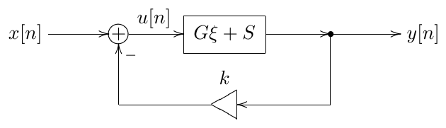

*Figure 5.5: TPT 4-pole ladder filter in the instantaneous response form.*

Rather than solving for $y$, let's solve for the signal $u$ at the feedback
point. From Fig. 5.5 we obtain
$$
u = x - ky = x - k(Gu + S)
$$
from where
$$
u = \frac{x - kS}{1 + kG} \tag{5.8}
$$
We can then use the obtained value of $u$ to process the 1-pole lowpasses one
after the other, updating their state, and computing $y[n]$ as the output of
the fourth lowpass.

Apparently the total instantaneous gain of the zero-delay feedback loop in
Fig. 5.5 and in (5.8) is $-kG$. As we should recall from the discussion of
1-pole lowpass filters, $0 < g < 1$ for positive cutoff settings.
Respectively $0 < G < 1$ and the filter doesn't become instantaneously
unstable provided $k \geq -1$.

## 5.4 Feedback shaping

We have observed that at high resonance settings the amplitude gain of the
filter at low frequencies drops (Fig. 5.3). An obvious way to fix this
problem would be e.g. to boost the input signal by the $(1+k)$ factor.[^5]
However there's another way to address the same issue. We could "kill" the
feedback for the low frequencies only by introducing a highpass filter into
the feedback path (Fig. 5.6). In the simplest case this could be a 1-pole
highpass.

The cutoff of the highpass filter can be static or vary along with the
cutoff of the lowpasses. The static version has a nice feature that it kills
the resonance effect at low frequencies regardless of the master cutoff
setting, which may be desirable if the resonance at low frequencies is
considered rather unpleasant (Fig. 5.7).

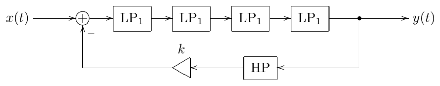

*Figure 5.6: Transistor ladder filter with a highpass in the feedback.*

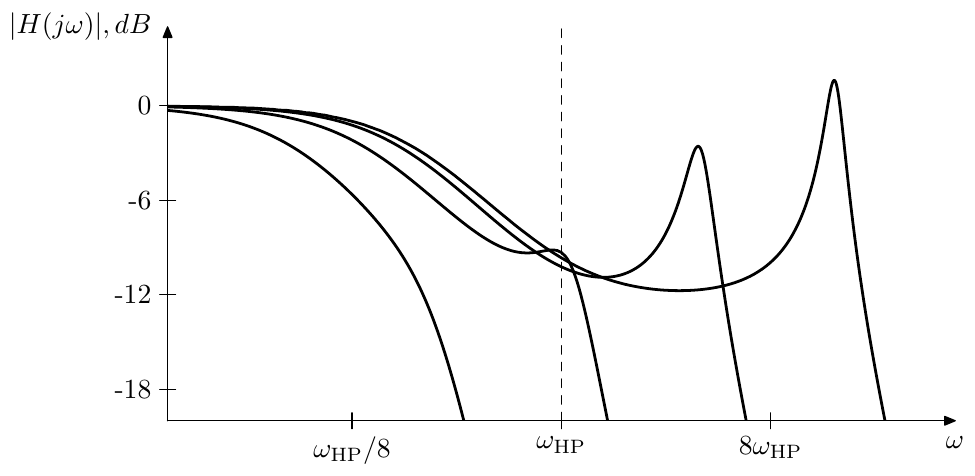

*Figure 5.7: Amplitude response of the ladder filter with a static-cutoff
highpass in the feedback for various lowpass cutoffs.*

In principle one can also use other filter types in the feedback shaping. One
has to be careful though, since this changes the total phase and amplitude
responses of the feedback path, thus the frequency of the resonance peak and
the value of $k$ at which selfoscillation is reached may be changed. E.g.,
quite counterintuitively, inserting a 1-pole lowpass into the feedback path
can destabilize an otherwise stable filter.

In order to establish and analyse the latter fact mathematically, we'd need
to find the total amplitude response across the feedback loop at the point
where the total phase shift is $180^\circ$. Let $H_1(s) = 1/(1+s)$ be the
underlying 1-pole lowpass of the ladder filter and let
$H_f(s) = 1/(1+s/\omega_{cf})$ be the lowpass in the feedback, with a
generally speaking different cutoff $\omega_{cf}$. The $180^\circ$ point is found
from the equation
$$
\begin{aligned}
4\arg H_1(j\omega) + \arg H_f(j\omega)
&= 4\arg\frac{1}{1+j\omega} + \arg\frac{1}{1+j\omega/\omega_{cf}} = \\
&= -4\arctan\omega - \arctan\frac{\omega}{\omega_{cf}} = -\pi
\end{aligned} \tag{5.9}
$$
where we have used (2.8). The equation (5.9) looks a bit daunting, if having
an analytic solution at all. Fortunately, we don't actually need to know the
frequency of the $180^\circ$ point, it would suffice to know the respective
amplitude responses.

Let $\varphi_1(\omega)$ be the negated phase response of $H_1(s)$:
$$
\varphi_1(\omega) = -\arg H_1(j\omega) = \arctan\omega > 0 \qquad \forall\omega
$$
Expressing $\omega$ as a function of $\varphi_1$ we have $\omega =
\tan\varphi_1$. Respectively, expressing the amplitude response as a function
of the (negated) phase response we have
$$
A_1 = |H_1(j\omega)| = \frac{1}{\sqrt{1+\omega^2}}
= \frac{1}{\sqrt{1+\tan^2\varphi_1}} = \cos\varphi_1 \tag{5.10}
$$
Thus, the total amplitude response of the four 1-poles in the feedforward
path of the ladder filter is
$$
A_1^4(\omega) = \frac{1}{(1+\varphi_1^2)^2}
$$
and the total phase response of the feedforward path is $4\varphi_1$.

Since (5.10) is cutoff-independent, it also holds for $H_f(s)$:
$$
A_f = \cos\varphi_f
$$
where $A_f = |H_f(j\omega)|$, $\varphi_f = -\arg H_f(j\omega)$. Now let
$\omega_0$ be the (unknown to us) solution of (5.9), that is the total phase
shift at $\omega_0$ is $180^\circ$. In terms of the just introduced functions
$\varphi_1(\omega)$ and $\varphi_f(\omega)$ equation (5.9) can be rewritten as
$$
4\varphi_1(\omega_0) + \varphi_f(\omega_0) = \pi \tag{5.11}
$$
Since $\varphi_f(\omega) > 0\ \forall\omega$, the $180^\circ$ phase shift is
achieved earlier than without the feedback filter, that is $\omega_0 < 1$
(whatever the value of $\omega_{cf}$ is).

Computing the total amplitude response of all five 1-pole lowpasses at
$\omega_0$ we have
$$
A_1^4(\omega_0) \cdot A_f(\omega_0) = \cos^4\varphi_1(\omega_0) \cdot \cos\varphi_f(\omega_0)
= \cos^4\left(\frac{\pi}{4} - \frac{\varphi_f(\omega_0)}{4}\right) \cdot \cos\varphi_f(\omega_0)
$$
Considering only the first factor we have
$$
\cos^4\left(\frac{\pi}{4} - \frac{\varphi_f}{4}\right)
= \left(\frac{1 + \cos\left(\frac{\pi}{2} - \frac{\varphi_f}{2}\right)}{2}\right)^2
= \left(\frac{1 + \sin\frac{\varphi_f}{2}}{2}\right)^2
$$
(where we dropped the argument $\omega_0$, understanding it implicitly).
Respectively
$$
A_1^4 \cdot A_f = \frac{1}{4} \cdot \left(1 + \sin\frac{\varphi_f}{2}\right)^2 \cdot \cos\varphi_f \qquad (\omega = \omega_0) \tag{5.12}
$$
Fig. 5.8 contains the graph of (5.12). The interpretation of this graph is
like follows. Suppose the feedback lowpass's cutoff $\omega_{cf}$ is very
large ($\omega_{cf} \to +\infty$). In the limit the feedback lowpass has no
effct and
$$
\omega_0 = 1 \quad \varphi_f(\omega_0) = 0 \quad A_f(\omega_0) = 1
\quad A_1^4(\omega_0)A_f(\omega_0) = \frac{1}{4} \qquad (\text{for } \omega_{cf} = +\infty)
$$
As we begin to lower $\omega_{cf}$ back from the infinity, the value of
$\varphi_f(\omega_0)$ grows from zero into the positive value range. The
graph in Fig. 5.8 plots the total amplitude response of the five 1-pole
lowpasses in the feedback loop against the growing $\varphi_f(\omega_0)$. We
see that the amplitude response grows for quite a while. As long as it is
above 1/4, the filter will explode at $k = 4$. The zero amplitude response at
$\varphi_f = \pi/2$ corresponds to $\omega_{cf} = 0$, where the extra lowpass
is fully closed, thus the entire feedback loop is muted.

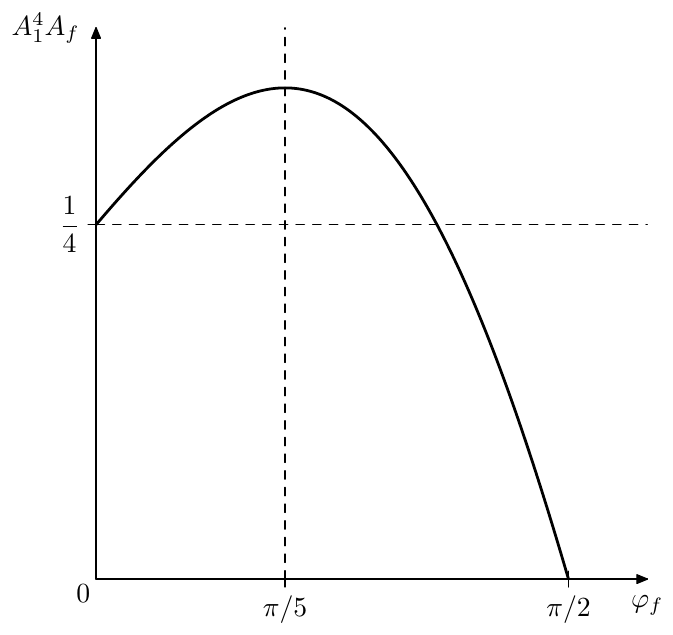

*Figure 5.8: Total amplitude response of the four feedforward lowpass 1-poles
plus the feedback lowpass 1-pole at the $180^\circ$ phase shift point, plotted
against the phase shift by the feedback 1-pole.*

At $\omega_{cf} = 1$ (equal cutoffs of all 1-poles) from (5.11) we have
$\varphi_f(\omega_0) = \varphi_1(\omega_0) = \pi/5$. In Fig. 5.8 one can see
that this is the "most unstable" situation among all possible $\omega_{cf}$.

In comparison, if we had a 1-pole highpass in the feedback, then we would
have $\arg H_f(j\omega) > 0$ and respectively $\varphi_f(\omega) < 0\
\forall\omega$. Therefore the $$180^\circ$$ point would be shifted to the right:
$\omega_0 > 1$. Therefore $A_1^4(\omega_0) < A_1^4(1) < 1/4$, while
$A_f(\omega) < 1\ \forall\omega$, thus the total amplitude response
$A_1^4A_f$ at the $180^\circ$ point would decrease and the filter won't become
"more unstable" than it was before the introduction of the extra highpass
filter.

## 5.5 Multimode ladder filter

**Warning!** *The multimode functionality of the ladder filter is a somewhat
special feature. There are more straightforward ways to build bandpass and
highpass ladders, discussed later in this chapter.*

By picking up intermediate signals of the ladder filter as in Fig. 5.9 we
obtain the multimode version of this filter.

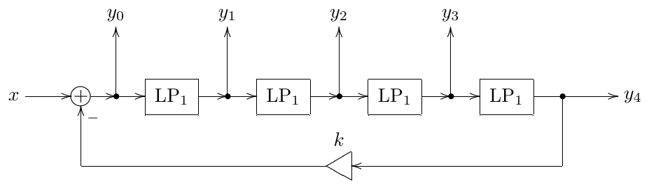

*Figure 5.9: Multimode ladder filter.*

We then can use linear combinations of signals $y_n$ to produce various
kinds of filtered signal.[^6]

Suppose $k = 0$. Apparently, in this case, the respective transfer functions
associated with each of the $y_n$ outputs are
$$
H_n(s) = \frac{1}{(1+s)^n} \qquad (n = 0, \ldots, 4) \tag{5.13}
$$
If $k \neq 0$ then from
$$
H_4(s) = \frac{1}{k + (1+s)^4}
$$
using the obvious relationship $H_{n+1}(s) = H_n(s)/(s+1)$ we obtain
$$
H_n(s) = \frac{(1+s)^{4-n}}{k + (1+s)^4} \tag{5.14}
$$

### 4-pole highpass mode

Considering that the 4th order lowpass transfer function (under the
assumption $k = 0$) is built as a product of four 1st order lowpass transfer
functions $1/(1+s)$
$$
H_{\mathrm{LP}}(s) = \frac{1}{(1+s)^4}
$$
we might decide to build the 4th order highpass transfer function as a
product of four 1st order highpass transfer functions $s/(1+s)$:
$$
H_{\mathrm{HP}}(s) = \frac{s^4}{(1+s)^4}
$$
Let's attempt to build $H_{\mathrm{HP}}(s)$ as a linear combination of
$H_n(s)$. Apparently, a linear combination of $H_n(s)$ must have the
denominator $k + (1+s)^4$, so let's instead construct
$$
H_{\mathrm{HP}}(s) = \frac{s^4}{k + (1+s)^4} \tag{5.15}
$$
which at $k = 0$ will turn into $s^4/(1+s)^4$. We also have
$H_{\mathrm{HP}}(\infty) = 1$ while the four zeros at $s = 0$ provide a
24dB/oct rolloff at $\omega \to 0$, thus we are still having a more or less
reasonable highpass. In order to express $H_{\mathrm{HP}}(s)$ as a sum of the
modes we write
$$
\frac{s^4}{k + (1+s)^4} = \frac{a_0(1+s)^4 + a_1(1+s)^3 + a_2(1+s)^2 + a_3(1+s) + a_4}{k + (1+s)^4}
$$

that is

$$
s^4 = a_0(1+s)^4 + a_1(1+s)^3 + a_2(1+s)^2 + a_3(1+s) + a_4
$$

We need to find $a_n$ from the above equation, which generally can be done by
equating the coefficients at equal powers of $s$ in the left- and right-hand
sides. However, for the specific equation that we're having here we could do
a shortcut by simply formally replacing $s+1$ by $s$ (and respectively $s$ by
$s-1$):

$$
(s-1)^4 = a_0 s^4 + a_1 s^3 + a_2 s^2 + a_3 s + a_4
$$

from where immediately

$$
a_0 = 1,\ a_1 = -4,\ a_2 = 6,\ a_3 = -4,\ a_4 = 1
$$

The amplitude response corresponding to (5.15) is plotted in Fig. 5.10.

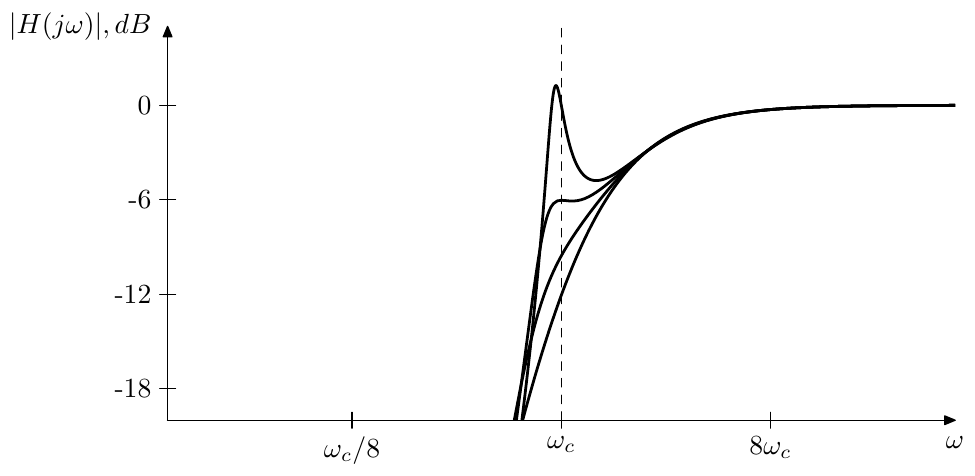

*Figure 5.10: Amplitude response of the highpass mode of the ladder filter for
various k.*

### 4-pole bandpass mode

A bandpass filter can be built as

$$
H_{BP}(s) = \frac{s^2}{k + (1+s)^4} \tag{5.16}
$$

The two zeros at $s = 0$ will provide for a $-12$dB/oct rolloff at low
frequencies and will reduce the $-24$dB/oct rolloff at high frequencies to the
same $-12$dB/oct. Notice that the phase response at the cutoff is zero:

$$
H_{BP}(j) = \frac{-1}{k + (1+j)^4} = \frac{1}{4-k}
$$

The coefficients are found from

$$
\begin{aligned}
s^2 &= a_0(1+s)^4 + a_1(1+s)^3 + a_2(1+s)^2 + a_3(1+s) + a_4 \\
(s-1)^2 &= a_0 s^4 + a_1 s^3 + a_2 s^2 + a_3 s + a_4
\end{aligned}
$$

The amplitude response corresponding to (5.16) is plotted in Fig. 5.11.

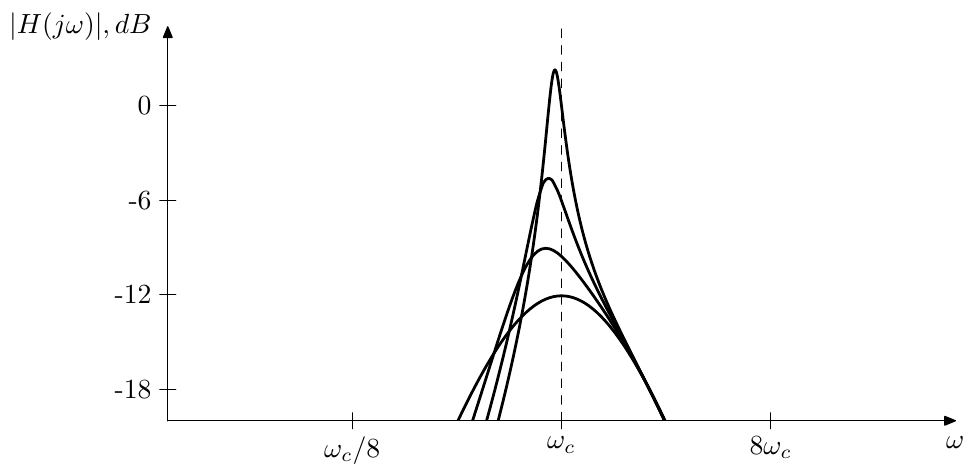

*Figure 5.11: Amplitude response of the bandpass mode of the ladder filter for
various k.*

### Lower-order modes

Recalling the transfer functions of the modal outputs $y_n$ in the absence of
the resonance (5.13), we can consider the modal signals $y_n$ and their
respective transfer functions (5.14) as a kind of "$n$-pole lowpass filters
with 4-pole resonance".

"Lower-order" highpasses can be build by considering the zero-resonance
transfer functions

$$
H_{HP}(s) = \frac{s^N}{(s+1)^N} = \frac{(s+1)^{4-N}s^N}{(s+1)^4}
$$

which for $k \neq 0$ turn into

$$
H_{HP}(s) = \frac{(s+1)^{4-N}s^N}{k + (s+1)^4}
$$

In a similar way we can build a "2-pole" bandpass

$$
H_{BP}(s) = \frac{s}{(s+1)^2} = \frac{(s+1)^2 s}{(s+1)^4} \qquad (k=0)
$$

$$
H_{BP}(s) = \frac{(s+1)^2 s}{k + (s+1)^4} \qquad (k \neq 0)
$$

### Other modes

Continuing in the same fashion we can build further modes (the transfer
functions are given for $k=0$):

| Transfer function | Mode |
|---|---|
| $\dfrac{s}{(s+1)^3}$ | 3-pole bandpass, 6/12 dB/oct |
| $\dfrac{s^2}{(s+1)^3}$ | 3-pole bandpass, 12/6 dB/oct |
| $\dfrac{(s+1)^4 + Ks^2}{(s+1)^4}$ | band-shelving |
| $\dfrac{s^4 - 1}{(s+1)^4}$ | notch |
| $\dfrac{(s^2+1)^2}{(s+1)^4}$ | notch |
| $\dfrac{(s^2+2Rs+1)^2 + (s^2-2Rs+1)^2}{2(s+1)^4}$ | 2 notches, neutral setting $R=1$ |
| $\dfrac{s^2+1}{(s+1)^4}$ | 2-pole lowpass + notch |
| $\dfrac{(1+1/s^2)s^4}{(s+1)^4}$ | 2-pole highpass + notch |
| $\dfrac{(s+1/s)s^2}{(s+1)^4}$ | 2-pole bandpass + notch |

etc. The principles are more or less similar. We are trying to attain a
desired asymptotic behavior at $\omega \to 0$ and $\omega \to +\infty$ by
having the necessary orders and coefficients of the lowest-order and
highest-order terms in the numerator. E.g. by having $s^2$ as the lowest-order
term of the numerator we ensure a 12dB/oct rolloff at $\omega \to 0$, or by
having $s^4$ as the highest-order term we ensure $H(\infty) = 1$. The notch at
$\omega = 1$ is generated by placing a zero at $s = \pm j$. The 2-notch
version is obtained by explicitly writing out the transfer function of a
4-pole multinotch described in Section 11.3.

## 5.6 HP ladder

Performing an LP to HP transformation on the lowpass ladder filter we
effectively perform it on each of the underlying 1-pole lowpasses, thus
turning them into 1-pole highpasses. Thereby we obtain a "true" highpass
ladder filter (Fig. 5.12). Obviously, the amplitude response of the ladder
highpass is symmetric to the amplitude response of the ladder lowpass
(Fig. 5.13).

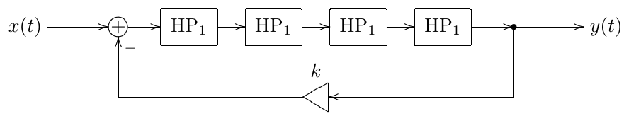

*Figure 5.12: A "true" highpass ladder filter.*

The instantaneous gain of a 1-pole highpass is complementary to the
instantaneous gain of the 1-pole lowpass:

$$
1 - \frac{g}{1+g} = \frac{1}{1+g}
$$

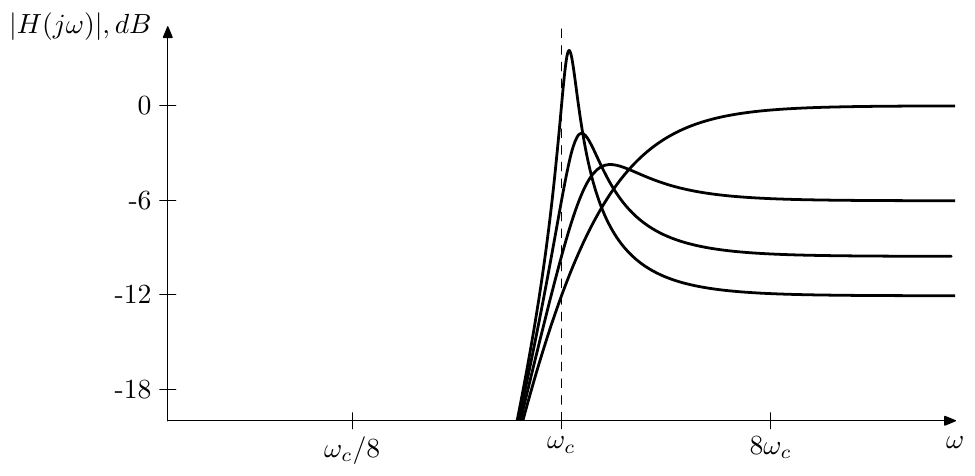

*Figure 5.13: Amplitude response of the 4-pole highpass ladder filter
for various k.*

where $g = \omega_c T/2$. Thus the instantaneous gain of a single 1-pole
highpass is varying within the range $(0,1)$ and so does the gain of the
chain of four highpasses: $0 < G < 1$. Therefore, 4-pole highpass ladder
doesn't get instantaneously unstable for $k > -1$.

## 5.7 BP ladder

In order to build a "true" 4-pole bandpass ladder, we replace only half of
the lowpasses with highpasses (it doesn't matter which two of the four
1-pole lowpasses are replaced). The total transfer function of the
feedforward path is thereby

$$
\frac{s^2}{(1+s)^4} = \frac{s}{(1+s)^2} \cdot \frac{s}{(1+s)^2}
$$

where each of the $s/(1+s)^2$ factors is built from a serial combination of a
1-pole lowpass and a 1-pole highpass:

$$
\frac{s}{(1+s)^2} = \frac{s}{1+s} \cdot \frac{1}{1+s}
$$

Apparently $s/(1+s)^2 = s/(1+2s+s^2)$ is a 2-pole bandpass with damping
$R = 1$ and a serial combination of two of them makes a 4-pole bandpass. The
frequency response of $s/(1+s)^2$ at $\omega = 1$ is $1/2$, that is there is
no phase-shift. Respectively the frequency response of $s^2/(1+s)^4$ at
$\omega = 1$ is $1/4$, also without a phase shift. Therefore we need to use
positive rather than negative feedback (Fig. 5.14), the selfoscillation still
occuring at $k = 4$, the same as with lowpass and highpass ladders.

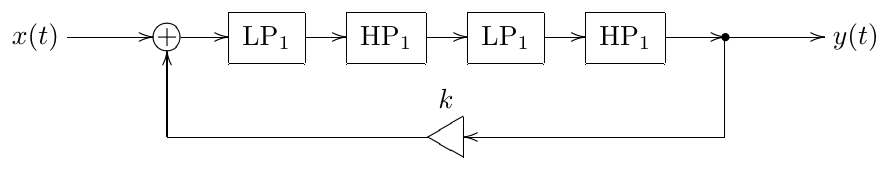

*Figure 5.14: A "true" bandpass ladder filter.*

Noticing that the filter structure is invariant relative to the LP to HP
transformation, we conclude that its amplitude response must be symmetric
(around $\omega = 1$) in the logarithmic frequency scale (Fig. 5.15).

The question of instantaneous instability is more critical for the bandpass
ladder, since the feedback is positive. The instantaneous gain of a
lowpass-highpass pair is a product of the instantaneous gains of a 1-pole
lowpass and a

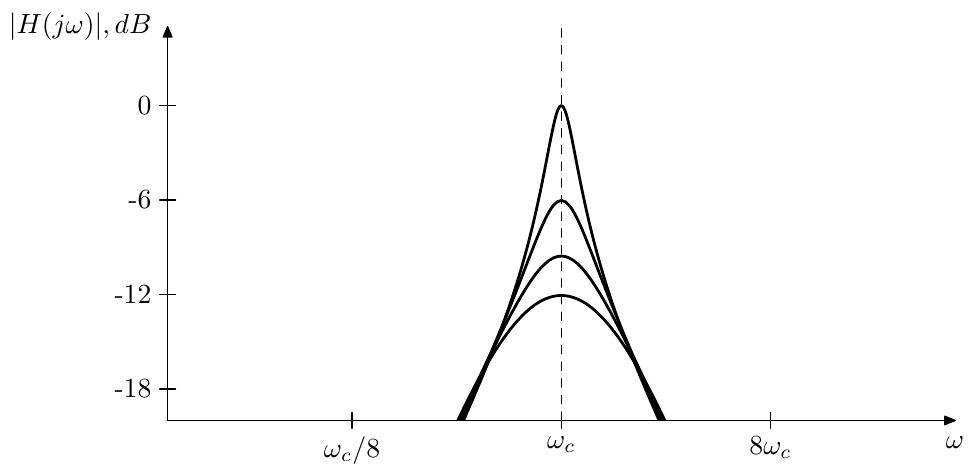

*Figure 5.15: Amplitude response of the 4-pole bandpass ladder
filter for various k.*

1-pole highpass:

$$
\frac{g}{1+g} \cdot \frac{1}{1+g}
$$

(where $g = \omega_c T/2$). It's not difficult to verify that the maximum
gain of this pair is attained at $g = 1$ and is equal to $1/4$. The maximum
instantaneous gain of two of these pairs is therefore $1/16$, and thus the
instantaneously unstable case doesn't occur provided $k < 16$.

### Bandwidth control

Using (5.3) and the fact that the frequency response of $s^2/(1+s)^4$ at
$\omega = 1$ is $1/4$ we obtain the frequency response of the 4-pole
bandpass ladder at the cutoff

$$
H(j) = \frac{1}{4-k}
$$

Therefore, by multiplying the output (or the input signal) of the 4-pole
bandpass ladder by $4-k$ we can turn it into a normalized bandpass, where the
bandwidth is controlled by varying $k$.

There is another way, however. Recall that the normalized 2-pole bandpass
(4.15) is an LP to BP transformation of the 1-pole lowpass $1/(1+s)$. At the
same time,

$$
\frac{1}{1+s} \cdot \frac{s}{1+s} = \frac{s}{(1+s)^2} = \frac{s}{1+2s+s^2} =
\frac{1}{2} \cdot \frac{2s}{1+2s+s^2}
$$

is simply a halved version of (4.15) taken at $R=1$ and therefore is an LP to
BP transformation fo the halved 1-pole lowpass $1/2(1+s)$. This means that
Fig. 5.14 can be replaced by Fig. 5.16 which in turn is an LP to BP
transformation of Fig. 5.17.

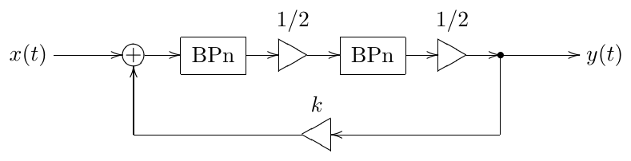

*Figure 5.16: 4-pole bandpass ladder filter expressed in terms of
normalized 2-pole bandpasses.*

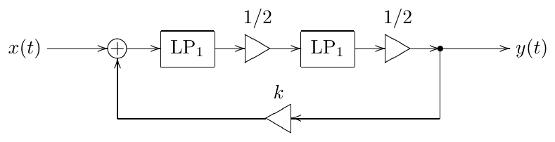

*Figure 5.17: LP to BP transformation applied to this structure
produces the 4-pole bandpass ladder in Fig. 5.16.*

We don't even specifically care to analyse the structure Fig. 5.17. What is
important is that the damping parameter of the LP to BP transformation
controls the transformation bandwidth and thereby the bandwidth of the
bandpass ladder in Fig. 5.16. Thus, introducing the damping control into the
normalized 2-pole bandpasses in Fig. 5.16 we can control the bandpass
ladder's bandwidth by simply varying the damping parameter of the underlying
2-pole bandpasses.

At the same time we still have the $k$ parameter available, which we still
can use to control the bandwidth of the normalized bandpass (Fig. 5.18).
Thus, $k$ and $R$ provide two different ways of bandwidth control, resulting
in somewhat different amplitude response shapes (Fig. 5.19).[^7]

Obviously, normalized 2-pole bandpasses with damping control could be
implemented using an SVF. If nonlinearities are involved, however, using
TSK/SKF 2-pole bandpasses might be a better option. Since we didn't introduce
the latter yet, we need to postpone the respective discussion. We will
return to this question, however, in the discussion of 8-pole bandpass
ladder in Section 5.9, where the bandwidth control via the 2-pole bandpass
damping will be a particularly desired feature compared to being somewhat
academic in the case of a 4-pole bandpass.

## 5.8 Sallen-Key filters

In this section we are going to introduce two special kinds of 2-pole
bandpass ladder filters, the Sallen-Key filter and its transpose.[^8] They
are important because of their nonlinear versions, since, as linear digital
2-pole filters go, the SVF filter could be sufficient for most applications,
and it also provides probably the best performance among different TPT
2-poles.

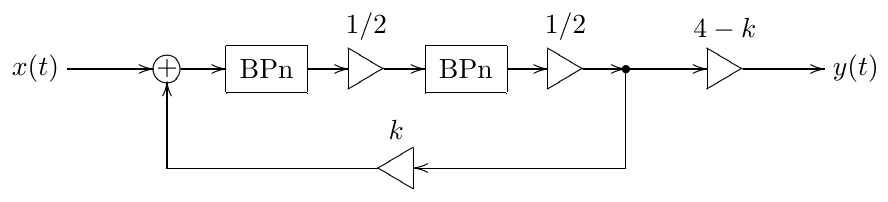

*Figure 5.18: 4-pole normalized bandpass ladder filter expressed in
terms of normalized 2-pole bandpasses.*

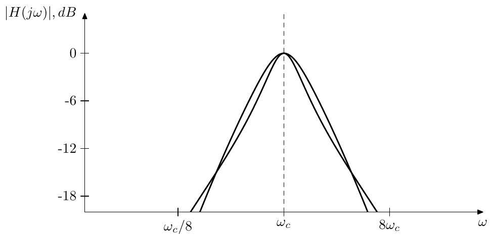

*Figure 5.19: Amplitude response of the 4-pole normalized bandpass
ladder filter in Fig. 5.18 for two different combinations of $k$ and $R$
resulting in comparable bandwidths.*

For now we shall develop the linear versions of these filters. The
Sallen-Key filter is more famous than its transpose, but we'll start with the
transpose, for the sake of a more systematic presentation of the material.

### Transposed Sallen-Key (TSK) filters

Attempting to build a 2-pole lowpass ladder filter (Fig. 5.20) we don't end
up with a useful filter.

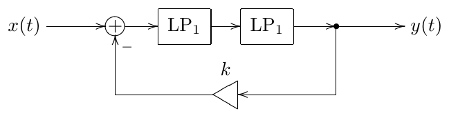

*Figure 5.20: 2-pole lowpass ladder filter (not very useful).*

Indeed, the transfer function of this filter is

$$
H(s) = \frac{1}{k + (1+s)^2}
$$

and the poles are respectively at

$$
s = -1 \pm \sqrt{-k} = -1 \pm j\sqrt{k} \qquad (k \ge 0)
$$

Interpreting these pole positions in terms of 2-pole cutoff and damping
(which we can do using (4.13)), we obtain

$$
\begin{cases}
\omega_c = \left|-1 \pm j\sqrt{k}\right| = \sqrt{1+k} \\[4pt]
R = \dfrac{-\operatorname{Re}\left(-1 \pm j\sqrt{k}\right)}{\left|-1 \pm j\sqrt{k}\right|} = \dfrac{1}{\sqrt{1+k}}
\end{cases}
$$

Thus, firstly, there is coupling between the feedback amount and the
effective cutoff of the filter. Secondly, as $k$ grows, $R$ stays strictly
positive, thus the filter poles never go into the right semiplane (and, as
with the 4-pole ladder filter, this would be quite desired once we make the
filter nonlinear). So, all in all, not a very useful structure.

A similar situation occurs in an attempt to use two 1-pole highpasses
instead of two 1-pole lowpass in the same structure (the readers may wish
verify this on their own as an exercise).

This result is no wonder, considering that the transfer function of a chain
of two 1-pole lowpasses is $1/(1+s)^2$, with the phase response being
$0^\circ$ only at $\omega = 0$ and being $180^\circ$ only at $\omega =
\infty$ (for the highpasses the situation is opposite, we have $180^\circ$
only at $\omega = 0$ and $0^\circ$ only at $\omega = \infty$, which doesn't
make a big difference for our purposes). Thus we don't get a good resonance
peak at any finite location. This however hints at the idea that we might
still try to build a 2-pole bandpass ladder filter from a chain of a 1-pole
lowpass and a 1-pole highpass, as the total phase shift at the cutoff would
be $0^\circ$ in this case:

$$
\left(\frac{1}{1+s} \cdot \frac{s}{1+s}\right)\Bigg|_{s=j} =
\left.\frac{s}{(1+s)^2}\right|_{s=j} = \frac{j}{(1+j)^2} = \frac{1}{2}
$$

The respective structure is shown in Fig. 5.21. Notice that we don't invert
the feedback.

Computing the transfer function of this filter we have

$$
H(s) = \frac{\dfrac{s}{(1+s)^2}}{1 - k\dfrac{s}{(1+s)^2}} =
\frac{s}{(1+s)^2 - ks} = \frac{s}{s^2 + (2-k)s + 1}
$$

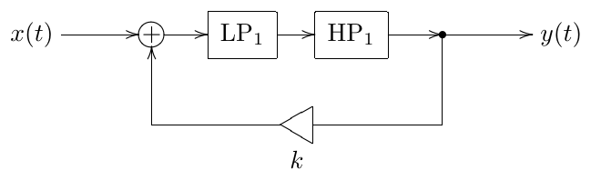

*Figure 5.21: 2-pole bandpass ladder filter.*

The obtained expression is identical to the transfer function of a 2-pole
bandpass filter with a damping gain $2R = 2-k$. That is, the filter in
Fig. 5.21 is pretty much the same as a linear 2-pole SVF bandpass, at least
from the frequency response perspective. Notice that $k=0$ corresponds to
the resonance-neutral setting ($R=1$) while $k=2$ is the self-oscillation
point ($R=0$). As we should remember from the 4-pole bandpass ladder
discussion, the maximum possible instantaneous gain of the lowpass-highpass
pair is $1/4$, therefore under the condition $k < 4$ the TPT implementation
of Fig. 5.21 doesn't become instantaneously unstable.

It might seem that we have failed to construct a 2-pole lowpass filter using
the above approach, but in fact with a slight modification we can obtain one
from the bandpass filter in Fig. 5.21. Let's replace the 1-pole highpass
with a 1-pole multimode with highpass and lowpass outputs (Fig. 5.22).

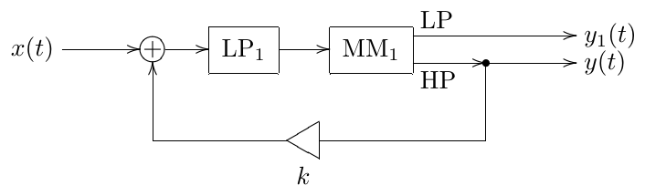

*Figure 5.22: 2-pole bandpass ladder filter with an extra output
mode.*

Obviously, the signal $y(t)$ is not affected by this replacement. Let's find
out what kind of signal is $y_1(t)$. In order to simplify the computation of
the transfer function of the entire structure at $y_1$, consider first the
transfer functions of the 1-pole multimode filter used in isolation:

$$
H_{LP}(s) = \frac{1}{1+s} \qquad H_{HP}(s) = \frac{s}{1+s}
$$

or, for complex sinusoidal signals of the form $e^{st}$

$$
Y_{LP}(s) = \frac{1}{1+s}X(s) \qquad Y_{HP}(s) = \frac{s}{1+s}X(s)
$$

where $X(s)e^{st}$ is the input signal of the multimode 1-pole and
$Y_{LP}(s)e^{st}$ and $Y_{HP}(s)e^{st}$ are the respective output signals.
This means that

$$
Y_{LP}(s) = \frac{Y_{HP}(s)}{s}
$$

Therefore a similar relationship exists between the outputs $y_1(t)$ and
$y(t)$ of the filter in Fig. 5.22:

$$
Y_1(s) = \frac{Y(s)}{s}
$$

and there is the same relationship between their respective transfer
functions

$$
H_1(s) = \frac{H(s)}{s} = \frac{1}{s} \cdot \frac{s}{s^2+(2-k)s+1} =
\frac{1}{s^2+(2-k)s+1}
$$

where $H_1(s)$ the the transfer function for the signal $y_1(t)$ in respect
to the input signal $x(t)$. Therefore $y_1(t)$ is an ordinary 2-pole lowpass
signal with damping gain $2R = 2-k$.

Thus we have obtained a multimode 2-pole ladder filter with the lowpass and
bandpass outputs. We redraw the structure in Fig. 5.22 once again as
Fig. 5.23 to reflect what we have just found out about this structure.

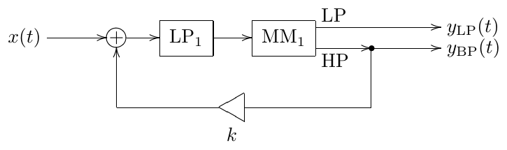

*Figure 5.23: Transposed Sallen-Key (TSK) filter.*

The structure in Fig. 5.23 happens to be a transpose of the Sallen-Key
filter, therefore we will refer to it as the transposed Sallen-Key (TSK)
filter.[^9] The transfer functions of the TSK filter are, as we have found
out:

$$
H_{LP}(s) = \frac{1}{s^2+(2-k)s+1}
$$

$$
H_{BP}(s) = \frac{s}{s^2+(2-k)s+1}
$$

A 2-pole highpass output mode cannot be picked up in a straightforward way,
but can be obtained with some extra effort. Let's also turn the first
lowpass into a multimode (Fig. 5.24). It is not difficult to realize that
the transfer function for the signal at the LP output of $\mathrm{MM}_{1a}$,
which is simultaneously the input signal of $\mathrm{MM}_{1b}$, is

$$
H_{\mathrm{MM1a}LP}(s) = H_{LP}(s) \cdot \left(\frac{1}{s+1}\right)^{-1} =
\frac{s+1}{s^2+(2-k)s+1}
$$

respectively for the signal at the HP output of $\mathrm{MM}_{1a}$ we have

$$
H_{\mathrm{MM1a}HP}(s) = s \cdot H_{\mathrm{MM1a}LP}(s) =
\frac{(s+1)s}{s^2+(2-k)s+1}
$$

Thus we obtain

$$
\begin{aligned}
H_{\mathrm{HP}}(s) &= H_{\mathrm{MM1aHP}}(s) - H_{\mathrm{BP}}(s) = \frac{(s+1)s}{s^2+(2-k)s+1} - \frac{s}{s^2+(2-k)s+1} = \\
&= \frac{s^2}{s^2+(2-k)s+1}
\end{aligned}
$$

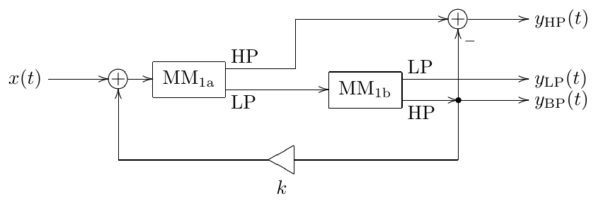

*Figure 5.24: Fully multimode TSK filter.*

### Alternative representations

Recall that 1-pole highpass signal can be obtained as the difference of the
1-pole lowpass filter's input and output signals:

$$
\frac{s}{1+s} = 1 - \frac{1}{1+s}
$$

Then we can replace the multimode 1-pole in Fig. 5.23 by a 1-pole lowpass,
constructing the highpass signal "manually" by subtracting the lowpass output
from the lowpass input (Fig. 5.25). A further modification of Fig. 5.25 is
formally using negative feedback (Fig. 5.26)

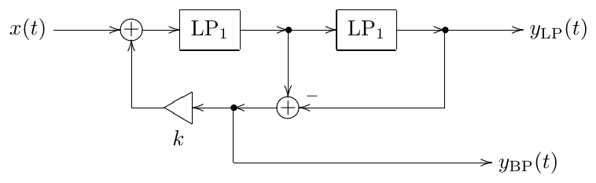

*Figure 5.25: TSK filter (alternative representation).*

### Highpass TSK filter

Let's take the filter in Fig. 5.21 and switch the order of lowpass and highpass
1-pole filters (Fig. 5.27). Since this doesn't change the transfer function of
the entire chain of 1-poles, the filter output stays the same, it is still a
2-pole bandpass.

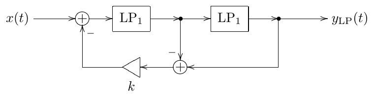

*Figure 5.26: TSK filter (alternative representation, negative feedback
form).*

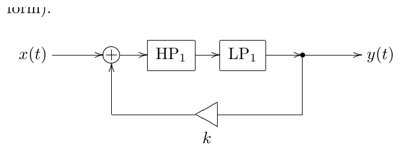

*Figure 5.27: 2-pole bandpass ladder filter with a different order of 1-pole
lowpass and highpass filters.*

Turning the 1-pole lowpass into a multimode we obtain the structure in
Fig. 5.28. It's not difficult to see that the signal at the other output of the
multimode is a 2-pole highpass one. Therefore, in order to distinguish between
the filters in Figs. 5.23 and 5.28 we will refer to the former more
specifically as a *lowpass TSK filter* and to the latter as a *highpass TSK
filter*. If necessary, we can add the lowpass output, using a way similar to
Fig. 5.24.

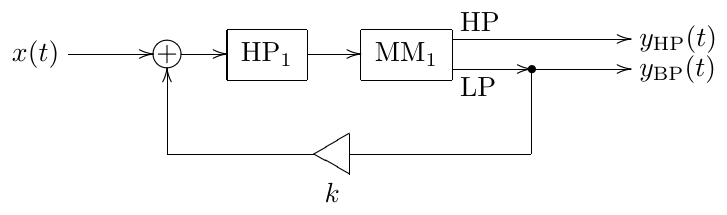

*Figure 5.28: Highpass TSK filter.*

The highpass versions of Fig. 5.25 and Fig. 5.26 could have been built by
performing transformations of Fig. 5.28 similarly to how we did with Fig. 5.23.
However it's easier just to apply the *LP to HP* substitution ($s \leftarrow
1/s$) to Figs. 5.25 and 5.26.

### Sallen-Key filter (SKF)

We could take the structure in Fig. 5.27 and convert the 1-pole highpass
filter into a tranposed multimode 1-pole (Fig. 5.29). By doing this one
obtains a transpose of Fig. 5.23 which is (apparently) called *Sallen-Key
filter* or shortly *SKF*. If necessary, the highpass input can be added,
turning Fig. 5.23 into a transpose of Fig. 5.24.

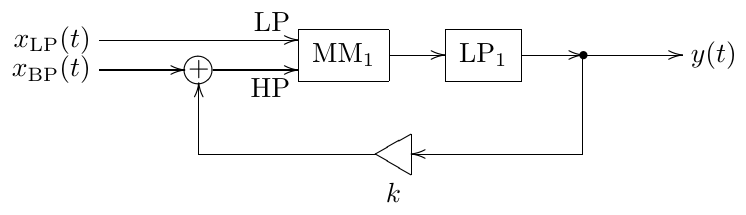

*Figure 5.29: Sallen-Key filter.*

If instead we take the structure in Fig. 5.21 and convert the lowpass into a
transposed multimode 1-pole, we can obtain the structure in Fig. 5.30. In
order to distinguish between Fig. 5.29 and Fig. 5.30, we will, as we did with
their transposes, refer to the structure in Fig. 5.29 more specifically as a
*lowpass Sallen-Key filter* and to the structure in Fig. 5.30 as a *highpass
Sallen-Key filter*. The lowpass input can be added to the highpass SKF using
the transposed version of the idea of Fig. 5.24.

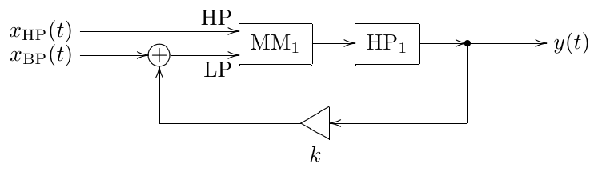

*Figure 5.30: Highpass SKF.*

The transposed versions of Fig. 5.25 and Fig. 5.26 make alternative
representations of the lowpass SKF. E.g. by transposing the structure in
Fig. 5.25 we obtain the one in Fig. 5.31.

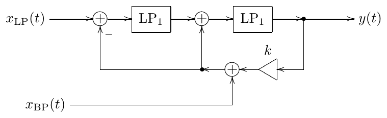

*Figure 5.31: Sallen-Key filter (alternative representation).*

### MIMO Sallen-Key filters

By turning both 1-poles in Fig. 5.27 into multimodes we'll obtain a MIMO
(multiple input multiple output) Sallen-Key filter, as illustrated in
Fig. 5.32.

Note that the labelling of the inputs and outputs $x_{\mathrm{LP}}$,
$x_{\mathrm{HP}}$, $y_{\mathrm{LP}}$, $y_{\mathrm{HP}}$ is thereby formal. The
actual transfer functions are defined for signal paths from a given input to a
given output:

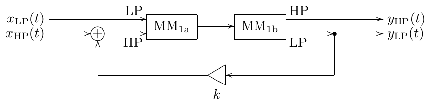

*Figure 5.32: MIMO Sallen-Key filter (HP-LP).*

|              | $y_{\mathrm{LP}}$ | $y_{\mathrm{HP}}$ |
|--------------|-------------------|-------------------|
| $x_{\mathrm{LP}}$ | 2-pole lowpass    | 2-pole bandpass   |
| $x_{\mathrm{HP}}$ | 2-pole bandpass   | 2-pole highpass   |

By putting the feedback path around lowpass-highpass chain rather than
lowpass-highpass, Fig. 5.32 is turned into Fig. 5.33.

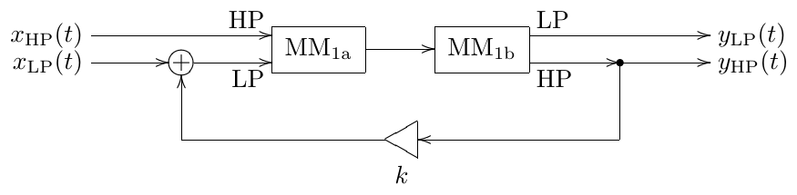

*Figure 5.33: MIMO Sallen-Key filter (LP-HP).*

### Allpass TSK/SKF

Consider again the 2-pole bandpass ladder filter structure in Fig. 5.21.
Suppose that we use 1-pole allpasses $(1-s)/(1+s)$ instead of low- and
highpass filters. We also use negative, rather than positive feedback,
although this is more a matter of convention. The result is shown in
Fig. 5.34, where we also prepared the modal outputs.

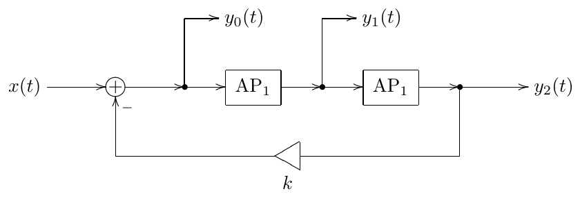

*Figure 5.34: 2-pole ladder filter based on allpasses (not so useful).*

The transfer function of the main output is

$$
\begin{aligned}
H_2(s) &= \frac{\left(\dfrac{1-s}{1+s}\right)^2}{1+k\left(\dfrac{1-s}{1+s}\right)^2} = \frac{(1-s)^2}{(1+s)^2+k(1-s)^2} = \\
&= \frac{(1-s)^2}{(1+k)s^2+2(1-k)s+(1+k)} = \frac{1}{1+k}\cdot\frac{(1-s)^2}{s^2+2\dfrac{1-k}{1+k}s+1}
\end{aligned}
$$

which is not exactly a 2-pole allpass transfer function. The denominator of
$H(s)$ however looks pretty usable, it's a classical 2-pole transfer function
denominator with damping $R = (1-k)/(1+k)$.

The transfer functions at the other two outputs can be obtained by "reverse
application" of the transfer functions of the 1-pole allpasses to $H_2(s)$:

$$
H_1(s) = \left(\frac{1-s}{1+s}\right)^{-1}\cdot H_2(s) = \frac{1}{1+k}\cdot\frac{(1+s)(1-s)}{s^2+2\dfrac{1-k}{1+k}s+1}
$$

$$
H_0(s) = \left(\frac{1-s}{1+s}\right)^{-1}\cdot H_1(s) = \frac{1}{1+k}\cdot\frac{(1+s)^2}{s^2+2\dfrac{1-k}{1+k}s+1}
$$

We can try building the desired transfer function

$$
H(s) = \frac{s^2-2Rs+1}{s^2+2Rs+1} = \frac{s^2-2\dfrac{1-k}{1+k}s+1}{s^2+2\dfrac{1-k}{1+k}s+1}
$$

as a linear combination of $H_0(s)$, $H_1(s)$ and $H_2(s)$:

$$
a_0 H_0(s) + a_1 H_1(s) + a_2 H_2(s) = H(s)
$$

Noticing that the denominators of $H_0(s)$, $H_1(s)$, $H_2(s)$ are all
identical to the desired denominator already, we can discard the common
denominator from the equation and simply write:

$$
a_0\frac{(1+s)^2}{1+k} + a_1\frac{(1+s)(1-s)}{1+k} + a_2\frac{(1-s)^2}{1+k} = s^2 - 2\frac{1-k}{1+k}s+1
$$

or

$$
a_0(1+2s+s^2) + a_1(1-s^2) + a_2(1-2s+s^2) = (1+k)s^2 - 2(1-k)s + (1+k)
$$

From where $a_0 = k$, $a_1 = 0$, $a_2 = 1$. Thus

$$
H(s) = H_0(s) + kH_2(s) = \frac{s^2-2\dfrac{1-k}{1+k}s+1}{s^2+2\dfrac{1-k}{1+k}s+1}
$$

and the corresponding structure is shown in Fig. 5.35.[^10][^11] The main idea
of this structure is very similar to the one of a TSK filter with some
"embedded" modal mixture. For that reason we can refer to the filter Fig. 5.35
as a allpass TSK filter, or we could call it a *2-pole allpass ladder filter*.

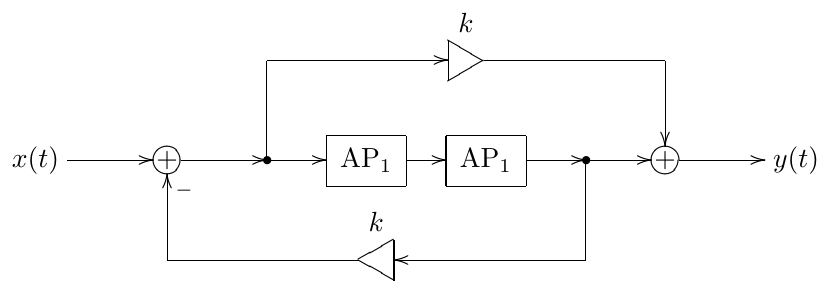

*Figure 5.35: Allpass TSK filter.*

The 2-pole damping parameter $R$ is related to $k$ via

$$
\begin{aligned}
R &= (1-k)/(1+k) \\
k &= (1-R)/(1+R)
\end{aligned}
$$

so that for $k = -1 \ldots +\infty$ the damping varies from $+\infty$ to $-1$.
The stable range $R = +\infty \ldots 0$ corresponds to $k = -1 \ldots 1$.

Transposing the structure in Fig. 5.35 we obtain the structure Fig. 5.36 which
for obvious reasons we will refer to as an *allpass SKF*.

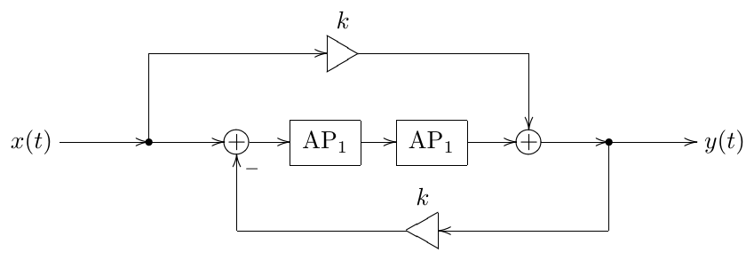

*Figure 5.36: Allpass SKF.*

## 5.9 8-pole ladder

Connecting eight 1-pole lowpass filters in series instead of four we can build
an 8-pole lowpass ladder filter (Fig. 5.37).

The transfer function of the 8-pole lowpass ladder is obviously

$$
H(s) = \frac{1}{k+(1+s)^8}
$$

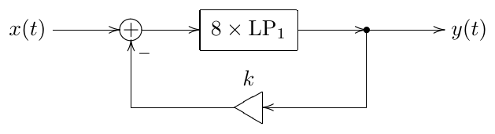

*Figure 5.37: 8-pole lowpass ladder filter.*

and the pole positions are defined by

$$
k + (1+s)^8 = 0
$$

giving

$$
s = -1 + (-k)^{1/8}
$$

where $(-k)^{1/8}$ is understood in the multivalued complex root sense:

$$
(-k)^{1/8} = |k|^{1/8}e^{j\alpha}
$$

where

$$
\alpha = \frac{\pi+2\pi n}{8}
$$

The main difference from the 4-pole ladder lowpass, besides the steeper cutoff
slope, is that the $180^\circ$ phase shift by the chain of 1-pole lowpasses is no
longer occurring at the cutoff. Instead, the phase response of the lowpass
chain at the cutoff is $360^\circ$. In order to find the frequency at which $180^\circ$
phase shift is occurring we need to solve

$$
\arg\left(\frac{1}{1+j\omega}\right)^{8} = -\pi
$$

that is

$$
\arg(1+j\omega) = \pi/8 \qquad \text{or} \qquad \arg(1+j\omega) = 3\pi/8
$$

(apparently the values $5\pi/8$ an larger cannot be attained by
$\arg(1+j\omega)$). This gives

$$
\omega = \tan\pi/8 \qquad \text{or} \qquad \omega = \tan 3\pi/8
$$

The value of $\tan\pi/8$ can be easily found using the formula for the tangent
of double angle:

$$
\tan 2\alpha = \frac{2\tan\alpha}{1-\tan^2\alpha}
$$

where letting $\alpha = \pi/8$ we obtain

$$
\frac{2\tan\pi/8}{1-\tan^2\pi/8} = 1
$$

$$
2\tan\pi/8 = 1-\tan^2\pi/8
$$

$$
\tan^2\pi/8 + 2\tan\pi/8 - 1 = 0
$$

$$
\omega = \tan\pi/8 = \sqrt{2}-1 \approx 0.4142
$$

For $\tan 3\pi/8$ we can use the formula for the tangent of the complementary
angle:

$$
\omega = \tan 3\pi/8 = \tan(\pi/2-\pi/8) = \frac{1}{\tan\pi/8} = \frac{1}{\sqrt{2}-1} = \sqrt{2}+1 \approx 2.4142
$$

Thus the resonance peak can occur at $\omega = \tan(\pi/4\pm\pi/8) = \sqrt{2}\pm1$.
Let's find the values of $k$ at which the respective poles hit the imaginary
axis. According to (5.7), $k$ is the reciprocal of the amplitude amplitude
response of the chain of eight 1-pole lowpasses at the respective
frequencies:

$$
\begin{aligned}
k &= \left(\left|\frac{1}{1+j\omega}\right|^{8}\right)^{-1} = \left(\frac{1}{\sqrt{1+\omega^2}}\right)^{-8} = \left(\sqrt{1+\omega^2}\right)^{-8} = \\
&= \left(\sqrt{1+\tan^2(\pi/4\pm\pi/8)}\right)^{8} = \cos^{-8}(\pi/4\pm\pi/8)
\end{aligned}
$$

finally giving

$$
\begin{aligned}
\omega_1 &\approx 0.4142 & k_1 &\approx 1.884 \\
\omega_2 &\approx 2.4142 & k_2 &\approx 2174
\end{aligned}
$$

Thus the selfoscillation at $\omega_1$ is occurring way much earlier than the
one at $\omega_2$. It is very unlikely that even in a nonlinear version of
this filter, which allows going into unstable range of $k$, we will use $k$ as
large as 2174. It also hints to the fact that the second resonance is way much
weaker than the first one. Therefore, for practical purposes we will simply
ignore the second resonance and say that the infinite resonance is occuring at
$\omega = \sqrt{2}-1 \approx 0.4142$ at $k \approx 1.884$. Fig. 5.38
illustrates the amplitude response behavior for various $k$.

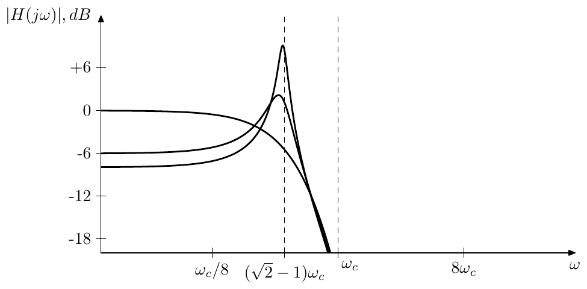

*Figure 5.38: Amplitude response of the 8-pole lowpass ladder filter for
various $k$.*

Considering that at $k=0$ the amplitude response of a chain of eight 1-poles
at the cutoff is $(1/\sqrt{2})^8 = 1/16$, which is ca. $-24$dB, we could treat
the resonance frequency $\omega = \sqrt{2}-1$ as the "user-facing" cutoff
frequency instead, and in practical implementations of the filter let the
cutoff of the underlying 1-poles equal the "user-facing" cutoff multiplied by
$1/(\sqrt{2}-1) = \sqrt{2}+1 \approx 2.4142$.

One could ask the following question: the phase response of the chain of
eight 1-poles at $\omega=1$ is $0^\circ$, therefore why don't we simply use
positive feedback to create the resonance peak at $\omega=1$? The problem is
that the phase response at $\omega=0$ is also $0^\circ$. Since the amplitude
response at $\omega=0$ is 1, the selfoscillation will occur already at $k=1$,
whereas at $\omega=1$ it will occur only at $k=1/(1/\sqrt{2})^8=16$.

The instantaneously unstable range of $k$ is found similarly to the 4-pole
lowpass ladder and is $k<-1$.

Various modal mixtures for the 8-pole lowpass ladder filter can be built in a
similar way to the 4-pole ladder filter. However the fact that the resonance
frequency is noticeably lower than the cutoff frequency of the underlying
1-poles will affect the shapes of the resulting modal mixtures. Some smart
playing around with the modal mixture coefficients can sometimes reduce the
effect of this discrepancy.

### 8-pole highpass ladder

Replacing the 1-pole lowpasses with highpasses we obtain an 8-pole highpass
ladder filter (Fig. 5.39). As we already know from the discussion of the
4-pole highpass, it essentially the same as lowpass except for the
$s \leftarrow 1/s$ substitution. The instantaneously unstable range of $k$ is
found similarly to the 4-pole highpass ladder and is $k<-1$.

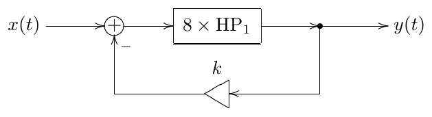

*Figure 5.39: 8-pole highpass ladder filter.*

### 8-pole bandpass ladder

Replacing half of the lowpasses with highpasses in Fig. 5.37 we obtain the
8-pole bandpass ladder filter, where we shouldn't forget that in a bandpass
ladder the feedback shouldn't be inverted (Fig. 5.40).

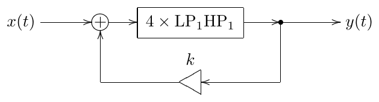

*Figure 5.40: 8-pole bandpass ladder filter.*

The total gain at the cutoff of the 1-pole chain is

$$
\left(\frac{s}{(1+s)^2}\right)^{4}\bigg|_{s=j} = \left(\frac{1}{2}\right)^{4} = \frac{1}{16}
$$

therefore selfoscillation occurs at $k=16$. Fig. 5.41 illustrates the
amplitude response behavior at various $k$. Note that the amplitude response
is pretty low (particularly, for $k=0$ it peaks at $-24$dB), therefore
additional boosting of the output signal may be necessary in practical usage.

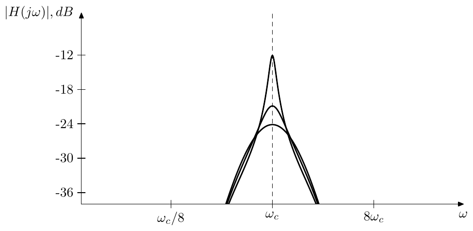

*Figure 5.41: Amplitude response of the 8-pole bandpass ladder filter for
various $k \geq 0$.*

The instantaneously unstable range of $k$ is found similarly to the 4-pole
bandpass ladder and is $k \geq 2^8 = 256$.

An interesting feature of the 8-pole bandpass ladder is that at negative $k$
the filter obtains two resonance peaks (Fig. 5.42).[^12] Indeed, notice that
the phase response of the 8-pole lowpass-highpass chain is the same as the one
of the 8-pole lowpass chain:

$$
\arg\frac{s^4}{(1+s)^8} = \arg\frac{1}{(1+s)^8} \qquad s=j\omega,\ \omega\in\mathbb{R}
$$

Thus we still have a $180^\circ$ phase shift at $\omega=\sqrt{2}\pm1$.

The amplitude response of a single lowpass-highpass pair at $\omega=\sqrt{2}\pm1$ is

$$
\left|\left(\frac{s}{(1+s)^2}\right)\right|_{s=j(\sqrt{2}\pm1)} = \frac{\sqrt{2}\pm1}{1+(\sqrt{2}\pm1)^2} = \frac{1}{(\sqrt{2}\mp1)+(\sqrt{2}\pm1)} = \frac{1}{2\sqrt{2}}
$$

therefore selfoscillation occurs at $k=-(2\sqrt{2})^4=-64$.

### 8-pole bandpass ladder with bandwidth control

The occurence of two resonance peaks in an 8-pole bandpass ladder at $k<0$
motivates the introduction of the possibility to control the distance between
these two peaks. In Section 5.7 we have introduced two different approaches
to control the 4-pole bandpass ladder's bandwidth. Apparently, the approach
using the $k$ parameter is not good for our goal here, since we don't want to affect
the amplitude response shape in the vertical direction. Also, from Fig. 5.42
it seems that the variation of k in the negative range has little effect on the
actual bandwidth. On the other hand, the approach using the damping of the
underlying 2-pole bandpasses looks much more promising.

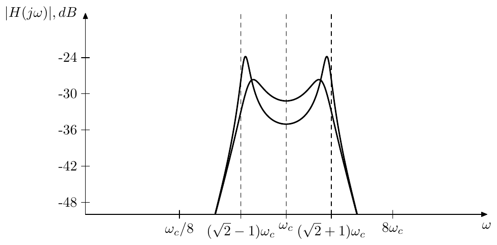

*Figure 5.42: Amplitude response of the 8-pole bandpass ladder filter for various k < 0.*

Representing the 8-pole bandpass ladder in terms of normalized 2-pole bandpasses
(Fig. 5.43) we notice that it is an LP to BP transformation of the filter
in Fig. 5.44. The filter in Fig. 5.44 is essentially the same as the ordinary 4-pole
lowpass ladder (Fig. 5.1), except that

- the feedback is positive, so that selfoscillation at $\omega = 1$ occurs at some
  negative value of $k$
- the output signal amplitude and the feedback amount are 16 times lower,
  thus selfoscillation at $\omega = 1$ doesn't occur at $k = -4$ but at $k = -64$
  (which matches the already established fact of selfoscillation of Fig. 5.40
  and equivalently Fig. 5.43 at $k = -64$).

Therefore by controlling the bandwidth of the LP to BP transformation, we will
control the distance between the resonance peaks in Fig. 5.42.

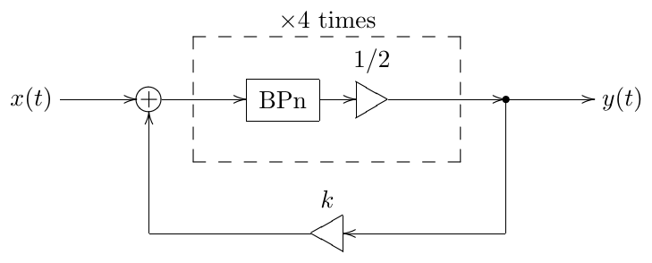

*Figure 5.43: 8-pole bandpass ladder filter expressed in terms of normalized 2-pole bandpasses.*

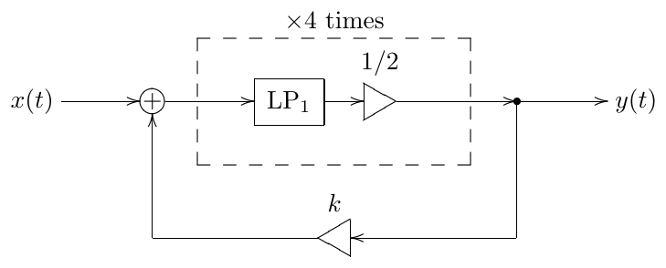

*Figure 5.44: 4-pole lowpass ladder filter with positive feedback and
additional gains of 1/2. The LP to BP substitution applied to this
filter produces the filter in Fig. 5.43.*

Since the resonance peak in Fig. 5.44 is occurring at $\omega = 1$, the formula
(4.20) expresses $R$ in terms of the distance between the two images of this peak
after the LP to BP transformation. Therefore we can directly use the formula
(4.20) to control the distance between the resonance peaks in Fig. 5.43. The
prewarping techniques described in Section 4.6 also apply, thereby allowing us
to achieve the exact positioning of the resonance peaks (in the limit $k \to -64$).

There is an important question concerning the choice of the specific topology
for the normalized bandpasses BPn. Of course, the most obvious choice would
be to use an SVF. This should work completely fine in the linear case. In a
nonlinear case, however, we might want to use a different topology. Particularly,
we might want that at $R = 1$ our controlled-bandwidth topology becomes fully
identical to Fig. 5.40 (therefore obtaining the sound, which is identical to the
one of the structure in Fig. 5.40 even in the presence of nonlinear effects).

Assuming that Fig. 5.40 implies interleaved 1-pole low- and highpasses (as
shown in Fig. 5.45), a good solution is provided by the TSK/SKF filters. E.g.
considering the structure in Fig. 5.21 (which is essentially the TSK filter from
Fig. 5.23), we can notice that at $k = 0$ it becomes fully equivalent to a single
lowpass-highpass pair. This suggests that we could use this structure to
construct a halved normalized bandpass (Fig. 5.46), where expressing the TSK
feedback $k$ in terms of damping $R$ we have $k = 2(1 - R)$. Note that at $R = 1$
not only the feedback path in Fig. 5.46 is disabled, but also the output gain
element $R$ is becoming transparent. Using the halved normalized bandpass in
Fig. 5.46, we could reimplement Fig. 5.45 as Fig. 5.47.

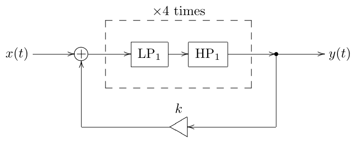

*Figure 5.45: Fig. 5.40 implemented by interleaved 1-pole low- and
high-passes.*

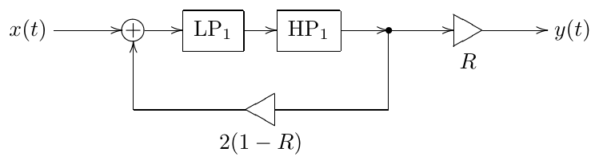

*Figure 5.46: Halved normalized TSK bandpass.*

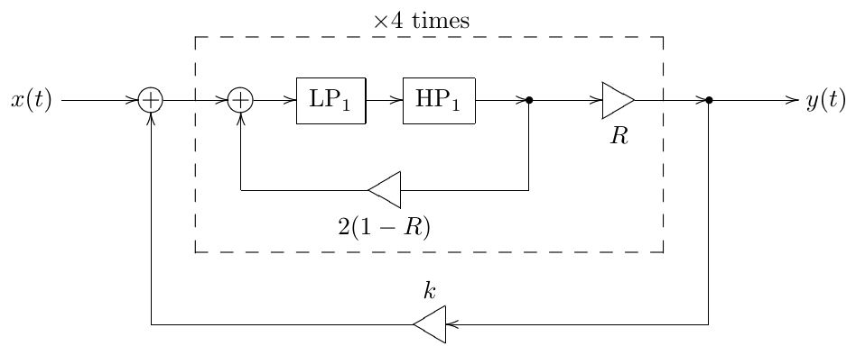

*Figure 5.47: 8-pole bandpass ladder filter expressed in terms of
halved normalized TSK bandpasses.*

## 5.10 Diode ladder

In the diode ladder filter the serial connection of four 1-pole lowpass filters (implemented
by the transistor ladder) is replaced by a more complicated structure
of 1-pole filters (implemented by the diode ladder). The block diagram of the
diode ladder is shown in Fig. 5.48, while the diode ladder filter adds the feedback
loop around that structure, feeding the fourth output of the diode ladder
into the diode ladder's input (Fig. 5.49).

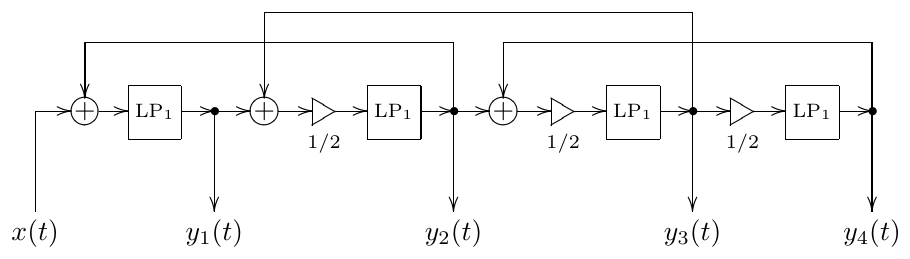

*Figure 5.48: Diode ladder.*

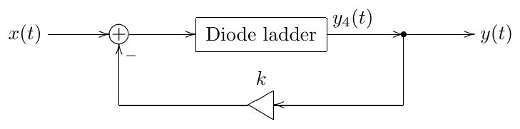

*Figure 5.49: Diode ladder filter.*

It is instructive to write out the 1-pole equations implied by Fig. 5.48:

$$
\begin{aligned}
\dot{y}_1 &= \omega_c\bigl((x + y_2) - y_1\bigr) \\
\dot{y}_2 &= \omega_c\bigl((y_1 + y_3)/2 - y_2\bigr) \\
\dot{y}_3 &= \omega_c\bigl((y_2 + y_4)/2 - y_3\bigr) \\
\dot{y}_4 &= \omega_c\bigl(y_3/2 - y_4\bigr)
\end{aligned} \tag{5.18}
$$

In this form it's easier to guess the reason for the gain elements 1/2 used in
Fig. 5.48, they perform the averaging between the feedforward and feedback
signals. However this averaging in (5.18) and Fig. 5.48 is not done fully consistently.
It would have been more consistent to have no 1/2 gain element at the
input of the fourth lowpass, rather than of the first one:

$$
\begin{aligned}
\dot{y}_1 &= \omega_c\bigl((x + y_2)/2 - y_1\bigr) \\
\dot{y}_2 &= \omega_c\bigl((y_1 + y_3)/2 - y_2\bigr) \\
\dot{y}_3 &= \omega_c\bigl((y_2 + y_4)/2 - y_3\bigr) \\
\dot{y}_4 &= \omega_c\bigl(y_3 - y_4\bigr)
\end{aligned} \tag{5.19}
$$

in which case the first lowpass would take $(x + y_2)/2$ as its input, the second
lowpass would take $(y_1 + y_3)/2$ as its input, the third lowpass would take
$(y_2 + y_4)/2$ as its input, and the fourth lowpass would take $y_3$ as its input. However,
(5.18) is a more traditional way to implement a diode ladder filter. Anyway, the
difference between (5.18) and (5.19) is actually not that large, since (as we are
going to show below) they result in one and the same transfer function,

The more complicated connections between the 1-pole lowpasses present in
the diode ladder "destroy" the frequency response of the ladder in a remarkable
form, which, is responsible for the characteristic diode ladder filter sound.[^13]
Generally, the behavior of the diode ladder filter is less "straightforward" than
the one of the transistor ladder filter.

### Transfer function

We are going to develop the transfer function for the diode ladder in a generalized
form (Fig. 5.50), where $H_n(s)$ denote blocks with respective transfer
functions. In the case of Fig. 5.48 and (5.18) we would have

$$
H_1(s) = G(s) \qquad H_2(s) = H_3(s) = H_4(s) = \frac{G(s)}{2} \tag{5.20}
$$

while in the case of (5.19) we would respectively have

$$
H_1(s) = H_2(s) = H_3(s) = \frac{G(s)}{2} \qquad H_4(s) = G(s) \tag{5.21}
$$

where

$$
G(s) = \frac{1}{1+s} \tag{5.22}
$$

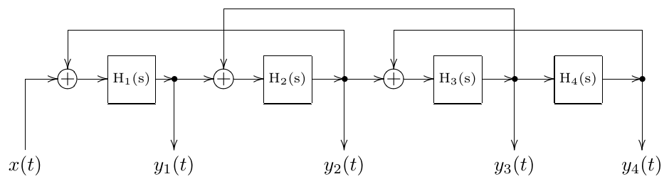

*Figure 5.50: Generalized diode ladder in transfer function form.*

Assuming complex exponential signals $e^{st}$, for the $H_4(s)$ block we have

$$
y_4 = H_4 y_3
$$

(where $H_4$ is short for $H_4(s)$), therefore

$$
\frac{1}{H_4}y_4 = y_3 \tag{5.23}
$$

For the $H_3(s)$ block we have

$$
y_3 = H_3(y_2 + y_4)
$$

Substituting (5.23) we have

$$
\frac{1}{H_4}y_4 = H_3(y_2 + y_4)
$$

$$
\frac{1}{H_{34}}y_4 = y_2 + y_4
$$

$$
\frac{1 - H_{34}}{H_{34}}y_4 = y_2 \tag{5.24}
$$

where $H_{34}$ is a short notation for $H_3 H_4$.

For the $H_2(s)$ block we have

$$
y_2 = H_2(y_1 + y_3)
$$

Substituting (5.23) and (5.24) we have

$$
\frac{1 - H_{34}}{H_{34}}y_4 = H_2\left(y_1 + \frac{1}{H_4}y_4\right)
$$

$$
\frac{1 - H_{34}}{H_{234}}y_4 = y_1 + \frac{1}{H_4}y_4
$$

$$
\frac{1 - H_{34} - H_{23}}{H_{234}}y_4 = y_1 \tag{5.25}
$$

For the $H_1(s)$ block we have

$$
y_1 = H_1(x + y_2)
$$

Substituting (5.24) and (5.25) we have

$$
\frac{1 - H_{34} - H_{23}}{H_{234}}y_4 = H_1\left(x + \frac{1 - H_{34}}{H_{34}}y_4\right)
$$

$$
\frac{1 - H_{34} - H_{23}}{H_{1234}}y_4 = x + \frac{1 - H_{34}}{H_{34}}y_4
$$

$$
\frac{1 - H_{34} - H_{23} - H_{12}(1 - H_{34})}{H_{1234}}y_4 = x
$$

$$
\frac{1 - H_{12} - H_{23} - H_{34} + H_{1234}}{H_{1234}}y_4 = x
$$

$$
\Delta(s) = \frac{y_4}{x} = \frac{H_{1234}}{1 - H_{12} - H_{23} - H_{34} + H_{1234}} \tag{5.26}
$$

where $\Delta(s)$ is the diode ladder's transfer function. It is easy to see that substituting
(5.20) or (5.21) into (5.26) gives identical results, therefore transfer
functions arising out of (5.18) and (5.19) are identical. Formula (5.26) also
gives one more hint at the reason to use a 1/2 gain with all 1-poles except the
first or the last one, as in this case we get unit amplitude response at $\omega = 0$:

$$
\Delta(0) = \frac{\dfrac{1}{8}}{1 - \dfrac{1}{2} - \dfrac{1}{4} - \dfrac{1}{4} + \dfrac{1}{8}} = 1
$$

Since we are specifically interested in Fig. 5.48, let's write its transfer function
in a more detailed form. Substituting first (5.20) and then (5.22) into (5.26)
we have

$$
\Delta(s) = \frac{G^4/8}{1 - G^2 + G^4/8} = \frac{1}{8G^{-4} - 8G^{-2} + 1} =
$$

$$
= \frac{1}{8(1+s)^4 - 8(1+s)^2 + 1} = \frac{1}{T_4(s+1)} \tag{5.27}
$$

where $T_4(x) = 8x^4 - 8x^2 + 1$ is the fourth-order Chebyshev polynomial.[^14] The
poles of $\Delta(s)$ are therefore found from $s + 1 = x_n$ or $s = -1 + x_n$ where
$x_n \in (-1, 1)$ are the roots of the Chebyshev polynomial $T_4(x)$:

$$
x_n = \pm\frac{1}{2} \pm \frac{1}{2\sqrt{2}}
$$

Therefore the poles of $\Delta(s)$ are purely real and located within $(-2, 0)$:

$$
p_n = -1 \pm \frac{1}{2} \pm \frac{1}{2\sqrt{2}} \tag{5.28}
$$

Since the poles of $\Delta(s)$ are located on the negative real semiaxis and there are
no zeros, $|\Delta(j\omega)|$ is monotonically decreasing to zero on $\omega \in [0, +\infty)$. Thus
$\Delta(s)$ is a lowpass.[^15]

In Section 2.16 we have seen that two linear systems sharing the same transfer
function are equivalent as long as the only modulation which is happening is
the cutoff modulation. Therefore, as long as our implementation is purely linear,
we could replace the complicated diode ladder feedback system in Fig. 5.50 with
simply a serial connection of four 1-poles, whose cutoffs are defined by (5.28).[^16]
Further details of replacement of the diode ladder by a series of 1-poles can be
taken from Section 8.2 where general principles of building serial filter chains
are discussed.

The transfer function of the diode ladder filter is obtained from (5.27) giving

$$
H(s) = \frac{\Delta}{1 + k\Delta} = \frac{1}{k + \Delta^{-1}} = \frac{1}{k + T^4(1+s)} = \frac{1}{8(1+s)^4 - 8(1+s)^2 + 1 + k} \tag{5.29}
$$

The corresponding amplitude response is plotted in Fig. 5.51.

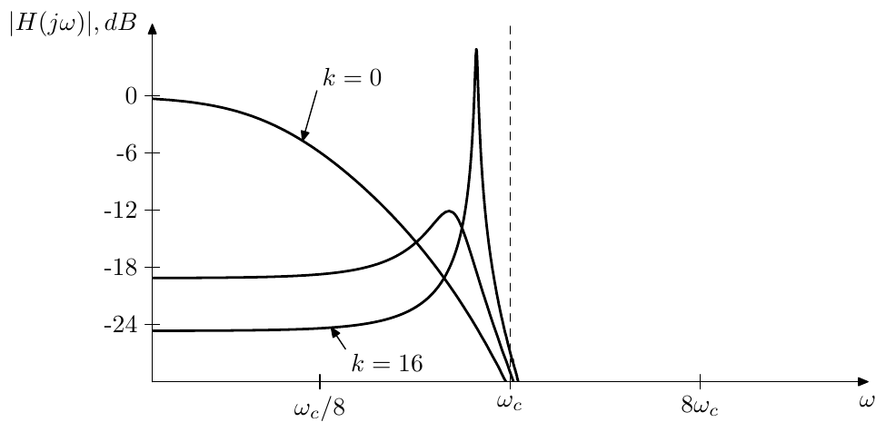

*Figure 5.51: Amplitude response of the diode ladder filter for various
k.*

The poles of the diode ladder filter, if necessary, can be obtained by solving

$$
8(1+s)^4 - 8(1+s)^2 + 1 + k = 0
$$

which is a biquadratic equation in $(1+s)$.

In regards to the multimode diode ladder filter, notice that the transfer
functions corresponding to the $y_n(t)$ outputs are different from the ones of the
transistor ladder, therefore the mixing coefficients which worked for the modes
of the transistor ladder filter, are not going to work the same for the diode
ladder.

### Resonance

In order to obtain the information about the resonating peak, we need to find
frequencies at which the phase response of $\Delta(s)$ is $0^\circ$ or $180^\circ$. Therefore we are
interested in the solutions to the equation

$$
\operatorname{Im}\bigl(8(1+s)^4 - 8(1+s)^2 + 1\bigr) = 0 \qquad \text{where } s = j\omega,\ \omega \in \mathbb{R}
$$

Substituting $j\omega$ for $s$ we have

$$
\operatorname{Im}\bigl(8(1+s)^4 - 8(1+s)^2 + 1\bigr) = 8\operatorname{Im}\bigl((1+j\omega)^4 - (1+j\omega)^2\bigr) =
$$

$$
= \operatorname{Im}\bigl((1 - \omega^2 + 2j\omega)^2 - (1 - \omega^2 + 2j\omega)\bigr) = 4(1 - \omega^2)\omega - 2\omega = 0
$$

The solution $\omega = 0$ is not very interesting. Therefore we cancel the common
factor $2\omega$ obtaining

$$
2(1 - \omega^2) = 1
$$

and therefore

$$
\omega = \pm\frac{1}{\sqrt{2}}
$$

Now, in order to find the selfoscillation boundary value of $k$ we need to find the
frequency response of $\Delta(s)$ at $\omega = 1/\sqrt{2}$. Substituting $s = j/\sqrt{2}$ into (5.27)
and using (5.6) we have

$$
k = 8(1+s)^4 - 8(1+s)^2 + 1 = 8\left(1 + \frac{j}{\sqrt{2}}\right)^4 - 8\left(1 + \frac{j}{\sqrt{2}}\right)^2 + 1 =
$$

$$
= 8\left(\frac{1}{2} + j\sqrt{2}\right)^2 - 8\left(\frac{1}{2} + j\sqrt{2}\right) + 1 =
$$

$$
= 8\left(-\frac{7}{4} + j\sqrt{2}\right) - 8\left(\frac{1}{2} + j\sqrt{2}\right) + 1 = 1 - 14 - 4 = -17
$$

Now, since we are already having negative feedback in Fig. 5.48, the selfoscillation
occurs at $k = 17$.

Note that the amplitude response in Fig. 5.51 is matching the above analysis
results.

### TPT model

Converting Fig. 5.48 to the instantaneous response form we obtain the structure
in Fig. 5.52. From Fig. 5.52 we wish to obtain the instantaneous response of
the entire diode ladder. Then we could use this response to solve the zero-delay
feedback equation for the main feedback loop of Fig. 5.49.

The structure in Fig. 5.52 looks a bit complicated to solve. Of course we
could always write a system of linear equations and solve it in a general way,
e.g. using Gauss elimination, but this has its own complications. Therefore we
would rather like to see if we somehow could still use the approach of nested
zero-delay feedback loops, as we have been doing with other filters until now.

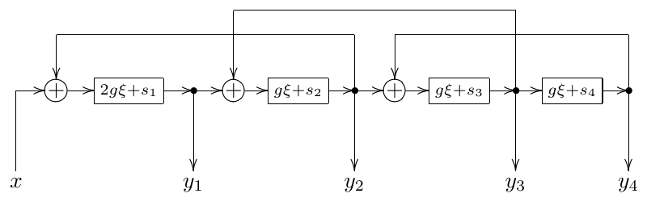

*Figure 5.52: Diode ladder in the instantaneous response form.*

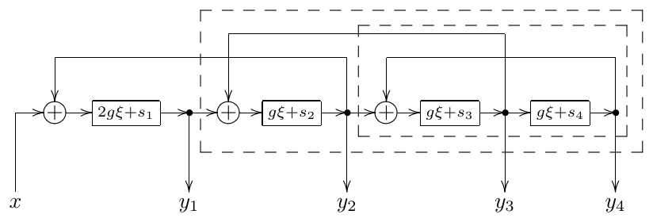

*Figure 5.53: Diode ladder in the nested instantaneous response
form.*

Introducing the nested systems, as shown in Fig. 5.53 by dashed lines, we
can first treat the innermost system which has input $y_2$ and outputs $y_3$ and $y_4$.
The equations for this system are

$$
y_3 = g(y_2 + y_4) + s_3
$$

$$
y_4 = gy_3 + s_4
$$

Solving for $y_3$, we obtain

$$
y_3 = \frac{g}{1 - g^2}y_2 + \frac{gs_4 + s_3}{1 - g^2} = g_{23}y_2 + s_{23}
$$

where $g_{23}$ and $s_{23}$ are new variables introduced as shown above. Since $g\xi + s_n$
denote 1-pole lowpasses with halved input signals, $0 < g < 1/2$. Respectively
$0 < g^2 < 1/4$ and thus the zero-delay feedback loop doesn't get instantaneously
unstable. The range of $g_{23}$ is

$$
0 < g_{23} = \frac{g}{1 - g^2} < \frac{1/2}{1 - (1/2)^2} = \frac{1/2}{3/4} = \frac{2}{3}
$$

Going outside to the next nesting level we have

$$
y_2 = g(y_1 + y_3) + s_2 = gy_3 + gy_1 + s_2 = g(g_{23}y_2 + s_{23}) + gy_1 + s_2
$$

Solving for $y_2$:

$$
y_2 = \frac{g}{1 - gg_{23}}y_1 + \frac{gs_{23} + s_2}{1 - gg_{23}} = g_{12}y_1 + s_{12}
$$

where $0 < gg_{23} < 1/2 \cdot 2/3 = 1/3$, thus the zero-delay feedback loop doesn't get
instantaneously unstable. The range of $g_{12}$ is

$$
0 < g_{12} = \frac{g}{1 - gg_{23}} < \frac{1/2}{1 - \dfrac{1}{2}\cdot\dfrac{2}{3}} = \frac{1/2}{1 - 1/3} = \frac{1/2}{2/3} = \frac{3}{4}
$$

Going outside to the outermost level we have

$$
y_1 = 2g(x + y_2) + s_1 = 2gy_2 + 2gx + s_1 = 2g(g_{12}y_1 + s_{12}) + 2gx + s_1
$$

Solving for $y_1$:

$$
y_1 = \frac{2g}{1 - 2gg_{12}}x + \frac{2gs_{12} + s_1}{1 - 2gg_{12}} = g_{01}x + s_{01}
$$

where $0 < 2gg_{12} < 2 \cdot 1/2 \cdot 3/4 = 3/4$, thus the zero-delay feedback loop doesn't
get instantaneously unstable. The range of $g_{01}$ is

$$
0 < g_{01} = \frac{2g}{1 - 2gg_{12}} < \frac{1}{1 - 2\cdot\dfrac{1}{2}\cdot\dfrac{3}{4}} = \frac{1}{1 - 3/4} = \frac{1}{1/4} = 4
$$

Introducing for consistency the notation $y_4 = gy_3 + s_4 = g_{34}y_3 + s_{34}$, we
obtain the instantaneous response for the entire ladder

$$
y_4 = g_{34}y_3 + s_{34} =
$$

$$
= g_{34}(g_{23}y_2 + s_{23}) + s_{34} = g_{34}g_{23}y_2 + (g_{34}s_{23} + s_{34}) = g_{24}y_2 + s_{24} =
$$

$$
= g_{24}(g_{12}y_1 + s_{12}) + s_{24} = g_{24}g_{12}y_1 + (g_{24}s_{12} + s_{24}) = g_{14}y_1 + s_{14} =
$$

$$
= g_{14}(g_{01}x + s_{01}) + s_{14} = g_{14}g_{01}x + (g_{14}s_{01} + s_{14}) = g_{04}x + s_{04}
$$

it's not difficult to realize that

$$
0 < g_{04} = g_{01}g_{12}g_{23}g_{34} < 4 \cdot \frac{3}{4} \cdot \frac{2}{3} \cdot \frac{1}{2} = 1
$$

Now $g_{04}$ is the instantaneous gain of the entire diode ladder. Respectively the
total gain of the of the zero-delay feedback loop in Fig. 5.49 is $-kg_{04}$ and thus
the feedback doesn't get instantaneously unstable provided $k \geq -1$.

## Summary

The transistor ladder filter model is constructed by placing a negative feedback
around a chain of four identical 1-pole lowpass filters. The feedback amount
controls the resonance.

The same idea of a feedback loop around a chain of several filters also results
in further filter types such as 8-pole ladder, diode ladder and SKF/TSK.

[^1]: Quite unfortunately, there is already another class of filter
    structures commonly referred to as "ladder filters". Fortunately, this
    class is not so widely encountered in the synth filter context, on the
    other hand "transistor ladder" is also a commonly used term. Therefore
    we'll stick with using the term "ladder filters" for the flters based on
    a resonating feedback loop.

[^2]: A widely known piece of work describing this linear model is
    *Analyzing the Moog VCF with considerations for digital implementation*
    by T.Stilson and J.Smith.

[^3]: This time we will not develop an explicit expression for the transient
    response, since it's getting too involved. Still, the general rule,
    which we will develop in Section 7.7, is that the transient response is
    always a linear combination of partials of the form $e^{p_nt}$ (and
    $t^\nu e^{p_nt}$ in case of repeated poles), where $p_n$ are the filter
    poles. Respectively, as soon as some of the poles leave the left complex
    semiplane, the filter becomes unstable.

[^4]: As $k$ continues to grow into the unstable range, the frequencies of
    the exploding (or still selfoscillating, if the filter is nonlinear)
    sinusoidal transient response partials can change, since the imaginary
    part of the resonating poles can change as the poles move beyond the
    imaginary axis.

[^5]: We boost the input rather than the output signal for the same reason
    as when preferring to place the cutoff gains in front of the
    integrators.

[^6]: Actually, instead of $y_0$ we could have used the input signal $x$ for
    these linear combinations. However, it doesn't matter. Since
    $y_0 = x - ky_4$, we can express $x$ via $y_0$ or vice versa. It's just
    that some useful linear combinations have simpler (independent of $k$)
    coefficients if $y_0$ rather than $x$ is being used.

[^7]: In principle, $k$ and $R$ have very similar effects. Fundamentally,
    they both affect the bandwidth and the resonance peak height. In
    Fig. 5.18 their effect on the resonance peak height is compensated, the
    compensation for $k$ being the $4-k$ gain at the output, the
    compensation for $R$ being embedded into the normalized bandpasses. By
    removing the normalization from the bandpasses we effectively introduce
    the $1/R^2$ gain into the feedback, and the damping $R$ thereby will
    control the resonance peak height too.

[^8]: Despite essentially being bandpass ladder filters, the Sallen-Key
    filter and its transpose can be (and are) used to deliver lowpass and
    highpass responses as well.

[^9]: The author has used the works of Tim Stinchcombe as the information
    source on the Sallen-Key filter. The idea to introduce TSK filters as a
    systematic concept arose from discussions with Dr. Julian Parker.

[^10]: It is easy to notice that this structure is very similar to the one of
    a multinotch filter with some specific dry/wet mixing ratio.

[^11]: The same structure can be obtained from a direct form II 1-pole
    allpass filter by the allpass substitution
    $z^{-1} \leftarrow (1-s)^2/(1+s)^2$. It is also interesting to notice
    that, applying the allpass substitution principle to the structure in
    Fig. 5.35, we can replace the series of the two 1-pole allpass filters in
    Fig. 5.35 by any other allpass filter, and the modified structure will
    still be an allpass filter.

[^12]: In nonlinear versions of this filter this can generate a particularly
    complex sound, as the two resonance peaks and the input signal fight for
    the saturation headroom.

[^13]: One could argue that the characteristic sound of diode ladder filters is due to nonlinear
    behavior, however the nonlinear aspects do not show up unless the filter is driven hot enough.

[^14]: Although the denominator of $\Delta(s)$ is a Chebyshev polynomial, this has nothing to do
    with Chebyshev filters, despite the name.

[^15]: The amplitude response of $\Delta(s)$ can be seen in Fig. 5.51 at $k = 0$.

[^16]: Note that such replacement only gives a correct modal output $y_4$, which is the one we
    usually need. Other modal outputs, if needed at all, would have to be obtained in a more
    complicated way by combining the output signals of the 1-poles.
