# Chapter 6: Nonlinearities

The filters which we were discussing until now were all linear. Formally this
means that if we consider a filter as an operator, this operator is a linear
one. Practically this meant that the structures of our filters were consisting
of gains, summators and integrators. However, filters used in synthesizers
often show noticeably nonlinear behavior. In terms of block diagrams,
introducing nonlinear behavior means that we should add nonlinear elements to
the set of our block diagram primitives.

Nonlinear filters have more complicated behavior and are capable of producing
richer sound than the linear ones. Usually they exhibit complex overdriving
effects, when driven with an input signal of a sufficiently high level.
Another special feature of many nonlinear filters is their ability to increase
the resonance beyond a formally infinite amount, entering the so-called
*self-oscillation*.

## 6.1 Waveshaping

We just mentioned that in order to build non-linear filters we need to
introduce nonlinear elements into the set of our block diagram primitives. In
fact we are going to introduce just one new type of element, the
*waveshaper*:

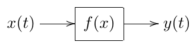

A waveshaper is simply applying a given function to its input signal, and
sends the respective function value as its output signal:

$$
y(t) = f(x(t))
$$

The function $f(x)$ can be any "reasonable" function, e.g. $f(x) = |x|$ or
$f(x) = \sin x$ etc.

Usually the function $f$ cannot vary with time, that is, the function's
parameters, if it has any, are fixed. E.g. if $f(x) = \sin ax$, then $a$ is
usually fixed to some particular value, e.g. $a = 2$, which doesn't vary.
Often, this is just a matter of convention. e.g. the waveshaper $\sin ax$ can
be represented as a serial connection of a gain element and the waveshaper
itself:

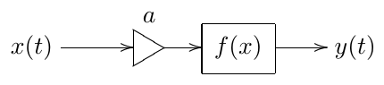

in which case the waveshaper itself is time-invariant.

Still, if necessary, it's no problem for the waveshaper to contain
time-varying parameters, as long as the time-varying parameters are
"externally controlled" (in the same way how e.g. filter cutoff is
controlled). That is, the waveshaper's parameters cannot depend on the values
of the signals within the block diagram. If one needs the parameter dependency
on the signals of the block diagram, then one should consider such
dependencies as additional inputs of the nonlinear element and we end up with
a multi-input element of the block diagram. It is no problem to use such
elements, but normally we should not refer to them as waveshapers, since
commonly, waveshapers have one input and one output.

In order to be representable as a function of the input signal, a waveshaper
clearly shouldn't have any dependency on its own past. That is waveshaper is a
*memoryless* element.

## 6.2 Saturators

The probably most commonly used category of waveshapers is *saturators*.
There is no precise definition of what kind of waveshaper is referred to as
saturator, it's easier to give an idea of what a saturator is by means of
example.

### Bounded saturators

One of the most classical saturators is the hyperbolic tangent function:

$$
y(t) = \tanh x(t) \tag{6.1}
$$

(Fig. 6.1). Even if the input signal of this saturator is very large, the
output never exceeds $\pm 1$. Thus, this element *saturates* the signal,
which is the origin of the term *saturator*.

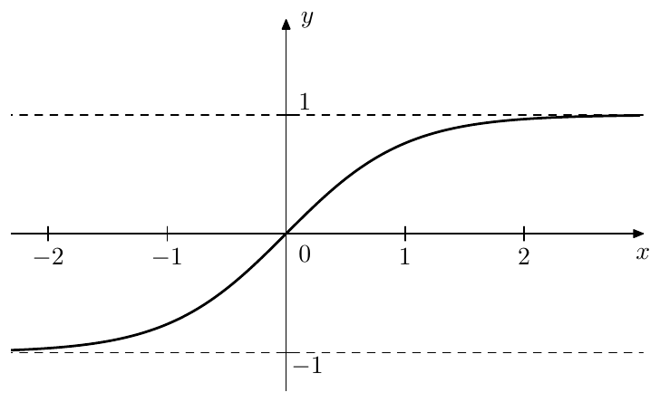

*Figure 6.1: Hyperbolic tangent $y = \tanh x$.*

Other saturators with shapes similar to the hyperbolic tangent include:

$$
y = \sin\arctan x = x/\sqrt{1+x^2} \tag{6.2a}
$$

$$
y = \begin{cases} x \cdot (1 - |x|/4) & \text{if } |x| \le 2 \\ \operatorname{sgn} x & \text{if } |x| \ge 2 \end{cases} \qquad \text{(Parabolic saturator)} \tag{6.2b}
$$

$$
y = x/(1+|x|) \qquad \text{(Hyperbolic saturator)} \tag{6.2c}
$$

(this list is by no means exhaustive). Is is not difficult to see that the
values of the hyperbolic tangent (6.1) and the saturators (6.2) do not exceed
1 in absolute magnitude. That is, their ranges are bounded. We are going to
refer to such saturators as *bounded-range saturators* or simply *bounded
saturators*.

From the four introduced saturation functions the parabolic saturator (6.2b)
stands out in that the full saturation is achieved at $|x| = 2$, whereas for
other shapes it's not achieved at finite input signal levels. Thus, the range
of (6.2b) is $[-1, 1]$, therefore being compact. We will refer to such
saturators as *compact-range monotonic saturators*.

Another important distinction of the parabolic saturator is that it has
three discontinuities of the second derivative (at $x = 0$ and $x = \pm 2$)
and the hyperbolic saturator has one discontinuity of the second derivative
(at $x = 0$). Even though such discontinuities are not easily visible on the
graph, they affect the character of the saturator's output signal. Usually
such discontinuities are rather undesired, as they represent abrupt
irregularities in the saturator's shape, so it's generally better to avoid
those.[^1] A common reason to tolerate derivative discontinuities in a
saturator, though, is performance optimization.

### Transparency at low signal levels

A property commonly found with saturators is that at low levels of input
signals the saturator is transparent: $f(x) \approx x$ for $x \approx 0$.
Equivalently this condition can be written as

$$
\begin{aligned}
f(0) &= 0 \\
f'(0) &= 1
\end{aligned} \tag{6.3}
$$

Visually it manifests itself as the function's graph going at $45^\circ$ through
the origin. Clearly, all the previously introduced saturators have this
property.

The property (6.3) is not really a must, but it's quite convenient if the
saturators have it, particularly for the analysis of system behavior at low
signal levels. For that reason it's common to represent a non-unit derivative
at the origin via a separate gain. Given a saturation function $f(x)$ such
that $f(0) = 0$ but $f'(0) \neq 1$ we introduce a different saturation
function $\tilde f(x)$ such that $\tilde f(0) = 0$ and $\tilde f'(0) = 1$. E.g.
we can take

$$
\tilde f(x) = \frac{f(x)}{f'(0)}
$$

so that

$$
f(x) = f'(0)\tilde f(x)
$$

The coefficient $f'(0)$ is then represented as a separate gain element.

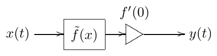

Apparently this representation is not available if $f'(0) = 0$, however in
such cases the saturator effectively breaks the connection at low signal
levels, working as a zero gain.

Saturators with $f(0) \neq 0$ can be represented by separation of the value
$f(0)$ into a DC offset signal:

$$
f(x) = f(0) + \tilde f(x)
$$

which is treated as another input signal with a fixed value $f(0)$:

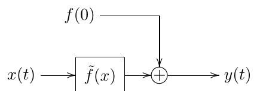

### Unbounded saturators

Sometimes we want saturation behavior, but do not want a hard bound on the
output signal's level. One function with this property is inverse hyperbolic
sine:

$$
y = \sinh^{-1} x = \ln\left(x + \sqrt{x^2+1}\right) \tag{6.4}
$$

(Fig. 6.2) While having the usual transparency property (6.3), it is not
bounded. The asymptotic behavior of the hyperbolic sine is similar to the one
of the logarithm function:

$$
\sinh^{-1} x \sim \operatorname{sgn} x \cdot \ln|2x| \qquad x \to \infty
$$

Another saturator with a similar behavior can be obtained as an inverse of
$y = x(1+|x|)$, which is

$$
y = \frac{2x}{1 + \sqrt{1+|4x|}} \tag{6.5}
$$

behaving as $\sqrt{|x|}$ at $x \to \infty$.

Such kind of waveshapers are also referred to saturators, even though the
saturation doesn't have a bound. We will refer to them as *unbounded-range*
or *unbounded* saturators.

Apparently, unbounded saturators represent a weaker kind of saturation than
bounded ones. The weakest possible kind of saturation is achieved if $y$
grows as a linear function of $x$ at $x \to \infty$. Such saturators can be
built by introducing a linear term into the saturator's function. Given a
saturator $f(x)$ where $f(x)$ can be any of the previously discussed
saturators, we build a new saturator by taking a mixture of $y = f(x)$ and
$y = x$:

$$
y = (1-\alpha)f(x) + \alpha x \qquad (0 < \alpha < 1) \tag{6.6}
$$

where we needed to multiply $f(x)$ by $1-\alpha$ to keep the transparency
property (6.3) (provided it was holding for $f(x)$). Apparently $y \sim
\alpha x$ for $x \to \infty$. We can refer to such saturators as
*asymptotically linear* saturators. The previously discussed saturators such
that $y = o(x)$ for $x \to \infty$ can be respectively referred to as
*slower-than-linear* saturators.

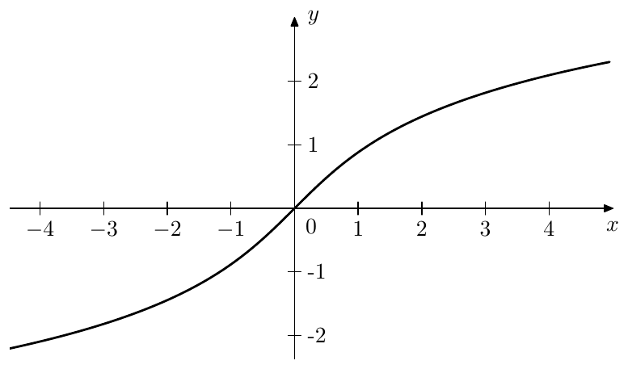

*Figure 6.2: Inverse hyperbolic sine $y = \sinh^{-1} x$.*

### Soft- and hard-clippers

One special but important example of a saturator is the *hard clipper*, shown
in Fig. 6.3.[^2] In contrast, we will be referring to all previously
discussed saturators as *soft clippers*.[^3]

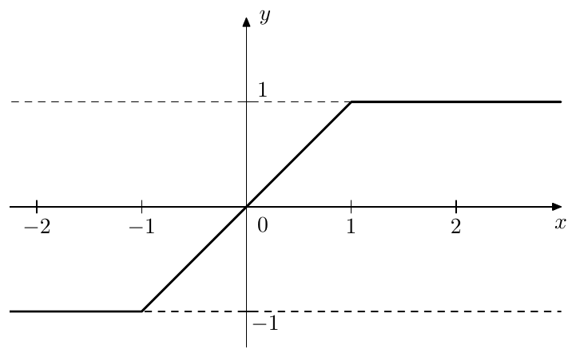

*Figure 6.3: Hard clipper.*

### Saturation level

The previously introduced bounded saturators (6.1) and (6.2) were all
saturating at $y = \pm 1$. But that is not always desirable. Given a bounded
saturator $f(x)$ with the saturation level $y = \pm 1$ we can change the
saturation level to $y = \pm L$ by simultaneouly scaling the $x$ and $y$
coordinates:

$$
y(t) = L \cdot f(x/L) \tag{6.7}
$$

(Fig. 6.4). The simultaneous scaling of $x$ and $y$ preserves the
transparency property (6.3).

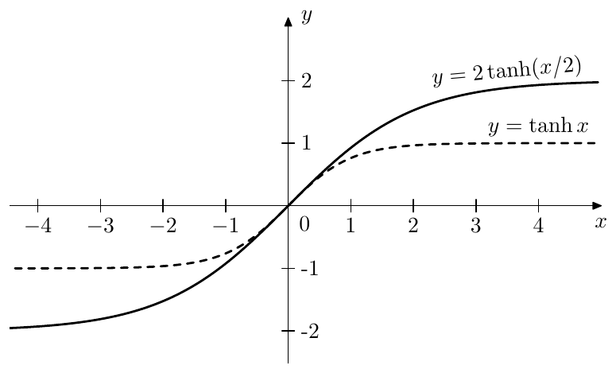

*Figure 6.4: Changing the saturation level.*

### Saturator as variable gain

Sometimes it is useful to look at saturators as at variable gain elements.
E.g. we can rewrite $y = \tanh x$ as

$$
y = \tanh x = x \cdot \frac{\tanh x}{x} = g(x) \cdot x \tag{6.8}
$$

The graph of the function $g(x) = \frac{\tanh x}{x}$ is shown Fig. 6.5. Thus

$$
g(x) \approx 1 \qquad \text{for } x \approx 0 \tag{6.9a}
$$

$$
g(x) \sim 1/|x| \qquad \text{for } x \to \infty \tag{6.9b}
$$

That is at low signal levels the saturator is transparent, at high signal
levels is reduces the input signal's amplitude by a factor of approximately
$1/|x|$. Apparently, this kind of behavior is shown by all bounded
saturators. Unbounded saturators give a similar picture, as long as they are
slower than linear. For asymptotically linear saturators, such as (6.6), we
have $g(x) \to \alpha$ instead.

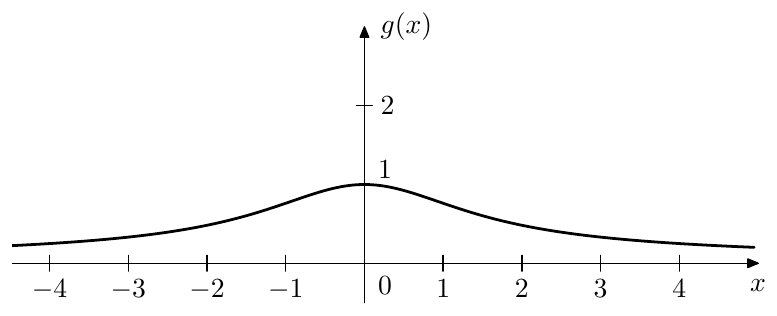

*Figure 6.5: $g(x) = \dfrac{\tanh x}{x}$.*

## 6.3 Feedback loop saturation

In the ladder filter and its variations, such as 4-pole and 8-pole ladders
and SKF/TSK filters, the resonance is implemented by means of a feedback
loop. By this we mean that when the feedback loop is disabled (by setting the
feedback gain to zero), there is no resonance, and the resonance amount is
increased by increasing the amount of the feedback (thus e.g. the SVF filter
doesn't fall into this category). With such filter structures, when the
feedback amount goes above a certain threshold (e.g. $k = 4$ for the 4-pole
lowpass ladder or $k = 2$ for the SKF) the filter becomes unstable and
"explodes" (the filter's state and the output signal indefinitely grow). By
putting a saturator anywhere within such feedback loop we can prevent the
signals in the feedback loop from the infinite growth, making the filter
stable again.

### Feedforward path saturation

One of the common positions for the feedback loop saturator is in the
feedforward path right after the feedback merge point (Fig. 6.6). Given that
the saturator is a bounded one (such as $\tanh x$), the output signal of such
saturator is guaranteed to be bounded. Since the rest of the feedforward path
in Fig. 6.6 is known to be BIBO-stable (independently of the feedback
setting), the output of the filter is bounded too and thus the entire filter
is BIBO-stable.

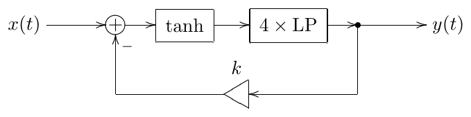

*Figure 6.6: Ladder filter with a saturator in the feedforward path.*

We could also view the saturator in Fig. 6.6 as a variable gain $g$ (6.8).
Apparently, as the amplitude of the signal grows, the average value of $g$ is
decreasing to zero. In those terms, the saturator is effectively reducing the
feedback gain from $k$ to $k \cdot \langle g \rangle$ (where $\langle g
\rangle$ is the average value of $g$). Since at large signal amplitudes
$\langle g \rangle$ can get arbitrarily close to zero, the value of $k \cdot
\langle g \rangle$ goes below 4, which, intuitively, prevents the filter from
exploding. Unbounded saturators are therefore having the same effect, as long
as they are slower than linear.

With asymptotically linear saturators the filter will still explode at some
point. Assuming the saturator has the form (6.6) we have $g(x) \to \alpha$
and thus $\langle g \rangle \to \alpha$ and $k \cdot \langle g \rangle \to
\alpha k$. Thus, we could expect that for something like $\alpha k < 4$ the
filter should not explode.

### Effects of transient response

As we should remember, one possible way to look at a filter getting unstable
is that its transient response grows instead of decaying with time. Each pair
of conjugate poles $p_n$ and $p_n^*$ of the filter contributes a transient
component of the form

$$
Ae^{p_n t} + A^* e^{p_n^* t} = ae^{t\operatorname{Re}p_n}\cos(t\operatorname{Im}p_n + \varphi_n)
$$

Thus at $\operatorname{Re}p_n = 0$ we have a sinusoid of frequency $\omega =
\operatorname{Im}p_n$. At $\operatorname{Re}p_n > 0$ we have the same
sinusoid of an exponentially growing amplitude. This sinusoid will be present
in the filter's output even in the absence of the input signal.[^4] Since at
$\operatorname{Re}p_n \ge 0$ this sinusoid is self-sustaining, the filter is
said to *self-oscillate*. The saturator in the feedback loop prevents the
self-oscillation from infinite growth.[^5]

Suppose the system in Fig. 6.6 is at $k \approx 4$, that is it is
selfoscillating or at least strongly resonating. Let

$$
u(t) = x(t) - ky(t) \tag{6.10}
$$

denote the input signal of the saturator and recall the representation of a
saturator as a variable gain element (6.8). Then the output signal of the
saturator is

$$
v(t) = \tanh u(t) = g(u)\cdot u = g(u)x(t) - g(u)k\cdot y(t) = g(u)x(t) - \tilde k(u)y(t) \tag{6.11}
$$

where $g(u) = \frac{\tanh u}{u}$. Comparing (6.10) to the last expression in
(6.11) we see that the effect of the saturator can be seen as the
"replacing" $x(t)$ with $g(u)x(t)$ and $ky(t)$ with $\tilde k(u)y(t)$. Thus,
$\tilde k(u) = g(u)k$ is the new "effective feedback amount". Now, by
increasing the amplitude of the input signal $x(t)$ we increase the
amplitude of $u(t)$ and thus reduce the magnitude of $g(u)$ and thereby
reduce the effective feedback amount $\tilde k$, which in turn shows up as
reduction of resonance. That is, at high amplitudes of the input signal the
resonance oscillations kind of disappear.

One intuitive way to look at this is to say that the input signal and the
resonance are "fighting" for the saturator's headroom, and if the input
signal has a very high level, it "pushes" the resonating component of the
signal out. On the other hand, if the input signal level is low, then the
entire headroom is taken by the resonating component which will be therefore
much louder than the input signal. There is usually some "sweet spot" in the
input signal's level, where the fighting doesn't kill the resonance, but
results in a nice interaction between the input signal and the resonance.

### Feedback path saturation

The amount of fighting (at the same input signal level) can be decreased by
putting the saturator into the feedback path, either prior to the feedback
gain (Fig. 6.7) or past the feedback gain (Fig. 6.8).[^6] In this case the
input signal $x(t)$ doesn't directly enter the saturator but first goes
through the four 1-pole lowpass filters, which somewhat reduces its
amplitude (depending on the signal and on the filter's cutoff). The
difference between Figs. 6.7 and Fig. 6.8 is obviously that in one case the
effective saturation function is $y = k\tanh x$ whereas in the other one it's
$y = \tanh kx$. This means that in the first case the saturation level is
$\pm k$ whereas in the second one it's fixed to $\pm 1$ (Fig. 6.9).

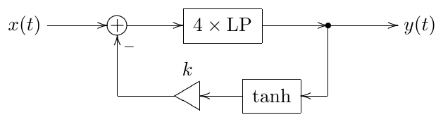

*Figure 6.7: Ladder filter with a saturator in the feedback path
(pre-gain).*

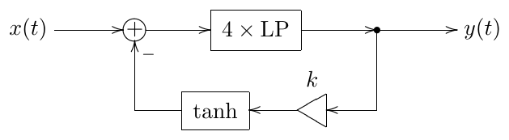

*Figure 6.8: Ladder filter with a saturator in the feedback path
(post-gain).*

The amount of fighting will also be decreased by using a weaker saturation
curve. E.g. using an unbounded saturator instead of a bounded one, in the
most extreme case having an asymptotically linear saturator. A classical
example of this approach is ecountered in the nonlinear Sallen-Key filter
(Fig. 6.10). It is an interesting observation that the sound of nonlinear
Sallen-Key filter significantly differs from the sound of nonlinear
transposed Sallen-Key filter (Fig. 6.11) since in one case the saturator's
output goes through a highpass and a lowpass, while in the other case it goes
through two lowpasses before reaching the filter's output.[^7]

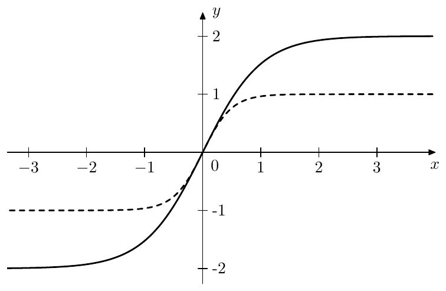

*Figure 6.9: Pre-gain ($y = k\tanh x$, solid) vs. post-gain saturation
($y = \tanh kx$, dashed).*

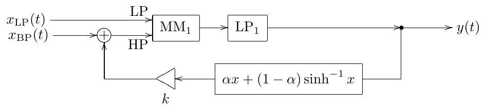

*Figure 6.10: Sallen-Key filter with an asymptotically linear
saturator.*

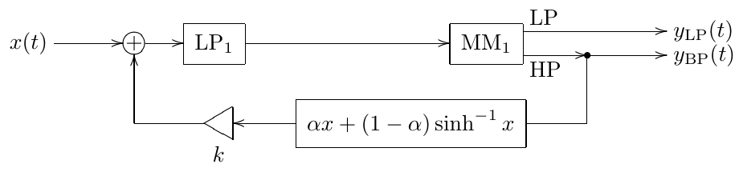

*Figure 6.11: Transposed Sallen-Key filter with an asymptotically
linear saturator.*

### Transfer function

For systems containing nonlinear elements the complex exponentials $e^{st}$
are no longer system eigensignals. That is, given an input signal of the form
$Ae^{st}$ the output will not have a similar form. Therefore the idea of the
transfer function as well as amplitude and phase responses doen't work
anymore.

Still, given that the nonlinear elements satisfy the transparency condition
(6.3), at low signal levels the nonlinearities have almost no effect and the system
is approximately linear. In that sense the transfer function stays applicable to a
certain degree and still can be used to analyse the filter's behavior, although the
error is growing stronger at higher signal levels. Nevertheless, as a rule, qualitatively
the filters retain their main properties also in the presence of saturators. The
lowpass filters stay lowpass, bandpass filters stay bandpass etc.

## 6.4 Nonlinear zero-delay feedback equation

The introduction of the nonlinearity in the feedback path poses no problems for a
naive digital model. In the TPT case however this complicates the things quite a
bit. Consider Fig. 5.5 redrawn to contain the feedback nonlinearity (Fig. 6.12).

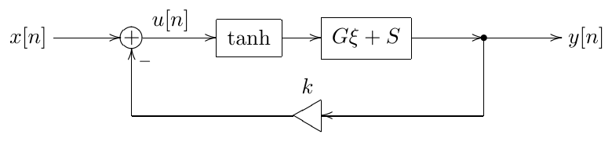

*Figure 6.12: Nonlinear TPT ladder filter in the instantaneous response form.*

Writing the zero-delay feedback equation we obtain

$$
u = x - k(G\tanh u + S) \tag{6.12}
$$

Apparently, the equation (6.12) is a transcendental one. It can be solved only using
numerical methods. Also, the linear zero-delay feedback equation had only one
solution, but how many solutions does (6.12) have? In order to answer the latter
question, let's rewrite (6.12) as

$$
(x - kS) - u = kG\tanh u \tag{6.13}
$$

If $k \geq 0$ then $v(u) = kG\tanh u$ is a nonstrictly increasing function of $u$,[^8]
while $v(u) = (x - kS) - u$ is a strictly decreasing function of $u$. Thus, (6.13)
(and respectively (6.12)) has a single solution (Fig. 6.13). At $k < 0$ we also
typically have one solution (Fig. 6.14) unless $kG > -1$, in which case (6.13) has
three solutions Fig. 6.15. Fortunately, $kG > -1$ corresponds to instantaneously
unstable feedback, and thus normally we are not so much interested in this case
anyway. However, if needed, one could use the concept of the instantenous
smoothing to find out the applicable solution among the three formal ones.

Having found the zero-delay equation solution $u$, we proceed in the usual way,
first letting $u$ through the tanh waveshaper and then letting it through the 1-pole
lowpasses (denoted as $G\xi + S$ in Fig. 6.12), updating the 1-pole states along the
way and ultimately obtaining the value of $y$.

Now we are going to discuss some possible approaches for finding $u$. This
discussion is by no means exhaustive and the reader is advised to consult the
literature on numerical methods for further information.

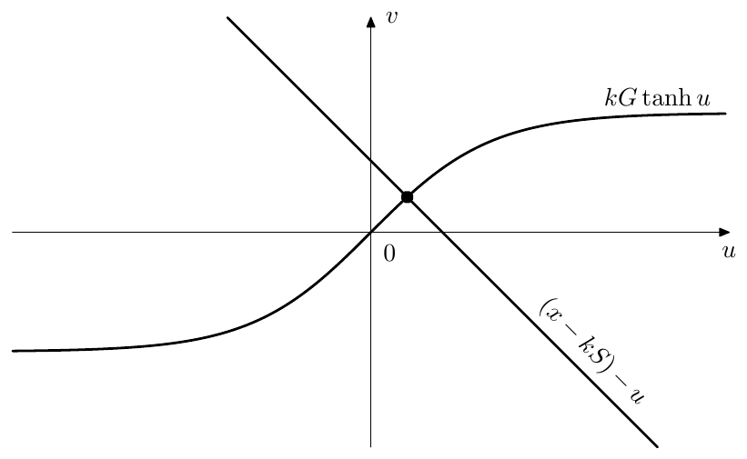

*Figure 6.13: The solution of (6.13) for k > 0.*

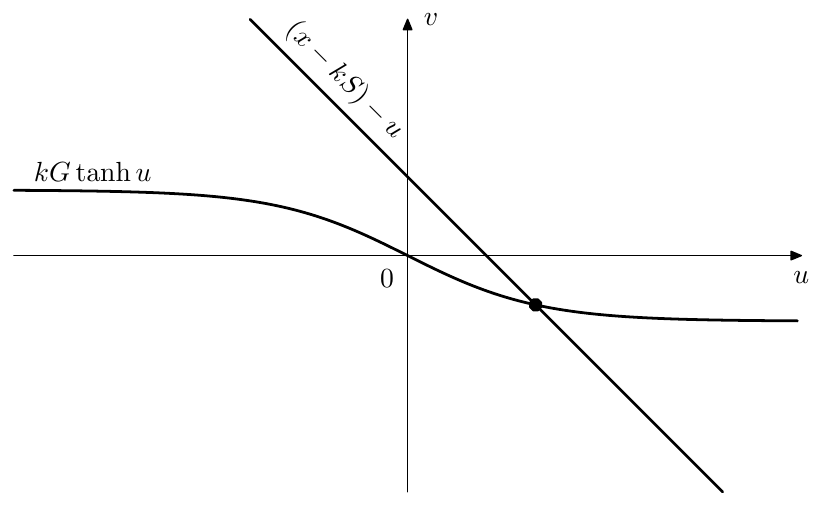

*Figure 6.14: The solution of (6.13) for -1 < kG < 0.*

## 6.5 Iterative methods

### Fixed-point iteration

Starting with some initial value $u = u_0$ we compute iteratively the left-hand side
of (6.12) from the right-hand side:

$$
u_{n+1} = x - k(G\tanh u_n + S) \tag{6.14}
$$

and hope that this sequence converges quickly enough.[^9] Intuitively, the convergence
gets worse at larger absolute magnitudes of $kG$, that is at high cutoffs
(large $G$) and/or high resonance values (large $k$). Conversely, it gets better as
the sampling rate increases (since $G$ becomes smaller in this case). Generally, the
convergence fails for $|kG| \geq 1$.

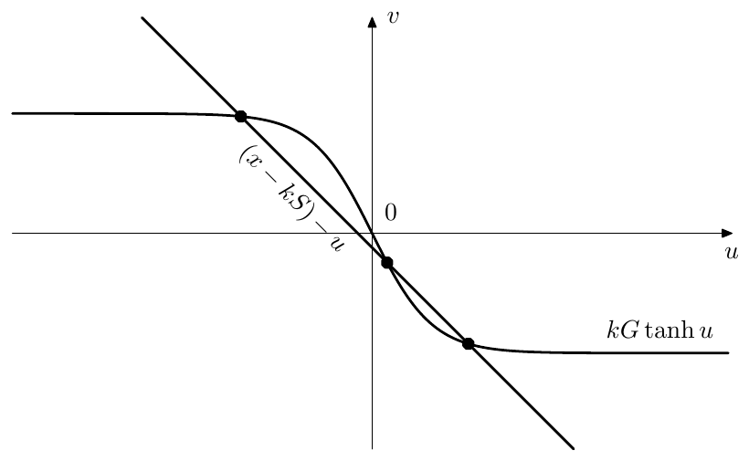

*Figure 6.15: Solutions of (6.13) for kG < -1.*

The process defined by (6.14) has a strong similarity to the naive approach to
time discretization. Indeed, for the frozen values of $G$ and $S$ one can treat Fig. 6.12
as stateless zero-delay feedback system (Fig. 6.16). And then we simply implement
this system in the naive way by introducing a unit delay at the point of the signal
$u$ (Fig. 6.17) and letting this system run for some number of discrete-time ticks.
This is a bit like oversampling of the instantaneous feedback loop part of the
system.[^10]

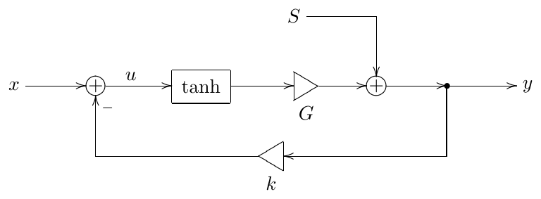

*Figure 6.16: Zero-delay feedback equation (6.12) as a stateless zero-delay feedback system.*

So, it is as if we introduce a "nested" discrete time into a single tick of the "main"
discrete time. This suggests a natural choice of the initial value of $u$ for (6.14),
namely, taking the previous value of $u$ (that is the value from the previous sample
of the "main" discrete time) as the iteration's initial value $u_0$.

Under the consideration of the concept of the instantaneous smoothing (introduced
in Section 3.13), the interpretation in Fig. 6.17 also suggests a way to
improve the convergence of the method by introducing a smoother into the feedback
loop of Fig. 6.17. In a practical implementation such smoother can be a naive
1-pole lowpass, like in Fig. 6.18, which effectively lowers the total feedback gain
from $kG$ to a smaller value.[^11] However, even though such smoother may improve
the convergence at high $kG$, obviously it can deteriorate the convergence in good
situations. Particularly at $k = 0$ the iteration process is supposed to immediately
converge, however in the presence of the lowpass smoother it will converge
exponentially instead.

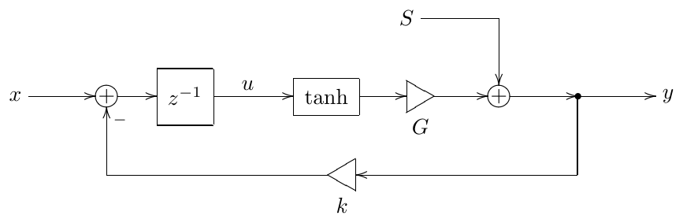

*Figure 6.17: Interpretation of the equation (6.14) as an "oversampled" naive discrete-time model of the stateless feedback loop in Fig 6.16.*

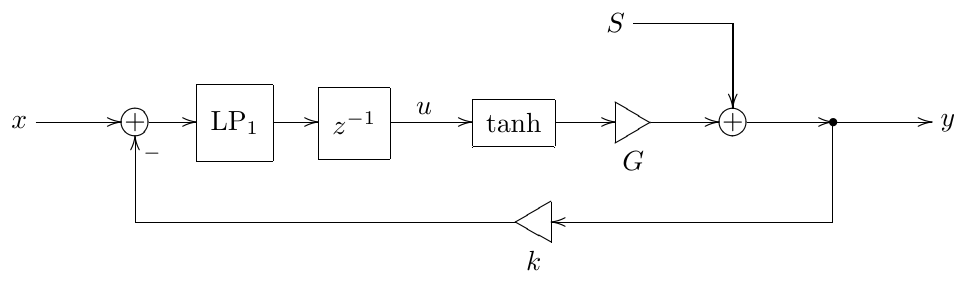

*Figure 6.18: Using a 1-pole lowpass smoother to improve convergence of signals in Fig. 6.17.*

### Newton-Raphson iteration

A very popular approach in practical DSP is Newton-Raphson method, which is
based on the idea of linearization of the function around the current point $u_n$ by
the tangent line. Instead of solving (6.13) we solve

$$
(x - kS) - u_{n+1} = kG(\tanh u_n + (u_{n+1} - u_n)\tanh' u_n) \tag{6.15}
$$

for $u_{n+1}$ to obtain the next guess and repeat the iteration (6.15) until it converges.
Fig. 6.19 illustrates the idea.

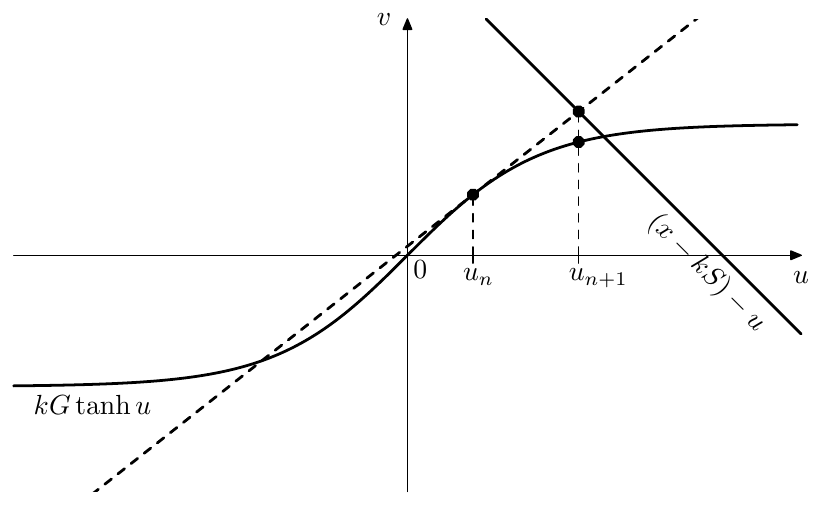

*Figure 6.19: Newton-Raphson method: linearization by the tangent line.*

The textbook version of Newton-Raphson method is formulated in terms of
searching for a zero-crossing of a function (Fig. 6.20). By subtracting the left-hand
side of (6.13) from the right-hand side we obtain the equation

$$
f(u) = u + k(G\tanh u + S) - x = 0 \tag{6.16}
$$

Respectively, the iterations are generated by solving

$$
f(u_n) + (u_{n+1} - u_n)f'(u_n) = 0 \tag{6.17}
$$

Apparently (6.15) and (6.17) (and respectively Figs. 6.19 and 6.20) are equivalent,
both giving

$$
\begin{aligned}
u_{n+1} &= u_n - \frac{f(u_n)}{f'(u_n)} = u_n - \frac{u_n + k(G\tanh u_n + S) - x}{1 + kG/\cosh^2 u_n} = \\
&= u_n - \frac{u_n + k(G\tanh u_n + S) - x}{1 + kG(1 - \tanh^2 u_n)}
\end{aligned}
$$

Newton-Raphson method converges very nicely in almost linear areas of $f(u)$,
the convergence getting worse as $f(u)$ becomes more nonlinear. As with fixed-point
iteration, the convergence deteriorates at large $|kG|$, as the prediction error of
$u_n$ increases.[^12]

As in the fixed-point iteration method, the value of $u$ from the previous sample
tick is a natural choice for the iteration's initial value as well. This choice usually
leads to fast convergence if the new solution lies close to the value of $u$ on the
previous sample. However in excessive situations (such as high cutoff and/or high
input signal frequency) the old solution could lie within the right-hand side
saturation range of $\tanh u$ (that is $u \gg 0$) and the new solution could lie within
the left-hand side saturation range of $\tanh u$ (that is $u \ll 0$).

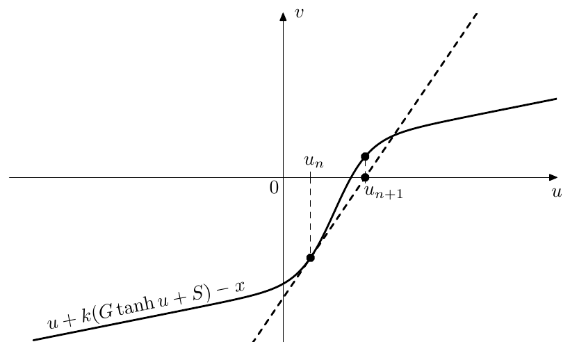

*Figure 6.20: Texbook version of Newton-Raphson method (note that the aspect ratio of the graph is not 1:1)*

The solution search by Newton-Raphson iterations will need to traverse both
"knees" (areas of higher curvature) of tanh along the way, which usually has a
negative impact on the convergence. The neutral choice of $u = 0$ as initial value
might somewhat improve this worst-case scenario, while simultaneously deteriorating
the convergence in "nice" situation.

Other, more advanced approached to the choice of the initial point may be used.
Often one uses Newton-Raphson to refine the result of another method, so that
the initial point is alredy sufficiently close to the true solution.

There is also some freedom of the choice of the variable to solve for. E.g. in
Fig. 6.19 we could have been solving for $v$ instead of $u$. This means that we are
having

$$
\begin{aligned}
v &= (x - kS) - u \\
v &= kG\tanh u
\end{aligned}
$$

from where

$$
\begin{aligned}
u &= (x - kS) - v \\
u &= \tanh^{-1}(v/kG)
\end{aligned}
$$

and (6.13) turns into

$$
(x - kS) - v = \tanh^{-1}(v/kG)
$$

In this specific case $v$ is hardly a better choice compared to $u$. For one we have
a division by zero if $k = 0$.[^13] Worse, one could see in Fig. 6.19 that $v_{n+1}$ is
located above the horizontal asymptote of $kG\tanh u$, which means that we are
getting outside of the domain of $\tanh^{-1}(v/kG)$. And even if we're not outside of
the domain, there still could be large precision losses when evaluating $\tanh^{-1}$ at
points close to $\pm 1$. The convergence speed is likely to be affected too. Therefore
a good choice of the variable to solve for is important.

### Bisection

Newton-Raphson method usually converges better than fixed-point iteration, but
the potential convergence problems of the former can be difficult to predict.
Often there can be good ways to address the convergence issues in Newton-Raphson
method, but it might be worth it to have an alternative approach, which is not
suffering from such issues at all.

From Fig. 6.13 we could notice that for $k \geq 0$ we are looking for an intersection
point of a monotonically decreasing straight line with a (nonstrictly) monotonically
increasing curve. Therefore, if we somehow initially bracket the solution point of
(6.13) we can search for it using bisection.

Given the bracketing range $u \in [a_n, b_n]$ we take the middle point
$u_{n+1} = (a_n + b_n)/2$ and compare the values of the left- and right-hand sides of
(6.13) at $u_{n+1}$. Depending on which of the two sides has a larger value, we take
either $[u_{n+1}, b_n]$ or $[a_n, u_{n+1}]$ as the new bracketing range $[a_{n+1}, b_{n+1}]$. Fig. 6.21
illustrates.

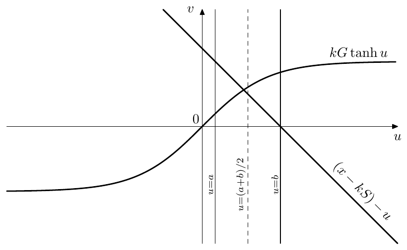

*Figure 6.21: Bisection method.*

Obviously the size of the bracketing range halves on each step and we repeat
the procedure until the bracketing range becomes sufficiently small. The
convergence speed therefore doesn't depend on values of filter's parameters or
signals and the iteration is guaranteed to converge. However we need to be able
to somehow find the initial bracketing range $[a_0, b_0]$.

Fortunately, with monotonic saturation shapes such as $\tanh u$ this is not very
difficult. We can construct the initial bracketing range by noticing that the graph
of the function $v = kG\tanh u$ lies between $v \equiv 0$ and $v = kG\operatorname{sgn} u$ (Fig. 6.22).

With unbounded saturators such as inverse hyperbolic sine one needs to get
slightly more inventive. One possible idea is shown in Fig. 6.23. This however
doesn't work for $k < 0$. In that case we could reuse the approach of Fig. 6.22 by
taking a vertically offset version of (6.5) as a bound on $\sinh^{-1} u$ (Fig. 6.24). The
intersection on $v = (x - kS) - u$ with this bound can be found by solving a
quadratic equation (more on this in Section 6.7). Obviously, the same idea works
for $k \geq 0$ too.

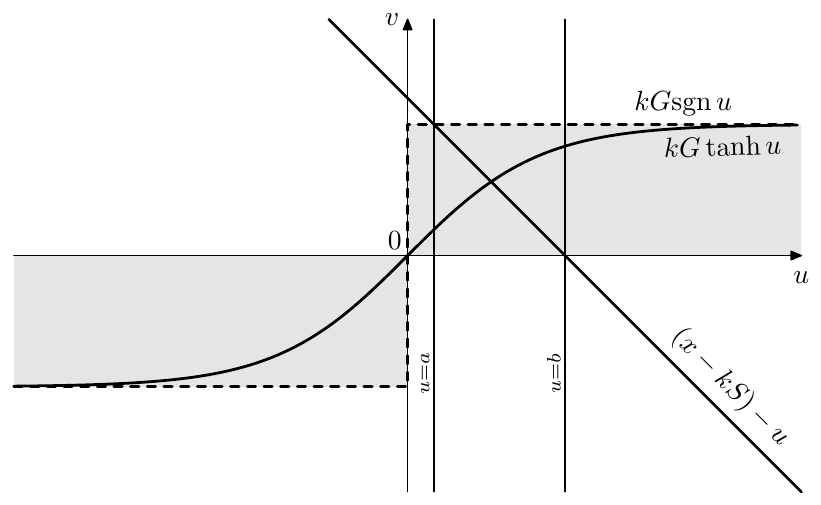

*Figure 6.22: Initial bracketing for bisection.*

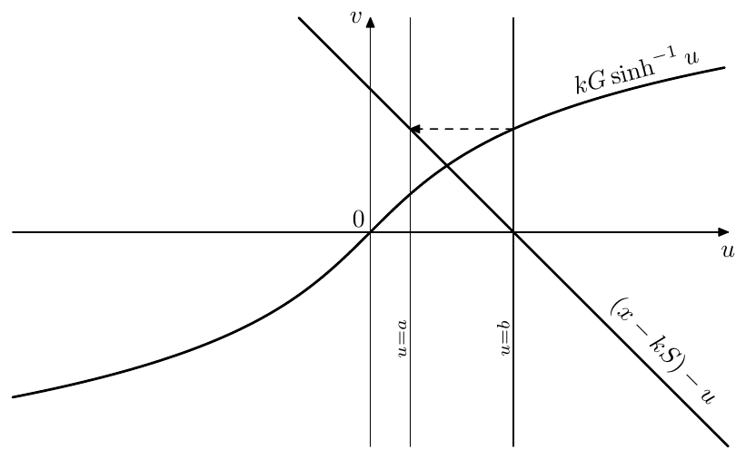

*Figure 6.23: Initial bracketing for bisection in the case of an unbounded saturator and $k \geq 0$. First we find the right bracket $b$ and then use $v = kG\sinh^{-1} b$ to find the left bracket $a$.*

If nothing else helps to find the initial bracketing range for a (monotonic)
nonlinearity $f(u)$, one could simply start at some point, such as e.g. the zero-crossing
of $v = (x - kS) - u$, determine the direction of other bracket by comparing
$v = (x - kS) - u$ to $kG \cdot f(u)$ and then take steps of progressively increasing size
(exponential increasing of steps is usually a good idea) until the comparison result
of $v = (x - kS) - u$ and $kG \cdot f(u)$ flips.

Even though bisection method guarantees convergence, the convergence speed
might be a bit too low for our purposes. Let's assume that the magnitude order of
the signals in the filter is $10^0$ and let's assume that the length of the initial
bracketing segment $[a_0, b_0]$ has about the same order of magnitude. Then, to
reach a $-60$dB SNR[^14] corresponding to the order of magnitude of $10^{-3}$, we'll
need about 10 iterations. This might be a bit too expensive for a realtime audio
processing algorithm on modern computers.[^15]

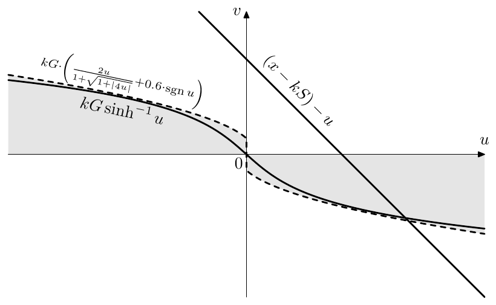

*Figure 6.24: Initial bracketing for bisection in the case of $f(u) = \sinh^{-1} u$ and $k < 0$.*

## 6.6 Approximate methods

We might also attempt to find a rough approximate solution of (6.12) without
running an iterative scheme. Having found $u$, we would simply pretend it's a true
solution, and proceed as usual in the zero-delay feedback solution scheme, sending
$u$ through the tanh waveshaper and further through the 1-pole lowpasses, updating
their state along the way. Several approximation approaches seem to be in (more
or less) common use:

### Linearization at zero

At small signal levels the nonlinearity is almost
transparent:

$$
\tanh u \approx u
$$

Hoping that our signal level is "sufficiently small", whatever that means, we
could replace $\tanh u$ by $u$ and solve the resulting linear equation:

$$
u = x - k(Gu + S)
$$

Note that this is equivalent to one step of Newton-Raphson with $u = 0$ as the
initial guess.

### Linearization at operating point

Hoping that the signals within the filter do
not change much during one sample tick, we replace $\tanh u$ with its tangent line
at the current point:

$$
\tanh u \approx \tanh u_{-1} + (u - u_{-1}) \cdot \tanh' u_{-1}
$$

where $u_{-1}$ is the value of $u$ at the previous discrete time moment. This is
equivalent to one step of Newton-Raphson with $u_{-1}$ as the initial guess.
Usually this approximation provides a better result, however in the excessive
(but not so unusual) situations of high cutoff, high feedback amount and/or
high signal frequencies this can work worse than the linearization at zero.
Thus, the linearization at zero might provide a better "worst case performance".

### Linearization by secant line[^16]

On the graph of $\tanh u$ we draw a straight line
going through the origin $(0, 0)$ and the operating point $(u_{-1}, \tanh u_{-1})$ and
use this line as our linearization to obtain the value of $u$. Being a mixture of
the previous two approaches, in moderately excessive situations this could
work better than the linearization at the operating point, but at more excessive
settings could work worse than the linearization at zero. The readers are
however encouraged to gain their own experience and judgement in the choice
of the initial guess approach.

All the above quick approximation approaches share the same idea of replacing
the nonlinearity with a straight line. In that regard it is important that we have
chosen to solve for the signal $u$ at the saturator's input, so that the signal obtained
through the approximation is then really sent through the nonlinearity before
reaching the 1-poles and the output. One can view this as if, after having obtained
the approximated result, we are doing one step of fixed-point iteration.[^17] Had we
instead chosen to solve for the signal at the saturator's output, the results would
have been more questinable. Particularly, in the case of linearization at zero
there would have been no difference to the linear case whatsoever.

The above approximation approaches work reasonably well with saturation
type of nonlinearities. Obviously, the error increases as $kG$ becomes larger and
thus the system becomes "more non-linear". Notably, $G$, being monotonically
growing in respect to $\omega_c T$, decreases as the sampling rate grows, thus the
approximation error is smaller at higher sampling rates.

## 6.7 2nd-order saturation curves

It is possible to avoid the need of solving the transcendental equation by using a
saturator function which still allows analytic solution. This is particularly the
case with second-order curves, such as hyperbolas. E.g. $f(x) = \tanh x$ can be
replaced by $f(x) = x/(1 + |x|)$ (which consists of two hyperbolic segments),
thereby turning (6.13) into:

$$
(x - kS) - u = kG\frac{u}{1 + |u|} \tag{6.18}
$$

The inverse of $f(x) = \sinh x$ can be replaced by the inverse of
$f(x) = x(1+|x|)$, consisting of two parabolic segments.

In order to solve (6.18), which graphically is an itersection between the
lines $v = (x-kS) - u$ and $v = kG \cdot f(u)$ (same as in Figs. 6.13, 6.14,
6.15), we first need to find out, whether the intersection is occuring at
$u > 0$ or $u < 0$ (the case $u = 0$ can be included into either of the
cases). Looking at Figs. 6.13 and 6.14, it's not difficult to realize that for
$kG > -1$ this is defined solely by the sign of the value which $(x-kS) - u$
takes at $u = 0$. Thus (6.18) turns into

$$
(x-kS) - u = kG\frac{u}{1+u} \qquad \text{if } x - kS \geq 0 \tag{6.19a}
$$

$$
(x-kS) - u = kG\frac{u}{1-u} \qquad \text{if } x - kS \leq 0 \tag{6.19b}
$$

Each of the equations (6.19) is a quadratic equation in respect to $u$.

Choosing the appropriate one of the two solutions of the quadratic equation
is easy. E.g. for (6.19a) the choice can be made with the help of Fig. 6.25.
Taking into account the restriction $x - kS \geq 0$, we see that we should be
alway interested in the larger of the two solutions $u_1$, $u_2$. The choice
of the appropriate solution for (6.19b) can be done using similar
considerations.

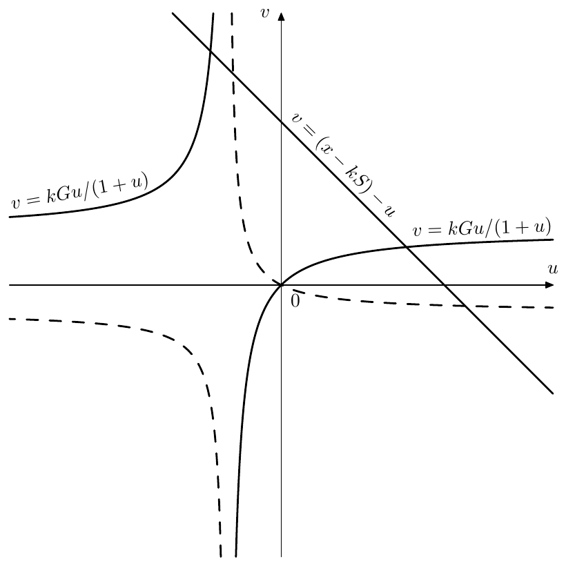

*Figure 6.25: Choice of the solution of the quadratic equation for
$f(u) = u/(1+u)$. The dashed line shows the graph of $v = kGu/(1+u)$ for
$kG < 0$.*

In solving the quadratic equation $Ax^2 - 2Bx + C = 0$ one has not only to
choose the appropriate one of the two roots of the equation, but also to choose
the appropriate one of the two solution formulas:

$$
x = \frac{B \pm \sqrt{B^2 - AC}}{A} = \frac{C}{B \mp \sqrt{B^2 - AC}} \tag{6.20}
$$

Mathematically the two formulas are equivalent, however numerically there is a
precision loss (which may become very strong) if $B \pm \sqrt{B^2 - AC}$
results in addition of two values of opposite sign, or, conversely, subtraction
of two values of the same sign. This consideration yields the following
formulas for the solutions of the quadratic equation:

$$
x_1 = \frac{B + \operatorname{sgn} B \cdot \sqrt{B^2 - AC}}{A} \qquad
x_2 = \frac{C}{B + \operatorname{sgn} B \cdot \sqrt{B^2 - AC}}
$$

### 2nd-order soft clippers of the most general form

We could generalize the previously used idea of turning the nonlinear
zero-delay feedback equation into a quadratic one by considering a waveshaper
made of the most general form of a second-order curve $y = f(x)$ defined
by[^18]

$$
\Phi(x, f(x)) = \Phi(x,y) = ax^2 - 2bxy + cy^2 - 2px - 2qy + r = 0 \tag{6.21}
$$

Equation (6.21) has 6 parameters and 5 degress of freedom. After subtituting
the nonlinearity (6.21) into (6.13), the equation (6.13) turns into

$$
\Phi\left(u, \frac{(x-kS)-u}{kG}\right) = 0
$$

or, equivalently,

$$
\begin{aligned}
k^2 G^2 a u^2 - 2kGbu((x-kS)-u) + c((x-kS)-u)^2 - \\
- 2k^2G^2pu - 2kGq((x-kS)-u) + k^2G^2r = 0
\end{aligned} \tag{6.22}
$$

Obviously, (6.22) is a quadratic equation in respect to $u$. Particularly,
under the "typical soft clipping curve" conditions

$$
f(0) = 0 \qquad f'(0) = 1 \qquad f(\infty) = 1 \qquad f'(\infty) = 0 \tag{6.23}
$$

equation (6.21) turns into a family of hyperbolas: with a single parameter:

$$
\frac{2y_1 - 1}{y_1^2}y^2 - xy + x - y = 0 \tag{6.24}
$$

Four of five freedom degrees in (6.21) has been taken by the conditions
(6.23). The fifth remaining degree is represented by the parameter $y_1$,
which is the value[^19] of $y$ that the curve has at $x = 1$ (Fig. 6.26). A
reasonable choice for the range of $y_1$ is $[0.5, 1]$, where at $y_1 = 0.5$
we obtain the already familiar $y = x/(1+x)$ curve, at $y_1 = 1$ the curve
(6.24) turns into a hardclipper.

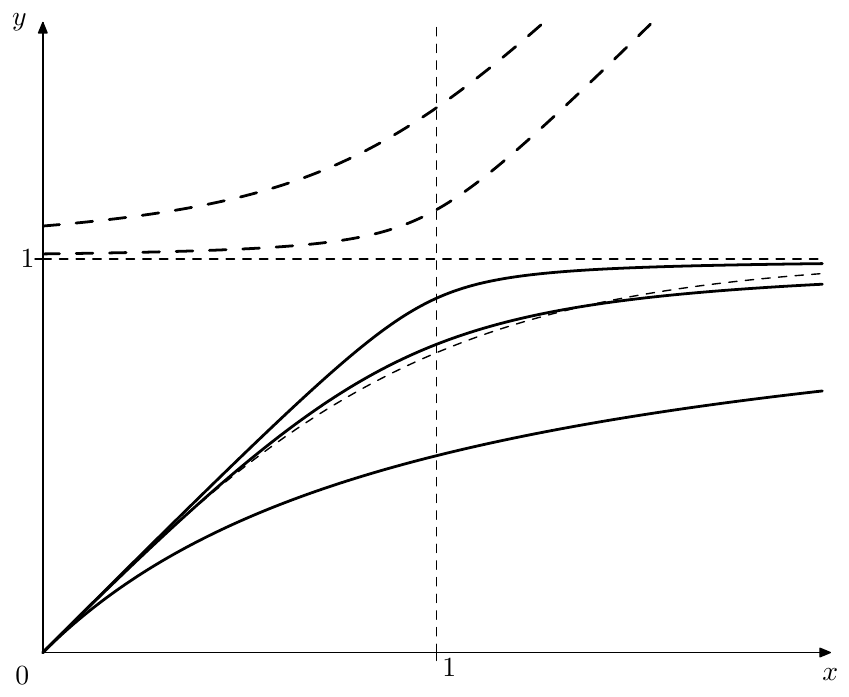

*Figure 6.26: A family of soft clippers generated by (6.24) for
$y_1 = 0.5$, $y_1 = 0.7829$ and $y_1 = 0.9$. The two dashed curves above the
line $y = 1$ are the second (unused) branches of the respective curves (the
second branch for $y_1 = 0.5$ is not visible because it is outside the
picture boundaries). The thin dashed curve close to the main branch of the
curve for $y_1 = 0.7829$ is the hyperbolic tangent $y = \tanh x$.*

By making the odd extension of the curve:

$$
f_{\text{ext}}(x) = \begin{cases} f(x) & \text{if } x \geq 0 \\ -f(-x) & \text{if } x \leq 0 \end{cases}
$$

we obtain a proper soft clipping saturator shape, where we should remember to
pick the appropriate branch of the curve, when solving the quadratic
zero-delay feedback equation (6.22).

This time the selection of the appropriate solution of the quadratic equation
is still simple for $k \geq 0$, where we can just pick the larger of the two
solutions $u_1$, $u_2$, however for $k < 0$ it becomes more complicated (Fig.
6.27). From Fig. 6.27 one can see that our choice of the larger or smaller of
the two solutions is switched once when $kG$ changes sign and once again when
the oblique asymptote of $kG \cdot f(u)$[^20] goes at $-45^\circ$, thereby becoming
parallel to to the line $v = (x-kS) - u$.[^21]

By writing out the expressions for the solutions of the resulting quadratic
equation, one could see that, if we define the choice of the solution in
terms of the choice of the plus or minus sign in (6.20) in front of
$\sqrt{B^2 - AC}$ (which is actually what we care about), then the solution
is switched only when $kG = 0$, at which moment $B^2 - AC = 0$ and
respectively both solutions become equal to each other. The (negative) value
of $kG$, at which the oblique asymptote of $kG \cdot f(u)$ goes at $-45^\circ$,
doesn't correspond to another solution switch but solely to the unused
solution disappearing into the infinity from one side and reappering from
the other.

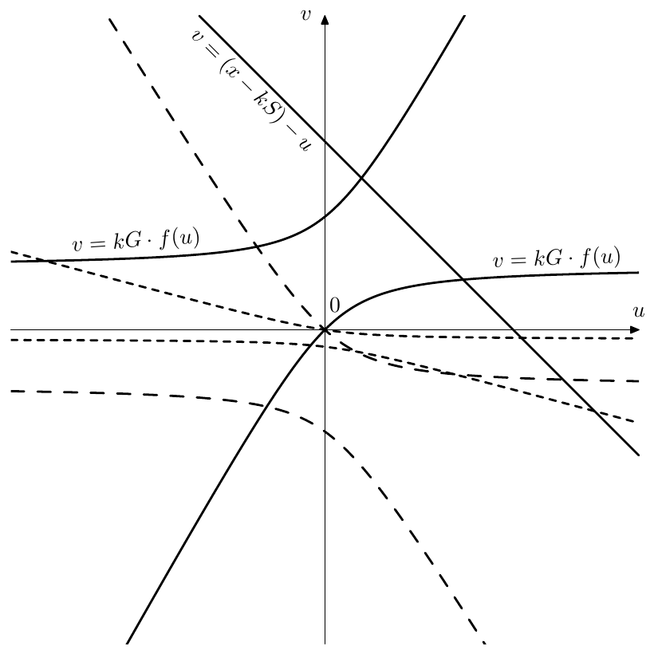

*Figure 6.27: Choice of the solution of the quadratic equation for $f(u)$
which is a member of the family of hyperbolas (6.24). Solid line corresponds
to $kG > 0$, dashed lines correspond to two different values of $kG < 0$.*

### Other 2nd-order saturators

Apparently, mixing in a linear component (6.6) into a saturator defined by
(6.21) still can be expressed in the general form (6.21), thus the
zero-delay feedback equation is still quadratic equation and we can use the
same solution techniques.

Instead of using hyperbolas, we could also use parabolas, such as the one in
(6.5) or its mixture with a linear term. Ellipses, having finite support in
terms of both $x$ and $y$, are not lending themselves for this kind of
usage, unless used in a piecewise approximation, which we discuss later.

## 6.8 Tabulation

Tabulation is one of the standard ways of reducing the computation cost of
functions. Instead of computing the function using some numerical method
(which might be too expensive) we store function values at certain points in
a lookup table. To compute the function value in between the points,
interpolation (most commonly linear) is used.

Tabulation is worth a dedicated discussion in the context of nonlinear
zero-delay feedback equations, because in this case it can be combined with
the bisection method in a special way, making this combination more
efficient. Also the same ideas provide a general framework for applying
piecewise saturation curves in a zero-delay feedback context, even if the
number of segments is so low that using a real table is not practical.

Imagine the saturator function in Fig. 6.13 was represented by tabulation
combined with linear interpolation, which effectively means that we are
having a piecewise-linear function $f(u)$ (Fig. 6.28). In order to solve
(6.13) we first would need to determine the applicable segment of $f(u)$.
Having found the linear segment we just need to solve a linear zero-delay
equation.

*Figure 6.28: The solution of (6.13) for a piecewise-linear saturator.*

From Fig. 6.28 is should be clear that the bisection method for a
piecewise-linear curve can be implemented by simply comparing the values of
$v = (x-kS) - u$ and $v = kG \cdot f(u)$ at the breakpoints $u_n$, thereby
sparing the need for linear interpolation. We would start with some initial
bracketing of the breakpoint range $n \in [L,R]$ and then compare the two
curves at the breakpoint in the middle of the range $u_M$ (where
$M = (L+R)/2$, rounding the result of division by 2 up or down, if
necessary). Depending on the comparison outcome we pick either $[L,M]$ or
$[M,R]$ as the next range. We repeat until we are left with a single
segment, and then simply solve the linear zero-delay feedback
equation.[^22]

The very first and very last linear segments will require special care,
because they do not go from one table point to the other, but extend from
the outermost entries of the table to $u = \pm\infty$. We can either assume
that they horizontally extend from the first and last points in the table,
or store their slope separately.

As a very simple example of the just introduced concepts we could consider a
hard clipper

$$
f(x) = \begin{cases} 1 & \text{if } x \geq 1 \\ x & \text{if } -1 \leq x \leq 1 \\ -1 & \text{if } x \leq -1 \end{cases}
$$

(Fig. 6.29). We don't need a real table to store the breakpoints, but the
same ideas apply. First comparing $v = (x-kS) - u$ and $v = kG \cdot f(u)$ at
$u = 1$ we find out whether the intersection occurs in the right-hand
saturation segment $u \geq 1$. If not, then we perform the same comparison at
$u = -1$, thereby finding out whether the intersection occurs in the
left-hand saturation segment $u \leq -1$. Otherwise the interesection occurs
in the middle segment $-1 \leq u \leq 1$.[^23]

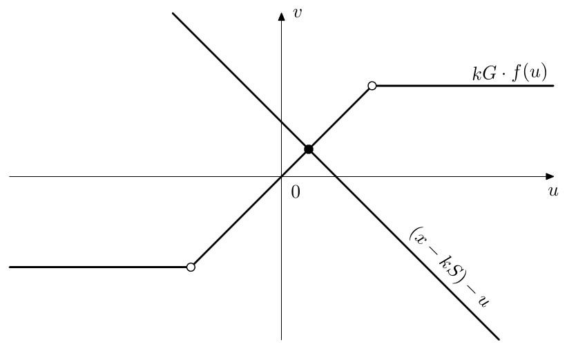

*Figure 6.29: The solution of (6.13) for a hard clipper.*

The tabulation approach is not limited to piecewise-linear segments. We could
e.g. use the 2nd-order segments of the form (6.21). Since the latter have 5
degrees of freedom, we could use 4 of those to specify the values of the
function and its first derivative at the segments ends (like we would do for
a Hermitian interpolating segment and like we did for (6.24)) and use the
5th degree of freedom e.g. to minimize the remaining error. In fact, in
Section 6.7 we have done exactly this, building a piecewise-2nd-order curve
consisting of two segments joined at the breakpoint at the origin. The
saturator (6.2b), consisting of four segments of an order not exceeding 2,
could be another candidate for this approach.

## 6.9 Saturation in 1-pole filters

The feedback in the 1-pole filter is not one creating the resonance.
Therefore the discussion from Section 6.3 does not apply and we need to
address nonlinear 1-poles separately.

We are going now to discuss nonlinear 1-poles with the nonlinearity ideas
derived from different analog variations of the 4-pole lowpass ladder filter
discussed in Section 5.1 These nonlinear 1-pole filters, however, are of
generic nature and are therefore not limited to the usage inside 4-pole
lowpass ladder filters (or inside filters of whatever specific kind, for
that matter).

### Transistor ladder's 1-pole lowpasses

The linear model of transistor ladder discussed in Section 5.1 (Fig. 5.1) is
a first level of approximation of the behavior of the respective analog
structure, where we ignore all nonlinear effects. If we wish to take
nonlinear effects into account, we could replace the underlying linear
1-pole lowpasses of the ladder filter with nonlinear 1-pole lowpasses, the
structure of such nonlinear lowpass being shown in Fig. 6.30. In terms of the
equations, (2.3) is transformed into

$$
y = y(t_0) + \int_{t_0}^t \omega_c\bigl(\tanh x(\tau) - \tanh y(\tau)\bigr)\,dt \tag{6.25}
$$

The lowpass in (6.25) and Fig. 6.30 is a simple nonlinear model of the
underlying 1-pole lowpass of the transistor ladder, directly arising out of
the application of Ebers-Moll transistor model.[^24]

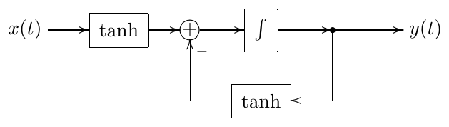

*Figure 6.30: A nonlinear 1-pole lowpass element of the transistor ladder
filter.*

Which effect does the change from (2.3) to (6.25) have? Apparently,
$\tanh x - \tanh y$ has a smaller absolute magnitude compared to $x - y$, the
drop in magnitude becoming more noticeable of one or both of the signals $x$
and $y$ is sufficiently high. If both $x$ and $y$ have large values of the
same sign, it's possible that the difference $\tanh x - \tanh y$ is close to
zero, even though the difference $x - y$ is very large. This means that the
filter will update its state more slowly than in (2.3). Intuitively this
feels like "cutoff reduction" at large signal levels, or, more precisely
this can be seen as audio-rate modulation of the cutoff, where the cutoff is
being changed by the factor

$$
K = \frac{\tanh x - \tanh y}{x - y} \qquad 0 < K \leq 1
$$

where the equality $K = 1$ is attained at $x = y = 0$.

Connecting 1-poles from Fig. 6.30 in series (Fig. 6.31) can be optimized by
noticing that we don't need to compute the tanh of the output of the first
integrator twice (Fig. 6.32), thus sparing one tanh saturator. The entire
ladder filter thereby turns into one in Fig. 6.33.

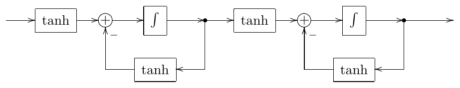

*Figure 6.31: Serial connection of two nonlinear 1-pole lowpass el-
ements from Fig. 6.30.*

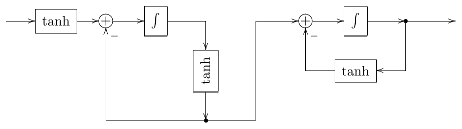

*Figure 6.32: Optimized serial connection of two nonlinear 1-pole
lowpass elements from Fig. 6.31.*

The nonlinear 1-pole in Fig. 6.33 are normally sufficient to prevent the
filter from explosion in selfoscillation range. However, obviously, there is
nothing which should stop us from introducing additional nonlinearities,
such as the ones discussed in Section 6.3, not so much as a means from
preventing the filter explosion but rather for giving additional color to
the sound. Apparently feedfoward path of Fig. 6.33 already contains many
nonlinear elements, therefore adding nonlinearities to the feedback path
could make more sense. Note that while there are good reasons to keep the
saturation levels of nonlinearities in the feedfoward path of Fig. 6.33
(especially since we are employing the optimization from Fig. 6.32, which
shares one nonlinearity between two 1-pole lowpasses), there is much less
reason to have the same saturation level (or even the same saturation
curve) for the nonlinearity in the main feedback path.

The nonlinear version of the diode ladder filter (Figs. 5.48, 5.49) is using
a similar kind of nonlinear 1-poles, resulting in a structure shown in Fig.
6.34.

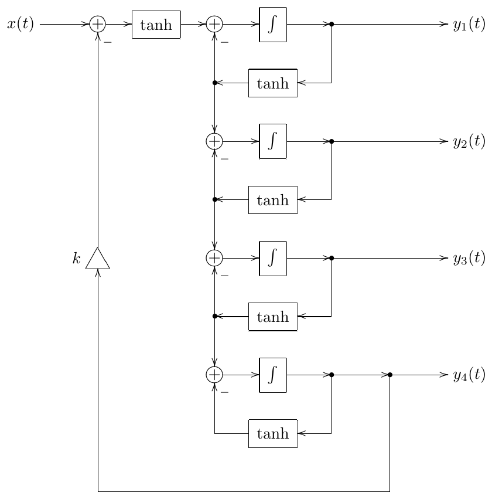

*Figure 6.33: Nonlinear transistor ladder filter.*

The equations (5.18) are respectively turned into:

$$
\begin{aligned}
\dot y_1 &= \omega_c\bigl(\tanh x - \tanh(y_1 - y_2)\bigr) \\
\dot y_2 &= \frac{\omega_c}{2}\bigl(\tanh(y_1 - y_2) - \tanh(y_2 - y_3)\bigr) \\
\dot y_3 &= \frac{\omega_c}{2}\bigl(\tanh(y_2 - y_3) - \tanh(y_3 - y_4)\bigr) \\
\dot y_4 &= \frac{\omega_c}{2}\bigl(\tanh(y_3 - y_4) - \tanh y_4\bigr)
\end{aligned}
$$

(compare to (6.25)).

### OTA ladder 1-poles

The same idea of the ladder filter discussed in Section 5.1 and shown in
Fig. 5.1 has been often implemented in analog form using OTA (operational
transconductance amplifiers) instead of transistors. This generates another
kind of nonlinear 1-pole structure (Fig. 6.35).

Formally we are having a feedback loop saturator here. However this feedback
loop is not responsible for generating the resonance, therefore the effect
of the saturator is different from the one discussed in Section 6.3. We are
having a saturator at the integrator's input, therefore we are performing
soft clipping
on the speed of change of the filter's output value, or, equivalently, we are
doing "soft slew limiting". Alternatively, as shown by (6.8), this can be seen
as audio-rate cutoff modulation, the cutoff factor varying in agreement with
(6.9).

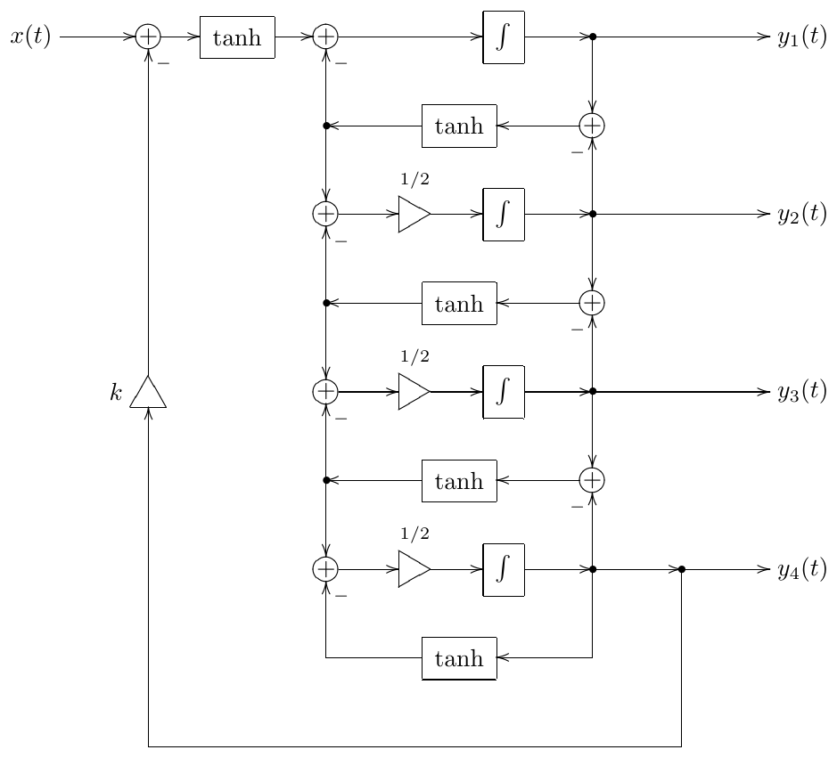

*Figure 6.34: Nonlinear diode ladder filter.*

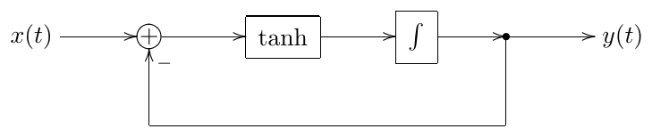

*Figure 6.35: OTA-style nonlinear 1-pole lowpass.*

Note that we have two different options for picking the highpass signal in
Fig. 6.35. We could do this either before or after the nonlinearity. In the
latter case the highpass signal will be saturated (which might be a bit over
the top, compared to the lowpass signal), in the former case we have the
benefit of preserving the relationship $H_{\mathrm{LP}}(s) + H_{\mathrm{HP}}(s) = 1$.
This also makes the former option look like a particulary good candidate not
only for a nonlinear 1-pole highpass (and thereby, among other things, for
ladder filter structures utilising highpasses) but also for a nonlinear
allpass. Fig. 6.36 shows the respective nonlinear 1-pole multimode.

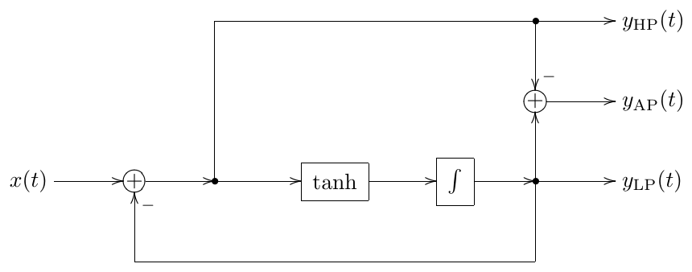

*Figure 6.36: OTA-style nonlinear 1-pole multimode.*

### Saturated integration

The previously discussed ways of introduction of nonlinearities into 1-poles
resulted in relatively complicated nonlinear behavior of the filters. But what
if we want a simpler behavior? Let's say we want to simply saturate the
output. Of course we simply could put a saturator at the output of the filter
(Fig. 6.37) but this doesn't really feel like making the filter itself
nonlinear.

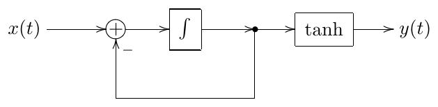

*Figure 6.37: Putting a saturator at the filter's output.*

We could try putting the output nonlinearity inside the filter's feedback loop
(Fig. 6.38). However, comparing this to equation (2.3) we should realize that
the main effect of such nonlinearity will be that the difference $x - y$ will
be changed to $x - \tanh y$, leading to the capacitor in Fig. 2.1 continuing
to charge even after the output value has reached the input value. In other
words, the output will still grow even after reaching the input value. This
feels more like a mistake.

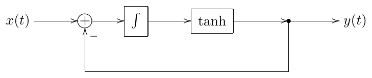

*Figure 6.38: Saturating the integrator's output (not really a working idea).*

What we rather want is to prevent the 1-pole's capacitor in Fig. 2.1 from
charging beyond a certain level (that is we want to prevent the integrator
state from going beyond a certain maximum). In order to achieve that in a
"proper analog way", we will need to introduce antisaturators, which we are
going to do later in this chapter. However we could also do a "hack" and
modify the integrator structure, introducing the saturation into its internal
accumulation process. This works particularly well with direct form I
(Fig. 6.39) and transposed direct form II (Fig. 6.40) integrators. Obviously,
this hack is not limited to 1-poles, but can be applied to any structure which
is based on integrators, such as e.g. SVF.

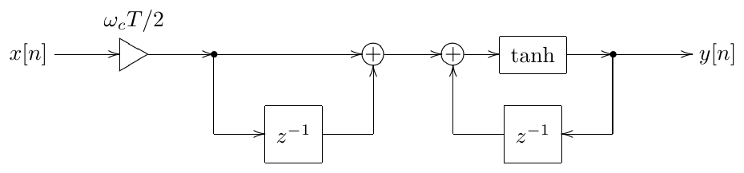

*Figure 6.39: Saturating direct form I trapezoidal integrator.*

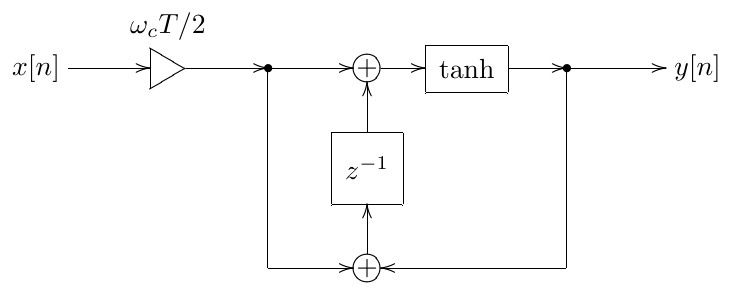

*Figure 6.40: Saturating transposed direct form II trapezoidal integrator.*

## 6.10 Multinonlinear feedback

We have seen that instantaneous responses of linear filters are linear
functions of their input, such as e.g. in (3.29). It is not difficult to
realize, particularly from the previous discussion of the solution of the
nonlinear zero-delay feedback equation (6.12), that instantaneous response of
a nonlinear filter is some nonlinear function of its input:

$$
y = F(x, S) \tag{6.26}
$$

(where we also explicitly notated the dependency on the filter's state $S$,
but the dependency of $F$ on the filter's parameters is understood
implicitly).

Consider the OTA-style 1-pole lowpass in Fig. 6.35 and imagine we build a
4-pole lowpass ladder filter (as in Fig. 5.1) from four idenitical 1-pole
lowpasses of this kind. Assuming (6.26) decribes the instantaneous response of
Fig. 6.35, we could redraw Fig. 5.1 in the instantaneous response form as
Fig. 6.41.

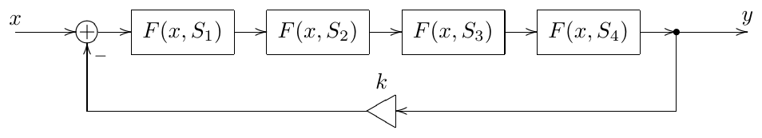

*Figure 6.41: Nonlinear ladder filter in the instantaneous response form.*

Let $u$ denote the signal at the input of the first 1-pole lowpass in
Fig. 6.41. The zero-delay feedback equation for the entire of Fig. 6.41
therefore becomes

$$
u = x - k \cdot F(F(F(F(u, S_1), S_2), S_3), S_4) \tag{6.27}
$$

Intuitively we can expect $F(x, S)$ to be monotonically increasing with
respect to $x$, thus $F(F(F(F(x, S_1), S_2), S_3), S_4)$ should be
monotonically increasing too, and we could use most of the previously
described methods of solving nonlinear zero-delay feedback equations to solve
(6.27). Theoretically.

Practically the evaluation of $F(x, S)$ is usually very expensive, because it
means a numerical solution of the zero-delay feedback equation for the
respective 1-pole, possibly running several rounds of an iterative method.
Now, if we are going to use an iterative method to solve (6.27), these
expenses will be multiplied by the number of the "outer" iterations. Besides,
if we are using Newton-Raphson to solve (6.27) then we need not only to
evaluate $F(x, S)$ but also its derivative with respect to $x$, which further
increases the computation cost of solving (6.27).

Therefore usually such "nesting" approach, where we express the higher-level
zero-delay feedback equation in terms of the solutions of the lower-level
zero-delay feedback equations, is not very practical for nonlinear systems.
Instead, let's "flatten" the entire structure, and write the equation
describing the instantaneous response signals within this structure. E.g. for
the 4-pole ladder built out of 1-poles in Fig. 6.35 the flattened structure is
shown in Fig. 6.42. Or, representing the integrators by their instantaneous
responses (which are fully linear), we obtain Fig. 6.43.

Denoting the input and output signals of each of the 1-poles as $x_n$ and
$y_n$, we write the 1-pole zero-delay feedback equations:

$$
y_n = g\tanh(x_n - y_n) + s_n
$$

Or, since $x_{n+1} = y_n$ we can denote the input of the first lowpass as
$y_0$ and write

$$
y_n = g\tanh(y_{n-1} - y_n) + s_n \qquad n = 1, \ldots, 4
$$

Plus, we are having the global feedback loop:

$$
y_0 = x - ky_4
$$

and thus we are having an equation system:

$$
y_0 = x - ky_4
$$

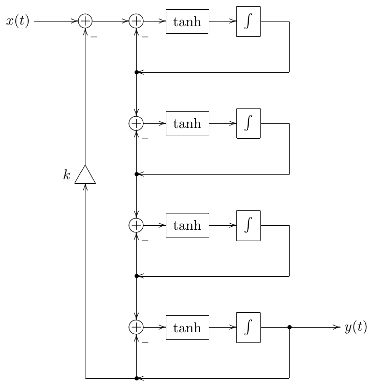

*Figure 6.42: Flattened OTA lowpass ladder filter structure.*

$$
\begin{aligned}
y_1 &= g\tanh(y_0 - y_1) + s_1 \\
y_2 &= g\tanh(y_1 - y_2) + s_2 \\
y_3 &= g\tanh(y_2 - y_3) + s_3 \\
y_4 &= g\tanh(y_3 - y_4) + s_4
\end{aligned}
$$

We can get rid of the first equation by simply substituting its right-hand
side for $y_0$, obtaining:

$$
\begin{aligned}
y_1 &= g\tanh(x - ky_4 - y_1) + s_1 \\
y_2 &= g\tanh(y_1 - y_2) + s_2 \\
y_3 &= g\tanh(y_2 - y_3) + s_3 \\
y_4 &= g\tanh(y_3 - y_4) + s_4
\end{aligned} \tag{6.28}
$$

Equation (6.28) can be written in a more concise form by introducing the
vector

$$
\mathbf{y} = \begin{pmatrix} y_1 & y_2 & y_3 & y_4 \end{pmatrix}^{\mathsf{T}}
$$

and the vector-function of a vector argument $\Phi$:

$$
\Phi(\mathbf{y}) = \begin{pmatrix}
g\tanh(x - ky_4 - y_1) + s_1 \\
g\tanh(y_1 - y_2) + s_2 \\
g\tanh(y_2 - y_3) + s_3 \\
g\tanh(y_3 - y_4) + s_4
\end{pmatrix}
$$

In this notation (6.28) looks simply like

$$
\mathbf{y} = \Phi(\mathbf{y}) \tag{6.29}
$$

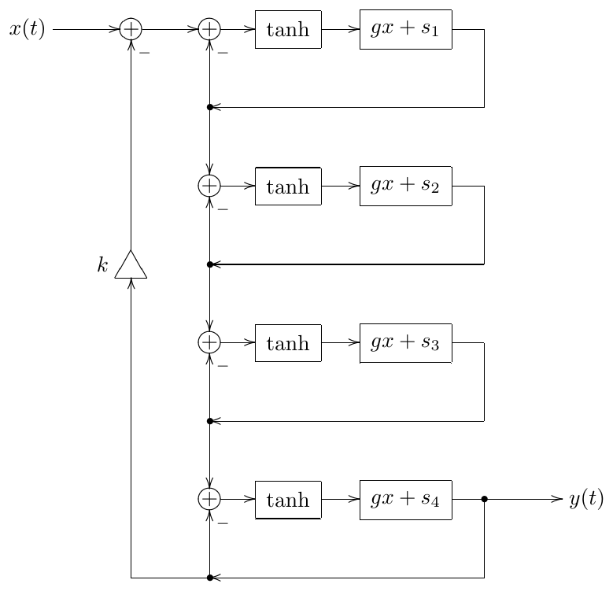

*Figure 6.43: Flattened OTA lowpass ladder filter structure in the
instantaneous response form.*

This is our nonlinear 4-dimensional (since we are having 4 unknowns $y_n$)
zero-delay feedback equation.

The form (6.29) readily offers itself for fixed-point iteration. By rewriting
(6.29) as

$$
\Phi(\mathbf{y}) - \mathbf{y} = 0
$$

the multidimensional form of Newton-Raphson algorithm can be used:

$$
\mathbf{y}_{n+1} = \mathbf{y}_n - \left(\frac{\partial(\Phi(\mathbf{y}) - \mathbf{y})}{\partial \mathbf{y}}(\mathbf{y}_n)\right)^{-1} \cdot (\Phi(\mathbf{y}_n) - \mathbf{y}_n)
$$

Also the quick approximate methods of Section 6.6 work out of the box.

The difference of solving (6.29) instead of (6.27) is that in (6.29) we are
simultaneously solving all zero-delay feedback equations in the system,
thereby not having the problem of nested iterations.

Actually, choosing the 1-pole output signals as the unknowns is not
necessarily the best choice. It would have been more convenient to solve for
the inputs of the integrators, so that we can directly reuse the obtained
signals to update the integrator states.[^25] On the other hand, e.g. for the
transposed direct form II integrator (Fig. 3.11) one could deduce the new
state from the old state and the new output signal, thus $y_n$ also work
pretty efficiently (this trick has been used in the digital implementation of
an SVF in Section 4.4). A consideration of a bigger importance therefore could
be that the choice of the unknowns may affect the convergence of the
iteration scheme.

Usually for multidimensional zero-delay feedback cases the iterative methods
need to be further refined and/or a combination of different methods need to
be used to have a reliable and quick convergence of an iterative process of
finding the solution of (6.29). However, often simply using the approximate
methods of Section 6.6, will deliver reasonable results.

## 6.11 Antisaturators

In Section 6.9 we made some attempts to make the 1-pole lowpass filter state
saturate, the most successful attempt being the modification of the internals
of an integrator. In a real analog circuit we wouldn't have been able to do
the same, as e.g. a capacitor, which is used as an integrator for the
current, doesn't have "built-in saturation functionality". Therefore
different means have to be used to achieve the integrator state's saturation.

### Diode clipper

A common trick is to shorten the 1-pole filter's capacitor with a nonlinear
resistance, this resistance being high at low voltages and dropping down at
high voltages on the capacitor. That is the short path is disabled at low
voltages but progressively "turns on" at higher voltages. This can be done by
using a diode pair (Fig. 6.44). The structure in Fig. 6.44 is commonly
referred to as *diode clipper*.

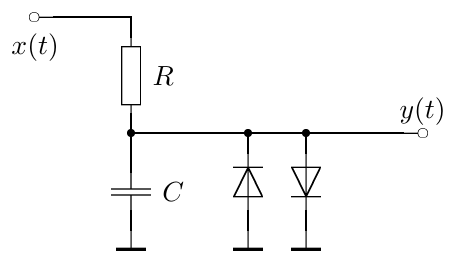

*Figure 6.44: Diode clipper.*

Using Shockley diode equation we can show that, qualitatively, the current
flowing through the diode pair is related to the capacitor voltage as

$$
I_D = I_s \sinh \frac{U_C}{U_T}
$$

where $I_s$ and $U_T$ are diode parameters (Fig. 6.45 provides a graph of
sinh as a reference). This current is then subtracted from the current which
is charging the capacitor, thus acting as current leakage:

$$
\dot{q}_C = I - I_D = I - I_s \sinh \frac{U_C}{U_T}
$$

(please refer to equations (2.1) for the other details of the circuit's
model). Since $I_s$ is very small, as long as $U_C$ is below or comparable to
$U_T$ the leakage is negligible. As $U_C$ exceeds $U_T$, the current grows
exponentially and quickly stops being negligible.

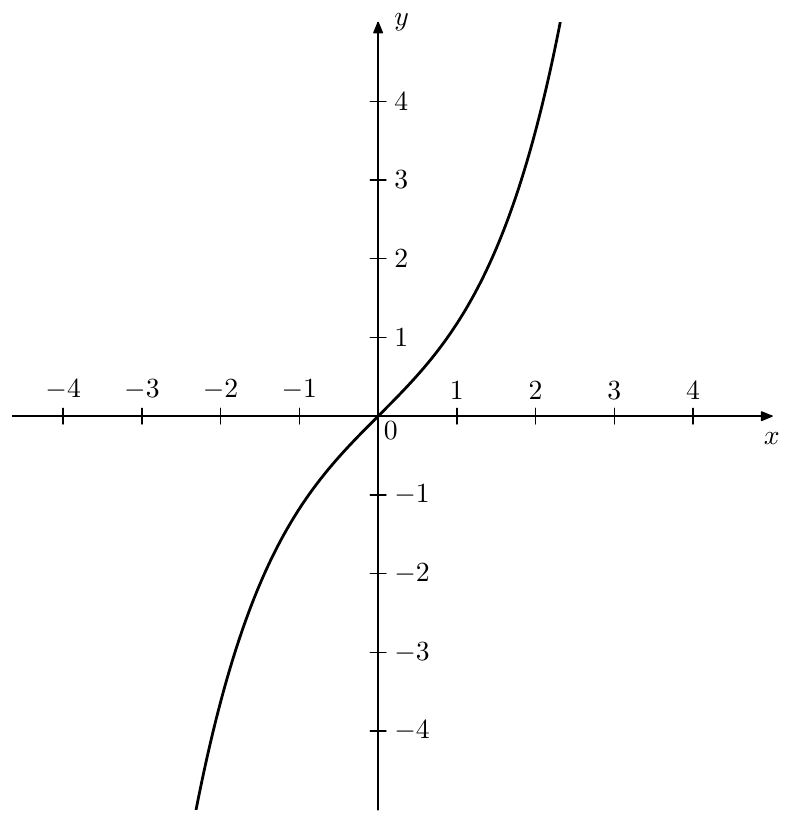

*Figure 6.45: Hyperbolic sine $y = \sinh x$.*

In terms of the block diagram (Fig. 2.2) this current leakage can be
expressed as shown in Fig. 6.46, where we have assumed that the filter cutoff
is controlled by the resitance $R$ rather than capacitance $C$ and thus the
amount of the current leakage is independent of the cutoff.

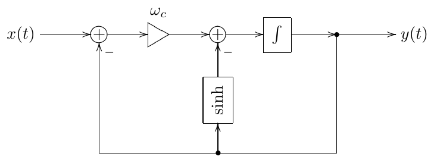

*Figure 6.46: Diode clipper in the form of a block diagram.
"sinh" stands for some curve of the form "$a\sinh(x/b)$".*

The fact that the leakage current is independent of the cutoff is actually
having the opposite effect: the effects of the leakage become
cutoff-dependent and the leakage more strongly affects the filter at lower
cutoffs. Particularly, given a constant input voltage, the stabilized output
level will be larger at larger cutoffs. For the purposes of generic
application it is therefore more useful to make the leakage
cutoff-independent, as in Fig. 6.47.

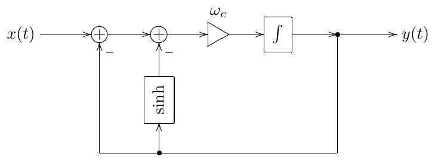

*Figure 6.47: Diode clipper with cutoff-independent leakage.
"sinh" stands for some curve of the form "$a\sinh(x/b)$".*

Or, using implied cutoff notation and combining the two feedback paths into a
single one, we obtain the structure Fig. 6.48. Also, in Fig. 6.47 the cutoff
parameter $\omega_c$ was not the true cutoff of the system, since at low
signal levels the gain of the feedback path was $1 + a/b$. This made the
system behave as if its cutoff was $(1 + a/b)\omega_c$ and as if its input
signal was reduced by $(1 + a/b)$ factor at the same time. In Fig. 6.48 we
addressed this issue by scaling the linear path of the feedback by the factor
$(1 - a/b)$. This doesn't change the qualitative behavior of the system, but
affects only the interpretation of the cutoff $\omega_c$ and the input signal
scale.

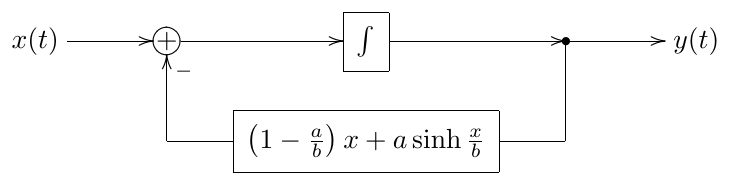

*Figure 6.48: Diode clipper with cutoff-independent leakage (simplified
diagram).*

The structure in Fig. 6.48 is a good illustration of the idea that we could
employ to introduce saturation into 1-pole lowpass filter's state: as
$\sinh(x/b)$ grows exponentially for large signals, the term $a\sinh(x/b)$
causes the negative feedback to grow as well, thereby causing the integrator
to "discharge".

The same effect is obviously obtained by putting any other quickly growing
function of a similar shape into the feedback path of a 1-pole lowpass. Good
options for such functions are provided by the inverses of the saturator
functions introduced in Section 6.2:

$$
\begin{aligned}
y &= \tanh^{-1} x = \frac{1}{2}\ln\frac{1+x}{1-x} && \text{(inverse of (6.1))} \\
y &= x/(1 - |x|) && \text{(inverse of (6.2c))} \\
y &= \sinh x && \text{(inverse of (6.4))} \\
y &= x(1 + |x|) && \text{(inverse of (6.5))}
\end{aligned}
$$

A particularly important feature of the inverses of the saturators is that, same
as with saturators, they are transparent at low signal levels, thereby not
affecting the cutoff of the filter.

We will refer to the waveshapers having an inverse saturator kind of shape as
*antisaturators*. Fig. 6.49 shows another version of Fig. 6.48, this time using
a simpler antisaturator.

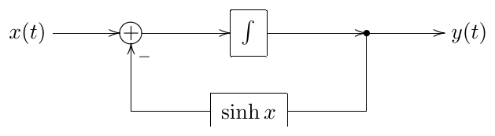

*Figure 6.49: Lowpass filter's state saturation by using an antisaturator.*

An antisaturator in Fig. 6.49 is having a similar effect on the filter's state
saturation as its inverse (the respective saturator) would have had if directly
applied to a signal, or if being put in a resonating feedback path. Specifically,
using an unbounded saturator's inverse as an antisaturator in Fig. 6.49 would
result in an unbounded saturation of the filter's state, in the sense that by
making the amplitude of the input signal of the filter larger and larger one can
achieve arbitrarily large levels of the filter's state. On the other hand, using
a bounded saturator's inverse as an antisaturator (such as e.g. $\tanh^{-1}$)
would result in bounding of the filter state, the state not being able to exceed
the saturation level.

As with saturators, adding a linear term to an antisaturator $f(x)$ doesn't
change its antisaturating behavior, but simply weakens it a bit further, where we
assume that the addition should be done under the same considerations of keeping
the transparency at low signal levels:

$$
y = (1 - \alpha)f(x) + \alpha x \qquad (0 < \alpha < 1)
$$

The antisaturator in Fig. 6.48 is a kind of a reverse example of this principle,
which can be seen as if the (otherwise fully linear and transparent) shape $y = x$
was modified by an addition of a non-transparent antisaturator $a\sinh(x/b)$,
however the resulting curve has been made transparent again.

### Antisaturation in SVF

As with 1-pole filters, the feedback in SVF is also not one creating the
resonance, respectively the discussion from Section 6.3 does not apply either,
and thus we can't simply put a saturator into the feedback loop. Actually, the
purpose of the feedback in SVF is kind of an opposite of creating the resonance.
The function of the feedback path containing the bandpass signal is to dampen the
otherwise self-oscillating structure. This suggests the idea that if we put an
antisaturator into the bandpass signal path, this might actually do the trick of
preventing the signal levels from getting too high.

Our first attempt to do so is shown in Fig. 6.50. After thinking a bit we,
however, realize that it can't work. Indeed, at $R = 0$ there is no damping
signal whatsoever, the same as without the antisaturator. Furthermore, probably
the main reason to introduce the antisaturator into the SVF is so that we could
go into the selfoscillation range $R < 0$, same as we did e.g. with nonlinear
4-pole ladder by going into the range $k > 4$. However, at $R < 0$ the introduced
antisaturator doesn't cause any damping either, quite on the opposite, it
amplifies the "antidamping" (the inverted damping signal). Obviously, putting the
antisaturator after the $2R$ gain element instead of putting it before doesn't
change much in this regard.

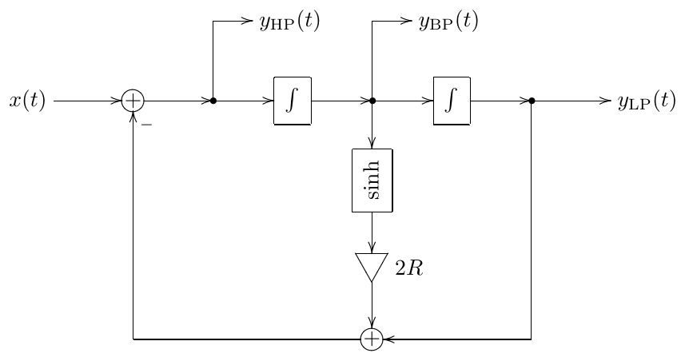

*Figure 6.50: An attempt to introduce an antisaturator into an SVF (not really
working).*

We could get a bit smarter and connect a saturator in parallel with the $2R$ gain
element (Fig. 6.51). This now does the job of saturating the signals, as the
damping feedback signal will grow exponentially at large levels of $y_{\mathrm{BP}}$,
no matter what the value of $R$ is. However now the effective gain of the damping
feedback path (at low signal levels, where $\sinh x \approx x$) is $2R + 1$,
rather than $2R$.

The latter problem is fixed in Fig. 6.52. In this structure, at the neutral
setting of $R = 1$ the entire damping signal goes through the antisaturator. This
exactly matches the same situation in our first attempt in Fig. 6.50 (and is the
reason for the separation of the multiplication by 2 into an additional gain
element). As $R$ gets away from 1, we send some of the damping signal through the
parallel linear path, still keeping the total gain of the damping path equal to
$2R$ at low signal levels.

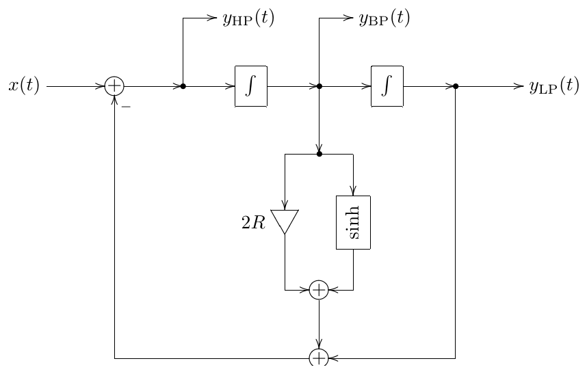

*Figure 6.51: A second attempt to introduce an antisaturator into an SVF (works
better, but $R$ does no longer directly correspond to damping).*

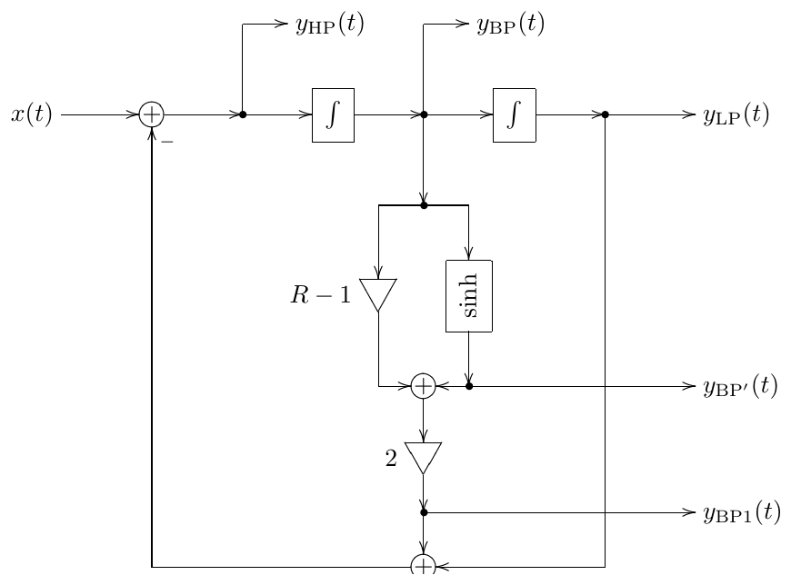

*Figure 6.52: An SVF with antisaturator.*

The antisaturator in Fig. 6.52 effectively makes the state of the first
integrator saturate. This might result in the feeling that the level of the
bandpass signal $y_{\mathrm{BP}}$ becomes too low. Therefore, instead one could
pick the bandpass signal from $y_{\mathrm{BP}'}$ output, where the antisaturator
has increased the level of $y_{\mathrm{BP}}$ back. The $y_{\mathrm{BP}1}$ output
provides the normalized bandpass signal.

Note that $y_{\mathrm{HP}} + y_{\mathrm{BP}1} + y_{\mathrm{LP}} = x$, as for the
linear SVF.

### Zero-delay feedback equation with antisaturators

The introduction of antisaturators raises some new considerations for the
solution of the zero-delay feedback equation. We will use the nonlinear 1-pole in
Fig. 6.49 as a demonstration example, however it will also be more instructive to
consider an inverse hyperbolic tangent (Fig. 6.53) instead of a hyperbolic sine as
an antisaturator.

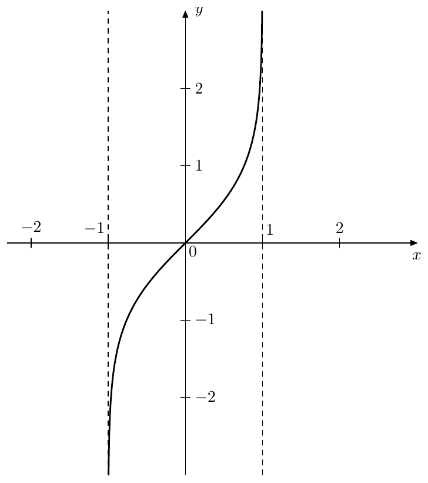

*Figure 6.53: Inverse hyperbolic tangent $y = \tanh^{-1} x$.*

Introducing the instantaneous response $gx + s$ for the integrator in Fig. 6.49
and replacing $\sinh$ with $\tanh^{-1}$ we obtain Fig. 6.54. Writing the
zero-delay feedback equation for Fig. 6.54 we obtain

$$
y = g(x - \tanh^{-1} y) + s \tag{6.30}
$$

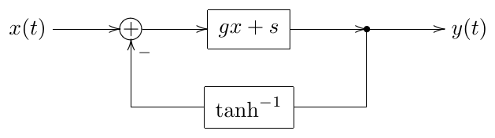

*Figure 6.54: Lowpass filter with a $\tanh^{-1}$ antisaturator in the
instantaneous response form.*

We could start solving (6.30) using the usual methods, such as the ones discussed
earlier in this chapter, however notice that $\tanh^{-1}$ has a limited support,
being defined only on the $(-1, 1)$ range. This might create serious problems if
we somehow arrive at a value of $y$ outside of that range. Such values of $y$
could appear for a number of reasons, such as e.g.:

- from an approximate solution
- from an iterative method's step
- from numerical errors, such as roundoffs.[^26]

Even if we formally stay within the range $y \in (-1, 1)$, we could still get out
of the range of representable values of $\tanh^{-1} y$ if $\tanh^{-1} y$ gets too
large.

There are also related questions of convergence of iterative schemes,
particularly of fixed point iteration. Last but not least, close to the
boundaries of the range $y \in (-1, 1)$ a small numerical error in the value of
$y$ will result in a huge error in the value of $\tanh^{-1} y$, which suggests
that *it might be generally a bad idea to explicitly evaluate* $\tanh^{-1} y$
*at all*. Similar issues also of course arise with unbounded antisaturators,
even though they are not as bad as with bounded ones.

In order to avoid this kind of problems, we can solve for the antisaturator's
output, rather than for the antisaturator's input. Introducing variable $u$ for
the antisaturator's output signal:

$$
u = \tanh^{-1} y
$$

we respectively have $y = \tanh u$ and can rewrite (6.30) in terms of $u$ as

$$
\tanh u = g(x - u) + s
$$

or, further rewriting it so that the linear function in the right-hand side is
more explicitly visible

$$
\tanh u = (gx + s) - gu \tag{6.31}
$$

Equation (6.31) looks very much like the previously discussed zero-delay feedback
equation (6.13). However, there are still important differences. Expressing the
left- and right-hand sides of (6.31) graphically in Figs. 6.55 and 6.56, we see
that, compared to Figs. 6.13, 6.14 and 6.15, multiple solutions can occur already
for $g < 0$. Fortunately, in Fig. 6.54 the value of $g$ cannot get negative, since
that would require a negative cutoff value for the integrator.

Having found $u$ from (6.31) we can "send" it further through the feedback loop,
first finding the integrator's input value as $x - u$, then updating the
integrator's state and finding $y$ as the output value of the integrator. Note
that thereby we *never* explicitly evaluated $\tanh^{-1} y$.

For an antisaturator in the SVF (Fig. 6.52) the situation is more complicated. We
would like to solve for the antisaturator's output $y_{\mathrm{BP}'}$, but then we
would be stuck immediately afterwards: since we don't know the signal on the
"$R - 1$" path, we can't add the output signals from $\sinh$ and $R - 1$.
Furthermore, we would have a similar problem of not knowing $y_{\mathrm{LP}}$ at
the next adder (which computes $y_{\mathrm{BP}1} + y_{\mathrm{LP}}$). These
problems are not unexpected, considering that we have been solving for a point in
the signal path which is not shared among all zero-delay feedback loops in the
structure.

One way around this would be to try to introduce more unknowns into the system
and solve several equations at once. However, in this specific case we could
simply "send the obtained signal through the antisaturator in the reverse
direction". That is, knowing the antisaturator's output, we can obtain the
antisaturator's input by evaluating $\sinh^{-1}$ (which is completely okay, we
don't want to explicitly evaluate the antisaturator function because it can
increase the computation error by a huge factor, but it is no problem to
evaluate its inverse), thereby finding the value of $y_{\mathrm{BP}}$. The
signal $y_{\mathrm{BP}}$ is shared among all zero-delay feedback loops and
therefore is sufficient to find all other signals in the structure.[^27]

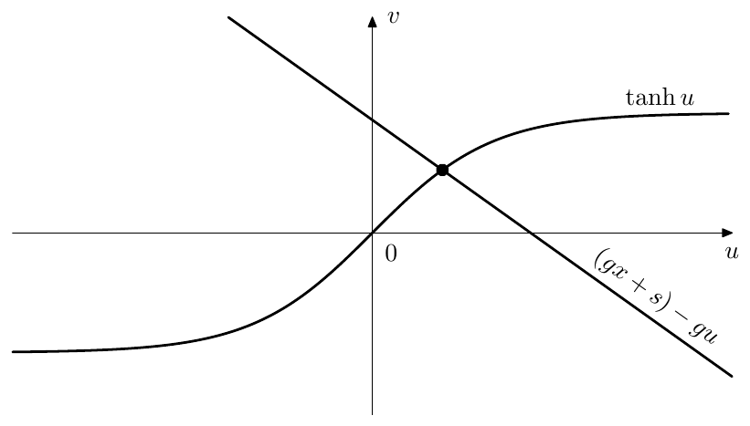

*Figure 6.55: The solution of (6.31) for $g > 0$.*

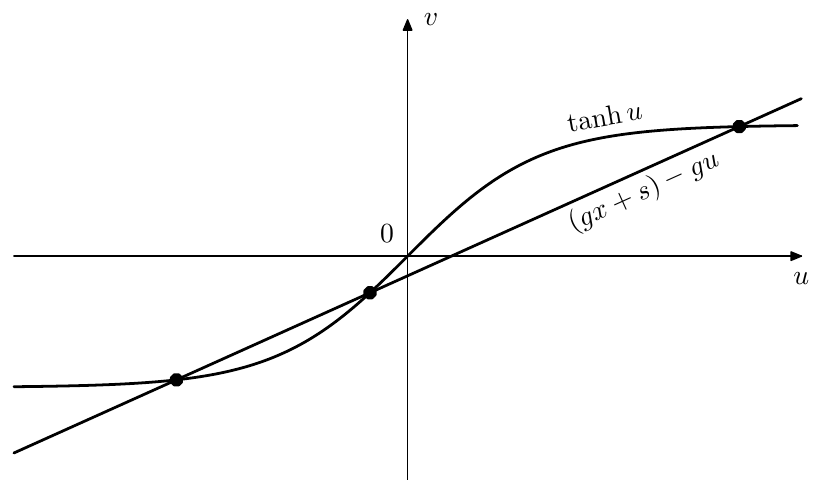

*Figure 6.56: The solution of (6.31) for $g < 0$.*

The general approach of avoiding the explicit evaluation of antisaturators but
rather dealing with their inverses instead also allows us to deal with a certain
class of antisaturators which are not functions in the normal sense. An example
of this are compact-range monotonic saturators such as (6.2b). The inverse of
such saturator is not really a function, since it would have infinitely many
different values at $x = \pm 1$ (Fig. 6.57). However we still can use it as an
antisaturator, since we never have to deal with the antisaturating function
explicitly, but are dealing with the respective saturating function instead.[^28]

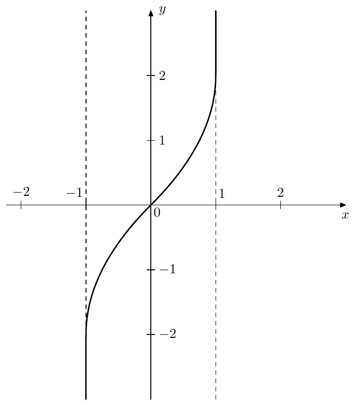

*Figure 6.57: The inverse of (6.2b) is not a function in the normal sense.*

## 6.12 Asymmetric saturation

The saturators which we have been using so far were all having the odd symmetry
$f(-x) = -f(x)$. A feature of all symmetric saturators is that when its input
signal amplitude is very high, the output signal basically alternates between
positive and negative saturation levels $f(x)$. If the input signal is something
like a sine or a sawtooth, the saturator would produce a square-like output. More
generally, such saturators tend to produce signals containing mostly odd
harmonics (as the square wave does).

Sometimes this domination of odd harmonics can become too boring[^29] and
asymmetric saturation might be desired. Simply adding an offset to the
saturator's input (or, instead, performing a parallel translation of the
saturator curve by "sliding" it through the origin, to keep the property
$f(0) = 0$) works only for signals of average levels. At high signal levels the
same square would be produced for e.g. a sine or a sawtooth input.

The offset idea would have worked, though, if the offset had been somehow made
proportional to the input signal's amplitude.[^30] It turns out that this is a
natural feature of a particular nonlinear 1-pole construct. Consider the
OTA-style nonlinear 1-pole in Fig. 6.36 and imagine that instead of a saturator
nonlinearity we have used the following shaper function:

$$
f(x) = \begin{cases} 2x & \text{if } x \geq 0 \\ x/2 & \text{if } x \leq 0 \end{cases} \tag{6.32}
$$

(Fig. 6.58 illustrates). This would mean that whenever
$y_{\mathrm{HP}} = x - y_{\mathrm{LP}} > 0$, the cutoff is effectively doubled.
When $y_{\mathrm{HP}} = x - y_{\mathrm{LP}} < 0$, the cutoff is effectively
halved. Therefore the integrator state will be more "willing" to change in the
positive direction than in the negative one.

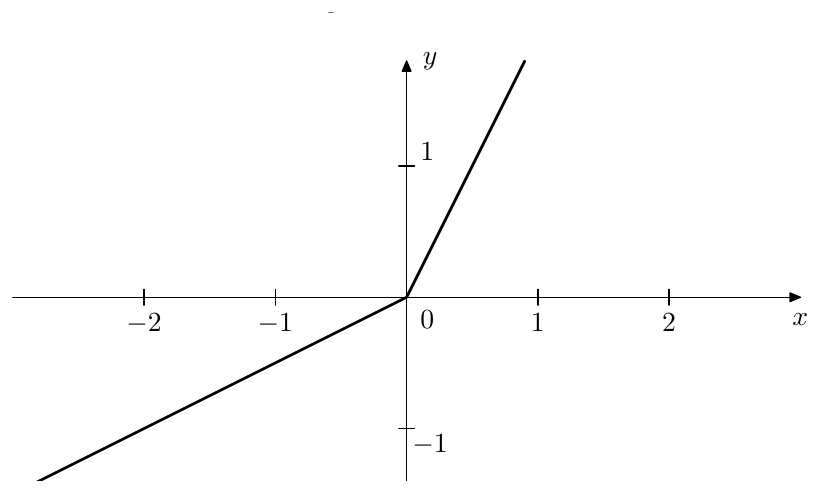

*Figure 6.58: "Asymmetric cutoff" nonlinearity.*

Imagine such filter receives a steady periodic signal with a zero DC offset
(meaning that the average value of the signal is zero, or, in other words, there
is an "equal amount" of signal above and below zero). And suppose this signal's
fundamental frequency is well above the nominal cutoff of the filter. In such
case a *linear* lowpass filter would have performed a kind of averaging of the
input signal, thereby producing a zero output signal.[^31] However in the case of
using the nonlinearity (6.32) the positive input values will have "more weight"
than the negative ones and the lowpass output will be nonzero.

It should be inituitively clear that the lowpass output value will increase as
the input signal amplitude increases and vice versa (particularly it should be
obvious that in the case of the zero amplitude of the input signal the output
signal will also be zero). Therefore, qualitatively such lowpass filter works as
an envelope follower, the filter cutoff in a way controlling the envelope
follower's response time. Respectively, the highpass output will contain the
input signal with an added (or subtracted) DC offset, such offset being
approximately proportional to the input signal's amplitude. This means that if
initially 50% of the signal were above zero and the other 50% below zero, we now
have changed this ratio to something like 80% to 20%, and this effect is
happening more or less at any amplitude of the input signal.

Thus, asymmetric nonlinear shaping could be produced by the following structure:

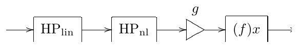

where $\mathrm{HP}_{\mathrm{lin}}$ is an initial lowpass, killing the DC offset
which might be previously contained in the input signal, $\mathrm{HP}_{\mathrm{nl}}$
is the asymmetric nonlinear highpass, introducing the DC offset into the signal,
the signal is then boosted by the gain $g$, controlling the amount of "drive",
and $f(x)$ is a usual symmetric saturator.

The nonlinearity (6.32) has a drawback that it contains a discontinuity in the
1st derivative at $x = 0$. Such discontinuity may add a noticeable amount of new
harmonic content into the signal. This effect might be desired at times, but for
now we would rather at least reduce it, if not avoiding it altogether, as the
filter's main purpose is to introduce the DC offset into the signal. This can be
achieved by smoothing the discontinuity. E.g. we could replace (6.32) with a
hyperbola going at $45^\circ$ through the origin, but having a similar to (6.32)
asymptotic behavior (Fig. 6.59).

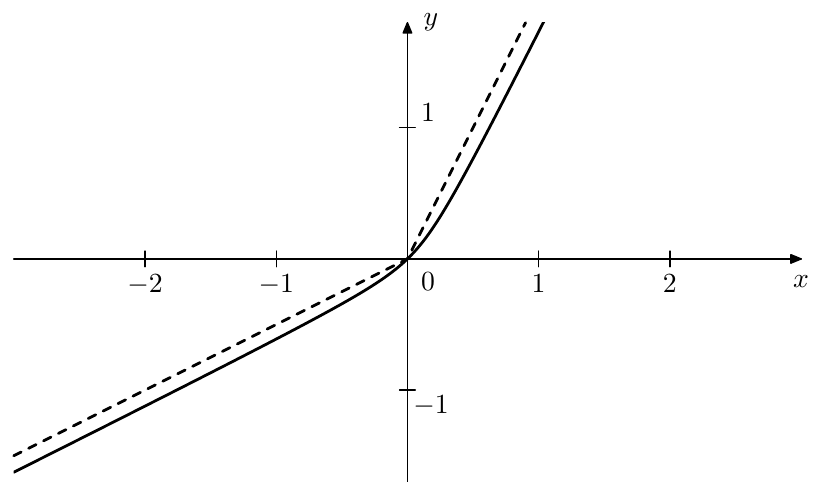

*Figure 6.59: Replacing the nonlinearity (6.32) (Fig. 6.58) (dashed line) by a
hyperbola.*

This kind of nonlinear highpass can occur easily in analog circuits, if
nonlinear resistances are involved. E.g. consider Fig. 6.60. The effective
resistance
connected in series with the capacitor varies, qualitatively speaking, between
$R_1$ and a parallel connection of $R_1$ and $\beta R_2$, depending on the
polarity of the voltage over the base-emitter junction of the transistor (where
$\beta = I_E/I_B$ is the emitter-base current ratio). Respectively the cutoff
varies (qualitatively) between $1/R_1 C$ and $(R_1+\beta R_2)/\beta R_1 R_2 C$.
Upon a closer look, the cutoff will vary a bit less than that, because the
base-emitter voltage will somewhat reduce the current through $R_2$, but
qualitatively the effect is still there.

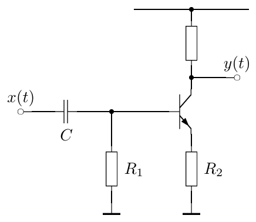

*Figure 6.60: Highpass filter with asymmetric cutoff.*

## 6.13 Antialiasing of waveshaping

### Aliasing

When a signal goes through a waveshaper, the waveshaping introduces additional
partials into the spectrum of the signal. These partials extend into the entire
frequency range $\omega \in [0,\infty)$ for almost any waveshaper. We can show
that in several steps.

First, let's consider waveshapers of the form $f(x) = x^n$ (where $n > 1$),
starting with $f(x) = x^2$. Let $x(t)$ be a periodic signal. Therefore it can be
represented as a sum of its harmonics:

$$
x(t) = \sum_{n=-N}^{N} X_n e^{jn\omega t}
$$

where $N$ can be finite or inifinity. Note that we are using complex-form
Fourier series, therefore, assuming a real $x(t)$, we have an equal number of
positive- and negative-frequency partials. Then

$$
y(t) = f(x(t)) = (x(t))^2 = \left(\sum_{n=-N}^{N} X_n e^{jn\omega t}\right)^2 =
$$

$$
= \sum_{n_1,n_2=-N}^{N} X_{n_1}X_{n_2}e^{j(n_1+n_2)\omega t} = \sum_{n=-2N}^{2N} Y_n e^{jn\omega t} \tag{6.33}
$$

Thus, the frequencies of partials of $y(t)$ are all possible sums $n_1\omega +
n_2\omega$ of frequencies of partials of $x(t)$.[^32] Respectively the
frequencies of the partials of $y(t)$ vary between $-2N\omega$ and $2N\omega$.
That is the width of the spectrum of $y(t)$ is twice the width of the spectrum
of $x(t)$.

For $f(x) = x^3$ we obtain

$$
y(t) = f(x(t)) = (x(t))^3 = \left(\sum_{n=-N}^{N} X_n e^{jn\omega t}\right)^3 =
$$

$$
= \sum_{n_1,n_2,n_3=-N}^{N} X_{n_1}X_{n_2}X_{n_3}e^{j(n_1+n_2+n_3)\omega t} = \sum_{n=-3N}^{3N} Y_n e^{jn\omega t}
$$

that is the width of the spectrum is tripled. It's not difficult to generalize
it to an arbitrary power of $x$, concluding that $f(x) = x^n$ increases the
width of the spectrum of $x(t)$ $n$ times.

It should be clear by now that, if $f(x)$ is a polynomial of order $N$:

$$
f(x) = a_0 + a_1 x + a_2 x^2 + \ldots + a_N x^N
$$

the highest-order term $x^N$ will expand the spectrum of $x$ $n$ times, while
the lower-order terms will also expand the spectrum of $x(t)$ but not as much,
thus $f(x)$ expands the spectrum of $x(t)$ $N$ times.

Now suppose $f(x)$ is a function of a more or less general form, expandable
into Taylor series around $x = 0$:

$$
f(x) = \sum_{n=0}^{\infty} \frac{f^{(n)}(0)}{n!} x^n = \sum_{n=0}^{\infty} a_n x^n
$$

We can consider such $f(x)$ as a polynomial of an infinite order and thus
$f(x)$ expands the spectrum of $x(t)$ by an infinite number of times.[^33]

Some of the waveshapers that we were previously discussed were constructed as
piecewise functions, including e.g. a piecewise polynomial saturator (6.2b).
Would the saturator (6.2b), which consists of polynomial segments of order not
higher than 2, thereby expand the spectrum of $f(x)$ only 2 times? It turns out
that such piecewise function waveshapers also expand the spectrum an infinite
number of times. Having discontinuous derivatives themselves (e.g. (6.2b) has a
continuous 1st derivative, but three discontinuities of the 2nd derivative),
such waveshapers also introduce discontinuous derivatives into their output
signal $y(t)$. The presence of discontinuities in a signal's derivative
automatically implies an infinite spectrum of the signal.[^34]

Therefore all waveshapers which we have been considering until now (as well as
most of the ones we could even think of) expand the spectrum of the input
signal an infinite number of times. This means that discrete-time waveshaping
produces aliasing.

Indeed, suppose we are given a waveshaper $f(x)$ of a general shape, so that it
expands the spectrum of its input signal an infinite number times. And imagine
we are having a sampled signal $x[n]$ and its corresponding continuous
bandlimited version $x(t)$. Assuming unit sampling period $T = 1$ we can write
$x[n] = x(n)\ \forall n \in \mathbb{Z}$. A direct application of a waveshaper
$f(x)$ to discrete-time signal $x[n]$:

$$
y[n] = f(x[n]) \tag{6.34}
$$

is fully equivalent to sampling the continuous-time signal $y(t) = f(x(t))$, by
simply letting $y[n] = y(n)$. However, since $f(x)$ expands the spectrum of
$x(t)$ infinitely, the spectrum of $y(t)$ is not bandlimited and simply letting
$y[n] = y(n)$ will result in aliased frequencies contained in $y[n]$.

Trying to use polynomial waveshapers doesn't help much. We could definitely
construct polynomial antisaturators, e.g. $f(x) = x^3 + x$, whereas a purely
polynomial saturator could be constucted only if we know that the input signal
has a limited range, which is a pretty heavy restriction. However even
$x^3 + x$ will triple the width of the spectrum, so that we'll need e.g. to
bandlimit $x(t)$ to one third of the Nyquist frequency, process it by an
$f(x) = x^3$ saturator and add the result to the unprocessed signal:

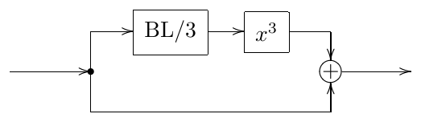

(where BL/3 denotes a filter which bandlimits the signal to 1/3 of the Nyquist
frequency, and Lat denotes). Actually bandlimiting will introduce latency into
the signal, so we'll need to add the same latency on the lower path
(where Lat denotes a structure which artificially introduces the same latency
as introduced by BL/3).

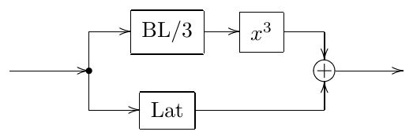

This idea stll doesn't work really well, since antisaturators are normally used
in feedback loops. We can't perform the bandlimiting inside the feedback loop,
e.g.

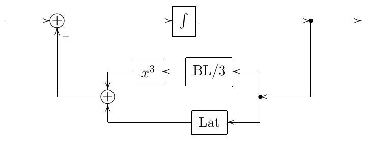

because of the introduced latency. Doing it outside the feedback loop is also
problematic. For one, we'd need to bandlimit the entire signal $x(t)$, not only
the part of it which goes through the $x^3$ shaper. This still could be done,
though, if the sampling rate is sufficiently high (at least $3 \times
44.1\text{kHz}$). The other problem is that the signal inside the feedback
loop will go infinitely many times through the waveshaper. Therefore
bandlimiting of the signal prior to entering the feedback loop to 1/3 of
Nyquist frequency won't really prevent the aliasing from happening.[^35]

### Antialiasing

The antialiasing of waveshapers is a difficult problem, not having a
universally good solution at the time of writing this text. The only thing
which is more or less guaranteed to work is heavy oversampling.[^36]
Unfortuntately, oversampling introduces latency, thus, if e.g. a waveshaper is
used in a filter feedback loop, we cannot oversample locally just the
waveshaper, but at least the entire feedback loop must be oversampled.

There is however an approach[^37] which reduces aliasing by a noticeable
amount, so that the same quality of sound can be achieved at lower sampling
rates than otherwise.[^38] Suppose we are having a discrete-time signal $x[n]$
going through a waveshaper $f(x)$. Instead of sending $x[n]$ through the
waveshaper in discrete time, thereby producing the discrete time signal

$$
y[n] = f(x[n]) \tag{6.35}
$$

let's convert $x[n]$ to continuous time by means of linear interpolation.
Without loss of generality we will consider the linear interpolating segment
going between $x[0]$ and $x[1]$:

$$
x(t) = (1-t)x[0] + tx[1] \qquad 0 \le t \le 1 \tag{6.36}
$$

(where we assume unit sampling period $T = 1$). Applying the waveshaper $f(x)$
in contnuous time to this segment we obtain

$$
y(t) = f(x(t)) = f((1-t)x[0] + tx[1])
$$

Now we propose to compute the discrete time sample $y[1]$ as

$$
y[1] = \int_0^1 y(\tau)\,d\tau = \int_0^1 f((1-\tau)x[0] + \tau x[1])\,d\tau = \frac{F(x[1]) - F(x[0])}{x[1] - x[0]} \tag{6.37}
$$

where $F(x)$ is some antiderivative of $f(x)$, that is $F'(x) = f(x)$. Or, more
generally

$$
y[n] = \int_{n-1}^{n} y(\tau)\,d\tau = \frac{F(x[n]) - F(x[n-1])}{x[n] - x[n-1]} \tag{6.38}
$$

where $y(t) = f(x(t))$ and where $x(t)$ is a piecewise linear continuous-time
function arising out of linear interpolation of $x[n]$. It might seem that the
averaging of $y(t)$ on $t \in [n-1,n]$ in (6.38) is a somewhat arbitrary
operation. However, it isn't. In fact, such averaging can be considered as one
of the simplest possible forms of lowpass filtering the continuous-time
signal, aiming to suppress the aliasing frequencies above Nyquist.[^39]

The averaging (6.38) does a reasonable job of reducing the aliasing in $y[n]$
compared to (6.35), however it is introducing two problems: latency and
ill-conditioning.

### Latency

Assuming the transparency of the waveshaper at small signal levels
$f(x) \approx x$ we have $F(x) \approx x^2/2$ and (6.38) turns into

$$
y[n] = \frac{x^2[n]/2 - x^2[n-1]/2}{x[n] - x[n-1]} = \frac{x[n] + x[n-1]}{2} \tag{6.39}
$$

The expression (6.39) describes a discrete time 1-pole lowpass filter with a
cutoff at half the Nyquist frequency. Indeed, let's take the lowpass filter in
Fig. 3.31. At $g = 1$ (which corresponds to $\omega_c T/2 = 1$, which in turn
corresponds to prewarped half Nyquist frequency $\omega_c T/2 = \pi/4$) we have
$g/(g+1) = 1/2$ and thus

$$
v[n] = \frac{x[n] - s[n]}{2} \tag{6.40a}
$$

$$
y[n] = v[n] + s[n] = \frac{x[n] + s[n]}{2} \tag{6.40b}
$$

$$
s[n+1] = y[n] + v[n] = x[n] \tag{6.40c}
$$

Combining (6.40b) and (6.40c) we obtain

$$
y[n] = \frac{x[n] + x[n-1]}{2}
$$

which is the same as (6.39).

The lowpass filtering effect of (6.38) is actually another problem that we
didn't mention so far. It arises out of the approximations that the method
does when converting from discrete-time signal $x[n]$ to $x(t)$ and back from
$y(t)$ to $y[n]$. This problem is however not very noticeable at sampling
rates of 88.2kHz and higher. So, let's concentrate on the latency introduced by
(6.39).

The averaging in (6.39) can be seen as a mid-way linear interpolation between
$x[n]$ and $x[n-1]$ and thus intuitively one could expect that it introduces a
half-sample delay. This is indeed the case. Taking $x[n] = e^{j\omega n}$ and
assuming $|\omega| \ll 1$, so that the signal's frequency is far below the
cutoff of the lowpass filter (6.39), we have

$$
\begin{aligned}
y[n] &= \frac{e^{j\omega n} + e^{j\omega(n-1)}}{2} = \exp j\omega\left(n - \frac{1}{2}\right)\cdot\frac{e^{j\omega/2} + e^{-j\omega/2}}{2} = \\
&= \exp j\omega\left(n - \frac{1}{2}\right)\cdot\cos\frac{\omega}{2} \approx \exp j\omega\left(n - \frac{1}{2}\right)
\end{aligned}
$$

where $\cos(\omega/2) \approx 1$ since $\omega \approx 0$.

It can be shown that the source of this half-sample delay is the averaging of
$y(t)$ on $[n-1,n]$ done in (6.38). Taking $y(t) = e^{j\omega t}$ where
$|\omega| \ll 1$, we have

$$
\begin{aligned}
\int_{n-1}^{n} e^{j\omega\tau}\,d\tau &= \frac{e^{j\omega n} - e^{j\omega(n-1)t}}{j\omega} = \exp j\omega\left(n - \frac{1}{2}\right)\cdot\frac{e^{j\omega/2} - e^{-j\omega/2}}{2j\cdot\omega/2} = \\
&= \exp j\omega\left(n - \frac{1}{2}\right)\cdot\frac{\sin(\omega/2)}{\omega/2} = \exp j\omega\left(n - \frac{1}{2}\right)\cdot\operatorname{sinc}\frac{\omega}{2} \approx \\
&\approx \exp j\omega\left(n - \frac{1}{2}\right)
\end{aligned}
$$

(where $\operatorname{sinc} x = \frac{\sin x}{x}$ is the cardinal sine
function). Thus (6.39) and (6.38) indeed introduce a delay of half sample.
Inside a zero-delay feedback loop this would be a serious problem. In order to
develop an idea of how to address this problem, let's look at a few examples.

### Waveshaper followed by an integrator

Suppose a waveshaper is immediately preceding an integrator, as shown in Fig.
6.61 (this particularly happens in the OTA-style 1-poles in Figs. 6.35 and
6.36). Normally we recommended to use transposed direct form II integrators
however this time we suggest to use a direct form I integrator (Fig. 6.62).
Looking at the first half of the direct form I integrator (highlighted by the
dashed line in Fig. 6.62) we can notice that it exactly implements the formula
(6.39). So, the first part of the integrator implements a half-sample delay
too and does so in exactly the same way as the antialiased waveshaper for
low-level signals. This therefore leads to an idea to simply drop this part of
the integrator, as it is done in Fig. 6.63, since we are getting the same
half-delay from the waveshaper already.

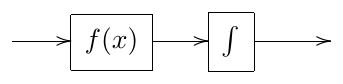

*Figure 6.61: Waveshaper immedidately followed by an integrator.*

It is interesting to notice that what thereby remains of the integrator is the
native integrator contained in Fig. 3.3). Thus, in order to implement an
antialiased waveshaper followed by a trapezoidal integrator, simply use a naive
integrator instead. This effectively produces trapezoidal integrator,
simultaneously "killing" the unwanted latency produced by the antialiased
waveshaper.

The solution proposed in Fig. 6.63 works quite well. There is still one
subtlety though, which, depending on the circumstances, may be fully academic
or not. By "assigning" the functionality of the first part of the integrator to
the antialiased waveshaper, we effectively positioned the $\omega_c T$ gain
element into the middle of the integrator (Fig. 6.64). This doesn't affect the
time-invariant behavior of the integrator, but will introduce some changes if
the cutoff $\omega_c$ is varying.

In order to avoid that effect, we would need to somehow include the varying
$\omega_c T$ into the averaging implemented by (6.38). A straightforward
possibility would be to change (6.37) into

$$
u[1] = \int_0^1 \omega_c(\tau)y(\tau)\,d\tau \tag{6.41}
$$

(remember that we assume $T = 1$), where $u(t) = \omega_c(t)y(t) =
\omega_c(t)Ty(t)$. Trapezoidal integration assumes (kind of) that the signals
are varying linearly in between the samples, therefore (6.41) can be rewritten
as

$$
\begin{aligned}
u[1] &= \int_0^1 \bigl((1-\tau)\omega_c[0] + \tau\omega_c[1]\bigr)y(\tau)\,d\tau = \\
&= \int_0^1 \bigl((1-\tau)\omega_c[0] + \tau\omega_c[1]\bigr)f\bigl((1-\tau)x[0] + \tau x[1]\bigr)\,d\tau
\end{aligned} \tag{6.42}
$$

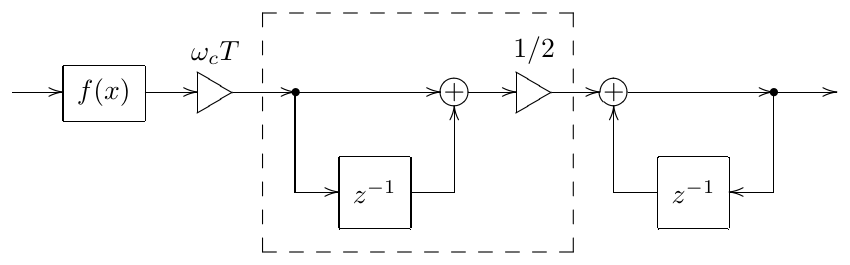

*Figure 6.62: Antialiased waveshaper combined with direct form I
integrator. The dashed line highlights the part of the integrator
which is equivalent to the waveshaper at low signals.*

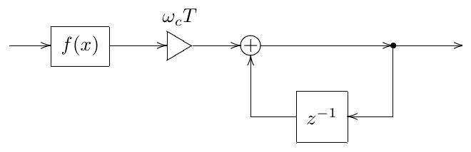

*Figure 6.63: Antialiased waveshaper combined with direct form I
integrator, the first part of the integrator being dropped, since its
implemented by the antialiased waveshaper already.*

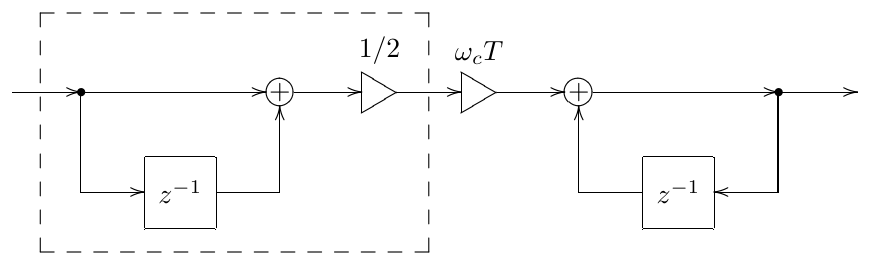

*Figure 6.64: Structure in Fig. 6.63 implies positioning the $\omega_c T$ gain
element in the middle of the integrator. The dashed line highlights
the part which is being replaced by the antialiased waveshaper.*

Unfortunately, the formula (6.42) is not fully convincing. At $f(x) = x$ we
would expect (6.42) to turn into ordinary trapezoidal integration of
$\omega_c f(x)$ yielding

$$
\frac{\omega_c[0]f(x[0]) + \omega_c[1]f(x[1])}{2}
$$

However (6.42) gives in this case

$$
\frac{\omega_c[0] + \omega_c[1]}{2}\cdot\frac{f(x[0]) + f(x[1])}{2}
$$

Of course, (6.42) can be further artificially amended. Whether one should
attempt anything like that, is an open question.

### Waveshaper following an integrator

The opposite order of connection of a waveshaper and an integrator looks much
better at first sight, since in this case we could use a transposed direct
form I integrator (Fig. 6.65), which won't require us to reposition the cutoff
gain.[^40]

A concern which this approach is raising though, is that, as we have seen, the
latency introduced by the waveshaper is caused by the averaging occurring
after the nonlinearity, whereas in Fig. 6.65 the averaging in the integrator,
which we are dropping, is occurring before the nonlinearity. On the other
hand, linear interpolation, which is used to construct $x(t)$ from $x[n]$ in
(6.36), is also having a lowpass filtering effect similar to the one of the
averaging, while it doesn't actually matter, whether we compensate the latency
before or after the waveshaper. Therefore Fig. 6.65 may also provide an
acceptable solution.

### Waveshaper followed by a 1-pole lowpass

Let's now consider the case of the feedback saturator in Fig. 6.6, where the
saturator is not exactly followed by an integrator, but by a complete 1-pole?
Fig. 6.66 depicts this situation explicitly showing the internal structure of
the 1-pole.

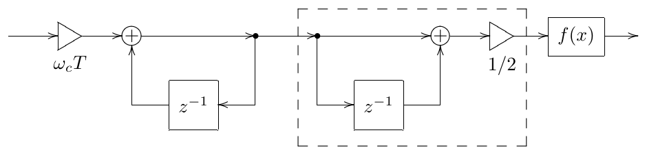

*Figure 6.65: Transposed direct form I trapezoidal integrator fol-
lowed by a waveshaper. The dashed line highlights the part of the
integrator which is about to be dropped.*

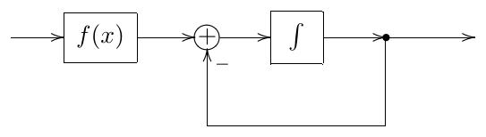

*Figure 6.66: Waveshaper followed by a 1-pole lowpass.*

Replacing the integrator with its direct form I implementation we obtain the
structure in Fig. 6.67. Following the approach of Fig. 6.64, we reposition the
$\omega_c T$ element, as shown in Fig. 6.68.

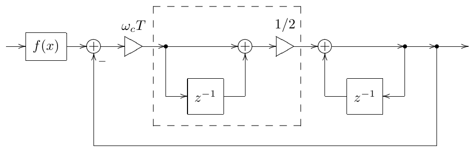

*Figure 6.67: Waveshaper followed by a 1-pole lowpass built around
a direct form I integrator.*

Now we would like to drop the $(1+z^{-1})/2$ part of the direct form I
integrator, but only for the signal coming from the waveshaper. The feedback
signal of the 1-pole should still come through the full integrator. This can
be achieved by injecting the waveshaped signal into a later point of the
feedback loop. The resulting structure in Fig. 6.69 thereby compensates the
latency introduced by the antialiased waveshaper.

The structure in Fig. 6.69 can be further simplified as shown in Fig. 6.70,
where we "slid" the inverter "-1" all the way through $(1+z^{-1})/2$ to the
injection point of the waveshaped signal. Such change doesn't cause any
noticeable
effects.[^41] Noticing that the two $z^{-1}$ elements in Fig. 6.70 are actually
sharing the same input signal, we can combine both into one (Fig. 6.71).

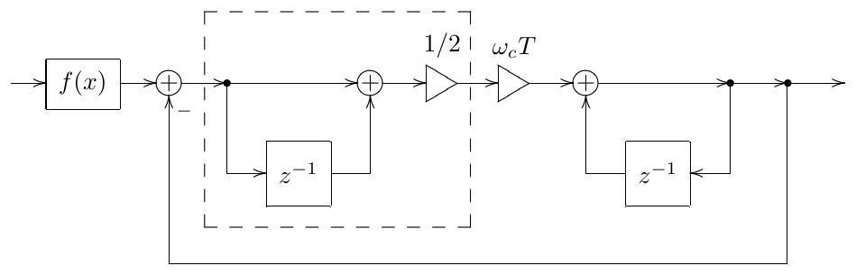

*Figure 6.68: Structure from Fig. 6.67 with a changed position of the cutoff gain.*

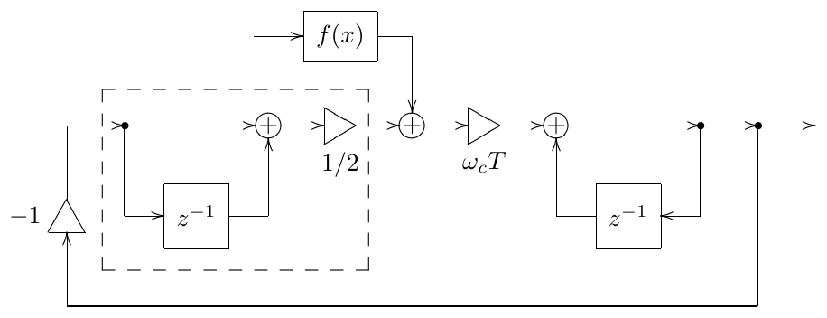

*Figure 6.69: Structure from Fig. 6.68 with the waveshaped signal bypassing the first part of the direct form I integrator (thereby compensating the introduced latency).*

Fig. 6.71 contains a zero-delay feedback loop, which can be resolved. Let's
introduce helper variables $u$, $v$ and $s$ as shown in Fig. 6.71 and let
$g = \omega_c T$. Writing the equations implied by the block diagram we have

$$
v = g \cdot \left(u - \frac{v + s + s}{2}\right)
$$

from where

$$
v \cdot (1 + g/2) = g \cdot (u - s)
$$

$$
v = \frac{g}{1 + g/2} \cdot (u - s)
$$

Considering that $y = v + s$ we obtain the structure in Fig. 6.72.

Notice that the obtained structure in Fig. 6.72 is pretty much identical to
the structure of the naive 1-pole lowpass filter in Fig. 3.5, except that the
cutoff gain is not $\omega_c T$ but $\omega_c T/(1 + \omega_c T/2)$. Thus, in
order to implement an antialiased waveshaper followed by a 1-pole lowpass, we
simply use a naive 1-pole lowpass with adjusted cutoff instead, which
effectively "kills" the unwanted latency.

In principle we could have tried to avoid the repositioning of the
$\omega_c T$ gain element. Attempting to do so, we could have gone from
Fig. 6.67 to the structure in Fig. 6.73. However, this solves only one half
of the problem, namely fixing the issue in the feedback path, while the issue
is still there for the waveshaped signal. The considerations of possibly
including the averaging of $\omega_c T$ into the antialiased waveshaper
apply, where we are having exactly the same situation as in the case of an
integrator following a waveshaper.

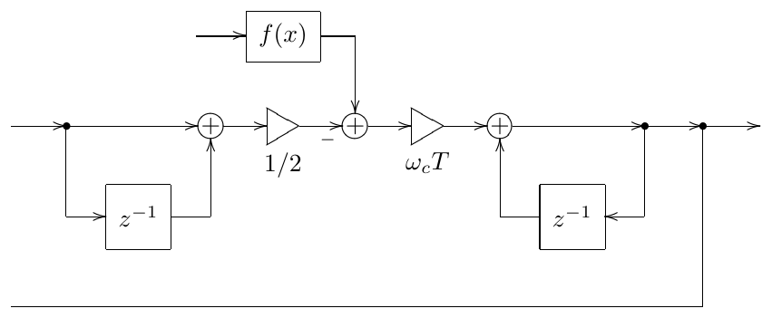

*Figure 6.70: Structure from Fig. 6.69 with a changed position of the inverter.*

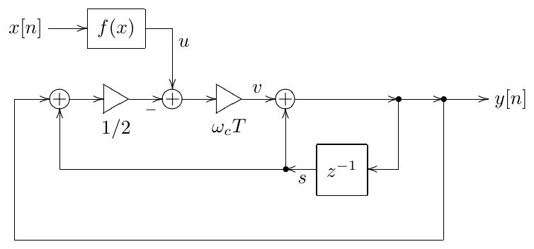

*Figure 6.71: Structure from Fig. 6.70 with merged $z^{-1}$ elements.*

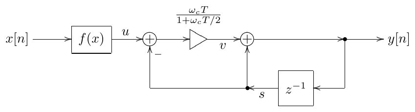

*Figure 6.72: Structure from Fig. 6.71 with resolved zero-delay feedback loop, implementing Fig. 6.66 with latency compensation.*

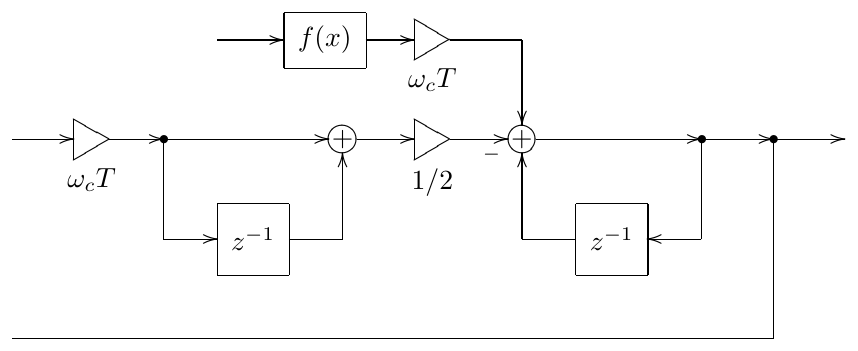

*Figure 6.73: Structure from Fig. 6.67 with the waveshaped signal bypassing the first part of the direct form I integrator (thereby compensating the introduced latency) but without repositioning of $\omega_c T$ gain element.*

### 1-pole lowpass followed by a waveshaper

In case of a 1-pole lowpass filter followed by a waveshaper (Fig. 6.74) we
can use the transposed direct form I integrator, as we did in Fig. 6.65. The
respective structure is shown in Fig. 6.75.

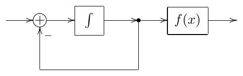

*Figure 6.74: 1-pole lowpass followed by a waveshaper.*

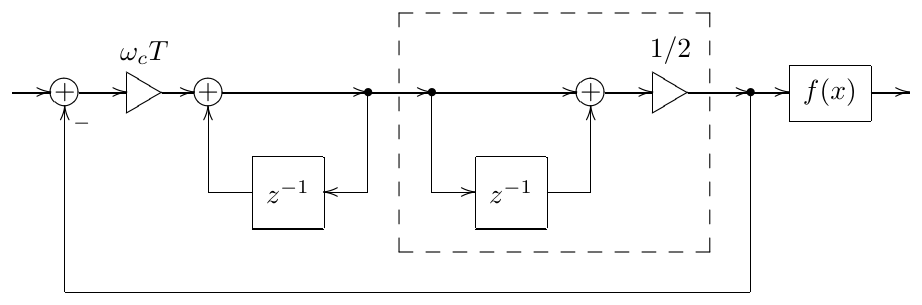

*Figure 6.75: 1-pole lowpass built around a transposed direct form I integrator followed by a waveshaper.*

In this case we can simply pick up the waveshaper input signal in the middle
of the integrator, bypassing the second half (Fig. 6.76). Noticing that the
two $z^{-1}$ elements in Fig. 6.76 are picking up the same signal, we could
merge them into a single $z^{-1}$ element as shown in Fig. 6.77, thereby
producing a direct form II integrator (compare to Fig. 3.9).

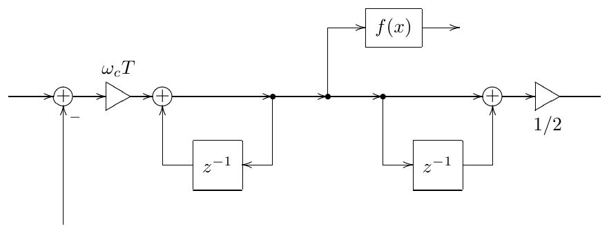

*Figure 6.76: Structure from Fig. 6.75 with the waveshaper skipping the second half of the transposed direct form I integrator (thereby compensating the introduced latency).*

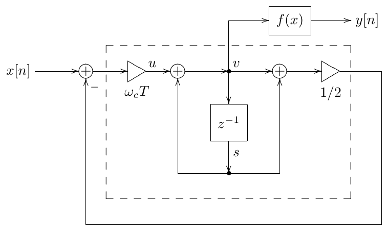

*Figure 6.77: Structure from Fig. 6.76 with merged $z^{-1}$ elements. The dashed line highlights the direct form II integrator.*

In order to resolve the zero-delay feedback loop in Fig. 6.77 we introduce
helper variables $u$, $v$ and $s$ as shown in Fig. 6.77 and we let
$g = \omega_c T$. Then, writing the equations implied by the block diagram,
we have

$$
u = g \cdot \left(x - \frac{u + s + s}{2}\right)
$$

from where

$$
u \cdot (1 + g/2) = g \cdot (x - s)
$$

$$
u = \frac{g}{1 + g/2} \cdot (x - s)
$$

Considering that $v = u + s$ we obtain the structure in Fig. 6.78.

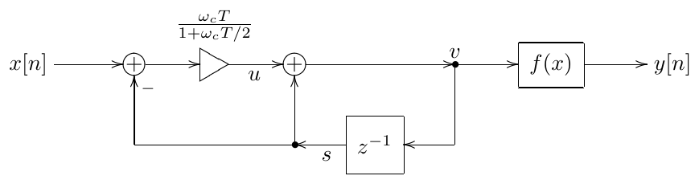

*Figure 6.78: Structure from Fig. 6.77 with resolved zero-delay feedback loop, implementing Fig. 6.74 with latency compensation.*

Notice that the obtained structure in Fig. 6.78 is identical to the
structure in Fig. 6.72, except for the the opposite order of the naive
1-pole lowpass and the waveshaper. Thus, in order to implement a 1-pole
lowpass followed by an antialiased waveshaper we simply use a naive 1-pole
lowpass with adjusted cutoff instead.

### Other positions of waveshaper

In Fig. 6.66 we had a waveshaper followed by a lowpass, but imagine it was a
highpass instead (Fig. 6.79).[^42] In this case, even if we use the tricks
similar to the ones we did in the lowpass case, we still won't be able to
eliminate the latency on the feedforward path between $x(t)$ and $y(t)$.

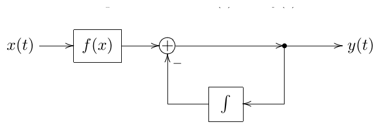

*Figure 6.79: Waveshaper followed by a 1-pole highpass.*

If there is e.g. a lowpass further after the the highpass:

$$
f(x) \to \mathrm{HP} \to \mathrm{LP}
$$

then we can eliminate the latency by changing the lowpass, exactly as we did
before. The highpass filter will work on a signal delayed by half a sample,
but this will be compensated in the immediately following lowpass.
Similarly, if there is a preceding lowpass:

$$
\mathrm{LP} \to f(x) \to \mathrm{HP}
$$

we could consider compensating the latency by changing that lowpass. The
same of course could be done if instead of a lowpass we find an integrator,
or a suitable structure containing one.

However it might happen that there is no lowpass or an integrator or any
other structure suitable for this purpose, neither after the waveshaper nor
before it. In such cases we could artificially insert a 1-pole lowpass
immediately before or after the waveshaper (Fig. 6.80), setting the cutoff
of this lowpass to a very high value. In this case we could hope that the
insertion of the new lowpass would not significantly change the signal, at
least not in the audible range, if its cutoff is lying well above.

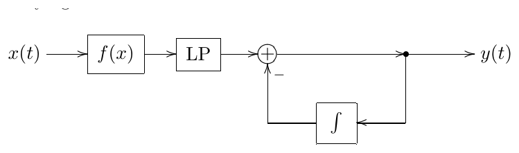

*Figure 6.80: Artificially inserted 1-pole lowpass.*

One still has to be careful, since such lowpass will introduce noticeable
changes into the behavior of the system in the spectral range above the
lowpass's cutoff and even, to an extent, below its cutoff. Even though a
lowpass generally reduces the amplitude of signals, due to the changes in
the phase it could increase the system's resonance, causing the system to
turn to selfoscillation earlier than expected.[^43] In a nonlinear system the
inaudible parts of the spectrum could become audible through the so-called
intermodulation distortion.[^44] So, it's a good idea to test for the
possible artifacts created by the introduction of such lowpass.

### Zero-delay feedback equation

The appearance of antialiased waveshapers in a zero-delay feedback loop
creates the question of solving the arising zero-delay feedback equations.
Fortunately, this doesn't create any new problems, as the inistantaneous
response of an antialiased waveshaper can be represented in familiear terms.

Indeed, according to (6.38) the instantaneous response of an antialiased
waveshaper is simply another waveshaper:

$$
\tilde f(x) = \frac{F(x) - F(a)}{x - a} \tag{6.43}
$$

where $a = x[n-1]$ is the waveshaper function's parameter, which is having a
fixed value at each given time moment $n$. Thus we obtain the already
familiar kind of a zero-delay feedback equation with a waveshaper.

### Ill-conditioning

If $x[n] \approx x[n-1]$, the denominator of (6.38) will be close to zero.
Rather fortunately this also means that the numerator will be close to zero
as well, so that, at least formally, their ratio should produce a finite
value. However practically this could mean precision losses in the numeric
evaluation of the right-hand side of (6.38) (or division by zero if
$x[n] = x[n-1]$).

Since $x[n] \approx x[n-1]$, the value of the interpolated signal $x(t)$ and
respectively the value of $y(t) = f(x(t))$ shouldn't change much on
$[n-1, n]$ and thus the integral in (6.38) can be well approximated by a
value of $y(t)$ somewhere on that interval.[^45] In principle we could take
any point on that interval, but intuitively we should expect the midway
point to give the best result, and thus we take

$$
y[n] = f\left(\frac{x[n] + x[n-1]}{2}\right) \qquad \text{if } x[n] \approx x[n-1] \tag{6.44}
$$

Notice that at $f(x) \approx x$ (6.44) turns into (6.39).

The fallback formula (6.44) creates no new problems for the solution of the
zero-delay feedback equation, since in instantaneous response terms it
looks like another waveshaper

$$
\tilde f(x) = f\left(\frac{x + a}{2}\right) \tag{6.45}
$$

where $a = x[n-1]$. Note, however, that when using iterative approaches to
the solution of the zero-delay feedback equation, we potentially may need to
switch between (6.43) and (6.45) on each iteration step.

The choice between the normal and the ill-conditioned case formulas should
depend on the comparison of estimated precision losses in (6.38) and the
error in (6.44). In that regard note, that it might be a good idea to choose
the antiderivative $F(x)$ so that $F(0) = 0$. This could improve the
precision of numerical computation of (6.38) and (6.43) at low signal
levels, as subtraction of two close numbers is the main source of precision
losses here. On the other hand, the main source of error in (6.44) and
(6.45) is nonlinear behavior of $f(x)$ on the segment lying between
$x[n-1]$ and $x[n]$.[^46]

## Summary

Nonlinear filters can be constructed by introducing waveshapers into block
diagrams. Two important types of waveshapers are saturators and
antisaturators. Saturators used in resonating feedback loops prevent the
signal level from infinite growth. Antisaturators have a similar effect in
damping feedback paths.

The discussed types of usage of saturators in filters included feedback loop
saturation, transistor ladder-style 1-pole saturation and OTA-style 1-pole
saturation. The discussed usage of antisaturators included the diode
clipper-style saturation of 1-poles and the usage in the damping path of an
SVF.

Waveshapers usually turn zero-delay feedback equations into transcendental
ones, which then need to be solved using approximate or numeric methods,
although in some cases analytic solution is possible.

Discrete-time waveshaping produces aliasing, which might need to be
mitigated using oversampling and/or some more advanced methods.

[^1]: Sometimes the effect created by discontinuities is explicitly being
    sought after, e.g. in a rectification waveshaper $f(x) = |x|$.

[^2]: Apparently, hard clipper is a compact-range saturator.

[^3]: There doesn't seem to be a universally accepted definition of which
    kinds of saturators are referred to as soft clippers, and which aren't.
    E.g. the set of soft clippers could be restricted to contain only
    bounded saturators. In this book we will understand the term soft
    clipper in the widest possible sense.

[^4]: If the system is in the zero state, then in the absence of the input
    signal it will stay forever in this state of "unstable equilibrium". In
    analog circuits, however, there are always noise signals present in the
    system, which will excite the transient response components, thus
    destroying the equilibrium. In the digital implementation such
    excitations need to be performed manually. This can be done by
    initializing the system to a not-exactly-zero state, or by sending a
    short excitation impulse into the system at the initialization, or by
    mixing some low-level noise at one or multiple points into the system.
    Often a very small constant DC offset will suffice instead of such
    noise.

[^5]: As the saturator is effectively reducing the total gain of the
    feedback loop, at $k = 4$ the selfoscillation will first have an
    infinitely small signal level, where the saturator is transparent.
    Increasing the value of $k$ further we can bring the selfoscillation to
    an audible level.

[^6]: Notice that, with the saturator positioned in the feedback path, at
    $k = 0$ the filter effectively becomes linear.

[^7]: This observation was made by Dr. Julian Parker.

[^8]: Recall that for a series of 1-pole lowpasses (which $G\xi + S$ denotes in Fig. 6.12) $0 < G < 1$.

[^9]: In a realtime situation it would be a good idea to artificially bound the number of iterations
    from above.

[^10]: Of course this is not exacty oversampling, because the state of the system (manfesting
    itself in the $S$ variable) is frozen.

[^11]: Clearly, the smoother will not help in the instantaneously unstable case, occurring when
    $kG \leq -1$.

[^12]: There are a number of tricks which can be employed to improve the convergence of
    Newton-Raphson, but even those might not help in all situations. The specific tricks can be
    found in the literature on numerical methods and fall outside the scope of this book.

[^13]: Taking $\bar{v} = \tanh u$ as the unknown to solve for addresses the division by zero issue, but
    the other issues are similar to the choice of $v = kG\tanh u$.

[^14]: Treating the error in the numerically computed solution as noise, we can define the
    signal-to-noise ratio (SNR) as the ratio of the absolute magnitudes of the error and the
    signal, expressed in decibels.

[^15]: Whether this is too expensive or not depends on a number of factors. E.g. in Newton-Raphson
    method we needed to compute both $\tanh u$ and $\tanh' u$. With the hyperbolic tangent
    function we were quite fortunate in that the derivative of the function is trivially computable
    from the function value ($\tanh' u = 1 - \tanh^2 u$) and thus doesn't create significant computation
    cost. Had the derivative computation been expensive, the computation cost of 10 iterations
    of bisection could have been comparable to 5 iterations of Newton-Raphson.

[^16]: Proposed for usage in the zero-delay feedback context by Teemu Voipio.

[^17]: This is a particular case of a more general idea, where we would use the result obtained
    by one of the above approximations as an initial point for an iterative algorithm.

[^18]: We use the implicit form, because the explicit form has some
    ill-conditioning issues. Besides, in order to solve (6.13) for the
    specific second-order shaper function $f(x)$, we will need to
    effectively go from explicit to implicit form during the algebraic
    transformations of the resulting equation anyway, thus using the
    explicit form wouldn't have simplified the solution, but on the
    contrary, would have made it longer.

[^19]: More precisely, one of the two values.

[^20]: It can be shown, that $f(u) \sim u \cdot \bigl((2y_1-1)/y_1^2\bigr)^{-1}$
    at $u \to \infty$ which defines the steepness of the asymptote.

[^21]: In the previously discussed case $f(u) = u/(1+u)$ we didn't have a
    switch between larger and smaller solutions. But $f(u) = u/(1+u)$ is a
    limiting case of (6.24) at $y_1 \to 0.5$, so why is there no switch? It
    turns out that both switches occur simultaneously at $kG = 0$ (since the
    oblique asymptote of $f(u)$ becomes vertical), and thus we simply always
    choose the larger solution.

[^22]: Note that the described binary search process doesn't rely on the
    regular spacing of breakpoints $u_n$ along the $u$ axis. This suggests
    that we might use an irregular spacing, e.g. placing the breakpoints more
    densely in the areas of higher curvature. Irregularly spaced breakpoints
    might complicate the initial bracketing a bit, though.

[^23]: Treating the hard clipper as a piecewise-linear shaper is just a
    demonstration example. For a hard clipper shape it might be simpler and
    more practical to simply perform a linearization at zero (thereby
    treating the hard clipper as a fully transparent shaper $f(u) = u$) to
    find $u$. As the very next step after that is sending $u$ through the
    hard clipper, at the output of the hard clipper we will get the true
    value, as if we properly solved the equation (6.13)

[^24]: A famous piece of work describing this specific nonlinear model of the
    transistor ladder filter is the DAFx'04 paper *Non-linear digital
    implementation of the Moog ladder filter* by Antti Huovilainen. Therefore
    this model is sometimes referred to as the "Antti's model".

[^25]: It might be a good idea to write the equation system in terms of
    integrator input signals as an exercise.

[^26]: Going out of supported range of $y$ due to numerical errors is more likely
    to happen in more complicated structures than the one in Fig. 6.54. However
    since we are using Fig. 6.54 as a demonstration of general principles, we
    should mention this aspect as well.

[^27]: Of course, we should remember that we already know the output signal of
    the antisaturator and not attempt to evaluate it again as $\sinh y_{\mathrm{BP}}$,
    which was the whole point of solving for $y_{\mathrm{BP}'}$.

[^28]: Note that thereby we can even use an antisaturator which is an inverse of
    hard clipper.

[^29]: More likely so for a "standalone" saturator being used as an overdrive
    effect, rather than for a saturator used in a complicated feedback loop
    structure in a filter.

[^30]: Clearly, by "amplitude" here we don't mean the momentary value of the
    signal but rather some kind of average or maximum.

[^31]: Formally the filter would have produced the DC offset of the signal at
    the output. The fundamental and all other harmonics, being way above filter's
    cutoff, would have been filtered out.

[^32]: Or, if we think in terms of real-form Fourier series, where only
    positive-frequency partials are present, the frequencies of partials of
    $y(t)$ are all possible sums and differences $n_1\omega \pm n_2\omega$ of
    frequencies of partials of $x(t)$.

[^33]: If the Taylor expansion of $f(x)$ has a finite convergence radius, we
    still can make the same argument about spectrum expansion, at least for
    the signals $x(t)$ which are small enough to fit into the convergence
    radius of the Taylor series of $f(x)$. Note that we also could expand
    $f(x)$ not around $x = 0$ but around some other point $x = x_0$, making
    the same consideration applicable for signals $x(t)$ centered around
    $x = x_0$.

[^34]: A discontinuity of $N$-th order derivative generates harmonics rolling
    off as $1/n^{N+1}$. Thus a discontinuity in a 2nd derivative generates
    harmonics at $1/n^3$. A discontiuity in the function itself (0th
    derivative) generates harmonics at $1/n$ (Fourier series of sawtooth and
    square signals are examples of that).

[^35]: However, it still might reduce the amount of aliasing.

[^36]: Higher sampling rates lead to smaller relative increments of
    integrator states (at the same cutoff value in Hz). Thus, at some point
    higher computation precision will be required. 32 bit floats might happen
    to become insufficient pretty quickly, but 64 bit floats should still do
    in a wide range of high sampling rates.

[^37]: The approach was proposed independently by A.Huovilainen, E.Le Bivic,
    Dr. J.Parker and possibly others. The application of the approach within
    zero-delay feedback context has been developed by the author.

[^38]: Still, 44.1kHz would be usually insufficient and one will need to go
    to 88.2kHz or even higher.

[^39]: Similarly, linear interpolation can be interpreted in terms of
    continuous-time lowpass filtering which suppresses the aliasing discrete
    time spectra.

[^40]: Technically the integrator in Fig. 6.65 is, formally, not exactly a
    transposed direct form II integrator, as the 1/2 gain element should have
    been positioned in the middle. However, since this is a constant gain, we
    can shift it without causing the same concerns as in the case of shifting
    the potentially varying $\omega_c T$ gain element.

[^41]: The internal state stored in the first $z^{-1}$ element is inverted
    compared to what it used to be, but this is compensated by the new
    position of the inverter.

[^42]: The highpass in Fig. 6.79 might look different from the one in
    Fig. 2.9, however it's not difficult to realize that in fact both
    structures are identical.

[^43]: This would be particularly the case in a 4-pole lowpass ladder
    filter, where the effect is noticeable at ladder filter's cutoff
    settings comparable or higher than the cutoff of the added lowpass.

[^44]: Recall that e.g. in (6.33) the output signal of a waveshaper
    contained all sums and differences of the frequencies of the original
    signal. Thus if the difference of two frequencies, both lying well above
    the audible range, falls into the audible range, these originally
    inaudible partials will create an audible one.

[^45]: This is more precisely stated by the mean value theorem.

[^46]: Note that if $f(x)$ is fully linear on that segment, then (6.44)
    gives the exact answer. One could also obtain an estimation of the error
    of (6.44) by expanding $f(x)$ in Taylor series around
    $x = (x[n] + x[n-1])/2$ and noticing that applying (6.38) just to the
    first two terms of this expansion gives (6.44) (as the contribution of
    the first-order term of the series turns out to be zero). Therefore the
    error of (6.44) is equal to the contribution of the remaining terms of
    the Taylor series to (6.38).
