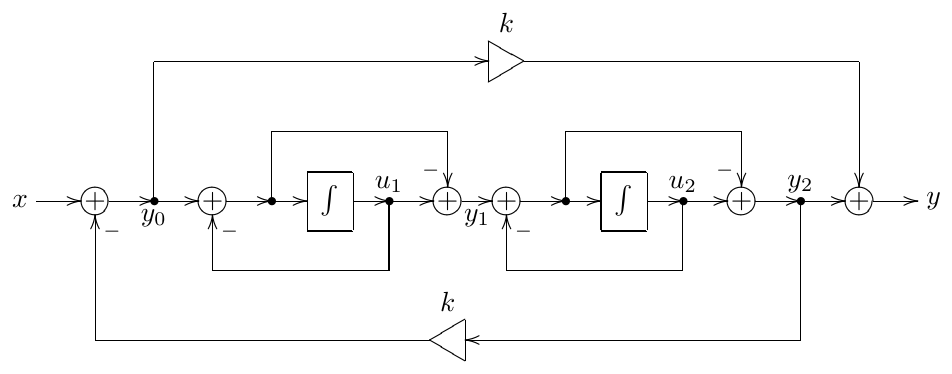
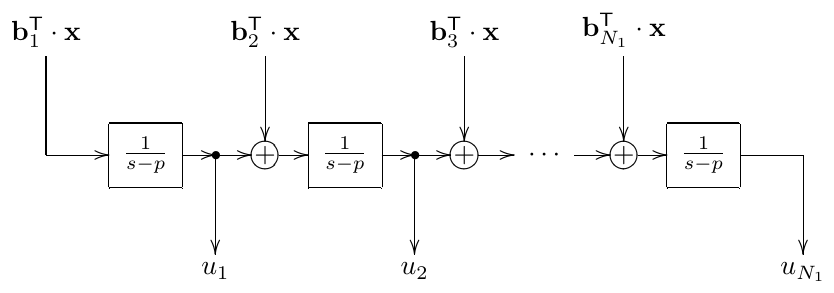
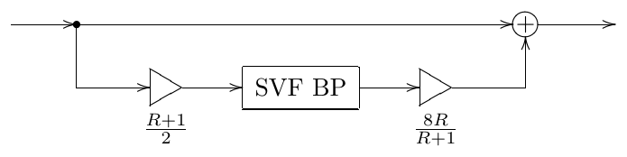
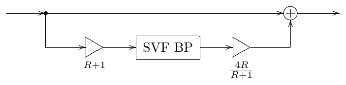

# Chapter 7: State-space form

Starting with this chapter we begin the discussion of subjects of a more
theoretical nature, not in the sense that they are not useful for practical
purposes, but rather that one can already do a lot without the respective
knowledge. Simultaneously the mathematical level of the presented text is
generally higher than in the previous chapters. Readers who are not too
interested in the respective subjects may consider skipping directly to
Chapter 11, where the discussion returns to the previous "practical" level.

Transfer functions fully describe the behavior of linear time-invariant
systems, but, as we already have seen, once the system parameters start to
vary, we find out that some important information about the system topology
is lacking. The state-space form provides a mathematical way to describe a
system without losing the essential information about the system's
topology.[^1] Practically it's not much different from block diagrams, just
instead of a graphical representation of a system we represent it by
mathematical equations. The state-space form can help to obtain new insights
into the way how differential and difference systems work.

## 7.1 Differential state-space form

The term state-space form simply means that a differential system is written
in the form of ordinary differential equations of the first order, where the
differentiation is done with respect to time, and the equations have been
algebraically resolved in respect to derivatives. E.g. suppose we are
interested in a 2-pole allpass based on the state-variable filter (Fig. 4.1).
In principle we already have the respective equations in (4.1) but for the
sake of demonstration let's reobtain them from the block diagram in Fig. 4.1.

Let $u_1 = y_{\mathrm{BP}}$ denote the output of the first integrator and
$u_2 = y_{\mathrm{LP}}$ denote the output of the second integrator. The input
of the first integrator is $x - 2Ry_{\mathrm{BP}} - y_{\mathrm{LP}}$, thus

$$
u_1 = \int \omega_c\,(x - 2Ru_1 - u_2)\,dt
$$

The output of the second integrator is simply $y_{\mathrm{BP}}$:

$$
u_2 = \int \omega_c u_1\,dt
$$

According to (4.23), the allpass signal can be obtained as
$y = x - 4Ry_{\mathrm{BP}}$:

$$
y = x - 4Ru_1
$$

Writing all three equations together:

$$
\begin{aligned}
u_1 &= \int \omega_c\,(x - 2Ru_1 - u_2)\,dt \\
u_2 &= \int \omega_c u_1\,dt \\
y &= x - 4Ru_1
\end{aligned}
$$

we have obtained the state-space form representation of Fig. 4.1, except that
we are having integral rather than differential equations. From the
mathematical point of view this is no more than a matter of notation and we
can equivalently rewrite the same equations as

$$
\begin{aligned}
\dot{u}_1 &= \omega_c\,(x - 2Ru_1 - u_2) \\
\dot{u}_2 &= \omega_c u_1 \\
y &= x - 4Ru_1
\end{aligned}
$$

It is common to write the state-space equations in the matrix form:

$$
\frac{d}{dt}\begin{pmatrix} u_1 \\ u_2 \end{pmatrix} =
\begin{pmatrix} -2R\omega_c & -\omega_c \\ \omega_c & 0 \end{pmatrix}
\begin{pmatrix} u_1 \\ u_2 \end{pmatrix} + \begin{pmatrix} \omega_c \\ 0 \end{pmatrix} x
\tag{7.1a}
$$

$$
y = \begin{pmatrix} -4R & 0 \end{pmatrix} \begin{pmatrix} u_1 \\ u_2 \end{pmatrix} + x
\tag{7.1b}
$$

or, by introducing

$$
\begin{aligned}
A &= \begin{pmatrix} -2R\omega_c & -\omega_c \\ \omega_c & 0 \end{pmatrix} \\
\mathbf{b} &= \begin{pmatrix} \omega_c & 0 \end{pmatrix}^{\mathsf{T}} \\
\mathbf{c}^{\mathsf{T}} &= \begin{pmatrix} -4R & 0 \end{pmatrix} \\
d &= 1
\end{aligned}
$$

we rewrite the same in vector notation:

$$
\begin{aligned}
\dot{\mathbf{u}} &= A\mathbf{u} + \mathbf{b}x \\
y &= \mathbf{c}^{\mathsf{T}}\mathbf{u} + d \cdot x
\end{aligned}
$$

This is the general *state-space form* for a single-input single-output
differential system. We can promote it further to multiple inputs and
multiple outputs by promoting $x$ and $y$ to vectors and promoting
$\mathbf{b}$, $\mathbf{c}^{\mathsf{T}}$ and $d$ to matrices:

$$
\dot{\mathbf{u}} = A\mathbf{u} + B\mathbf{x} \tag{7.2a}
$$

$$
\mathbf{y} = C\mathbf{u} + D\mathbf{x} \tag{7.2b}
$$

E.g. for a single-input multiple-output LP/BP/HP SVF the equation (7.1b)
turns into

$$
\mathbf{y} = \begin{pmatrix} 0 & 1 \\ 1 & 0 \\ -2R & -1 \end{pmatrix}
\begin{pmatrix} u_1 \\ u_2 \end{pmatrix} + \begin{pmatrix} 0 \\ 0 \\ 1 \end{pmatrix} x
$$

The term *state-space form* originates from the fact that the vector of
differential variables $\mathbf{u}$ represents the states of the
integrators, or simply the state of the system. Respectively the linear
space of vectors $\mathbf{u}$ is referred to as the *state space* of the
system.

The state-space form encodes the essential information about the system's
topology, namely, which gains precede the integrators and which follow the
integrators. Specifically, $B$ is the matrix of gains occuring on the paths
from the inputs to the integrators, $C$ is the matrix of gains occurring on
the paths from the integrators to the outputs, $D$ is the matrix of gains
bypassing the integrators and $A$ is the matrix of gains on the feedback
paths, thus they simultaneously precede and follow the integrators.

### Integral form

Equations (7.2) can be rewritten in the integral form, which is merely a
notational switch:

$$
\mathbf{u} = \int (A\mathbf{u} + B\mathbf{x})\,dt = \mathbf{u}(0) + \int_0^t (A\mathbf{u} + B\mathbf{x})\,d\tau
\tag{7.3a}
$$

$$
\mathbf{y} = C\mathbf{u} + D\mathbf{x} \tag{7.3b}
$$

The integral form also allows to convert the state-space form back to the
block diagram form. Each line of (7.3a) corresponds to an integrator, the
respective right-hand side describing the integrator's input signal.

### Nonlinear state-space form

The right-hand sides of the equations (7.2) actually can be arbitary
nonlinear vector functions of vector arguments, in which case we could write
the equations as

$$
\begin{aligned}
\dot{\mathbf{u}} &= F(\mathbf{u}, \mathbf{x}) \\
\dot{\mathbf{y}} &= G(\mathbf{u}, \mathbf{x})
\end{aligned}
$$

The discussion of nonlinear systems has been done in Chapter 6. Most of the
ideas discussed in Chapter 6 can be equally applied to the systems expressed
as a state-space form, and we won't discuss nonlinear state-space forms
further.

## 7.2 Integratorless feedback

Before we can convert a block diagram (or an equation system, for that
matter) into a state-space form we need to resolve integratorless feedback
loops, if there are any. Integratorless feedback is a continuous-time
version of zero-delay feedback. While zero-delay feedback loops in discrete
time systems are the loops containing no unit delays, integratorless
feedback loops in continuous time systems are the loops containing no
integrators.

The resolution of integratorless feedback is therefore subject to the same
considerations and procedures as the resolution of zero-delay feedback. We
are going to demonstrate this using the TSK allpass from Fig. 5.35 as an
example.

*Figure 7.1: Allpass TSK filter from Fig. 5.35 with expanded 1-pole allpass
structures.*

Expanding the internal structures of the 1-pole allpasses in Fig. 5.35 we
obtain the structure in Fig. 7.1. Denoting the 1-pole allpass states as $u_1$
and $u_2$, their output signals as $y_1$ and $y_2$ and the input of the first
1-pole allpass as $y_0$ (as shown in Fig. 7.1) we obtain the following
equations:

$$
\begin{aligned}
\dot{u}_1 &= y_0 - u_1 \\
y_1 &= u_1 - (y_0 - u_1) = 2u_1 - y_0 \\
\dot{u}_2 &= y_1 - u_2 \\
y_2 &= u_2 - (y_1 - u_2) = 2u_2 - y_1 \\
y_0 &= x - ky_2 \\
y &= y_2 + ky_0
\end{aligned}
$$

where this time we have assumed $\omega_c = 1$ for simplicity.

Apparently Fig. 7.1 contains an integratorless feedback loop, starting at
$y_0$, going through the highpass path of the first allpass to $y_1$, then
through the highpass path of the second allpass to $y_2$ and returning via
the global feedback path to $y_0$. This loop contains three inverters and a
gain of $k$, thus the total gain of this integratorless feedback loop is
$-k$ and it is not instantaneously unstable provided $k > -1$. Under this
assumption we can resolve it algebraically. Selecting just the equations for
$y_n$ we have

$$
\begin{aligned}
y_1 &= 2u_1 - y_0 \\
y_2 &= 2u_2 - y_1 \\
y_0 &= x - ky_2
\end{aligned}
$$

We would like to solve for $y_0$, therefore we first eliminate $y_2$ in the
third equation:

$$
y_0 = x - k(2u_2 - y_1)
$$

and then $y_1$ in the just obtained equation:

$$
y_0 = x - k(2u_2 - (2u_1 - y_0)) = x - ky_0 + 2k(u_1 - u_2)
$$

$$
(1 + k)y_0 = x + 2k(u_1 - u_2)
$$

and

$$
y_0 = \frac{x + 2k(u_1 - u_2)}{1 + k}
$$

Notice that the denominator corresponds to the instantaneously unstable case
occuring for $k < -1$.

Now that we have resolved the integratorless feedback, we need to substitute
the resolution result into the remaining equations of the original equation
system:

$$
\begin{aligned}
\dot{u}_1 &= y_0 - u_1 = \left(\frac{2k}{1+k} - 1\right)u_1 - \frac{2k}{1+k}u_2 + \frac{1}{1+k}x
= \frac{(k-1)u_1 - 2ku_2 + x}{1+k} \\
\dot{u}_2 &= y_1 - u_2 = 2u_1 - y_0 - u_2 = \\
&= \left(2 - \frac{2k}{1+k}\right)u_1 - \left(1 - \frac{2k}{1+k}\right)u_2 - \frac{1}{1+k}x = \\
&= \frac{2u_1 + (k-1)u_2 - x}{1+k} \\
y &= y_2 + ky_0 = 2u_2 - y_1 + ky_0 = 2u_2 - (2u_1 - y_0) + ky_0 = \\
&= 2(u_2 - u_1) + (1+k)y_0 = 2(u_2 - u_1) + x + 2k(u_1 - u_2) = \\
&= 2(k-1)u_1 - 2(k-1)u_2 + x
\end{aligned}
$$

Or, in the matrix form

$$
\dot{\mathbf{u}} = \frac{1}{k+1}\begin{pmatrix} k-1 & -2k \\ 2 & k-1 \end{pmatrix}\mathbf{u}
+ \frac{1}{k+1}\begin{pmatrix} 1 \\ -1 \end{pmatrix} x \tag{7.4a}
$$

$$
y = 2(k-1) \cdot \begin{pmatrix} 1 & -1 \end{pmatrix} \mathbf{u} + x \tag{7.4b}
$$

## 7.3 Transfer matrix

If $\mathbf{x}(t) = \mathbf{X}(s)e^{st}$, all other signals in the system
have the same exponential form and the system turns into

$$
\begin{aligned}
s\mathbf{U}(s)e^{st} &= A\mathbf{U}(s)e^{st} + B\mathbf{X}(s)e^{st} \\
\mathbf{Y}(s)e^{st} &= C\mathbf{U}(s)e^{st} + D\mathbf{X}(s)e^{st}
\end{aligned}
$$

or

$$
\begin{aligned}
s\mathbf{U}(s) &= A\mathbf{U}(s) + B\mathbf{X}(s) \\
\mathbf{Y}(s) &= C\mathbf{U}(s) + D\mathbf{X}(s)
\end{aligned}
$$

The first of the two equations is a linear equation system in a matrix form
in respect to the unknown $\mathbf{U}(s)$ and the solution is found from

$$
(s - A)\mathbf{U}(s) = B\mathbf{X}(s)
$$

(where $s - A$ is a short notation for $sI - A$ where $I$ is identify
matrix), and

$$
\mathbf{U}(s) = (s - A)^{-1}B \cdot \mathbf{X}(s) \tag{7.5}
$$

and thus

$$
\mathbf{Y}(s) = C\mathbf{U}(s) + D\mathbf{X}(s) = C(s - A)^{-1}B \cdot \mathbf{X}(s) + D \cdot \mathbf{X}(s)
$$

Introducing the matrix

$$
H(s) = C(s - A)^{-1}B + D = \frac{C\,\operatorname{adj}(s - A)B}{\det(s - A)} + D \tag{7.6}
$$

we have

$$
\mathbf{Y}(s) = H(s)\mathbf{X}(s)
$$

Thus $H(s)$ is the *transfer matrix* of the system, its elements being the
individual transfer functions corresponding to all possible input-output
pairs of the system. In case of a single-input single-output system $H(s)$
reduces to a $1 \times 1$ matrix:

$$
H(s) = \mathbf{c}^{\mathsf{T}}(s - A)^{-1}\mathbf{b} + d
= \frac{\mathbf{c}^{\mathsf{T}}\operatorname{adj}(s - A)\mathbf{b}}{\det(s - A)} + d \tag{7.7}
$$

being simply the familiar transfer function.

From the formula (7.6) or (7.7) we can derive why the transfer functions of
system built on integrators are nonstrictly proper rational functions.
Indeed, the elements of $\operatorname{adj}(s - A)$ are polynomials of $s$ of
up to $(N-1)$-th order (where $N$ is the dimension of the state space, that
is simply the number of integrators). On the other hand, $\det(s - A)$ is a
polynomial of $s$ of $N$-th order. Therefore, the elements of $(s - A)^{-1}$
are rational functions of $s$ sharing the same $N$-th order denominator
$\det(s - A)$ and having numerators of up to $(N-1)$-th order. Thus, if
$D = 0$, the elements of $H(s)$ are strictly proper rational functions.

If $D \neq 0$, (7.6) turns into

$$
H(s) = \frac{C\,\operatorname{adj}(s - A)B}{\det(s - A)} + D
= \frac{C\,\operatorname{adj}(s - A)B + D\det(s - A)}{\det(s - A)}
$$

and thus the numerators of the elements of $H(s)$ become polynomials of
order $N$, if the respective element of matrix $D$ is nonzero. Thus, the
transfer function becomes nonstrictly proper only if there is a direct (in
the sense that it contains no integrators) path from the input to the
output.

Note that, since the denominator of the transfer function(s) is
$\det(s - A)$, it follows that the roots of the $\det(s - A)$ polynomial are
the system poles. At the same time the roots of $\det(s - A) = 0$ are the
eigenvalues of $A$. Thus, eigenvalues of $A$ are the system poles.

## 7.4 Transposition

Computing the transfer matrix transpose we obtain from (7.6):

$$
H^{\mathsf{T}}(s) = \left(C(s - A)^{-1}B + D\right)^{\mathsf{T}} = B^{\mathsf{T}}(s - A^{\mathsf{T}})^{-1}C^{\mathsf{T}} + D^{\mathsf{T}}
$$

This looks like a transfer function of another system:

$$
\begin{aligned}
\dot{\mathbf{u}}' &= A'\mathbf{u}' + B'\mathbf{x}' \\
\mathbf{y}' &= C'\mathbf{u}' + D'\mathbf{x}'
\end{aligned}
$$

where

$$
A' = A^{\mathsf{T}} \qquad B' = C^{\mathsf{T}} \qquad C' = B^{\mathsf{T}} \qquad D' = D^{\mathsf{T}}
$$

We will refer to this new system as *transposed system*. The transposition
of the state-space form corresponds to the transposition of block diagrams
described in Section 2.14. Particularly, we swap the input gains $B$ for the
output gains $C$ and vice versa.

So, the transfer function of the transposed system is

$$
H'(s) = C'(s - A')^{-1}B' + D' = B^{\mathsf{T}}(s - A^{\mathsf{T}})^{-1}C^{\mathsf{T}} + D^{\mathsf{T}} = H^{\mathsf{T}}(s)
$$

where

$$
\mathbf{Y}'(s) = H'(s)\mathbf{X}'(s) = H^{\mathsf{T}}(s)\mathbf{X}'(s)
$$

or, in component form

$$
Y_n'(s) = H_{nm}'(s)X_m'(s) = H_{mn}(s)X_m'(s)
$$

while for the original system we have

$$
Y_m(s) = H_{mn}(s)X_n(s)
$$

But the input/output pair $x_m'$, $y_n'$, is the transposed system
corresponds to the input/output pair $x_n$, $y_m$ of the original system and
the transfer function for each pair is $H_{mn}$. Thus, transposition
preserves the transfer function relationships between the respective
input/output pairs.

## 7.5 Basis changes

In the process of further analysis of state-space forms it will be highly
useful to be able to change the basis of the state-space. Since a basis
change is equivalent to a linear transformation of the linear space, let
$\mathbf{u}' = T\mathbf{u}$ denote such transformation (where $T$ is some
nonsingular matrix). Remember that what we are doing is changing the basis
of the space, the transformation $T$ is just a way to notate the respective
change of coordinates! Then $\mathbf{u} = T^{-1}\mathbf{u}'$ and we can
rewrite (7.2a) in terms of $\mathbf{u}'$:

$$
\begin{aligned}
\frac{d}{dt}\left(T^{-1}\mathbf{u}'\right) &= AT^{-1}\mathbf{u}' + B\mathbf{x} \tag{7.8} \\
T^{-1}\dot{\mathbf{u}}' &= AT^{-1}\mathbf{u}' + B\mathbf{x} \\
\dot{\mathbf{u}}' &= TAT^{-1}\mathbf{u}' + TB\mathbf{x}
\end{aligned}
$$

Respectively, (7.2b) in terms of $\mathbf{u}'$ turns into

$$
\mathbf{y} = C\mathbf{u} + D\mathbf{x} = CT^{-1}\mathbf{u}' + D\mathbf{x}
$$

Introducing

$$
A' = TAT^{-1} \qquad B' = TB \qquad C' = CT^{-1} \tag{7.9}
$$

we obtain

$$
\dot{\mathbf{u}}' = A'\mathbf{u}' + B'\mathbf{x} \tag{7.10a}
$$

$$
\mathbf{y} = C'\mathbf{u}' + D\mathbf{x} \tag{7.10b}
$$

which has exactly the same form as (7.2). That is we have obtained a new
state-space representation of the system in the new basis. Note that thereby
we didn't change the basis of the spaces of the input signals $\mathbf{x}$
or the output signals $\mathbf{y}$, but solely the basis of the state
signals $\mathbf{u}$. Thus, the basis change is a purely internal operation
and doesn't affect the components of the vectors $\mathbf{x}$ and
$\mathbf{y}$. Respectively, the transfer matrix is not affected either,
which can be explicitly shown by computing the transfer matrix in the new
basis:

$$
\begin{aligned}
H'(s) &= C'(s - A')^{-1}B' + D = CT^{-1}(s - TAT^{-1})^{-1}TB + D = \\
&= CT^{-1}(TsT^{-1} - TAT^{-1})^{-1}TB + D = \\
&= CT^{-1}(T(s - A)T^{-1})^{-1}TB + D = \\
&= CT^{-1}T(s - A)^{-1}T^{-1}TB + D = \\
&= C(s - A)^{-1}B + D = H(s)
\end{aligned}
$$

## 7.6 Matrix exponential

Another tool which we will need is the concept of the *matrix exponential*.
We define the matrix exponential by writing the Taylor series for an
ordinary exponential:

$$
e^x = 1 + x + \frac{x^2}{2!} + \frac{x^3}{3!} + \ldots
$$

and replacing $x$ with a matrix:

$$
e^X = 1 + X + \frac{X^2}{2!} + \frac{X^3}{3!} + \ldots \tag{7.11}
$$

The properties of the matrix exponential are similar to the ones of the
ordinary exponential, except that typically the commutativity of the
involved matrices is required. Particularly, the following properties are
derived from (7.11) in a straightforward manner, under the assumption
$XY = YX$ and $XX' = X'X$:

$$
e^X Y = Y e^X \qquad e^{X+Y} = e^X e^Y = e^Y e^X \qquad \frac{d}{dt}e^{X(t)} = e^X X' = X' e^X
$$

The value of $e^X$ is particularly easy to compute if $X$ is diagonal:

$$
X = \begin{pmatrix} \lambda_1 & 0 & \cdots & 0 \\ 0 & \lambda_2 & \cdots & 0 \\
0 & 0 & \ddots & 0 \\ 0 & 0 & \cdots & \lambda_N \end{pmatrix}
$$

In this case formula (7.11) turns into $N$ parallel Taylor series for
$e^{\lambda_n}$ and we simply have

$$
e^X = \begin{pmatrix} e^{\lambda_1} & 0 & \cdots & 0 \\ 0 & e^{\lambda_2} & \cdots & 0 \\
0 & 0 & \ddots & 0 \\ 0 & 0 & \cdots & e^{\lambda_N} \end{pmatrix}
$$

If $X$ is not diagonal, but diagonalizable by a similarity transformation
$TXT^{-1}$, the value $e^X$ can be computed by noticing that matrix
exponential commutes with similarity trasformation:

$$
e^{TXT^{-1}} = Te^X T^{-1} \tag{7.12}
$$

which allows to express $e^X$ via $e^{TXT^{-1}}$. The formula (7.12) is
obtainable from (7.11) in a straightforward manner as well, where we also
notice that (7.12) holds for any $T$ and $X$, they don't have to commute.

If $X$ is not diagonalizable, then Jordan normal form can be used instead.
We are going to address this case slightly later.

## 7.7 Transient response

The differential state-space equation (7.2a) can be solved in the same
fashion as we solved the differential equations for the 1-pole in Section
2.15. Indeed, the difference between (7.2a) and the Jordan 1-pole (2.21) is
that the former has matrix form. Also in (7.2a) the input signal is
additionally multiplied by the matrix $B$, but that doesn't change the
picture essentially.

Repeating the same steps as in in Section 2.15, we multiply both sides of
(7.2a) by the matrix exponential $e^{-At}$:

$$
e^{-At}\dot{\mathbf{u}} = e^{-At}A\mathbf{u} + e^{-At}B\mathbf{x}
$$

or

$$
e^{-At}\dot{\mathbf{u}} - e^{-At}A\mathbf{u} = e^{-At}B\mathbf{x}
$$

Noticing that

$$
\frac{d}{dt}\left(e^{-At}\mathbf{u}\right) = e^{-At}\dot{\mathbf{u}} - e^{-At}A\mathbf{u}
$$

we rewrite the state-space differential equation further as

$$
\frac{d}{dt}\left(e^{-At}\mathbf{u}\right) = e^{-At}B\mathbf{x}
$$

Integrating with respect to time from 0 to $t$:

$$
e^{-At}\mathbf{u} - \mathbf{u}(0) = \int_0^t e^{-A\tau}B\mathbf{x}\,dt
$$

$$
\mathbf{u} = e^{At}\mathbf{u}(0) + e^{At}\int_0^t e^{-A\tau}B\mathbf{x}\,dt
= e^{At}\mathbf{u}(0) + \int_0^t e^{A(t-\tau)}B\mathbf{x}\,dt \tag{7.13}
$$

The formula (7.13) is directly analogous to (2.22). Further, assuming
complex exponential $\mathbf{x}(t) = \mathbf{X}(s)e^{st}$ (note that all
elements of $\mathbf{x}$ share the same exponential $e^{st}$, just with
different amplitudes) we continue as:

$$
\begin{aligned}
\mathbf{u} &= e^{At}\mathbf{u}(0) + e^{At}\int_0^t e^{-A\tau}B\mathbf{X}(s)e^{s\tau}\,dt = \\
&= e^{At}\mathbf{u}(0) + e^{At}\int_0^t e^{(s-A)\tau}\,dt \cdot B\mathbf{X}(s) =
\end{aligned}
$$

$$
\begin{aligned}
&= e^{At}\mathbf{u}(0) + e^{At}(s-A)^{-1}e^{(s-A)\tau}\Big|_{\tau=0}^{t} \cdot B\mathbf{X}(s) = \\
&= e^{At}\mathbf{u}(0) + e^{At}(s-A)^{-1}\left(e^{(s-A)t} - 1\right)B\mathbf{X}(s) = \\
&= e^{At}\left(\mathbf{u}(0) - (s-A)^{-1}B\mathbf{X}(s)\right) + (s-A)^{-1}B\mathbf{X}(s)e^{st}
\end{aligned}
$$

Comparing to the transfer matrix for $\mathbf{u}(t)$ defined by (7.5) we introduce the
steady-state response

$$
\mathbf{u}_s(t) = (s-A)^{-1}B \cdot \mathbf{X}(s)e^{st}
$$

and therefore

$$
\mathbf{u}(t) = e^{At}\left(\mathbf{u}(0) - \mathbf{u}_s(0)\right) + \mathbf{u}_s(t) = \mathbf{u}_t(t) + \mathbf{u}_s(t) \tag{7.14}
$$

where $\mathbf{u}_t(t)$ is the transient response.

Note that we have just explicitly obtained the fact (previously shown only for
the system orders $N \le 2$) that, given a complex exponential input $\mathbf{X}(s)e^{st}$, the
elements of the steady-state response $\mathbf{u}_s$ will be the same complex exponentials
$e^{st}$, just with different amplitudes. An immediately following conclusion is that
the steady-state signals $\mathbf{y}$, being linear combinations of $\mathbf{u}$ and $\mathbf{x}$, are also the
same complex exponentials $e^{st}$. In fact, any other steady-state signal in the
system, being a linear combination of $\mathbf{u}$ and $\mathbf{x}$, is the same complex exponential
$e^{st}$.

In a fully analogous to the 1-pole case way we can show that (7.14) also
holds for

$$
\mathbf{x}(t) = \int_{\sigma-j\infty}^{\sigma+j\infty} \mathbf{X}(s)e^{st}\,\frac{ds}{2\pi j}
$$

in which case

$$
\mathbf{u}_s(t) = \int_{\sigma-j\infty}^{\sigma+j\infty} (s-A)^{-1}B\mathbf{X}(s)e^{st}\,\frac{ds}{2\pi j}
$$

Substituting (7.14) into (7.2b) we obtain

$$
\begin{aligned}
\mathbf{y}(t) &= Ce^{At}\left(\mathbf{u}(0) - \mathbf{u}_s(0)\right) + C\mathbf{u}_s(t) + D\mathbf{x}(t) = \\
&= e^{At}\left(\left(C\mathbf{u}(0) + D\mathbf{x}(0)\right) - \left(C\mathbf{u}_s(0) + D\mathbf{x}(0)\right)\right) + C\mathbf{u}_s(t) + D\mathbf{x}(t) = \\
&= e^{At}\left(\mathbf{y}(0) - \mathbf{y}_s(0)\right) + \mathbf{y}_s(t) = \mathbf{y}_t(t) + \mathbf{y}_s(t)
\end{aligned}
$$

where

$$
\mathbf{y}_t(t) = C\mathbf{u}_t(t) = e^{At}\left(\mathbf{y}(0) - \mathbf{y}_s(0)\right)
$$

and

$$
\begin{aligned}
\mathbf{y}_s(t) &= C\mathbf{u}_s(t) + D\mathbf{x}(t) = C\int_{\sigma-j\infty}^{\sigma+j\infty} (s-A)^{-1}B\mathbf{X}(s)e^{st}\,\frac{ds}{2\pi j} + D\mathbf{x}(t) = \\
&= \int_{\sigma-j\infty}^{\sigma+j\infty} \left(C(s-A)^{-1}B + D\right)\mathbf{X}(s)e^{st}\,\frac{ds}{2\pi j} = \\
&= \int_{\sigma-j\infty}^{\sigma+j\infty} H(s)\mathbf{X}(s)e^{st}\,\frac{ds}{2\pi j}
\end{aligned} \tag{7.15}
$$

The latter confirms the fact that $\mathbf{y}_s$ is the steady-state response.

## 7.8 Diagonal form

We have seen that the transient response part of the signals in the system
consists of linear combinations of elements of the matrix $e^{At}$. The elements
of $e^{At}$ can be easily found if $A$ is diagonalized by a similarity transformation.
However, instead of diagonalizing the matrix $A$ taken in isolation, it will be
more instructive to consider this as diagonalization of the state-space system
itself.

According to (7.2a), the matrix $A$ is an operator converting vectors from the
state space into vectors in the same space. This, diagonalization of $A$ can be
achieved by a specific choice of the state space basis, where the basis vectors
must be the eigenvectors of $A$. After the change of basis we are having exactly
the same system, just expressed in different coordinates. In these coordinates
the matrix $A$ becomes diagonal and its diagonal elements are eigenvalues of $A$
(which are basis-independent). Now recall that eigenvalues of $A$ are the same
as the system poles. Therefore, a sufficient condition for the state-space system
to be diagonalizable is that all of its poles are distinct.[^2]

Thus, in a diagonalizing basis the elements of $A$ are simply the system poles:

$$
A = \begin{pmatrix}
p_1 & 0 & \cdots & 0 \\
0 & p_2 & \cdots & 0 \\
0 & 0 & \ddots & 0 \\
0 & 0 & \cdots & p_N
\end{pmatrix}
$$

and the system falls apart into a set of parallel Jordan 1-poles:

$$
\dot{u}_n = p_n u_n + \mathbf{b}_n^{\mathsf T} \cdot \mathbf{x} \tag{7.16a}
$$

$$
\mathbf{y} = C\mathbf{u} + D\mathbf{x} = \sum_n \mathbf{c}_n u_n + D\mathbf{x} \tag{7.16b}
$$

where $\mathbf{b}_n^{\mathsf T}$ are the rows of matrix $B$ (respectively $\mathbf{b}_n^{\mathsf T} \cdot \mathbf{x}$ are the input signals of
the Jordan 1-poles), and $\mathbf{c}_n$ are the columns of matrix $C$.

### Stability

We already know that the transient response $u_{tn}(t)$ of a 1-pole is an exponent
$K_n e^{p_n t}$ (where $K_n$ is the exponent's amplitude). Respectively, the transient
response part of $\mathbf{y}$ in (7.16b) is a linear combination of transient responses of
the Jordan 1-poles:

$$
\mathbf{y}_t = C\mathbf{u}_t = \sum_n \mathbf{c}_n u_{tn} = \sum_n \mathbf{c}_n K_n e^{p_n t}
$$

That is, the elements of $\mathbf{y}_t$ are linear combinations of exponents $e^{p_n t}$.

Now recall that $\mathbf{y}$ is independent on the choice of basis and so must be
its separation into steady-state and transient response parts. Note that this is
in agreement with the fact that according to (7.15) the steady-state response
depends only on the transfer matrix and thus is independent of the basis changes.
This means that the fact that the elements of $\mathbf{y}_t$ are linear combinations of
exponents $e^{p_n t}$ is also independent of basis choice. Respectively $\mathbf{y}_t \to 0$ if and
only if $\operatorname{Re} p_n < 0\ \forall n$. Thus we have obtained the explanation of the stability
criterion for linear filters which we introduced in Section 2.9 and have partially
shown for lower-order systems.[^3]

### Transfer matrix

Computing the transfer matrix for the diagonal form we notice that

$$
(s-A)^{-1} = \begin{pmatrix}
\frac{1}{s-p_1} & 0 & \cdots & 0 \\[2mm]
0 & \frac{1}{s-p_2} & \cdots & 0 \\[2mm]
0 & 0 & \ddots & 0 \\[2mm]
0 & 0 & \cdots & \frac{1}{s-p_N}
\end{pmatrix} \tag{7.17}
$$

that is we have transfer functions of the Jordan 1-poles on the main diagonal.
Respectively the main term of the transfer matrix $C(s-A)^{-1}B$ is just a linear
combination of the Jordan 1-pole transfer functions. Apparently the common
denominator of the terms of this linear combination is

$$
\prod_{n=1}^{N} (s - p_n)
$$

which is simultaneously the common denominator of the transfer matrix elements.

It can be instructive to explicitly write out the elements of the transfer
matrix $H(s)$ in the diagonal case:

$$
H_{nm}(s) = \sum_{k=1}^{N} c_{nk} \frac{1}{s - p_k} b_{km} + d_{nm} = \sum_{k=1}^{N} \frac{c_{nk} b_{km}}{s - p_k} + d_{nm} \tag{7.18}
$$

that is, we are having a partial fraction expansion of the rational function
$H_{nm}(s)$ into fractions of 1st order. Thus, if a transfer matrix is given in advance,
there is not much freedom in respect to the choice of the elements of $B$ and $C$.
The poles $p_k$ are prescribed by the common denominator of the transfer matrix
and the values of the products $c_{nk}b_{km}$ and of $d_{nm}$ are prescribed by the specific
functions $H_{nm}(s)$ occurring in the respective elements of the transfer matrix.

In the single-input single-output case the transfer matrix has $1 \times 1$ dimensions, while $C$ has $1 \times N$ and $B$ has $N \times 1$ dimensions respectively. Thus there
is only one equation (7.18) and we have $N$ freedom degrees in respect to the
choice of $c_{nk}$ and $b_{km}$ giving the required values of the products $c_{nk}b_{km}$. Each
such degree can be associated with a variable $\alpha_k$, where we replace $b_{km}$ with
$\alpha_k b_{km}$ and $c_{nk}$ with $c_{nk}/\alpha_k$. Apparently such replacement doesn't affect the
value of the product $c_{nk}b_{km}$. One can also realize that $\alpha_k$ simply scale the levels
of the signals $u_k$, which corresponds to different choices of the lengths of the
basis vectors.

Now if we add one more output signal, thereby the dimensions of $C$ becoming
$2 \times N$, we can notice that we still have exactly the same $N$ degrees of freedom.
If we attempt to change any of $b_{km}$ we need to compensate this in both of $c_{nk}$
for the same $k$ by dividing these $c_{nk}$ by $\alpha_k$, the latter being the ratio of the new
and old values of $b_{km}$. Respectively, if we change any of $c_{nk}$ in one of the two
rows of $C$, this immediately requires the compensating change of $b_{km}$, which in
turn requires that the same change occurs not just in one but in both rows of
$C$. Adding more rows to $C$ and/or more columns to $B$ we see that the available
freedom degrees are still the same and correspond to the freedom of choice of
the basis vector lengths.

Thus, aside from the free choice of the basis vector lengths (and of their
ordering) the transfer matrix uniquely defines the diagonal form of the state-
space system. Respectively, for a non-diagonal form, if the matrix $A$ is given,
then the transformation $T$ to the diagonal form is uniquely defined (up to the
lengths and the ordering of the basis vectors), and, since the transfer function
uniquely defines the matrices $B'$, $C'$ and $D'$ of the diagonal form, the matrices
$B = T^{-1}B'$, $C = C'T$ and $D = D'$ are also uniquely defined.

### Steady-state response

Apparently, there is the usual freedom in regards to the choice of the steady-state
response arising out of evaluating the inverse Laplace transform of $H(s)\mathbf{X}(s)$
to the left or to the right of the poles of $H(s)$. The change of the steady-
state response (7.15) depending on the choice of the inverse Laplace transform's
integration path in (7.15) to the left or to the right (or in between) the poles of
$H(s)$ poses no fundamentally new questions compared to the previous discussion
in the analysis of 1- and 2-pole transient responses and results simply in the
changes of the amplitudes of transient response partials.

### Diagonalization in case of coinciding poles

Even if two or more poles of the system coincide, it still might be diagonalizable,
if the eigenvectors corresponding to these poles are distinct. It might seem that
this is the most probable situation, after all, what are the changes of two vectors
coinciding, or at least being collinear? Without trying to engage ourselves into
an analysis of the respective probabilities, we are going to look at this fact from
a different angle.

Namely, given a diagonal state space form with some of the eigenvalues
coinciding, we are going to have identical entires in the matrix $(s-A)^{-1}$, as
one can easily see from (7.17). This means that the order of the common
denominator of the elements of $(s-A)^{-1}$ will be less than $N$ and respectively
the order of the denominator of the transfer matrix $H(s)$ will also be less than
$N$. This means that the effective order of the system is less than $N$ and the
system is degenerate.

Thus, a non-degenerate system with coinciding poles cannot be diagonalized.
In such cases we will have to use the Jordan normal form, which we discuss a
bit later.

## 7.9 Real diagonal form

Given a state-space system we could decide to implement it in a diagonal form
by first performing a diagonalizing change of basis and then implementing the
obtained diagonal state space form. However, if the system has complex poles,
the underlying Jordan 1-poles of the system will become complex too, respec-
tively generating complex signals $u_n$. So, while the system has real input and
real output, internally it would need to deal with complex signals. Of course, in
a digital world using complex signals internally in a system shouldn't be a big
problem. But, for one, this is simply unusual and complicates the implementa-
tion structure. More importantly, operations on complex numbers are at least
twice as expensible as the same operations on real numbers. We therefore wish
to convert a diagonal form containing complex poles to a purely real system,
while retaining as much of the diagonalization as possible.

Since the system itself and the matrix $A$ in the original basis are real, the
complex poles need to come in conjugate pairs. Without loss of generality we
can order the poles in such a way that complex-conjugate pairs come first,
followed by purely real poles: $p_1, p_1^*, p_3, p_3^*, \ldots, p_N$ (where $p_2 = p_1^*$, $p_4 = p_3^*$,
etc.) We will refer to the complex poles $p_1, p_3, \ldots$ as the odd poles and to $p_1^*$,
$p_3^*, \ldots$ as the even poles. When referring to odd/even poles we will mean only
the essentially complex poles, the purely real poles being excluded. Since the
poles $p_n$ are eigenvalues of $A$, we will be referring to even/odd eigenvalues and
respectively to even/odd eigenvectors.

Let $\mathbf{v}_1$ be the eigenvector corresponding to $p_1$, that is $A\mathbf{v}_1 = p_1\mathbf{v}_1$. Then,
since $A$ has purely real coefficients, $A\overline{\mathbf{v}_1} = \overline{A\mathbf{v}_1} = \overline{p_1\mathbf{v}_1} = p_1^*\overline{\mathbf{v}_1}$, (where $\overline{\mathbf{v}}$
denotes conjugation of vector's components). Thus $\overline{\mathbf{v}_1}$ is the eigenvector corre-
sponding to $p_1^*$. Obviously, the same applies to any other even/odd eigenvector.
Therefore we can choose a set of eigenvectors such that even eigenvectors are
component conjugates of odd eigenvectors: $\mathbf{v}_1, \overline{\mathbf{v}_1}, \mathbf{v}_3, \overline{\mathbf{v}_3}, \ldots, \mathbf{v}_N$.

If $\mathbf{u}' = T\mathbf{u}$ is the diagonalizing transformation of the system, the new basis
must consist of eigenvectors of $A$. Respectively, since $\mathbf{u} = T^{-1}\mathbf{u}'$, the columns
of $T^{-1}$ must consist of the new basis vectors, that is of the eigenvectors of $A$
(or, more precisely, consist of coordinates of these eigenvectors in the original
basis). We will choose

$$
T^{-1} = \begin{pmatrix} \mathbf{v}_1 & \overline{\mathbf{v}_1} & \mathbf{v}_3 & \overline{\mathbf{v}_3} & \cdots & \mathbf{v}_N \end{pmatrix}
$$

This means that applying component conjugation to $T^{-1}$ swaps the even and
the odd columns of $T^{-1}$, which can be expressed as

$$
\overline{T^{-1}} = T^{-1}S
$$

where

$$
S = \begin{pmatrix}
0 & 1 & 0 & 0 & \cdots & 0 \\
1 & 0 & 0 & 0 & \cdots & 0 \\
0 & 0 & 0 & 1 & \cdots & 0 \\
0 & 0 & 1 & 0 & \cdots & 0 \\
& & & & \ddots & \\
0 & 0 & 0 & 0 & \cdots & 1
\end{pmatrix}
$$

is the "swapping matrix". Note that elements of $S$ are purely real and that
$S^{-1} = S$.

Since

$$
\overline{T} \cdot \overline{T^{-1}} = \overline{TT^{-1}} = 1^* = 1
$$

component conjugation and matrix inversion commute:

$$
\overline{T}^{-1} = \overline{T^{-1}} = T^{-1}S
$$

Reciprocating the leftmost and the rightmost expressions we have

$$
\overline{T} = \left(T^{-1}S\right)^{-1} = S^{-1}T = ST
$$

That is, component conjugation of $T$ swaps its even and odd rows. Or, put in
a slightly different way, the even/odd rows of $T$ are component conjugates of
each other, and so are the even/odd columns of $T^{-1}$.

Let's now concentrate on the first conjugate pair of poles. Taking the diag-
onalized form equations (7.16) we extract those specifically concerning the first
two poles:

$$
\dot{u}_1' = p_1 u_1' + \mathbf{b}_1'^{\mathsf T} \cdot \mathbf{x} \tag{7.19a}
$$

$$
\dot{u}_2' = p_1^* u_2' + \mathbf{b}_2'^{\mathsf T} \cdot \mathbf{x} \tag{7.19b}
$$

$$
\mathbf{y} = \mathbf{c}_1' u_1' + \mathbf{c}_2' u_2' + \sum_{n=3}^{N} \mathbf{c}_n' u_n' + D\mathbf{x} \tag{7.19c}
$$

(where we need to employ the prime notation (7.10) for the diagonalized form,
since we explicitly used the diagonalizing transformation $\mathbf{u}' = T\mathbf{u}$, thus the
non-primed state $\mathbf{u}$ referring to the non-diagonalized form).

Using (7.9) and recalling that the first two rows of $T$ are component con-
jugates of each other, we must conclude that so are the first two rows of $B'$,
that is $\mathbf{b}_2'^{\mathsf T} = \overline{\mathbf{b}_1'^{\mathsf T}}$. Recalling that the first two colums of $T^{-1}$ are component
conjugates of each other, we conclude that $\mathbf{c}_2' = \overline{\mathbf{c}_1'}$. On the other hand, writing
out the first two rows of (7.13) in the diagonal case we have

$$
u_1'(t) = e^{p_1 t}u_1'(0) + \int_0^t e^{p_1(t-\tau)}\mathbf{b}_1'^{\mathsf T}\mathbf{x}\,dt
$$

$$
u_2'(t) = e^{p_1^* t}u_2'(0) + \int_0^t e^{p_1^*(t-\tau)}\overline{\mathbf{b}_1'^{\mathsf T}}\mathbf{x}\,dt
$$

Except for the initial state term, the right-hand side of the second equation is a
complex conjugate of the right-hand side of the first one. Regarding the initial
state term, practically seen, we would have the following situations

- the initial state would be either zero, in which case $u_2'(t) = u_1'^*(t)$,
- or it would be a result of some previous signal processing by the system,
  where previously to that processing the initial state would be zero, in
  which case $u_2'(0) = u_1'^*(0)$ and respectively $u_2'(t) = u_1'^*(t)$.

Therefore, we can simply require that $u_2'(0) = u_1'^*(0)$, and thus the output
signals $u_1'(t)$ and $u_2'(t)$ of the first two Jordan 1-poles are mutually conjugate.
Respectively, the contribution of $u_1'(t)$ and $u_2'(t)$ into $\mathbf{y}$ in (7.19c), being equal
to $\mathbf{c}_1'u_1' + \mathbf{c}_2'u_2'$, turns out to be a sum of two conjugate values and is therefore
purely real. Obviously, the same applies to all other complex conjugate pole
pairs.

Thus, even equations of (7.16a) do not contribute any new information about
the system and we could drop them, simply computing even state signals as
conjugates of odd state signals: $u_2' = u_1'^*$, $u_4' = u_3'^*$, etc. At the same time we
could rewrite the odd equations of (7.16a) explicitly using real and imaginary
parts of the signals $u'$:

$$
\frac{d}{dt}\operatorname{Re} u_n' = \operatorname{Re} p_n \operatorname{Re} u_n' - \operatorname{Im} p_n \operatorname{Im} u_n' + \left(\operatorname{Re} \mathbf{b}_n'^{\mathsf T}\right)\cdot\mathbf{x} \tag{7.20a}
$$

$$
\frac{d}{dt}\operatorname{Im} u_n' = \operatorname{Im} p_n \operatorname{Re} u_n' + \operatorname{Re} p_n \operatorname{Im} u_n' + \left(\operatorname{Im} \mathbf{b}_n'^{\mathsf T}\right)\cdot\mathbf{x} \tag{7.20b}
$$

Therefore we can introduce the new state variables, taking purely real values:

$$
\left.\begin{aligned}
u_n'' &= \operatorname{Re} u_n' = \frac{u_n' + u_{n+1}'}{2} \\
u_{n+1}'' &= \operatorname{Im} u_n' = \frac{u_n' - u_{n+1}'}{2j}
\end{aligned}\right\} \qquad \text{for odd } p_n \tag{7.21a}
$$

and

$$
u_n'' = u_n' \qquad \text{for purely real } p_n \tag{7.21b}
$$

Then (7.20) turn into

$$
\dot{u}_n'' = \operatorname{Re} p_n \cdot u_n'' - \operatorname{Im} p_n \cdot u_{n+1}'' + \left(\operatorname{Re}\mathbf{b}_n'^{\mathsf T}\right)\cdot\mathbf{x} \tag{7.22a}
$$

$$
\dot{u}_{n+1}'' = \operatorname{Im} p_n \cdot u_n'' + \operatorname{Re} p_n \cdot u_{n+1}'' + \left(\operatorname{Im}\mathbf{b}_n'^{\mathsf T}\right)\cdot\mathbf{x} \tag{7.22b}
$$

and the respective terms in (7.19c) turn into

$$
\mathbf{c}_n'u_n' + \mathbf{c}_{n+1}'u_{n+1}' = \mathbf{c}_n'u_n' + \mathbf{c}_n'^*u_n'^* = \mathbf{c}_n'u_n' + \left(\mathbf{c}_n'u_n'\right)^* = 2\operatorname{Re}\left(\mathbf{c}_n'u_n'\right) =
$$

$$
= 2\operatorname{Re}\mathbf{c}_n' \cdot u_n'' - 2\operatorname{Im}\mathbf{c}_n' \cdot u_{n+1}''
$$

Thus we have obtained a purely real system

$$
\dot{\mathbf{u}}'' = \begin{pmatrix}
\operatorname{Re}p_1 & -\operatorname{Im}p_1 & 0 & 0 & \cdots & 0 \\
\operatorname{Im}p_1 & \operatorname{Re}p_1 & 0 & 0 & \cdots & 0 \\
0 & 0 & \operatorname{Re}p_3 & -\operatorname{Im}p_3 & \cdots & 0 \\
0 & 0 & \operatorname{Im}p_3 & \operatorname{Re}p_3 & \cdots & 0 \\
0 & 0 & 0 & 0 & \ddots & 0 \\
0 & 0 & 0 & 0 & \cdots & p_N
\end{pmatrix} \mathbf{u}'' + \begin{pmatrix}
\operatorname{Re}\mathbf{b}_1'^{\mathsf T} \\
\operatorname{Im}\mathbf{b}_1'^{\mathsf T} \\
\operatorname{Re}\mathbf{b}_3'^{\mathsf T} \\
\operatorname{Im}\mathbf{b}_3'^{\mathsf T} \\
\vdots \\
\mathbf{b}_N'^{\mathsf T}
\end{pmatrix}\mathbf{x} \tag{7.23a}
$$

$$
\mathbf{y} = \begin{pmatrix} 2\operatorname{Re}c_1' & -2\operatorname{Im}c_n' & 2\operatorname{Re}c_3' & -2\operatorname{Im}c_3' & \cdots & c_N' \end{pmatrix}\mathbf{u}'' + D\mathbf{x} \tag{7.23b}
$$

We will refer to (7.23) as the *real diagonal form*. It represents the system as a
set of parallel 2-poles (7.22) (and optionally additional parallel 1-poles if some
of the system poles are real).

Note that the substitutions (7.21) are expressible as another linear transfor-
mation $\mathbf{u}'' = T'\mathbf{u}'$ where

$$
T' = \begin{pmatrix}
\frac{1}{2} & \frac{1}{2} & 0 & 0 & \cdots & 0 \\
\frac{1}{2j} & -\frac{1}{2j} & 0 & 0 & \cdots & 0 \\
0 & 0 & \frac{1}{2} & \frac{1}{2} & \cdots & 0 \\
0 & 0 & \frac{1}{2j} & -\frac{1}{2j} & \cdots & 0 \\
& & & & \ddots & \\
0 & 0 & 0 & 0 & \cdots & 1
\end{pmatrix}
$$

Therefore the real diagonal form of the system is related to the original form by
a change of basis, where the respective transformation matrix is $T'T$.

### Jordan 2-poles

The 2-poles (7.22) in the real diagonal form are fully analogous to the 1-poles
occuring in the diagonal form. They will also occur in the real Jordan normal
form. For that reason we will refer to them as *Jordan 2-poles*. They are also
sometimes (especially in their discrete-time counterpart form) referred to as
*coupled-form resonators*.

The key feature of the Jordan 2-pole topology is that in the absence of the
input signal, the system state is spiralling in a circle of an exponentially decaying
(or growing) radius. Indeed, recalling that equations (7.22) are simply separate
equations for the real and imaginary components of a complex signal $u_n'$, we can
return to using the equation (7.19a), which by letting $\mathbf{x} = 0$ and turns into

$$
\dot{u} = pu
$$

where we also dropped the indices and the prime notation for simplicity. Re-
spectively

$$
\frac{d}{dt}\log u = \frac{\dot u}{u} = p = \operatorname{Re} p + j \operatorname{Im} p \tag{7.24}
$$

On the other hand

$$
\log u = \ln|u| + j\arg u
$$

therefore

$$
\frac{d}{dt}\log u = \frac{d}{dt}\ln|u| + j\frac{d}{dt}\arg u \tag{7.25}
$$

Equating the right-hand sides of (7.24) and (7.25), we obtain

$$
\frac{d}{dt}\ln|u| + j\frac{d}{dt}\arg u = \operatorname{Re} p + j\operatorname{Im} p
$$

or

$$
\frac{d}{dt}\ln|u| = \operatorname{Re} p
$$

$$
\frac{d}{dt}\arg u = \operatorname{Im} p
$$

from where

$$
\ln|u(t)| = \ln|u(0)| + \operatorname{Re} p \cdot t
$$

$$
\arg u(t) = \arg u(0) + \operatorname{Im} p \cdot t
$$

or

$$
\begin{aligned}
|u(t)| &= |u(0)| \cdot e^{t \operatorname{Re} p} \\
\arg u(t) &= \arg u(0) + \operatorname{Im} p \cdot t
\end{aligned}
$$

Thus the complex value $u(t)$ is rotating around the origin with the angular
speed $\operatorname{Im} p$, it's distance from the origin changing as
$e^{t \operatorname{Re} p}$, thereby moving in a decaying spiral if
$\operatorname{Re} p < 0$, an expanding spiral if $\operatorname{Re} p > 0$,
or a circle if $\operatorname{Re} p = 0$. Recalling that the state components
of (7.22) are simply the real and imaginary parts of $u$ in the above
equations, we conclude that the state of (7.22) in the absence of the input
signal is moving in the same spiral trajectory.

Notably, the separation of $u$ into real and imaginary parts works only if
the pole is complex.[^4]

### Transfer matrix

In order to obtain the transfer matrix of the real diagonal form we could
first obtain the transfer matrices of the individual 2-poles (7.22).
Concentrating on a single 2-pole, we write (7.22) as

$$
\begin{aligned}
\dot{u}_1 &= \operatorname{Re} p \cdot u_1 - \operatorname{Im} p \cdot u_2 + x_1 \\
\dot{u}_2 &= \operatorname{Im} p \cdot u_1 + \operatorname{Re} p \cdot u_2 + x_2
\end{aligned}
$$

where we ignored the input mixing coefficients $B$ (in principle we can
understand this form in the sense that the input signals are picked up past
the mixing coefficients $B$, or as a particular case of $B$ being identity
matrix). We could explicitly compute the matrix $(s-A)^{-1}$ for the above
system, or we could derive it "manually", which is what we're going to do.

Given $x_1 = X_1(s)e^{st}$, $x_2 = X_2(s)e^{st}$ we have

$$
\begin{aligned}
sU_1(s)e^{st} &= \operatorname{Re} p \cdot U_1(s)e^{st} - \operatorname{Im} p \cdot U_2(s)e^{st} + X_1(s)e^{st} \\
sU_2(s)e^{st} &= \operatorname{Im} p \cdot U_1(s)e^{st} + \operatorname{Re} p \cdot U_2(s)e^{st} + X_2(s)e^{st}
\end{aligned}
$$

Respectively

$$
\begin{aligned}
(s - \operatorname{Re} p)U_1(s) + \operatorname{Im} p \cdot U_2(s) &= X_1(s) \\
-\operatorname{Im} p \cdot U_1(s) + (s - \operatorname{Re} p)U_2(s) &= X_2(s)
\end{aligned}
$$

Attempting to eliminate $U_1(s)$, we multiply each equation by a different
factor:

$$
\begin{aligned}
(s - \operatorname{Re} p)\operatorname{Im} p \cdot U_1(s) + (\operatorname{Im} p)^2 \cdot U_2(s) &= \operatorname{Im} p \cdot X_1(s) \\
-(s - \operatorname{Re} p)\operatorname{Im} p \cdot U_1(s) + (s - \operatorname{Re} p)^2 U_2(s) &= (s - \operatorname{Re} p)X_2(s)
\end{aligned}
$$

and add both equations together:

$$
\left((s - \operatorname{Re} p)^2 + (\operatorname{Im} p)^2\right) U_2(s) = \operatorname{Im} p \cdot X_1(s) + (s - \operatorname{Re} p)X_2(s)
$$

Respectively attempting to eliminate $U_2(s)$, we multiply each equation by
a different factor:

$$
\begin{aligned}
(s - \operatorname{Re} p)^2 U_1(s) + (s - \operatorname{Re} p)\operatorname{Im} p \cdot U_2(s) &= (s - \operatorname{Re} p)X_1(s) \\
-(\operatorname{Im} p)^2 \cdot U_1(s) + (s - \operatorname{Re} p)\operatorname{Im} p \cdot U_2(s) &= \operatorname{Im} p \cdot X_2(s)
\end{aligned}
$$

and subtract the second equation from the first one:

$$
\left((s - \operatorname{Re} p)^2 + (\operatorname{Im} p)^2\right) U_1(s) = (s - \operatorname{Re} p)X_1(s) - \operatorname{Im} p \cdot X_2(s)
$$

Thus

$$
\begin{pmatrix} U_1(s) \\ U_2(s) \end{pmatrix}
= \frac{1}{(s - \operatorname{Re} p)^2 + (\operatorname{Im} p)^2}
\begin{pmatrix} s - \operatorname{Re} p & -\operatorname{Im} p \\ \operatorname{Im} p & s - \operatorname{Re} p \end{pmatrix}
\begin{pmatrix} X_1(s) \\ X_2(s) \end{pmatrix} =
$$

$$
= \frac{1}{s^2 - 2\operatorname{Re} p \cdot s + |p|^2}
\begin{pmatrix} s - \operatorname{Re} p & -\operatorname{Im} p \\ \operatorname{Im} p & s - \operatorname{Re} p \end{pmatrix}
\begin{pmatrix} X_1(s) \\ X_2(s) \end{pmatrix}
$$

and, since for this system the matrix $B$ is identity matrix,

$$
(s - A)^{-1} = \frac{1}{s^2 - 2\operatorname{Re} p \cdot s + |p|^2}
\begin{pmatrix} s - \operatorname{Re} p & -\operatorname{Im} p \\ \operatorname{Im} p & s - \operatorname{Re} p \end{pmatrix} \tag{7.26}
$$

Note that the denominator is the standard 2-pole filter's transfer function
denominator, written in terms of the pole. Indeed, the complex conjugate
poles $p$ and $p^*$ of two complex Jordan 1-poles were combined into a
Jordan 2-pole by means of a linear combination. Respectively the Jordan
2-pole has exactly the same poles.

Generalizing the result obtained in (7.26) to systems of arbitrary order,
containing multiple parallel 2-poles, we conclude that the main diagonal of
$(s-A)^{-1}$ contains the matrices of the form

$$
G(s) = \frac{1}{s^2 - 2\operatorname{Re} p \cdot s + |p|^2}
\begin{pmatrix} s - \operatorname{Re} p & -\operatorname{Im} p \\ \operatorname{Im} p & s - \operatorname{Re} p \end{pmatrix} \tag{7.27}
$$

similarly to how the transfer functions $1/(s - p_n)$ of the Jordan 1-poles
are occurring on the main diagonal of $(s-A)^{-1}$ in (7.17). Thus
$(s-A)^{-1}$ has the form

$$
(s - A)^{-1} = \begin{pmatrix}
G_1(s) & 0 & \cdots & 0 \\
0 & G_2(s) & \cdots & 0 \\
0 & 0 & \ddots & 0 \\
0 & 0 & \cdots & \dfrac{1}{s - p_N}
\end{pmatrix}
$$

where $G(s)$ have the form (7.27).

Similarly to what we did in the diagonal case, in the real diagonal case we
also would like to explicitly write out the elements of the transfer matrix
$H(s)$. For the sake of notation simplicity we will write them out for the
case of a $2 \times 2$ matrix $A$. First, let's notice that

$$
\begin{pmatrix} \mathbf{c}_1 & \mathbf{c}_2 \end{pmatrix}
\begin{pmatrix} \rho_{11} & \rho_{12} \\ \rho_{21} & \rho_{22} \end{pmatrix}
\begin{pmatrix} \mathbf{b}_1^{\mathsf{T}} \\ \mathbf{b}_2^{\mathsf{T}} \end{pmatrix}
=
\begin{pmatrix} \mathbf{c}_1 & \mathbf{c}_2 \end{pmatrix}
\begin{pmatrix} \rho_{11}\mathbf{b}_1^{\mathsf{T}} + \rho_{12}\mathbf{b}_2^{\mathsf{T}} \\ \rho_{21}\mathbf{b}_1^{\mathsf{T}} + \rho_{22}\mathbf{b}_2^{\mathsf{T}} \end{pmatrix} =
$$

$$
= \left(\mathbf{c}_1\rho_{11}\mathbf{b}_1^{\mathsf{T}} + \mathbf{c}_1\rho_{12}\mathbf{b}_2^{\mathsf{T}} + \mathbf{c}_2\rho_{21}\mathbf{b}_1^{\mathsf{T}} + \mathbf{c}_2\rho_{22}\mathbf{b}_2^{\mathsf{T}}\right) =
$$

$$
= \left(\sum_{k,l=1}^{2} \rho_{kl}\mathbf{c}_k\mathbf{b}_l^{\mathsf{T}}\right)
$$

where $\rho_{nm}$ are the elements of $(s-A)^{-1}$ and where
$\mathbf{c}_n\mathbf{b}_m^{\mathsf{T}}$ denotes the outer product of the
$n$-th column of $C$ by the $m$-th row of $B$. Then, for a $2 \times 2$ real
diagonal system we obtain:

$$
\begin{aligned}
H_{nm}(s) &= \sum_{k,l=1}^{2} \rho_{kl}c_{nk}b_{lm} + d_{nm} = \\
&= \frac{(c_{n1}b_{1m} + c_{n2}b_{2m})(s - \operatorname{Re} p) + (c_{n2}b_{1m} - c_{n1}b_{2m})\operatorname{Im} p}{s^2 - 2\operatorname{Re} p \cdot s + |p|^2} + d_{nm} = \\
&= \frac{\alpha_{nm}s + \beta_{nm}}{s^2 - 2\operatorname{Re} p \cdot s + |p|^2} + d_{nm}
\end{aligned}
$$

where $\alpha_{nm}$ and $\beta_{nm}$ are obtained by summing the respective
products of the elements of $b$ and $c$. Respectively, for higher-order
systems we have

$$
H_{nm}(s) = \sum_{\operatorname{Im} p_k > 0} \frac{\alpha_{nmk}s + \beta_{nmk}}{s^2 - 2\operatorname{Re} p_k \cdot s + |p_k|^2} + \sum_{\operatorname{Im} p_k = 0} \frac{c_{nk}b_{km}}{s - p_k} + d_{nm} \tag{7.28}
$$

Since real diagonal form is nothing more than a linear transformation of the
diagonal form, there are the same freedom degrees in respect to the choice
of the coefficients of $B$ and $C$ matrices, corresponding to choosing the
basis vectors of different lengths.

## 7.10 Jordan normal form

We have shown that if a non-degenerate system has coinciding poles, it is
not diagonalizable. The generalization of the diagonalization idea, which
also works in this case, is *Jordan normal form*. The process of
diagonalization implies that there is a similarity transformation of the
matrix which brings the matrix into a diagonal form. Such transformation
might not exist. However, there is always a similarity transformation
bringing the matrix into the Jordan normal form.

The building element of a matrix in the Jordan normal form is a *Jordan
cell*. A Jordan cell is a matrix having the form

$$
J_n = \begin{pmatrix}
p_n & 0 & 0 & \cdots & 0 & 0 \\
1 & p_n & 0 & \cdots & 0 & 0 \\
0 & 1 & p_n & \cdots & 0 & 0 \\
0 & 0 & \ddots & \ddots & \vdots & 0 \\
0 & 0 & 0 & \ddots & p_n & 0 \\
0 & 0 & 0 & \cdots & 1 & p_n
\end{pmatrix} \tag{7.29}
$$

That is it contains one and the same eigenvalue $p_n$ all over its main
diagonal, and it contains 1's on the subdiagonal right below its main
diagonal, all other elements being equal to zero.[^5] Respectively, a matrix
in the Jordan normal form consists of Jordan cells on its main diagonal:

$$
A = \begin{pmatrix}
J_1 & 0 & \cdots & 0 \\
0 & J_2 & \cdots & 0 \\
0 & 0 & \ddots & 0 \\
0 & 0 & \cdots & J_M
\end{pmatrix}
$$

(where $M$ is the number of different Jordan cells), all other entries in
the matrix being equal to zero.

Apparently the sizes of all Jordan cells should sum up to the dimension of
the matrix $A$. The total number of times an eigenvalue appears on the main
diagonal of $A$ is equal to the multiplicity of the eigenvalue. Typically
there would be a single Jordan cell corresponding to a given eigenvalue.
Thus, if an eigenvalue has a multiplicity of 5, typically there would be a
single Jordan cell of size $5 \times 5$ containing that eigenvalue. It is also
possible that there are several Jordan cells corresponding to the same
eigenvalue, e.g. given an eigenvalue of a multiplicity of 5, there could be
a $2 \times 2$ and a $3 \times 3$ Jordan cell containing that eigenvalue. If there are
several Jordan cells for a given eigenvalue, the respective state-space
system is degenerate, fully similar to the case of repeated poles in the
diagonalized case.

It is easy to notice that, compared to the diagonal form, Jordan cells
appear on the main diagonal instead of eigenvalues. A Jordan cell may have a
$1 \times 1$ size, in which case it is identical to an eigenvalue appearing on the
main diagonal. If all Jordan cells have $1 \times 1$ size Jordan normal form turns
into diagonal form.

Similarly to diagonal form being unique up to the order of eigenvalues, the
Jordan normal form is unique up to the order of Jordan cells. That is, the
number and the sizes of Jordan cells corresponding to a given pole is a
property of the original matrix $A$. The process of finding the similarity
transformation converting a matrix into Jordan normal form is not much
different from the diagonalization process: we need to find a basis in
which the matrix takes Jordan normal form, which immediately implies a set
of equations for such basis vectors. More details can be found outside of
this book.

### Jordan chains

It's not difficult to realize that a Jordan cell corresponds to a series of
Jordan 1-poles, which we introduced in Section 2.15 under the name of a
*Jordan chain*. So, now we should be able to understand the reason for that
name.

Indeed, suppose $A$ is in Jordnal normal form and suppose there is a Jordan
cell of size $N_1$ located at the top of the main diagonal of $A$. Then,
writing out the first $N_1$ rows of (7.2) we have

$$
\begin{aligned}
\dot{u}_1 &= p_1 u_1 + \mathbf{b}_1^{\mathsf{T}} \cdot \mathbf{x} \\
\dot{u}_2 &= p_1 u_2 + \left(u_1 + \mathbf{b}_2^{\mathsf{T}} \cdot \mathbf{x}\right) \\
\dot{u}_3 &= p_1 u_3 + \left(u_2 + \mathbf{b}_3^{\mathsf{T}} \cdot \mathbf{x}\right) \\
&\cdots
\end{aligned}
$$

$$
\dot{u}_{N_1} = p_1 u_{N_1} + \left(u_{N_1-1} + \mathbf{b}_{N_1}^{\mathsf{T}} \cdot \mathbf{x}\right)
$$

Note that except for the first line, the input signal of the respective
1-pole contains the output of the previous 1-pole. In Fig. 2.24 we had a
single-input single-output Jordan chain, now we are having a multi-input
multi-output one (Fig. 7.2).

*Figure 7.2: Multi-input multi-output Jordan chain*

### Transfer matrix

In the diagonal case the transfer matrix had a diagonal form (7.17)
corresponding to the fact that the diagonal form is just a set of parallel
Jordan 1-poles. Now we need to replace these 1-poles with Jordan chains.
Thus, instead of single values $1/(s - p_n)$ on the main diagonal, the
transfer matrix will have submatrices of the size of respective Jordan
cells. From Fig. 7.2 it's not difficult to realize that a transfer submatrix
corresponding to a Jordan cell of the form (7.29) will have the form

$$
\begin{pmatrix}
\dfrac{1}{s-p_n} & 0 & 0 & \cdots & 0 & 0 \\[1.5mm]
\dfrac{1}{(s-p_n)^2} & \dfrac{1}{s-p_n} & 0 & \cdots & 0 & 0 \\[1.5mm]
\dfrac{1}{(s-p_n)^3} & \dfrac{1}{(s-p_n)^2} & \dfrac{1}{s-p_n} & \cdots & 0 & 0 \\[1.5mm]
\vdots & \vdots & \ddots & \ddots & \vdots & 0 \\[1.5mm]
\dfrac{1}{(s-p_n)^{N_1-1}} & \dfrac{1}{(s-p_n)^{N_1-2}} & \dfrac{1}{(s-p_n)^{N_1-3}} & \ddots & \dfrac{1}{s-p_n} & 0 \\[1.5mm]
\dfrac{1}{(s-p_n)^{N_1}} & \dfrac{1}{(s-p_n)^{N_1-1}} & \dfrac{1}{(s-p_n)^{N_1-2}} & \cdots & \dfrac{1}{(s-p_n)^2} & \dfrac{1}{s-p_n}
\end{pmatrix}
$$

### Transient response

According to (7.13), the elements of the matrix $e^{At}$ are the exponent
terms in $\mathbf{u}(t)$ which have the amplitudes $u_n(0)$. Apparently,
being a part of the transient response, these terms do not explicitly
depend on the system input signal and thus are the same in the
single-input single-output and multiple-input multiple-output cases.
Comparing to the explicit expression (2.25) for the output signal of a
single-input single-output Jordan chain, we realize the following.

The elements of $e^{At}$ are $t^{\nu}e^{p_n t}/\nu!$. These elements are
organized into submatrices of $e^{At}$ corresponding to Jordan cells of $A$.
Each such submatrix has the following form:[^6]

$$
\begin{pmatrix}
1 & 0 & 0 & \cdots & 0 & 0 \\
t & 1 & 0 & \cdots & 0 & 0 \\
\dfrac{t^2}{2} & t & 1 & \cdots & 0 & 0 \\[1.5mm]
\vdots & \vdots & \ddots & \ddots & \vdots & 0 \\
\dfrac{t^{N_1-2}}{(N_1-2)!} & \dfrac{t^{N_1-3}}{(N_1-3)!} & \dfrac{t^{N_1-4}}{(N_1-4)!} & \ddots & 1 & 0 \\[1.5mm]
\dfrac{t^{N_1-1}}{(N_1-1)!} & \dfrac{t^{N_1-2}}{(N_1-2)!} & \dfrac{t^{N_1-3}}{(N_1-3)!} & \cdots & t & 1
\end{pmatrix} \cdot e^{p_n t}
$$

This confirms that the stability criterion $\operatorname{Re} p_n < 0\ \forall n$
stays the same even if the system is not diagonalizable.

### Real Jordan normal form

If the system has pairs of mutually conjugate poles, the Jordan cells for
these poles will also come in conjugate pairs. Following the same steps as
for diagonal form, we can introduce new state variables for the real and
imaginary parts of complex state signals. Respectively, we each pair of
conjugate Jordan cells will be converted to a purely real cell of double
size. We will refer to such cells as *real Jordan cells*.

In order to understand how a real Jordan cell looks like, we can recall the
interpretation of Jordan cells as Jordan chains (Fig. 7.2). Let's imagine
that the signals passing through this chain are complex. This can be
equivalently represented as passing real and imaginary parts of these
signals separately. Respectively, an element of a real Jordan chain must
simply forward the real and imaginary parts of its output signal to the
real and imaginary inputs of the next element. E.g. for a pair of conjugate
2nd-order Jordan cells

$$
\begin{pmatrix}
p & 0 & 0 & 0 \\
1 & p & 0 & 0 \\
0 & 0 & p^* & 0 \\
0 & 0 & 1 & p^*
\end{pmatrix}
$$

the corresponding real Jordan cell would be

$$
\begin{pmatrix}
\operatorname{Re} p & -\operatorname{Im} p & 0 & 0 \\
\operatorname{Im} p & \operatorname{Re} p & 0 & 0 \\
1 & 0 & \operatorname{Re} p & -\operatorname{Im} p \\
0 & 1 & \operatorname{Im} p & \operatorname{Re} p
\end{pmatrix}
$$

## 7.11 Ill-conditioning of diagonal form

Suppose we are having a system where all poles are distinct, which is
therefore diagonalizable. And suppose, as a matter of a thought experiment,
we begin to modify the system parameters in a continuous way,
simultaneously keeping track of the diagonal form of this system. We also
keep track of the similarity transformation matrix $T$ defined by
$\mathbf{u}' = T\mathbf{u}$, where $\mathbf{u}$ is the original state and
$\mathbf{u}'$ is the "diagonalized" state. Note, that by this experiment we
don't mean that we are varying the system parameters in respect to time,
rather we consider it as looking at different systems with different
parameter values.

Suppose, we modify the system parameters in such a way, that some poles of
the system get close to each other and finally coincide. Assuming the
system order doesn't degenerate, at this point we should switch from a
diagonal matrix $A'$ to a Jordan normal form matrix $A'$. The difference
between these two matices is clearly non-zero, thus there is a sudden jump
in the components of matrix $A'$ at the moment of the switching.
Respectively, there is a jump in the components of $T$ as well. We wish to
analyse more closely, what's happening in this case.

If two eigenvalues of a matrix become close then the respective
eigenvectors might either also get close to each other or not. If they
don't, the eigenspace retains the full dimension as the poles coincide,
respectively the system is diagonalizable and the system order degenerates.
Thus, if the order of the system doesn't degenerate, the eigenvectors
corresponding to closely located eigenvalues must get close to each other
too. Note that by saying that the eigenvectors are getting close to each
other we mean that they are becoming almost collinear. Apparently,
eigenvectors simply having different lengths but the same (or the opposite)
directions don't count as different eigenvectors.

Let's pick a pair of such eigenvectors which are getting close to each
other. Without loss of generality we may denote these two eigenvectors as
$\mathbf{v}_1$ and $\mathbf{v}_2$. In order to simplify the discussion, we
will first assume that both eigenvectors are normalized:
$|\mathbf{v}_1| = |\mathbf{v}_2| = 1$ (where here and further the lengths
will be defined in terms of the original basis, that is we are treating the
original basis as an orthonormal one). Again, without loss of generality we
may assume that $\mathbf{v}_1$ and $\mathbf{v}_2$ are pointing in (almost)
the same direction.

Suppose we have a state vector $\mathbf{u}$ lying fully in the
two-dimensional subspace spanned by $\mathbf{v}_1$ and $\mathbf{v}_2$.
Therefore its coordinate expansion in the diagonalizing basis is a linear
combination of $\mathbf{v}_1$ and $\mathbf{v}_2$, the other coordinates
being zeros:

$$
\mathbf{u} = \alpha_1\mathbf{v}_1 + \alpha_2\mathbf{v}_2
$$

We are going to show that $\alpha_1$ and $\alpha_2$ are not well defined.

Let's introduce two other unit-length vectors into the same two-dimensional
subspace:

$$
\begin{aligned}
\mathbf{v}_+ &= \frac{\mathbf{v}_1 + \mathbf{v}_2}{|\mathbf{v}_1 + \mathbf{v}_2|} \\
\mathbf{v}_- &= \frac{\mathbf{v}_1 - \mathbf{v}_2}{|\mathbf{v}_1 - \mathbf{v}_2|}
\end{aligned}
$$

Apparently, $\mathbf{v}_+$ and $\mathbf{v}_-$ are orthogonal to each other
and we could expand $\mathbf{u}$ in terms of $\mathbf{v}_+$ and
$\mathbf{v}_-$:

$$
\mathbf{u} = \alpha_+\mathbf{v}_+ + \alpha_-\mathbf{v}_-
$$

such expansion being well-defined, since the basis $\mathbf{v}_+$,
$\mathbf{v}_-$ is orthonormal.

Now we wish to express $\alpha_1$ and $\alpha_2$ via $\alpha_+$ and
$\alpha_-$:

$$
\mathbf{u} = \alpha_+\mathbf{v}_+ + \alpha_-\mathbf{v}_- = \alpha_+\frac{\mathbf{v}_1 + \mathbf{v}_2}{|\mathbf{v}_1 + \mathbf{v}_2|} + \alpha_-\frac{\mathbf{v}_1 - \mathbf{v}_2}{|\mathbf{v}_1 - \mathbf{v}_2|} =
$$

$$
= \left(\frac{\alpha_+}{|\mathbf{v}_1 + \mathbf{v}_2|} + \frac{\alpha_-}{|\mathbf{v}_1 - \mathbf{v}_2|}\right) \mathbf{v}_1 + \left(\frac{\alpha_+}{|\mathbf{v}_1 + \mathbf{v}_2|} - \frac{\alpha_-}{|\mathbf{v}_1 - \mathbf{v}_2|}\right) \mathbf{v}_2
$$

from where

$$
\begin{aligned}
\alpha_1 &= \frac{\alpha_+}{|\mathbf{v}_1 + \mathbf{v}_2|} + \frac{\alpha_-}{|\mathbf{v}_1 - \mathbf{v}_2|} \\
\alpha_2 &= \frac{\alpha_+}{|\mathbf{v}_1 + \mathbf{v}_2|} - \frac{\alpha_-}{|\mathbf{v}_1 - \mathbf{v}_2|}
\end{aligned}
$$

Since $\alpha_+$ and $\alpha_-$ are coordinates in an orthonormal basis,
both $\alpha_+$ and $\alpha_-$ are taking values of comparable orders of
magnitude, bounded by the length of the vector $\mathbf{u}$. On the other
hand, since $|\mathbf{v}_1 - \mathbf{v}_2| \approx 0$, the values of
$\alpha_1$ and $\alpha_2$ will get extremely large, unless $\alpha_-$ is
very small.

Now consider a conversion from the basis $\mathbf{v}_1$, $\mathbf{v}_2$ to
a more "decent" basis, e.g. to $\mathbf{v}_+$, $\mathbf{v}_-$. Expressing
$\mathbf{v}_1$, $\mathbf{v}_2$ via $\mathbf{v}_+$, $\mathbf{v}_-$, we have

$$
\begin{aligned}
\mathbf{v}_1 &= \beta_+\mathbf{v}_+ + \beta_-\mathbf{v}_- \\
\mathbf{v}_2 &= \beta_+\mathbf{v}_+ - \beta_-\mathbf{v}_-
\end{aligned}
$$

where $\beta_+ \approx 1$ and $\beta_- \approx 0$. Therefore

$$
\begin{aligned}
\mathbf{u} = \alpha_1\mathbf{v}_1 + \alpha_2\mathbf{v}_2 &= \alpha_1(\beta_+\mathbf{v}_+ + \beta_-\mathbf{v}_-) + \alpha_2(\beta_+\mathbf{v}_+ - \beta_-\mathbf{v}_-) = \\
&= (\alpha_1 + \alpha_2)\beta_+ \cdot \mathbf{v}_+ + (\alpha_1 - \alpha_2)\beta_- \cdot \mathbf{v}_- = \alpha_+\mathbf{v}_+ + \alpha_-\mathbf{v}_-
\end{aligned}
$$

As we have noted, usually $\alpha_1$ and $\alpha_2$ are having very large
magnitudes, while $\alpha_+^2 + \alpha_-^2 \leq |\mathbf{u}|$. This means
that usually $\alpha_1$ and $\alpha_2$ are having opposite signs, in order
to have $|(\alpha_1 + \alpha_2)\beta_+| < 1$, since $\beta_+ \approx 1$.
Respectively their difference $\alpha_1 - \alpha_2$ is usually having a
very large magnitude which is being compensated by the multiplication by
$\beta_- = 0$.

Thus, the problematic equation is

$$
\alpha_+ = (\alpha_1 + \alpha_2)\beta_+ \approx \alpha_1 + \alpha_2
$$

where we add two very large numbers of opposite sign in order to obtain a
value of $\alpha_+$ of a reasonable magnitude. Such computations are
associated with large numeric precision losses. Choosing different lengths
for $\mathbf{v}_1$ and $\mathbf{v}_2$ will not change the picture, we still
will need to obtain $\alpha_+$ as the sum of the same opposite values of a
much larger magnitude.

A conversion from the basis $\mathbf{v}_1$, $\mathbf{v}_2$ to a "decent"
basis other than $\mathbf{v}_+$, $\mathbf{v}_-$ can be viewed as converting
first to $\mathbf{v}_+$, $\mathbf{v}_-$ and then to the desired basis.
Apparently, converting from one "decent" basis to another "decent" one
neither introduces new precision-related issues, nor removes the already
existing ones.

Now realize, that essentially we have just been analysing the precision
issues arising in the transformations from the original to the
diagonalizing basis and back. It's just that we have restricted the
analysis to a particular subspace of the state space, but the
transformation which we have been analysing was a diagonalizing
transformation of the entire space. We have therefore determined that
there are range and precision issues arising in the diagonalizing
transformation when two eigenvectors become close to each other. We have
also found out that this situation always occurs in non-degenerate cases
of poles getting close to each other. Thus, diagonal form becomes
ill-conditioned if the poles are located close to each other, the effects
of ill-conditioning being huge precision losses and the values possibly
going out of range. Jordan cells of size larger than 1 are nothing more
than a limiting case of this ill-conditioned situation, where a different
choice of basis avoids the precision issues.

The reader may also recall at this point the ill-conditioning in the
analysis of the transient response of the 2-pole filters, which occurs at
$R \approx 1$, when both poles of the system coincide on the real axis.
That was exactly the same effect as the one which we analysed in this
section.

## 7.12 Time-varying case

Until now we have been assuming that the system coefficients are not
changing. If the system coefficients are varying with time, then quite a
few of the previously derived statements do not hold anymore. This also
causes problems with some of the techniques. The fact that the transfer
function doesn't apply in the time-varying case should be well-known by
now, however the other issues arising out of parameter variation are not
that obvious. Let's look through them one by one.

### Basis change

If the matrix $A$ is varying with time, we might need $T$ to vary with time
as well, e.g. if $T$ is a matrix of the diagonalizing transformation.
However, if $T$ is not constant anymore, the transformations of (7.8) get a
more complicated form, since instead of

$$
\frac{d}{dt}\left(T^{-1}\mathbf{u}'\right) = T^{-1}\dot{\mathbf{u}}'
$$

we are having

$$
\frac{d}{dt}\left(T^{-1}\mathbf{u}'\right) = T^{-1}\dot{\mathbf{u}}' + \frac{d}{dt}T^{-1} \cdot \mathbf{u}'
$$

Thus (7.8) transforms as

$$
T^{-1}\dot{\mathbf{u}}' + \frac{d}{dt}T^{-1} \cdot \mathbf{u}' = AT^{-1}\mathbf{u}' + B\mathbf{x}
$$

respectively yielding

$$
T^{-1}\dot{\mathbf{u}}' = \left(AT^{-1} - \frac{d}{dt}T^{-1}\right) \mathbf{u}' + B\mathbf{x}
$$

and

$$
\dot{\mathbf{u}}' = \left(TAT^{-1} - T\frac{d}{dt}T^{-1}\right) \mathbf{u}' + TB\mathbf{x}
$$

Thus the first of the equations (7.9) is changed into

$$
A' = TAT^{-1} - T\frac{d}{dt}T^{-1} \tag{7.30}
$$

The extra term in (7.30) is the main reason why different topologies have
different time-varying behavior. If two systems are to share the same transfer
function, they need to share the poles. In this case the matrices $A$ and $A'$
have the same diagonal or Jordan normal form (unless the system order is
degenerate) and are therefore related by a similarity transformation. Given
that $B$, $C$ and $B'$, $C'$ are related via the same transformation matrix
according to (7.9), the difference between the two systems will be purely the
one of a different state-space basis, and we would expect a fully identical
behavior of both. However, in order to have identical time-varying behavior,
the matrices $A$ and $A'$ would need to be related via (7.30) rather than via a
similarity transformation. In fact (7.30) cannot hold, unless at least one of
the matrices $A$ and $A'$ depends not only on some externally controlled
parameters (such as cutoff and resonance), but also on their derivatives, which
is a highly untypical control scenario.

### Transient response

In the derivation of the transient response in Section 7.7 we have been using
the fact that

$$
\frac{d}{dt}\left(e^{-At}\mathbf{u}\right) = e^{-At}\dot{\mathbf{u}} - e^{-At}A\mathbf{u}
$$

However if $A$ is not constant then the above needs to be written as

$$
\frac{d}{dt}\left(e^{-At}\mathbf{u}\right) = e^{-At}\dot{\mathbf{u}} - \left(\frac{d}{dt}e^{-At}\right)\cdot\mathbf{u}
$$

We might want to rewrite the derivative of $e^{-At}$ as

$$
\left(\frac{d}{dt}e^{-At}\right) = e^{-At}\frac{d}{dt}(-At) = e^{-At}\cdot\left(-A - t\frac{d}{dt}A\right)
$$

but actually we cannot do that, since we don't know whether the derivative of
$-At$ will commute with $At$. Thus, our derivation of the transient response
stops right there.[^7]

### Diagonal form

Given that we are using a diagonal form as a replacement for another
non-diagonal system, we already know that such replacement changes the
time-varying behavior of the system due to the extra term in (7.30).

A more serious problem occurs in this situation if we want to go through
parameter ranges where the system poles get close or equal to each other. Such
situation is unavoidable if we want a pair of mutually conjugate complex poles
of a real system to smoothly change into real poles, since such poles would
need to become equal on the real axis before they can go further apart. As we
have found out, the diagonal form doesn't support the case of coinciding poles
in a continuous manner, since switching from poles to Jordan cells on the main
diagonal is a non-continuous transformation of the state space.

### Cutoff modulation

If all cutoff gains are identical and precede the integrators, it is convenient
to factor them out of matrices $A$ and $B$:

$$
\dot{\mathbf{u}} = \omega_c \cdot (A\mathbf{u} + B\mathbf{x}) \tag{7.31a}
$$
$$
\mathbf{y} = C\mathbf{u} + D\mathbf{x} \tag{7.31b}
$$

If the cutoff is varying with time, we could explicitly reflect this in the
first equation, where we can also let $B$ (but not $A$) vary with time:

$$
\frac{d}{dt}\mathbf{u}(t) = \omega_c(t) \cdot (A\mathbf{u}(t) + B(t)\mathbf{x}(t))
$$

Introducing $d\tau = \omega_c(t)dt$ we have

$$
\frac{d}{d\tau}\mathbf{u}(t(\tau)) = A\mathbf{u}(t(\tau)) + B(t(\tau))\mathbf{x}(t(\tau))
$$

or

$$
\frac{d}{d\tau}\tilde{\mathbf{u}}(\tau) = A\tilde{\mathbf{u}}(\tau) + \tilde{\mathbf{x}}(\tau) \tag{7.32}
$$

where

$$
\tilde{\mathbf{u}}(\tau) = \mathbf{u}(t(\tau)) \qquad \tilde{\mathbf{x}}(\tau) = B(t(\tau))\mathbf{x}(t(\tau))
$$

Thus, as we have already shown in Section 2.16, cutoff modulation is
expressible as a warping of the time axis, provided the cutoff is bounded to a
finite positive range

$$
\tau(t) = \int \omega_c(t)\,dt \qquad \text{where } 0 < \omega_{\min} \le \omega_c(t) \le \omega_{\max} < +\infty
$$

where the time-warped system defined by (7.32) is time-invariant.

Note that cutoff modulation in (7.31) is a transformation of $A$ which changes
its eigenvalues but not its eigenvectors. Thus, if we diagonalize the system by
a basis change, the new basis can stay unchanged, and there will not be the
extra term in (7.30). Respectively, the diagonalized system will stay fully
equivalent to the original one, even though the cutoff is being modulated.
Apparently the diagonalized system also can be written in the
factored-out-cutoff form (7.31).

A somewhat more complicated reasoning can include the less restrictive case
$\omega_c(t) \ge 0$. Specifically, $\omega_c = 0$ simply freezes the system
state, while infinitely growing $\omega_c$ is not a problem as long as it
doesn't grow to infinity over a finite time range.

### Equivalence of systems under cutoff modulation

It's not difficult to realize that the equivalence under the condition of
cutoff modulation in (7.31) holds not only between the original system and its
diagonalized version, but between any two systems related by a basis change,
since the cutoff modulation is not affecting the transformation between the
two systems. Suppose we are having two systems sharing the same transfer
function. In such case they have an equivalent behavior in the time-invariant
case, but we wish to have it equivalent in the time-varying case too. More
specifically, we would like to make the second system have the time-varying
behavior of the first one.

Since the transfer function is the same, both systems share the same diagonal
form up to the ordering and the lengths of the basis vectors. The
transformations between both systems and the shared diagonal form are
cutoff-independent and therefore the systems are equivalent.

### Equivalence under other modulations

We have already shown that two systems sharing the same transfer function are
equivalent under the cutoff modulation (7.31). We often would wish to also
analyse for the equivalence under modulation of other parameters. Generally
this will not be the case, but the state-space form techniques may allow us to
find out more details about the specific differences between the systems. In
order to demonstrate some of the analysis possibilities, we are going to
analyse the TSK allpass (Fig. 7.1), which we have been converting to the
state-space form in Section 7.2.

Taking (7.4) let's replace the feedback amount $k$ with damping $R$. From
(5.17) we are having

$$
\frac{2k}{k+1} = 1 + \frac{k-1}{k+1} = 1-R
$$
$$
\frac{1}{1+k} = \frac{1}{1+\frac{1-R}{1+R}} = \frac{1+R}{1+R+1-R} = \frac{R+1}{2}
$$
$$
k-1 = \frac{1-R}{1+R}-1 = \frac{1-R-1-R}{1+R} = -\frac{2R}{1+R}
$$

and thus (7.4) turns into

$$
\dot u_1 = -Ru_1 + (R-1)u_2 + \frac{R+1}{2}x \tag{7.33a}
$$
$$
\dot u_2 = (R+1)u_1 - Ru_2 - \frac{R+1}{2}x \tag{7.33b}
$$
$$
y = -\frac{4R}{R+1}u_1 + \frac{4R}{R+1}u_2 + x \tag{7.33c}
$$

Looking at the output mixing coefficients we notice a strong similarity to
(4.23) where we subtract the bandpass signal (which, as we should remember, is
obtained directly from one of the state variables of an SVF) from the input,
the bandpass signal being multiplied by $4R$. On the other hand for the TSK
allpass we have just obtained (7.33c):

$$
y = -\frac{4R}{R+1}u_1 + \frac{4R}{R+1}u_2 + x = x - \frac{4R}{R+1}(u_1-u_2)
$$

This motivates to attempt an introduction of new state variables, where one of
the variables will be a difference of $u_1$ and $u_2$. We expect this variable
to behave somewhat like an SVF bandpass signal.

Attempting to turn $4R/(R+1)\cdot(u_1-u_2)$ into exactly $4Ru_1'$ (which is what
we would have had for an SVF) might be not the best idea, since the
transformation would be dependent on $R$, and it would be difficult to assess
possible implications of such dependency. Instead we want something which is
proportional to $u_1-u_2$, but the transformation should be independent of $R$.
This is achieved by e.g.

$$
u_1 = u_2' + u_1'
$$
$$
u_2 = u_2' - u_1'
$$

which implies $u_1' = (u_1-u_2)/2$. Applying this transformation to (7.33) we
have

$$
\dot u_2' + \dot u_1' = -R(u_2'+u_1') + (R-1)(u_2'-u_1') + \frac{R+1}{2}x =
$$
$$
= (1-2R)u_1' - u_2' + \frac{R+1}{x}
$$
$$
\dot u_2' - \dot u_1' = (R+1)(u_2'+u_1') - R(u_2'-u_1') - \frac{R+1}{2}x =
$$
$$
= (1+2R)u_1' + u_2' - \frac{R+1}{2}x
$$
$$
y = -\frac{4R}{R+1}(u_2'+u_1') + \frac{4R}{R+1}(u_2'-u_1') + x = -\frac{8R}{R+1}u_1' + x
$$

from where

$$
2\dot u_1' = -4Ru_1' - 2u_2' + (R+1)x
$$
$$
2\dot u_2' = 2u_1'
$$
$$
y = -\frac{8R}{R+1}u_1' + x
$$

or

$$
\dot u_1' = -2Ru_1' - u_2' + \frac{R+1}{2}x
$$
$$
\dot u_2' = u_1'
$$
$$
y = -\frac{8R}{R+1}u_1' + x
$$

Now this looks very much like an SVF allpass, except that the input signal has
been multiplied by $(R+1)/2$ and the bandpass signal is respectively
multiplied by $8R/(R+1)$ instead of multiplying by $4R$ (Fig. 7.3). Note that
the product of pre- and post-gains is still $4R$, exactly what we would
normally use to build an SVF allpass. Thus, the only difference between the
SVF allpass and the TSK allpass is the distribution of the pre- and
post-bandpass gains.

*Figure 7.3: An equivalent representation of the allpass TSK filter from Fig.
5.35 using an SVF bandpass.*

We could also cancel the denominator 2 of the pre-gain with the numerator of
the post-gain (Fig. 7.4). Since 2 is a constant, "sliding" it through the SVF
bandpass system effectively just rescales the internal state of the SVF by a
factor of 2 (without introducing any new time-varying effects), but this
rescaling is then compensated in the post-gain. Thus the system in Fig. 7.4 is
fully equivalent to the one in Fig. 7.3.

*Figure 7.4: An equivalent modification of Fig. 7.3.*

## 7.13 Discrete-time case

Discrete-time block diagrams can be converted to the discrete-time version of
the state-space form, which is also referred to as the *difference
state-space form*. The main principles are the same, except that instead of
$A\mathbf{u}+B\mathbf{x}$ delivering the input signals of the integrators, it
delivers the input signals of the unit delays. The same values will occur at
the outputs of the unit delays one sample later, thus the first state-space
equation takes the form

$$
\mathbf{u}[n+1] = A\mathbf{u}[n] + B\mathbf{x}[n]
$$

The second equation is the same as in the continuous-time case:

$$
\mathbf{y}[n] = C\mathbf{u}[n] + D\mathbf{x}[n]
$$

Writing both equations together we obtain the discrete-time state-space form:

$$
\mathbf{u}[n+1] = A\mathbf{u}[n] + B\mathbf{x}[n] \tag{7.34a}
$$
$$
\mathbf{y}[n] = C\mathbf{u}[n] + D\mathbf{x}[n] \tag{7.34b}
$$

### Transfer matrix

Substituting the complex exponential signal $\mathbf{x}[n] = \mathbf{X}(z)z^n$
into (7.34) we obtain

$$
\mathbf{U}(z)z^{n+1} = A\mathbf{U}(z)z^n + B\mathbf{X}(z)z^n
$$
$$
\mathbf{Y}(z)z^n = C\mathbf{U}(z)z^n + D\mathbf{X}(z)z^n
$$

from where

$$
z\mathbf{U}(z) = A\mathbf{U}(z) + B\mathbf{X}(z)
$$
$$
\mathbf{Y}(z) = C\mathbf{U}(z) + D\mathbf{X}(z)
$$

From the first of the equations we have

$$
(z-A)\mathbf{U}(z) = B\mathbf{X}(z)
$$
$$
\mathbf{U}(z) = (z-A)^{-1}B\mathbf{X}(z) \tag{7.35}
$$

Substituting this into the second equation we have

$$
\mathbf{Y}(z) = C(z-A)^{-1}B\mathbf{X}(z) + D\mathbf{X}(z)
$$

and thus

$$
\mathbf{Y}(z) = H(z)\mathbf{X}(z)
$$

where

$$
H(z) = C(z-A)^{-1}B + D = \frac{C\operatorname{adj}(z-A)B}{\det(z-A)} + D
$$

therefore the eigenvalues of $A$ are the system poles.

### Transient response

Substituting the complex exponential input $\mathbf{x}[n] = \mathbf{X}(z)z^n$
into (7.34a) we can rewrite (7.34a) as

$$
\mathbf{u}[n+1] = A\mathbf{u}[n] + B\mathbf{X}(z)z^n
$$

or as

$$
\mathbf{u}[n] = A\mathbf{u}[n-1] + B\mathbf{X}(z)z^{n-1} = A\mathbf{u}[n-1] + \mathbf{q}z^n \tag{7.36}
$$

where

$$
\mathbf{q} = B\mathbf{X}(z)z^{-1}
$$

Recursively substituting (7.36) into itself at progressively decreasing values
of $n$ we obtain

$$
\begin{aligned}
\mathbf{u}[n] &= A\mathbf{u}[n-1] + \mathbf{q}z^n = \\
&= A\left(A\mathbf{u}[n-2] + \mathbf{q}z^{n-1}\right) + \mathbf{q}z^n = \\
&= A^2\mathbf{u}[n-2] + \left(Az^{-1} + 1\right)\mathbf{q}z^n = \\
&= A^2\left(A\mathbf{u}[n-3] + \mathbf{q}z^{n-2}\right) + \left(Az^{-1} + 1\right)\mathbf{q}z^n = \\
&= A^3\mathbf{u}[n-3] + \left(\left(Az^{-1}\right)^2 + Az^{-1} + 1\right)\mathbf{q}z^n = \\
&\dots \\
&= A^n\mathbf{u}[0] + \left(\left(Az^{-1}\right)^{n-1} + \left(Az^{-1}\right)^{n-2} + \dots + Az^{-1} + 1\right)\mathbf{q}z^n = \\
&= A^n\mathbf{u}[0] + \left(1 - \left(Az^{-1}\right)^n\right)\left(1 - Az^{-1}\right)^{-1}\mathbf{q}z^n = \\
&= A^n\mathbf{u}[0] + (z^n - A^n)(z-A)^{-1}\mathbf{q}z = \\
&= A^n\mathbf{u}[0] + (z^n - A^n)(z-A)^{-1}B\mathbf{X}(z) = \\
&= (z-A)^{-1}B\mathbf{X}(z)z^n + A^n\left(\mathbf{u}[0] - (z-A)^{-1}B\mathbf{X}(z)\right) = \\
&= \mathbf{u}_s[n] + A^n\left(\mathbf{u}[0] - \mathbf{u}_s[0]\right)
\end{aligned}
$$

where

$$
\mathbf{u}_s[n] = (z-A)^{-1}B\mathbf{X}(z)z^n = (z-A)^{-1}B\mathbf{x}[n]
$$

is the steady-state response (compare to the transfer matrix for $\mathbf{u}$
in (7.35)), respectively

$$
\mathbf{u}_t[n] = A^n\left(\mathbf{u}[0] - \mathbf{u}_s[0]\right) \tag{7.37}
$$

The generalization to arbirary signals $\mathbf{x}[n]$ is done in the same way
as in the continuous-time case. The steady-state and transient responses for
$\mathbf{y}$ are trivially obtained from those for $\mathbf{u}$.

### Stability

Considering the transient response in (7.37), we could diagonalize the system
by a change of basis. If diagonalization is successful, then it's obvious than
$A^n$ decays to zero if and only if $|p_n| < 1\ \forall n$ and grows to
infinity if $\exists p_n: |p_n| > 1$. Since neither the system poles nor the
decaying of the transient response to zero depend on the basis choice, we have
thereby established the criterion of stability of discrete time systems.

The non-diagonalizable case can be handled by using Jordan normal form, where
the discrete-time Jordan 1-poles of the Jordan chains will be stable if and
only if $|p_n| < 1\ \forall n$.

## 7.14 Trapezoidal integration

Writing (7.31) in an integral form we have

$$
\mathbf{u} = \int \omega_c\,(A\mathbf{u}+B\mathbf{x})\,dt \tag{7.38a}
$$
$$
\mathbf{y} = C\mathbf{u}+D\mathbf{x} \tag{7.38b}
$$

On the other hand, expressing direct form I trapezoidal integration Fig. 3.8
in equation form we have

$$
y[n] = y[n-1] + \frac{x[n-1]+x[n]}{2}T \tag{7.39}
$$

Applying (7.39) to the integral in (7.38a) we obtain

$$
\mathbf{u}[n] = \mathbf{u}[n-1] + \omega_c\frac{A(\mathbf{u}[n]+\mathbf{u}[n-1]) + B(\mathbf{x}[n]+\mathbf{x}[n-1])}{2}T
$$

from where

$$
\left(1-\frac{\omega_c T}{2}A\right)\mathbf{u}[n] = \left(1+\frac{\omega_c T}{2}A\right)\mathbf{u}[n-1] + \frac{\omega_c T}{2}B\left(\mathbf{x}[n]+\mathbf{x}[n-1]\right)
$$

and

$$
\mathbf{u}[n] = \left(1-\frac{\omega_c T}{2}A\right)^{-1}\left(\left(1+\frac{\omega_c T}{2}A\right)\mathbf{u}[n-1] + \frac{\omega_c T}{2}B\left(\mathbf{x}[n]+\mathbf{x}[n-1]\right)\right) \tag{7.40}
$$

Equation (7.40) is the resolved zero-delay feedback equation for the
state-space form (7.31) (or, equivalently (7.38)). Since we have used direct
form I intergators, it needs additional state variables for the storage of
the previous input values, which we could have spared if direct form II or
transposed direct form II integration was used.

Let's apply trasposed direct form II integration (3.3) to the integral in
(7.38a). Apparently, we have a notation clash, since in (3.3) the variable $u$
is an internal variable of the integrator. Notating this internal variable as
$\mathbf{v}$ and notating the input signals of the integrators as
$2\mathbf{w}$, and also not forgetting to introduce a non-unit sampling period
$T$, we obtain from (3.3) a set of equations:

$$
\mathbf{u}[n] = \mathbf{v}[n-1]+\mathbf{w}[n] \qquad \text{obtained from (3.3a)}
$$
$$
\mathbf{v}[n] = \mathbf{u}[n]+\mathbf{w}[n] \qquad \text{obtained from (3.3b)}
$$
$$
\mathbf{w}[n] = \frac{\omega_c T}{2}\left(A\mathbf{u}[n]+B\mathbf{x}[n]\right) \qquad \text{obtained from (7.38a)}
$$

Solving for $\mathbf{w}[n]$ we have

$$
\mathbf{w}[n] = \frac{\omega_c T}{2}\left(A(\mathbf{w}[n]+\mathbf{v}[n-1]) + B\mathbf{x}[n]\right)
$$

where $\mathbf{v}[n-1]$ are the previous states of the integrators, and
respectively

$$
\left(1-\frac{\omega_c T}{2}A\right)\mathbf{w}[n] = \frac{\omega_c T}{2}\left(A\mathbf{v}[n-1]+B\mathbf{x}[n]\right)
$$

and

$$
\mathbf{w}[n] = \left(1-\frac{\omega_c T}{2}A\right)^{-1}\frac{\omega_c T}{2}\left(A\mathbf{v}[n-1]+B\mathbf{x}[n]\right) \tag{7.41}
$$

Equation (7.41) is another variant of the resolved zero-delay feedback
equation (7.40), this time written for transposed direct form II form. The
benefit, compared to (7.40), is that we only need to store the previous
states of the integrators $\mathbf{v}[n-1]$.

Since $M^{-1} = \operatorname{adj}M/\det M$, the denominator of both equations
(7.40) and (7.41) is $\det(1-\omega_c T/2\cdot A)$. Since
$\det(\lambda - M) = 0$ is the eigenvalue equation, the denominator turns to
zero when 1 becomes an eigenvalue of $\omega_c T/2\cdot A$, or respectively
when $2/T$ becomes an eigenvalue of $\omega_c A$. Thus, we have a limitation

$$
\omega_c \cdot \max_{p_n \in \mathbb{R}} \{p_n\} < 2/T \tag{7.42}
$$

under which the system doesn't get instantaneously unstable. Apparently
$\omega_c p_n$ are simply the poles of the system, thus (7.42) simply states
that the real poles of the system must be located to the left of $2/T$.[^8]

## Summary

The state-space form essentially means writing the system as a differential
(or difference, in the discrete-time case) equation system in a matrix form.
Thereby we have a compact abstract representation of the system, which,
differently from to the transfer function, doesn't lose essential information
about the time-varying behavior. A particularly useful way to approach the
state-space form analysis is by diagonalizing the matrix, which essentially
separates the effects of different poles of the system from each other.

[^1]: Except in cases where continuous-time block diagrams contain
    instantaneously unstable integratorless feedback loops.

[^2]: A little bit later we will establish the fact that a system where some poles coincide is most
    likely not diagonalizable.

[^3]: Of course, exactly the same results would have been obtained if we simply computed
    the explicit form of the matrix exponential $e^{At}$ for the diagonal matrix $At$. However then
    we would have missed the interpretation of the diagonalizing basis as the basis in which the
    system can be seen simply as a set of parallel 1-poles.

[^4]: This is strongly related to the appearance of Jordan normal form at
    the moment when two complex conjugate poles coincide on the real axis.

[^5]: Some texts place 1's above the main diagonal. This is simply a matter
    of convention. One can convert from one version to the other by simply
    reindexing the basis vectors.

[^6]: The explicit form of an exponent of a Jordan normal form matrix can
    also be obtained directly from (7.11), but that approach is more
    involved and we won't do it here.

[^7]: Notably, the same was the case for our transient response derivations
    for 1- and 2-pole cases, where we were assuming the fixed values of system
    parameters. Except for the 1-pole case, where the only available freedom
    degree in the $1 \times 1$ matrix $A$ could be represented as the cutoff,
    leading to an equivalent representation of the modulation via
    time-warping.

[^8]: Of course if there are complex poles sufficiently close to the real
    semiaxis $[2/T, +\infty)$, the performance of trapezoidal integration is
    also questionable.
