# Chapter 8: Raising the filter order

As the order of the filter grows, there are more and more different choices of
the transfer function. Particularly, there is more than one way to introduce the
resonance into a transfer function of order higher than 2. Some of the most
interesting options were already discussed in the previous chapters.

We have also introduced the state-space form as a general representation
for differential systems. However, being so general, the state-space form leaves
lots of open questions in regards to the choice of topology and the user-facing
parameters.

In this chapter we are going to discuss a number of standard topologies which
can be used to construct a system of any given order and also a number of ways
to map commonly used user-facing parameters, such as cutoff and resonsance,
to the internal parameters of such systems. Note, however, that these structures
and techniques are useful only occasionally, for rather specific purposes.

## 8.1 Generalized SVF

We have seen that the idea of the ladder filter can be generalized from a 4-pole
to other numbers of poles, even though there are problems arising at pole counts
other than 4. Could we somehow attempt to generalize the SVF?

The most natural way to generalize the SVF is probably to treat it as the
so-called *controllable canonical form*, (Fig. 8.1) which is the analog
counterpart of direct form II (Fig. 3.33). Apparently, the main difference
between Fig. 3.33 and Fig. 8.1 is simply that all unit delays are replaced by
integrators. The other differerence, namely the inverted feedback is merely a
matter of convention, resulting in opposite signs of the coefficients $a_n$
compared to what they would have been in the absence of the feedback
inversion. We chose the convention with the inverted feedback mainly because
it's more similar to the 2-pole SVF structure in Fig. 4.1.

The controllable canonical form allows to implement an arbitrary transfer
function of $N$-th order (the requirement that the transfer function is a
non-strictly proper rational function being implicitly understood). Indeed,
it's not difficult to figure out that the tranfer function of the system in
Fig. 8.1 is

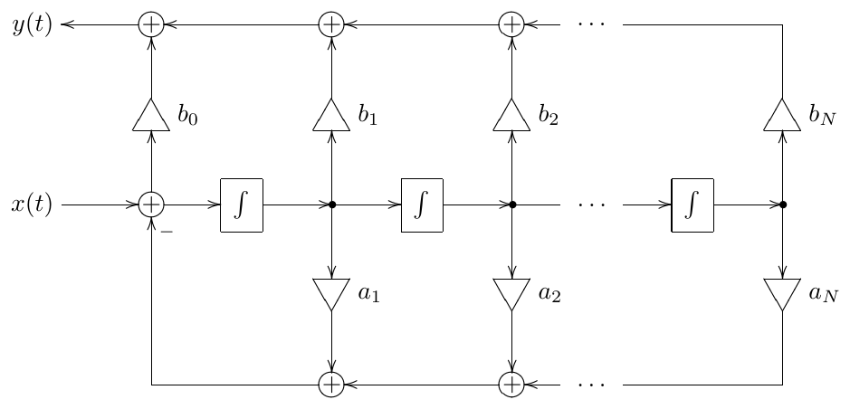

*Figure 8.1: Generalized SVF (controllable canonical form).*

$$
H(s) = \frac{\displaystyle\sum_{n=0}^{N} b_n s^{-n}}{\displaystyle 1 + \sum_{n=1}^{N} a_n s^{-n}}
= \frac{\displaystyle\sum_{n=0}^{N} b_n s^{N-n}}{\displaystyle 1 + \sum_{n=1}^{N} a_n s^{N-n}}
= \frac{\displaystyle\sum_{n=0}^{N} b_{N-n} s^n}{\displaystyle s^N + \sum_{n=0}^{N-1} a_{N-n} s^n}
$$

Thus $a_n$ and $b_n$ are simply the denominator and numerator coefficients of the
transfer function. Notice that $b_n$ are essentially modal pickups and we can share
the feedback part of the structure (consisting of integrators and $a_n$ gains) among
several different sets of pickup coefficients $b_n$ to simultaneously implement a
number of filters sharing a common denominator.

Normally Fig. 8.1 assumes unit-cutoff integrators, because the $a_n$ and $b_n$
coefficients provide enough freedom to implement any transfer function of the
given order. However, in music DSP applications cutoff control is a common
feature, therefore we could also allow the integrators to take identical non-unit
cutoffs. Further, letting $N = 2$, $a_2 = 1$ and $a_1 = 2R$ we obtain an SVF with $b_n$
serving as modal mixing coefficients for HP, BP and LP outputs. On the other
hand, at $N = 1$, $a_1 = 1$ we obtain the 1-pole filter we discussed in the beginning
of this book.

Generally, letting $a_N$ have a fixed value is a good way to remove the
redundancy introduced into the system control by the embedded cutoffs of the
integrators. It is not difficult to realize that

$$
a_N = \prod (-p_n)
$$

where $p_n$ are the positions of the system poles when $\omega_c = 1$. Notably, although
it is mostly academic, this also can support the case of real poles of opposite
signs, which cannot be implemented by a classical 2-pole SVF due to $a_N$ being
fixed to 1.

Unfortunately, there is no clear answer to what the coefficients $a_n$ should
be for $N > 2$. The simplicity of the 2-pole case was due to the fact that
the denominator of a 2-pole transfer function essentially has only 2 degrees of
freedom (corresponding to $a_1$ and $a_2$), one degree being taken by the cutoff, and
we are being left with the remaining degree which just happens to correspond to
the resonance. With the 1-pole there was only one freedom degree, being taken
by the cutoff. At $N > 2$ there are too many different options of how to map the
freedom degrees to filter control parameters and there is no definite answer to
that, although some of the options will be discussed later in this chapter.

With the numerator coefficients $b_n$ there is a bit more clarity, as there are
certain general considerations applying more or less for any choice of $a_n$. E.g.
if the numerator is equal to $a_N$, we get some kind of an $N$-th order lowpass,
since $H(0) = 1$ and $H(s) \sim a_N/s^N$ for $s \to \infty$. For the $s^N$ numerator we
have $H(\infty) = 1$ and $H(s) \sim s^N/a_N$ for $s \to 0$, corresponding to some kind
of an $N$-th order highpass. For an even $N$ and an $a_N^{1/2} s^{N/2}$ numerator we get
$H(s) \sim s^{N/2}/a_N^{1/2}$ for $s \to 0$ and $H(s) \sim a_N^{1/2}/s^{N/2}$ for $s \to \infty$, corresponding
to some kind of a bandpass. This however defines only the asymptotic behavior
at 0 and $\infty$, the amplitude response shape in the middle can be pretty much
arbitrary, being defined by the denominator.

By transposing the controllable canonical form one obtains the so-called
*observable canonical form*. We are not going to address it in detail, as most of
the discussion of the controllable canonical form above applies to the observable
canonical form as well.

## 8.2 Serial cascade representation

Another structure which allows implementing arbitrary transfer functions is the
serial cascade. It is probably the one most commonly used. Compared to the
generalized SVF, in the serial cascade representation we are using only 1- and
2-pole filters and we can choose commonly known and well-studied structures
to implement those.[^1] The benefit compared to the parallel implementation
(discussed later in this chapter) is that the serial cascade form doesn't get
ill-conditioned when system poles get close to each other.

### Cascade decomposition

Given an arbitrary $N$-th order real transfer function, let's write it in the
multiplicative form:

$$
H(s) = g \cdot \frac{\displaystyle\prod_{n=1}^{N_z} (s - z_n)}{\displaystyle\prod_{n=1}^{N_p} (s - p_n)} \tag{8.1}
$$

where $N_z \leq N_p$, since $H(s)$ must be nonstrictly proper. Since $H(s)$ has real
coefficients, all complex poles of $H(s)$ will come in conjugate pairs, and the
same can be said about the zeros.

Now we are going to write each pair of conjugate poles as a purely real
2nd-order factor in the denominator:

$$
(s - p)(s - p^*) = s^2 - s \cdot 2\operatorname{Re} p + |p|^2
$$

and we are going to write each pair of conjugate zeros as a purely real 2nd-order
factor in the numerator:

$$
(s - z)(s - z^*) = s^2 - s \cdot 2\operatorname{Re} z + |z|^2
$$

Further, if necessary, we can combine any two real poles into a 2nd-order factor
in the denominator:

$$
(s - p_1)(s - p_2) = s^2 - (p_1 + p_2) \cdot s + p_1 p_2
$$

and we can combine any two real zeros into a 2nd-order factor in the numerator:

$$
(s - z_1)(s - z_2) = s^2 - (z_1 + z_2) \cdot s + z_1 z_2
$$

Thus we can distribute all conjugate pair of poles and zeros into 2nd-order *real*
rational factors of the form

$$
\frac{s^2 + as + b}{s^2 + cs + d}
$$

unless we do not have enough zeros, in which case there will be one or more
2nd-order real rational factors of the form

$$
\frac{s+b}{s^2+cs+d} \qquad \text{and/or} \qquad \frac{1}{s^2+cs+d}
$$

The remaining pairs of real poles and zeros can be combined into 1st-order real
rational factors of the form

$$
\frac{s+a}{s+b} \qquad \text{and/or} \qquad \frac{1}{s+b}
$$

or they can be also combined into 2nd-order real rational factors, e.g.:

$$
\frac{s+a_1}{s+b_1} \cdot \frac{s+a_2}{s+b_2} = \frac{s^2+(a_1+a_2)s+a_1a_2}{s^2+(b_1+b_2)s+b_1b_2}
$$

Thus the entire transfer function is represented as a product of purely real 2nd-
and 1st-order factors:

$$
H(s) = g \cdot \prod_{n=1}^{N_2} H_{2n}(s) \cdot \prod_{n=1}^{N_1} H_{1n}(s) \tag{8.2}
$$

where $H_{2n}(s)$ and $H_{1n}(s)$ are the 2nd- and 1st-order factors respectively. The
gain coefficient $g$, if desired, can be factored into the numerator of one or several
of the factors $H_{2n}(s)$ and $H_{1n}(s)$, so that the product expression gets a simpler
form:

$$
H(s) = \prod_{n=1}^{N_2} H_{2n}(s) \cdot \prod_{n=1}^{N_1} H_{1n}(s) \tag{8.3}
$$

Now recall that 1-pole multimode can implement any stable real 1st-order transfer
function and SVF can implement any stable real 2nd-order transfer function.
This means that we can implement pretty much any $H(s)$ as a serial chain of
SVFs[^2] and 1st-order multimodes.[^3] We will refer to the process of representing
$H(s)$ is a cascade form as *cascade decomposition* of $H(s)$.

### Cutoff control

The denominator $1 + s/\omega_c$ of a 1-pole filter is controlled by a single parameter,
which is the filter cutoff. The denominator $1+2Rs/\omega_c+(s/\omega_c)^2$ of a 2-pole filter
is controlled by cutoff and damping. Thus each of the 2- and 1-poles in (8.3)
has a cutoff, defined by the positions of the respective poles. Writing explicitly
these cutoff parameters in (8.3) we obtain

$$
H(s) = \prod_{n=1}^{N_2} \bar{H}_{2n}(s/\omega_{2n}) \cdot \prod_{n=1}^{N_1} \bar{H}_{1n}(s/\omega_{1n})
$$

where $\bar{H}_{2n}$ and $\bar{H}_{1n}$ are unit-cutoff versions of the same 2- and 1-poles and $\omega_{2n}$
and $\omega_{1n}$ are the respective cutoffs.

Suppose the above $H(s)$ defines a unit-cutoff filter. Then non-unit cutoff for
$H(s)$ is achieved by

$$
H(s/\omega_c) = \prod_{n=1}^{N_2} \bar{H}_{2n}(s/\omega_c\omega_{2n}) \cdot \prod_{n=1}^{N_1} \bar{H}_{1n}(s/\omega_c\omega_{1n}) \tag{8.4}
$$

which means that the cutoffs of the underlying 2- and 1-poles are simply multiplied
by $\omega_c$ and we have $\omega_c\omega_{2n}$ and $\omega_c\omega_{1n}$ as the 2- and 1-pole cutoffs.

One should remember, that it is important to apply one and the same prewarping
for all filters in the cascade, as discussed in Section 3.8. E.g. we could
choose to prewarp (8.4) at $\omega = \omega_c$, which means that we prewarp only $\omega_c$
(rather than individually prewarping the 2- and 1-pole cutoffs $\omega_c\omega_{2n}$ and $\omega_c\omega_{1n}$),
thereby obtaining its prewarped version $\tilde\omega_c$, and then simply substitute $\tilde\omega_c$ for
$\omega_c$ in (8.4):

$$
H(s/\tilde\omega_c) = \prod_{n=1}^{N_2} \bar{H}_{2n}(s/\tilde\omega_c\omega_{2n}) \cdot \prod_{n=1}^{N_1} \bar{H}_{1n}(s/\tilde\omega_c\omega_{1n})
$$

Thus, the 2- and 1-pole cutoffs become $\tilde\omega_c\omega_{2n}$ and $\tilde\omega_c\omega_{1n}$ respectively.

### Cascaded model of a ladder filter

As an example of the just introduced technique we are going to implement the
transfer function of a 4-pole lowpass ladder filter by a serial chain of two SVFs.
A 4-pole lowpass ladder filter has no zeros and two conjugate pairs of poles
for $k > 0$. By considering two coinciding poles on a real axis also as mutually
conjugate, we can assume $k \geq 0$.

Since there are no zeros, we simply need a 2-pole lowpass SVF for each
conjugate pair of poles. Let $p_1$, $p_1^*$, $p_2$, $p_2^*$ be the poles of the ladder filter.
According to (5.2)

$$
p_{1,2} = -1 + \frac{\pm 1+j}{\sqrt{2}} k^{1/4} \tag{8.5}
$$

By (4.13), the cutoffs of the 2-pole lowpasses $\omega_{1,2} = |p_{1,2}|$ and $R = -\operatorname{Re} p_{1,2}/|p_{1,2}|$.
Respectively the transfer function of the ladder filter can be represented as

$$
H(s) = g\, \frac{1}{\left(\dfrac{s}{\omega_1}\right)^2 + 2R_1\dfrac{s}{\omega_1} + 1} \cdot \frac{1}{\left(\dfrac{s}{\omega_2}\right)^2 + 2R_2\dfrac{s}{\omega_2} + 1} \tag{8.6}
$$

The unknown gain coefficient $g$ can be found by evaluating (5.1) at $s = 0$,
obtaining the condition $H(0) = 1/(1+k)$. Evaluating (8.6) at $s = 0$ yields
$H(0) = g$. Therefore

$$
g = \frac{1}{1+k}
$$

This gives us a cascade of 2-poles implementing a unit-cutoff ladder filter.
Extending (8.6) to arbitrary cutoffs is respectively done by

$$
H(s) = \frac{1}{1+k} \cdot \frac{1}{\left(\dfrac{s}{\omega_c\omega_1}\right)^2 + 2R_1\dfrac{s}{\omega_c\omega_1} + 1} \cdot \frac{1}{\left(\dfrac{s}{\omega_c\omega_2}\right)^2 + 2R_2\dfrac{s}{\omega_c\omega_2} + 1}
$$

### Cascaded multimode

The cascade decomposition can be also used to provide modal outputs, sharing
the same transfer function denominator. In order to demonstrate this we will
consider a serial connection of two SVFs.[^4]

The transfer function of such structure can have almost any desired 4th order
stable denominator.[^5] We would like to construct modal outputs for such
connection, so that by mixing those modal signals we should be able to obtain
arbitrary numerators. This should allow us to share this chain of SVFs for
generation of two or more signals which share the same transfer function's
denominator.

We have several options of connecting two SVFs in series, depending on
which of the modal outputs of the first SVF is connected to the second SVF's
input. The most symmetric option seems to be picking up the bandpass output
(Fig. 8.2).

Now let

$$
\begin{aligned}
D_1(s) &= s^2 + 2R_1\omega_1 s + \omega_1^2 \\
D_2(s) &= s^2 + 2R_2\omega_2 s + \omega_2^2
\end{aligned}
$$

be the denominators of the transfer functions of the two SVFs and let $D(s) =
D_1(s)D_2(s)$ be their product. Writing out the transfer functions for the signals
at the SVF outputs (in respect to the input signal $x(t)$ in Fig. 8.2) we obtain

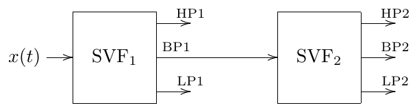

*Figure 8.2: A multimode cascade of two SVFs.*

$$
\begin{aligned}
H_{\mathrm{LP1}}(s) &= \frac{\omega_1^2}{D_1(s)} = \frac{\omega_1^2 D_2(s)}{D(s)} \\
H_{\mathrm{BP1}}(s) &= \frac{\omega_1 s}{D_1(s)} = \frac{\omega_1 s D_2(s)}{D(s)} \\
H_{\mathrm{HP1}}(s) &= \frac{s^2}{D_1(s)} = \frac{s^2 D_2(s)}{D(s)} \\
H_{\mathrm{LP2}}(s) &= \frac{\omega_2^2}{D_2(s)} \cdot H_{\mathrm{BP1}}(s) = \frac{\omega_2^2 \omega_1 s}{D(s)} \\
H_{\mathrm{BP2}}(s) &= \frac{\omega_2 s}{D_2(s)} \cdot H_{\mathrm{BP1}}(s) = \frac{\omega_2 \omega_1 s^2}{D(s)} \\
H_{\mathrm{HP2}}(s) &= \frac{s^2}{D_2(s)} \cdot H_{\mathrm{BP1}}(s) = \frac{\omega_1 s^3}{D(s)}
\end{aligned}
$$

Or, since we have the common denominator $D(s)$ everywhere, we could concentrate
just on the numerators:

$$
\begin{aligned}
N_{\mathrm{LP1}}(s) &= \omega_1^2 D_2(s) \\
N_{\mathrm{BP1}}(s) &= \omega_1 s D_2(s) \\
N_{\mathrm{HP1}}(s) &= s^2 D_2(s) \\
N_{\mathrm{LP2}}(s) &= \omega_2^2 \omega_1 s \\
N_{\mathrm{BP2}}(s) &= \omega_2 \omega_1 s^2 \\
N_{\mathrm{HP2}}(s) &= \omega_1 s^3
\end{aligned}
$$

Noticing from Fig. 8.2 that BP1 can be obtained as LP2 + $2R_2$BP2 + HP2
anyway, we can drop the respective numerator from the list and try to arrange
the remaining ones in the order of the descending polynomial order:

$$
\begin{aligned}
N_{\mathrm{HP1}}(s) &= s^2 D_2(s) = s^4 + 2R_2\omega_2 s^3 + \omega_2^2 s^2 \\
N_{\mathrm{HP2}}(s) &= \omega_1 s^3 \\
N_{\mathrm{BP2}}(s) &= \omega_2 \omega_1 s^2 \\
N_{\mathrm{LP2}}(s) &= \omega_2^2 \omega_1 s \\
N_{\mathrm{LP1}}(s) &= \omega_1^2 D_2(s) = \omega_1^2 s^2 + 2R_2 \omega_1^2 \omega_2 s + \omega_1^2 \omega_2^2
\end{aligned}
$$

The last line doesn't really fit, and the first one looks more complicated than
the next three, but we can fix that by replacing the first and the last lines by
linear combinations:

$$
\begin{aligned}
N_{\mathrm{HP1}}(s) - 2R_2\frac{\omega_2}{\omega_1}N_{\mathrm{HP2}}(s) - \frac{\omega_2}{\omega_1}N_{\mathrm{BP2}}(s) &= s^4 \\
N_{\mathrm{HP2}}(s) &= \omega_1 s^3 \\
N_{\mathrm{BP2}}(s) &= \omega_2 \omega_1 s^2 \\
N_{\mathrm{LP2}}(s) &= \omega_2^2 \omega_1 s \\
N_{\mathrm{LP1}}(s) - \frac{\omega_1}{\omega_2}N_{\mathrm{BP2}}(s) - 2R_2\frac{\omega_1}{\omega_2}N_{\mathrm{LP2}}(s) &= \omega_1^2 \omega_2^2
\end{aligned}
$$

Thus we can obtain all powers of $s$ from linear combinations of LP1, HP1, LP2,
BP2 and HP2, thereby being able to construct arbitrary polynomials of orders
up to 4 for the numerator.

Notably, instead of connecting the bandpass output of the first SVF to the input
of the second SVF, as it has been shown in Fig. 8.2, we could have connected
the lowpass or the highpass output. This would have resulted in somewhat different
math, but essentially gives the same modal mixture options.

## 8.3 Parallel representation

### Real poles

Given a transfer function which has only real poles which are all distinct, we
could expand it into a sum of 1st-order partial fractions. Each such 1st-order
fraction corresponds to a 1-pole and we could implement the transfer function
as a sum of 1-poles. Essentially this is identical to the diagonal state-space
form, which, provided all system poles are real and sufficiently distinct (so that
no ill-conditioning occurs), is just a set of parallel Jordan 1-poles.

In the case of a single-input single-output system, which we are currently
considering, the transfer function of such diagonal system, given by (7.18), has
the form

$$
H(s) = \sum_{n=1}^{N} \frac{c_n b_n}{s - p_n} + d \tag{8.7}
$$

where $b_n$ and $c_n$ are the input and output gains respectively. Given a particular
nonstrictly rational $H(s)$, the partial fraction expansion (8.7) uniquely defines
$d$ and the products $c_nb_n$. The respective freedom of choice of $c_n$ and $b_n$ can be
resolved by letting $b_n = 1\ \forall n$ and thus we control the numerator of the transfer
function by the output mixing coefficients $c_n$ (Fig. 8.3).[^6]

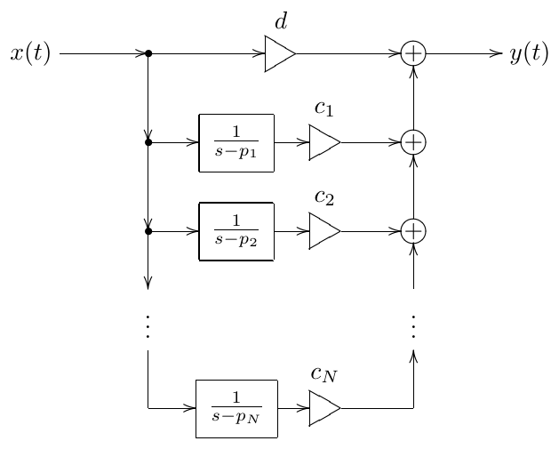

*Figure 8.3: Implementation by parallel Jordan 1-poles.*

We could also replace Jordan 1-poles by ordinary 1-pole lowpasses, where we
need to divide the mixing coefficients by the respective cutoffs $\omega_{cn}$ (Fig. 8.4).

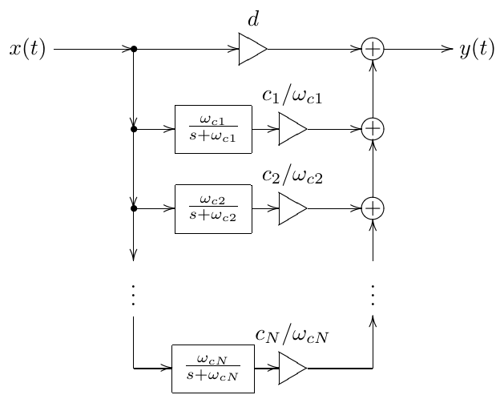

*Figure 8.4: Implementation by parallel 1-pole lowpasses.*

The global cutoff control of the entire filter in Fig. 8.3 or Fig. 8.4 is achieved
in the same way as with serial cascades. Obviously, the usual consideration of
common prewarping of the 1-pole components applies here as well.

### Complex poles

If system poles are complex we need to use the real diagonal form, which replaces
the complex Jordan 1-poles with Jordan 2-poles. For a single-input single-
output system, equation (7.28) takes the form

$$
H(s) = \sum_{\operatorname{Im} p_n > 0} \frac{\alpha_n s + \beta_n}{s^2 - 2\operatorname{Re} p_n \cdot s + |p_n|^2} + \sum_{\operatorname{Im} p_n = 0} \frac{c_n b_n}{s - p_n} + d \tag{8.8}
$$

We could obtain the explicit expressions for $\alpha_n$ and $\beta_n$ from the derivation of
(7.28), but it would be more practical to simply obtain their values from the
partial fraction expansion of $H(s)$. That is, given $H(s)$, we find $\alpha_n$ and $\beta_n$
(as well as, of course, $c_nb_n$ and $d$) from (8.8). We also should remember that,
according to the freedom of choice of the state space basis vectors lengths, we
could choose any non-zero input gains vector, e.g. $(1\ \ 0)^{\mathsf T}$ which means that we
are using only the "real part" input of the Jordan 2-pole.[^7] According to (7.26),
the contribution of such Jordan 2-pole to $H(s)$ will be

$$
\frac{1}{s^2 - 2\operatorname{Re} p_n \cdot s + |p_n|^2}
\begin{pmatrix} c_n & c_{n+1} \end{pmatrix}
\begin{pmatrix} s - \operatorname{Re} p_n & -\operatorname{Im} p_n \\ \operatorname{Im} p_n & s - \operatorname{Re} p_n \end{pmatrix}
\begin{pmatrix} 1 \\ 0 \end{pmatrix} =
$$

$$
= \frac{c_n(s-\operatorname{Re} p_n) + c_{n+1}\operatorname{Im} p_n}{s^2 - 2\operatorname{Re} p_n \cdot s + |p_n|^2}
= \frac{c_n s + (c_{n+1}\operatorname{Im} p_n - c_n \operatorname{Re} p_n)}{s^2 - 2\operatorname{Re} p_n \cdot s + |p_n|^2}
$$

Thus

$$
\begin{aligned}
\alpha_n &= c_n \\
\beta_n &= c_{n+1}\operatorname{Im} p_n - c_n \operatorname{Re} p_n
\end{aligned}
$$

from where

$$
\begin{aligned}
c_n &= \alpha_n \\
c_{n+1} &= \frac{\beta_n + \alpha_n \operatorname{Re} p_n}{\operatorname{Im} p_n}
\end{aligned}
$$

Thus, having found $\alpha_n$ and $\beta_n$, we can find $c_n$ and $c_{n+1}$. The respective structure
is shown in Fig. 8.5. Notice that as $\operatorname{Im} p_n$ becomes smaller, $c_{n+1}$ becomes
larger. This is the ill-conditioning effect of the diagonal form discussed in Section
7.11.

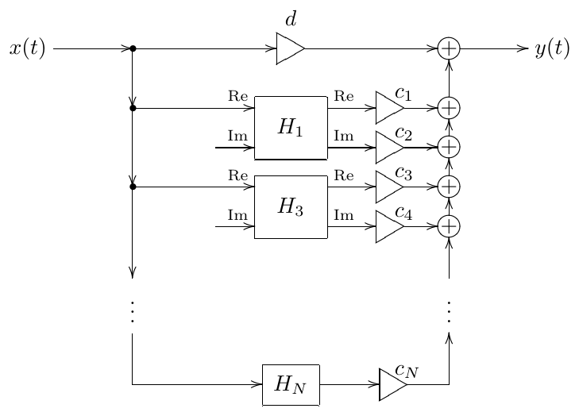

*Figure 8.5: Implementation by parallel Jordan 2- and 1-poles. Disconnected imaginary part inputs are receiving zero signals.*

Similarly to how we could replace Jordan 1-poles with ordinary 1-pole lowpasses,
we could replace Jordan 2-poles by some other 2-poles, e.g. by SVFs.
Finding the output mixing coefficients becomes simpler, since, apparently, the
coefficients $\alpha_n$ and $\beta_n$ in (8.8) now simply correspond to SVF bandpass and
lowpass output gains (properly scaled by the cutoff). Fig. 8.6 illustrates.

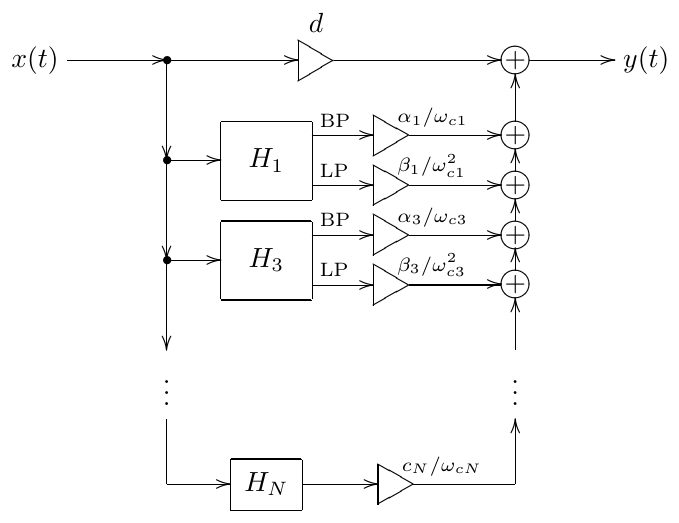

*Figure 8.6: Implementation by parallel SVFs and 1-pole lowpasses.*

Another benefit of an SVF is that it doesn't have a problem at the point
where its poles coincide and also can support the case of real poles, meaning
that we could convert arbitrary pairs of parallel 1-poles into an SVF. The same
apparently could be done by an SKF/TSK. There would still be a problem
though, if poles of different parallel 2-poles coincide, resulting in the already
known ill-conditioning effect.

Regarding the cutoff control of the entire system, there is no difference from
the parallel 1-poles case.

### Coinciding poles

Generally, anything with repeated or close to each other poles cannot be
implemented in a parallel form and needs some non-parallel implementation
(SVF, a chain of SVFs, Jordan chain, etc.) However the implementation could
still be partially parallel, where the poles may be repeated within each block,
but different parallel blocks shouldn't have poles at the same locations.

## 8.4 Cascading of identical filters

So we have learned a number of different ways to implement higher-order
transfer functions, of which cascaded form is said to be usually the best
option, however, how do we construct these transfer functions in the first
place? E.g. how do we generalize a resonating 2-pole transfer function to a
4-th or 8-th order? Or how do we generalize a 1-st order lowpass to a 5-th or
8-th order?

One possible way which could immediately occur to us is to stack several
identical filters together. Note that, given a filter with the transfer function
$G(s)$ and another one with the transfer function $H(s) = G^N(s)$ and looking
at their decibel-scale amplitude responses, we notice that the latter is simply
the former multiplied by $N$, that is the amplitude response becomes scaled
$N$ times vertically (obviously, the same scaling is happening to the phase
response). Particularly this means that the rolloff slope of the filter becomes
$N$ times steeper.

Therefore in order to generalize a 1-st order lowpass $1/(1 + s)$ to the $N$-th
order we could simply connect $N$ such lowpasses in series:

$$
H(s) = \left(\frac{1}{1+s}\right)^N
$$

resulting in the amplitude response curve in Fig. 8.7. It looks as if the cutoff
of $H(s) = G^N(s)$ is is too low. In principle we could address this by shifting
the filter cutoff, so that $|G^N(j)| = 1/\sqrt{2}$. In order to do so we solve the
equation

$$
\frac{1}{|1+j\omega|^N} = \frac{1}{\sqrt{2}}
$$

obtaining the frequency which should be treated as the cutoff point of each of
the chain's elements:

$$
\omega = \sqrt{2^{1/N} - 1}
$$

so the transfer function becomes

$$
H(s) = \left(\frac{1}{1 + s\sqrt{2^{1/N} - 1}}\right)^N \tag{8.9}
$$

This looks a bit better (Fig. 8.8) and can be taken as a possible option.

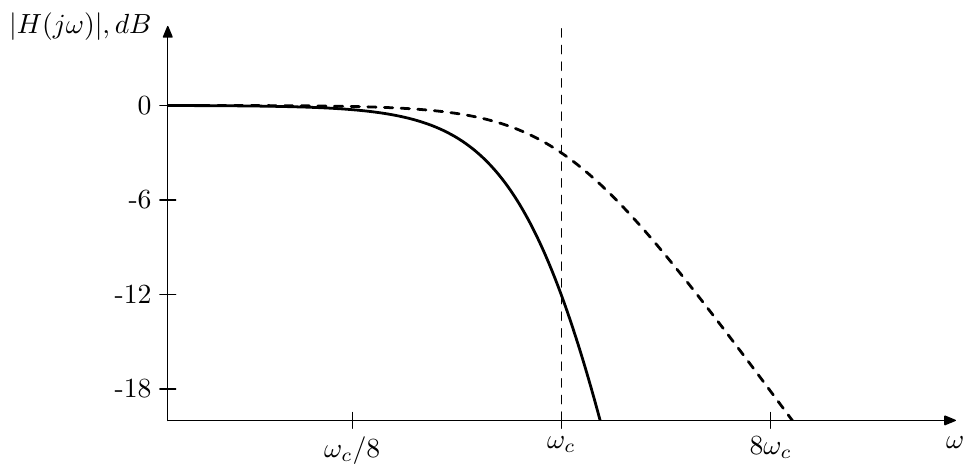

*Figure 8.7: Amplitude response of a 1-pole lowpass filter (dashed)
vs. amplitude response of a serial chain of 4 identical 1-pole lowpass
filters (solid).*

In the same way we could generalize a resonating 2-nd order lowpass
$1/(1 + 2Rs + s^2)$ to the $2N$-th order by connecting $N$ of such lowpasses
together

$$
H(s) = \left(\frac{1}{1 + 2Rs + s^2}\right)^N
$$

However in this case the situation is somewhat worse than with 1-poles. First
we notice that the resonance peak becomes much higher at the same damping
(Fig. 8.9). At first sight it doesn't look like a big problem, we could simply
use smaller values of the damping. However if we compare the amplitude
response curves of a 2-pole vs. $N$ stacked 2-poles with the damping adjusted
to produce the same peak height,[^8] we notice that due to the now smaller
damping value the resonance peak of the 2-pole chain is much wider than the
peak of a single 2-pole (Fig. 8.10), all in all not a very desirable scenario.

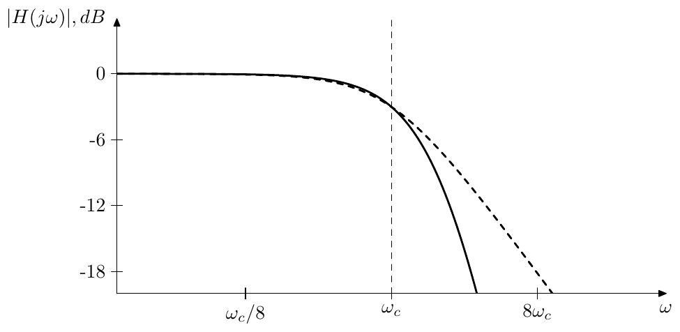

*Figure 8.8: Amplitude response of a 1-pole lowpass filter (dashed)
vs. amplitude response of a serial chain of 4 identical 1-pole lowpass
filters with adjusted cutoff (solid).*

## 8.5 Butterworth transformation

We have seen that cascading $N$ identical filters is one possible way to obtain
higher-order filters, which effectively scales the decibel-scale amplitude
response and the phase response of the filter $N$ times vertically, respectively
making the filter rolloff $N$ times steeper.

Another way to make the rolloff $N$ times steeper would be finding a
transformation which shrinks the amplitude response in the logarithmic
frequency scale $N$ times:

$$
\log\omega \leftarrow N\log\omega \qquad \omega \geq 0 \qquad N = 2,3,4,\dots
$$

(where we don't care about $\omega < 0$ because for real filters $|H(j\omega)| =
|H(-j\omega)|$, and where $\log 0 = -\infty$). Or equivalently

$$
\omega \leftarrow \omega^N \qquad \omega \geq 0 \tag{8.10}
$$

The readers may recall the LP to HP transformation $s \leftarrow 1/s$ which flips
the responses in the logarithmic frequency axis. One could try to draw an
analogy and attempt substitutions of the form $s \leftarrow s^N$ or $s \leftarrow as^N$
($a \in \mathbb{C}$, $|a| = 1$), however it's not difficult to convince oneself that such
substitutions do not work. Nevertheless, the basic direction is mostly right.
Just instead of of performing
an argument substitution on the transfer function, we will directly apply (8.10)
to the amplitude response $|H(j\omega)|$. That is we will be looking for such $H'(s)$
that

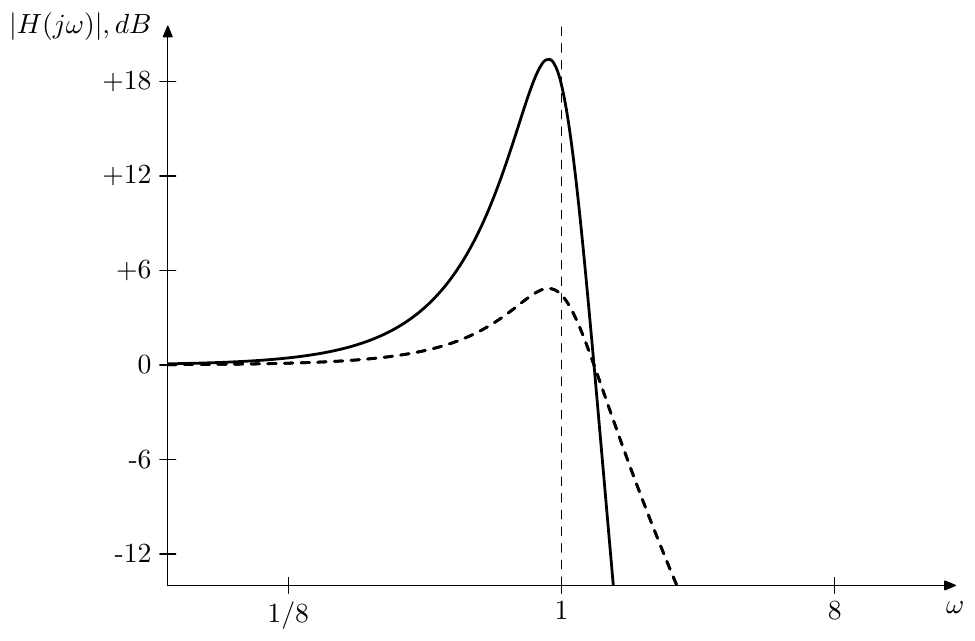

*Figure 8.9: Amplitude response of a 2-pole filter (dashed) vs. amplitude
response of a serial chain of 4 identical 2-pole filters (solid).*

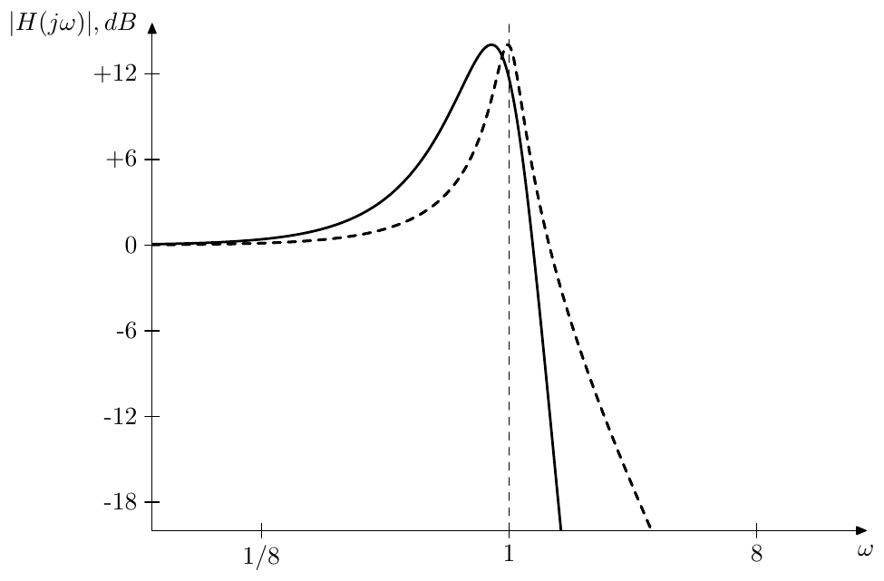

*Figure 8.10: Amplitude response of a 2-pole filter (dashed) vs.
amplitude response of a serial chain of 4 identical 2-pole filters
with adjusted damping (solid).*

$$
|H'(j\omega)| = |H(j\omega^N)| \qquad \omega \geq 0 \tag{8.11}
$$

We will refer to the transformation of $H(s)$ into $H'(s)$ defined by (8.11) as
*Butterworth transformation*.[^9] The integer $N$ will be respectively referred
to as the *order* of the Butterworth transformation. We will denote Butterworth
transformation as

$$
H'(s) = \mathcal{B}[H(s)]
$$

or, if we want to explicitly specify the order

$$
H'(s) = \mathcal{B}_N[H(s)]
$$

where $H'(s)$ denotes the new transfer function obtained as the result of the
transformation.[^10]

Without having developed the transformation details yet, we can already
establish several properties of this transformation, which follow from (8.11):

- the transformation doesn't change a constant function:

$$
\mathcal{B}[a] = a \tag{8.12a}
$$

- a constant gain can be simply factored out of the transformation:

$$
\mathcal{B}[g \cdot H(s)] = g \cdot \mathcal{B}[H(s)] \tag{8.12b}
$$

- a change of the cutoff is shrunk $N$ times in the logarithmic scale after the
  transformation:

$$
\mathcal{B}_N[H(s/a)] = \mathcal{B}_N[H(s)]\Big|_{s \leftarrow s/a^{1/N}} \tag{8.12c}
$$

- the transformation commutes with LP to HP substitution

$$
\mathcal{B}_N[H(1/s)] = \mathcal{B}_N[H(s)]\Big|_{s \leftarrow 1/s} \tag{8.12d}
$$

- the transformation distributes over multiplication:

$$
\mathcal{B}[H_1(s)H_2(s)] = \mathcal{B}[H_1(s)] \cdot \mathcal{B}[H_2(s)] \tag{8.12e}
$$

- the transformation distributes over division:

$$
\mathcal{B}[H_1(s)/H_2(s)] = \mathcal{B}[H_1(s)]/\mathcal{B}[H_2(s)] \tag{8.12f}
$$

- Butterworth transformations can be chained:

$$
\mathcal{B}_N[\mathcal{B}_M[H(s)]] = \mathcal{B}_{N \cdot M}[H(s)] \tag{8.12g}
$$

Since (8.11) doesn't uniquely define the transformation result, the above
properties have to be understood in the sense that the right-hand side can be
taken as one possible result of the transformation in the left-hand side. However
the amplitude responses of the transformation results are uniquely defined and
in those terms the above properties can be understood as usual equalities. E.g.
the property (8.12g) can be understood as

$$
|\mathcal{B}_N[\mathcal{B}_M[H(s)]]| = |\mathcal{B}_{N \cdot M}[H(s)]| \qquad \forall s = j\omega,\ \omega \in \mathbb{R}
$$

Instead of developing Butterworth transformation immediately for arbitrary
order filters we are going to first find a way to apply it to 1-pole filters and
then to 2-pole filters. At that point we will be able to simply use the property
(8.12e) to apply Butterworth transformation to arbitrary-order filters by
representing these arbitrary order filters as cascades of 1-st and 2-nd order
filters.

## 8.6 Butterworth filters of the 1st kind

As we just mentioned, first we will develop a way to apply Butterworth
transformation to 1-pole filters, in which case we will more specifically refer to
this transformation as *Butterworth transformation of the 1st kind*. The results
of Butterworth transformation of the 1st kind coincide with filters commonly
known as *Butterworth filters*. However in this book later we will generalize
the idea of Butterworth filters to include the results of Butterworth
transformation of filters of orders higher than 1. In order to be able to tell
between different kinds of Butterworth filters, we are going to more
specifically refer to the filters obtained by Butterworth transformation of
1-pole filters as *Butterworth filters of the 1st kind*.

Considering that a 1-pole transfer function is essentially a ratio of two
1st-order polynomials

$$
H(s) = \frac{P_1(s)}{P_2(s)}
$$

and that the amplitude response of $H(s)$ can be written as a ratio of formal
amplitude responses of these polynomials:

$$
|H(j\omega)| = \frac{|P_1(j\omega)|}{|P_2(j\omega)|}
$$

it is sufficient to develop the transformation for 1st-order polynomials. The
transformation of $H(s)$ can be then trivially obtained as:

$$
H'(s) = \mathcal{B}[H(s)] = \frac{\mathcal{B}[P_1(s)]}{\mathcal{B}[P_2(s)]} = \frac{P_1'(s)}{P_2'(s)}
$$

where $P_1'(s)$ and $P_2'(s)$ are transformed polynomials $P_1(s)$ and $P_2(s)$.

### Transformation of polynomial $P(s) = s + 1$

We begin by obtaining the Butterworth transformation of the polynomial
$P(s) = s + 1$. Its formal amplitude response is

$$
|P(j\omega)| = \sqrt{1 + \omega^2}
$$

and we wish to find $P'(s) = \mathcal{B}[P(s)]$ such that

$$
|P'(j\omega)| = |P(j\omega^N)| = \sqrt{1 + \omega^{2N}}
$$

In order to get rid of the square root we can deal with squared amplitude
response instead

$$
\begin{aligned}
|P(j\omega)|^2 &= 1 + \omega^2 \\
|P'(j\omega)|^2 &= 1 + \omega^{2N}
\end{aligned}
$$

Now we would like to somehow obtain $P'(s)$ from the latter equation.

In order to do so, let's notice that

$$
|P(j\omega)|^2 = 1 + \omega^2 = 1 - (j\omega)^2 = (1+j\omega)(1-j\omega) = P(j\omega)P(-j\omega) = Q(j\omega)
$$

where $Q(s) = P(s)P(-s)$, so the roots of $Q(s)$ consist of the root of $P(s)$ at
$s = -1$ and of its origin-symmetric image at $s = 1$, the latter being the root
of $P(-s)$. This motivates to introduce $Q'(s)$ such that

$$
Q'(j\omega) = 1 + \omega^{2N}
$$

and then try to factor it into $P'(s)P'(-s)$ in such a way that

$$
|P'(j\omega)|^2 = P'(j\omega)P'(-j\omega) = Q'(j\omega)
$$

In order to find the possible ways to factor $Q(s)$ into $P'(s)P'(-s)$ let us find
the roots of $Q(s)$. Instead of solving $Q'(s) = 0$ for $s$ let's solve $Q'(j\omega) = 0$
for $\omega$, where we formally let $\omega$ take complex values. The solutions in terms
of $s$ are related to the solutions in terms of $\omega$ through $s = j\omega$.

Solving $Q'(j\omega) = 1 + \omega^{2N} = 0$ for $\omega$ we obtain

$$
\omega = (-1)^{1/2N} = e^{j\alpha} \qquad \alpha = \pi\frac{2n+1}{2N} = \pi\frac{\frac{1}{2}+n}{N} \qquad n = 0,\dots,2N-1 \tag{8.13}
$$

The solutions are illustrated in Figs. 8.11 and 8.12 where the complex plane
can be alternatively interpreted in terms of $s$ or in terms of $\omega$ (note the
labelling of the axes), thus these figures simultaneously illustrate the solutions
in terms of $\omega$ or in terms of $s$. Thus the $2N$ roots of $Q'(s)$ are equally spaced
on a unit circle with an angular step of $\pi/N$. If $N$ is odd there will be roots at
$s = \pm 1$ otherwise there are no real roots.

Another possible way to look at the solutions of $Q'(j\omega) = 0$ is to rewrite
the equation $1 + \omega^{2N} = 0$ as

$$
1 + \omega^{2N} = \omega^{2N} - j^2 = (\omega^N + j)(\omega^N - j) = 0
$$

In this case the roots obtained from the equation $\omega^N - j = 0$ will be interleaved
with the roots obtained from the equation $\omega^N + j = 0$ (Figs. 8.11 and 8.12
illustrate). Sometimes therefore such roots are referred to as even and odd
roots respectively, since they occur respectively at even and odd $n$ in (8.13).
This distinction usually can be ignored, but occasionally becomes important.

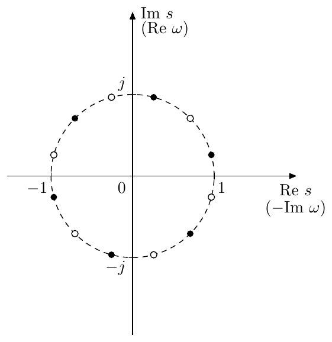

*Figure 8.11: Roots of $Q'(s)$ for the Butterworth transformation
of the 1st kind of an even order ($N = 6$). White and black dots
correspond to even and odd roots.*

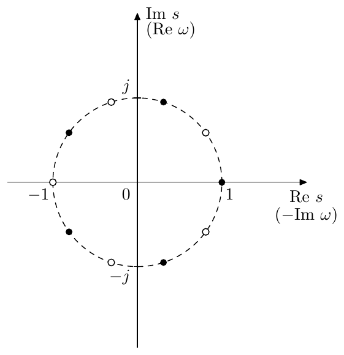

*Figure 8.12: Roots of $Q'(s)$ for the Butterworth transformation
of the 1st kind of an odd order ($N = 5$). White and black dots
correspond to even and odd roots.*

Having found the roots of $Q'(s)$ how do we split them into the roots of $P'(s)$
and the roots of $P'(-s)$? Obviously we cannot do this splitting in an arbitrary
way, since there are several special properties which need to be satisfied.

- For any possible polynomial $P'(s)$ its roots are origin-symmetric to the
  roots of $P'(-s)$, so our root splitting must respect this property.

- $P'(s)$ must be a real polynomial. This requires its roots to be either real
  or coming in complex conjugate pairs.

- If $P'(s)$ is the denominator of the filter's transfer function, then its roots
  must be located in the left complex semiplane (in order for the filter to be
  stable).

- The requrement $|P'(j\omega)|^2 = P'(j\omega)P'(-j\omega)$ implies $|P'(j\omega)| = |P'(-j\omega)|$.
  In order to satisfy the latter, the roots of $P'(s)$ must be symmetric to the
  roots of $P'(-s)$ with respect to the imaginary axis (essentially it is the
  same reasoning which we had in the discussion of minimum phase and
  maximum phase zero positioning).

Looking at Figs. 8.11 and 8.12 it's not difficult to notice that all of the above
requirements will be satisfied if we choose the roots in the left complex
semiplane to be the roots of $P'(s)$ and the roots in the right complex semiplane
as the roots of $P'(-s)$ respectively.[^11]

Having found the roots $p'_n$ of $P'(s)$ we still need to find the leading
coefficient $g'$ of $P'(s)$:

$$
P'(s) = g' \cdot \prod_n (s - p'_n)
$$

In order to do so, notice that (8.11) implies $|P'(0)| = |P(0)|$. Since $P(0) = 1$
and $|P(0)| = 1$ we should have $|P'(0)| = 1$. Actually, if we let $g' = 1$ we will
obtain $P'(0) = 1$. Indeed,

$$
P'(0) = \prod_{n=1}^N (0 - p'_n) = \prod_{n=1}^N (-p'_n)
$$

That is $P'(0)$ is equal to the product of all roots of $P'(-s)$. Looking at Figs.
8.11 and 8.12 we notice that the product of all roots of $P'(-s)$ is equal to 1
and thus $P'(0) = 1$.[^12]

Thus, by finding the roots and the leading coefficient of $P'(s)$ we have
obtained a real polynomial $P'(s) = \mathcal{B}[P(s)]$ in the multiplicative form. In
practical filter implementations the complex conjugate pairs of factors of
$P'(s)$ will be represented by 2nd-order filter sections, the purely real factor of
$P'(s)$ appearing for odd $N$ will be represented by a 1st-order filter section:

$$
P'(s) = (s+1)^{N \wedge 1} \cdot \prod_n (s^2 + 2R_n s + 1)
$$

where

$$
N \wedge 1 = \begin{cases} 1 & \text{if } N \text{ is odd} \\ 0 & \text{if } N \text{ is even} \end{cases}
$$

stands for bitwise conjunction.

### Arbitrary 1st-order polynomials

Considering $P(s)$ of a more generic form $P(s) = s + a$ ($a > 0$) we notice that
essentially the procedure is the same as for $P(s) = s + a$ except that instead of
the equation $\omega^{2N} + 1 = 0$ we obtain the equation

$$
\omega^{2N} + a^2 = 1
$$

This means that the roots of $Q'(s)$ are no longer located on the unit circle but
on a circle of radius $a^{1/N}$. It is not difficult to see that the leading coefficient
of $P'(s)$ is still equal to 1.

The above result also could have been obtained by rewriting $P(s)$ as
$P(s) = a \cdot (s/a + 1)$ and applying properties (8.12b) and (8.12c), which on
one hand gives a more intuitive understanding of why the circle of roots is
scaled by $a^{1/N}$, on the other hand can serve as an explicit proof of (8.12c) for
the case of Butterworth transformation of the 1st kind.

The case of $a = 0$ ($P(s) = s$) can be obtained as a limiting case[^13]
$a \to +0$ resulting in $P'(s) = s^N$.

If $a < 0$ then, noticing that the amplitude responses of $P(s) = s + a$ and
$P(s) = s - a$ are identical (for $a \in \mathbb{R}$), we could obtain $P'(s)$ as Butterworth
transformation of $P(s) = s - a$. However, since the root of $P(s)$ is in the right
semiplane, it would be logical to also pick the right semiplane roots of $Q'(s)$
as the roots of $P'(s)$. Particularly, if $P(s)$ is the numerator of a maximum
phase filter, the transformation result will retain the maximum phase
property.

The 1st-order polynomials of the most general form $P(s) = a_1 s + a_0$ can
be treated by rewriting them as $P(s) = a_1 \cdot (s + a_0/a_1)$, if $a_1 \neq 0$. The case
of $a_1 = 0$ can be simply treated as a limiting case $a_1 \to 0$, where we drop the
vanishing higher-order terms of $P'(s)$, resulting in $P'(s) = a_0$.

### Lowpass Butterworth filter of the 1st kind

Given

$$
H(s) = \frac{1}{s+1} \tag{8.14}
$$

we transform the denominator $P(s) = s + 1$ according to the previous
discussion of the Butterworth transformation of a 1st order polynomial. The
roots of the transformed polynomial (located on the unit circle) become the
poles of $H'(s)$. The numerator of $H'(s)$ is obviously unchanged by the
transformation. Thus we obtain

$$
H'(s) = \left(\frac{1}{s+1}\right)^{N \wedge 1} \cdot \prod_n \frac{1}{s^2 + 2R_n s + 1}
$$

where the $1/(s+1)$ term occurs in case of an odd $N$ ("$N \wedge 1$" standing
for bitwise conjunction). Therefore $H'(s)$ can be implemented as a series of
1-pole and 2-pole lowpass filters, where the 1-pole appears in case of an odd
$N$.

Fig. 8.13 compares the amplitude response of a Butterworth lowpass filter of
the 1st kind ($N = 2$) against the prototype 1-pole lowpass filter. One can
observe the increased steepness of the cutoff slope resulting from the shrinking
along the logarithmic frequency axis. Fig. 8.14 compares the same Butterworth
lowpass filter against cascading of identical 1st order lowpasses, that is
comparing the shrinking along the logarithmic frequency axis vs. stretching
along the logarithmic amplitude axis. One can see that the Butterworth
lowpass filter has the sharpest cutoff corner among different filters in Figs.
8.13 and 8.14.

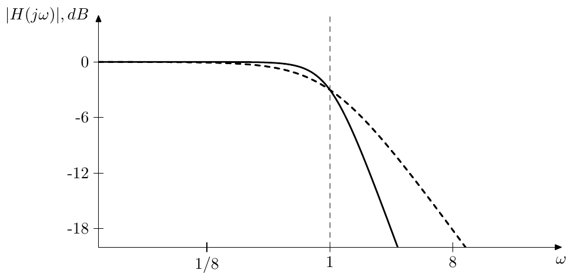

*Figure 8.13: 2nd order lowpass Butterworth filter of the 1st kind (solid
line) vs. 1st order lowpass filter (dashed line).*

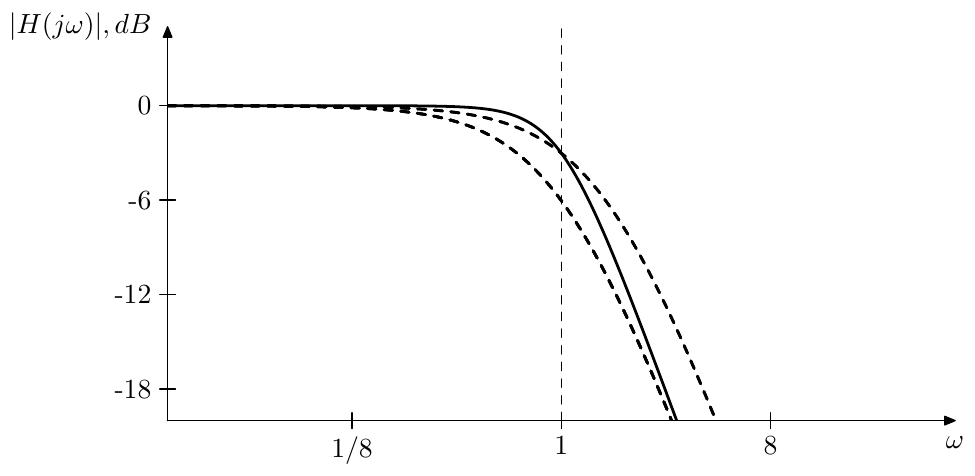

*Figure 8.14: 2nd order lowpass Butterworth filter of the 1st kind (solid
line) vs. duplicated 1st order lowpass filter without and with cutoff
adjustment (dashed lines).*

It is useful to know and recognize the expression for the squared amplitude
response of a Butterworth lowpass filter of the 1st kind. Since the squared
amplitude response of (8.14) is

$$
|H(j\omega)|^2 = \frac{1}{1 + \omega^2}
$$

after the substitution $\omega \leftarrow \omega^N$ we obtain

$$
|H'(j\omega)|^2 = \frac{1}{1 + \omega^{2N}} \tag{8.15}
$$

This expression is used in traditional derivation of Butterworth filters.
Essentially the $N$-th order lowpass Butterworth filter is traditionally
defined as a filter whose the amplitude response satisfies (8.15). Note that
by (8.15) the 1-pole lowpass is the Butterworth filter of order 1. We can
formally treat it as a 1st-order Butterworth transformation of itself

$$
\frac{1}{1+s} = \mathcal{B}_1\left[\frac{1}{1+s}\right]
$$

It is also useful to explicitly know the transfer function of the Butterworth
lowpass filter of the 1st kind of order $N = 2$. It's not difficult to realize
that for $P(s) = s + 1$ the roots of $P'(s)$ are located $45^\circ$ away from
the negative real semiaxis. Thus the respective damping is
$R = \arccos 45^\circ = 1/\sqrt{2}$ and

$$
H'(s) = \frac{1}{s^2 + \sqrt{2}s + 1}
$$

This damping value and the 2nd-order term $s^2 + \sqrt{2}s + 1$ appears in
all Butterworth filters of the 1st kind of order $N = 2$ (highpass, bandpass,
etc.) The readers may also recall the appearance of the damping value
$R = 1/\sqrt{2}$ in the discussion of 2-pole filters, where it was mentioned
that at $R = 1/\sqrt{2}$ the 2-pole filter turns into a Butterworth filter.
This also corresponds to the fact that among all non-resonating (in the sense
of the missing resonance peak) 2nd-order filters the Butterworth filter is
the one with the sharpest possible cutoff corner in the amplitude response.

### Highpass Butterworth filter of the 1st kind

For

$$
H(s) = \frac{s}{1+s}
$$

we have the same denominator as for the respective lowpass. Thus the result
of the denominator transformation is the same as for the lowpass. The result
of the numerator transformation is $s^N$ and thus

$$
H'(s) = \left(\frac{s}{s+1}\right)^{N \wedge 1} \cdot \prod_n \frac{s^2}{s^2 + 2R_n s + 1}
$$

That is we obtain the same result as for the 1-pole lowpass, except that
instead of a series of lowpasses we should take a series of highpasses. Fig.
8.15 illustrates the respective amplitude response.

It is not difficult to verify that the highpass Butterworth filter obtained
in the described above way is identical to the result of LP to HP
substitution applied to the lowpass Butterworth filter of the same order,
which is in agreement with (8.12d).

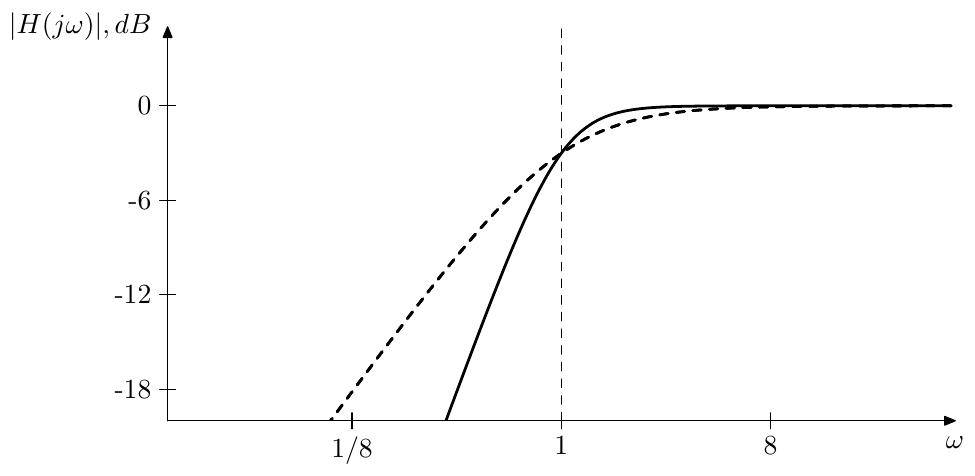

*Figure 8.15: 2nd order highpass Butterworth filter of the 1st kind vs. 1st
order highpass filter (dashed line).*

### Bandpass Butterworth filter of the 1st kind

For an even $N$, by formally putting a numerator $s^{N/2}$ over the
Butterworth transformation of a polynomial $P(s) = 1 + s$ we obtain a kind of
a bandpass filter:

$$
H'(s) = \prod_n \frac{s^{N/2}}{s^2 + 2R_n s + 1}
$$

(Fig. 8.16), which can be also formally seen as a Butterworth transformation
of $H(s) = s^{1/2}/(s+1)$.

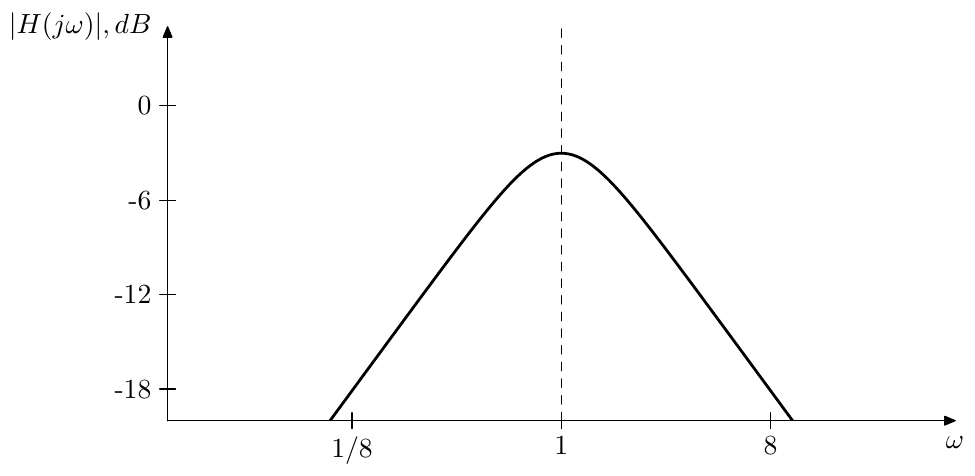

*Figure 8.16: 2nd order bandpass Butterworth filter of the 1st kind.*

Note that thereby this bandpass filter doesn't have any parameters to
control, except the cutoff. As we will see a bit later in the discussion of
Butterworth filters of the 2nd kind, this filter also can be obtained by an
order $N/2$ Butterworth transformation of the 2-pole bandpass
$H(s) = s/(s^2 + \sqrt{2}s + 1)$. Therefore there is not much point in
specifically using Butterworth bandpass filters of the 1st kind, one can
simply use Butterworth bandpass filters of the 2nd kind instead, achieving
exactly the same response at a particular resonance setting.

A bandpass filter which has controllable bandwidth can be obtained by
applying the LP to BP substitution to a Butterworth lowpass filter of the 1st
kind. Apparently this produces a normalized bandpass (Fig. 8.17). This filter
does not coincide with the result of the Butterworth transformation of the
normalized 2-pole bandpass $H(s) = \sqrt{2}s/(s^2 + \sqrt{2}s + 1)$. The
reason is that in the first case we have a Butterworth transformation of a
1-pole lowpass $1/(1+s)$ followed by the LP to BP substitution, while in the
second case we first have the LP to BP substitution (with an appropriately
chosen bandwidth) applied to $1/(1+s)$ yielding
$H(s) = \sqrt{2}s/(s^2 + \sqrt{2}s + 1)$, which is then followed by the
Butterworth transformation. So it's the opposite order of the application of
LP to BP substitution and the Butterworth transformation.

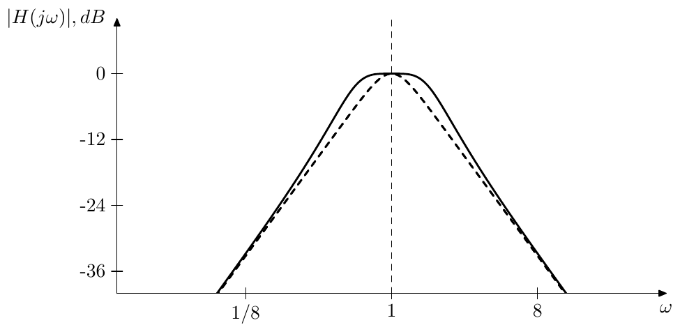

*Figure 8.17: A bandwidth-tuned LP to BP substitution of a lowpass
Butterworth filter of the 1st kind vs. Butterworth transformation of
$H(s) = \sqrt{2}s/(s^2 + \sqrt{2}s + 1)$ (dashed line).*

The LP to BP substitution can be performed algebraically on the transfer
function of the Butterworth lowpass. In order to simplify things, the
substitution can be applied in turn to the poles of each of the underlying
1- and 2-pole filters of the cascaded implementation of the Butterworth
lowpass. After organizing the transformed poles into mutually conjugate
pairs, we can simply construct the result as a series of normalized 2nd order
bandpasses, defined by those pole pairs. Alternatively the LP to BP
substitution can be implemented using the integrator substitution technique
(Fig. 4.19).

## 8.7 Butterworth filters of the 2nd kind

Now we are going to apply the Butterworth transformation to 2nd order
polynomials and respectively 2nd order filters. Such transformation will be
referred to as *Butterworth transformation of the 2nd kind* and the filters
obtained as the results of the tranformation will be referred to
*Butterworth filters of the 2nd kind*.

### Transformation of polynomial $P(s) = s^2 + 2Rs + 1$

We will first consider the following 2nd order polynomial

$$
P(s) = s^2 + 2Rs + 1
$$

corresponding to the denominator of a unit-cutoff 2-pole filter.

It will be most illustrative to obtain the Butterworth transformation of the
2nd kind as a combination of two opposite perturbations of two Butterworth
transformations of the 1st kind. Factoring $P(s)$ we obtain

$$
P(s) = (s + a_1)(s + a_2) = P_1(s)P_2(s)
$$

At $R = 1$ we have $a_1 = a_2 = 1$ and $P(s)$ is a product of two 1st-order
polynomials $P_1(s) = P_2(s) = s + 1$. Applying the Butterworth
transformation of the 1st kind to each of the polynomials $P_1'(s)$ and
$P_2'(s)$ we obtain two identical sets of the roots of $P_1'(s)$ and
$P_2'(s)$ respectively. We can also consider the respective (also identical)
extended polynomials

$$
\begin{aligned}
Q_1(s) &= P_1(s)P_1(-s) \\
Q_2(s) &= P_2(s)P_2(-s) \\
Q(s) &= P(s)P(-s) = Q_1(s)Q_2(s) \\
Q_1'(s) &= P_1'(s)P_1'(-s) \\
Q_2'(s) &= P_2'(s)P_2'(-s) \\
Q'(s) &= P'(s)P(-s) = Q_1'(s)Q_2'(s)
\end{aligned}
$$

which additionally contain the right-semiplane roots. As we should remember
from the discussion of the Butterworth transformation of the 1st kind, the
roots in each of the two sets corresponding to $Q_1'(s)$ and $Q_2'(s)$ are
equally spaced on the unit circle.[^14]

Now suppose we initially have $R = 1$ and then increase $R$ to a value
$R > 1$, resulting in $a_1$ growing and $a_2$ decreasing, staying reciprocal
to each other:

$$
a_1 = R + \sqrt{R^2 - 1} \qquad a_2 = R - \sqrt{R^2 - 1} \qquad (a_1 a_2 = 1)
$$

(Fig. 8.18). Since $a_1$ and $a_2$ are the "cutoffs" of the 1st-order
polynomials $s + a_1$ and $s + a_2$, from the properties of the Butterworth
transformation of the 1st kind we obtain that the radii of the circles, on
which the roots of $Q_1'(s)$ and $Q_2'(s)$ are located, become equal to

$$
r_1' = (R + \sqrt{R^2 - 1})^{1/N} \qquad r_2' = (R - \sqrt{R^2 - 1})^{1/N} \qquad (r_1' r_2' = 1)
$$

Thus, one circle grows and the other circle shrinks, while their radii are
staying reciprocal to each other (Fig. 8.19).

Now let's decrease $R$ from 1 to a value $0 < R < 1$. This makes $a_1$ and
$a_2$ complex:

$$
a_1 = e^{j\alpha} \qquad a_2 = e^{-j\alpha} \qquad (\cos\alpha = R,\ a_1 a_2 = 1)
$$

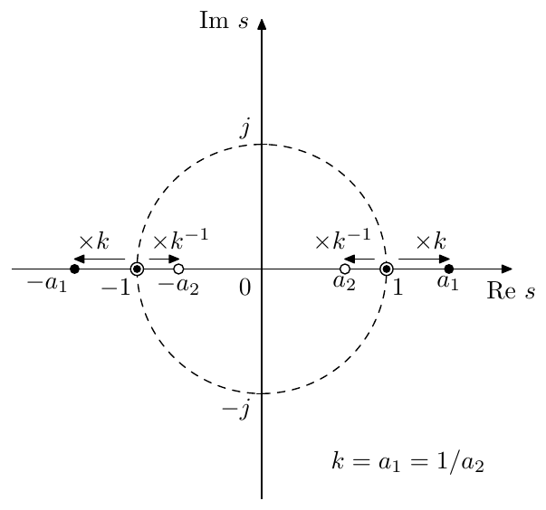

*Figure 8.18: Roots of $Q(s)$ for $R > 1$ (black dots are roots of $Q_1(s)$,
white dots are roots of $Q_2(s)$) and their positions at $R = 1$ (indicated
by circled dots, where each such dot denotes a root of $Q_1(s)$ coinciding
with a root of $Q_2(s)$).*

*Figure 8.19: Roots of $Q'(s)$ for $R > 1$ (black dots are roots of
$Q_1'(s)$, white dots are roots of $Q_2'(s)$) and their positions at $R = 1$
(indicated by circled dots, where each such dot denotes a root of $Q_1'(s)$
coinciding with a root of $Q_2'(s)$). Butterworth transformation order
$N = 2$.*

Writing out the "amplitude response" we have

$$
\begin{aligned}
|P(j\omega)|^2 &= P(j\omega)P(-j\omega) = P_1(j\omega)P_2(j\omega) \cdot P_1(-j\omega)P_2(-j\omega) = \\
&= P_1(j\omega)P_1(-j\omega) \cdot P_2(j\omega)P_2(-j\omega) = \\
&= Q_1(j\omega)Q_2(j\omega) = (\omega^2 + a_1^2) \cdot (\omega^2 + a_2^2)
\end{aligned}
$$

Respectively, our goal is to have

$$
|P'(j\omega)|^2 = Q_1'(j\omega)Q_2'(j\omega) = Q_1(j\omega^N)Q_2(j\omega^N) = (\omega^{2N} + a_1^2) \cdot (\omega^{2N} + a_2^2)
$$

So how do we find the roots of $Q_1'(s)$ and $Q_2'(s)$? If $a_1 = 1$
($\alpha = 0$, $R = 1$) then, as we just discussed, $Q_1'(s)$ simply
generates a set of the Butterworth roots of the 1st kind on the unit circle.
Now if we replace $\alpha = 0$ with $\alpha > 0$ (corresponding to replacing
$R = 1$ with $R < 1$) this means a rotation of $a_1$ by the angle $\alpha$
(Fig. 8.20). This rotates all roots of $Q_1'(j\omega) = \omega^{2N} + a_1^2$
by $\alpha/N$ (Fig. 8.21). At the same time $a_2$ will be rotated by
$-\alpha$ and respectively all roots of $Q_2'(j\omega) = \omega^{2N} + a_2^2$
by $-\alpha/N$.

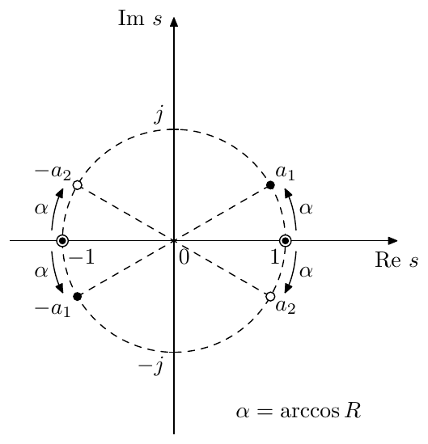

*Figure 8.20: Roots of $Q(s)$ for $0 < R < 1$ (black dots are roots of
$Q_1(s)$, white dots are roots of $Q_2(s)$) and their positions at $R = 1$
(indicated by circled dots, where each such dot denotes a root of $Q_1(s)$
coinciding with a root of $Q_2(s)$).*

Even though generally for $\alpha > 0$ the set of roots of
$\omega^{2N} + a_1^2$ is not symmetric relatively to the imaginary axis and
neither is the set of roots of $\omega^{2N} + a_2^2$, the combination of the
two sets is symmetric (as one can observe from Fig. 8.21). Thus we can simply
drop the roots in the right semiplane, the same way as we did for $R \ge 1$.
Note that this also means that we do not need to rotate the full set of
roots of $Q_1'(s)$ and $Q_2'(s)$. Since at the end we are interested just in
the left-semiplane roots, it suffices to rotate only the left-semiplane
halves of the roots of $Q_1'(s)$ and $Q_2'(s)$ (that is, the roots of
$P_1'(s)$ and $P_2'(s)$), as long as the roots do not cross the imaginary
axis. It is not difficult to realize that the said crossing of the imaginary
axis happens at $\alpha = \pi/2$ corresponding to $R = 0$, where one of the
roots on the imaginary axis will be from $P_1'(s)$ and the other from
$P_2'(s)$.

*Figure 8.21: Roots of $Q'(s)$ for $0 < R < 1$ (black dots are roots of
$Q_1'(s)$, white dots are roots of $Q_2'(s)$) and their positions at $R = 1$
(indicated by circled dots, where each such dot denotes a root of $Q_1'(s)$
coinciding with a root of $Q_2'(s)$). Butterworth transformation order
$N = 2$.*

So, let's reiterate. At $R = 1$ ($\alpha = 0$) the roots of $P'(s)$ consist of
two identical sets, each set being just the (left-semiplane) roots of a
Butterworth transformation of a 1st-order polynomial $s+1$, all roots in such
set being located on the unit cicle. For $R > 1$ we need to change the radii
of both sets in a reciprocal manner:

$$
r' = (R + \sqrt{R^2 - 1})^{\pm 1/N}
$$

(Fig. 8.19). For $R < 1$ we need to rotate both sets by opposite angles

$$
\Delta\alpha' = \pm\alpha/N \qquad \alpha = \arccos R
$$

(Fig. 8.21).

We have mentioned that at $R = 0$ ($\alpha = \pi/2$) two of the rotated roots
of $P'(s)$ reach the imaginary axis. Another special case occurs when the
roots of $P(s)$ are halfway from the "neutral position" ($\alpha = 0$) to
selfoscillation ($\alpha = \pi/2$), that is when $\alpha = \pi/4$
($R = 1/\sqrt{2}$). In this case the four roots of $Q(s)$ are equally spaced
on the unit circle with the angular step $\pi/2$. In the process of the
Butterworth transformation we rotate the roots of $Q_1'(s)$ and $Q_2'(s)$ by
$\pm\alpha/N = \pm\pi/4N$, resulting in the set of roots of $Q'(s)$ being
equally spaced on the unit circle by the angular step $\pi/2N$. But this is
the set of roots of the Butterworth transformation of the 1st kind of order
$2N$ (which produces the same polynomial order $2N$ as the order $N$
Butterworth transformation of the 2nd kind). This result becomes obvious if
we notice that at $R = 1/\sqrt{2}$ and $\alpha = \pi/4$ the polynomial
$s^2 + 2Rs + 1$ is the result of the Butterworth transformation of the 1st
kind of order 2 of the polynomial $s+1$. It is therefore no wonder that a
Butterworth transformation of order 2 followed by a Butterworth
transformation of order $N$ is equivalent to the Butterworth transformation
of order $2N$ (in other words, shrinking along the frequency axis by the
factor $2N$ is equivalent to shrinking first by the factor of 2 and then by
the factor of $N$).

### Seamless transition at $R = 1$

In the derivation of the Butterworth transformation of the 2nd kind we have
been treating the cases $R > 1$ and $R < 1$ separately. In practice however
we would like to be able to smoothly change $R$ from $R > 1$ to $R < 1$ and
back in a seamless way (without clicks or other artifacts arising from an
abrupt reconfiguration of a filter chain). This means that we need to find a
way to distribute the roots of $P'(s)$ among 2nd-order factors in a
continuous way, where there are no jumps in the values of the coefficients of
these factors if $R$ is varied in a continuous way. Formally saying, the
coefficients of the 2nd-order factors must be continuous functions of $R$
everywhere. The continuity for $R \ne 1$ should occur for granted, thus we
are specifically concerned about continuity at $R = 1$.

First, let's assume the order of the transformation is even.

Let $R \ge 1$. There is an even count of the roots of $P_1'(s)$ and these
roots come in complex-conjugate pairs (Fig. 8.19). Therefore each conjugate
pair of roots of $P_1'(s)$ can be grouped into a single 2nd-order factor. The
same can be done for $P_2'(s)$ and this half of our second-order factors
corresponds to $P_1'(s)$ and the other half to $P_2'(s)$.

At $R = 1$ both sets of 2nd-order factors become identical, since $P_1'(s)$
becomes identical to $P_2'(s)$.

At $R < 1$ the roots of $P_1'(s)$ are rotated counterclockwise and the roots
of $P_2'(s)$ are rotated clockwise (Fig. 8.21), therefore the roots of each
of the polynomials won't combine into conjugate pairs and thus the
polynomials won't be real anymore (Fig. 8.22).

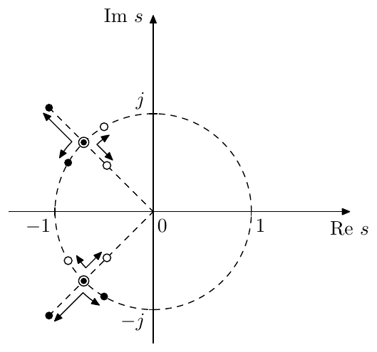

*Figure 8.22: Movement of roots of $P_1'(s)$ (black dots) and $P_2'(s)$
(white dots) as $R$ smoothly varies around $R = 1$.*

However, since we started the rotation from two identical sets of roots with
conjugate pairwise symmetry within each set, for each root of $P_1'(s)$ there
is now a conjugate root in $P_2'(s)$ and vice versa. We can therefore formally
redistribute the roots between $P_1'(s)$ and $P_2'(s)$ in such a way, that the
roots $P_1'(s)$ will be rotated by $\alpha/N$ *towards* the negative real
semiaxis (compared to $R = 1$) and the roots $P_2'(s)$ will be rotated by
$\alpha/N$ *away from* the negative real semiaxis (Fig. 8.23).

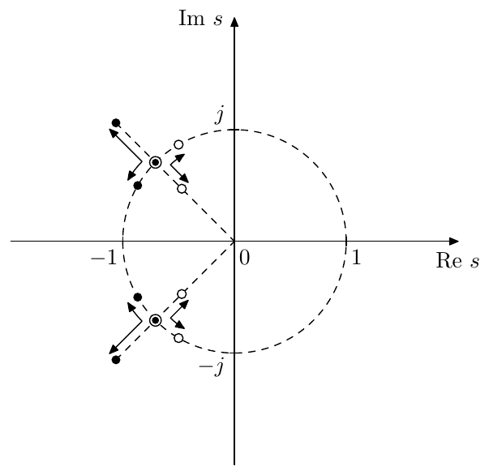

*Figure 8.23: Movement of redistributed roots of $P_1'(s)$ (black dots)
and $P_2'(s)$ (white dots) as $R$ smoothly varies around $R = 1$.*

Thus, at $R = 1$ we have two identical sets of roots. At $R > 1$ the roots of
$P_1'(s)$ move outwards from the unit circle, at $R < 1$ the roots of
$P_1'(s)$ move towards the negative real semiaxis. The roots of $P_2'(s)$ move
inwards from the unit circle ($R > 1$) and away from the negative real
semiaxis ($R < 1$). This way we can keep the same assignment of the roots to
the 2nd-order factors.[^15]

If the order of the transformation is odd, then besides the conjugate pairs
that we just discussed, we get two "special" roots, corresponding to the
purely real root of the Butterworth transformation of the 1st kind of $s + 1$
(Fig. 8.24). These two roots are real for $R \geq 1$ and complex conjugate for
$R < 1$, where at $R = 1$ both roots are at $-1$. Thus, they can simply be
assigned to one and the same 2nd-order factor of the form $s^2 + 2R's + 1$
(which cannot be formally assigned to $P_1'(s)$ or $P_2'(s)$, but can be
thought of as being "shared" among $P_1'(s)$ and $P_2'(s)$), where $R'$
depends on $R$.

### Arbitrary 2nd-order polynomials

The non-unit-cutoff polynomials $P(s) = s^2 + 2Ras + a^2$ can be simply
treated using (8.12c).

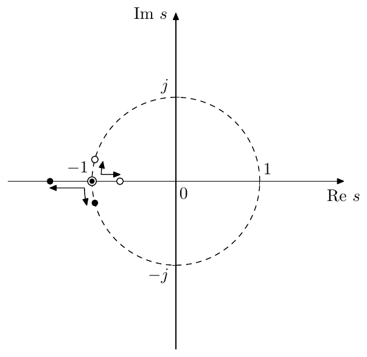

*Figure 8.24: Movement of the "special" root of $P_1'(s)$ (black dot)
and the "special" root of $P_2'(s)$ (white dot) as $R$ smoothly varies
around $R = 1$.*

The case $a = 0$ can be taken in the limiting sense $a \to 0$ giving
$P'(s) = s^{2N}$.

The case $R = 0$ also can be taken in the limiting sense $R \to +0$.

The case $R < 0$ can be treated by noticing that the amplitude responses of
$P(s) = s^2 + 2Ras + a^2$ and $P(s) = s^2 - 2Ras + a^2$ are identical. Thus,
we can apply the Butterworth transformation to the positive-damping
polynomial $P(s) = s^2 - 2Ras + a^2$. Since the roots of $P(s)$ in case of
$R < 0$ lie in the right complex semiplane, we might as well pick the right
semiplane roots for $P'(s)$. Particularly, if $P(s)$ is the numerator of a
maximum phase filter, the transformation result will retain the maximum
phase property.

The polynomial of the most general form $P(s) = a_2 s^2 + a_1 s + a_0$ can be
treated by rewriting it as $P(s) = a_2 \cdot (s^2 + (a_1/a_2)s + a_0/a_2)$
where usually $a_2 \neq 0$, $a_0/a_2 > 0$. If $a_0/a_2 < 0$ then $P(s)$ has
two real roots of opposite sign and can be handled as a product of two
1st-order polynomials, to which we can apply Butterworth transformation of
the 1st kind. If $a_2 = 0$, we can treat this as a limiting case $a_2 \to 0$.
Noticing that at $a_2 \to 0$ the damping $a_1/2a_2 \to \infty$ we rewrite
$P(s)$ as a product of real 1st-order terms:

$$
\begin{aligned}
P(s) &= a_2 \cdot \left(s + \frac{a_1 + \sqrt{a_1^2 - 4a_2 a_0}}{2a_2}\right)
\cdot \left(s + \frac{a_1 - \sqrt{a_1^2 - 4a_2 a_0}}{2a_2}\right) \sim \\
&\sim (a_2 s + a_1) \cdot (s + a_0/a_1) \qquad (\text{for } a_2 \to 0)
\end{aligned}
$$

and as $a_2$ vanishes we discard the infinitely large root of the polynomial
$a_2 s + a_1$ (and the associated roots of $P'(s)$), formally replacing the
polynomial $a_2 s + a_1$ with the constant factor $a_1$.

### Lowpass Butterworth filter of the 2nd kind

Given

$$
H(s) = \frac{1}{1 + 2Rs + s^2}
$$

and transforming its denominator according to the previous discussion of the
Butterworth transformation of a 2nd order polynomial we obtain

$$
H'(s) = \prod_n \frac{1}{s^2 + 2R_n s + 1}
$$

Therefore $H'(s)$ can be implemented as a series of 2-pole lowpass filters.

Fig. 8.25 compares the amplitude response of a Butterworth lowpass filter of
the 2nd kind ($N = 2$) against the prototype resonating 2-pole lowpass
filter. Note the increased steepness of the cutoff slope and the fact that
the resonance peak height is preserved by the transformation.

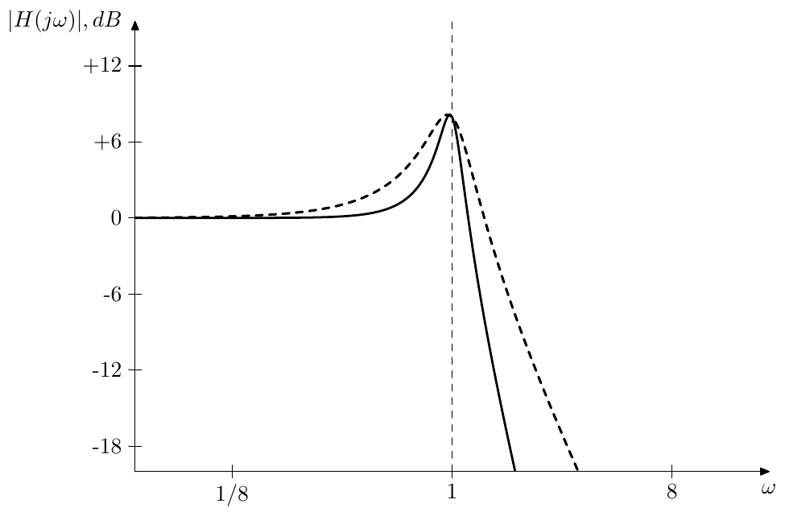

*Figure 8.25: 4th order lowpass Butterworth filter of the 2nd kind
vs. 2nd order lowpass filter (dashed line).*

Fig. 8.26 compares the same Butterworth lowpass filter against cascading of
identical 2nd order lowpasses, where the resonance has been adjusted to
maintain the same resonance peak height. Note the much larger width of the
resonance peak of the latter.

As mentioned before in the discussion of the Butterworth transformation of
the 2nd kind, at $R = 1/\sqrt{2}$ we get the same set of poles as for order
$N$ Butterworth transformation of the 1st kind. Thus, at this resonance
setting our lowpass Butterworth filter of the 2nd kind (the filter order of
which is $2N$) is equal to the lowpass Butterworth filter of the 1st kind of
the same filter order $2N$.

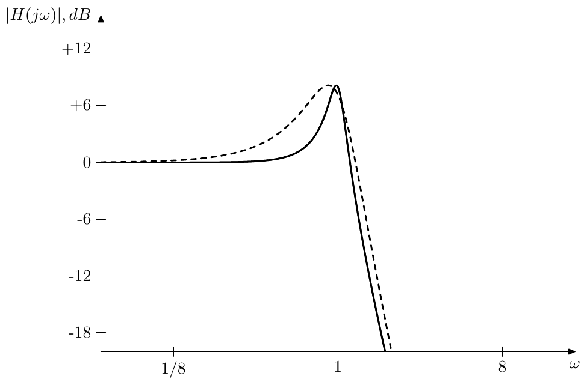

*Figure 8.26: 4th order lowpass Butterworth filter of the 2nd kind
vs. duplicated 2nd order lowpass filter of the same resonance peak
height (dashed line).*

### Highpass Butterworth filter of the 2nd kind

The highpass Butterworth filter of the 2nd kind is obtained from

$$
H(s) = \frac{s^2}{1 + 2Rs + s^2}
$$

resulting in

$$
H'(s) = \prod_n \frac{s^2}{s^2 + 2R_n s + 1}
$$

Therefore $H'(s)$ can be implemented as a series of 2-pole highpass filters.
Fig. 8.27 shows the respective amplitude response.

As with lowpass Butterworth filter of the 1st kind, the highpass Butterworth
filter of the 2nd kind can be equvalently obtained by applying the LP to HP
substitution to a lowpass Butterworth filter of the 2nd kind.

As with lowpass Butterworth filter of the 2nd kind, at $R = 1/\sqrt{2}$ we get
a highpass Butterworth filter of the 1st kind.

### Bandpass Butterworth filter of the 2nd kind

The bandpass Butterworth filter of the 2nd kind is obtained from

$$
H(s) = \frac{s}{1 + 2Rs + s^2}
$$

resulting in

$$
H'(s) = \prod_n \frac{s}{s^2 + 2R_n s + 1}
$$

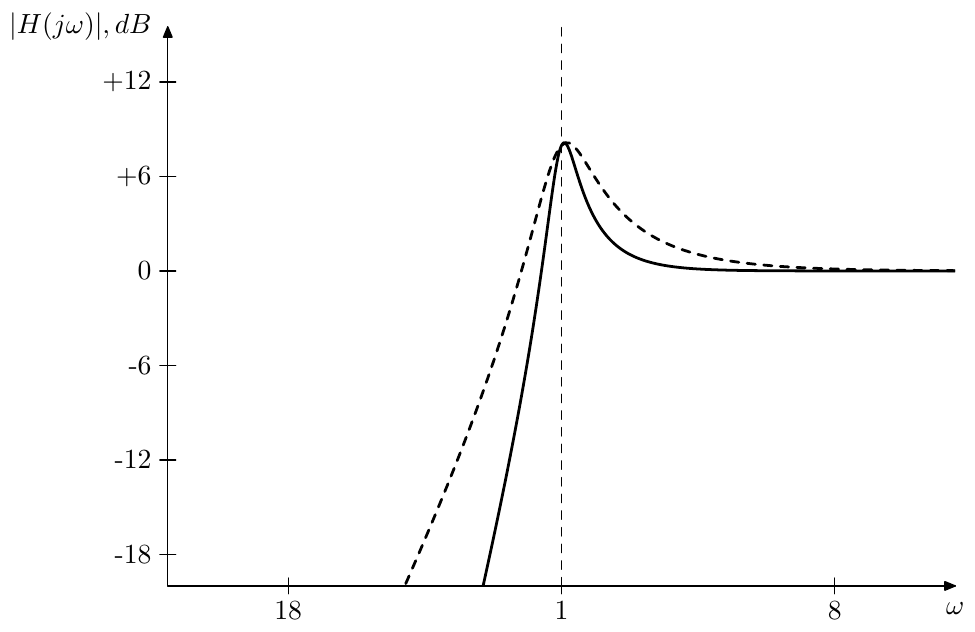

*Figure 8.27: 4th order highpass Butterworth filter of the 2nd kind
vs. 2nd order highpass filter (dashed line).*

Therefore $H'(s)$ can be implemented as a series of 2-pole bandpass filters.
Differently from the bandpass Butterworth filter of the 1st kind, this one
allows to control the amount of resonance. Fig. 8.28 shows the respective
amplitude response.

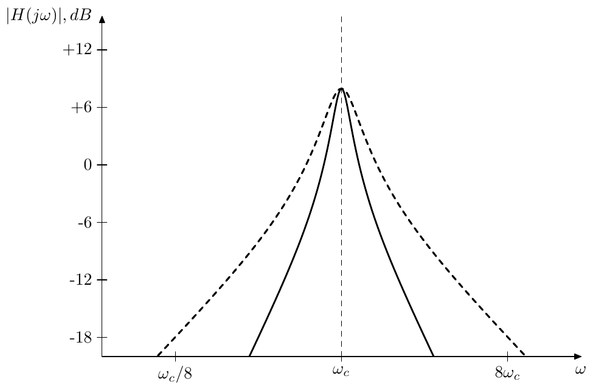

*Figure 8.28: 4th order bandpass Butterworth filter of the 2nd kind
vs. 2nd order bandpass filter (dashed line).*

As with lowpass and highpass, at $R = 1/\sqrt{2}$ we get a bandpass
Butterworth filter of the 1st kind. Since bandpass Butterworth filter of the
1st kind occurs only for an even transformation order $2N$, any bandpass
Butterworth filter of the 1st kind is simply a bandpass Butterworth filter of
the 2nd kind (of the same filter order $2N$) at a particular resonance
setting.

By replacing the underlying 2-pole bandpasses with their normalized versions
one can obtain the normalized bandpass Butterworth filter of the 2nd kind:

$$
H'(s) = \prod_n \frac{2R_n s}{s^2 + 2R_n s + 1}
$$

One can of course also apply the LP to BP substitution to a Butterworth
lowpass of the 2nd kind. Note, however, that if the lowpass has a resonance
peak, then the resulting bandpass will have two of those, so this would be a
rather special kind of a bandpass.

## 8.8 Generalized ladder filters

Now that we have learned to construct generic higher-order filters with
resonance (by means of Butterworth transformation) we might consider going
into the selfoscillation range by letting the 2nd kind Butterworth poles in
Fig. 8.21 rotate past the imaginary axis (that is by letting $\alpha > \pi/2$).
Clearly we would need a nonlinear implementation structure then, to prevent
the selfoscillating filter from explosion.

So far we have discussed 3 different implementations of generic high-order
filters: generalized SVF and serial and parallel cascades. The SVF structure
doesn't accomodate nonlinearities easily, even though there can be ways. With
serial and parallel cascades we of course could use various nonlinear 2-poles
(and possibly nonlinear 1-poles) in the implementation, however this doesn't
feel very natural, compared to the nonlinearities appearing in the ladder
filters. As we should remember, in ladder filters the resonance is created by
the feedback, the more feedback, the more resonance, so that a saturator in
the feedback loop was an efficient way to build a nonlinear ladder filter. In
such filter the nonlinearity is a part of a feedback loop going through the
entire filter, whereas in cascade implementations different nonlinearities
would be independent. Of course, both approaches work in a way, but the
approach where we have independent nonlinearities feels somewhat more
artificial than the one with a "global" nonlinearity affecting the entire
filter. For that reason we will make another attempt at generalizing the
4-pole ladder filter to abitrary pole counts.

We have seen that one can apply the general idea of a ladder filter to pole
counts other than 4 by simply increasing the number of underlying 1-poles,
but it hardly looks as a smooth generalization, as, except for
bandpass[^16] ladders, the resonance behavior of the resulting filters is
obtaining "special features", like e.g. an offset of the resonant peak
position for the 8-pole lowpass. We will start now with a different approach,
namely with the generalized SVF (Fig. 8.1) where we replace all integrators
with 1-pole lowpass filters (which, as it's not diffiult to realize,
corresponds to the substitution $s \leftarrow s + 1$). Fig. 8.29 illustrates
(compare to Fig. 8.1).

*Figure 8.29: Generalized ladder (generalized TSK) filter.*

Comparing to Fig. 5.9 we notice that the difference is that we are taking the
feedback signal as a linear combination of all modal outputs, rather than
simply from the last modal output. Comparing to Fig. 5.26 we notice that the
latter essentially implements the same idea: taking a mixture of modal
outputs as feedback signal, where both structures become equivalent at
$a_1 = -k$ and $a_2 = k$. Thus, one could see Fig. 8.29 also as a
generalization of the TSK filter.

The transfer function of Fig. 8.29 can be obtained from the transfer function
of Fig. 8.1 by $s \leftarrow s + 1$ substitution:

$$
H(s) = \frac{\displaystyle\sum_{n=0}^{N} b_{N-n}(s+1)^n}
{\displaystyle (s+1)^N + \sum_{n=0}^{N-1} a_{N-n}(s+1)^n}
$$

Given a prescribed transfer function in the usual form

$$
H(s) = \frac{\displaystyle\sum_{n=0}^{N} \beta_n s^n}
{\displaystyle s^N + \sum_{n=0}^{N-1} \alpha_n s^n}
$$

we could obtain the $a_n$ and $b_n$ coefficients from $\alpha_n$ and $\beta_n$
by equating both transfer function forms

$$
\frac{\displaystyle\sum_{n=0}^{N} b_{N-n}(s+1)^n}
{\displaystyle (s+1)^N + \sum_{n=0}^{N-1} a_{N-n}(s+1)^n}
=
\frac{\displaystyle\sum_{n=0}^{N} \beta_n s^n}
{\displaystyle s^N + \sum_{n=0}^{N-1} \alpha_n s^n}
$$

and then performing the $s + 1 \leftarrow s$ (or equivalently $s \leftarrow
s - 1$) subtitution on the entire equation:

$$
\frac{\displaystyle\sum_{n=0}^{N} b_{N-n}s^n}
{\displaystyle s^N + \sum_{n=0}^{N-1} a_{N-n}s^n}
=
\frac{\displaystyle\sum_{n=0}^{N} \beta_n (s-1)^n}
{\displaystyle s^N + \sum_{n=0}^{N-1} \alpha_n (s-1)^n}
$$

Now we simply expand all $(s-1)^n$ in the right-hand side and equate the
coefficients at the same powers of $s$ to obtain the expressions for $a_n$
and $b_n$ via $\alpha_n$ and $\beta_n$.

### Nonlinearities

Letting all $a_n = 0$ in Fig. 8.29 we obtain an $N$-th order lowpass of the
form $1/(s+1)^N$. This consideration shows that the resonance in Fig. 8.29,
if any, would be created through non-zero $a_n$ coefficients and one could
prevent the filter from exploding selfoscillation by inserting a saturator
into the feedback path, which would effectively reduce the values of $a_n$,
bringing them almost to zero at excessive signal levels. Fig. 8.30
illustrates.

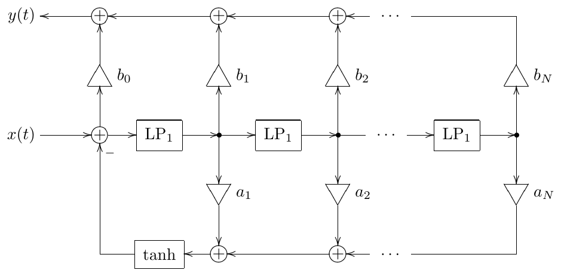

*Figure 8.30: Nonlinear generalized ladder.*

The feedback modal mixing coefficients $a_n$ serve the role of the feedback
gain coefficient $k$ from Fig. 5.9. That is we don't have anymore a single
gain coefficient to control the feedback amount. Therefore we can't place the
saturator in Fig. 8.30 before the gains. If a reverse placement of the
saturator relatively to the gains is desired, we can use the transposed
version of Fig. 8.30.

In order to compare Fig. 8.31 to Fig. 5.9, or, even better, this time to
Fig. 5.1 we should assume in Fig. 8.31 all $b_n = 0$ except $b_N = 1$, which
corresponds to modal gains for the pure $N$-th order lowpass mode. Then we
can see that Fig. 8.31 differs from Fig. 5.1 by the fact that the feedback is
going not only to the input of the first lowpass stage, but to all lowpass
stages. It is also
instructive to compare Fig. 8.31 to Fig. 5.31, where we should be able to see
that Fig. 8.31 is a generalized version of Fig. 5.31 with $a_1 = -k$ and
$a_2 = k$.

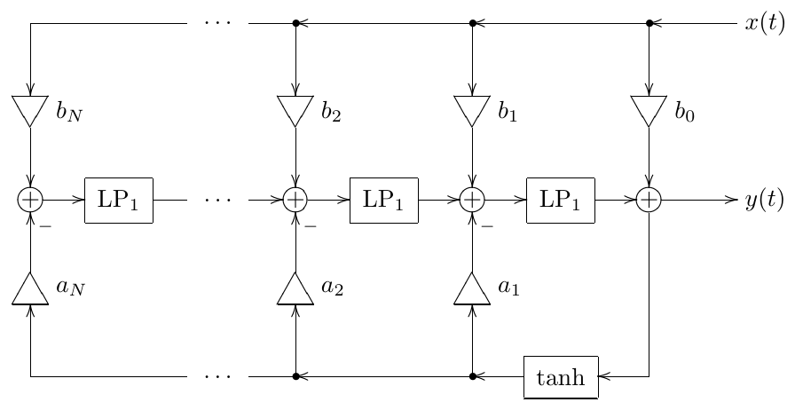

*Figure 8.31: Transposed nonlinear generalized ladder.*

### Non-lowpass generalizations

In principle we could perform other substitutions in the generalized SVF
structure. E.g. we could replace integrators with highpass filters, which
corresponds to the substitution $1/s \leftarrow s/(1+s)$ or, equivalently
$s \leftarrow 1 + 1/s$. This would correspond to generalized highpass ladder
filters. More complicated substitutions could also be done, e.g. replacing
some integrators with highpasses and some with lowpasses. One also doesn't
have to be limited by using 1-poles as substitutions. Having outlined the
basic idea, we won't go into further detail.

## Summary

We have introduced four general topology classes: the generalized SVF, the
serial cascade form, the parallel form and the generalized ladder filter.
These topologies can be used to implement almost any transfer function (with
the most prominent restriction being that the parallel form can't deal with
repeated poles).

We also introduced two essentially different ways to obtain a higher-order
filter from a given filter of a lower order: identical filter cascading and
Butterworth transformation. The former is stretching the amplitude and phase
responses vertically (which may cause a number of unwanted effects), while
the latter is shrinking the amplitude response horizontally.

[^1]: Serial cascade implementation is especially popular in classical DSP, since direct forms
    commonly used there are reportedly starting to have more issues as the filter order grows,
    although the author didn't verify that by his own experiments.

[^2]: Of course a multimode TSK, a multimode SKF, or any other 2nd-order filter with sufficient
    freedom in transfer function parameters would do instead of an SVF.

[^3]: Apparently $H(s)$ can be implemented by 1-poles and SVFs if its factors can be implemented
    by 1-poles and SVFs. Those which can not, can be implemented by generalized SVFs.

[^4]: The idea to specifically address this is the book arose from a discussion with Andrew
    Simper.

[^5]: Denominators not achievable by classical SVFs can be achieved by using generalized 2nd-
    order SVFs.

[^6]: Of course, we could instead let $c_n = 1$ and control the transfer function numerator by the
    input gains $b_n$, or distribute the control between $b_n$ and $c_n$.

[^7]: The dual approach would be to let the output mixing vector $(1\ \ 0)$, in which case
    we control the transfer function's numerator by the input gains.

[^8]: We can do this using formulas (4.7) and (4.8).

[^9]: The term *Butterworth transformation* has been coined by the author and
    is originating from the fact that this transformation, when applied to 1-pole
    filters, generates Butterworth filters. At the time of the writing the author
    is not aware of this concept being described elsewhere in the literature and
    would be thankful for any pointers to the commonly used terminology, if any
    exists.

[^10]: Of course, (8.11) doesn't uniquely define $H'(s)$. E.g. if $H'(s)$ satisfies
    (8.11), then so does $-H'(s)$. In that sense Butterworth transformation is not
    uniquely defined. However during the development of the Butterworth
    transformation we will suggest some default choices which will work most
    of the time. Assuming these default choices, the Butterworth transformation
    becomes uniquely defined.

[^11]: If $P(s)$ is the numerator of a transfer function, then the roots all being
    in the left semiplane imply the minimum phase implementation. However
    in this case we could instead pick up the right semiplane roots as the roots
    of $P(s)$, thereby obtaining a maximum phase transfer function. Or one
    could take the minimum phase implementation and exchange one conjugate
    pair of roots of $P(s)$ against the matching conjugate pair of roots of $P(-s)$.
    Or one could exchange several of such pairs. Or one could exhange the real
    roots of $P(s)$ and $P(-s)$ if the transformation order is odd. Still, the default
    choice will be to take the roots from the left semiplane.

[^12]: Obviously $g' = -1$ would also ensure $|P'(0)| = 1$. However, the default
    choice will be $g' = 1$.

[^13]: Treating as a limiting case (here and later in the text) is important
    because it ensures the continuity of the result at the limiting point.

[^14]: With Butterworth transformation of the 2nd kind we won't be making a
    distinction between even and odd roots. Instead we will be paying
    attention to which roots originate from $Q_1(s)$ and which from
    $Q_2(s)$.

[^15]: Of course we could have done the opposite redistribution of roots
    among $P_1'(s)$ and $P_2'(s)$, where the roots of $P_1'(s)$ move outwards
    from the unit circle and away from the negative real semiaxis, while the
    roots of $P_1'(s)$ move inwards from the unit circle and towards the
    negative real semiaxis.

[^16]: And allpass, as covered in Chapter 11.
