# Chapter 9: Classical signal processing filters

In Chapter 8 we have introduced, among other ideas, Butterworth filters of the
1st kind. In this chapter we are going to construct further similar filter
types by allowing the amplitude response to have ripples of equal amplitude
(a.k.a. *equiripples*) in the pass- or stop-band, or in both. These filters as
well as Butterworth filters of the 1st kind are the filter types used in
classical signal processing. They have somewhat less prominent role in music
DSP, therefore we first concentrated on other filter types. Still, they are
occasionally useful.

## 9.1 Riemann sphere

Before we begin discussing equiripple filters we need to go into some detail
of complex algebra, concerning the Riemann sphere and some derived concepts.
The key feature of the Riemann sphere is that infinity is treated like any
other point, and this (among with some other possibilities arising out of
using the Riemann sphere) will be quite helpful in our discussions. It seems
there are a number of slightly different conventions regarding the Riemann
sphere. We are going to introduce now one particular convention which will be
most useful for our purposes.[^1]

Given a complex plane $w = u + jv$ we introduce the third dimension, thereby
embedding the plane into the 3-dimensional space $(x, y, z)$. The $x$ and $y$
axes coincide with $u$ and $v$ axes, the $z$ axis is directed upwards. The
Riemann sphere will be the sphere of a unit radius $x^2 + y^2 + z^2 = 1$
(Fig. 9.1). Thus, the intersection of the Riemann sphere with the complex
plane is at the "equator" which in terms of $w$ is simply the complex unit
circle $|w| = 1$. The center of projection will be at the "north pole"
$(0, 0, 1)$ of the Riemann sphere, which thereby is the image of $w = \infty$.
Respectively, the complex unit circle $|w| = 1$ coincides with its own
projection image on the Riemann sphere.

We will denote and refer to the points on the Riemann sphere by the complex
values that they represent. E.g. the "north pole" will be simply denoted as
$\infty$,
the "south pole" as $0$, the point on the "zero meridian" as $1$, the point on
the $90^\circ$ meridian as $j$ etc. Some of these points are shown on Fig. 9.1.

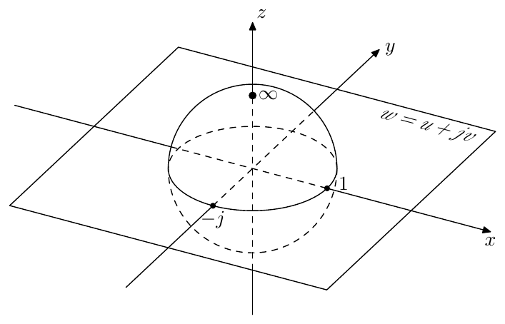

*Figure 9.1: Riemann sphere.*

### Real Riemann circle

The 2-dimensional subspace $(x, z)$ of the $(x, y, z)$ space in Fig. 9.1
contains just the real axis $u$ of the complex plane and the real axis's
image on the Riemann sphere which is a circle of unit radius $x^2 + z^2 = 1$
(Fig. 9.2). It will be intuitive to refer to this circle as the *real Riemann
circle*.

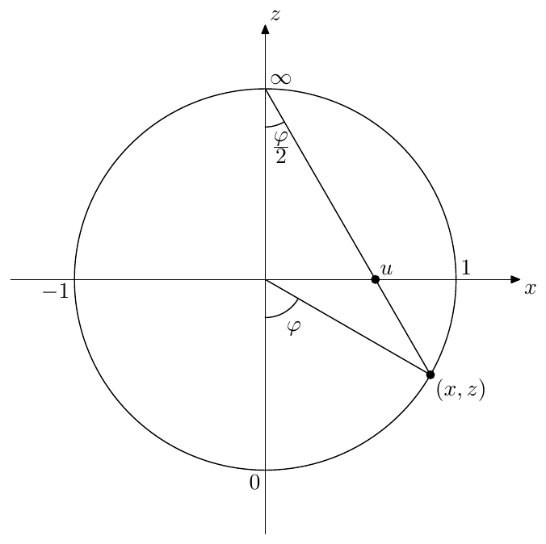

*Figure 9.2: Real Riemann circle. The 0, 1, $\infty$, -1 labels denote
the points on the circle which correspond to these values.*

We can use the polar angle $\varphi$ (defined as shown in Fig. 9.2) as the
coordinate on the Riemann circle. One of the reasons for this choice of
definition of $\varphi$ are the following convenient mappings between $u$ and
$\varphi$:

$$
\begin{aligned}
u = 0 &\iff \varphi = 2\pi n \\
u = 1 &\iff \varphi = \frac{\pi}{2} + 2\pi n \\
u = -1 &\iff \varphi = -\frac{\pi}{2} + 2\pi n \\
u = \infty &\iff \varphi = \pi + 2\pi n
\end{aligned}
$$

Also, if we restrict $\varphi$ to $(-\pi, \pi)$, then

$$
\begin{aligned}
u = 0 &\iff \varphi = 0 \\
u > 0 &\iff \varphi > 0 \\
u < 0 &\iff \varphi < 0
\end{aligned}
$$

From Fig. 9.2, using some basic geometry it's not difficult to find that $u$
and $\varphi$ are related as

$$
u = \tan\frac{\varphi}{2} \tag{9.1}
$$

and that

$$
u = \frac{x}{1-z} \tag{9.2a}
$$

By introducing the "homogeneous" coordinate $\bar z = 1 - z$ the equation
(9.2a) can be rewritten in a more intuitive form:

$$
u = x/\bar z \tag{9.2b}
$$

Conversely, using Fig. 9.2 and equation (9.1) we have

$$
x = \sin\varphi = \frac{2u}{u^2+1} \tag{9.3a}
$$

$$
z = -\cos\varphi = \frac{u^2-1}{u^2+1} \tag{9.3b}
$$

$$
\bar z = \frac{2}{u^2+1} \tag{9.3c}
$$

### Symmetries on the real Riemann circle

Certain symmetries between a pair of points on the real axis correspond to
symmetries on the real Riemann circle. Specifically, from (9.1) we obtain:

$$
u_1 + u_2 = 0 \iff \varphi_1 + \varphi_2 = 2\pi n \tag{9.4a}
$$

$$
u_1 u_2 = 1 \iff \varphi_1 + \varphi_2 = \pi + 2\pi n \tag{9.4b}
$$

$$
u_1 u_2 = -1 \iff \varphi_1 - \varphi_2 = \pi + 2\pi n \tag{9.4c}
$$

or, by restricting $\varphi_1$ and $\varphi_2$ to $[-\pi, \pi]$

$$
u_1 + u_2 = 0 \iff \varphi_1 + \varphi_2 = 0 \tag{9.5a}
$$

$$
u_1 u_2 = 1 \iff \frac{\varphi_1 + \varphi_2}{2} = \pm\frac{\pi}{2} \tag{9.5b}
$$

$$
u_1 u_2 = -1 \iff \varphi_1 - \varphi_2 = \pm\pi \tag{9.5c}
$$

Fig. 9.3 illustrates.

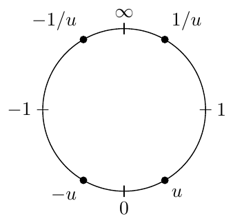

*Figure 9.3: Symmetries of the values on the real Riemann circle.*

### Coordinate relationships for the Riemann sphere

The equations (9.2) and (9.3) generalize to the 3-dimensional space $(x, y,
z)$ containing the complex plane $w = u+jv$ and the Riemann sphere
$x^2+y^2+z^2 = 1$ in an obvious way as:

$$
u = \frac{x}{1-z} = x/\bar z \tag{9.6a}
$$

$$
v = \frac{y}{1-z} = y/\bar z \tag{9.6b}
$$

$$
w = u + jv = \frac{x+jy}{\bar z} \tag{9.6c}
$$

and

$$
x = \frac{2u}{|w|^2+1} \tag{9.7a}
$$

$$
y = \frac{2v}{|w|^2+1} \tag{9.7b}
$$

$$
z = \frac{|w|^2-1}{|w|^2+1} \tag{9.7c}
$$

$$
\bar z = \frac{2}{|w|^2+1} \tag{9.7d}
$$

$$
\tag{9.7e}
$$

The equation (9.1) can be generalized if we restrict $\varphi$ to $[0, \pi]$,
in which case

$$
|w| = \tan\frac{\varphi}{2} \tag{9.8}
$$

In principle we could also introduce the spherical azimuth angle, which is
simply equal to $\arg w$, but we won't do it in this book.

### Imaginary Riemann circle

The $(y, z)$ subspace of the $(x, y, z)$ space in Fig. 9.1 contains just the
imaginary axis $v$ of the complex plane and the imaginary axis's image on the
Riemann sphere which is a circle of unit radius $x^2 + y^2 = 1$. We will refer
to this circle as the *imaginary Riemann circle*.

There are no essential differences to the real Riemann circle. The same
illustrations and formulas hold, except that we should use $v$ in place of
$u$. Fig. 9.4 provides a simple illustration of the circla and its symmetries.
Note that the reciprocal symmetries change sign if expressed in terms of the
complex variable $w$, since $1/jv = -j/v$.

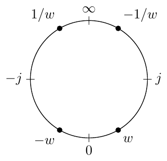

*Figure 9.4: Symmetries of the values on the imaginary Riemann
circle, where $w = jv$, $v = \operatorname{Im} w$.*

## 9.2 Arctangent scale

From the Riemann circle one can derive a special scale which will be useful
for plotting function graphs with interesting behavior around infinity. One
commonly known special scale is a logarithmic scale $x' = \log x$ which maps
the logical values $x$ to the geometric positions $x'$ on the plot. In a
similar fashion, we introduce the *arctangent scale*

$$
x' = 2\arctan x \tag{9.9}
$$

which is using the polar angle $\varphi$ of the real Riemann circle as the
geometric position $x'$. It is easy to notice that (9.9) is equivalent to
(9.1), where we have $x$ in place of $u$ and $x'$ in place of $\varphi$.

The actangent scale warps the entire real axis $(-\infty, +\infty)$ into the
range $(-\pi, \pi)$. Due to the periodic nature of the Riemann circle's polar
angle it is not unreasonable to require the scale $x'$ to be periodic as
well, in which case we can also support the value $x = \infty$ which will map
to $\pi + 2\pi n$.

Treating the infinity like any other point, the arctangent scale provides a
convenient means for plotting the functions where the range of the values of
interest includes infinity. E.g. we could plot the graph of the cosecant
function $y = \csc x = 1/\sin x$ using the arctangent scale for the function's
value axis, as illustrated by Fig. 9.5

### Symmetries in the arctangent scale

The symmetries of a graph plotted in the arctangent scale are occurring in
agreement with Riemann circle symmetries (9.4) and (9.5) (illustrated in
Fig. 9.3). Specifically:

1. Mutually opposite values are symmetric with respect to points $0$ and
   $\infty$.

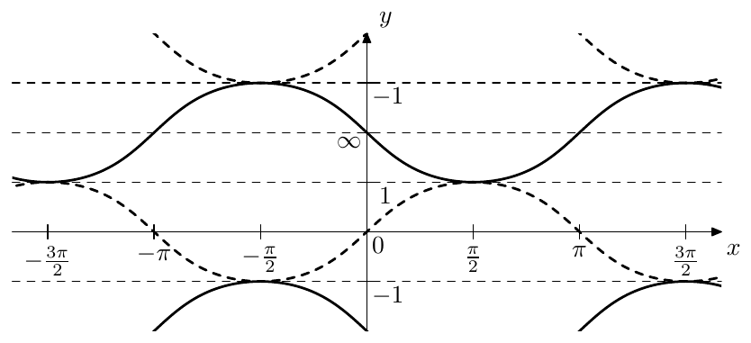

*Figure 9.5: Graphs of $y = \sin x$ (dashed) and $y = \csc x = 1/\sin x$
(solid) using arctangent scale for the ordinate.*

2. Mutually reciprocal values are symmetric with respect to points $1$ and
   $-1$.

3. Values whose product is $-1$ map are spaced by the distance equal to the
   half of the arctangent scale's period, that is e.g. to the distance
   between $-1$ and $1$ or between $0$ and $\infty$.

One can observe all of these properties if Fig. 9.5, where the third
property can be observed between the $\csc x$ and the half-period-shifted
$\sin x$.

## 9.3 Rotations of Riemann sphere

We are going to introduce two special transformations of the complex plane:

$$
\rho_{+1}(w) = \frac{1+w}{1-w} \tag{9.10a}
$$

$$
\rho_{-1}(w) = \frac{w-1}{w+1} \tag{9.10b}
$$

where $w \in \mathbb{C} \cup \infty$. It is easy to check by direct
substitution that $\rho_{-1}(\rho_{+1}(w)) = \rho_{+1}(\rho_{-1}(w)) = w$,
that is the transformations $\rho_1$ and $\rho_{-1}$ are each other's
inverses.[^2] As we shall see, $\rho_{\pm1}$ are simply rotations of the
Riemann sphere by $90^\circ$ in two opposite directions.

Letting $w = u + jv$ where $u$ and $v$ are the real and imaginary parts of
$w$, we have

$$
\begin{aligned}
w' = u' + jv' = \rho_{+1}(w) &= \frac{1+w}{1-w} = \frac{1+(u+jv)}{1-(u+jv)} = \frac{(1+u)+jv)}{(1-u)+jv} = \\
&= \frac{\bigl((1+u)+jv\bigr)\bigl((1-u)+jv\bigr)}{(1-u)^2+v^2} = \frac{(1-u^2-v^2)+2jv}{1+u^2+v^2-2u} = \frac{(1-|w|^2)+2jv}{1+|w|^2-2u}
\end{aligned}
$$

That is

$$
u' = \frac{1-|w|^2}{1+|w|^2-2u}
$$

$$
v' = \frac{2v}{1+|w|^2-2u}
$$

On the other hand,

$$
|w'|^2 = \left|\frac{1+w}{1-w}\right|^2 = \frac{|1+w|^2}{|1-w|^2} = \frac{(1+u)^2+v^2}{(1-u)^2+v^2} = \frac{1+|w|^2+2u}{1+|w|^2-2u}
$$

and

$$
|w'|^2+1 = \frac{(1+|w|^2+2u)+(1+|w|^2-2u)}{1+|w|^2-2u} = 2\frac{1+|w|^2}{1+|w|^2-2u}
$$

from where by (9.7d)

$$
\bar z' = \frac{2}{|w'|^2+1} = \frac{1+|w|^2-2u}{1+|w|^2}
$$

Then, using (9.7) we obtain

$$
\begin{aligned}
x' &= \bar z' u' = \frac{1-|w|^2}{1+|w|^2} = -z \\
y' &= \bar z' v' = \frac{2v}{1+|w|^2} = y \\
z' &= 1-\bar z' = \frac{(1+|w|^2)-(1+|w|^2-2u)}{1+|w|^2} = \frac{2u}{1+|w|^2} = x
\end{aligned}
$$

That is $x' = -z$, $y' = y$, $z' = x$ which is simply a rotation by $90^\circ$
around the $y$ axis in the direction from the (positive) $x$ axis towards
the (positive) $z$ axis. Thus $\rho_{+1}$ simply rotates the Riemann sphere
around the imaginary axis of the complex plane $w$ by $90^\circ$ in the direction
from $1$ to $\infty$, or, which is the same, in the direction from $0$ to $1$
(where by $0$, $1$ and $\infty$ we mean the points on the Riemann sphere
which are the projection images of $w = 0$, $w = 1$ and $w = \infty$
respectively). The points $\pm j$ are thereby untouched, which can be also
seen by directly evaluating $\rho_{+1}(\pm j) = \pm j$. The transformation
$\rho_{-1}$ being the inverse of $\rho_{+1}$ simply rotates in the opposite
direction.

In terms of the real Riemann circle $\rho_{\pm1}$ clearly correspond to a
counterclockwise (for $\rho_{+1}$) or clockwise (for $\rho_{-1}$) rotation by
$90^\circ$ (Fig. 9.6).[^3] Respectively, in the arctangent scale they correspond
to shifts by a quarter of the arctangent scale's period.

The imaginary Riemann circle is rotated into the unit circle $|w'| = 1$,
which is its own image on the Riemann sphere. Therefore for $\rho_{+1}$ the
polar angle $\varphi$ from Fig. 9.2 becomes the polar angle in the complex
plane (since $\varphi = 0 \iff w = 0$ and since $\arg\rho_{+1}(0) = \arg 1 =
0$), therefore $\varphi = \arg\rho_{+1}(w)$ and by (9.1) we have

$$
\rho_{+1}\!\left(j\tan\frac{\varphi}{2}\right) = e^{j\varphi}
$$

This can also be verified by direct substitution, where it's easier to use
the inverse transformation:

$$
\rho_{-1}(e^{j\varphi}) = \frac{e^{j\varphi}-1}{e^{j\varphi}+1} = \frac{e^{j\varphi/2}-e^{-j\varphi/2}}{e^{j\varphi/2}+e^{-j\varphi/2}} =
$$

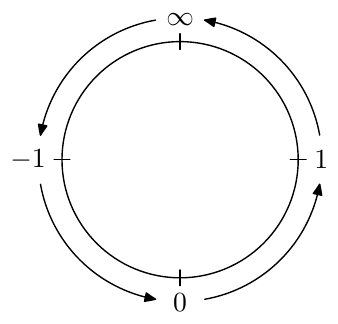

*Figure 9.6: Transformation of the real Riemann circle by $\rho_{+1}$.*

$$
= j\frac{e^{j\varphi/2}-e^{-j\varphi/2}}{2j} \cdot \frac{2}{e^{j\varphi/2}+e^{-j\varphi/2}} = j\tan\frac{\varphi}{2}
$$

For $\rho_{-1}$ the polar angle $\varphi$ gets mapped into $\arg\rho_{-1}(w) =
\pi - \varphi$. Conversely a polar angle equal to $\pi - \varphi$ will be
mapped into $\arg\rho_{-1}(w) = \varphi$, thus

$$
e^{j\varphi} = \rho_{-1}\!\left(j\tan\frac{\pi-\varphi}{2}\right) = \rho_{-1}\!\left(j\tan\left(\frac{\pi}{2}-\frac{\varphi}{2}\right)\right) = \rho_{-1}\!\left(\frac{j}{\tan\frac{\varphi}{2}}\right)
$$

Summing up:

$$
\rho_{+1}\!\left(j\tan\frac{\varphi}{2}\right) = e^{j\varphi} \tag{9.11a}
$$

$$
\rho_{-1}\!\left(\frac{j}{\tan\frac{\varphi}{2}}\right) = e^{j\varphi} \tag{9.11b}
$$

$$
\rho_{-1}(e^{j\varphi}) = j\tan\frac{\varphi}{2} \tag{9.12a}
$$

$$
\rho_{+1}(e^{j\varphi}) = \frac{j}{\tan\frac{\varphi}{2}} \tag{9.12b}
$$

Note that (9.12) do not simply give the inverse versions of (9.11), but also
reflect the fact the complex unit circle gets rotated into the imaginary
Riemann circle.

### Symmetries

The transformations of symmetries by $\rho_{\pm1}$ can be derived in an
intuitive way from the symmetries on the real Riemann circle and the
arctangent scale and from the fact that these transformations are $\pm90^\circ$
rotations of the real Riemann circle or (equivalently) shifts of the
arctangent scale by the scale's quarter period, if we assume $w \in
\mathbb{R} \cup \infty$.

Particularly, a $\pm90^\circ$ rotation of the real Riemann circle maps $0$ and
$\infty$ to $\pm1$ and vice versa. Respectively, points on the Riemann circle
which are symmetric relatively to $0$ and $\infty$ map to points symmetric
relatively to $\pm1$ and vice versa. Thus, mutually opposite values map to
mutually reciprocal values and vice versa:

$$
\rho_{+1}(w)\rho_{+1}(-w) = 1 \tag{9.13a}
$$

$$
\rho_{-1}(w)\rho_{-1}(-w) = 1 \tag{9.13b}
$$

$$
\rho_{+1}(w) + \rho_{+1}(1/w) = 0 \tag{9.13c}
$$

$$
\rho_{-1}(w) + \rho_{-1}(1/w) = 0 \tag{9.13d}
$$

Fig. 9.7 illustrates, where more properties are immediately visible. E.g. one
could notice that $\rho_{\pm1}(w)$ are obtained by rotating $w$ by $\pm90^\circ$,
therefore the results are $180^\circ$ apart, which means:

$$
\rho_{+1}(w)\rho_{-1}(w) = -1 \tag{9.14}
$$

or that rotating the opposite points $\pm w$ by $90^\circ$ in opposite directions
produces opposite points:

$$
\rho_{\pm1}(-w) = -\rho_{\mp1}(w) \tag{9.15}
$$

etc.

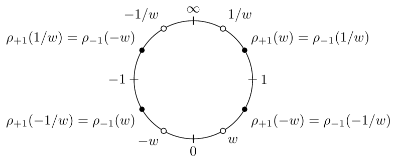

*Figure 9.7: Symmetries of the transformations $\rho_{\pm1}$ on the real
Riemann circle, where they represent $90^\circ$ rotations.*

The formulas (9.13), (9.14) and other similarly obtained symmetry-related
properties of $\rho_{\pm1}$ work not only for $w \in \mathbb{R} \cup \infty$
but actually for any $w \in \mathbb{C} \cup \infty$ which can be verified
algebraically. However, the interpretation of these symmetries in terms of
the real Riemann circle obviously works only for $w \in \mathbb{R} \cup
\infty$.

The imaginary Riemann circle gets rotated by $\rho_{\pm1}$ into the complex
unit circle, where the results of the two transformations are thereby
symmetric relatively to the imaginary axis. Fig. 9.8 illustrates some of the
symmetries arising out of this rotation. More illustrations of this kind can
be created, particularly for the transformation of the values lying on the
complex unit circle, but the ones we are already having should be sufficient
for our purposes in this book.

### Unit circle rotations

The Riemann sphere rotations $\rho_{\pm1}$ can be described as rotations of
the Riemann sphere around the imaginary axis or as rotations of the real
Riemann circle. Similarly the Riemann sphere rotations around the vertical
axis $z$ can be thought of as rotations of the unit circle.

Apparently, such rotations are simply achived by a multiplications of complex
values by a unit-magnitude complex constant, where we are not restricted to
rotations by multiples of $90^\circ$. We won't need a special notation for this
transformation and will simply write

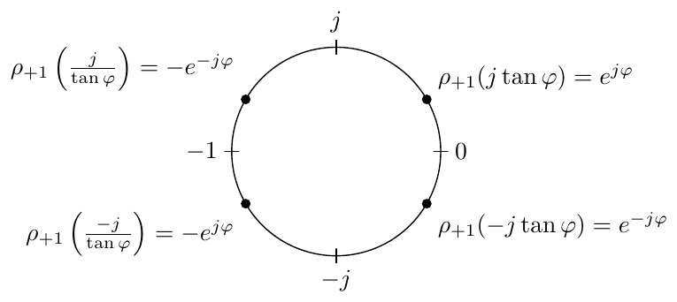

*Figure 9.8: Symmetries of the results of the transformation $\rho_{+1}$ of
the imaginary axis (lying on the complex unit circle).*

$$
w' = aw \qquad (|a| = 1)
$$

Obviously

$$
|w'| = |w|
$$

$$
\arg w' = \arg w + \arg a
$$

The rotations by $+90^\circ$ and $-90^\circ$ are simply multiplications by $j$ and $-j$
respectively.

There is not much more to say in this respect as this rotation is pretty
trivial.

### Imaginary rotations

We could also wish to rotate the imaginary Riemann circle. We will denote the
respective transformations as $\rho_{\pm j}$, where the subscript, as with
$\rho_{\pm1}$, denotes the image of the zero after the transformation.

We could rotate the imaginary circle by doing the three steps in succession:

1. First, we rotate the Riemann sphere by $90^\circ$ around its "vertical" axis,
   thereby turning the imaginary Riemann circle into the real Riemann circle,
   where $w = \pm j$ is transformed into $w = \pm1$ respectively, while $0$
   and $\infty$ stay in place. Such rotation is simply achieved by
   multiplying $w$ by $-j$.

2. Now we apply $\rho_{\pm1}$ to rotate the real circle.

3. We convert the real circle back to the imaginary one by multiplying the
   rotation result by $j$.

Therefore we simply have

$$
\rho_{\pm j}(w) = j\rho_{\pm1}(-jw) = -j\rho_{\mp1}(jw) \tag{9.16}
$$

(where the second expression is obtained in the same way as the first one,
except that we rotate the Riemann sphere in the other direction, both
vertically and horizontally).

In order to distinguish between $\rho_{\pm1}$ and $\rho_{\pm j}$ we could
refer to the former as *real rotations* of the Riemann sphere and to the
latter as *imaginary rotations* of the Riemann sphere.

## 9.4 Butterworth filter revisited

In Chapter 8 we have developed the lowpass Butterworth filters of the 1st kind
(also simply known as Butterworth filters) as a Butterworth transformation of
the 1-pole lowpass filter, where we also mentioned that the tranditional
definition of the Butterworth filter simply defines the (lowpass) Butterworth
filter as a (stable) filter whose amplitude response is

$$
|H(j\omega)|^2 = \frac{1}{1+\omega^{2N}} \qquad (\omega \in \mathbb{R}) \tag{9.17}
$$

Apparently both definitions are equivalent.

We could generalize this idea by replacing $\omega^N$ in (9.17) by some other
polynomial function $f(\omega)$:

$$
|H(j\omega)|^2 = \frac{1}{1+f^2(\omega)} \qquad (\omega \in \mathbb{R}) \tag{9.18}
$$

The practical application of (9.18) essentially follows the steps of the
Butterworth transformation of the 1st kind, which includes solving
$1+f^2=0$ to obtain the poles of $|H(s)|^2$ and then discarding the
right-semiplane poles, thereby effectievely obtaining the desired transfer
function $H(s)$ expressed in the cascade form. Note that there are two
implicit conditions which need to be fulfilled in order for this procedure to
work:

- There is the symmetry of the poles of $|H(s)|^2$ with respect to the real
  axis: if $s$ is a pole then so is $s^*$ (where $s^*$ may be the same pole as
  $s$ if $s$ is real). This is necessary in order for $H(s)$ to be a real
  function of $s$.

- There is the pairwise symmetry of the poles $|H(s)|^2$ with respect to the
  imaginary axis: if $s$ is a pole then $-s^*$ is *another* pole (it must be
  another pole even if $s=-s^*$, in which case it simply means that the pole
  is duplicated). This guarantees that we can split the poles into the left-
  and right-semiplane halves with identical contributions to the amplitude
  response. Therefore by discarding the right-semiplane half of the poles, we
  effectively go from $|H(j\omega)|^2$ to $|H(j\omega)|$.

We could expect that these properties will not be fulfilled for an arbitrary
$f(\omega)$. However, let's require that

- The function $f(\omega)$ is a real function of $\omega$.

- The function $f(\omega)$ is odd or even.

The readers can convince themselves that under these restrictions the poles
of $|H(s)|^2$ defined by (9.18) will have the necessary symmetries with
respect to the real and imaginary axes.

### Rational $f(\omega)$

We could allow $f(\omega)$ to be not just a polynomial but a rational
function. In this case $H(s)$ has not only poles, but also zeros at
locations where $f(\omega)$ has poles and respectively the denominator of
$|H(j\omega)|^2$ turns to $\infty$, which means that both $|H(j\omega)|^2$
and $|H(j\omega)|$ turn to zero. In order to see that the multiplicities of
the zeros of $H(s)$ are equal to the multiplicities of the respective poles
of of $f(\omega)$ simply consider

$$
|H(j\omega)|^2 = \frac{1}{1+\dfrac{P_1^2(\omega)}{P_2^2(\omega)}} = \frac{P_2^2(\omega)}{P_1^2(\omega)+P_2^2(\omega)}
$$

Thus the set of zeros of $|H(j\omega)|^2$ is the duplicated set of zeros of
$P_2(\omega)$, however after switching to $H(j\omega)$ we should drop the
duplicates, being left only with a single set of zeros of $P_2(\omega)$,
which are the poles of $f(\omega)$. Note that $H(s)$ shouldn't have more
zeros than poles, which means that the order of the denominator of
$f(\omega)$ should not exceed the order of the numerator of $f(\omega)$.

In order for $H(s)$ to be real, its zeros must be conjugate symmetric, which
will be ensured if $f(\omega)$ is real odd or even function. Indeed, in this
case the poles of $f(\omega)$ are both conjugate symmetric and symmetric with
respect to the origin, which implies that they are also symmetric with
respect to the imaginary $\omega$ axis, which is the same as the symmetry
with respect to the real $s$ axis.

### Representations of linear scaling

We are now going to develop another way of looking at the Butterworth filter
generating function $f(x)=x^N$. It will be highly useful with other functions
$f(x)$ occurring in place of $f(x)=x^N$ in (9.18).

Let $f(x)=x^N$. Since $x^N = \exp(N\ln x)$, we can write

$$
f(x) = \exp(N\ln x) \tag{9.19}
$$

Introducing auxiliary variables $u$ and $v$ we can rewrite (9.19) as a set of
equations:

$$
\begin{aligned}
x &= \exp u \\
v &= Nu \\
f(x) &= \exp v
\end{aligned}
$$

which also allows to define $f(x)$ implicitly as a function satisfying the
equation

$$
f(\exp u) = \exp(Nu) \tag{9.20}
$$

We could consider $x$ and $f(x)$ as *representations* of $u$ and $v$, where
the connection between the *preimages* $u$ and $v$ and their respective
representations $x$ and $f(x)$ is achieved via the exponential mapping
$x=\exp u$ (Fig. 9.9). In terms of preimage domain the function $f(x)=x^N$ is
simply a multiplication by $N$.

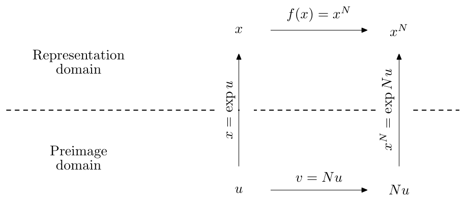

*Figure 9.9: The preimage and representations domains.*

Now consider that the function $\exp u$ is periodic in the imaginary
direction:

$$
\exp u = \exp(u+2\pi j)
$$

Therefore preimages are $2\pi j$-periodic, that is if $u$ is a representation
of $x$, then so is $u+2\pi jn\ \forall n \in \mathbb{Z}$ (Fig. 9.10).


*Figure 9.10: Periods of the preimage of the representation $x = \exp u$.
Each strip (where there is no difference between gray and white strips)
denotes a preimage of the entire complex plane with the exception of zero.
The preimages denoted by the dots are preimages of one and the same value.*

A multiplication by an integer in the preimage domain $v=Nu$ expands one
period $\operatorname{Im} u \in [0,2\pi]$ to $N$ periods
$\operatorname{Im} v \in [0,2\pi N]$. Respectively the function $f(x)$ takes
each value $N$ times as $x$ goes across all possible values in $\mathbb{C}$.
Conversely, a division by an integer $u=v/N$ shrinks $N$ periods to one
period and a previously single value of $f(x)$ turns into $N$ different
values of $x$. This is another possible way to explain the fact that the
equation $x^N=a$ has $N$ different solutions. Fig. 9.11 demonstrates the
result of transformation of all preimages in Fig. 9.10 by a division by 2
corresponding to the equation $u=v/2$. Notice that the preimages in Fig. 9.11
correspond to two different representation values, while the peimages in
Fig. 9.10 were corresponding to one and the same representation value.

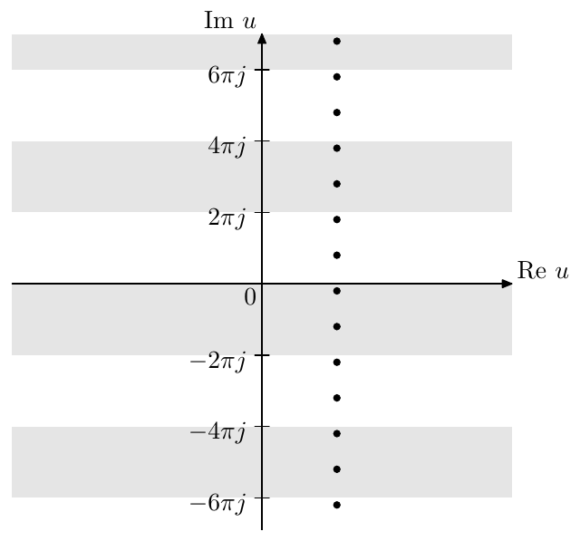

*Figure 9.11: Transformation of the preimage points in Fig. 9.10 by division
by 2.*

The preimage of the real axis $x \in \mathbb{R}$ consists of two
"horizontal" lines $\operatorname{Im} u = 0$ and $\operatorname{Im} u = \pi$,
or, more precisely, of their periodic repetitions $\operatorname{Im} u =
2\pi n$ and $\operatorname{Im} u = \pi + 2\pi n$, where $n \in \mathbb{Z}$.
The line $\operatorname{Im} u = 0$ (and its repetitions) corresponds to the
positive real numbers, the line $\operatorname{Im} u = \pi$ (and its
repetitions) corresponds to the negative real numbers. The preimage of the
zero $x=0$ exists only in the limiting sense $\operatorname{Re} u \to
-\infty$. Thus the multiplication of $u$ by $N$ is mapping the preimage of
the real axis onto itself, therefore this multiplication's representation
$x^N$ maps the real axis onto itself.

The "vertical" lines $\operatorname{Re} u = a$ are preimages of circles of
radius $e^a$, where moving upwards along such lines corresponds to the
counterclockwise movement along the respective circle (Fig. 9.12),
Particularly the imaginary axis is the preimage of the unit circle (note
that a section of such line extending over a single imaginary period
$\operatorname{Im} u \in [b,b+2\pi)$ is sufficient to generate all possible
values on such circle). Multiplication by $N$ maps the imaginary axis onto
itself, thereby its representation $x^N$ maps the unit circle onto itself. A
single preimage period $[0j,2\pi j]$ is thereby mapped to $N$ periods
$[0,2\pi jN]$, which corresponds to the unit circle being mapped to itself
"$N$ times". We will shortly see that the mapping of the unit circle onto
itself is the reason for the Butterworth poles being located on the unit
circle.

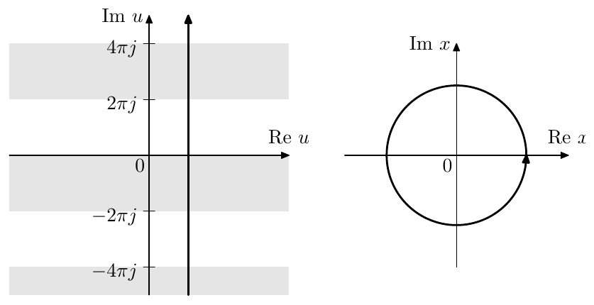

*Figure 9.12: A circular trajectory and its preimage.*

### Even/odd poles

The poles of (9.18) are given by $1+f^2=0$, which can be rewritten as
$f=\pm j$. In the Butterworth case the solutions of $f=\pm j$ were
interleaved on the unit circle and also corresponded to even and odd values
of $n$ in the solution formula for $1+f^2=0$, where $f=j$ was defining the
even poles and $f=-j$ was defining the odd poles.

We will take effort to keep the same correspondence between the equations
$f=\pm j$ and the even/odd values of $n$ for other functions $f(\omega)$. In
that regard it is instructive to first review the Butterworth case, but now
using the just introduced linear scaling representation form, as it will
then nicely generalize to other $f(\omega)$ that we are going to use.

Let $\omega$ move along the unit circle in the counterclockwise direction.
Its preimage $u$ defined by $\omega=\exp u$ will respectively move upwards
along the imaginary axis and so will $v=Nu$. Respectively $f(\omega)=\exp v$
moves along the unit circle in the counterclockwise direction, just $N$
times faster, so while $f(\omega)$ completes one circle, $\omega$ will
complete only $1/N$-th of a circle. The value of $f(\omega)$ will be passing
through the points $j$ and $-j$, since they are lying on the unit circle. At
these moments the value of $\omega$ will be the solution of the equations
$f(\omega)=j$ and $f(\omega)=-j$ respectively (Figs. 9.13 and 9.14). There
will be no other solutions since if $\omega$ moves in a circle of any other
radius, this circle will map to a circle of a non-unit radius and
$f(\omega)$ will not go through the points $\pm j$. Thus Fig. 9.14 contains
the full set of Butterworth poles, where the interleaving of the white/black
dots on the circle in Fig. 9.14 arises from the interleaving of the
white/black dots on the circular tajectory in Fig. 9.13.

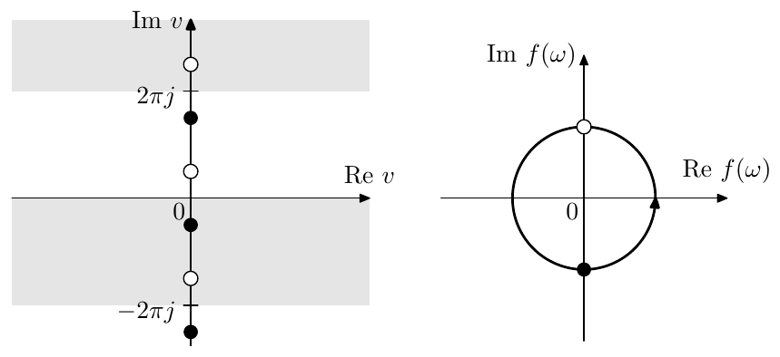

*Figure 9.13: $f(\omega)$ moving in a unit-radius circular trajectory, the
points $f(\omega) = \pm j$ and their preimages.*

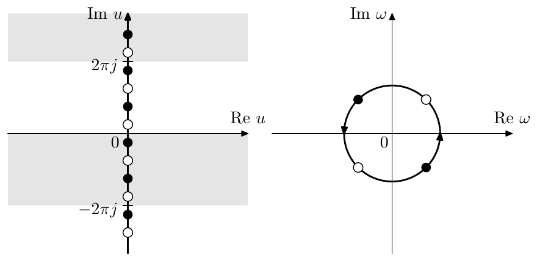

*Figure 9.14: Transformation of Fig. 9.13 by $u = v/N$ (for $N = 2$). The
white and black dots on the circle are even/odd Butterworth poles in terms
of $\omega$.*

Apparently, the passing of $f(\omega)$ through $\pm j$ corresponds to

$$
v = j\pi\left(\frac{1}{2}+n\right)
$$

where $f(\omega)=j$ occurs at even $n$ and $f(\omega)=-j$ occurs at odd $n$.
The value of $u$ at these moments is

$$
u = j\pi\frac{\frac{1}{2}+n}{N}
$$

and the value of $\omega$ is

$$
\omega = \exp\left(j\pi\frac{\frac{1}{2}+n}{N}\right)
$$

which is pretty much the same as the expression (8.13) we have developed
before. The even/odd values of $n$ still correspond to the solutions of
$f=j$ and $f=-j$ respectively and thus we have a constency in referring to
the solutions of $f=j$ as even poles and to the solutions of $f=-j$ as odd
poles.

### Lowpass, bandpass and highpass filters

If we want $H(s)$ in (9.18) to be a (unit cutoff) lowpass filter, then we
should impose some additional requirements on $f(\omega)$:

$$
\begin{aligned}
f(\omega) &\approx 0 && \text{for } \omega \ll 1 \\
f(\omega) &\approx \infty && \text{for } \omega \gg 1
\end{aligned} \tag{9.21}
$$

where around $\omega = 1$ the absolute magnitude of $f(\omega)$ should
smoothly grow from 0 to $\infty$. Apparently the Butterworth filter's
function $f(\omega) = \omega^N$ satisfies these requirements.

Similarly to Butterworth filter, with other filter types arising from (9.18)
we will not be constructing $f(x)$ which give a highpass or bandpass
response. Instead, highpass and bandpass filters can be simply obtained by
LP to HP and LP to BP substitutions respectively.

## 9.5 Trigonometric functions on complex plane

The trigonometric functions, such as $\sin x$, $\cos x$, $\tan x$ and so on
can be evaluated for complex argument values. In that regard they occur to
be closely related to the hyperbolic functions $\sinh x$, $\cosh x$,
$\tanh x$ and so on. The extention to $x \in \mathbb{C}$ can be obtained by
simply evaluating the formulas

$$
\begin{aligned}
\cosh x &= \frac{e^x+e^{-x}}{2} \tag{9.22}
\end{aligned}
$$

$$
\sinh x = \frac{e^x-e^{-x}}{2} \tag{9.23}
$$

$$
\tanh x = \frac{\sinh x}{\cosh x} \tag{9.24}
$$

$$
\cos x = \frac{e^{jx}+e^{-jx}}{2} = \cosh jx \tag{9.25}
$$

$$
\sin x = \frac{e^{jx}-e^{-jx}}{2j} = -j\sinh jx \tag{9.26}
$$

$$
\tan x = \frac{\sin x}{\cos x} = \frac{1}{j}\cdot\frac{e^{jx}-e^{-jx}}{e^{jx}+e^{-jx}} = -j\tanh jx \tag{9.27}
$$

etc., where the function $e^x$ is allowed to take complex argument values.
Notice that thereby we immediately obtain the "imaginary argument
properties":

$$
\sin jx = j\sinh x \tag{9.28a}
$$

$$
\cos jx = \cosh x \tag{9.28b}
$$

$$
\sinh jx = j\sin x \tag{9.28c}
$$

$$
\cosh jx = \cos x \tag{9.28d}
$$

etc., where intuitively we assume $x \in \mathbb{R}$, but the formulas also
work for $x \in \mathbb{C}$.

By direct evaluation one could verify that all basic properties and
fundamental trigonometric and hyperbolic identities continue to hold in
complex domain. Particularly

$$
\begin{aligned}
\sin(-x) &= -\sin x \\
\cos(-x) &= \cos x \\
\cos(x+2\pi) &= \cos x \\
\cos(x-\pi/2) &= \sin x \\
\sin^2 x + \cos^2 x &= 1 \\
\sinh(-x) &= -\sinh x \\
\cosh(-x) &= \cosh x \\
\cosh^2 x - \sinh^2 x &= 1
\end{aligned}
$$

etc. Also, apparently, conjugation commutes with the respective functions:

$$
\begin{aligned}
\sin x^* &= (\sin x)^* \\
\cos x^* &= (\cos x)^* \\
\sinh x^* &= (\sinh x)^* \\
\cosh x^* &= (\cosh x)^*
\end{aligned}
$$

etc.

A direct corollary of (9.28) and the trigonometric formulas for the sum of
arguments are the formulas allowing to express a trigonometric function a
complex argument via the real and imaginary parts of the argument. E.g.

$$
\cos(u+jv) = \cos u\cos jv - \sin u \sin jv = \cosh v \cos u - j\sinh v \sin u \tag{9.29a}
$$

$$
\sin(u+jv) = \sin u\cos jv + \cos u \sin jv = \cosh v \sin u + j\sinh v \cos u \tag{9.29b}
$$

etc.

### Periodicity

Since the periodicity property is retained in the complex domain, the former
real periods of the trigonometric functions turn into strips on the complex
plane. E.g. the $2\pi$ periods of $\cos x$ are shown in Fig. 9.15.

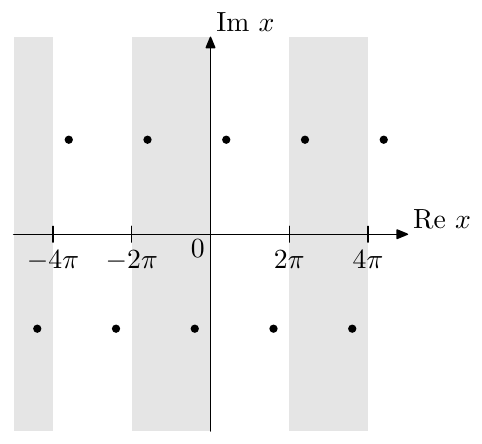

*Figure 9.15: Periods of $\cos x$ in the complex plane. All dots are
preimages of one and the same value.*

Due to the even symmetry of the cosine, almost every value occurs twice on
a period (as illustrated by the dots in Fig. 9.15). That is if the value $y$
occurs at $x$ (that is $y=\cos x$), then $y$ also occurs at $-x$. The
exceptions are being $\cos x = 1$ and $\cos x = -1$, which are mapped to
themselves by $x \leftarrow -x$ if the periodicity of $\cos x$ is taken into
account.

### Inverse functions

Inverting (9.22) and (9.23) we obtain

$$
\begin{aligned}
\cosh^{-1} x &= \ln\left(x \pm \sqrt{x^2-1}\right) \\
\sinh^{-1} x &= \ln\left(x \pm \sqrt{x^2+1}\right)
\end{aligned}
$$

The principal value of the complex square root is defined as

$$
\sqrt{x} = \exp\frac{\ln x}{2} = \sqrt{|x|}\cdot\exp j\frac{\arg x}{2} \tag{9.30}
$$

where $\arg x \in [-\pi,\pi]$,[^4] in which case
$\operatorname{Re}\sqrt{x} \ge 0\ \forall x \in \mathbb{C}$ thereby (9.30) is
a generalization of arithmetric square root of real argument to complex
domain. Notice that (9.30) gives the values on the upper imaginary semiaxis
for real $x<0$ (provided $\arg x = \pi$ for $x<0$).

The principal value of $\ln x$ is defined in the usual way:

$$
\ln x = \ln|x| + j\arg x
$$

Respectively we can introduce the principal values of $\cosh^{-1}$ and
$\sinh^{-1}$ as:

$$
\cosh^{-1} x = \ln\left(x+\sqrt{x^2-1}\right) \tag{9.31a}
$$

$$
\sinh^{-1} x = \ln\left(x+\sqrt{x^2+1}\right) \tag{9.31b}
$$

where we chose the signs in front of the square roots in such as way as to
ensure that $\cosh^{-1} x \ge 0\ \forall x\ge 1$ and $\sinh^{-1} x \in
\mathbb{R}\ \forall x \in \mathbb{R}$.

The formulas (9.31a), (9.31b) raise concerns of numerical robustness in
cases where the two terms under the logarithm sign are nearly opposite. By
reciprocating the values under the logarithm signs we can rewrite them
equivalently as

$$
\cosh^{-1} x = -\ln\left(x-\sqrt{x^2-1}\right) \tag{9.31c}
$$

$$
\sinh^{-1} x = -\ln\left(\sqrt{x^2+1}-x\right) \tag{9.31d}
$$

where the choice between (9.31a), (9.31b) and (9.31c), (9.31d) should be
made based on comparing the complex arguments of the two terms under the
logarithm sign. We should choose the formulas where we are adding two
numbers whose complex arguments are not further than $90^\circ$ apart.
Particularly, for real $x$ we may write

$$
\sinh^{-1} x = \operatorname{sgn} x \cdot \ln\left(|x|+\sqrt{x^2+1}\right) \qquad (x \in \mathbb{R}) \tag{9.31e}
$$

whereas the formula (9.31a) already works well for real $x \ge 1$.

Using (9.28) we can construct the principal values:

$$
\begin{aligned}
\arccos x &= -j\cosh^{-1} x \\
&= -j\ln\left(x+\sqrt{x^2-1}\right) = j\ln\left(x-\sqrt{x^2-1}\right)
\end{aligned}
\tag{9.32a}
$$

$$
\begin{aligned}
\arcsin x &= -j\sinh^{-1} jx \\
&= -j\ln\left(jx+\sqrt{1-x^2}\right) = j\ln\left(\sqrt{1-x^2}-jx\right)
\end{aligned}
\tag{9.32b}
$$

However besides the precision issues there are issues related to the
principal values of $\arg x$ switching leaf on the negative real axis.
Technically this means that there is a discontinuity in the principal values
of $\sqrt{\phantom{x}}$ and $\ln$ on the negative real axis. With (9.31) this
was generally tolerable, as the discontinuities weren't arising for the
"usual" values of the argument, which are $x \ge 1$ for $\cosh^{-1} x$ and
$x \in \mathbb{R}$ for $\sinh^{-1} x$, since neither the argument of the
square root nor the argument of the logarithm become real negative in such
cases. With (9.32a), on the other hand, we do have a negative expression
under the square root for real $x \in (-1,1)$, which is the most important
argument range.

We could therefore adjust (9.32a) to

$$
\arccos x = -j\ln\left(x+j\sqrt{1-x^2}\right) = j\ln\left(x-j\sqrt{1-x^2}\right) \tag{9.32c}
$$

The formulas (9.32b) and (9.32c) work well for $x \in [-1,1]$, particularly
precision-wise it doesn't matter which of the two options in (9.32b) and
(9.32c) are taken for $x \in [-1,1]$, however they exibit a discontinuity
for real $x: |x|>1$. On the other hand, for purely imaginary argument values
the formula (9.32b) can be rewritten essentially as (9.31e) to automatically
choose the best option precision-wise:

$$
\arcsin jx = j\sinh^{-1} x = j\operatorname{sgn} x \cdot \ln\left(|x|+\sqrt{x^2+1}\right) \qquad (x \in \mathbb{R}) \tag{9.32d}
$$

### Preimages of the real line with respect to $\cos x$

By (9.29a) $\cos x$ attains purely real values iff $x \in \mathbb{R}$ or
$\operatorname{Re} x = \pi n$ where $n \in \mathbb{Z}$. However, due to
periodicity and evenness properties, each value is attained infinitely many
times. We would like to choose a principal preimage of the real line with
respect to $\cos x$. That is, we are interested in a (preferably continuous)
minimal set of points, whose image under transformation $y=\cos x$ is
$\mathbb{R}$.

Note, that we do not really have to choose this principal preimage, as the
discussions where we are going to refer to it should lead to exactly the
same results no matter which of the preimages of the real line is taken.
However, for the sake of clarity of discussion it is convenient to have an
unambiguous reference preimage.

Apparently there are infinitely many choice possibilities, among which there
are at least several "reasonable" ones. For the purposes of this text we
will choose the principal preimage as shown in Fig. 9.16. The same figure
also shows the periodic repetitions of the principal preimage.[^5]

This principal preimage of the real axis thereby consists of three parts:

$$
\begin{aligned}
x \in [0,\pi] &\iff y \in [-1,1] \\
x \in [0,+j\infty) &\iff y \in [1,+\infty) \\
x \in [\pi,\pi+j\infty) &\iff y \in (-\infty,-1]
\end{aligned}
$$

Apparently the principal preimage alone doesn't cover all preimage points of
the real line. Neither does it if we add its periodic repetitions in
Fig. 9.16, since the lower-semiplane points of lines $\operatorname{Re} x =
\pi n$ are still not included. We can include them by simply rotating all
preimages in Fig. 9.16 around the origin, which corresponds to
multiplication of all points $x$ by $-1$. Notice that by adding periodic
repetitions we addressed the periodicity of $\cos x$, while by adding the
preimages multiplied by $-1$ we addressed the evenness property of $\cos x$.

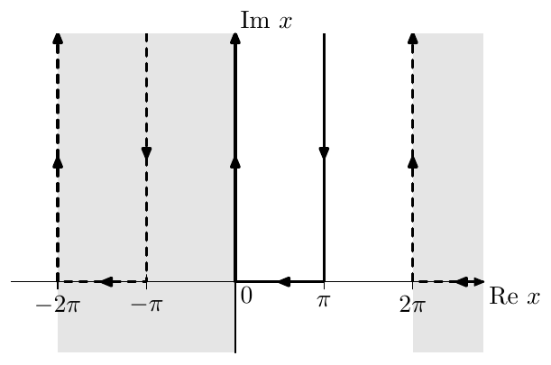

*Figure 9.16: The principal preimage (solid line) of the real axis, with respect to $y = \cos x$, and its periodic repetitions (dashed lines).*

### Representations of horizontal preimage lines by $\cos x$

Equation (9.29a) implies that if the imaginary part $v$ is fixed and the real part $u$ is varying, that is the argument of the cosine is moving in a line parallel to the real axis, then the value of $\cos(u+jv)$ is moving along an ellipse in the complex plane, the real semiaxis of the ellipse being equal to $\cosh v$ and the imaginary semiaxis being equal to $\sinh v$. Fig. 9.17 illustrates. At $v = 0$ the real semiaxis is 1 and the imaginary semiaxis is zero. As $|v|$ grows both semiaxes grow, the imaginary semiaxis staying smaller than the real one in absolute magnitude (Fig. 9.18). Both semiaxes become equal in the limit $v \to \infty$ where the ellipse turns into a circle.

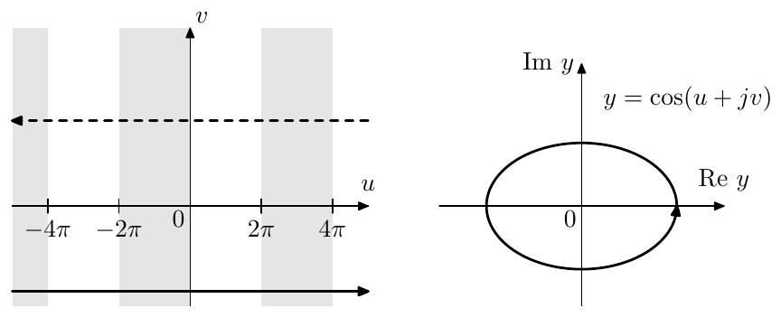

*Figure 9.17: An elliptic trajectory and two its preimages. The picture is qualitative. In reality, for this kind of ellipse proportions the preimages would need to be located much closer to the real line.*

Given $v > 0$ and increasing $u$, the movement of the point $\cos(u+jv)$ along the ellipse will be in the negative (clockwise) direction, due to the $-$ sign in front of the imaginary part in (9.29a). Respectively the positive (counterclockwise) direction movement will occur either for a decreasing $u$ or for a negative $v$, where the latter is illustrated in Fig. 9.17.

The even symmetry of the cosine ($\cos(-x) = \cos x$) implies that for each horizontal trajectory $u + jv$ of the cosine's argument, there is a symmetric trajectory $-(u+jv)$ which produces exactly the same cosine trajectory. This other trajectory is shown in Fig. 9.17 by the dashed line. Notice how this is related to the fact that flipping the sign of $v$ flips the direction of the movement along the ellipse: flipping the sign of $v$ is the same as flipping the sign of the entire cosine's argument (that is flipping the signs of both $u$ and $v$), which leaves the elliptic trajectory unaffected, and then flipping the sign of $u$, which reverts the direction of movement of both $u+jv$ and $\cos(u+jv)$.

From the fact that the semiaxes of the ellipse are $\cosh v$ and $\sinh v$ and therefore their absolute magnitudes are monotonically growing with $|v|$ (as one can see in Fig. 9.18) we can deduce that ellipses corresponding to different $v$ do not overlap, except for a switch from $v$ to $-v$, which simply changes the direction of the movement along the ellipse. That is for a given ellipse with $\cosh v$ and $\sinh v$ semiaxes there are only two preimages, as shown in Fig. 9.17. An exception occurs when the imaginary semiaxis of the ellipse is zero, in which case there is only one preimage, which is the real line.

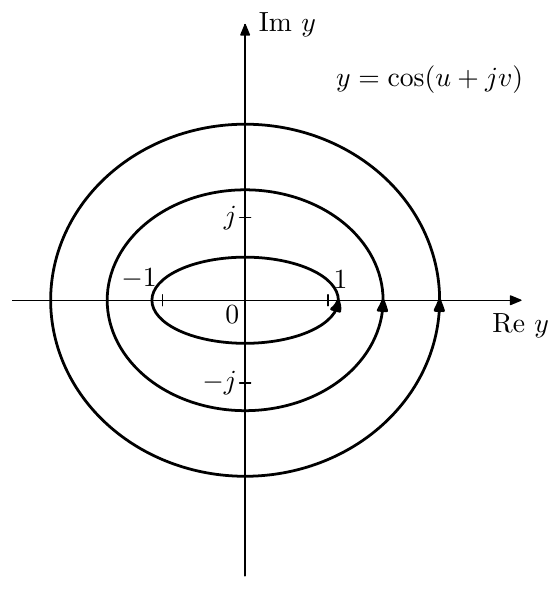

*Figure 9.18: A family of elliptic trajectories generated from horizontal preimages $v = \text{const} < 0$.*

### Representations of horizontal preimage lines by $\sec x$

The secant function $\sec x = 1/\cos x$ is obviously $2\pi$-periodic. In fact it bears quite a few further similarities to $\cos x$, which are easier to see if we write it in the polar form:

$$
|\sec x| = \frac{1}{|\cos x|} \tag{9.33a}
$$

$$
\arg \sec x = -\arg \cos x \tag{9.33b}
$$

Consider a horizontal line $u+jv$ (where $u$ is varying and $v = \text{const}$) and its respective representation $y = \sec(u+jv)$. According to (9.33), $y$ moves in an ellipse-like curve around the origin, as shown in Fig. 9.19. At smaller magnitudes of $v$ the curve begins to look more like a figure of 8 (Fig. 9.20). The curve is not an ellipse anymore due to the reciprocation in (9.33a). On the other hand, by (9.33b) the "angular velocity" is the same as with $y = \cos x$, except that is has the opposite sign, therefore the rotation is happening in the opposite direction. Therefore for an increasing $u$ we get counterclockwise rotation iff $v > 0$ rather than iff $v < 0$.

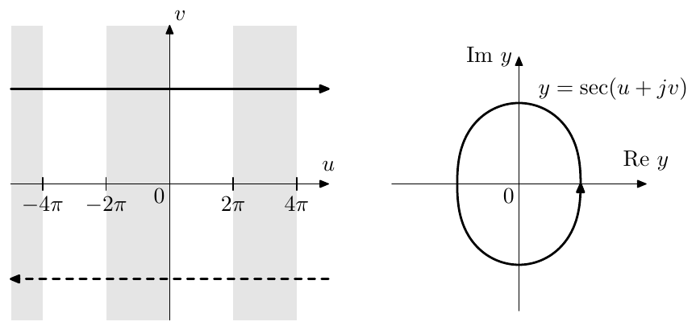

*Figure 9.19: A quasielliptic trajectory and two its preimages (qualitatively).*

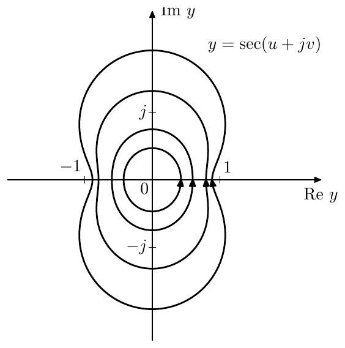

*Figure 9.20: A family of quasielliptic trajectories generated from horizontal preimages $v = \text{const} > 0$.*

## 9.6 Chebyshev polynomials

An $N$-th order Chebyshev polynomial is defined as:

$$
T_N(x) = \cos(N \arccos x) \tag{9.34}
$$

Fig. 9.21 illustrates. Notice the bipolar oscillations of equal amplitude (referred to as *equiripples*) on the range $[-1,1]$. As one can see in Fig. 9.21, the equiripple amplitude is unity.

Somewhat surprisingly, (9.34) can be equivalently written as an $N$-th order real polynomial of $x$ at any $N \in \mathbb{N}$, e.g. for $N = 4$ we have $T_4(x) = 8x^4 - 8x^2 + 1$, which is why they are called polynomials.

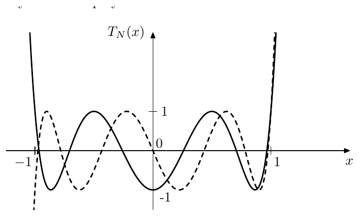

*Figure 9.21: Chebyshev polynomials of even (solid) and odd (dashed) orders.*

Note that $\arccos x$ takes complex values for $x > 1$ and $x < -1$. We will also often assume $x$ taking complex values, therefore $\arccos x$ and $T_N(x)$ will be complex as well. For $|x| > 1$ even though $\arccos x$ becomes complex, the value $\cos(N \arccos x)$ is still real, and so is the polynomial itself.

A proper discussion of Chebyshev polynomials falls outside the scope of the book, as the respective information can be easily found elsewhere. Here we shall concentrate on the details which will be important for our purposes.

### Chebyshev polynomials as representations of linear scaling

Introducing auxiliary variables $u$ and $v$ we rewrite (9.34) as

$$
\begin{aligned}
x &= \cos u \\
v &= Nu \\
T_N(x) &= \cos v
\end{aligned}
$$

or, in the implicit form:

$$
T_N(\cos u) = \cos(Nu) \tag{9.35}
$$

Thus the function $T_N(x)$ is a representation of the linear scaling $v = Nu$, the mapping function being $x = \cos u$. Note that by multiplying the whole preimage domain by $j$ we obtain a different (but equivalent) representation:

$$
\begin{aligned}
x &= \cosh u \\
v &= Nu \\
T_N(x) &= \cosh v
\end{aligned}
$$

which gives us another equivalent expression for (9.34)

$$
T_N(x) = \cosh\!\left(N \cosh^{-1} x\right) \tag{9.36}
$$

and its respective implicit form

$$
T_N(\cosh u) = \cosh(Nu)
$$

In our discussion we will stick to using the cosine-based representation. The readers may draw parallels to the hyperbolic cosine-based representation if they wish.

In case of Butterworth filter-generating functions $x^N$ represented via $\exp u$ mapping, the preimages were $2\pi j$-periodic. This time they are $2\pi$-periodic. Additionally there is an even symmetry: $u$ and $-u$ are preimages of the same $x$.

Considering the effect the linear scaling $v = Nu$ on the principal preimage of the real line shown in Fig. 9.16, we obtain the following:

- The principal real half-period $[0,\pi]$ is expanded to to $[0,\pi N]$, which is responsible for the occurrence of the equiripples on the segment $x \in [-1,1]$. Since $N$ is integer, other real half-periods expand similarly, without generating yet more representation values of $f(x)$. Thus $f(x)$ is a single-valued function.
- The principal preimage $[0,+j\infty)$ of $x \in [1,+\infty)$ maps onto itself. The non-principal preimages $[2\pi n + 0j, 2\pi n + j\infty)$ of $x \in [1,+\infty)$ map onto some other preimages $[2\pi N n + 0j, 2\pi N n + j\infty)$ of $x \in [1,+\infty)$. Similar mappings occur for the preimages of $x \in [1,+\infty)$ located in the lower complex semiplane. Thus $x \in [1,+\infty)$ is mapped by $T_N(x)$ onto itself, corresponding to the monotonically growing behavior of $T_N(x)$ for $x \geq 1$.
- The principal preimage $[\pi + 0j, \pi + j\infty)$ of $x \in (-\infty,-1]$ is mapped onto $[\pi N + 0j, \pi N + j\infty)$, which is a preimage of $x \in [1,+\infty)$ is $N$ is even and of $x \in (-\infty,-1]$ if $N$ is odd. The non-principal preimages of $x \in (-\infty,-1]$ (both those in the upper complex semiplane and in the lower complex semiplane) are mapped similarly. Thus $x \in (-\infty,-1]$ is mapped by $T_N(x)$ onto itself if $N$ is odd, or onto $x \in [1,+\infty)$ if $N$ is even, corresponding to the monotonic behavior of $T_N(x)$ for $x \leq -1$.

Notice that these results correspond to the graphs in Fig. 9.21.

Now consider a line $\operatorname{Im} u = \beta$ (where $\beta$ is some real constant value) parallel to the real axis in the preimage domain. Such lines are are, as we know from the previous discussion of the cosine of complex argument, the preimages of ellipses of various sizes, where the size grows with $|\beta|$ (Fig. 9.18). These ellipses are also not overlapping each other, except that the ellipses corresponding to $\beta$ and $-\beta$ are identical (but have opposite orientations). Therefore $T_N(x)$ maps any ellipse from this family onto another ellipse from this family and vice versa, similarly to how $x^N$ mapped the unit circle onto itself and mapped circles onto other circles. This time, however, the ellipse which is mapped onto itself, is the one with a zero imaginary semiaxis.

Notice that since the line $\operatorname{Im} u = \beta$ is mapped to $\operatorname{Im} v = N\beta$, the line stays in the same (upper or lower) semiplane after such mapping and goes in the same (to the right or to the left) direction. Thus, if $x$ is moving in an ellipse in a counterclockwise or respectively clockwise direction, then $T_N(x)$ moves in the same direction.

### Even/odd property

Since $\cos(u \pm \pi) = -\cos u$, a negation of $x$ corresponds to a shift of its preimage $u$ by $\pi$. Respectively $v$ is shifted by $N\pi$, which will result in a negation of $T_N(x)$ if $N$ is odd and will not change $T_N(x)$ is $N$ is even. Therefore $T_N(x)$ is even/odd if $N$ is even/odd:

$$
T_N(-x) = (-1)^N T_N(x) \tag{9.37}
$$

### Values at special points

The principal preimage of $x = 1$ is $u = 0$. Therefore $v = 0$ and $T_N(x) = 1$. Therefore

$$
T_N(1) = 1
$$

By (9.37)

$$
T_N(-1) = (-1)^N
$$

The principal preimage of $x = 0$ is $u = \pi/2$. Respectively $v = N\pi/2$ and

$$
T_N(0) = \operatorname{Re} j^N =
\begin{cases}
0 & \text{if } N \text{ is odd} \\
(-1)^{N/2} & \text{if } N \text{ is even}
\end{cases}
$$

where $\operatorname{Re} j^N$ is a way of writing the sequence $1, 0, -1, 0, \dots$ in the same way how $(-1)^N$ is a way of writing the sequence $1, -1, 1, -1, \dots$.

### Leading coefficient

Knowing that $T_N(x)$ is a real polynomial of order $N$, we can obtain its leading coefficient $a_N$ by evaluating the limit

$$
\begin{aligned}
a_N &= \lim_{x\to+\infty} \frac{T_N(x)}{x^N} = \lim_{x\to+\infty} \frac{\cosh(N\cosh^{-1}x)}{x^N} = \lim_{x\to+\infty} \frac{\exp(N\cosh^{-1}x)}{2x^N} = \\
&= \lim_{x\to+\infty} \frac{\exp(N\ln 2x)}{2x^N} = \lim_{x\to+\infty} \frac{(2x)^N}{2x^N} = \lim_{x\to+\infty} \frac{2^N x^N}{2x^N} = 2^{N-1}
\end{aligned}
$$

For the purposes of this book's material, we won't need to be able to explicitly find the other coefficients and will therefore skip this topic.

### Zeros

Rather than being interested in the values of the coefficients of Chebyshev polynomials, for our purposes it will be more practical to know the locations of their zeros. Letting $T_N(x) = 0$ we have

$$
v = \pi\left(\frac{1}{2}+n\right)
$$

Respectively

$$
u = \pi\frac{\frac{1}{2}+n}{N}
$$

and

$$
x = \cos\!\left(\pi\frac{\frac{1}{2}+n}{N}\right)
$$

which means that the zeros are

$$
z_n = \cos\!\left(\pi\frac{\frac{1}{2}+n}{N}\right) \tag{9.38}
$$

where there are $N$ distinct values corresponding to $0 < u < \pi$. Notice that the zeros are all real and lie within $(-1,1)$. Also notice that $z_n = -z_{N-1-n}$, therefore the zeros are positioned symmetrically around the origin. Consequently, if $N$ is odd, one of $z_n$ will be at the origin.

Using (9.38) we can write $T_N(x)$ in the factored form:

$$
T_N(x) = x^{N\wedge 1} \cdot \prod_{z_n>0} \frac{x^2 - z_n^2}{1-z_n^2} \tag{9.39}
$$

where we are taking the product only over the positive zeros using the symmetry of the zeros relatively to the origin, and the odd factor $x^{N\wedge 1}$ (where $N \wedge 1$ denotes bitwise conjunction) appears only for odd $N$ where one of the zeros is at the origin. The normalizations by $(1-z_n^2)$ are simply appearing from the requirement that each factor must be equal to 1 at $x=1$, so that $T_N(x)=1$.

### Renormalized Chebyshev polynomials

The factored form (9.39) offers some nice insights into the comparison of the behavior of $T_N(x)$ and $x^N$. Writing $x^N$ is a comparable factored form we have

$$
x^N = x^{N\wedge 1} \cdot \prod_{z_n>0} x^2 \tag{9.40}
$$

where "taking the product over $z_n > 0$" means that we are having as many factors as there are positive zeros in the Chebyshev polynomial $T_N(x)$. Thus the difference between $x^N$ and $T_N(x)$ is that the factors $x^2$ are replaced by $(x^2-z_n^2)/(1-z_n^2)$.

Apparently, if $z_n \to 0\ \forall n$ then $(x^2-z_n^2)/(1-z_n^2) \to x^2$ and respectively (9.39) is approaching $x^N$. Unfortunately we cannot express this as simply $T_N(x) \to x^N$, since the zeros of $T_N(x)$ are fixed.

To mathematically express this variation of zeros, we can notice that the value of (9.39) at $x = 1$ is always unity. Therefore we can introduce the polynomials

$$
\hat{T}_N(x,\lambda) = \frac{T_N(x/\lambda)}{T_N(1/\lambda)} \tag{9.41}
$$

to which we refer as *renormalized* Chebyshev polynomials. By construction $\hat{T}_N(1,\lambda) = 1\ \forall\lambda$, while the zeros of $\hat{T}_N(x,\lambda)$ are $\hat{z}_n = \lambda z_n$. Therefore

$$
\hat{T}_N(x,\lambda) = x^{N\wedge 1}\cdot\prod_{z_n>0}\frac{x^2-(\lambda z_n)^2}{1-(\lambda z_n)^2} \tag{9.42}
$$

and

$$
\lim_{\lambda\to 0} \hat{T}_N(x,\lambda) = x^N
$$

The formula (9.41) cannot be evaluated for $\lambda = 0$, however we apparently can take the limit at $\lambda \to 0$ as the value of $\hat{T}_N(x,0)$ and thus

$$
\hat{T}_N(x,0) = x^N
$$

$$
\hat{T}_N(x,1) = T_N(x)
$$

Notice that the formula (9.42) perfectly works at $\lambda = 0$.

Since the equiripple amplitude of $T_N(x)$ is unity, by (9.41) the equiripple amplitude of $\hat{T}_N(x)$ is $1/T_N(1/\lambda)$. The equiripple range $x \in [-1,1]$ of $T_N(x)$ is respectively transformed into the equiripple range $x \in [-\lambda,-\lambda]$ of $\hat{T}_N(x,\lambda)$. Thus $\lambda$ simultaneously controls the equiripple amplitude and the equiripple range of $\hat{T}_N(x,\lambda)$ (Fig. 9.22).

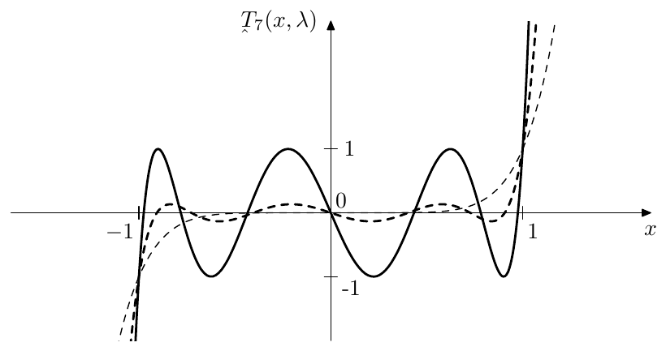

*Figure 9.22: Renormalized Chebyshev polynomial $\hat{T}_7(x,\lambda)$ for $\lambda = 1$ (solid), $\lambda = 0.93$ (dashed) and $\lambda = 0$ (thin dashed).*

As we won't need $\lambda < 0$, we won't consider that option. As for the large values of $\lambda$, it will be practical to restrict the value of $\lambda$ so that $|\lambda z_n| < 1\ \forall n$. Apparently this means $\lambda_{\max} = 1/\max\{z_n\}$ where $0 \leq \lambda < \lambda_{\max}$. Notice that since $|z_n| < 1\ \forall n$, it follows that $\lambda_{\max} > 1$.

Often it will be even more practical to restrict $\lambda$ to $0 \leq \lambda \leq 1$. At $\lambda = 1$ the equiripple amplitude of $\hat{T}_N(x,\lambda)$ is already unity. As $\lambda$ grows further the equiripple amplitude quickly grows, reaching $\infty$ at $\lambda = \lambda_{\max}$. Also the equiripple range exceeds $[-1,1]$, which could become inconvenient for our purposes.

In order to simplify the notation, often we will omit the $\lambda$ parameter, understanding it implicitly, and simply write $\hat{T}_N(x)$ instead of $\hat{T}_N(x,\lambda)$.

### Slope at $|x| \geq 1$

Let's compare the factors of (9.42) and (9.40). Computing the differences:

$$
\frac{x^2-(\lambda z_n)^2}{1-(\lambda z_n)^2} - x^2 = \frac{x^2-(\lambda z_n)^2 - x^2 + (\lambda z_n)^2 x^2}{1-(\lambda z_n)^2} = \frac{(\lambda z_n)^2(x^2-1)}{1-(\lambda z_n)^2} \tag{9.43}
$$

and taking into account that $0 < z_n < 1$, we notice that for $|x| > 1$ and $0 < \lambda \leq \lambda_{\max}$ the differences (9.43) are strictly positive and respectively the factors of (9.42) are larger than those of (9.40). In the range $x > 1$, since all factors are positive, we have

$$
\hat{T}_N(x) > x^N \qquad (x>1,\ N>1)
$$

By the even/odd symmetries of $\hat{T}_N(x)$ and $x^N$:

$$
|\hat{T}_N(x)| > |x^N| \qquad (|x|>1,\ N>1)
$$

From (9.43) we can also notice that the difference grows with $\lambda$, thus at larger $\lambda$ the polynomial $\hat{T}_N(x)$ exceeds $x^N$ (in absolute magnitude) by a larger amount.

At $\lambda = 1$ we have $\hat{T}_N(x) = T_N(x)$. For this specific case we would like to get a more exact estimation of the steepness of the slope at $x = 1$, to get an idea of how much steeper is the slope of $T_N(x)$ compared to $x^N$. We have already seen that the leading coefficient of $T_N(x)$ is $2^{N-1}$, which means that at $x \to \infty$ the polynomial $T_N(x)$ grows $2^{N-1}$ times faster than $x^N$. It would be also informative to compare their slope at $x = 1$.

An attempt to compute the derivative of $T_N(x)$ at $x = 1$ in a straightforward manner results in an uncertainty, thus it's easier to take a way around. At points infinitely close to $x = 1$ we expand the cosine into Taylor series up to the second order term:

$$
x = \cos u = 1 - \frac{u^2}{2}
$$

$$
T_N(x) = \cos v = 1 - \frac{v^2}{2}
$$

This scaling by $N$ times in the preimage domain ($v = Nu$) corresponds to scaling by $N^2$ times in the representation domain ($v^2 = N^2 u^2$) and we obtain

$$
\left.\frac{\mathrm{d}}{\mathrm{d}x}T_N(x)\right|_{x=1} = N^2
$$

On the other hand

$$
\left.\frac{\mathrm{d}}{\mathrm{d}x}x^N\right|_{x=1} = N
$$

Thus at $x = 1$ Chebyshev polynomials grow $N$ times faster than $x^N$.

## 9.7 Chebyshev type I filters

Chebyshev (or, more precisely, Chebyshev type I) filters arise by using renormalized Chebyshev polynomials $\hat{T}_N(\omega)$ as $f(\omega)$ in (9.18).[^6] The main motivation to use renormalized Chebyshev polynomials instead of $\omega^N$ (which is used in Butterworth filters) is that, as we already know they grow faster than $\omega^N$ for $|\omega| > 1$, which results in a steeper transition band compared to Butterworth filters. The tradeoff is that in order to achieve a steeper transition band we need to allow ripples in the passband. At the same time, the analytical expressions (9.34) and (9.36) allow to easily obtain the function inversion of the polynomial, allowing analytical computation of the filter's internal variables (such as pole positions) for arbitrarily high polynomial orders $N$, which would have been impossible for polynomials of a fully general form.

Thus, in (9.18) we let

$$
f(\omega) = \hat{T}_N(\omega)
$$

that is

$$
|H(j\omega)|^2 = \frac{1}{1+\hat{T}_N^2(\omega)}
$$

The $\lambda$ parameter of $\hat{T}_N(\omega)$ is affecting the equiripple amplitude of $\hat{T}_N$ and thereby the equiripple amplitude in the passband of $|H(j\omega)|$. It is convenient to introduce the additional variable

$$
\varepsilon = \frac{1}{T_N(1/\lambda)} \tag{9.44}
$$

which is simply equal to the equiripple amplitude of $\hat{T}_N$. Using (9.44) we particularly may write

$$
f(\omega) = \hat{T}_N(\omega) = \varepsilon T_N(\omega/\lambda)
$$

Notice that (9.44) allows to compute $\varepsilon$ from $\lambda$ and vice versa. Therefore, if we are given a desired equiripple band $[-\lambda,\lambda]$, we thereby have specified $\lambda$ and can use (9.44) to compute $\varepsilon$. Conversely, if we are given a desired equiripple amplitude (which is a more common case), we thereby have specified $\varepsilon$ and can invert (9.44) to compute $\lambda$:

$$
\frac{1}{\lambda} = T_N^{-1}(1/\varepsilon) = \cosh\!\left(\frac{1}{N}\cosh^{-1}\frac{1}{\varepsilon}\right)
$$

(where $T_N^{-1}$ denotes the inverted function $T_N$).

The amplitude response $|H(j\omega)|$ is thus varying within $[1/\sqrt{1+\varepsilon^2},1]$ on the equiripple range $\omega \in [-\lambda,\lambda]$. On the other hand, $\lambda$ (or, equivalently, $\varepsilon$) affects the slope of $\hat{T}_N$ (and respectively the slope of $|H(j\omega)|$) at $\omega = 1$. The slope steepness is thereby traded against the equiripple amplitude, where steeper slopes are achieved at larger equiripple amplitudes. Fig. 9.23 illustrates.

### Poles of Chebyshev type I filters

We have mentioned that the (9.34) is actually a polynomial of $x$. Therefore the denominator of (9.18) is a polynomial of $\omega$ and we can find the roots of this polynomial, which are simultaneously the poles of $|H(s)|^2 = H(s)H(-s)$. The equation for these poles is thus

$$
1 + \hat{T}_N^2(\omega) = 0
$$

or

$$
\hat{T}_N(\omega) = \pm j
$$

or

$$
\varepsilon T_N(\omega/\lambda) = \pm j
$$

or, introducing $\bar\omega = \omega/\lambda$

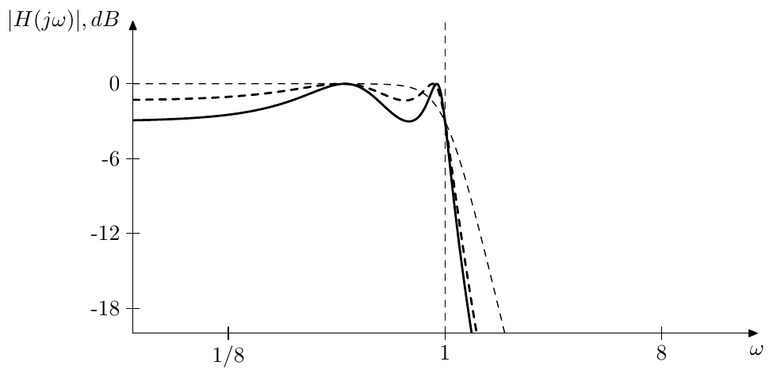

*Figure 9.23: Chebyshev type I filter's amplitude responses for $N=4$ and $\varepsilon=1$ (solid), $\varepsilon=0.6$ (dashed) and $\varepsilon=0$ (Butterworth, thin dashed).*

$$
T_N(\bar\omega) = \pm\frac{j}{\varepsilon} \tag{9.45}
$$

It is quite helpful to use the interpretation of $T_N$ in terms of representation preimage domain to solve (9.45). Recall that $T_N$ maps ellipses (of a special ellipse family, where the real and imaginary semiaxes $a$ and $b$ are related as $a^2-b^2=1$, so that they can be represented as $a=\cosh\beta$, $b=\sinh\beta$ for some $\beta$) to ellipses (of the same family). In the preimage domain these ellipses correspond to lines $\operatorname{Im} u = \beta$ parallel to the real axis.

Suppose $\bar\omega$ is moving in such an ellipse. This corresponds to its preimages moving along two lines $\operatorname{Im} u = \pm\beta$. Let $u$ be one of the preimages in $\operatorname{Im} u = \beta$, to which we will refer as the principal preimage. Respectively the full family of preimages is $\pm u + 2\pi n$. The principal preimage $v$ of $T_N(\bar\omega)$ is therefore $v = Nu$, moving along the line $\operatorname{Im} v = N\beta$. The full family of preimages of $T_N(\bar\omega)$ is respectively $\pm Nu + 2\pi Nn$ and is moving along the lines $\operatorname{Im} v = \pm N\beta$. Therefore $T_N(\bar\omega)$ is moving in an ellipse whose real and imaginary semiaxes are $\cosh N\beta$ and $\sinh N\beta$ respectively.

We wish $T_N(\bar\omega)$ to move *in a counterclockwise direction* along an ellipse which goes through the $\pm j/\varepsilon$ points. Then at the moments when $T_N(\bar\omega) = \pm j/\varepsilon$ we will obtain solutions of (9.45). We additionally wish the real part of the preimage $v$ of $T_N(\bar\omega)$ to be increasing during such movement,[^7] therefore for a counterclockwise movement of $T_N(\bar\omega)$ we need $\operatorname{Im} v = N\beta < 0$. Therefore, in order for the ellipse to go through $\pm j/\varepsilon$, the imaginary semiaxis $\sinh N\beta$ of this ellipse must be equal to $-1/\varepsilon$ and thus we obtain:

$$
\beta = -\frac{1}{N}\sinh^{-1}\frac{1}{\varepsilon}
$$

According to (9.29a), the purely imaginary values of a cosine are attained when the real part of the cosine's argument is equal to $\pi(\frac12+n)$, where $n\in\mathbb{Z}$. Thus, the values $\pm j/\varepsilon$ will be attained by $T_N(\bar\omega)$ at

$$
v = jN\beta + \pi\left(\frac12+n\right) \tag{9.46}
$$

where, since $\beta < 0$, the value $T_N(\bar\omega) = j/\varepsilon$ is attained at $n=0$ and other even values of $n$. Thus, the solutions of the even pole equation $f=j$ will occur at even values of $n$. Fig. 9.24 illustrates.

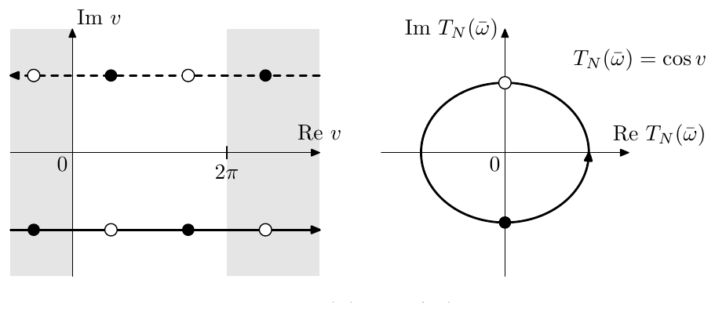

*Figure 9.24: Preimages of $T_N(\bar\omega) = \pm j/\varepsilon$ (qualitatively, the scales of the real and imaginary axes in the $v$ plane are not equal).*

From (9.46) we obtain

$$
u = j\beta + \pi\frac{\frac12+n}{N}
$$

where there are $2N$ essentially different preimages of $\bar\omega$ occuring at $2N$ consecutive values of $n$ all lying on the line $\operatorname{Im} u = \beta$. Going back to the representation domain we obtain $\bar\omega$ lying on the respective ellipse:

$$
\bar\omega = \cos\left(j\beta+\pi\frac{\frac12+n}{N}\right) \tag{9.47}
$$

Fig. 9.25 illustrates.

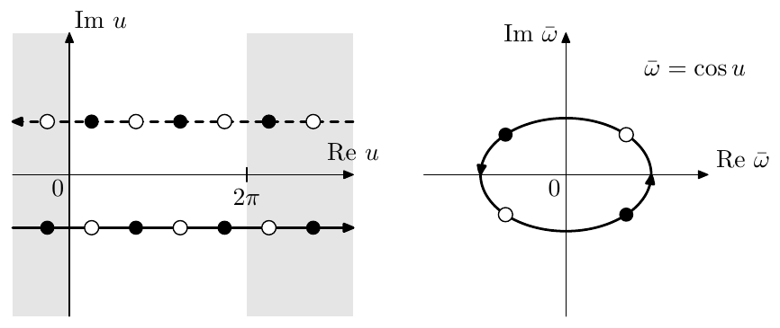

*Figure 9.25: Transformation of Fig. 9.24 by $u=v/N$ (for $N=2$). The white and black dots on the ellipse are even/odd Chebyshev poles in terms of $\bar\omega$. (The picture is qualitative, as the scales of the real and imaginary axes in the $u$ plane are not equal.)*

Switching to $\omega=\lambda\bar\omega$ we have:

$$
\omega = \lambda\cos\left(j\beta+\pi\frac{\frac12+n}{N}\right) \tag{9.48}
$$

Note that formally allowing $n$ to take real values and letting $n=-1/2$ we obtain $u=j\beta$ and $\omega=\lambda\cos(j\beta)=\lambda\cosh\beta$ which is a real positive value. Since the imaginary part of the cosine's argument is negative, the values of $\omega$ are moving counterclockwise for increasing $n$, starting from the value on the positive real semiaxis occuring at $n=-1/2$. That is, the values of $\omega$ are moving counterclockwise starting from the positive real semiaxis. As we already found out, the values occurring at even/odd $n$ correspond to even/odd poles respectively, and thus the even and odd poles are interleaved on the ellipse.

Switching from $\omega$ to $s=j\omega$ we obtain the expression for the poles:

$$
s = j\lambda\cos\left(j\beta+\pi\frac{\frac12+n}{N}\right) = \lambda\sinh\beta\sin\pi\frac{\frac12+n}{N} + j\lambda\cosh\beta\cos\pi\frac{\frac12+n}{N} \tag{9.49}
$$

Since the values of $\omega$ are moving counterclockwise starting from the real positive semiaxis, the values of $s$ are moving counterclockwise starting from the imaginary "positive" semiaxis, which means that starting at $n=0$ we first obtain the stable poles at $n=0,\dots,N-1$. The next $N$ values of $n$ will give the unstable poles.

Note that since $(\frac12+n)/N$ never takes integer values, the real part of $s$ is never zero and there are no poles on the imaginary axis. The poles are also symmetric relatively to the real and imaginary axes and we can discard the half of the poles located in the right complex semiplane in the same way how we did it with the Butterworth filter. Figs. 9.26 and 9.27 illustrate.[^8]

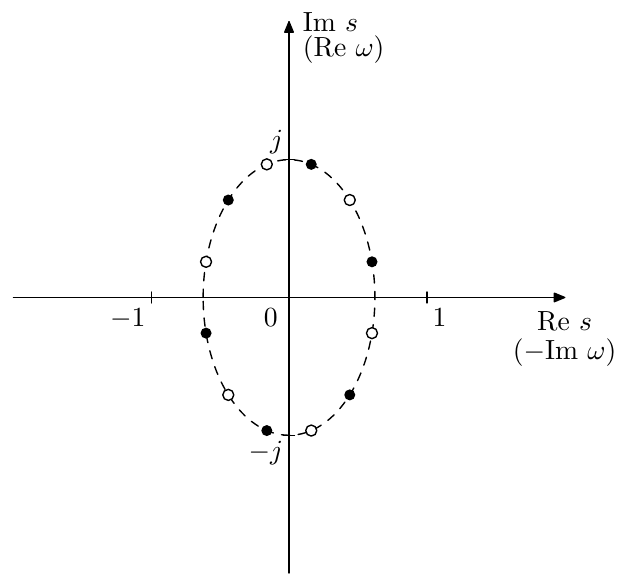

*Figure 9.26: Chebyshev type I filter's even (white) and odd (black) poles for $N=6$ (including the poles of $H(-s)$).*

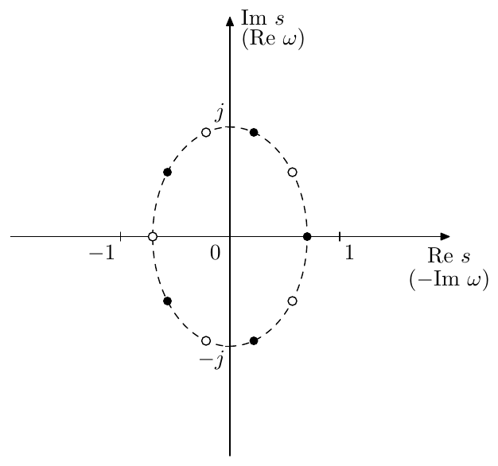

*Figure 9.27: Chebyshev type I filter's even (white) and odd (black) poles for $N=5$ (including the poles of $H(-s)$).*

In Figs. 9.26 and 9.27 one could notice that the poles are condensed close to the imaginary axis while the Butterworth poles were evenly spacing. This is easily explained in terms of (9.29a), which gives

$$
\tan\arg\cos(u+jv) = -\frac{\sinh v\sin u}{\cosh v\cos u} = -\tan u\cdot\tanh v
$$

Now, if $\tanh v$ had been equal to 1, we would have had $\arg\cos(u+jv) = -u$, which would have resulted in an even angular distribution of poles. However, since $|\tanh v| < 1$, the poles are located closer to the real axis in the $\omega$ plane or closer to the imaginary axis in the $s$ plane.

### Gain adjustments

Having obtained the poles and keeping in mind that there are no zeros, we can obtain the transfer function in the form

$$
H(s) = g\cdot\prod \frac{1}{s-p_n}
$$

where the gain $g$ could be obtained by evaluating the above product at $\omega=0$ and comparing to $H(0)$. It could be a bit more practical though, to write $H(s)$ as a product of 1-pole lowpasses with unity passband gains:

$$
H(s) = g\cdot\prod \frac{1}{s/(-p_n)+1} \tag{9.50}
$$

where $-p_n$ are the (possibly complex) cutoffs and where the coefficient $g$ is different than in the previous formula. For (9.50) we are having $H(0)=g$ and thus, using (9.18), we can obtain $g$ from

$$
H(0) = \frac{1}{\sqrt{1+\hat T_N^2(0)}} = \frac{1}{\sqrt{1+\varepsilon^2 T_N^2(0)}} = \frac{1}{1+\varepsilon^2\left(\operatorname{Re} j^N\right)^2} =
\begin{cases}
\dfrac{1}{1+\varepsilon^2} & \text{for } N \text{ even} \\
1 & \text{for } N \text{ odd}
\end{cases}
\tag{9.51}
$$

Another option is to obtain the leading gain $g$ from the requirement $|H(j)| = 1/\sqrt2$ arising from

$$
|H(j)|^2 = \frac{1}{1+\hat T_N^2(1)} = \frac12
$$

However this might accidentally result in a $180^\circ$ phase response at $\omega=0$, (since we used $|H(j)|$ rather than $H(j)$ as a reference) therefore one needs to be careful in this regard.

Using the default normalization of the Chebyshev filter's gain given by (9.51), we obtain the amplitude response varying within $[1/\sqrt{1+\varepsilon^2}, 1]$ on the range $\omega\in[-\lambda,\lambda]$. We could choose some other normalizations, though. E.g. we could require $|H(0)|=1$, which will be automatically achieved if we simply let $g=1$ in (9.50). Or we could require the ripples to be symmetric relatively to the zero decibel level, which is achieved by multiplying (9.51) by $(1+\varepsilon^2)^{1/4}$:

$$
H(0) = \sqrt{\frac{\sqrt{1+\varepsilon^2}}{1+\varepsilon^2 \hat T_N^2(0)}}
$$

so that $|H(j\omega)|$ varies within $[1/(1+\varepsilon^2)^{1/4}, (1+\varepsilon^2)^{1/4}]$ within the equiripple band.

### Butterworth limit

Since at $\lambda\to0$ we have $\hat T_N(x)\to x^N$, in the limit $\lambda\to0$ Chebyshev type I filter turns into a Butterworth filter of the same order $N$.

Simultaneously the ellipse semiaxes $\lambda\sinh\beta$ and $\lambda\cosh\beta$ in (9.49) are both approaching the unity length. Indeed, letting $\varepsilon\to0$ (which is equivalent to $\lambda\to0$), we have

$$
\begin{aligned}
\frac1\lambda &= \cosh\left(\frac1N\cosh^{-1}\frac1\varepsilon\right) \sim \exp\left(\frac1N\cosh^{-1}\frac1\varepsilon\right) = \\
&= \exp\frac{\ln\left(\varepsilon^{-1}+\sqrt{\varepsilon^{-2}-1}\right)}{N} = \left(\varepsilon^{-1}+\sqrt{\varepsilon^{-2}-1}\right)^{1/N} \sim \left(2\varepsilon^{-1}\right)^{1/N} \\
\cosh\beta &= \cosh\left(-\frac1N\sinh^{-1}\frac1\varepsilon\right) \sim \exp\left(\frac1N\sinh^{-1}\frac1\varepsilon\right) = \\
&= \exp\frac{\ln\left(\varepsilon^{-1}+\sqrt{\varepsilon^{-2}+1}\right)}{N} = \left(\varepsilon^{-1}+\sqrt{\varepsilon^{-2}+1}\right)^{1/N} \sim \left(2\varepsilon^{-1}\right)^{1/N}
\end{aligned}
$$

Thus $1/\lambda$ and $\cosh\beta$ are asymptotically identical and therefore $\lambda\cosh\beta\to1$. In a similar way we can show that $\lambda\sinh\beta\to1$.

## 9.8 Chebyshev type II filters

Chebyshev polynomials $T_N(x)$ have equiripple behavior on $[-1,1]$ and grow to infinity outside of that range. By reciprocating the argument: $T_N(1/x)$, we obtain equiripple behavior on $|x|\ge1$ and infinite growth for $x\to0$. By further reciprocating the value of the polynomial: $1/T_N(1/x)$, we have again small values on the range $[-1,1]$, while for $|x|\ge1$ the polynomial's value exhibits equiripple oscillations around infinity. We therefore introduce the function

$$
\mathcal{L}_N(x) = \frac{1}{T_N(1/x)}
$$

where Fig. 9.28 illustrates the behavior of $\mathcal{L}_N$. We will refer to $\mathcal{L}_N(x)$ as a *double-reciprocated* (once in argument and once in value) Chebyshev polynomial.

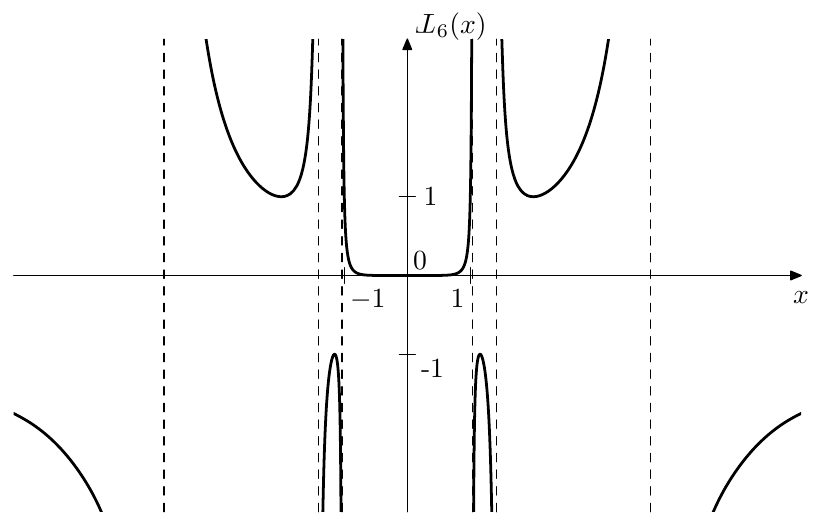

*Figure 9.28: Double-reciprocated Chebyshev polynomial $\mathcal{L}_N$.*

The equiripple oscillations around infinity are also better visible in the arctangent scale (Fig. 9.29). More specifically, on $[1,+\infty)$ and $(-\infty,-1]$ the value oscillates between $\pm1$ and $\infty$, never becoming less than 1 in the absolute magnitude. We could refer to that fact by saying that the amplitude of these oscillations around $\infty$ is unity, thereby taking the minimum absolute magnitude of the oscillating value as the oscillation amplitude, even though that might be considered some kind of a misnomer. We will be using this definition of amplitude of oscillations around infinity further in the text.

We also introduce the renormalized version of the double-reciprocated Chebyshev polynomials by double-reciprocating $\hat T_N$:

$$
\mathcal{L}_N(x,\lambda) = \frac{1}{\hat T_N(1/x,\lambda)} = \frac{T_N(1/\lambda)}{T_N(1/\lambda x)} = \frac{\mathcal{L}_N(\lambda x)}{\mathcal{L}_N(\lambda)} \tag{9.52}
$$

where we have $\mathcal{L}_N(1,\lambda)=1$. Notice that we didn't reciprocate the $\lambda$ parameter. The idea is that $0\le\lambda\le1$ and that

$$
\mathcal{L}_N(x,0) = \frac{1}{\hat T_N(1/x,0)} = \frac{1}{1/x^N} = x^N
$$

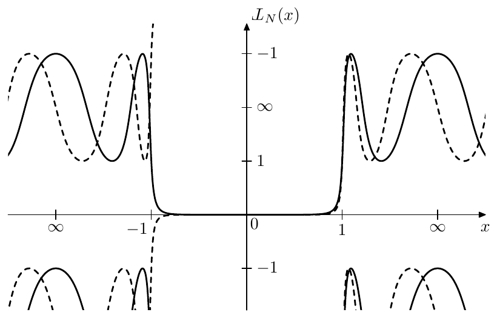

*Figure 9.29: Double-reciprocated Chebyshev polynomials of even (solid) and odd (dashed) orders, using arctangent scale in both axes.*

$$
\mathcal{L}_N(x,1) = \frac{1}{\hat T_N(1/x,1)} = \frac{1}{1/T_N(1/x)} = \mathcal{L}_N(x)
$$

Fig. 9.30 illustrates. As usual, we will often omit the $\lambda$ parameter, understanding it implicitly.

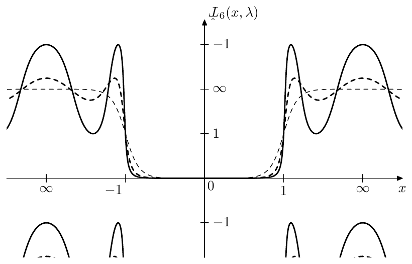

*Figure 9.30: Renormalized double-reciprocated Chebyshev polynomial $\mathcal{L}_6(x,\lambda)$ for $\lambda=1$ (solid), $\lambda=0.93$ (dashed) and $\lambda=0$ (thin dashed).*

By (9.52) the amplitude of the equiripples of $\hat{\mathcal{L}}_N(x)$ is $T_N(1/\lambda)$. By using the same equation (9.44) as we have been using for Chebyshev type II filters we have $T_N(1/\lambda)=1/\varepsilon$, that is the equiripple amplitude is $1/\varepsilon$. This is actually a convenient notation, since in this case we are having smaller (closer to $\infty$) equiripples at smaller $\varepsilon$. We also thereby have:

$$
\hat{\mathcal{L}}_N(x) = \frac{1}{\varepsilon T_N(1/\lambda x)} = \frac{\mathcal{L}_N(\lambda x)}{\varepsilon}
$$

By writing the Chebyshev polynomial as a polynomial:

$$
T_N(x) = \sum_{n=0}^N a_n x^n
$$

we find that the double-reciprocated Chebyshev polynomial is a rational function of $x$:

$$
\mathcal{L}_N(x) = \frac{1}{\displaystyle\sum_{n=0}^N a_n x^{-n}} = \frac{x^N}{\displaystyle\sum_{n=0}^N a_n x^{N-n}}
$$

The same apparently is true for $\hat{\mathcal{L}}_N(x)$ and therefore we could try using $\hat{\mathcal{L}}_N(\omega)$ as $f(\omega)$ in (9.18).

Letting $\bar f(\omega) = \hat{\mathcal{L}}_N(\omega)$ in (9.18) we obtain a Chebyshev type II filter, this time trading the ripples in the stopband against the transition band's rolloff (Fig. 9.31). The stopband peaks are achieved at $\hat{\mathcal{L}}_N(\omega) = 1/\varepsilon$, thus the ripple amplitude is $1/\sqrt{1+\varepsilon^{-2}}$.

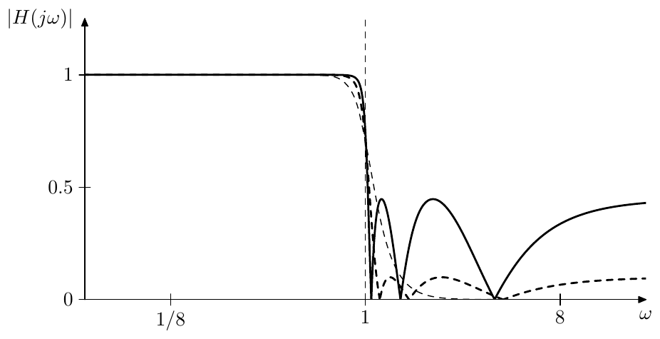

*Figure 9.31: Chebyshev type II filter's amplitude responses for $N=6$ and $\varepsilon=0.5$ (solid), $\varepsilon=0.1$ (dashed) and $\varepsilon=0$ (Butterworth, thin dashed). Notice the usage of the linear amplitude scale, which is chosen in order to be able to show the amplitude response zeros.*

### $\hat{\mathcal{L}}_N(x)$ as representations of linear scaling

In order to find the poles of a Chebyshev type II filter we are going, as usual, to interpret the function $\hat{\mathcal{L}}_N(x)$ as a representation of the linear scaling $v=Nu$. This time we need the following mapping:

$$
x = \frac{1}{\cos u} = \sec u
$$

$$
v = Nu
$$

$$
\hat{\mathcal{L}}_N(x) = \frac{1}{\cos v} = \sec v
$$

Same as with $T_N(x)$, the multiplication by $N$ expands the principal real period $[0,2\pi]$ to $[0,2\pi N]$ and there are similar transformations of the preimages of the real axis. The transformations of quasielliptic curves (shown in Fig. 9.20) which are representations of horizontal lines $\operatorname{Im} u = \text{const}$ in the preimage domain are also occurring in a similar fashion, each such curve being transformed into another such curve.

### Poles of Chebyshev type II filters

The pole equation is

$$
1 + \hat{\mathcal{L}}_N^2(\omega) = 0
$$

The even/odd pole equations are respectively

$$
\hat{\mathcal{L}}_N(\omega) = \pm j
$$

or

$$
\frac{\hat{\mathcal{L}}_N(\lambda\omega)}{\varepsilon} = \pm j
$$

or, introducing $\bar\omega=\lambda\omega$

$$
\hat{\mathcal{L}}_N(\bar\omega) = \pm j\varepsilon
$$

where the "+" sign corresponds to the even poles and the "-" sign to odd poles.

Suppose $\bar\omega$ is moving in a counterclockwise direction in a quasielliptic curve which is a representation of $\operatorname{Im} u = \beta$ (where, according to our previous discussion of the properties of the $x=1/\cos u$ mapping, $\beta>0$). This results in a similar counterclockwise motion of $\hat{\mathcal{L}}_N(\bar\omega)$. We wish $\hat{\mathcal{L}}_N(\bar\omega)$ to pass through the points $\pm j\varepsilon$ going counterclockwise.

At this point we could follow similar steps as we did for Chebyshev type I filters, using the preimage linear scaling interpretation of $\hat{\mathcal{L}}_N$ to obtain the points $\bar\omega$ where $\hat{\mathcal{L}}_N(\bar\omega)=\pm j\varepsilon$. However we also could notice that $\hat{\mathcal{L}}_N(\bar\omega)=\pm j\varepsilon \iff T_N(\bar\omega^{-1}) = \mp j/\varepsilon$. Therefore we could reuse the results of our discussion of Chebyshev type I filters, where we needed $T_N$ to go clockwise through $\mp j/\varepsilon$. That is, we need the value of $T_N$ to move in the same trajectory going through the same points as in the Chebyshev type I case, just in the opposite direction. This can be achieved by flipping its preimage line $\operatorname{Im} v = N\beta$ from the lower semiplane to the upper semiplane. Therefore the values of $T_N$ passing through $\mp j/\varepsilon$ going clockwise should occur at $\sinh N\beta = 1/\varepsilon$ and thus

$$
\beta = \frac1N\sinh^{-1}\frac1\varepsilon
$$

The other difference to the case of Chebyshev type I filters is that the argument of $T_N$ is $\bar\omega^{-1}$ rather than $\bar\omega$. Therefore we need to replace $\bar\omega$ in (9.47) with $\bar\omega^{-1}$ obtaining

$$
\bar\omega^{-1} = \cos\left(j\beta+\pi\frac{\frac12+n}{N}\right)
$$

and

$$
\omega^{-1} = \lambda\cos\left(j\beta+\pi\frac{\frac12+n}{N}\right)
$$

Since $s=j\omega=j/\omega^{-1}$, we have $-1/s=-\omega^{-1}/j=j\omega^{-1}$ and thus

$$
\begin{aligned}
-s^{-1} &= j\lambda\cos\left(j\beta+\pi\frac{\frac12+n}{N}\right) = \\
&= \lambda\sinh\beta\sin\pi\frac{\frac12+n}{N} + j\lambda\cosh\beta\cos\pi\frac{\frac12+n}{N}
\end{aligned}
\tag{9.53}
$$

The poles of Chebyshev type II filters are therefore negated reciprocals of the poles of Chebyshev type I filters.[^9] By the interpretation of $\hat{\mathcal{L}}_N$ as linear scaling in the preimage domain, Chebyshev type II poles should lie on quasielliptic trajectories, such as the ones shown in Fig. 9.19 and Fig. 9.20. Notice that, despite the negated reciprocation, the formula (9.53) still first gives the stable poles, due to the flipped sign of $\beta$ compared to (9.49).

### Zeros of Chebyshev type II filters

According to our discussion in Section 9.4 of using rational $f(\omega)$, Chebyshev type II filters also should have zeros, which in terms of $\omega$ coincide with poles of $f(\omega)$. The zero equation is thereby

$$
\hat{\mathcal{L}}_N(\omega,\lambda) = \infty
$$

or

$$
\hat{\mathcal{L}}_N(\lambda\omega) = \infty
$$

or, equivalently,

$$
T_N(1/\lambda\omega) = 0 \tag{9.54}
$$

The solutions of (9.54) thereby obtained from the zeros $z_n$ of $T_N$ (given by (9.38)) by

$$
\frac1{\lambda\omega} = z_n = \cos\left(\pi\frac{\frac12+n}{N}\right)
$$

or

$$
\omega^{-1} = \lambda\cos\left(\pi\frac{\frac12+n}{N}\right)
$$

or, in terms of $s$

$$
-s^{-1} = j\lambda\cos\left(\pi\frac{\frac12+n}{N}\right)
$$

An additional consideration arises at odd $N$ where one of the values given by (9.38) occurs at the origin, which after the reciprocation gives the infinity. This
means that there is no corresponding finite zero of $H(s)$ and no corresponding
factor in the numerator of $H(s)$. Respectively the order of the numerator of
$H(s)$ becomes 1 less than the order of the denominator. This automatically
results in $H(\infty) = 0$, that is $H(s)$ has a zero at the infinity, as required by
the reciprocation of the values given by (9.38). Fig. 9.32 provides an example.

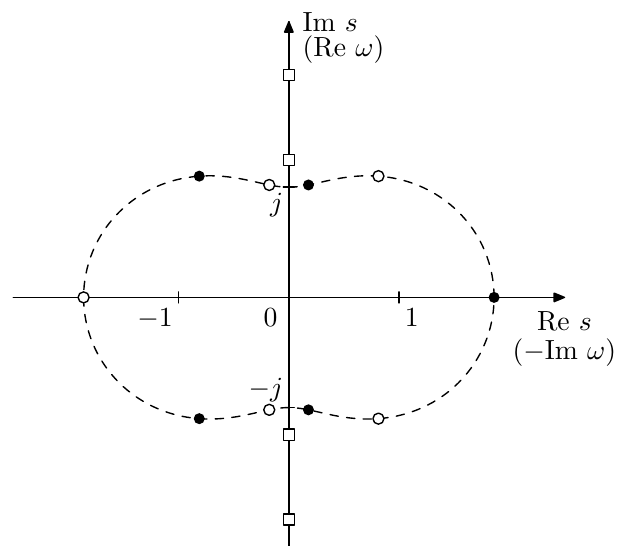

*Figure 9.32: Poles (white and black dots) and zeros (white squares) of a
Chebyshev type II filter of order $N = 5$. Each of the zeros is duplicated, but
the duplicates are dropped together with the unstable poles.*

### Filter gain

Since there are no ripples in the passband, there is little reason to attempt
any gain adjustments and the filter gain needs simply to be chosen from the
requirement $H(0) = 1$, thereby defining the leading gain coefficient $g$ of the
cascade form (8.1).

### Butterworth limit

Since $\hat{\mathcal{L}}_N(x, 0) = x^N$ in the limit $\lambda \to 0$ Chebyshev type II filter turns
into Butterworth filter.

Notice that the pole formula (9.53) is essentially the negated reciprocal of
(9.49). On the other hand, negation and/or reciprocation turn Butteworth poles
into themselves (if nonstable poles are included), therefore, since in the limit
(9.49) gives Butterworth poles, (9.53) also does the same.

## 9.9 Jacobian elliptic functions

The next class of equiripple filters which we would like to introduce are elliptic
filters. Chebyshev filters were based on the cosine function and required a wider
spectrum of trigonometric and hyperbolic functions for their analysis. Similarly,
elliptic filters are based on Jacobian elliptic cosine function and require other
Jacobian elliptic functions for their analysis. Since Jacobian elliptic functions
are not a part of widely spread common knowledge, on the contrary, the freely
available resources are rather scarce, we are going to introduce them and discuss
their properties relevant for this book's material.

Additional information can be found in the reference texts listed at the end
of this chapter. The results presented here and in the rest of this chapter without
any kind of proof or justification are either taken directly or derived from these
texts.

### Elliptic integrals of the first kind

One of the most common ways to introduce Jacobian elliptic functions is as
some kind of special inverses of the elliptic integral of the first kind, which we
therefore will briefly discuss first.

The *elliptic integral of the first kind* is the function notated $F(\varphi, k)$ defined
by the formula:

$$
F(\varphi, k) = \int_0^{\varphi} \frac{d\theta}{\sqrt{1 - k^2\sin^2\theta}} \tag{9.55}
$$

The parameter $k$ is referred to as *elliptic modulus*. Normally $0 \le k \le 1$. At
$k = 0$ we simply have $F(\varphi, 0) = \varphi$.

The value of $F(\varphi, k)$ at $\varphi = \pi/2$ is often of a particular interest, which
motivates the introduction of the *complete elliptic integral of the first kind*:

$$
K(k) = F(\pi/2, k)
$$

Respectively we are having

$$
\begin{aligned}
K(0) &= F(\pi/2, 0) = \frac{\pi}{2} \tag{9.56a}
\end{aligned}
$$

$$
K(1) = F(\pi/2, 1) = \int_0^{\pi/2} \frac{d\theta}{\sqrt{1-\sin^2\theta}} = \int_0^{\pi/2} \frac{d\theta}{\cos\theta} = \infty \tag{9.56b}
$$

The graph of $K(k)$ is shown in Fig. 9.33. Notice that $K(k)$ grows with $k$ (which
is obvious from (9.55)).

The elliptic modulus is sometimes expressed as $k = \sin\alpha$ where $\alpha$ is referred
to as the *modular angle*. Given a modular angle $\alpha$, often one also needs the
*complementary modular angle* $\alpha'$ which is simply defined as

$$
\alpha' = \frac{\pi}{2} - \alpha
$$

Respectively there is the complementary elliptic modulus:

$$
k' = \sqrt{1 - k^2}
$$

and the complementary complete elliptic integral of the first kind:

$$
K'(k) = K(k') = F(\pi/2, k')
$$

Notice that $k'$ decreases as $k$ increases and vice versa. On the other hand
$K(k)$ is a monotonically increasing function. Therefore the ratio $K'(k)/K(k)$
monotonically decreases with growing $k$. Fig. 9.34 illustrates, where we use the
modular angle in the abscissa scale in order to make the symmetry between $K$
and $K'$ explicitly visible.

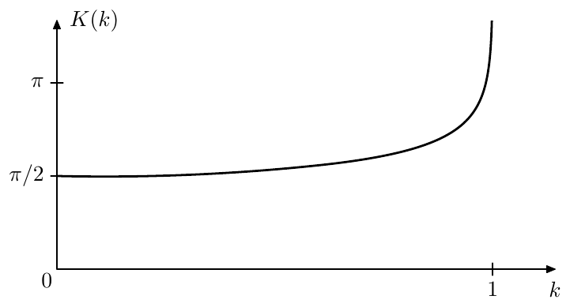

*Figure 9.33: Complete elliptic integral of the first kind $K(k)$.*

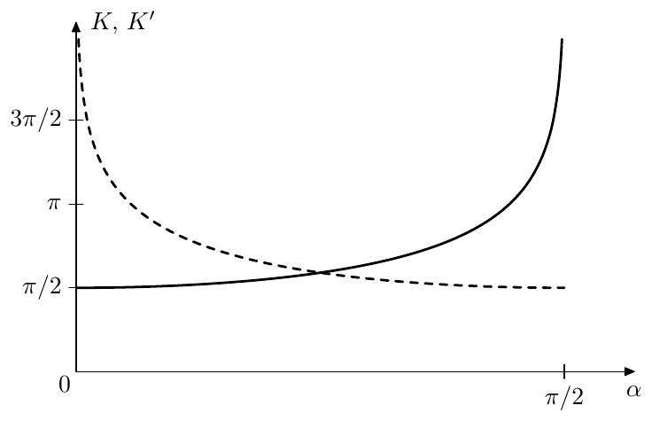

*Figure 9.34: Complete elliptic integral of the first kind $K$ (solid
line) and the complemetary complete elliptic integral of the first kind $K'$
(dashed line), plotted against the modular angle $\alpha$.*

### Jacobian elliptic functions

There are 12 different Jacobian elliptic functions but we will concentrate only
on 6 of them. The ones we introduce will bear strong similarities to certain
trigonometric and/or hyperbolic functions, becoming equal to them in the limit.

We will define Jacobian elliptic functions in terms of the so called *amplitude*,
which is defined as a function $\varphi = \operatorname{am}(x, k)$, which is the inverse of the
elliptic integral of the first kind:

$$
F(\operatorname{am}(x, k), k) = x \tag{9.57}
$$

That is, for a given $x$ the function $\varphi = \operatorname{am}(x, k)$ gives such $\varphi$ that
$F(\varphi, k) = x$. Note that since in the limit $k \to 0$ we have $F(\varphi, 0) = \varphi$, we are
respectively having $\operatorname{am}(x, 0) = x$.

As with elliptic integral $F(\varphi, k)$, the second argument $k$ serves a role of the
function's parameter, the "primary" argument of the function being $x$. Often
this parameter is simply omitted and understood implicitly: $\varphi = \operatorname{am} x$. Even
more commonly, this is done for Jacobian elliptic functions (which are having
exactly the same arguments as the amplitude).

Now, from the six Jacobian elliptic functions that we are going to introduce,
the four of our primary interest will be:

- Jacobian elliptic "sine" $\operatorname{sn}(x, k)$ is defined by the equation

  $$
  \operatorname{sn}(x, k) = \sin\varphi \tag{9.58}
  $$

  where $\varphi = \operatorname{am}(x, k)$. Or simply, $\operatorname{sn}(x, k) = \sin\operatorname{am}(x, k)$.

  Fig. 9.35 provides example graphs of $\operatorname{sn} x$, where we could also notice
  that $\operatorname{sn} x$ is $4K$-periodic. The value $K$ is simply a short notation for the
  complete elliptic integral $K(k)$, evaluated for the same modulus $k$ which is
  used in $\operatorname{sn}(x, k)$. Please also note that the graphs in Fig. 9.35 are plotted
  "in terms of $K$", that is different abscissa scales are used for different
  graphs in the same figure. This has been done in order to provide a better
  visual comparison of different $\operatorname{sn}(x, k)$ with different periods.

  Since the limit $k \to 0$ we have $\varphi = \operatorname{am}(x, 0) = x$, the elliptic sine turns
  into into $\operatorname{sn}(\varphi, 0) = \sin\varphi$.

- Jacobian elliptic "cosine"[^10] $\operatorname{cd}(x, k)$ is defined by the equation:

  $$
  \operatorname{cd}(x, k) = \frac{\cos\varphi}{\sqrt{1 - k^2\sin^2\varphi}} \tag{9.59}
  $$

  where $\varphi = \operatorname{am}(x, k)$. Fig. 9.36 illustrates, where one could observe that
  $\operatorname{cd} x$ is $4K$-periodic. Apparently $\operatorname{cd}(x, 0) = \cos x$.

- Jacobian elliptic "tangent"/elliptic "hyperbolic sine" $\operatorname{sc}(x, k)$ is defined by
  the equation:

  $$
  \operatorname{sc}(x, k) = \tan\varphi \tag{9.60}
  $$

  where $\varphi = \operatorname{am}(x, k)$. Fig. 9.37 illustrates, where one could observe that
  $\operatorname{sc} x$ is $2K$-periodic.

  Apparently $\operatorname{sc}(x, 0) = \tan x$. However, the function $\operatorname{sc} x$ also bears strong
  similarities to the hyperbolic sine, becoming equal to it in the limit $k \to 1$.
  In this book we will be mostly using the similarity of $\operatorname{sc}$ to $\sinh$, therefore
  we will typically refer to $\operatorname{sc}$ as elliptic "hyperbolic sine".

- Jacobian elliptic "hyperbolic cosine" $\operatorname{nd}(x, k)$ is defined by the equation:

  $$
  \operatorname{nd}(x, k) = \frac{1}{\sqrt{1 - k^2\sin^2\varphi}} \tag{9.61}
  $$

  where $\varphi = \operatorname{am}(x, k)$. Fig. 9.38 illustrates, where one could observe that
  $\operatorname{nd} x$ is $2K$-periodic. This function becomes equal to $\cosh$ in the limit
  $k \to 1$.

We will also introduce two "auxiliary" functions:

- Jacobian elliptic "cosecant" $\operatorname{ns} x = 1/\operatorname{sn} x$ (Fig. 9.39)

- Jacobian elliptic "secant" $\operatorname{dc} x = 1/\operatorname{cd} x$ (Fig. 9.40).

Since these two are simply reciprocals of $\operatorname{sn}$ and $\operatorname{cd}$, we won't be discussing them
much, however they will be used occasionally.

From the previous discussion we could conclude that $4K$ is the common
period of all six introduced elliptic functions (where the elliptic "trigonomet-
ric" functions are $4K$-periodic and the elliptic "hyperbolic" functions are $2K$-
periodic). For that reason $K = K(k)$ is referred to as the *quarter-period*.

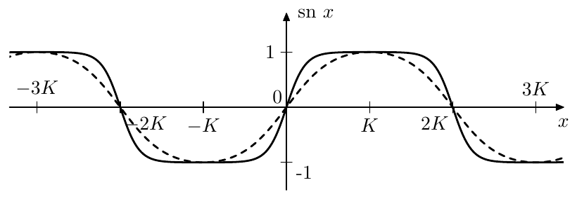

*Figure 9.35: Jacobian elliptic sine for $k = 0.8$ (dashed) and $k =
0.999$ (solid).*

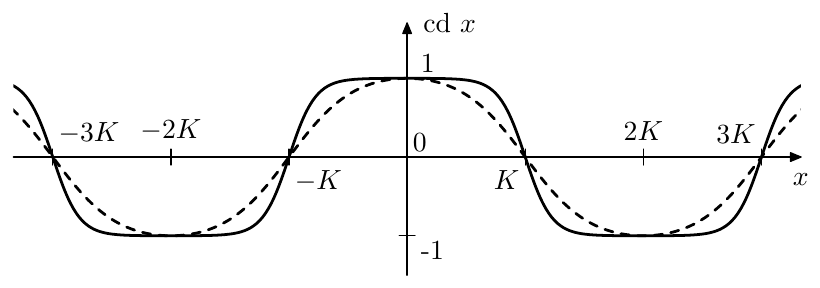

*Figure 9.36: Jacobian elliptic cosine for $k = 0.8$ (dashed) and
$k = 0.999$ (solid).*

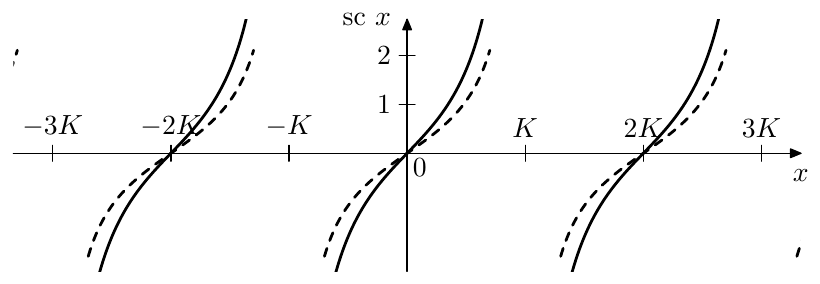

*Figure 9.37: Jacobian elliptic "hyperbolic sine" (or "trigonometric
tangent") for $k = 0.5$ (dashed) and $k = 0.94$ (solid).*

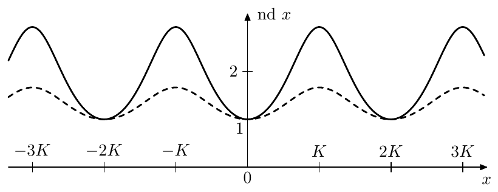

*Figure 9.38: Jacobian elliptic "hyperbolic cosine" $k = 0.8$ (dashed)
and $k = 0.94$ (solid). The maxima are at $1/k'$.*

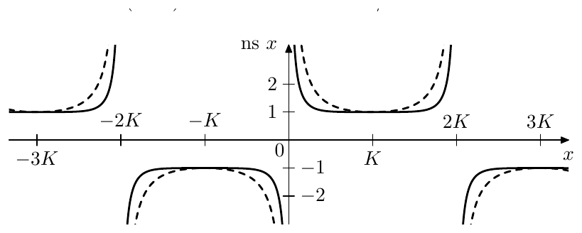

*Figure 9.39: Jacobian elliptic cosecant $k = 0.8$ (dashed) and $k =
0.999$ (solid).*

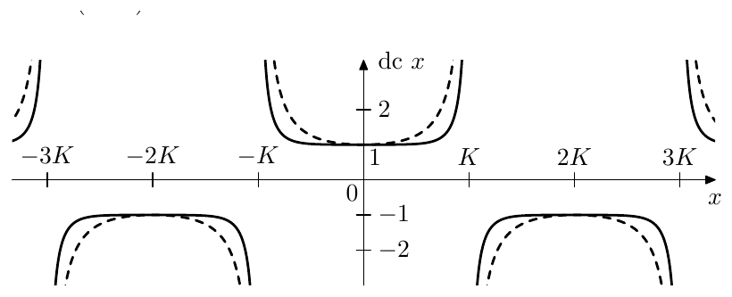

*Figure 9.40: Jacobian elliptic secant $k = 0.8$ (dashed) and $k =
0.999$ (solid).*

### Complex argument

Jacobian elliptic functions can be generalized to complex argument values. Re-
markably, all of the six introduced functions can be obtained from each other
by shifts and/or rotations of the argument in the complex plane (with some
possible scaling of the resulting function's value).

Before discussing any Jacobian elliptic function on the complex plane we
need to introduce the imaginary quarter period $K'$ which is simply equal to
the complementary complete elliptic integral: $K' = K'(k) = K(k')$. Jacobian
elliptic functions are also periodic in the imaginary direction, where the elliptic
"trigonometric" functions are $2jK'$-periodic and the elliptic "hyperbolic" func-
tions are $4jK'$-periodic, e.g. $\operatorname{cd}(x, k) = \operatorname{cd}(x + 2jK', k)$.

The real and imaginary quarter periods create a virtual grid on the complex
plane (Fig. 9.41). We will be particularly interested in the values that Jacobian
elliptic functions are taking along the lines of this grid.

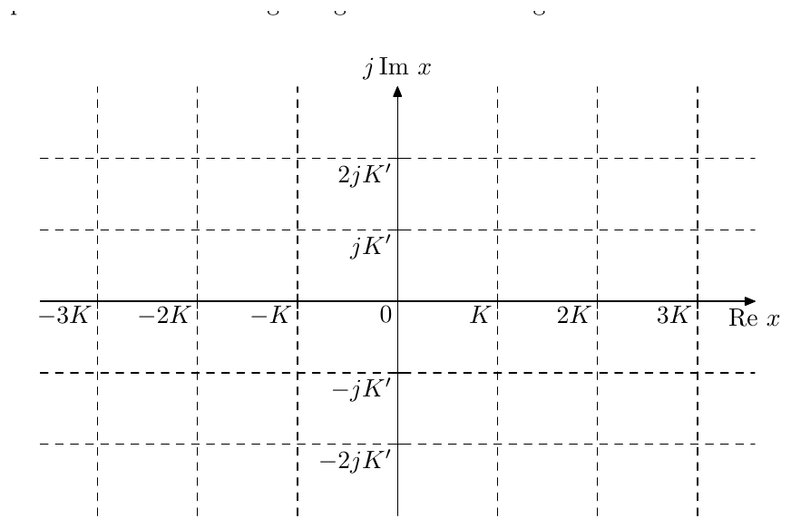

*Figure 9.41: Quarter-period grid.*

Let's start with $\operatorname{cd} x$. It turns out that the values of $\operatorname{cd} x$ on this grid are
always equal to the (possibly scaled by some real or imaginary coefficient) values
of one of the six introduced Jacobian functions evaluated for the real or the
imaginary part of $\operatorname{cd} x$. Fig. 9.42 illustrates.

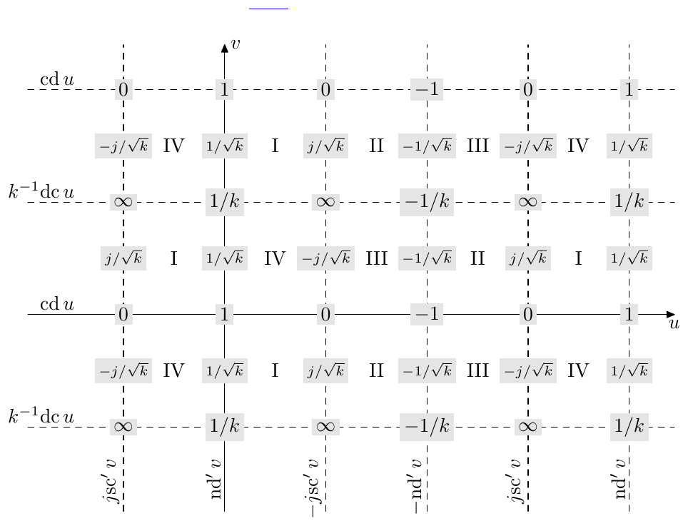

*Figure 9.42: Values of $\operatorname{cd} x = \operatorname{cd}(u+jv)$ on the quarter-period grid.*

The expressions at the ends of the quarter-grid lines in Fig. 9.42 are what
$\operatorname{cd}(x, k)$ is equal to on each of these lines, where the notation is $u = \operatorname{Re} x$,
$v = \operatorname{Im} x$. E.g. for $x = u + jK'$ the function's value is $\operatorname{cd} x = \operatorname{cd}(u+jK') =
k^{-1}\operatorname{dc} u$. For $x = K$ the function's value is $\operatorname{cd} x = \operatorname{cd}(K+jv) = -j\operatorname{sc}' v =
-j\operatorname{sc}(v, k')$, that is the primed notation denotes the usage of the complementary
elliptic modulus. Apparently, the complementary modulus needs to be used for
all grid lines parallel to the imaginary axis, since the quarter period in that
direction is $K'$.

The roman numerals in the middle of the grid cells denote the complex
quadrant to which the values of $\operatorname{cd} x$ belong for $x$ inside the respective grid
cell. The quadrants are numbered starting from the positive real semiaxis in
the counterclockwise direction. Fig. 9.42 also shows the function values at the
intersections of the grid lines. Additionally the values exactly in the middle
between the horizontal grid lines are shown. E.g. $\operatorname{cd}(jK'/2) = 1/\sqrt{k}$. The
readers are encouraged to compare the values listed in Fig. 9.42 to the graphs
in Figs. 9.35 through 9.40.

Similarly to how the trigonometric sine is obtained from the trigonometric
cosine by a shift by the quarter-period $\pi/2$ (which also holds for complex ar-
guments), the Jacobian sine is obtained from the Jacobian cosine by a shift by
the quarter period $K$: $\operatorname{sn} x = \operatorname{cd}(x - K)$. Respectively, the content of Fig. 9.42
becomes shifted by $K$ resulting in the picture in Fig. 9.43.

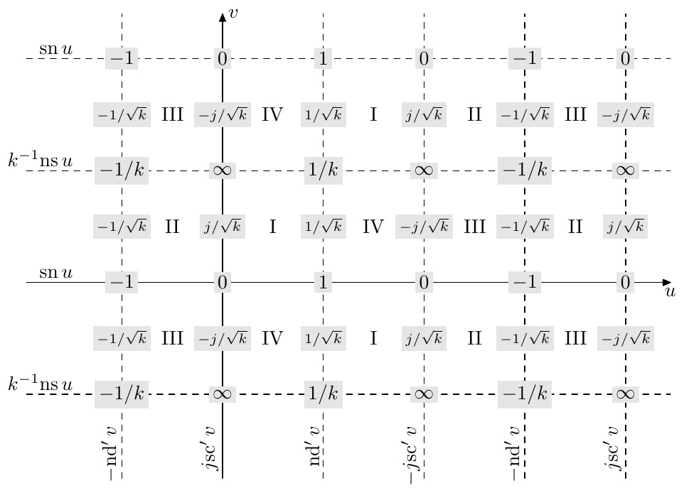

*Figure 9.43: Values of $\operatorname{sn} x = \operatorname{sn}(u+jv)$ on the quarter-period grid.*

From Fig. 9.42 one could notice that $\operatorname{cd}(jv, k) = \operatorname{nd}(v, k')$. It turns out
that this equality holds not only for real $v$ but for any complex $v$. That is,
Jacobian hyperbolic cosine can be obtained from Jacobian cosine by rotation of
the complex plane by $90^\circ$ and swapping of $k$ and $k'$ (which effectively swaps $K$
and $K'$).[^11] Fig. 9.44 illustrates.

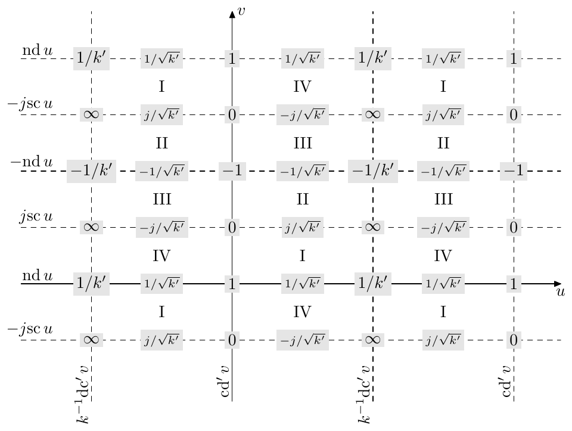

*Figure 9.44: Values of $\operatorname{nd} x = \operatorname{nd}(u + jv)$ on the quarter-period
grid.*

In a similar fashion, in Fig. 9.43 one could notice that $\operatorname{sn}(jv, k) = j\operatorname{sc}(v, k')$.
This equality also holds not only for real $v$ but for any complex $v$. That is,
Jacobian hyperbolic sine can be obtained from Jacobian sine by rotation of the
complex plane by $90^\circ$ clockwise, swapping of $k$ and $k'$ and dividing the result
by $j$ (or, equivalently, multiplying by $-j$). Alternatively, recalling that $\operatorname{sn}$ is
obtained from $\operatorname{cd}$ by a shift by a real quarter period, we could have simply
shifted the content of Fig. 9.44 downwards by an imaginary quarter period and
divided it by $j$. Fig. 9.45 illustrates.

The functions $\operatorname{dc} x$ and $\operatorname{ns} x$ are easily obtainable from Figs. 9.42 and 9.43
by a shift by one imaginary period (and a multiplication by $k$).

### Properties of Jacobian elliptic functions

There are lots of analogies between trigonometric/hyperbolic and Jacobian ellip-
tic functions including similarities between their shapes, which one can see from
Figs. 9.35 through 9.40. We are going to list some of the properties of Jacobian
elliptic functions comparing them against similar properties of their trigonomet-
ric/hyperbolic counterparts, where possible. The value of the argument $x$ will
be assumed complex, unless otherwise noted. It is highly recommended to refer
to Figs. 9.35 through 9.40 and to Figs. 9.42 through 9.45 while studying the
properties below.

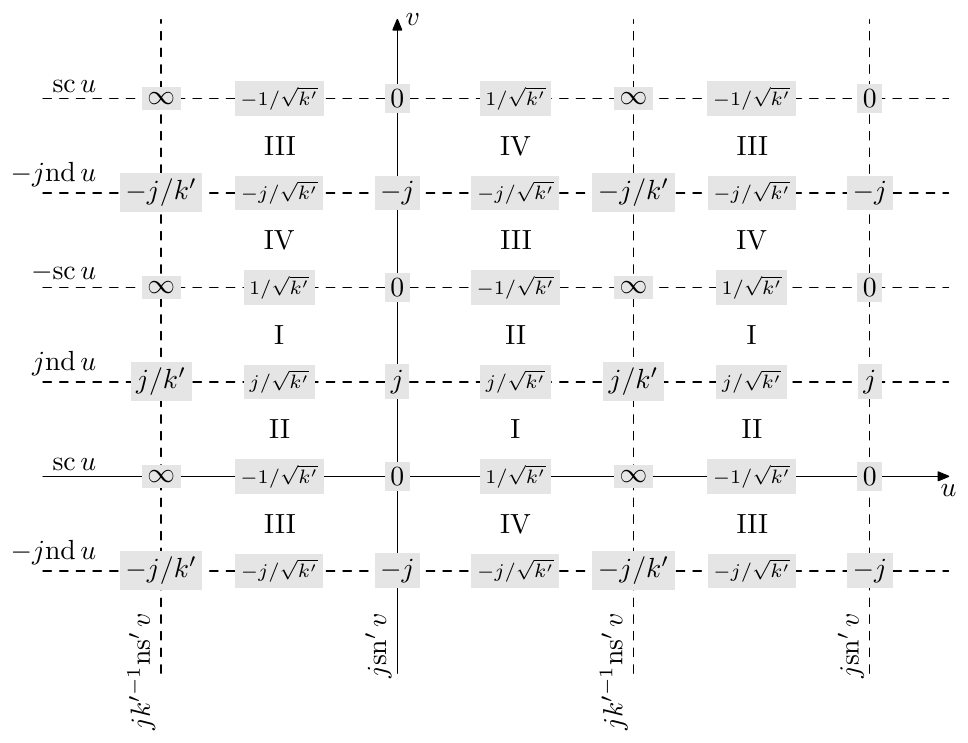

*Figure 9.45: Values of $\operatorname{sc} x = \operatorname{sc}(u + jv)$ on the quarter-period grid.*

- Reduction to trigonometric/hyperbolic functions at $k \to 0$ or $k \to 1$:

  $$
  \operatorname{sn}(x, 0) = \sin x \tag{9.62a}
  $$

  $$
  \operatorname{cd}(x, 0) = \cos x \tag{9.62b}
  $$

  $$
  \operatorname{sc}(x, 0) = \tan x \tag{9.62c}
  $$

  $$
  \operatorname{nd}(x, 0) \equiv 1 \tag{9.62d}
  $$

  $$
  \operatorname{sc}(x, 1) = \sinh x \tag{9.62e}
  $$

  $$
  \operatorname{nd}(x, 1) = \cosh x \tag{9.62f}
  $$

  $$
  \operatorname{ns}(x, 0) = \csc x \tag{9.62g}
  $$

  $$
  \operatorname{dc}(x, 0) = \sec x \tag{9.62h}
  $$

- The functions are analytic (except at their poles).

- Real function values for real argument $x \in \mathbb{R}$:

  $$
  \operatorname{sn} x \in \mathbb{R} \qquad \sin x \in \mathbb{R}
  $$
  $$
  \text{etc.}
  $$

- The functions commute with complex conjugation:

  $$
  \operatorname{sn} x^* = (\operatorname{sn} x)^* \qquad \sin x^* = (\sin x)^*
  $$

  etc.

- Odd/even symmetries

$$
\begin{aligned}
\operatorname{sn}(-x) &= -\operatorname{sn} x & \sin(-x) &= -\sin x \\
\operatorname{cd}(-x) &= \operatorname{cd} x & \cos(-x) &= \cos x \\
\operatorname{sc}(-x) &= -\operatorname{sc} x & \sinh(-x) &= -\sinh x \\
\operatorname{nd}(-x) &= \operatorname{nd} x & \cosh(-x) &= \cosh x
\end{aligned}
$$

- Imaginary argument

$$
\operatorname{sn}(jx,k) = j\operatorname{sc}(x,k')  \sin(jx) = j\sinh x \tag{9.63a}
$$

$$
\operatorname{cd}(jx,k) = \operatorname{nd}(x,k')  \cos(jx) = \cosh x \tag{9.63b}
$$

$$
\operatorname{sc}(jx,k) = j\operatorname{sn}(x,k')  \sinh(jx) = j\sin x \tag{9.63c}
$$

$$
\operatorname{nd}(jx,k) = \operatorname{cd}(x,k')  \cosh(jx) = \cos x \tag{9.63d}
$$

where we intuitively assume $x \in \mathbb{R}$, although the properties hold for any
$x \in \mathbb{C}$.

- Periodicity along real axis:

$$
\begin{aligned}
\operatorname{sn}(x+4K) &= \operatorname{sn} x & \sin(x+2\pi) &= \sin x \\
\operatorname{cd}(x+4K) &= \operatorname{cd} x & \cos(x+2\pi) &= \cos x \\
\operatorname{sc}(x+2K) &= \operatorname{sc} x & &\text{n/a} \\
\operatorname{nd}(x+2K) &= \operatorname{nd} x & &\text{n/a}
\end{aligned}
$$

and along imaginary axis:

$$
\begin{aligned}
\operatorname{sn}(x+2jK') &= \operatorname{sn} x & &\text{n/a} \\
\operatorname{cd}(x+2jK') &= \operatorname{cd} x & &\text{n/a} \\
\operatorname{sc}(x+4jK') &= \operatorname{sc} x & \sinh(x+2j\pi) &= \sinh x \\
\operatorname{nd}(x+4jK') &= \operatorname{nd} x & \cosh(x+2j\pi) &= \cos xh
\end{aligned}
$$

Note that the periodicity property of $\operatorname{sn} x$ and $\operatorname{cd} x$ along the imaginary
axis is the dual of the periodicity property of $\operatorname{sc} x$ and $\operatorname{nd} x$ along the real
axis, the duality arising from the imaginary argument property.

- Shift by function's half-period[^12] in the real direction

$$
\operatorname{sn}(x\pm 2K) = -\operatorname{sn} x  \sin(x\pm\pi) = -\sin x \tag{9.65a}
$$

$$
\operatorname{cd}(x\pm 2K) = -\operatorname{cd} x  \cos(x\pm\pi) = -\cos x \tag{9.65b}
$$

$$
\operatorname{sc}(x\pm K) = -1/k'\operatorname{sc} x  \text{n/a} \tag{9.65c}
$$

$$
\operatorname{nd}(x\pm K) = 1/k'\operatorname{nd} x  \text{n/a} \tag{9.65d}
$$

and in the imaginary direction

$$
\operatorname{sn}(x\pm jK') = 1/k\operatorname{sn} x \qquad \text{n/a} \tag{9.65e}
$$

$$
\operatorname{cd}(x\pm jK') = 1/k\operatorname{cd} x  \text{n/a} \tag{9.65f}
$$

$$
\operatorname{sc}(x\pm 2jK') = -\operatorname{sc} x  \sinh(x\pm j\pi) = -\sinh x \tag{9.65g}
$$

$$
\operatorname{nd}(x\pm 2jK') = -\operatorname{nd} x  \cosh(x\pm j\pi) = -\cosh x \tag{9.65h}
$$

- Shift by function's quarter-period

$$
\operatorname{sn}(x+K) = \operatorname{cd} x  \sin(x+\pi/2) = \cos x \tag{9.66a}
$$

$$
\operatorname{cd}(x-K) = \operatorname{sn} x  \cos(x-\pi/2) = \sin x \tag{9.66b}
$$

$$
\operatorname{sc}(x+jK') = j\operatorname{nd} x  \sinh(x+j\pi/2) = j\cosh x \tag{9.66c}
$$

$$
\operatorname{nd}(x+jK') = j\operatorname{sc} x  \cosh(x+j\pi/2) = j\sinh x \tag{9.66d}
$$

- Symmetry around function's quarter-period point (this follows from the odd/even
  symmetries and the shift by function's half-period property) in the real direction:

$$
\operatorname{sn}(2K-x) = \operatorname{sn}(x)  \sin(\pi-x) = \sin x \tag{9.67a}
$$

$$
\operatorname{cd}(2K-x) = -\operatorname{cd}(x)  \cos(\pi-x) = -\cos x \tag{9.67b}
$$

$$
\operatorname{sc} x\operatorname{sc}(K-x) = 1/k'  \text{n/a} \tag{9.67c}
$$

$$
\operatorname{nd} x\operatorname{nd}(K-x) = 1/k'  \text{n/a} \tag{9.67d}
$$

and in the imaginary direction:

$$
\operatorname{sn} x\operatorname{sn}(jK'-x) = -1/k  \text{n/a} \tag{9.67e}
$$

$$
\operatorname{cd} x\operatorname{cd}(jK'-x) = 1/k  \text{n/a} \tag{9.67f}
$$

$$
\operatorname{sc}(2jK'-x) = \operatorname{sc} x  \sinh(j\pi-x) = \sinh x \tag{9.67g}
$$

$$
\operatorname{nd}(2jK'-x) = -\operatorname{nd} x  \cosh(j\pi-x) = -\cosh x \tag{9.67h}
$$

- Pythagorean theorem

$$
\begin{aligned}
\operatorname{sn}^2 x + \operatorname{cd}^2 x &= 1 + k^2\operatorname{sn}^2 x\operatorname{cd}^2 x & \sin^2 x + \cos^2 x &= 1 \tag{9.68}
\end{aligned}
$$

(we won't need the respective properties for the "hyperbolic" functions). There is
another useful Pythagorean-like identity:

$$
k^2\operatorname{cd}^2 x + k'^2\operatorname{nd}^2 x = 1 \tag{9.69}
$$

- Sum of arguments

$$
\begin{aligned}
\operatorname{cd}(x+y,k) &= \frac{\operatorname{cd} x\operatorname{cd} y - \operatorname{sn} x\operatorname{sn} y}{1-k^2\operatorname{sn} x\operatorname{sn} y\operatorname{cd} x\operatorname{cd} y} \tag{9.70}\\
\cos(x+y) &= \cos x\cos y - \sin x\sin y
\end{aligned}
$$

(we won't need the respective properties for the other functions).

- Complex argument

$$
\begin{aligned}
\operatorname{cd}(u+jv,k) &= \frac{\operatorname{cd} u\operatorname{nd}' v - j\operatorname{sn} u\operatorname{sc}' v}{1-jk^2\operatorname{sn} u\operatorname{sc}' v\operatorname{cd} u\operatorname{nd}' v} \tag{9.71}\\
\cos(u+jv) &= \cos u\cosh v - j\sin u\sinh v
\end{aligned}
$$

where $\operatorname{nd}' v = \operatorname{nd}(v,k')$, $\operatorname{sc}' v = \operatorname{sc}(v,k')$. This is a direct corollary
of (9.70). One can use (9.71) to show that the values of $\operatorname{cd}$ on a single grid
cell in Fig. 9.42 belong to one and the same complex quadrant.

- Logarithmic derivative

$$
\frac{\mathrm{d}}{\mathrm{d}x}\ln\operatorname{cd} x = -k'^2\operatorname{sc} x\operatorname{nd} x  \frac{\mathrm{d}}{\mathrm{d}x}\ln\cos x = -\tan x \tag{9.72a}
$$

$$
\frac{\mathrm{d}^2}{\mathrm{d}x^2}\ln\operatorname{cd} x = k\left(k\operatorname{cd}^2 x - \frac{1}{k\operatorname{cd}^2 x}\right)  \frac{\mathrm{d}^2}{\mathrm{d}x^2}\ln\cos x = -\frac{1}{\cos^2 x} \tag{9.72b}
$$

### Periodicity

As we already mentioned, Jacobian elliptic functions are periodic in real and
imaginary direction. E.g. $\operatorname{cd} x$ is $4K$- and $2jK'$-periodic. Thus the periods
of $\operatorname{cd} x$ are rectangles in the complex plane, the horizontal dimension of each
rectangle being equal to $4K$ and the vertical dimension being equal to $2K'$.
Fig. 9.46 illustrates.

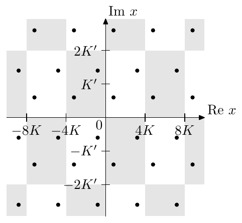

*Figure 9.46: Periods of $\operatorname{cd} x$ in the complex plane. All dots are
preimages of one and the same value.*

Due to the even symmetry of the elliptic cosine, almost every value occurs
twice on a period (as illustrated by the dots in Fig. 9.46). That is if the value
$y$ occurs at $x$ (that is $y = \operatorname{cd} x$), then $y$ also occurs at $-x$. The exceptions
are being $\operatorname{cd} x = \pm 1$ and $\operatorname{cd} x = \pm 1/\sqrt{k}$, which are mapped to themselves by
$x \leftarrow -x$ if the periodicities of $\operatorname{cd} x$ are taken into account.

Similar considerations apply to $\operatorname{sn} x$, $\operatorname{sc} x$ and $\operatorname{nd} x$.

### Preimages of the real line

By (9.71) $\operatorname{cd} x$ attains purely real values iff $x \in \mathbb{R}$ or $\operatorname{Re} x = 2Kn$ where
$n \in \mathbb{Z}$, which is also illustrated by Fig. 9.42. Similarly to $\cos x$, we would like
to choose a principal preimage of the real line with respect to the transformation
$y = \operatorname{cd} x$. Since $\operatorname{cd} x \to \cos x$ for $k \to 0$, we would like the principal real line
preimage for $\operatorname{cd} x$ to approach to the respective principal preimage for $\cos x$ as
$k \to 0$. Under this requirement there is only one choice, which is shown in Fig. 9.47.

This principal preimage of the real axis thereby consists of five parts:

$$
\begin{aligned}
x \in [0, 2K] &\iff y \in [-1, 1] \\
x \in [0, jK'] &\iff y \in [1, 1/k]
\end{aligned}
$$

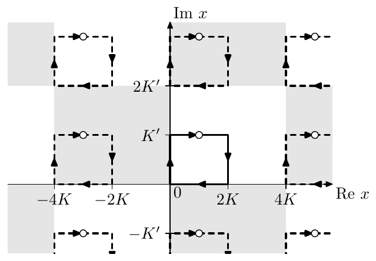

*Figure 9.47: The principal preimage (solid line) of the real axis,
with respect to $y = \operatorname{cd} x$, and its periodic repetitions (dashed lines).*

$$
\begin{aligned}
x \in [2K, 2K+jK'] &\iff y \in [-1/k, 1] \\
x \in [jK', jK'+K) &\iff y \in [1/k, +\infty) \\
x \in (jK'+K, jK'+2K] &\iff y \in (-\infty, -1/k]
\end{aligned}
$$

where Fig. 9.42 can serve as additional reference.

The punctured point at $x = K+jK'$ in Fig. 9.47 corresponds to $y = \infty$.
In principle it can be included into the preimage if we consider the extended
complex plane $\mathbb{C} \cup \infty$ as the codomain of $\operatorname{cd} x$, in which case the preimage
consists only of four parts:

$$
\begin{aligned}
x \in [0, 2K] &\iff y \in [-1, 1] \\
x \in [0, jK'] &\iff y \in [1, 1/k] \\
x \in [2K, 2K+jK'] &\iff y \in [-1/k, 1] \\
x \in [jK', jK'+2K] &\iff y \in [1/k, -1/k]
\end{aligned}
$$

where $[1/k, -1/k] = [1/k, +\infty) \cup \infty \cup (-\infty, -1/k]$ denotes a range on the real
Riemann circle containing the infinity in its middle.

As with $\cos x$, the principal preimage alone doesn't cover all preimage points
of the real line. Neither does it if we add its periodic repetitions in Fig. 9.47,
since we are covering only half of the entire length of each of the lines $\operatorname{Re} x =
\pi n$. We can cover the remaining halves by rotating all preimages in Fig. 9.47
around the origin, which corresponds to multiplication of all points $x$ by $-1$.
Notice that by adding periodic repetitions we addressed the periodicity of $\operatorname{cd} x$,
while by adding the preimages multiplied by $-1$ we addressed the evenness
property of $\operatorname{cd} x$.

## 9.10 Normalized Jacobian elliptic functions

In Fig. 9.42 we can observe that the "four building blocks" of the Jacobian
cosine's values on the quarter-period grid lines are $\operatorname{cd}$, $k^{-1}\operatorname{dc}$, $\operatorname{nd}'$, $j\operatorname{sc}'$, $-\operatorname{nd}'$
and $-j\operatorname{sc}'$. Plotting these functions in the arctangent scale we obtain the picture
in Fig. 9.48.

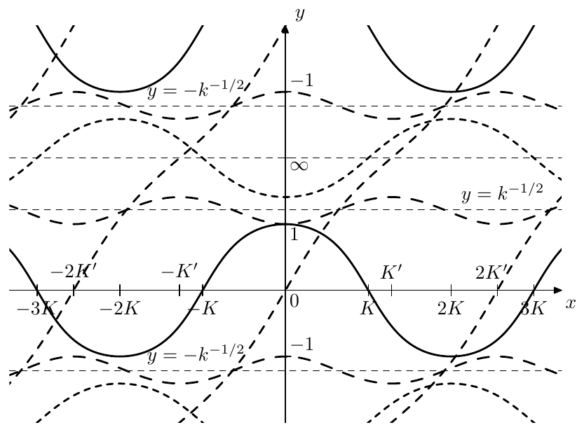

*Figure 9.48: $\operatorname{cd}(x,k)$, $\operatorname{nd}(x,k')$, $k^{-1}\operatorname{dc}(x,k)$ and $\operatorname{sc}(x,k')$.*

The collection of the function graphs in Fig. 9.48 has obvious symmetries
with respect to the horizontal lines $y = 0$ and $y = \infty$. It is also *approximately*
symmetric with respect to $y = \pm 1/\sqrt{k}$ (where, since $k < 1$, it follows that
$1/\sqrt{k} > 1$, so the line $y = 1/\sqrt{k}$ is located above $y = 1$). This approximate
symmetry obviously arises from the reciprocal symmetries due to (9.67):

$$
\operatorname{nd}(K'-x,k') = 1/k\operatorname{nd}(x,k') \tag{9.73a}
$$

$$
\operatorname{sc}(K'-x,k') = 1/k\operatorname{sc}(x,k') \tag{9.73b}
$$

$$
k^{-1}\operatorname{dc}(x,k) = 1/k\operatorname{cd}(x,k) \tag{9.73c}
$$

(where (9.73c) is not due to (9.67) but simply follows from the definition of the
$\operatorname{dc}$ function: $\operatorname{dc}(x,k) = 1/\operatorname{cd}(x,k)$).

Therefore the centers of this reciprocal symmetry are at $\pm 1/\sqrt{k}$. By multiplying
all functions plotted in Fig. 9.48 by $\sqrt{k}$ we will shift the centers of the
reciprocal symmetry to $y = \pm 1$. Thus consideration motivates the introduction
of *normalized Jacobian elliptic functions*

$$
\begin{aligned}
\overline{\operatorname{cd}}(x,k) &= \sqrt{k}\operatorname{cd}(x,k) \\
\overline{\operatorname{sn}}(x,k) &= \sqrt{k}\operatorname{sn}(x,k) \\
\overline{\operatorname{dc}}(x,k) &= 1/\sqrt{k}\cdot\operatorname{dc}(x,k) = 1/\overline{\operatorname{cd}}(x,k) \\
\overline{\operatorname{ns}}(x,k) &= 1/\sqrt{k}\cdot\operatorname{ns}(x,k) = 1/\overline{\operatorname{sn}}(x,k) \\
\overline{\operatorname{sc}}(x,k) &= \sqrt{k'}\operatorname{sc}(x,k) \\
\overline{\operatorname{nd}}(x,k) &= \sqrt{k'}\operatorname{nd}(x,k)
\end{aligned}
$$

(note that for the "hyperbolic" functions we are using $\sqrt{k'}$ rather than $\sqrt{k}$
for the normalization!). Thereby (9.73) become:

$$
\overline{\operatorname{nd}}(K'-x,k') = 1/\overline{\operatorname{nd}}(x,k') \tag{9.74a}
$$

$$
\overline{\operatorname{sc}}(K'-x,k') = 1/\overline{\operatorname{sc}}(x,k') \tag{9.74b}
$$

$$
\overline{\operatorname{dc}}(x,k) = 1/\overline{\operatorname{cd}}(x,k) \tag{9.74c}
$$

and Fig. 9.48 turns into Fig. 9.49.

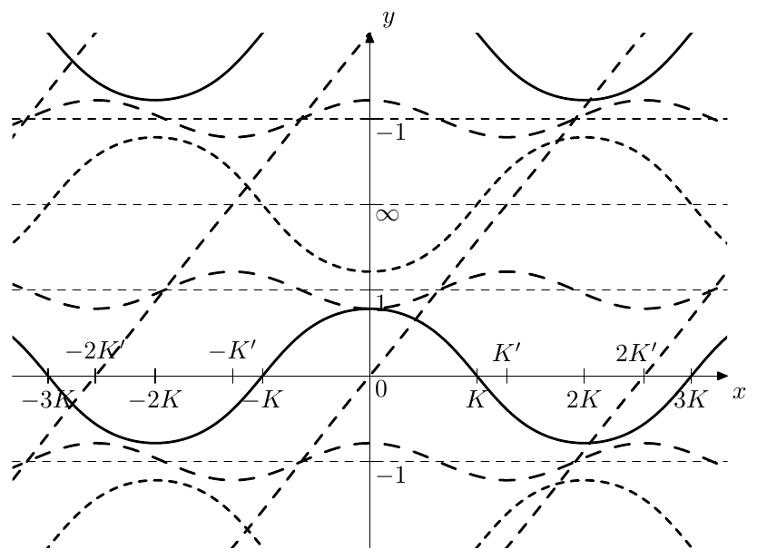

*Figure 9.49: $\overline{\operatorname{cd}}(x,k)$, $\overline{\operatorname{nd}}(x,k')$, $\overline{\operatorname{dc}}(x,k)$ and $\overline{\operatorname{sc}}(x,k')$.*

Apparently, $\overline{\operatorname{cd}}$, $\overline{\operatorname{dc}}$, $\overline{\operatorname{nd}}'$, $j\overline{\operatorname{sc}}'$, $-\overline{\operatorname{nd}}'$ and $-j\overline{\operatorname{sc}}'$ are the building blocks
of $\overline{\operatorname{cd}}\, x$ in the same way how $\operatorname{cd}$, $k^{-1}\operatorname{dc}$, $\operatorname{nd}'$, $j\operatorname{sc}'$, $-\operatorname{nd}'$ and $-j\operatorname{sc}'$ are the building
blocks of $\operatorname{cd} x$. Fig. 9.50 illustrates. Notice that we don't need non-unity scaling
by $k^{-1}$ anymore, only shifts, rotations and scaling by $\pm j$ are required to convert
between the respective functions. Fig. 9.51 provides a similar illustration for
$\overline{\operatorname{nd}}$. The diagrams Fig. 9.43 and 9.45 are transformed in a similar way.

For normalized elliptic functions the reciprocal symmetries of (9.67) take
the form

$$
\overline{\operatorname{sc}}\, x\,\overline{\operatorname{sc}}(K-x) = 1 \tag{9.75a}
$$

$$
\overline{\operatorname{nd}}\, x\,\overline{\operatorname{nd}}(K-x) = 1 \tag{9.75b}
$$

$$
\overline{\operatorname{sn}}\, x\,\overline{\operatorname{sn}}(jK'-x) = -1 \tag{9.75c}
$$

$$
\overline{\operatorname{cd}}\, x\,\overline{\operatorname{cd}}(jK'-x) = 1 \tag{9.75d}
$$

with the analogous shift properties (9.65) taking the form

$$
\overline{\operatorname{sc}}\, x\,\overline{\operatorname{sc}}(x\pm K) = -1 \tag{9.76a}
$$

$$
\overline{\operatorname{nd}}\, x\,\overline{\operatorname{nd}}(x\pm K) = 1 \tag{9.76b}
$$

$$
\overline{\operatorname{sn}}\, x\,\overline{\operatorname{sn}}(x\pm jK') = 1 \tag{9.76c}
$$

$$
\overline{\operatorname{cd}}\, x\,\overline{\operatorname{cd}}(x\pm jK') = 1 \tag{9.76d}
$$

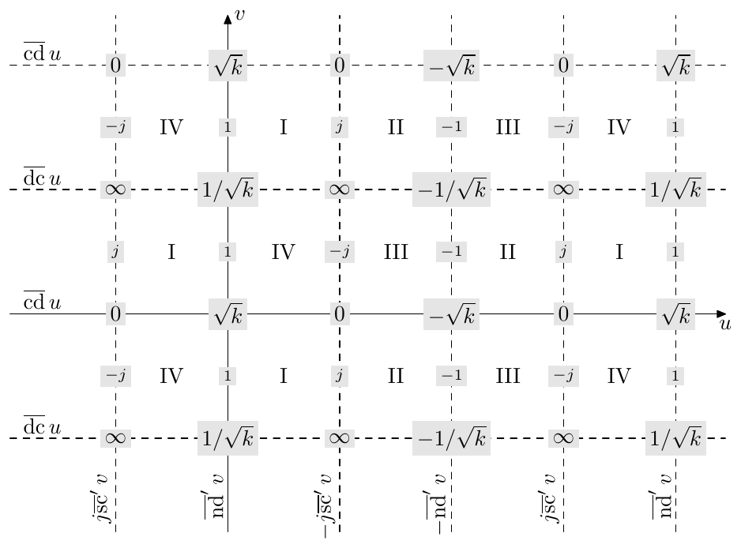

*Figure 9.50: Values of $\overline{\operatorname{cd}}\, x = \overline{\operatorname{cd}}(u+jv)$ on the quarter-period grid
(compare to Fig. 9.42).*

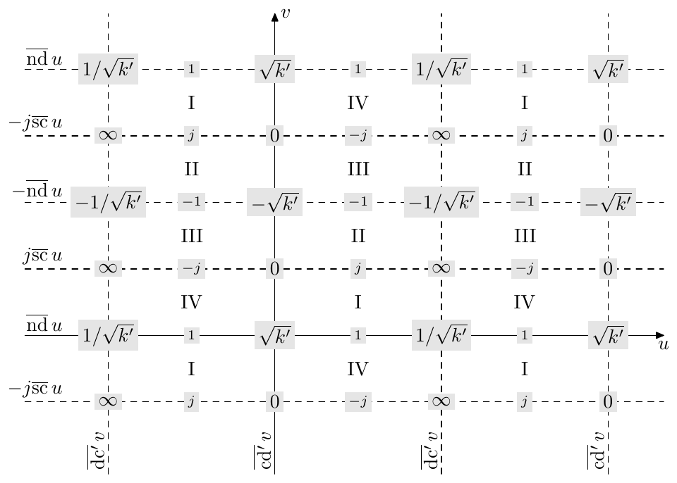

*Figure 9.51: Values of $\overline{\operatorname{nd}}\, x = \overline{\operatorname{nd}}(u+jv)$ on the quarter-period
grid (compare to Fig. 9.44).*

### Derivatives

In terms of normalized functions the logarithmic derivative formulas (9.72) take
the form

$$
\frac{\mathrm{d}}{\mathrm{d}x}\ln\overline{\operatorname{cd}}\, x = -k'\overline{\operatorname{sc}}\, x\,\overline{\operatorname{nd}}\, x \tag{9.77a}
$$

$$
\frac{\mathrm{d}^2}{\mathrm{d}x^2}\ln\overline{\operatorname{cd}}\, x = k\left(\overline{\operatorname{cd}}^2 x - \frac{1}{\overline{\operatorname{cd}}^2 x}\right) \tag{9.77b}
$$

By checking the complex quadrants of the values of $\operatorname{sc}$ and $\operatorname{nd}$ in Figs. 9.44
and 9.45, one could establish that the first logarithmic derivative is lying in the
lower complex semiplane on even imaginary periods and in the upper complex
semiplane on odd imaginary periods:

$$
\begin{aligned}
\operatorname{Im}\frac{\mathrm{d}}{\mathrm{d}x}\ln\overline{\operatorname{cd}}\, x &< 0 \qquad \text{for } \operatorname{Im} x \in (2n'K', (2n'+1)K') \\
\operatorname{Im}\frac{\mathrm{d}}{\mathrm{d}x}\ln\overline{\operatorname{cd}}\, x &> 0 \qquad \text{for } \operatorname{Im} x \in ((2n'+1)K', (2n'+2)K')
\end{aligned}
$$

or simply

$$
\operatorname{sgn}\operatorname{Im}\frac{\mathrm{d}}{\mathrm{d}x}\ln\overline{\operatorname{cd}}\, x = (-1)^{n'+1} \qquad \text{for } \operatorname{Im} x \in (2n'K', (2n'+1)K') \tag{9.78}
$$

where $n'$ is the imaginary quarter period index.

The second logarithmic derivative is apparently lying in the upper complex
semiplane if $\overline{\operatorname{cd}}\, x$ is in the I or III complex quadrant and in the lower complex
semiplane if $\overline{\operatorname{cd}}\, x$ is in the II or IV complex quadrant:

$$
\begin{aligned}
\operatorname{Im}\frac{\mathrm{d}}{\mathrm{d}x^2}\ln\overline{\operatorname{cd}}\, x &> 0 \qquad \text{if } \operatorname{cd} x \in \text{I or III} \\
\operatorname{Im}\frac{\mathrm{d}}{\mathrm{d}x^2}\ln\overline{\operatorname{cd}}\, x &< 0 \qquad \text{if } \operatorname{cd} x \in \text{II or IV}
\end{aligned}
$$

or, using Fig. 9.50,

$$
\operatorname{sgn}\operatorname{Im}\frac{\mathrm{d}}{\mathrm{d}x^2}\ln\overline{\operatorname{cd}}\, x = (-1)^{n+n'+1} \tag{9.79}
$$

where $n$ and $n'$ are respectively the real and imaginary quarter period indices.

### Horizontal and vertical preimage lines of $\overline{\operatorname{cd}}\, x$

The formulas (9.77) can be used to obtain more information about the behavior
of $\overline{\operatorname{cd}}\, x$ (and respectively $\operatorname{cd} x$) on its quarter periods. For $\cos x$ this kind of
information can be directly obtained from the complex argument formula (9.29a).
For $\operatorname{cd} x$ the same formula (9.71) is a bit more complicated and cannot be as
easily used for analysis.

Given $u = \operatorname{Re} x$, $v = \operatorname{Im} x$ we obtain:

$$
\begin{aligned}
\frac{\mathrm{d}}{\mathrm{d}u}\arg\overline{\operatorname{cd}}(u+jv) &= \frac{\mathrm{d}}{\mathrm{d}u}\operatorname{Im}\ln\overline{\operatorname{cd}}(u+jv) = \operatorname{Im}\frac{\mathrm{d}}{\mathrm{d}u}\ln\overline{\operatorname{cd}}(u+jv) = \\
&= \operatorname{Im}\frac{\mathrm{d}}{\mathrm{d}x}\ln\overline{\operatorname{cd}}\, x \tag{9.80a}
\end{aligned}
$$

$$
\begin{aligned}
\frac{\mathrm{d}}{\mathrm{d}v}\ln|\overline{\operatorname{cd}}(u+jv)| &= \frac{\mathrm{d}}{\mathrm{d}v}\operatorname{Re}\ln\overline{\operatorname{cd}}(u+jv) = \operatorname{Re}\frac{\mathrm{d}}{\mathrm{d}v}\ln\overline{\operatorname{cd}}(u+jv) = \\
&= \operatorname{Re}\, j\frac{\mathrm{d}}{j\,\mathrm{d}v}\ln\overline{\operatorname{cd}}(u+jv) = \operatorname{Re}\, j\frac{\mathrm{d}}{\mathrm{d}x}\ln\overline{\operatorname{cd}}(u+jv) = \\
&= -\operatorname{Im}\frac{\mathrm{d}}{\mathrm{d}x}\ln\overline{\operatorname{cd}}\, x \tag{9.80b}
\end{aligned}
$$

$$
\begin{aligned}
\frac{\mathrm{d}^2}{\mathrm{d}u^2}\arg\overline{\operatorname{cd}}(u+jv) &= \frac{\mathrm{d}^2}{\mathrm{d}u^2}\operatorname{Im}\ln\overline{\operatorname{cd}}(u+jv) = \operatorname{Im}\frac{\mathrm{d}^2}{\mathrm{d}u^2}\ln\overline{\operatorname{cd}}(u+jv) = \\
&= \operatorname{Im}\frac{\mathrm{d}^2}{\mathrm{d}x^2}\ln\overline{\operatorname{cd}}\, x \tag{9.80c}
\end{aligned}
$$

$$
\begin{aligned}
\frac{\mathrm{d}^2}{\mathrm{d}v^2}\arg\overline{\operatorname{cd}}(u+jv) &= \frac{\mathrm{d}^2}{\mathrm{d}v^2}\operatorname{Im}\ln\overline{\operatorname{cd}}(u+jv) = \operatorname{Im}\frac{\mathrm{d}^2}{\mathrm{d}v^2}\ln\overline{\operatorname{cd}}(u+jv) = \\
&= -\operatorname{Im}\frac{\mathrm{d}^2}{\mathrm{d}x^2}\ln\overline{\operatorname{cd}}\, x \tag{9.80d}
\end{aligned}
$$

Suppose the point $x = u+jv$ is moving horizontally to the right within the $n'$-th
imaginary quarter period, that is $\dot u > 0$ and $v = \text{const} \in (2n'K', (2n'+1)K')$.
Then we have the following.

- By (9.80a) and (9.78)

$$
\operatorname{sgn}\frac{\mathrm{d}}{\mathrm{d}u}\arg\overline{\operatorname{cd}}(u+jv) = \operatorname{sgn}\operatorname{Im}\frac{\mathrm{d}}{\mathrm{d}x}\ln\overline{\operatorname{cd}}\, x = (-1)^{n'+1} \tag{9.81a}
$$

therefore the value of $\operatorname{cd} x$ is moving clockwise on even imaginary quarter
periods and counterclockwise on odd imaginary quarter periods. By (9.71)
and using the complex quadrants in Fig. 9.42 or 9.50 as a reference, we
additionally find that

$$
\arg\overline{\operatorname{cd}}(Kn+jv) = (-1)^{n'+1}\cdot\frac{\pi}{2}n \tag{9.81b}
$$

that is at integer multiples of $K$ ($u = Kn$) the value of $\operatorname{cd} x$ is crossing the
real and imaginary axes, starting with the real axis at $u = 0$. Fig. 9.52
illustrates. The family of curves generated by such horizontal preimage
lines in shown in Fig. 9.53.

- By (9.80c) and (9.79)

$$
\operatorname{sgn}\frac{\mathrm{d}}{\mathrm{d}u^2}\arg\overline{\operatorname{cd}}(u+jv) = \operatorname{sgn}\operatorname{Im}\frac{\mathrm{d}}{\mathrm{d}x^2}\ln\overline{\operatorname{cd}}\, x = (-1)^{n+n'+1} \tag{9.81c}
$$

Comparing (9.81c) to (9.81a) and (9.81b) we find that, given $\dot u = \text{const}$,
the trajectories in Fig. 9.53 are speeding up when going away from the
real axis and slowing down when going towards the real axis.

Now suppose the point $x = u+jv$ is moving in a vertical line towards the
top: $\dot v > 0$, $u = \text{const} \in (2nK, (2n+1)K)$.

- By (9.80b) and taking into account (9.78)

$$
\operatorname{sgn}\frac{\mathrm{d}}{\mathrm{d}v}|\overline{\operatorname{cd}}(u+jv)| = -\operatorname{sgn}\operatorname{Im}\frac{\mathrm{d}}{\mathrm{d}x}\ln\overline{\operatorname{cd}}\, x = (-1)^{n'} \tag{9.82a}
$$

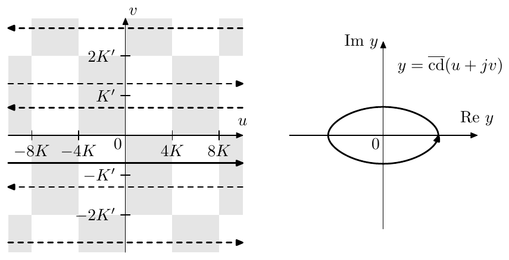

*Figure 9.52: A quasielliptic trajectory and its preimages. The
picture is qualitative. Particularly, the principal preimage line,
shown by the solid arrow line, is actually closer to the real axis (it
must be closer that $K'/2$).*

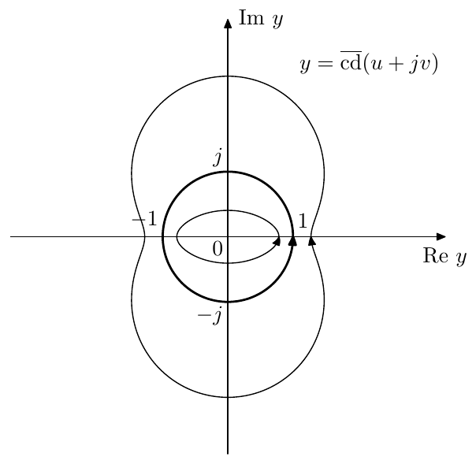

*Figure 9.53: A family of quasielliptic trajectories generated from
horizontal preimages $v = \text{const} \in [-K', 0]$. The unit circle trajectory occurs at $v = -K'/2$.*

where $n'$ is the imaginary quarter period index corresponding to the current
value of $v$. That is $|\overline{\operatorname{cd}}\, x|$ will be increasing on even imaginary quarter
periods and decreasing on odd imaginary quarter periods.

In fact, the movement trajectories will be as shown in Fig. 9.54, where the
movement around $y = 1$ will be occurring on even real quarter-periods
and the movement around $y = -1$ will be occurring on odd real quarter-
periods. At the even boundaries $u = 2nK$ the movement will be oscillating
along the real line between $(-1)^n\sqrt{k}$ and $(-1)^n/\sqrt{k}$. At the odd boundaries $u = (2n+1)K$ the movement will be occurring along the entire
imaginary axis looping through the $\infty$, going downwards all the time if
$n$ is even and going upwards all the time if $n$ is odd (referring to Fig.
9.50 is recommended for understanding these boundary cases). The trajectories
in Fig. 9.54 complete a full cycle over one imaginary period $2K'$ of
$\overline{\operatorname{cd}}\,x$.

- By (9.80d) and (9.79)

$$
\operatorname{sgn}\frac{d}{dv^2}\arg\overline{\operatorname{cd}}(u+jv) =
-\operatorname{sgn}\operatorname{Im}\frac{d}{dx^2}\ln\overline{\operatorname{cd}}\,x =
(-1)^{n+n'} \tag{9.82b}
$$

Equation (9.82b) means that the second derivative of
$\arg\overline{\operatorname{cd}}\,x$ doesn't change sign during vertical
motion within a single imaginary quarter period. This doesn't seem much, but
it will be a quite useful property.

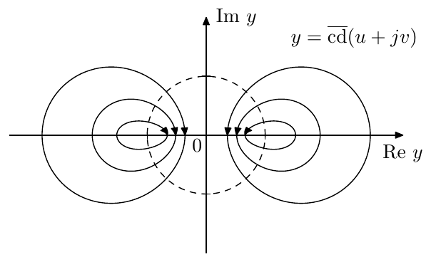

*Figure 9.54: A family of trajectories generated from vertical preimages
$u = \text{const}$. Notice that the trajectories intersect the unit circle
(shown by the dashed line) at right angles.*

Since $|\overline{\operatorname{cd}}\,x|$ monotonic in the vertical direction
on a single quarter period and $\arg\overline{\operatorname{cd}}\,x$ is
monotonic in the horizontal direction, it follows that within a single
quarter-period grid cell the function $\overline{\operatorname{cd}}\,x$ is
taking each value no more than once. Respectively, the quasielliptic curves
in Fig. 9.53 are all distinct (that is they don't intersect or overlap)
within a single imaginary quarter-period of the domain of
$\overline{\operatorname{cd}}\,x$. Conversely, each imaginary quarter period
of the domain of $\overline{\operatorname{cd}}\,x$ contains exactly one
preimage of any given such curve, as shown in Fig. 9.52.

In a similar way one can argue the distinctness of the curves in Fig. 9.54.

### Unit circle symmetries

In Figs. 9.53 and 9.54 we have specifically highlighted the unit circle,
which is related some of the properties of $\overline{\operatorname{cd}}\,x$.
It turns out that $\overline{\operatorname{cd}}\,x$ has some symmetries in
respect to the unit circle and its preimage.

Let's take two points $jK'/2 + x$ and $jK'/2 + x^*$, which are located
symmetrically to the line $\operatorname{Im} x = jK'/2$ on the complex plane,
and consider the product

$$
\begin{aligned}
\overline{\operatorname{cd}}(jK'/2+x)\left(\overline{\operatorname{cd}}(jK'/2+x^*)\right)^*
&= \overline{\operatorname{cd}}(jK'/2+x)\left(\overline{\operatorname{cd}}(x-jK'/2)^*\right)^* = \\
&= \overline{\operatorname{cd}}(x+jK'/2)\,\overline{\operatorname{cd}}(x-jK'/2) = \\
&= \overline{\operatorname{cd}}(x+jK'/2)\,\overline{\operatorname{cd}}\bigl((x+jK'2)-jK'\bigr) = 1
\end{aligned}
$$

where the latest is by (9.76d). That is the corresponding values of the
Jacobian elliptic cosine are conjugate-reciprocal:

$$
\overline{\operatorname{cd}}(jK'/2+x)\left(\overline{\operatorname{cd}}(jK'/2+x^*)\right)^* = 1 \tag{9.83}
$$

and the line $\operatorname{Im} x = jK'/2$ is the axis of the
conjugate-reciprocal symmetry of $\overline{\operatorname{cd}}\,x$. From the
evenness property of the elliptic cosine (and the fact that $x$ in (9.83) is
arbitrary) it follows that

$$
\overline{\operatorname{cd}}(-jK'/2+x)\left(\overline{\operatorname{cd}}(-jK'/2+x^*)\right)^* = 1
$$

that is the line $\operatorname{Im} x = -jK'/2$ is also the axis of the
conjugate-reciprocal symmetry of $\overline{\operatorname{cd}}\,x$. Since
$\overline{\operatorname{cd}}\,x$ is $2K'$-periodic along the imaginary axis,
any other lines of the form $\operatorname{Im} x = jK'/2 + K'n'$ are also the
axes of the conjugate-reciprocal symmetry of $\overline{\operatorname{cd}}\,x$:

$$
\overline{\operatorname{cd}}(jK'/2+jK'n'+x)\left(\overline{\operatorname{cd}}(jK'/2+jK'n'+x^*)\right)^* = 1 \tag{9.84}
$$

Taking the absolute value of both sides of (9.84) we obtain

$$
\bigl|\overline{\operatorname{cd}}(jK'/2+jK'n'+x)\bigr| \cdot
\bigl|\overline{\operatorname{cd}}(jK'/2+jK'n'+x^*)\bigr| = 1
$$

Further, assuming a purely real $x$ (so that $x = x^*$) the above turns into

$$
\bigl|\overline{\operatorname{cd}}(jK'/2+jK'n'+x)\bigr|^2 = 1
$$

or simply

$$
\bigl|\overline{\operatorname{cd}}(jK'/2+jK'n'+x)\bigr| = 1 \tag{9.85}
$$

that is the absolute magnitude of $\overline{\operatorname{cd}}\,x$ is unity on
the line $\operatorname{Im} x = jK'/2+jK'n'$, exactly corresponding to the
unit circle trajectory in Fig. 9.53. As another illustration, in Fig. 9.50
one could notice that $\overline{\operatorname{cd}}\,x$ is taking the values
$\pm 1$ and $\pm j$ at the intesections of vertical grid lines with the line
$\operatorname{Im} x = jK'/2+jK'n'$. Since we showed that the quasielliptic
trajectories in Fig. 9.53 are all distinct, there are no other points within
the imaginary quarter period where $|\overline{\operatorname{cd}}\,x| = 1$,
and respectively the lines $\operatorname{Im} x = jK'/2+jK'n'$ are the only
preimages of the unit circle.

Taking the complex argument of both parts of (9.84) we have

$$
\arg\overline{\operatorname{cd}}(jK'/2+jK'n'+x) -
\arg\overline{\operatorname{cd}}(jK'/2+jK'n'+x^*) = 0
$$

or

$$
\arg\overline{\operatorname{cd}}(jK'/2+jK'n'+x) =
\arg\overline{\operatorname{cd}}(jK'/2+jK'n'+x^*) \tag{9.86}
$$

That is the complex arguments of $\overline{\operatorname{cd}}\,x$ taken at
the points symmetric relatively to the line
$\operatorname{Im} x = jK'/2+jK'n'$ are equal.

Fig. 9.55 provides an illustration for the range $0 \le \operatorname{Im} x \le K'$.
Apparently on the ends of that range the elliptic cosine has purely real
values (which can be seen from the properties of $\operatorname{cd} x$ and
from Fig. 9.50), corresponding to the complex argument being equal to 0 or
$\pi$. Inside that range the value is becoming complex, where it is
"maximally complex" (in the sense of $\arg\operatorname{cd} x$ having the
maximal deviation from 0 or $\pi$) exactly in the middle, that is at
$\operatorname{Im} x = K'/2$. This corresponds to the trajectories in Fig.
9.54 crossing the unit circle at right angles, so that the tangent lines of
the trajectories taken at the intersection points are going through the
origin, and therefore the angular deviation from the real line is attaining a
maximum at these intersection points.

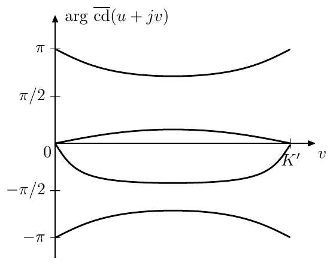

*Figure 9.55: Deviation of Jacobian cosine's value from the real axis as a
function of the imaginary part $v$ of its argument, plotted for various real
parts $u$ and various elliptic moduli $k$.*

In order to explain this maximum angular deviation at
$\operatorname{Im} x = K'/2$ consider the following. The symmetry of the
graphs in Fig. 9.55 is directly following from (9.86). Therefore there must
be an extremum at the point in the middle of the range
$\operatorname{Im} x \in [0,K']$. By (9.82b) this is the only extremum on
that range and therefore this is the point of the maximum deviation.

Since the functions $\overline{\operatorname{sn}}$,
$\overline{\operatorname{sc}}$ and $\overline{\operatorname{nd}}$ can be
obtained from $\overline{\operatorname{cd}}$ by shifts and/or rotations of
the complex plane (and a multiplication by $j$ or by $-j$ for
$\overline{\operatorname{sc}}$), they also exhibit similar symmetries. We
won't go into detail of these. The functions $\overline{\operatorname{dc}}$
and $\overline{\operatorname{ns}}$ being the reciprocals of
$\overline{\operatorname{cd}}$ and $\overline{\operatorname{sn}}$ are having
similar symmetries as well.

### Normalized argument

It will be also often convenient to use the following notation:

$$
\begin{aligned}
\operatorname{cd}_K x &= \operatorname{cd} Kx \\
\operatorname{sc}_{K'} x &= \operatorname{sc} K'x \\
\overline{\operatorname{cd}}_K x &= \overline{\operatorname{cd}} Kx \\
&\ \text{etc.}
\end{aligned}
$$

that is we write the quarter-period multiplier of the argument as a subscript
of the function's name. In this notation e.g. the real quarter-period of
$\operatorname{cd}_K x$ becomes equal to 1, therefore we will refer to this
notation as *normalized-argument* Jacobian elliptic functions.

Note that we can't normalize the argument simultaneously for real and
imaginary quarter periods, that is we need to choose between e.g.
$\operatorname{cd}_K x$ and $\operatorname{cd}_{K'} x$, depending on our
needs. Noticing that

$$
\operatorname{cd}(Ku+jK'v) = \operatorname{cd} K\left(u+j\frac{K'}{K}v\right) =
\operatorname{cd}_K\left(u+j\frac{K'}{K}v\right)
$$

$$
\operatorname{cd}(Ku+jK'v) = \operatorname{cd} K'\left(\frac{K}{K'}u+jv\right) =
\operatorname{cd}_{K'}\left(\frac{K}{K'}u+jv\right)
$$

we can see that the imaginary quarter period of $\operatorname{cd}_K x$ is
$K'/K$ and the real quarter period of $\operatorname{cd}_{K'} x$ is $K/K'$.
The same obviously holds for other Jacobian elliptic functions.

Notice that Figs. 9.35 through 9.38 are effectively plotting
$\operatorname{sn}_K$, $\operatorname{cd}_K$, $\operatorname{sc}_K$ and
$\operatorname{nd}_K$, since the argument scale is scaled by $K$.

In Figs. 9.35 through 9.38 one could notice that the values of
$\operatorname{sn}_K$, $\operatorname{cd}_K$, $\operatorname{sc}_K$ and
$\operatorname{nd}_K$ seem to be growing (in absolute magnitude) with $k$.
Let's see if this is always the case.

In the beginning we are going to establish the fact that the
argument-normalized amplitude $\varphi(x,k) = \operatorname{am}_K(x,k) =
\operatorname{am}(K(k)x,k)$ grows with $k$ on $x \in (0,1)$, that is

$$
\frac{\partial\varphi}{\partial k} =
\frac{\partial}{\partial k}\operatorname{am}_K(x,k) > 0
\qquad (0 < x < 1,\ 0 < k < 1) \tag{9.87}
$$

Before analysing the partial derivative of $\operatorname{am}_K(x,k)$ with
respect to $k$, we need to note the range in which
$\operatorname{am}_K(x,k)$ is varying for $x \in (0,1)$:

$$
\operatorname{am}_K(x,k) \in (0,\pi/2) \qquad \forall x \in (0,1)\ (0 \le k < 1) \tag{9.88}
$$

Indeed, by (9.55) $F(\varphi,k)$ is strictly increasing for $0 \le k < 1$,
therefore, since $F(0,k)=0$ and $F(\pi/2,k)=K(k)$, the range
$\varphi \in (0,\pi/2)$ is mapped to $F(\varphi,k) \in (0,K)$ and vice versa.
Therefore $\operatorname{am}(x,k)$ is monotonically changing from 0 to
$\pi/2$ for $x$ changing from 0 to $K$, and respectively
$\operatorname{am}_K(x,k)$ is monotonically changing from 0 to $\pi/2$ for
$x$ changing from 0 to 1.

Now, given $\varphi(x,k) = \operatorname{am}_K(x,k)$, by (9.57)

$$
F(\varphi,k) = K(k)x
$$

Since we are interested in the partial derivative of $\varphi$ with respect
to $k$, we will consider $x$ to be fixed and $\varphi$ and $k$ varying in the
above equation. Then, taking the logarithm, we have

$$
\ln F(\varphi,k) = \ln K(k)x
$$

or

$$
\ln F(\varphi,k) = \ln K(k) + \ln x
$$

Let's take a full derivative in respect to $k$ of both sides, where, since
$x = \text{const}$, the respective term fully disappears:

$$
\frac{d}{dk}\ln F(\varphi,k) = \frac{d}{dk}\ln K(k)
$$

$$
\frac{\partial\ln F}{\partial\varphi}\frac{d\varphi}{dk} +
\frac{\partial\ln F}{\partial k} = \frac{d\ln K}{dk}
$$

Since $x = \text{const}$, we have $\partial\varphi/\partial k = d\varphi/dk$
and thus

$$
\frac{\partial\ln F}{\partial\varphi}\frac{\partial\varphi}{\partial k} +
\frac{\partial\ln F}{\partial k} = \frac{d\ln K}{dk}
$$

Since by (9.55)

$$
\frac{\partial\ln F}{\partial\varphi} = \frac{1}{F}\frac{\partial F}{\partial\varphi}
= \frac{1}{F\sqrt{1-k^2\sin^2\varphi}} > 0
$$

it is suffcient to show that

$$
\frac{d\ln K}{dk} > \frac{\partial\ln F}{\partial k}
$$

and then $\partial\varphi/\partial k > 0$ will automatically follow.

The previous inequality can be equivalently rewritten as

$$
\frac{dK}{dk} > \frac{\partial F}{\partial k}
$$

or, noticing that $K(k) = F(\pi/2,k)$ and reintroducing the explicit argument
notation $F = F(\varphi,k)$,

$$
\frac{\partial}{\partial k}F(\pi/2,k) > \frac{\partial}{\partial k}F(\varphi,k)
$$

$$
\frac{\partial}{\partial k}\bigl(F(\pi/2,k) - F(\varphi,k)\bigr) > 0
$$

$$
\frac{\partial}{\partial k}\int_{\varphi}^{\pi/2}\frac{d\theta}{\sqrt{1-k^2\sin^2\theta}} > 0
$$

$$
\int_{\varphi}^{\pi/2}\left(\frac{d}{dk}\frac{1}{\sqrt{1-k^2\sin^2\theta}}\right)d\theta > 0
$$

$$
\int_{\varphi}^{\pi/2}\frac{k\sin^2\theta}{\left(1-k^2\sin^2\theta\right)^{3/2}}\,d\theta > 0 \tag{9.89}
$$

Obviously the integral in (9.89) is positive for any $0 < k < 1$ and
$0 < \varphi < \pi/2$ and therefore (9.87) holds. It follows that

$$
\operatorname{am}_K(x,k_1) < \operatorname{am}_K(x,k_2) \qquad
\forall x \in (0,1)\ (0 \le k_1 < k_2 < 1) \tag{9.90}
$$

Notice that we have allowed $k_1 = 0$ in (9.90). Strictly speaking, at $k=0$
the integral in (9.89) turns to zero, respectively $\partial\varphi/\partial k
= 0$. However it doesn't matter much: since $\partial\varphi/\partial k > 0$
starting with arbirarily small $k$, we have
$\operatorname{am}_K(x,k) > \operatorname{am}_K(x,0)\ \forall x \in (0,1)$ and
respectively (9.90) also holds for $k_1 = 0$.

Using (9.90), (9.88) and (9.58) we obtain

$$
\operatorname{sn}_K(x,k_1) < \operatorname{sn}_K(x,k_2) \qquad
\forall x \in (0,1)\ (0 \le k_1 < k_2 < 1)
$$

Using shift and symmetry properties of $\operatorname{sn}$ we can extend the
above to the entire real axis (with the exception of purely integer points
where $\operatorname{sn}_K x$ has the same values independently of $k$):

$$
|\operatorname{sn}_K(x,k_1)| < |\operatorname{sn}_K(x,k_2)| \qquad
\forall x \notin \mathbb{Z}\ (0 \le k_1 < k_2 < 1,\ x \in \mathbb{R})
$$

The same property for $\operatorname{cd}_K$ follows from the fact that
$\operatorname{cd}_K$ can be obtained from $\operatorname{sn}_K$ by a
quarter-period shift, and we have

$$
|\operatorname{cd}_K(x,k_1)| < |\operatorname{cd}_K(x,k_2)| \qquad
\forall x \notin \mathbb{Z}\ (0 \le k_1 < k_2 < 1,\ x \in \mathbb{R}) \tag{9.91}
$$

The same property for $\operatorname{sc}_K$ follows from (9.90), (9.88) and
(9.60). The same property for $\operatorname{nd}_K$ follows from (9.90),
(9.88) and (9.61).

Notably, the same property doesn't hold if the argument is not normalized by
the real period $K$. Indeed, it is easily noticed that $F(\varphi,k)$ grows
with both $\varphi$ and $k$, therefore, given $F(\varphi,k) = \text{const}$,
the value of $\varphi$ will be decreasing for growing $k$, which means that

$$
\frac{\partial}{\partial k}\operatorname{am}(x,k) < 0
$$

## 9.11 Landen transformations

Given an elliptic modulus $k$ and the associated quarter periods $K$ and $K'$
we could desire to find another elliptic modulus, such that the period
ratio[^13] $K'/K$ is increased or decreased by an integer factor (compared to
the original ratio $K'/K$). We will specifically focus on the transformation
which changes the period ratio by a factor of 2. It will be particularly (but
not only) useful as a means of evaluation of Jacobian elliptic functions and
their inverses.

Given an elliptic modulus $k_0$ and the corresponding period ratio
$K'_0/K_0$, let $k_1$ denote the elliptic modulus such that the corresponding
period ratio is halved: $K'_1/K_1 = K'_0/2K_0$. It turns out that $k_1$ can be
found by a simple formula: $k_1 = 2\sqrt{k_0}/(1+k_0)$. We define the
*ascending Landen transformation*:

$$
\mathcal{L}(k) = \frac{2\sqrt{k}}{1+k} \tag{9.92a}
$$

It is easily verified that $\mathcal{L}(k) > k\ \forall k \in (0,1)$, which
explains the name "ascending". Intuitively, an increase of the elliptic
module $k$ increases the real period $K$ and reduces the imaginary period
$K'$, therefore the ratio $K'/K$ is also reduced.

Inverting the ascending Landen transformation we obtain the *descending
Landen transformation*:

$$
\mathcal{L}^{-1}(k) = \frac{1-k'}{1+k'} = \left(\frac{k}{1+k'}\right)^2 \tag{9.92b}
$$

where $k' = \sqrt{1-k^2}$ is the corresponding complementary modulus.[^14] The
readers are encouraged to check that
$\mathcal{L}^{-1}(\mathcal{L}(k)) = \mathcal{L}(\mathcal{L}^{-1}(k)) = k$.
Obviously, the descending Landen transformation doubles the period ratio
$K'/K$.

It is easily found that the ascending and descending transformations are
dual with respect to swapping $k$ and $k'$ (or, which is the same, $K$ and
$K'$):

$$
\mathcal{L}'(k) = L^{-1}(k') \tag{9.93}
$$

where $\mathcal{L}'(k) = \sqrt{1-(\mathcal{L}(k))^2}$ denotes the elliptic
modulus complementary to $\mathcal{L}(k)$. Another property which follows
from (9.92) is

$$
(1+k)(1+\mathcal{L}'(k)) = 2 \tag{9.94a}
$$

which also can be equivalently written as

$$
(1+k')(1+\mathcal{L}^{-1}(k)) = 2 \tag{9.94b}
$$

### Landen sequences of elliptic moduli

Given some elliptic modulus $k_0$, Landen transformation establishes a
bilateral sequence of elliptic moduli:

$$
\ldots < k_{-2} < k_{-1} < k_0 < k_1 < k_2 < \ldots \tag{9.95a}
$$

where $k_{n+1} = \mathcal{L}(k_n)$. Due to (9.93) this also automatically
establishes a sequence of complementary moduli

$$
\ldots > k'_{-2} > k'_{-1} > k'_0 > k'_1 > k'_2 > \ldots \tag{9.95b}
$$

where $k'_{n+1} = \mathcal{L}^{-1}(k'_n)$. Note that by (9.94) we have

$$
(1+k_n)(1+k'_{n+1}) = 2 \tag{9.96a}
$$

$$
(1+k'_n)(1+k_{n-1}) = 2 \tag{9.96b}
$$

At small $k$ (9.92b) turns to

$$
\mathcal{L}^{-1}(k) \approx \frac{k^2}{4} \qquad (\text{for } k \approx 0) \tag{9.97}
$$

Thus, as $n$ grows, the moduli $k_{-n}$ quickly decrease to zero. Conversely,
$k_n$ quickly grows to 1. E.g. starting at $k = 0.999$ we have a sequence

$$
\begin{aligned}
k_0 &= 0.999 \\
k_{-1} &\approx 0.914 \\
k_{-2} &\approx 0.424 \\
k_{-3} &\approx 0.0494 \\
k_{-4} &\approx 6 \cdot 10^{-4} \\
k_{-5} &\approx 1 \cdot 10^{-7}
\end{aligned}
$$

At this point the "trigonometric" elliptic functions become practically
equal to their trigonometric counterparts (recall the property (9.62)),
while the real quarter period becomes practically equal to $\pi/2$. Thus we
almost exactly know the value of the real quarter period and we also can
evaluate the respective trigonometric functions instead of an elliptic ones.
Using the relationships that we are about to establish below, one can relate
the elliptic function values at $k \approx 0$ to the values at larger $k$,
which then provides a way to evaluate the elliptic functions for arbitrary
$k$. Obviously, the same applies to the "hyperbolic" elliptic functions at
$k \to 1$.

### Ascending recursion for quarter period $K$

Landen transformation changes the real quarter period as

$$
K(\mathcal{L}(k)) = (1+k)K(k) \tag{9.98}
$$

(where $K(k)$ is the complete elliptic integral of the first kind).

Considering the sequence (9.95), let $K_n = K(k_n)$, $K'_n = K(k'_n)$ denote
the real and imaginary quarter periods corresponding to moduli $k_n$. By
(9.98)

$$
K_{n+1} = (1+k_n)K_n \tag{9.99a}
$$

$$
K'_{n-1} = (1+k'_n)K'_n \tag{9.99b}
$$

One can verify that (9.99) are in agreement with the fact that the period
ratio is changed by a factor of 2:

$$
\frac{K'_{n+1}}{K_{n+1}} = \frac{K'_n}{(1+k'_{n+1}) \cdot (1+k_n)K_n} = \frac{K'_n}{2K_n}
$$

where we have used (9.99) and (9.96).

The formula (9.99a) can be used as a means to compute $K(k)$ (for
$0 < k < 1$). Notice that as $k_n$ is getting small, the factors $(1+k_n)$
are becoming very close to one. Therefore

$$
K_{-n} = \frac{K_0}{\prod_{\nu=1}^{n}(1+k_{-\nu})}
$$

by (9.56) should converge to $K_{-\infty} = K(0) = \pi/2$. In practical
computations, starting from some $n$ the factor $(1+k_{-n})$ will be
indistinguishable from one within the available computation precision, and
so (by (9.97)) will be the subsequent factors. At this point the
computations may be stopped and we can assume that $K_{-n} = \pi/2$ within
the computation precision. Respectively

$$
K_0 = K_{-n} \cdot \prod_{\nu=1}^{n}(1+k_{-\nu}) =
\frac{\pi}{2} \cdot \prod_{\nu=1}^{n}(1+k_{-\nu}) \tag{9.100}
$$

Thus we arrive at the following algorithm.

Given $k_0$ we wish to evaluate $K(k_0)$. Use descending Landen
transformation to build a sequence of decreasing moduli $k_0, k_{-1},
k_{-2}, \ldots$, until at some step $n$ the values $k_{-n}$ becomes
sufficiently small so that $1 + k_{-n} = 1$ within the available computation
precision. Then ascend back to $k_0$ using (9.99a), thereby computing
$K_{-n+1}, K_{-n+2}, \ldots, K_{-1}, K_0$.

Using (9.100) the same algorithm can be expressed iteratively rather than
recursively:

```
// compute K from k
K := pi/2;
for i:=1 to 5 do
    k' := sqrt(1-k^2);
    k := (k/(1+k'))^2; // descending Landen transformation
    K := K*(1+k);
endfor;
```

### Ascending recursion[^15] for $\operatorname{sn} x$ and $\operatorname{cd} x$

Let's introduce the notation $\operatorname{sn}_n x =
\operatorname{sn}_{K_n}(x,k_n) = \operatorname{sn}(K_n x,k_n)$,
$\overline{\operatorname{sn}}_n x = \overline{\operatorname{sn}}_{K_n}(x,k_n)
= \overline{\operatorname{sn}}(K_n x,k_n)$ etc. Note that thereby the
imaginary period of $\operatorname{sn}_{n+1}$ is halved compared to
$\operatorname{sn}_n$. Let's also introduce the notation for the arithmetic
average of $x$ and its reciprocal $1/x$:

$$
\mathcal{A}(x) = \frac{x + \frac{1}{x}}{2}
$$

Then

$$
\overline{\operatorname{sn}}_{n+1} x =
\frac{1}{\sqrt{k_{n+1}}\,\mathcal{A}(\overline{\operatorname{sn}}_n x)} \tag{9.101a}
$$

For the purposes of numeric evaluation it is usually more practical to
rewrite (9.101a) in the form:

$$
\operatorname{sn}_{n+1} x = \frac{(1+k_n)\operatorname{sn}_n x}
{1+k_n\operatorname{sn}_n^2 x} \tag{9.101b}
$$

which particularly avoids the division by zero if $\operatorname{sn}_n x = 0$.

Substituting $x + 1$ for $x$ in (9.101) and using the shift property (9.66)
we obtain

$$
\overline{\operatorname{cd}}_{n+1} x =
\frac{1}{\sqrt{k_{n+1}}\,\mathcal{A}\left(\overline{\operatorname{cd}}_n x\right)} \tag{9.102a}
$$

or the version for numeric evaluation:

$$
\operatorname{cd}_{n+1} x = \frac{(1+k_n)\operatorname{cd}_n x}
{1+k_n\operatorname{cd}_n^2 x} \tag{9.102b}
$$

The formulas (9.101), (9.102) can be used to compute the elliptic sine and
cosine for $k \in (0,1)$ by using a similar approach to how we used (9.99) to
evaluate $K(k)$. Let's start with the elliptic cosine. The idea is that by
(9.62)

$$
\lim_{n\to+\infty}\operatorname{cd}_{-n} x =
\lim_{n\to+\infty}\operatorname{cd}(K_{-n}x,k_{-n}) = \cos\frac{\pi}{2}x
$$

Now notice that in (9.102b) we have $\operatorname{cd}_{n+1} x =
\operatorname{cd}_n x$ within the available computation precision, provided

$$
1 + k_n = 1 \tag{9.103a}
$$

$$
1 + k_n\operatorname{cd}_n^2 x = 1 \tag{9.103b}
$$

within the same computation precision. Apparently, at this moment the
sequence $\operatorname{cd}_n x$ (where $n \to -\infty$) converges to
$\cos(\pi x/2)$.

The condition (9.103a) is the same that we had in the evaluation of $K(k)$.
However additionally we have the requirement (9.103b) which is redundant if
$x$ is real (since then $0 \le \operatorname{cd}_n^2 x \le 1$), but becomes
essential if $\operatorname{Im} x \neq 0$.

Since we don't know the value of $\operatorname{cd}_n x$ in advance, we
can't directly estimate at which $n$ (9.103b) begins to hold. Simply
assuming that (9.103a) will suffice is not the best idea, since
$\operatorname{cd}_n x$ can easily have values comparable to or exceeding
$1/\sqrt{k_n}$ in absolute magnitude. Suppose however that

$$
|\operatorname{Im} x| \le \frac{K'_n}{2K_n} \tag{9.104}
$$

that is the imaginary part of the argument of $\operatorname{cd}_n$ doesn't
exceed half of the imaginary quarter period.[^16] From our previous
discussion of the behavior of $\operatorname{cd}$ and
$\overline{\operatorname{cd}}$ we should remember that
$\overline{\operatorname{cd}}$ attains unit values in the middle of the
imaginary quarter period and that its absolute magnitude grows away from the
real axis (within the first imaginary quarter period). That is

$$
|\overline{\operatorname{cd}}\,x| \le 1 \qquad \text{for } |\operatorname{Im} x| \le K'/2
$$

Respectively

$$
|\operatorname{cd} x| \le \frac{1}{\sqrt{k}} \qquad \text{for } |\operatorname{Im} x| \le K'/2
$$

and

$$
|\operatorname{cd}_n x| \le \frac{1}{\sqrt{k_n}} \qquad
\text{for } |\operatorname{Im} x| \le \frac{K'_n}{2K_n} \tag{9.105}
$$

Thus we have established that under the condition (9.104) the values of
$\operatorname{cd}_n x$ do not exceed $1/\sqrt{k_n}$ in absolute magnitude.
Apparently this is by far not good enough for (9.103b) to hold, since we
only guarantee that $|k_n\operatorname{cd}_n^2 x| \le 1$, however the
situation will improve if we decrease $n$ by one or more steps.

First notice that if (9.104) holds at some $n_0$, then it will hold
$\forall n \le n_0$ and so will (9.105), therefore $|k_n\operatorname{cd}_n^2
x| \le 1$ and $|1+k_n\operatorname{cd}_n^2 x| \le 2$. Under further
assumption of (9.103a), from (9.102b) we have

$$
|\operatorname{cd}_n x| \le 2 \cdot |\operatorname{cd}_{n+1} x|
$$

However by (9.97) we have $k_n = k_{n+1}^2/4$ and therefore

$$
|k_n\operatorname{cd}_n^2 x| \le \frac{k_{n+1}^2}{4} \cdot 4 \cdot
|\operatorname{cd}_{n+1}^2 x| = k_{n+1} \cdot |k_{n+1}\operatorname{cd}_{n+1}^2 x|
$$

That is $k_n\operatorname{cd}_n^2 x$ will turn essentially to zero after just
decreasing $n$ by one step and respectively the sequence
$\operatorname{cd}_n x$ (for $n \to -\infty$) will immediately converge.

In principle, we could now allow $|\operatorname{Im} x|$ to be arbitrarily
large. As we decrease $n$ step by step, the imaginary period $K'_n/K_n$ of
the function $\operatorname{cd}_n$ is doubling each time, thus sooner or
later (9.104) will hold. However we don't want to do unnecessarily many
iterations, not only for performance reasons, but also because the precision
losses will accumulate. Therefore it might be more straightforward to simply
wrap the argument of $\operatorname{cd}$ using the imaginary periodicity
property.

Thus we arrive at the following algorithm. Suppose we want to evaluate
$\operatorname{cd}(x,k)$. If $|\operatorname{Im} x| > K'$, we should use the
periodicity property to get $x$ into the range $|\operatorname{Im} x| \le
K'$. Then introduce $u = x/K$ and $k_0 = k$, so that we
have $\operatorname{cd}(x,k) = \operatorname{cd}_0 u$. Then we use the descending
Landen transformation to decrease $k_{-n}$ to almost zero,[^17] where

$$
\operatorname{cd}_{-n} u = \operatorname{cd} K_{-n} u \approx \operatorname{cd} \frac{\pi}{2} u \approx \cos \frac{\pi}{2} u
$$

At this point we compute $\cos(\pi u/2)$ instead of $\operatorname{cd}_{-n} u$ and
ascend back using (9.102b). In pseudocode this could be expressed as:

```
// compute cd(x/K,k), assuming |Im x|<=K'
function cdK(u,k,steps=5)
    if steps=0 then return cos(pi/2*u) endif;
    k' := sqrt(1-k^2);
    k := (k/(1+k'))^2; // descending Landen transformation
    y := cdK(u,k,steps-1);
    return ((1+k)*y)/(1+k*y^2);
endfunction;
```

Notice that $u$ may be complex in the above, where we would need a cosine
routine supporting a complex argument, which, if missing, could be implemented
by (9.29a).

Evaluation of $\operatorname{sn} x$ is done in the same way, except that we have
to compute $\sin(\pi u/2)$ as the approximation of $\operatorname{sn}_{-n} u$.
The evaluation routines for sn and cd can be also reused for evaluation of sc
and nd using (9.63).

### Descending recursion for sn x and cd x

We could invert the formulas (9.101) and (9.102) to express $\operatorname{sn}_{n-1}$
and $\operatorname{cd}_{n-1}$ in terms of respectively $\operatorname{sn}_n$ or
$\operatorname{cd}_n$:

$$
\overline{\operatorname{sn}}_{n-1} x = \mathcal{A}^{-1}\left(\frac{1}{\sqrt{k_n}\,\overline{\operatorname{sn}}_n x}\right) \tag{9.106a}
$$

or its "numerical" version, avoiding the divisions by zero for $\operatorname{sn}_n x = 0$

$$
\operatorname{sn}_{n-1} x = \frac{1}{1+k_{n-1}} \cdot \frac{2\operatorname{sn}_n x}{1 \pm \sqrt{1-k_n^2\operatorname{sn}_n^2 x}} \tag{9.106b}
$$

and

$$
\overline{\operatorname{cd}}_{n-1} x = \mathcal{A}^{-1}\left(\frac{1}{\sqrt{k_n}\,\overline{\operatorname{cd}}_n x}\right) \tag{9.107a}
$$

$$
\operatorname{cd}_{n-1} x = \frac{1}{1+k_{n-1}} \cdot \frac{2\operatorname{cd}_n x}{1 \pm \sqrt{1-k_n^2\operatorname{cd}_n^2 x}} \tag{9.107b}
$$

The ambiguity in formulas (9.106) and (9.107)[^18] is apparently due to the
fact that the imaginary periods of $\overline{\operatorname{sn}}_{n-1}$ and
$\overline{\operatorname{cd}}_{n-1}$ are doubled compared to
$\overline{\operatorname{sn}}_n$ and $\overline{\operatorname{sn}}_n$, therefore
the formulas "do not know which of the two imaginary half-periods to choose".

The descending recursion can be used to evaluate the inverses of sn and cd.
Given an equation of the form $\operatorname{cd}(x,k) = y$ (where we want to
find $x = \operatorname{cd}^{-1}(y,k)$), we introduce $u = x/K$, $k_0 = k$ and
$y_0 = y$, so that $y_0 = \operatorname{cd}_0 u$. Then we use (9.107) to descend
to $k_{-n} \approx 0$, where we have

$$
y_{-n} = \operatorname{cd}_{-n} u \approx \cos \frac{\pi}{2} u
$$

with high precision and therefore we can simply find $u$ by
$u = (2/\pi)\cos^{-1} y_{-n}$, thereby obtaining
$\operatorname{cd}^{-1}(y,k) = x = K_0 u$.

Note that, even though (9.107) gives ambiguous results, any of those results
will give a correct answer in the sense that we will get one of the possible
solutions of $\operatorname{cd}(x,k) = y$ at the end of the recursion
procedure. However, in order to avoid getting too far away from the origin
(and in order to keep $u$ within the real numbers range if $x$ is a real
number not exceeding 1 in magnitude), it is recommended to choose the value
with the smaller absolute magnitude from the two values of $\mathcal{A}^{-1}$
in (9.107a), or, equivalently choose the "+" sign in the denominator of
(9.107b). In case of complex values "choosing the + sign" also means that the
complex square root operation should yield a value with a nonnegative real
part, that is we should use the principal value (9.30).

Computing the inverse of sn is done in the same way using (9.106) (where it is
preferable to choose the smaller-magnitude one from the two values of $A^{-1}$
in (9.106a) and to use the "+" sign in the denominator of (9.106b)), finally
computing $u$ by $u = (2/\pi)\sin^{-1} y_{-n}$, thereby obtaining
$\operatorname{sn}^{-1}(y,k) = x = K_0 u$. The respective pseudocode routine
could be e.g.:

```
// compute x=sn^-1(y,k)
Kbypi2:=1; // accumulate ratio K/(pi/2)
for i:=1 to 5 do
    k' := sqrt(1-k^2);
    k_1 := (k/(1+k'))^2; // descending Landen transformation
    y := 2/(1+k_1) * y/(1+sqrt(1-k^2*y^2));
    k := k_1; Kbypi2 := Kbypi2*(1+k);
endfor;
x := Kbypi2*arcsin(y);
```

The routine for $\operatorname{cd}^{-1}$ is identical, except that it should use
arccos instead of arcsin. Alternatively notice that $\operatorname{cd}^{-1}$
and $\operatorname{sn}^{-1}$ are related via shift and symmetry properties of
cd and sn,, e.g. $\operatorname{cd}^{-1} x = K - \operatorname{sn}^{-1} x$, so
that one function can be expressed in terms of the other. The functions
$\operatorname{sc}^{-1}$ and $\operatorname{nd}^{-1}$ can be expressed via
$\operatorname{sn}^{-1}$ and $\operatorname{cd}^{-1}$ using (9.63).

If the argument of $\operatorname{sn}^{-1}$ and $\operatorname{cd}^{-1}$ is
restricted to real values, all respective computations will be real.
Otherwise we need sqrt, arcsin and arccos functions to support complex
argument, where sqrt must return the principal value (with nonnegative real
part). These functions, if missing, can be implemented using (9.30) and
(9.32).

We mentioned that the ambiguity of (9.106) and (9.107) is due to the doubling
of the imaginary period of $\overline{\operatorname{sn}}$ and
$\overline{\operatorname{cd}}$ on each step. Instead of that, we could have
had the imaginary period fixed and the real period halved on each step,
resulting in the same change of the period ratio. E.g. for the elliptic
cosine, introducing $\operatorname{cd}_{n'} = \operatorname{cd}(K'_n x, k_n)$,
we have another relationship:

$$
\operatorname{cd}_{n-1'} x = \frac{(1+k'_n)\operatorname{cd}_{n'}^2 x - 1}{1 - (1-k'_n)\operatorname{cd}_{n'}^2 x} \tag{9.108}
$$

(where $\operatorname{cd}_{n-1'} x = \operatorname{cd}(K'_{n-1} x, k_{n-1})$).

Unfortunately, while (9.108) avoids the ambiguity of (9.106) and (9.107), it
is not useful for evaluation of the inverses of sn and cd, as there is
another ambiguity popping up. Due to periodicity and symmetries of $\cos x$
along the real axis, we won't know which of the possible values of the
inverse of $\cos x$ to take. When using (9.106) and (9.107) the real period of
$\overline{\operatorname{sn}}$ and $\overline{\operatorname{cd}}$ was always
exactly preserved by the transformation, therefore this ambiguity didn't
matter as any of the values of $\cos^{-1}$ and $\sin^{-1}$ would do. If
however the real period is not kept intact, the value returned by $\cos^{-1}$
might result in a wrong value after rescaling back to the original periods
$K_0$ and $K'_0$.

One further issue is related to the preservation of the imaginary period.
Particularly the range $y_{-n} \in [1, 1/k_{-n}]$ is mapped to the range
$y_{-n-1} \in [1, 1/k_{-n-1}]$, respectively for a real $y_{-n}$ above that
range (that is $y_{-n} > 1/k_{-n}$) we obtain a real $y_{-n-1} > 1/k_{-n-1}$.
Respectively $\cos^{-1}$ will return a purely imaginary result (while what we
expect from $\operatorname{cd}^{-1}$ is clearly not purely imaginary, as one
can see e.g. from Fig. 9.42) no matter how many times we apply the recursion
(9.108) before evaluating the inverse cosine.

### Ascending recursion for nd x

Using the imaginary argument property (9.63) of the elliptic cosine and the
Landen transformation's duality (9.93) we can convert the descending
recursion formula (9.108) for cd $x$ into an ascending recursion for
$\operatorname{nd} x$, which takes the form

$$
\operatorname{nd}_{n+1} x = \frac{(1+k_n)\operatorname{nd}_n^2 x - 1}{1 - (1-k_n)\operatorname{nd}_n^2 x} \tag{9.109}
$$

The main value of this recursion formula for us will be that we'll use it to
derive another transformation.

### Double Landen transformation

Consider two subsequent Landen transformation steps occurring from $k_{n-1}$
to $k_{n+1}$. Inverting (9.108) we obtain

$$
\operatorname{cd}_{n'}^2 x = \frac{\operatorname{cd}_{n-1'} x + 1}{(1+k'_n) + (1-k'_n)\operatorname{cd}_{n-1'} x} = \frac{1}{1+k'_n} \cdot \frac{\operatorname{cd}_{n-1'} x + 1}{1 + k_{n-1}\operatorname{cd}_{n-1'} x}
$$

Now we switch to the real period-based notation by substituting
$K'_n x \leftarrow K_n x$. This is also equivalent to
$K'_{n-1} x \leftarrow 2K_{n-1} x$ since $K'_{n-1}/K_{n-1} = 2K'_n/K_n$ and thus
$K'_{n-1}/K'_n = 2K_{n-1}/K_n$. Therefore the substitution replaces
$\operatorname{cd}_{n'} x$ with $\operatorname{cd}_n x$ and
$\operatorname{cd}_{n-1'} x$ with $\operatorname{cd}_{n-1} 2x$, resulting in

$$
\operatorname{cd}_n^2 x = \frac{\operatorname{cd}_{n-1} 2x + 1}{(1+k'_n) + (1-k'_n)\operatorname{cd}_{n-1} 2x} = \frac{1}{1+k'_n} \cdot \frac{\operatorname{cd}_{n-1} 2x + 1}{1 + k_{n-1}\operatorname{cd}_{n-1} 2x}
$$

Inverting (9.109) we obtain

$$
\operatorname{nd}_n^2 x = \frac{\operatorname{nd}_{n+1} x + 1}{(1+k_n) + (1-k_n)\operatorname{nd}_{n+1} x} = \frac{1}{1+k_n} \cdot \frac{\operatorname{nd}_{n+1} x + 1}{1 + k'_{n+1}\operatorname{nd}_{n+1} x}
$$

By (9.69)

$$
k_n^2\operatorname{cd}_{n'}^2 x + k_n'^2\operatorname{nd}_n^2 x =
$$

$$
= \frac{k_n^2}{1+k'_n}\cdot\frac{\operatorname{cd}_{n-1}2x+1}{1+k_{n-1}\operatorname{cd}_{n-1}2x} + \frac{k_n'^2}{1+k_n}\cdot\frac{\operatorname{nd}_{n+1}x+1}{1+k'_{n+1}\operatorname{nd}_{n+1}x} =
$$

$$
= (1+k'_n)k_{n-1}\cdot\frac{\operatorname{cd}_{n-1}2x+1}{1+k_{n-1}\operatorname{cd}_{n-1}2x} + (1+k_n)k'_{n+1}\cdot\frac{\operatorname{nd}_{n+1}x+1}{1+k'_{n+1}\operatorname{nd}_{n+1}x} =
$$

$$
= (1+k'_n)\left(1-\frac{1-k_{n-1}}{1+k_{n-1}\operatorname{cd}_{n-1}2x}\right) + (1+k_n)\left(1-\frac{1-k'_{n+1}}{1+k'_{n+1}\operatorname{nd}_{n+1}x}\right) =
$$

$$
= (1+k'_n)\left(1-\frac{2k'_n/(1+k'_n)}{1+k_{n-1}\operatorname{cd}_{n-1}2x}\right) + (1+k_n)\left(1-\frac{2k_n/(1+k_n)}{1+k'_{n+1}\operatorname{nd}_{n+1}x}\right) =
$$

$$
= (1+k'_n) - \frac{2k'_n}{1+k_{n-1}\operatorname{cd}_{n-1}2x} + (1+k_n) - \frac{2k_n}{1+k'_{n+1}\operatorname{nd}_{n+1}x} = 1
$$

Solving for $k'_{n+1}\operatorname{nd}_{n+1} x$:

$$
\frac{2k_n}{1+k'_{n+1}\operatorname{nd}_{n+1}x} = 1+k_n+k'_n - \frac{2k'_n}{1+k_{n-1}\operatorname{cd}_{n-1}2x} =
$$

$$
= \frac{(1+k_n+k'_n)(1+k_{n-1}\operatorname{cd}_{n-1}2x)-2k'_n}{1+k_{n-1}\operatorname{cd}_{n-1}2x}
$$

$$
1+k'_{n+1}\operatorname{nd}_{n+1}x = \frac{2k_n(1+k_{n-1}\operatorname{cd}_{n-1}2x)}{(1+k_n+k'_n)(1+k_{n-1}\operatorname{cd}_{n-1}2x)-2k'_n}
$$

$$
k'_{n+1}\operatorname{nd}_{n+1}x =
$$

$$
= \frac{2k_n(1+k_{n-1}\operatorname{cd}_{n-1}2x)+2k'_n-(1+k_n+k'_n)(1+k_{n-1}\operatorname{cd}_{n-1}2x)}{(1+k_n+k'_n)(1+k_{n-1}\operatorname{cd}_{n-1}2x)-2k'_n} =
$$

$$
= \frac{(k_n+k'_n-1)-(1+k_n+k'_n)k_{n-1}\operatorname{cd}_{n-1}2x}{(1+k_n-k'_n)+(1+k_n+k'_n)k_{n-1}\operatorname{cd}_{n-1}2x}
$$

By (9.92) and (9.93)

$$
k_n = \frac{2\sqrt{k_{n-1}}}{1+k_{n-1}}
$$

$$
k'_n = \frac{1-k_{n-1}}{1+k_{n-1}}
$$

$$
k'_{n+1} = \frac{1-k_n}{1+k_n} = \frac{1+k_{n-1}-2\sqrt{k_{n-1}}}{1+k_{n-1}+2\sqrt{k_{n-1}}} = \left(\frac{1-\sqrt{k_{n-1}}}{1+\sqrt{k_{n-1}}}\right)^2 =
$$

$$
= \left(-\rho_{-1}\left(\sqrt{k_{n-1}}\right)\right)^2
$$

where we have noticed that the obtained expression can be conveniently
written in terms of the Riemann sphere rotation $\rho_{-1}$. Therefore

$$
\sqrt{k'_{n+1}} = -\rho_{-1}\left(\sqrt{k_{n-1}}\right) = \frac{1-\sqrt{k_{n-1}}}{1+\sqrt{k_{n-1}}} \tag{9.110}
$$

Continuing the transformation of $k'_{n+1}\operatorname{nd}_{n+1} x$ we obtain

$$
k'_{n+1}\operatorname{nd}_{n+1}x = \frac{(2\sqrt{k_{n-1}}-2k_{n-1})-(2-2\sqrt{k_{n-1}})k_{n-1}\operatorname{cd}_{n-1}2x}{(2k_{n-1}+2\sqrt{k_{n-1}})+(2+2\sqrt{k_{n-1}})k_{n-1}\operatorname{cd}_{n-1}2x} =
$$

$$
= \frac{1-\sqrt{k_{n-1}}}{1+\sqrt{k_{n-1}}}\cdot\frac{1-\sqrt{k_{n-1}}\operatorname{cd}_{n-1}2x}{1+\sqrt{k_{n-1}}\operatorname{cd}_{n-1}2x} = \sqrt{k'_{n+1}}\cdot\frac{1-\overline{\operatorname{cd}}_{n-1}2x}{1+\overline{\operatorname{cd}}_{n-1}2x}
$$

and thus

$$
\overline{\operatorname{nd}}_{n+1} x = \frac{1-\overline{\operatorname{cd}}_{n-1}2x}{1+\overline{\operatorname{cd}}_{n-1}2x} = -\rho_{-1}\left(\overline{\operatorname{cd}}_{n-1}2x\right)
$$

or

$$
\overline{\operatorname{nd}}_{n+1}\frac{x}{2} = \frac{1-\overline{\operatorname{cd}}_{n-1}x}{1+\overline{\operatorname{cd}}_{n-1}x} = -\rho_{-1}\left(\overline{\operatorname{cd}}_{n-1}x\right) \tag{9.111}
$$

where the respective elliptic modulus is found from (9.110).

Notice that the halving of the argument in (9.111) is matched by the fact
that the period ratio $K'/K$ is changed by a factor of 4, That is
$K'_{n-1}/K_{n-1} = 4K'_{n+1}/K_{n+1}$. At the same time the real and
imaginary periods of $\overline{\operatorname{cd}}_{n-1} x$ are 4 and
$2K'_{n-1}/K_{n-1}$, while the real and imaginary periods of
$\overline{\operatorname{nd}}_{n+1}(x/2)$ are 4 and
$8K'_{n+1}/K_{n+1} = 2K'_{n-1}/K_{n-1}$. Thus we have identically periodic
functions in the left- and right-hand sides of (9.111).

## 9.12 Elliptic rational functions

Landen transformation was changing the period ratio by a factor of 2, which
resulted in various elliptic functions after the transformation being
expressed as a rational function of the same elliptic function prior to the
transformation. There is a generalization of Landen transformation where the
period ratio is changed by an arbitrary positive integer factor $N$. Such
transformation is referred to as *N-th degree transformation* and the factor
$N$ is referred to as the *degree* of the transformation.

Suppose we are having an elliptic modulus $k$ with respective quarter periods
$K'$ and $K$. Let $\tilde k$ be another elliptic modulus with respective
quarter periods $\tilde K'$ and $\tilde K$, such that the quarter period ratio
is increased $N$ times:

$$
\frac{\tilde K'}{\tilde K} = N\frac{K'}{K} \tag{9.112}
$$

(the equation (9.112) is referred to as *degree equation*). Notice that since
the period ratio is increased, the modulus is decreased: $\tilde k < k$.

Apparently $k$ and $\tilde k$ are interdependent, where from (9.112) we obtain
that increasing $k$ decreases the ratios $K'/K$ and $\tilde K'/\tilde K$, and
thus increases $\tilde k$ as well. Thus $\tilde k = \tilde k(k)$ is an
increasing function, where at $N$ equal to a power of 2 we obtain a
$\log_2 N$ times repeated Landen transformation. The way to compute $\tilde k$
from a given $k$ (and back) for arbitrary $N$ will be discussed later.

In the transformation from $k$ to $\tilde k$ we wish to obtain the
relationship for cd, such that the imaginary period (in terms of normalized
argument) is fixed. It turns out that such relationship always has the form:

$$
\operatorname{cd}_{\tilde K'} u = R_N\bigl(\operatorname{cd}_{K'} u\bigr) \tag{9.113}
$$

where $\operatorname{cd}_{K'} u = \operatorname{cd}(K'u,k)$,
$\operatorname{cd}_{\tilde K'} u = \operatorname{cd}(\tilde K'u,\tilde k)$ and
$R_N(x)$ is some real rational function of order $N$. We already had a
particular case of this formula for $N = 2$ in (9.108) where

$$
R_2(x) = \frac{(1+k'_n)x^2-1}{1-(1-k'_n)x^2} \tag{9.114}
$$

The function $R_N(x)$ is referred to as *elliptic rational function of order
N*. Notice that $R_N(x)$ depends on the elliptic modulus $k$, even though we
don't explicitly notate it as function's parameter. Example graphs of
$R_N(x)$ are given in Fig. 9.56.

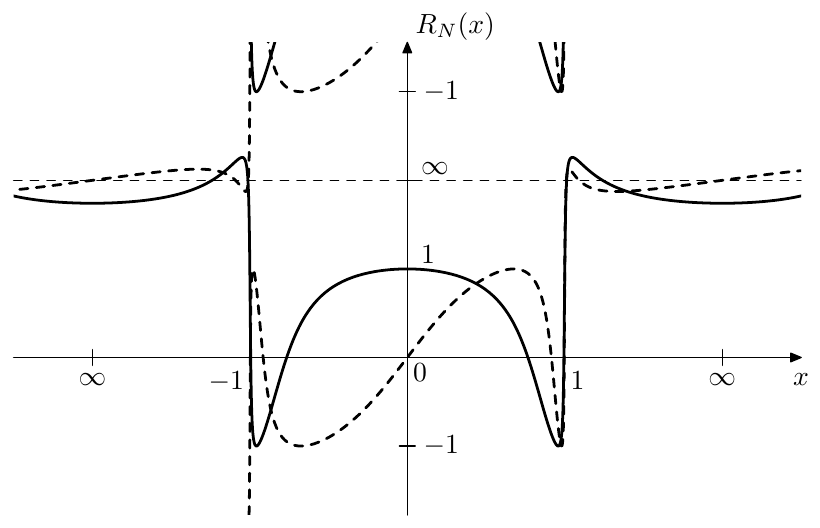

*Figure 9.56: Elliptic rational functions of even (solid) and odd (dashed)
orders for $k = 0.99$. The graphs do not cross the horizontal axis at
$x = 1$, rather $R_N(1) = 1\ \forall N$, however the resolution of the figure
is insufficient to see that. The poles of $R_N$ are occurring at the
intersections of the respective graph with the thin horizontal dashed line at
$\infty$.*

By using (9.112) we could rewrite (9.113) in terms of the real periods:

$$
\operatorname{cd}_{\tilde K} Nu = R_N\bigl(\operatorname{cd}_K u\bigr) \tag{9.115}
$$

where $\operatorname{cd}_K u = \operatorname{cd}(Ku,k)$,
$\operatorname{cd}_{\tilde K} u = \operatorname{cd}(\tilde K u,\tilde k)$. We
could also rewrite (9.113) and (9.115) in a form without argument
normalization, giving:

$$
\operatorname{cd}(N\tilde K u,\tilde k) = R_N\bigl(\operatorname{cd}(Ku,k)\bigr) \tag{9.116}
$$

Notice that any of the formulas (9.113), (9.115), (9.116) implies that

$$
R_{N\cdot M}(x) = R_N\bigl(R_M(x)\bigr) = R_M\bigl(R_N(x)\bigr) \tag{9.117}
$$

(with the properly chosen elliptic moduli for each of $R_{N\cdot M}$, $R_N$
and $R_M$), as we are effectively simply chaining an N-th and an M-th degree
transformation.

### $R_N(x)$ as representation of linear scaling

In an obvious way, equation (9.113) can be expressed in terms of the preimage
domain:

$$
x = \operatorname{cd}_{K'} u \tag{9.118a}
$$

$$
R_N(x) = \operatorname{cd}_{\tilde K'} u \tag{9.118b}
$$

Alternatively, (9.115) can be expressed as

$$
x = \operatorname{cd}_K u \tag{9.119a}
$$

$$
v = Nu \tag{9.119b}
$$

$$
R_N(x) = \operatorname{cd}_{\tilde K} v \tag{9.119c}
$$

Differently from $x^N$, $T_N(x)$ and $T_N^{-1}(x^{-1})$, this time there are
two different mappings from the preimage to the representation domain in each
case, corresponding to the two different moduli $k$ and $\tilde k$. The
linear scaling is explicitly present only in (9.119), however this is purely
due to the implicit scaling contained in the period-normalized notation. The
explicit notation form is the same for both (9.118) and (9.119) and contains
the linear scaling:

$$
x = \operatorname{cd}(u,k) \tag{9.120a}
$$

$$
v = N\frac{\tilde K}{K}u = \frac{\tilde K'}{K'}u \tag{9.120b}
$$

$$
R_N(x) = \operatorname{cd}(v,\tilde k) \tag{9.120c}
$$

The mappings are however still different, since $k \neq \tilde k$.

By (9.112) the scaling (9.120b) exactly matches the imaginary periods and
expands a single real period to exactly $N$ real periods. For that reason the
shifts of $u$ by an integer number of real and/or imaginary periods do not
affect the values of $x$ and $R_N(x)$. By the even symmetry of cd a change of
sign of $u$ doesn't affect the values of $x$ and $R_N(x)$ either. This however
exhausts the set of possible preimages of a given $x$, since, as we know,
$\operatorname{cd} x$ takes each value only once per quarter-period grid cell
(where the complex quadrants in Fig. 9.42 provide additional reference). Thus
we can pick any preimage of $x$ as the value of $u$ and therefore can rewrite
(9.118), (9.119) and (9.120) in their respective explicit forms:

$$
R_N(x) = \operatorname{cd}_{\tilde K'}\bigl(\operatorname{cd}_{K'}^{-1} x\bigr) \tag{9.121a}
$$

$$
R_N(x) = \operatorname{cd}_{\tilde K}\bigl(N\operatorname{cd}_K^{-1} x\bigr) \tag{9.121b}
$$

$$
R_N(x) = \operatorname{cd}\!\left(N\frac{\tilde K}{K}\operatorname{cd}^{-1}(x,k),\ \tilde k\right) \tag{9.121c}
$$

where $\operatorname{cd}^{-1}$ denote the inverse functions of the respective
cd functions. Equation (9.121c) is the commonly known explicit expression for
elliptic rational functions.

As with $T_N(x)$ and $L_N(x)$, an important class of preimages will be the
horizontal lines in the complex planes $u$ and $v$. From our discussion of cd
and $\overline{\operatorname{cd}}$ we should recall that these lines produce
distinct quasielliptic curves as their respective images, the full cycle of
these curves corresponding to a single real period of $u$ or $v$ respectively
(Figs. 9.52 and 9.53 serve as reference). Therefore $x$ moving in such
quasielliptic curve will be mapped to $R_N(x)$ moving in a similar curve, each
cycle of $x$ producing $N$ cycles of $R_N(x)$.

Recall that with cosine-based preimages we were preferring the preimages in
the lower complex semiplane, so that preimage movement towards the right was
corresponding to counterclockwise rotation in the representation domain.
Similarly, we are going to choose the elliptic cosine-based preimages within
the imaginary quarter period strip located immediately below the real axis,
as shown in Fig. 9.52, therefore preimage movement towards the right will
correspond to counterclockwise rotation in the representation domain.

Given a preimage $u$ located in the imaginary quarter period immediately
below the real axis, the preimage $v$ will also be located in the imaginary
quarter period immediately below the real axis, since the imaginary quarter
periods of $u$ are mapped exactly onto the respective imaginary quarter
periods of $v$. Also, apparently, $u$ and $v$ either both move simultaneously
to the right or both to the left. Thus $x$ and $R_N(x)$ move either both
counterclockwise or both clockwise.[^19]

### Bands of $R_N(x)$

The four different parts of the principal preimage of the real line in Fig.
9.47 will correspond to the bands of elliptic filters which we are going to
construct later. It is convenient to introduce the respective terminology at
this point already.

In terms of (9.120) the principal preimage of the real axis $x \in \mathbb{R}$
is

$$
\begin{aligned}
u \in [0, 2K] &\iff x \in [-1,1] & \text{(a)} \\
u \in [0, jK'] &\iff x \in [1,1/k] & \text{(b)} \\
u \in [jK', jK'+2K] &\iff x \in [1/k,-1/k] & \text{(c)} \\
u \in [2K, 2K+jK'] &\iff x \in [-1/k,1] & \text{(d)}
\end{aligned}
$$

Respectively the principal preimage of the real axis $R_N(x) \in \mathbb{R}$
is:

$$
\begin{aligned}
v \in [0, 2\tilde K] &\iff R_N(x) \in [-1,1] & (\tilde{\text{a}}) \\
v \in [0, j\tilde K'] &\iff R_N(x) \in [1,1/\tilde k] & (\tilde{\text{b}}) \\
v \in [j\tilde K', j\tilde K'+2\tilde K] &\iff R_N(x) \in [1/\tilde k,-1/\tilde k] & (\tilde{\text{c}}) \\
v \in [2\tilde K, 2\tilde K+j\tilde K'] &\iff R_N(x) \in [-1/\tilde k,1] & (\tilde{\text{d}})
\end{aligned}
$$

The linear scaling (9.120b) maps (b) to $(\tilde{\text{b}})$ one-to-one
(imaginary period is preserved). The mapping from (a) to $(\tilde{\text{a}})$
and from (c) to $(\tilde{\text{c}})$ is one-to-N (real period is multiplied
by $N$). This is responsible for the appearance of the equiripples for
$x \in [-1,1]$ and $x \in [1/k,-1/k]$ in Fig. 9.56. The mapping from (c)
results either in some (non necessarily principal) preimage $(\tilde{\text{d}})$
if $N$ is odd or in a non-principal preimage $(\tilde{\text{b}})$ if $N$ is
even.

Naming these four bands of $R_N(x)$ after the respective bands of the
elliptic filters, we have:

| | | |
|---|---|---|
| Passband | $x \in [-1,1]$ | $\lvert R_N(x)\rvert \le 1$ |
| Two transition bands | $x \in [-1/k,-1]\cup[1,1/k]$ | $1 \le \lvert R_N(x)\rvert \le 1/\tilde k$ |
| Stopband | $x \in [1/k,-1/k]$ | $\lvert R_N(x)\rvert \ge 1/\tilde k$ |

The readers are advised to compare the above results to Fig. 9.56, identifying
the equiripples of amplitudes $1$ and $1/\tilde k$ in the pass- and
stop-bands respectively. Since $k$ is very close to 1, the transition bands
are very narrow and aren't visible in Fig. 9.56, however at smaller $k$ the
stopband equiripples would become too small to be visible in the same
figure.

The value $1/k$ is determining the width of the transition band(s) and is
therefore referred to as the *selectivity factor*. The value $1/\tilde k$
determines the ratio of the equiripple amplitudes in the pass- and
stop-bands and is referred to as the *discrimination factor*. Since $k$ and
$\tilde k$ increase or decrease simultaneously, so do $1/k$ and $1/\tilde k$.
Therefore decreasing the transition band width (which is the same as
decreasing the selectivity factor $1/k$) decreases the discrimination factor
of $1/\tilde k$, thereby making the stop-band equiripples larger. Thus there
is a tradeoff between the transition band width (which we, generally
speaking, want to be small) and the discrimination factor (which we,
generally speaking, want to be large). Fig. 9.57 illustrates.

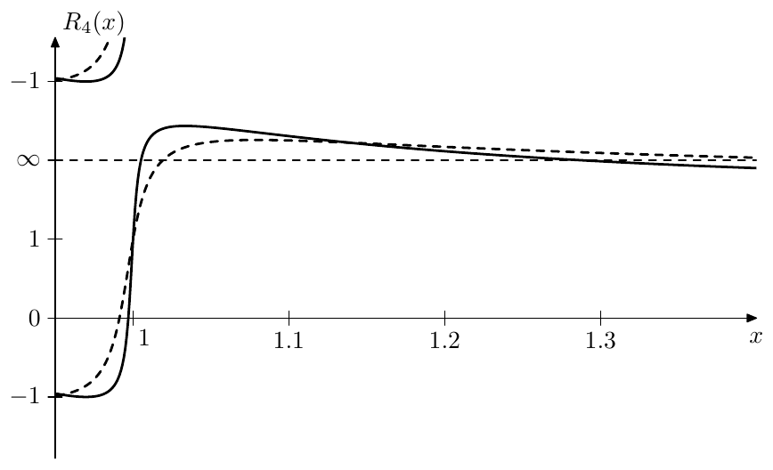

*Figure 9.57: Transition region of $R_4(x)$ for $k = 0.998$ (solid) and
$k = 0.99$ (dashed). The horizontal axis is linear, the vertical axis is
using the arctangent scale.*

### Even/odd property

Since $\operatorname{cd}(u\pm2K) = -\operatorname{cd} u$, a negation of $x$
corresponds to a shift of its preimage $u$ by $2K$. Respectively $v$ is
shifted by $2N\tilde K$, which will result in a negation of $R_N(x)$ if $N$ is
odd and will not change $R_N(x)$ is $N$ is even. Therefore $R_N(x)$ is
even/odd if $N$ is even/odd:

$$
R_N(-x) = (-1)^N R_N(x) \tag{9.122}
$$

### Values at special points

The principal preimage of $x = 1$ is $u = 0$. Therefore $v = 0$ and
$R_N(x) = 1$. Therefore

$$
R_N(1) = 1
$$

By (9.122)

$$
R_N(-1) = (-1)^N
$$

The principal preimage of $x = 1/k$ is $u = jK'$. By (9.112) $v = j\tilde K'$
and $R_N(x) = 1/\tilde k$. Therefore

$$
R_N(1/k) = 1/\tilde k
$$

By (9.122)

$$
R_N(-1/k) = (-1)^N/\tilde k
$$

Since equiripples begin exactly at the boundaries of the respective bands of
$R_N(x)$, the values at $x = \pm1$ and $x = \pm1/k$ also give the amplitudes
of the equiripples of $R_N(x)$, which are thereby 1 in the passband and
$1/\tilde k$ in the stopband.

The principal preimage of $x = 0$ is $u = K$. By (9.112) $v = N\tilde K$ and

$$
R_N(0) = \begin{cases} 0 & \text{if } N \text{ is odd} \\ (-1)^{N/2} & \text{if } N \text{ is even} \end{cases}
$$

The principal preimage of $x = \infty$ is $u = K+jK'$. By (9.112)
$v = N\tilde K+jK'$. With the help of (9.65) we reuse the result for
$R_N(0)$, obtaining

$$
R_N(\infty) = \begin{cases} \infty & \text{if } N \text{ is odd} \\ (-1)^{N/2}/\tilde k & \text{if } N \text{ is even} \end{cases}
$$

Two other interesting points are logarithmic midpoints of the transition band
occurring at $x = \pm1/\sqrt k$. The princial preimage of $x = 1/\sqrt k$ is
the transition band's preimage midpoint $u = jK'/2$ and respectively
$v = j\tilde K'/2$. Thus

$$
R_N(1/\sqrt k) = 1/\sqrt{\tilde k}
$$

That is the logarithmic midpoint of the transition band $[1,1/k]$ is mapped
to the logarithmic midpoint of the respective value range $[1,1/\tilde k]$.
By (9.122)

$$
R_N(-1/\sqrt k) = (-1)^N/\sqrt{\tilde k}
$$

### Normalized elliptic rational functions

The graphs of $R_N(x)$ in Fig. 9.56 look somewhat asymmetric regarding the
boundaries of the bands, which are at $\pm1$ and $\pm1/k$ and the amplitudes
of the ripples which are $1$ and $1/\tilde k$ respectively. This can be
addressed by switching to normalized elliptic cosine. The equations (9.113),
(9.115) and (9.116) thereby respectively turn into

$$
\overline{\operatorname{cd}}_{\tilde K'} u = \bar R_N\bigl(\overline{\operatorname{cd}}_{K'} u\bigr) \tag{9.123a}
$$

$$
\overline{\operatorname{cd}}_{\tilde K} Nu = \bar R_N\bigl(\overline{\operatorname{cd}}_K u\bigr) \tag{9.123b}
$$

$$
\overline{\operatorname{cd}}(N\tilde K u, \tilde k) = \bar R_N\bigl(\overline{\operatorname{cd}}(Ku,k)\bigr) \tag{9.123c}
$$

while (9.120) turn into

$$
x = \overline{\operatorname{cd}}(u,k) \tag{9.124a}
$$

$$
v = N\frac{\tilde K}{K}u = \frac{\tilde K'}{K'}u \tag{9.124b}
$$

$$
\bar R_N(x) = \overline{\operatorname{cd}}(v,\tilde k) \tag{9.124c}
$$

and (9.121) turn into

$$
\bar R_N(x) = \overline{\operatorname{cd}}_{\tilde K'}\Bigl(\overline{\operatorname{cd}}_{K'}^{-1} x\Bigr) \tag{9.125a}
$$

$$
\bar R_N(x) = \overline{\operatorname{cd}}_{\tilde K}\Bigl(N\,\overline{\operatorname{cd}}_K^{-1} x\Bigr) \tag{9.125b}
$$

$$
\bar R_N(x) = \overline{\operatorname{cd}}\!\left(N\frac{\tilde K}{K}\,\overline{\operatorname{cd}}^{-1}(x,k),\ \tilde k\right) \tag{9.125c}
$$

where

$$
\bar R_N(x) = \sqrt{\tilde k}\,R_N\!\left(\frac{x}{\sqrt k}\right) \tag{9.126}
$$

is the *normalized* elliptic rational function. Note that $\bar R_N(x)$ is
essentially simply a notational shortcut for the right-hand side of (9.126),
however due to the more pure symmetries, it is often more convenient to work
in terms of $\bar R_N(x)$ than $R_N(x)$.

The bands of $\bar R_N(x)$ are therefore

$$
\begin{array}{lll}
\text{Passband:} & |x| \le \sqrt{k} & |R_N(x)| \le \sqrt{\tilde k} \\[4pt]
\text{Transition bands:} & \sqrt{k} \le |x| \le 1/\sqrt{k} & \sqrt{\tilde k} \le |R_N(x)| \le 1/\sqrt{\tilde k} \\[4pt]
\text{Stopband:} & |x| \ge 1/\sqrt{k} & |R_N(x)| \ge 1/\sqrt{\tilde k}
\end{array}
$$

while the special points of $\bar R_N(x)$ respectively are:

$$
\begin{aligned}
\bar R_N(\sqrt k) &= \sqrt{\tilde k} \\
\bar R_N(-\sqrt k) &= (-1)^N\sqrt{\tilde k} \\
\bar R_N(1/\sqrt k) &= 1/\sqrt{\tilde k} \\
\bar R_N(-1/\sqrt k) &= (-1)^N/\sqrt{\tilde k} \\
\bar R_N(0) &= \begin{cases} 0 & \text{if } N \text{ is odd} \\ (-1)^N\sqrt{\tilde k} & \text{if } N \text{ is even} \end{cases} \\
\bar R_N(\infty) &= \begin{cases} \infty & \text{if } N \text{ is odd} \\ (-1)^N/\sqrt{\tilde k} & \text{if } N \text{ is even} \end{cases} \\
\bar R_N(1) &= 1 \\
\bar R_N(-1) &= (-1)^N
\end{aligned}
$$

The graphs of $\bar R_N(x)$ are plotted in Fig. 9.58.

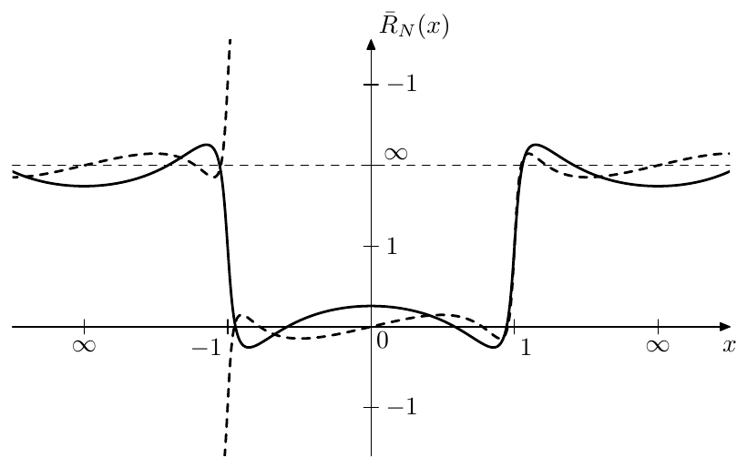

*Figure 9.58: Normalized elliptic rational functions of even (solid) and odd
(dashed) orders for $k=0.9$.*

The interpretation of $\bar R_N(x)$ as a linear scaling representation is
essentially the same as in (9.118), (9.119) and (9.120) respectively, except
that cd must be replaced with $\overline{\operatorname{cd}}$. E.g. (9.120)
becomes

$$
x = \overline{\operatorname{cd}}(u,k) \tag{9.127a}
$$

$$
v = N\frac{\tilde K}{K}u = \frac{\tilde K'}{K'}u \tag{9.127b}
$$

$$
\bar R_N(x) = \overline{\operatorname{cd}}(v,\tilde k) \tag{9.127c}
$$

Notice that the chain rule (9.117) works in the same form for normalized
elliptic rational functions:

$$
\bar R_{N\cdot M}(x) = \bar R_N\bigl(\bar R_M(x)\bigr) = \bar R_M\bigl(\bar R_N(x)\bigr) \tag{9.128}
$$

since the elliptic modulus $\tilde k$ for one stage is equal to the elliptic
modulus $k$ for the next stage, thus the coefficients $\sqrt k$ and
$1/\sqrt k$ cancel between each pair of stages.

### Symmetries of $\bar R_N(x)$

In Fig. 9.58 one can notice that the graphs of $\bar R_N(x)$ have certain
symmetries. One symmetry is relatively to the origin:

$$
\bar R_N(-x) = (-1)^N\bar R_N(x) \tag{9.129}
$$

(which is simultaneously the symmetry relative to $x=\infty$). Apparently
this is simply the even/odd property of $R_N(x)$ which is preserved in the
$\bar R_N(x)$ form.

The other symmetry is relatively to the point $\bar R_N(1)=1$:

$$
\bar R_N(1/x) = 1/\bar R_N(x) \tag{9.130}
$$

with a similar symmetry around the point at $x=-1$ which follows from the
first two symmetries. The proof of (9.130) follows from (9.75d). Given $x$
and its preimage $u$, the preimage of $1/x$ is $jK'-u$. Similarly, the
preimage of $1/\bar R_N(x)$ is $j\tilde K'-v$, however simultaneously

$$
j\tilde K' - v = \frac{\tilde K'}{K'}(jK'-u)
$$

therefore $j\tilde K'-v$ is also the preimage of $\bar R_N(1/x)$ and
$\bar R_N(1/x) = 1/\bar R_N(x)$.

In terms of $R_N(x)$ the symmetry (9.130) takes the form

$$
R_N(1/kx) = \dfrac{1}{\tilde k\,R_N(x)} \tag{9.131}
$$

Similarly to $R_N(x)$, the normalized elliptic rational function $\bar
R_N(x)$ maps the quasielliptic curves Fig. 9.53 to other quasielliptic
curves from the same family. By Fig. 9.53 and (9.85) the unit circle will be
mapped to the unit circle, since the preimage line $\operatorname{Im} u =
jK'/2 + jK'n'$ will be mapped to the preimage line $\operatorname{Im} v =
j\tilde K'/2 + j\tilde K'n'$. There won't be other preimages of the unit
circle, since all trajectories in Fig. 9.53 are distinct and occur for
different imaginary parts of the preimage. Thus

$$
|x| = 1 \iff |\bar R_N(x)| = 1 \tag{9.132}
$$

### Poles and zeros of $R_N(x)$

Letting $R_N(x)=0$ and using the representation form (9.119) we obtain

$$
v = 2n+1 = 2\left(\frac12+n\right)
$$

(where the second form is given for comparison with the respective
derivations of the zeros of $x^N$ and $T_N(x)$). Respectively

$$
u = \frac{2n+1}{N} = 2\frac{\frac12+n}{N}
$$

and

$$
x = \operatorname{cd}_K\frac{2n+1}{N} = \operatorname{cd}_K\!\left(2\frac{\frac12+n}{N}\right)
$$

which means that the zeros of $R_N(x)$ are

$$
z_n = \operatorname{cd}_K\frac{2n+1}{N} = \operatorname{cd}_K\!\left(2\frac{\frac12+n}{N}\right) \tag{9.133}
$$

where there are $N$ distinct values corresponding to $0<u<2$. Notice that
the zeros are all real and lie within $(-1,1)$. Also notice that $z_n =
-z_{N-1-n}$, therefore the zeros are positioned symmetrically around the
origin. Consequently, if $N$ is odd, one of $z_n$ will be at the origin.

By (9.131) the poles can be obtained from zeros as

$$
p_n = \frac{1}{kz_n}
$$

Note that if $N$ is odd, then so is $R_N(x)$ and one of the zeros will be at
$x=0$. In this case one of the poles will be at the infinity and there will
be only $N-1$ finite poles.

Given $z_n$ and taking into account that $p_n = 1/kz_n$, we can write
$R_N(x)$ in the form

$$
R_N(x) = g\cdot\dfrac{\prod(x-z_n)}{\prod\limits_{z_n\neq0}(x-1/z_n)}
$$

which we could also write as

$$
R_N(x) = g\cdot x^{N\wedge1}\cdot\prod_{z_n\neq0}\frac{x-z_n}{x-1/kz_n} = g\cdot x^{N\wedge1}\cdot\prod_{z_n>0}\frac{x^2-z_n^2}{x^2-1/k^2z_n^2}
$$

The value of the gain coefficient $g$ can be obtained from the fact that
$R_N(x)$ must satisfy $R_N(1)=1$. Alternatively we can satisfy $R_N(1)=1$ by
simply forcing each of the factors of $R_N(x)$ to be equal to unity at $x=1$
(where prior to the factor normalization we also have multiplied each of the
factors by $-k^2z_n^2$)

$$
R_N(x) = x^{N\wedge1}\cdot\prod_{z_n>0}\left(\frac{1-k^2z_n^2}{1-z_n^2}\cdot\frac{x^2-z_n^2}{1-k^2z_n^2x^2}\right) \tag{9.134}
$$

### Poles and zeros of $\bar R_N(x)$

By (9.126) the zeros of $\bar R_N(x)$ can be obtained from the zeros of
$R_N(x)$ as

$$
\bar z_n = \sqrt{k}z_n = \overline{\operatorname{cd}}_K\frac{2n+1}{N} = \overline{\operatorname{cd}}_K\!\left(2\frac{\frac12+n}{N}\right) \tag{9.135}
$$

Notice that thereby $\bar z_n \in (-\sqrt k,\sqrt k)$. By (9.130) the poles
are related to the zeros as

$$
\bar p_n\bar z_n = 1
$$

The factored form (9.134) respectively becomes

$$
\bar R_N(x) = x^{N\wedge1}\cdot\prod_{\bar z_n>0}\frac{x^2-\bar z_n^2}{1-\bar z_n^2x^2} \tag{9.136}
$$

where we don't have explicit normalization factors anymore, since the
factors under the product sign are already all equal to unity at $x=1$,
thereby giving $\bar R_N(1)=1$ as the transition band's midpoint (which is
exactly what it should be according to the previously discussed special
point values of $\bar R_N(x)$).

By obtaining equations (9.134) and (9.136) we have constructed $R_N(x)$ and
$\bar R_N$ in the explicit rational function form.

### Relationship between $k$ and $\tilde k$

Note that the explicit rational function forms (9.134) and (9.136) were
obtained without using the yet unknown to us $\tilde k$ (or $\tilde K$ or
$\tilde K'$). On the other hand, having constructed $R_N(x)$ and/or $\bar
R_N(x)$, we can obtain $\tilde k$ from the condition $R_N(1/k)=1/\tilde k$
or $\bar R_N(\sqrt k) = \sqrt{\tilde k}$.

We can also obtain an explicit expression for $\tilde k$ in terms of $k$.
Substituting (9.134) into $R_N(1/k)=1/\tilde k$ we obtain

$$
\begin{aligned}
1/\tilde k &= k^{-(N\wedge1)}\cdot\prod_{z_n>0}\left(\frac{1-k^2z_n^2}{1-z_n^2}\cdot\frac{1/k^2-z_n^2}{1-z_n^2}\right) = \\
&= k^{-N}\cdot\prod_{z_n>0}\left(\frac{1-k^2z_n^2}{1-z_n^2}\cdot\frac{1-k^2z_n^2}{1-z_n^2}\right) = k^{-N}\cdot\prod_{z_n>0}\left(\frac{1-k^2z_n^2}{1-z_n^2}\right)^2
\end{aligned}
$$

By (9.133) $z_n = \operatorname{cd}_K u_n$ where

$$
u_n = \frac{2n+1}{N}
$$

Therefore

$$
\frac{1-k^2z_n^2}{1-z_n^2} = \frac{1-k^2\operatorname{cd}_K^2u_n}{1-\operatorname{cd}_K^2u_n} = \frac{1}{\operatorname{sn}_K^2u_n}
$$

where the latter transformation is by (9.68). Noticing that

$$
z_n>0 \iff 0<u_n<1
$$

we obtain

$$
\tilde k = k^N\cdot\prod_{0<u_n<1}\operatorname{sn}_K^4u_n \tag{9.137}
$$

(where the number of factors under the product sign is equal to the integer
part of $N/2$) which formally gives an explicit expression for $\tilde k$.
However practically this expression is exactly the same as $\tilde k =
1/R_N(1/k)$ and thus we can simply find $\tilde k$ (and respectively $\tilde
K$) from the latter condition.

Finding $k$ from $\tilde k$ can be done by using the duality of the $N$-th
degree transformation in respect to $k$ and $k'$ (which is pretty much the
same as the respective duality of the Landen transformation). Let $\tilde k
= \mathcal N(k)$ denote the $N$-th degree transformation of $k$ defined by
(9.137) (or by explicit usage of $R_N(1/k)=1/\tilde k$ or $\bar R_N(\sqrt k)
= \sqrt{\tilde k}$). If the ratio $K'/K$ is decreased $N$ times by the
$N$-th degree transformation from $k$ to $\tilde k$, then the ratio $K/K'$
is increased $N$ times, which means we are performing an $N^{-1}$-th degree
transformation from $k'$ to $\tilde k'$, that is $\tilde k' =
\mathcal N^{-1}(k')$. Conversely, $\tilde k'$ and $k'$ are related via an
$N$-th degree transformation: $k' = \mathcal N(\tilde k')$, which by (9.137)
means

$$
k' = \tilde k'^{\,N}\cdot\prod_{0<u_n<1}\operatorname{sn}_{\tilde K'}^4u_n \tag{9.138}
$$

### Renormalized elliptic rational functions

Similarly to renormalized Chebyshev polynomials we introduce renormalized
elliptic rational functions where we will renormalize only $\bar R_N(x)$
(although we could take similar steps to renormalize $R_N(x)$ as well):

$$
\hat{\bar R}_N(x,\lambda) = \frac{\bar R_N(x/\lambda)}{\bar R_N(1/\lambda)} \tag{9.139}
$$

As with renormalized Chebyshev polynomials, the parameter $\lambda$ affects
the bands of the elliptic rational functions and the equiripple amplitudes.
Apparently the passband of $\bar R_N(x)$ is $|x| \le \lambda\sqrt k$, while
the stopband is $|x| \ge \lambda/\sqrt k$. Thus if $\lambda$ becomes smaller,
the passband shrinks while the stopband simultaneously expands and vice
versa. The equiripple amplitudes in the pass and stop-bands are becoming
equal to $\sqrt{\tilde k}/\bar R_N(1/\lambda)$ and
$1/\sqrt{\tilde k}\bar R_N(1/\lambda)$ respectively. Therefore both values
increase if $\lambda$ grows and decrease if $\lambda$ becomes smaller, which
means that the equiripple sizes in the pass- and stop-bands are traded
against each other[^20] (Fig. 9.59). Notice that thereby a smaller
bandiwth of the pass- or stop-band corresponds to a smaller equiripple
amplitude in the same band and vice versa.

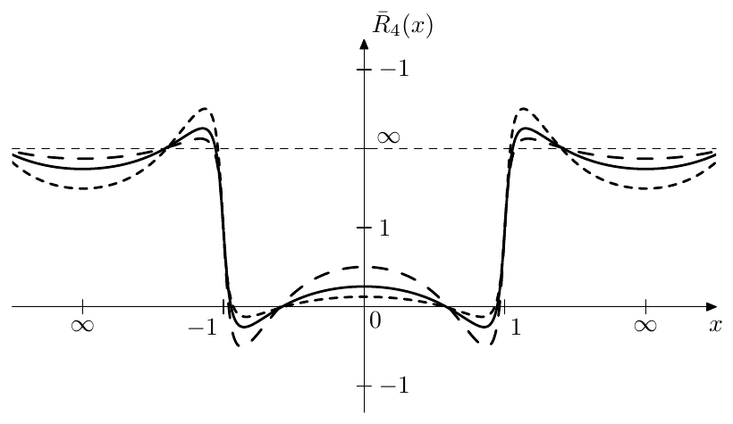

*Figure 9.59: Renormalized elliptic rational function for $\lambda=1$
(solid), $\lambda=k^{1/4}$ (small dashes) and $\lambda=k^{-1/4}$ (large
dashes). As the used elliptic modulus $k=0.9$ is pretty close to $1$, the
corresponding variations of the transition band width are not well
visible.*

The reasonable range of $\lambda$ is equal to the transition band
$[\sqrt k,1/\sqrt k]$. For $\lambda$ within this range the equiripples
(both in the pass- and stopbands) do not grow further than to unit
amplitude. As a somewhat excessive range of $\lambda$ we could take
$(\max\{\bar z_n\},1/\max\{\bar z_n\})$, limiting $\lambda$ between the
zeros and poles of $\bar R_N(x)$. In this case the equiripples may become
arbitrarily large.

As with renormalized Chebyshev polynomials, we may omit the parameter
$\lambda$, understanding it implicitly, and simply write $\bar R_N(x)$.

### Relation to $x^N$, $T_N(x)$ and $\mathcal L_N(x)$

In (9.136) it is easily noticed that at $\bar z_n \to 0$ the right-hand side
turns into $x^N$. On the other hand $|\bar z_n| \le \sqrt k$, therefore, if
$k\to0$, then $\bar z_n\to0$ and respectively by (9.136)

$$
\lim_{k\to0}\bar R_N(x) = x^N \tag{9.140}
$$

or simply $\bar R_N(x) = x^N$ for $k=0$ (Fig. 9.60).

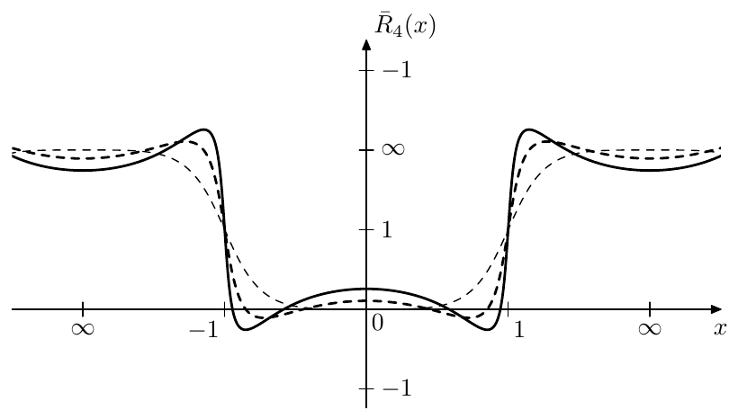

*Figure 9.60: Normalized elliptic rational function for $k=0.9$ (solid),
$k=0.7$ (dashed) and $k=0$ (thin dashed).*

At $k\to0$ we have $\operatorname{cd}x \to \cos x$ and
$\operatorname{cd}_Kx \to \cos\pi x/2$, therefore (9.115) turns into

$$
\cos\frac{\pi}{2}Nu = R_N\!\left(\cos\frac{\pi}{2}u\right)
$$

By replacing $\pi u/2$ with $u$ it can be equivalently written as

$$
\cos Nu = R_N(\cos u)
$$

which is identical to (9.35). Therefore $R_N(x)$ becomes identical to $T_N$
and thus we have

$$
\lim_{k\to0}R_N(x) = T_N(x) \tag{9.141}
$$

or simply $R_N(x) = T_N(x)$ for $k=0$. Notice that as $K'\to\infty$ and
$1/k\to\infty$, the transition band of $R_N(x)$ becomes infinitely large in
both preimage and representation domains, while the stopband $|x|\ge1/k$
disappears into infinity.

Using (9.126) and (9.139) we can express the approaching to $T_N(x)$ in
terms of $\bar R_N(x)$ and $\hat{\bar R}_N(x)$:

$$
\lim_{k\to0}\frac{\bar R_N\bigl(x\sqrt k\bigr)}{\sqrt{\tilde k}} = \lim_{k\to0}\hat{\bar R}_N\bigl(x,1/\sqrt k\bigr) = T_N(x) \tag{9.142}
$$

where we had to take the limit to avoid divisions and multiplications by
zero. By the definition of $\mathcal L_N(x)$ equation (9.142) can be
rewritten as

$$
\lim_{k\to0}\frac{\bar R_N\bigl(x\sqrt k\bigr)}{\sqrt{\tilde k}} = \frac{1}{\mathcal L_N(1/x)}
$$

Substituting $1/x$ for $x$ and reciprocating both sides

$$
\lim_{k\to0}\frac{\sqrt{\tilde k}}{\bar R_N\bigl(\sqrt k/x\bigr)} = \mathcal L_N(1/x)
$$

By (9.130) and (9.139)

$$
\lim_{k\to0}\sqrt{\tilde k}\,\bar R_N\bigl(x/\sqrt k\bigr) = \lim_{k\to0}\hat{\bar R}_N\bigl(x,\sqrt k\bigr) = \mathcal L_N(1/x) \tag{9.143}
$$

### Transition band slope of $\bar R_N(x)$

By (9.140) $\bar R_N(x)$ turns into $x^N$ at $k=0$. On the other hand at the
transition band's midpoint $x=1$ we have $\bar R_N(x) = x^N = 1\ \forall k$.
It would be therefore interesting to compare the slopes of $\bar R_N(x)$ and
$x^N$ within the transition band. In order to do that we are going to take
similar steps to what we did in the comparison of $T_N(x)$ and $x^N$.
Comparing (9.136) to (9.40) we compare their individual factors by
computing their respective differences:

$$
\frac{x^2-\bar z_n^2}{1-\bar z_n^2x^2} - x^2 = \frac{x^2-\bar z_n^2-x^2+\bar z_n^2x^4}{1-\bar z_n^2x^2} = \frac{\bar z_n^2(x^4-1)}{1-\bar z_n^2x^2} \tag{9.144}
$$

Assuming $k>0$, we have $0<\bar z_n<\sqrt k<1$ in the above. Thus in the
range $1<|x|<1/\max\{\bar z_n\}$ the differences (9.144) are strictly
positive and the factors of (9.136) are larger than those of (9.40). Since
for $1<x<1/\max\{\bar z_n\}$ all factors of (9.136) and (9.40) are positive,
we have

$$
\bar R_N(x) > x^N \qquad (1<x<1/\max\{\bar z_n\},\ N>1)
$$

By the even/odd symmetries of $\bar R_N(x)$ and $x^N$:

$$
|\bar R_N(x)| > |x^N| \qquad (1<|x|<1/\max\{\bar z_n\},\ N>1)
$$

By the symmetry (9.130) and by the same symmetry of $x^N$

$$
|\bar R_N(x)| < |x^N| \qquad (\max\{\bar z_n\}<|x|<1,\ N>1)
$$

Note that thereby our discussion has completely covered the band $|x| \in
(\max\{\bar z_n\},1/\max\{\bar z_n\})$ which also includes the entire
transition band $|x| \in [\sqrt k,1/\sqrt k]$. From (9.144) we can also
notice that the difference grows in magnitude as $\bar z_n$ grow in
magnitude. However by (9.135) and (9.91) the absolute magnitudes of $\bar
z_n$ should simply grow with $k$. Thus the differences (9.144) grow with $k$
and respectively $\bar R_N(x)$ deviates stronger for $x^N$ within the
transition band as $k$ grows (which can be seen in Fig. 9.59).

In order to explicitly compute the derivative of $\bar R_N(x)$ at the
transition midpoint $x=1$, we will evaluate the derivative of
$\overline{\operatorname{cd}}\,u$ at $u=jK'/2$ (which is the point where
$\overline{\operatorname{cd}}\,u = 1$). By (9.72)

$$
\frac{d}{du}\overline{\operatorname{cd}}\,u = \frac{d}{du}\sqrt k\operatorname{cd}u = \sqrt k\operatorname{cd}u\cdot\frac{d}{du}\ln\operatorname{cd}u = -\sqrt k\cdot k'^2\operatorname{cd}u\,\operatorname{sc}u\,\operatorname{nd}u
$$

We already know that $\operatorname{cd}(jK'/2) = 1/\sqrt k$. The value of
$\operatorname{nd}(jK'/2)$ can be obtained by (9.69) giving

$$
\begin{aligned}
\operatorname{nd}^2\frac{jK'}{2} &= \frac{1}{k'^2}\left(1-k^2\operatorname{cd}^2\frac{jK'}{2}\right) = \frac{1}{k'^2}\left(1-k^2\operatorname{cd}^2\frac{jK'}{2}\right) = \frac{1}{k'^2}(1-k) = \\
&= \frac{1-k}{1-k^2} = \frac{1}{1+k}
\end{aligned}
$$

By Fig. 9.44, (9.63) and Fig. 9.36 we choose the positive result of taking
the square root

$$
\operatorname{nd}\frac{jK'}{2} = \frac{1}{\sqrt{1+k}}
$$

By (9.66)

$$
\operatorname{sc}\frac{jK'}{2} = j\,\operatorname{nd}\frac{-jK'}{2} = j\,\operatorname{nd}\frac{jK'}{2} = \frac{j}{\sqrt{1+k}}
$$

Thus

$$
\begin{aligned}
\left(\frac{d}{du}\overline{\operatorname{cd}}\right)\!\left(\frac{jK'}{2}\right) &= -\sqrt k\cdot k'^2\cdot\frac{1}{\sqrt k}\cdot\frac{j}{\sqrt{1+k}}\cdot\frac{1}{\sqrt{1+k}} = \\
&= -j\frac{k'^2}{1+k} = -j\frac{1-k^2}{1+k} = -j(1-k)
\end{aligned}
$$

Now by (9.127) the function $\bar R_N(x)$ is obtained as a sequence of three
transformations. Differentiating each of these transformations at the point
corresponding to $x=1$ we obtain

$$
\begin{aligned}
\frac{du}{dx} &= \left(\frac{dx}{du}\right)^{-1} = \frac{1}{-j(1-k)} \\
\frac{dv}{du} &= N\frac{\tilde K}{K} = \frac{\tilde K'}{K'} \\
\frac{d\bar R_N}{dv} &= -j(1-\tilde k)
\end{aligned}
$$

and thus

$$
\frac{d\bar R_N}{dx} = \frac{d\bar R_N}{dv}\cdot\frac{dv}{du}\cdot\frac{du}{dx} = \frac{1-\tilde k}{1-k}N\frac{\tilde K}{K} = \frac{1-\tilde k}{1-k}\cdot\frac{\tilde K'}{K'} \qquad (\text{at } x=1) \tag{9.145}
$$

At $k=0$ we have $\tilde k=0$, $K=\tilde K=\pi/2$ and therefore $\bar
R_N'(1) = N$ corresponding to the fact that $\bar R_N(x) = x^N$. At higher
$k$ the derivative grows (Fig. 9.61).

In order to convince ourselves that $\bar R_N'(1) \to +\infty$ for $k\to1$
we could notice that $\tilde K' \to \pi/2$, and $K'\to\pi/2$, therefore
$\tilde K'/K' \to 1$. Now, for a given $k$, the value $\tilde k$ will
obviously decrease with growing $N$ (as we are using a higher degree
transformation of the period ratio). Therefore $(1-\tilde k)/(1-k)$ can be
bounded from below by its own value at $N=2$. A bit later in the text we
will obtain an explicit expression for $\bar R_2'(1)$ where it will be
obvious that $\bar R_2'(1) \to +\infty$ as $k\to1$. Therefore $(1-\tilde
k)/(1-k) \to +\infty$ at $N=2$, and so it does for all other $N>2$.

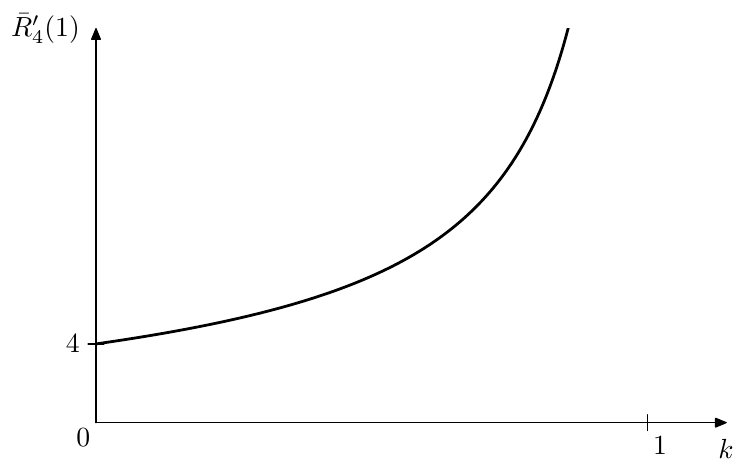

*Figure 9.61: Transition midslope derivative of $\bar R_4(x)$ for various $k$.*

### Transition band slope of $R_N(x)$

By (9.141) the elliptic rational function $R_N(x)$ turns into a Chebyshev polynomial of the same order $N$. We would be now in the position to compare their slopes within the transition band of $R_N(x)$.

Comparing the factors of (9.134) and (9.42) (where in (9.42) we let $\lambda = 1$ to turn $\hat T_N(x)$ into $T_N(x)$) we first pretend that the zeros of $R_N(x)$ and $T_N(x)$ are identical. In that case the difference of the respective factors is

$$
\begin{aligned}
&\frac{1-k^2z_n^2}{1-z_n^2}\cdot\frac{x^2-z_n^2}{1-k^2z_n^2x^2} - \frac{x^2-z_n^2}{1-z_n^2} = \frac{x^2-z_n^2}{1-z_n^2}\cdot\left(\frac{1-k^2z_n^2}{1-k^2z_n^2x^2}-1\right) = \\
&= \frac{x^2-z_n^2}{1-z_n^2}\cdot\frac{1-k^2z_n^2-1+k^2z_n^2x^2}{1-k^2z_n^2x^2} = \frac{x^2-z_n^2}{1-z_n^2}\cdot\frac{k^2z_n^2(x^2-1)}{1-k^2z_n^2x^2}
\end{aligned} \tag{9.146}
$$

Since within the transition band $[1,1/k]$ of $R_N(x)$ we have $1-k^2z_n^2x^2>0$ and $x^2-z_n^2>0$, the difference (9.146) is positive for $x\in(1,1/k]$ (for $0<k<1$).[^21]

By (9.133) and (9.91) the zeros $z_n$ grow with $k$. On the other hand, the zeros $z_n$ of $R_N(x)$ become equal to Chebyshev polynomial's zeros at $k=0$. Thus the zeros of $T_N(x)$ are smaller in absolute magnitude than those of $R_N$. Temporarily notating Chebyshev polynomial's zeros as $\lambda_n z_n$ where $0<\lambda_n<1$ (assuming $k>0$), we notice that

$$
\begin{aligned}
&\frac{x^2-z_n^2}{1-z_n^2} - \frac{x^2-(\lambda_n z_n)^2}{1-(\lambda_n z_n)^2} = \left(\frac{x^2-z_n^2}{1-z_n^2}-x^2\right) - \left(\frac{x^2-(\lambda_n z_n)^2}{1-(\lambda_n z_n)^2}-x^2\right) = \\
&= \frac{z_n^2(x^2-1)}{1-z_n^2} - \frac{(\lambda_n z_n)^2(x^2-1)}{1-(\lambda_n z_n)^2}
\end{aligned} \tag{9.147}
$$

where we have used (9.43). That is the difference (9.147) is again positive for $x>1$ and it is growing with $\lambda_n\to 0$ (which corresponds to the growing $k$). Adding (9.147) and (9.146) we obtain

$$
\begin{aligned}
&\frac{1-k^2z_n^2}{1-z_n^2}\cdot\frac{x^2-z_n^2}{1-k^2z_n^2x^2} - \frac{x^2-\lambda_n z_n^2}{1-\lambda_n z_n^2} = \\
&= \frac{x^2-z_n^2}{1-z_n^2}\cdot\frac{k^2z_n^2(x^2-1)}{1-k^2z_n^2x^2} + \left(\frac{z_n^2(x^2-1)}{1-z_n^2} - \frac{(\lambda_n z_n)^2(x^2-1)}{1-(\lambda_n z_n)^2}\right) > 0
\end{aligned} \tag{9.148}
$$

where $x\in(1,1/k]$. By our preceding discussion (9.148) becomes larger at larger $k$.

Since all involved factors are greater than unity in the transition band of $R_N(x)$, it follows that $R_N(x) > T_N(x)$ in that range and the difference grows with $k$. By even/odd symmetries of the respective functions we have

$$
|R_N(x)| > |T_N(x)| \qquad (|x| \in (1,1/k],\ k>0,\ N>1)
$$

and the difference becomes larger with $k$.

### Elliptic rational functions of order $2^N$

Constructing an elliptic rational function of a power-of-2 order is especially easy, since we can combine the explicit expression (9.114) for $R_2(x)$ with the chain rule (9.117) to build functions of other power-of-2 orders.

It is therefore also helpful to have a ready explicit expression for $\bar R_2(x)$. By (9.114) and (9.126)

$$
\bar R_2(x) = \sqrt{\tilde k}\cdot\frac{(1+k')\dfrac{x^2}{k}-1}{1-(1-k')\dfrac{x^2}{k}} = \sqrt{\tilde k}\cdot\frac{\dfrac{1+k'}{\sqrt{1-k'^2}}x^2-1}{1-\dfrac{1-k'}{\sqrt{1-k'^2}}x^2} = \sqrt{\tilde k}\cdot\frac{\sqrt{\dfrac{1+k'}{1-k'}}x^2-1}{1-\sqrt{\dfrac{1-k'}{1+k'}}x^2}
$$

Recalling that for $R_2(x)$

$$
\tilde k = L^{-1}(k) = \frac{1-k'}{1+k'}
$$

we further obtain

$$
\bar R_2(x) = \sqrt{\tilde k}\cdot\frac{\dfrac{x^2}{\sqrt{\tilde k}}-1}{1-x^2\sqrt{\tilde k}} = \frac{x^2-\sqrt{\tilde k}}{1-x^2\sqrt{\tilde k}} \tag{9.149}
$$

Multiple expressions of the form (9.149) (with different $\tilde k$ related through Landen transformation) can be chained to obtain $\bar R_N(x)$ for other power-of-2 orders.

The derivative at $x=1$ is

$$
\begin{aligned}
\bar R_2'(1) &= \left.\frac{2x\left(1-x^2\sqrt{\tilde k}\right)+2x\sqrt{\tilde k}\left(x^2-\sqrt{\tilde k}\right)}{\left(1-x^2\sqrt{\tilde k}\right)^2}\right|_{x=1} = \\
&= \frac{2\left(1-\sqrt{\tilde k}\right)+2\sqrt{\tilde k}\left(1-\sqrt{\tilde k}\right)}{\left(1-\sqrt{\tilde k}\right)^2} = 2\,\frac{1+\sqrt{\tilde k}}{1-\sqrt{\tilde k}}
\end{aligned} \tag{9.150}
$$

It is left as an excercise for the reader to verify that (9.150) is a particular case of (9.145).

Notably, by (9.110), the formula (9.150) can be rewritten as $\bar R_2'(1) = 2/\sqrt{k_1'}$ where $k_1'$ is a complementary modulus to $k_1$ where $k_1 = L(k)$.

## 9.13 Elliptic filters

Elliptic filters are obtained by using renormalized elliptic rational functions $\bar R_N(\omega)$ as $f(\omega)$ in (9.18).[^22] The main motivation to use renormalized elliptic rational functions instead of $\omega^N$ and $\hat T_N(\omega)$ is that, as we already know they grow faster than $\omega^N$ and $\hat T_N(\omega)$ within their transition bands, which results in a steeper transition band's slope. The tradeoff is that in order to achieve a steeper transition band we need to allow ripples in the pass- and stop-bands.

Thus, in (9.18) we let

$$
f(\omega) = \hat{\bar R}_N(\omega)
$$

that is

$$
|H(j\omega)|^2 = \frac{1}{1+\hat{\bar R}_N^2(\omega)}
$$

The $\lambda$ parameter of $\hat{\bar R}_N(\omega)$ is affecting the equiripple amplitudes of $\bar R_N$ and thereby the equiripple amplitude in the pass- and stop-bands of $|H(j\omega)|$. It is convenient to introduce the additional variable

$$
\varepsilon = \frac{1}{\bar R_N(1/\lambda)} \tag{9.151}
$$

Using (9.151) we particularly may write

$$
f(\omega) = \hat{\bar R}_N(\omega) = \varepsilon\bar R_N(\omega/\lambda)
$$

Given a desired filter order $N$, we still have two further freedom degrees to play with, corresponding to the parameters $k$ and $\lambda$, where, as we should recall from the discussion of elliptic rational functions, $k$ defines the tradeoff between the transition bandwidth and the ripple amplitudes, and $\lambda$ defines the tradeoff between the ripple amplitudes in the pass- and stop-bands. One of the possible scenarios to compute the elliptic filter parameters can be therefore the following. Suppose we are given the desired filter order $N$ and the desired pass- and stop-band boundaries (where the passband boundary must be to the left of $\omega=1$ and the stopband boundary must be to the right of $\omega=1$). Recalling that the pass- and stop-bands of $\bar R_N$ are (in the positive frequency range) $[0,\lambda\sqrt{k}]$ and $[\lambda/\sqrt{k},+\infty)$ respectively, we can find $\lambda$ and $k$.

Another scenario occurs if we are given the discrimination factor $1/\tilde k$. By (9.137) this defines selectivity factor $1/k$ and respectively the transition band width, but we can still play with $\lambda$ to control the tradeoff between the pass- and stop-band ripples.

Since the passband amplitude of $\bar R_N$ is $\sqrt{k}$, the amplitude response $|H(j\omega)|$ is varying within $[1/\sqrt{1+k\varepsilon^2},1]$ in the passband. Since the stopband amplitude of $\bar R_N$ is $1/\sqrt{k}$, the amplitude response $|H(j\omega)|$ is varying within $[0,1/\sqrt{1+\varepsilon^2/k}]$ in the stopband. The value of $\varepsilon$ therefore affects the tradeoff between the equiripple amplitudes of $|H(j\omega)|$ in the pass- and stop-bands. Since $\varepsilon$ depends on $\lambda$, this is consistent with our previous conclusion that $\lambda$ affects the tradeoff between the equiripple amplitudes of $\bar R_N$, where a smaller bandwidth of the pass- or stop-band corresponds to smaller equiripples within the respective band. Remember that the range of $\lambda$ is generally restricted to $[\sqrt{k},1/\sqrt{k}]$ (or just a little bit wider). Fig. 9.62 illustrates.

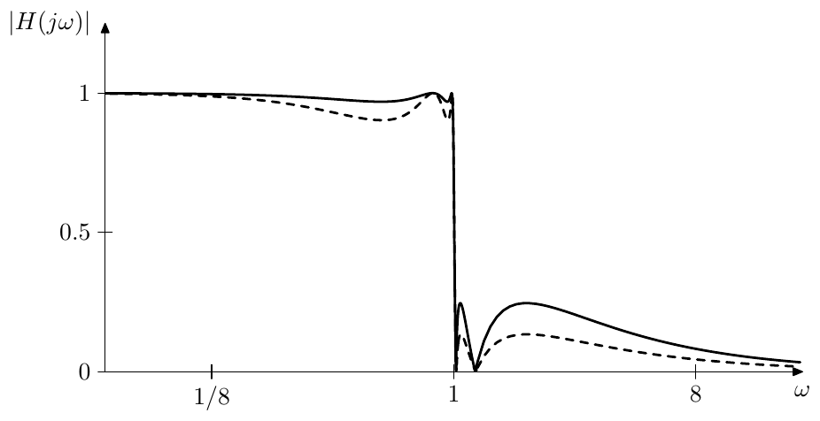

*Figure 9.62: Elliptic filter's amplitude responses for $N=5$, $k=0.98$ and $\lambda=1$ (solid) and $\lambda=k^{-1/4}$ (dashed). Notice the usage of the linear amplitude scale, which is chosen in order to be able to show the amplitude response zeros.*

### Poles of elliptic filters

Since $\hat{\bar R}_N(\omega)$ is a rational function, the transfer function defined by (9.18) will have poles and zeros. The equation for the poles of $|H(s)|^2 = H(s)H(-s)$ is

$$
1 + \hat{\bar R}_N^2(\omega) = 0
$$

or

$$
\hat{\bar R}_N(\omega) = \pm j
$$

or

$$
\varepsilon\bar R_N(\omega/\lambda) = \pm j \tag{9.152}
$$

or, introducing $\bar\omega = \omega/\lambda$

$$
\bar R_N(\bar\omega) = \pm\frac{j}{\varepsilon} \tag{9.153}
$$

where the "+" sign corresponds to the even poles and the "-" sign to odd poles.

Recall the interpretation of $\bar R_N$ as a representation of linear scaling of the preimage, which is given by (9.127). Suppose $\bar\omega$ is moving in a counterclockwise direction in a quasielliptic curve which is a representation of some preimage line $\operatorname{Im} u = \beta$ (Figs. 9.52, 9.53). Earlier we have agreed to chose the preimages within the imaginary quarter period right below the real axis, that is $\beta \in (-jK',0)$. In this case the counterclockwise movement in the representation domain assumes that $u$ is moving towards the right.

Since $v=u\tilde K'/K'$, the corresponding line in the preimage of $\bar R_N(\bar\omega)$ is $\operatorname{Im} v = \tilde\beta$, where $\tilde\beta = \beta\tilde K'/K'$. Therefore $\operatorname{Im} v \in (-j\tilde K',0)$, that is the line also goes within the imaginary quarter period right below the real axis. Obviously, since $u$ moves towards the right, so does $v$, and $\bar R_N(\bar\omega)$ moves in a counterclockwise direction.

We wish $\bar R_N(\bar\omega)$ to pass through the points $\pm j/\varepsilon$ going counterclockwise. By (9.71) the intersections of the quasielliptic curve $\bar R_N(\bar\omega)$ with the imaginary axis are occuring at $\pm j\,\overline{\operatorname{sc}}(\tilde\beta,\tilde k')$, therefore we choose

$$
\tilde\beta = -\overline{\operatorname{sc}}^{-1}(1/\varepsilon,\tilde k')
$$

(which thereby belongs to $(-\tilde K',0)$)[^23] and

$$
\beta = \frac{K'}{\tilde K'}\tilde\beta = -\frac{K'}{\tilde K'}\,\overline{\operatorname{sc}}^{-1}(1/\varepsilon,\tilde k') = -\frac{K}{N\tilde K}\,\overline{\operatorname{sc}}^{-1}(1/\varepsilon,\tilde k')
$$

According to (9.71) the purely imaginary values of $\operatorname{cd}(v,\tilde k)$ are attained when the real part of the elliptic cosine's argument is equal to $(2n+1)\tilde K$, where $n\in\mathbb{Z}$. Thus, the values $\pm j/\varepsilon$ will be attained by $\bar R_N(\bar\omega)$ at

$$
v = j\tilde\beta + (2n+1)\tilde K \tag{9.154}
$$

where, since $\tilde\beta<0$, the value $\bar R_N(\bar\omega) = j/\varepsilon$ is attained at $n=0$ and other even values of $n$. Thus, the solutions of the even pole equation $f=j$ will occur at even values of $n$. Fig. 9.63 illustrates.

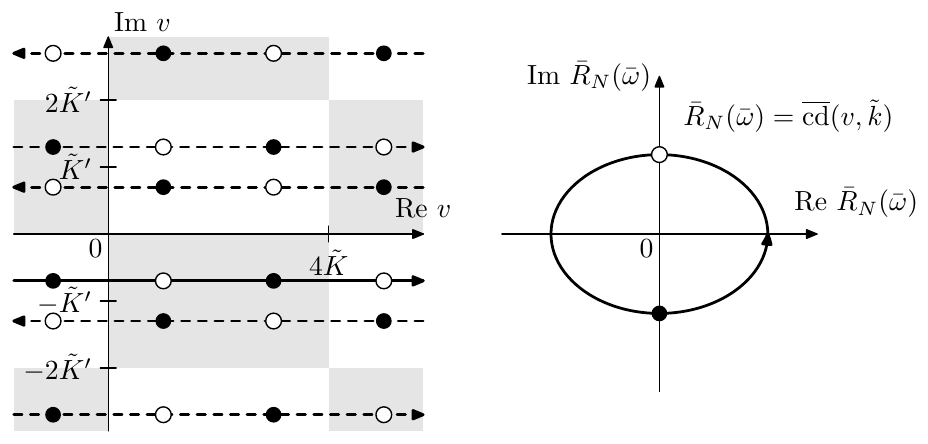

*Figure 9.63: Preimages of $\bar R_N(\bar\omega) = \pm j/\varepsilon$ (qualitatively).*

From (9.154) we obtain

$$
u = j\beta + \frac{K}{N\tilde K}(2n+1)\tilde K = j\beta + K\frac{2n+1}{N} = j\beta + 2K\,\frac{\frac12+n}{N}
$$

where there are $2N$ essentially different preimages of $\bar\omega$ occuring at $2N$ consecutive values of $n$ all lying on the line $\operatorname{Im} u = \beta$. Going back to the representation domain we obtain $\bar\omega$ lying on the respective quasiellipse:

$$
\bar\omega = \overline{\operatorname{cd}}\left(j\beta + K\frac{2n+1}{N}, k\right)
$$

Fig. 9.64 illustrates.

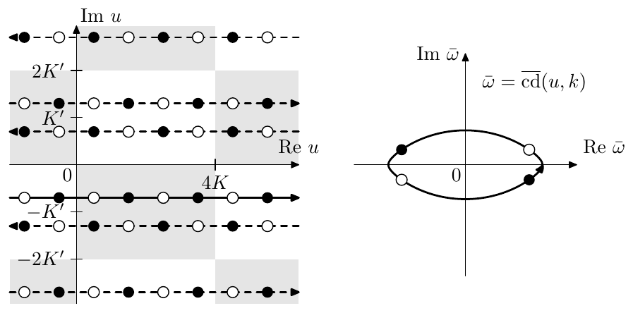

*Figure 9.64: Transformation of Fig. 9.63 by $u = Kv/N\tilde K$ (for $N=2$). The white and black dots on the quasielliptic curve are even/odd elliptic poles in terms of $\bar\omega$. (The picture is qualitative.)*

Switching to $\omega = \lambda\bar\omega$:

$$
\omega = \lambda\,\overline{\operatorname{cd}}\left(j\beta + K\frac{2n+1}{N}, k\right)
$$

It is easily checked that the values of $\omega$ are moving counterclockwise starting from the positive real semiaxis, where the values occurring at even/odd $n$ correspond to even/odd poles respectively.

Switching from $\omega$ to $s=j\omega$ we obtain the expression for the poles:

$$
s = j\lambda\,\overline{\operatorname{cd}}\left(j\beta + K\frac{2n+1}{N}, k\right) \tag{9.155}
$$

Since the values of $\omega$ are moving counterclockwise starting from the real positive semiaxis, the values of $s$ are moving counterclockwise starting from the imaginary "positive" semiaxis, which means that starting at $n=0$ we first obtain the stable poles at $n=0,\ldots,N-1$. The next $N$ values of $n$ will give the unstable poles.

For filter orders which are powers of 2 one can solve the equation (9.153) in an easier way using (9.149) and (9.128).

### Zeros of elliptic filters

The zeros of $H(s)$, if expressed in terms of $\omega$ coincide with the poles of $f(\omega) = \hat{\bar R}_N(\omega,\lambda)$, which can be found from the poles $\bar p_n = 1/\bar z_n$ of $\bar R_N(\omega)$ as $\hat{\bar p}_n = \lambda\bar p_n = \lambda/\bar z_n$, where $\bar z_n$ are given by (9.135). By $s=j\omega$ the zeros can be reexpressed in terms of $s$. For filter orders which are powers of 2 there is a simpler way using (9.149) and (9.128).

One should remember that for odd $N$ the function $\bar R_N$ has a zero at the origin which doesn't have a corresponding finite pole of $\bar R_N$, respectively there is no corresponding finite zero of $H(s)$ and no corresponding factor in the numerator of $H(s)$. Respectively the order of the numerator of $H(s)$ is $N-1$ rather than $N$, and the zero at the inifinity occurs automatically due to the order of the numerator being less than the order of the denominator. Fig. 9.65 provides an example.

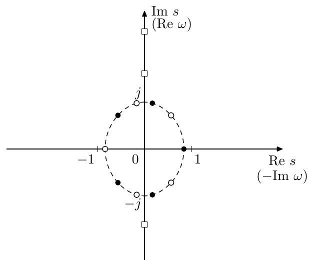

*Figure 9.65: Poles (white and black dots) and zeros (white squares) of an elliptic filter of order $N=5$. Each of the zeros is duplicated, but the duplicates are dropped together with the unstable poles.*

In Fig. 9.65 one can notice that the poles are more condensed closer to the imaginary axis. Apparently, this is due to (9.81c) and the related explanation.

### Gain adjustments

The default normalization of the elliptic filter's gain is according to (9.18):

$$
H(0) = \frac{1}{\sqrt{1+\hat{\bar R}_N^2(0)}} = \frac{1}{\sqrt{1+\varepsilon^2\bar R_N^2(0)}} = \frac{1}{\sqrt{1+\varepsilon^2(\operatorname{Re}j^N)^2\tilde k}} \tag{9.156}
$$

which thereby defines the leading gain coefficient of the cascade form implementation (8.1). We could also find the leading gain from the requirement $|H(j)|^2 = 1/2$, but we should mind the possibility of accidentally obtaining a $180^\circ$ phase response at $\omega=0$.

With the leading gain defined this way the amplitude response varies within $[1/\sqrt{1+\tilde k\varepsilon^2},1]$ in the passband. We could choose some other normalizations, though. E.g. we could require $H(0)=1$. Or we could require the passband ripples to be symmetric relatively to the zero decibel level, which is achieved by multiplying (9.156) by $(1+\tilde k\varepsilon^2)^{1/4}$:

$$
H(0) = \sqrt{\frac{\sqrt{1+\tilde k\varepsilon^2}}{1+\varepsilon^2\bar R_N^2(0)}}
$$

so that $|H(j\omega)|$ varies within $[1/(1+\tilde k\varepsilon^2)^{1/4},(1+\tilde k\varepsilon^2)^{1/4}]$ within the passband.

### Elliptic minimum Q filters

At $\lambda=1$ we have $\hat{\bar R}_N(\omega) = \bar R_N(\omega)$, thus $f(\omega)$ attains the reciprocal symmetry (9.130). Simultaneously, by (9.151) $\varepsilon=1$, respectively

$$
\tilde\beta = -\overline{\operatorname{sc}}^{-1}(1,\tilde k') = -\tilde K'/2
$$

$$
\beta = \frac{K'}{\tilde K'}\tilde\beta = -K/2
$$

while (9.155) turns into

$$
s = j\,\overline{\operatorname{cd}}\left(j\frac{K}{2} + K\frac{2n+1}{N}, k\right) \tag{9.157}
$$

By Fig. 9.53 and (9.85) the poles of $H(s)$ are all lying on the unit circle.[^24] Further, by Figs. 9.54, 9.55 and the associated discussion, the values of $\operatorname{cd}$ in (9.157) are having the maximum possible angular deviation (among the ones arising from different values for $k$) from the real axis. Respectively, the poles given by (9.157) are having the maximum possible angular deviation from the imaginary axis, which means that the corresponding cascade 2-pole sections will have the minimum possible resonances. Therefore elliptic filters arising at $\lambda=1$ are referred to as elliptic minimum Q filters, or shortly EMQF.

### Butterworth and Chebyshev limits

By (9.140) at $k=0$ EMQF filters turn into Butterworth filters. By (9.142) at $k\to 0$ and $\lambda=1/\sqrt{k}$ elliptic filters turn into Chebyshev type I filters. By (9.143) at $k\to 0$ and $\lambda=\sqrt{k}$ elliptic filters turn into Chebyshev type II filters.

## Summary

Classical signal processing filters are defined in terms of the squared amplitude response equation (9.18). By choosing different function types as $f(\omega)$ in (9.18) one obtains the respective filter types:

| Filter type | Definition |
|---|---|
| Butterworth | $f(x) = x^N$ |
| Chebyshev type I | $f(x) = \hat T_N(x)$ |
| Chebyshev type II | $f(x) = \hat{\mathcal{L}}_N(x)$ |
| Elliptic | $f(x) = \hat{\bar R}_N(x)$ |

[^1]: The general discussion of the idea of the Riemann sphere is not a part
    of this book. Readers unfamiliar with this concept are advised to
    consult the respective literature.

[^2]: One could also notice that (9.10) are very similar to the bilinear
    transform and its inverse, where the latter two have an additional
    scaling by $T/2$.

[^3]: This is also the reason for the notation $\rho_{+1}$: the subscript
    simply indicates the result of the transformation of $w = 0$.

[^4]: We specifically leave it undefined, whether $\arg x = \pi$ or $-\pi$
    for negative real numbers, as this is anyway a line on which the
    principal value of $\arg x$ has a discontinuity and thus, considering
    the usual computation precision losses, one often can't rely on the
    exact value of $\arg x$ being returned for $x < 0$.

[^5]: Notice that the principal preimage in Fig. 9.16 doesn't necessarily
    coincide with the set of values returned by the formulas (9.32),
    particularly since the arccos formulas in (9.32) exhibit discontinuities
    either for $x \in [-1,1]$ or for real $x: |x|>1$. The main reason to
    choose this specific preimage is that its generalization to the case of
    Jacobian elliptic cosine will be convenient for our purposes.

[^6]: Classically, Chebyshev filters are obtained from Chebyshev polynomials $T_N(\omega)$ by letting $f(\omega) = \varepsilon T_N(\omega)$ where $\varepsilon > 0$ is some small value. This way however usually requires some cutoff correction afterwards. The way how we introduce Chebyshev filters is essentially the same, but directly results in a better cutoff positioning. One way is related to the other via (9.44) combined with a cutoff adjustment by the factor $\lambda$.

[^7]: This choice is arbitrary, we simply better like the option of increasing real part of $v$. Alternatively we could let the real part of $v$ decrease, obtaining $\beta > 0$. However then we would need to have a negative coefficient in front of $n$ in (9.46).

[^8]: It might seem that the imaginary semiaxes of the ellipses in Figs. 9.26 and 9.27 are of unit length. This is not exactly so, although they are very close, being equal to approximately 1.00003 and 1.00004 respectively.

[^9]: Alternatively one could notice that the poles of Chebyshev type II (lowpass) filters are identical to the poles of Chebyshev type I hipass filters, since both can be obtained from the poles of Chebyshev type I lowpass filters by the LP to HP transformation. If Chebyshev type II lowpass poles are obtained this way, the order of their enumeration will be symmetrically flipped relatively to the one of the prototype Chebyshev type I lowpass poles. That is, if Chebyshev type I poles are going counterclockwise starting from the "positive" imaginary axis, then Chebyshhev type II poles obtained by the LP to HP tranformation will be going clockwise from the "negative" imaginary axis (thereby stable poles will be converted to stable poles, but the even/odd property of the poles will be switched if N is even).

[^10]: There is yet another Jacobian elliptic function, which is simply equal
    to $\cos\varphi$ rather than $(\cos\varphi)/\sqrt{1-k^2\sin^2\varphi}$. Depending on the purpose
    either of these functions may be referred to as elliptic cosine. Each of
    these two functions inherits different properties of $\cos\varphi$. For the
    purposes of this book we will need the one defined by (9.59) and this is
    the one to which we will refer to as elliptic cosine.

[^11]: Both $\operatorname{cd}$ and $\operatorname{nd}$ are even functions. Therefore it doesn't matter in
    which direction to rotate by $90^\circ$.

[^12]: Note that here (and further where we specifically refer to *function's*
    period, or half- or quarter-period) we mean the period of the function itself,
    rather than one of the least common periods $4K$ and $4K'$ of all Jacobian
    elliptic functions.

[^13]: The ratio of the periods is of course formally speaking not $K'/K$ but
    $4K'/4K$. However, obviously these values are equal.

[^14]: The second expression in (9.92b), in comparison to the first one,
    reduces the computation precision losses at small $k$.

[^15]: This technique is commonly referred to as *descending Landen
    transformation*, since it expresses elliptic functions with higher
    values of the modulus $k$ via elliptic functions with lower values of
    the modulus. However the recursion formula itself is applied to compute
    elliptic functions with higher $k$ from elliptic functions with lower
    $k$, thus the recursion itself is ascending.

[^16]: Notice that we needed to divide by $K_n$ in (9.104) because the
    notation $\operatorname{cd}_n$ includes the automatic multiplication of
    the argument by $K_n$.

[^17]: Note that thereby after one iteration we are guarateed that
    $|\operatorname{Im} u| \le K'_n/2K_n$.

[^18]: Note that the inverse of $\mathcal{A}$ gives two different values.

[^19]: Obviously, we could have chosen any other imaginary quarter period
    preimage strip. We have chosen the one right below the real axis simply
    to have a better defined reference in the preimage domain.

[^20]: By the earlier given definition of the amplitude of oscillations
    around infinity, the size of the stop-band equiripples is smaller if
    the formal amplitude of the equiripples is larger.

[^21]: Actually the same holds a bit further than within the tranistion band, namely within $[1,1/k\max\{z_n\}]$ but for simplicity we'll talk of transition band.

[^22]: Classically, elliptic filters are obtained from elliptic rational functions $R_N(\omega)$ by letting $f(\omega) = \varepsilon R_N(\omega)$ where $\varepsilon>0$ is some small value. This way however usually requires some cutoff correction afterwards. The way how we introduce Chebyshev filters is essentially the same, but directly results in a better cutoff positioning and better symmetries. Particularly EMQF filters directly arise at $\lambda=1$. One way is related to the other via $\varepsilon = 1/R_N(1/\sqrt{k}\,\lambda)$ combined with a cutoff adjustment by the factor $\sqrt{k}\lambda$.

[^23]: Instead of $-\overline{\operatorname{sc}}^{-1}(1/\varepsilon,\tilde k')$, which can be expected to have an unambiguous principal value, one can equivalently compute $-\overline{\operatorname{cd}}^{-1}(j/\varepsilon,\tilde k')$, however, as there are multiple solutions to the equation $\overline{\operatorname{cd}}(x,\tilde k') = j/\varepsilon$, one needs to be careful to be sure that the $\overline{\operatorname{cd}}^{-1}$ routine returns the same value as would have been obtained by using $\overline{\operatorname{sc}}^{-1}$. In principle any solution of $\overline{\operatorname{cd}}(x,\tilde k') = j/\varepsilon$ would do, but may result in a different order of iteration of elliptic filter's poles, so that the unstable poles will be obtained first.

[^24]: From a slightly different angle, since $\lambda=1$ and $\varepsilon=1$, the pole equation turns into $\bar R_N(\omega) = \pm j$. By (9.132) the solutions are lying on the unit circle.
