# Chapter 10: Special filter types

Butterworth filters of the 1st and 2nd kind as well as elliptic filters can serve
as a basis to contruct other filter types of a more specialzed nature, which are
going to be the subject of this chapter.

## 10.1 Reciprocally symmetric functions

The reciprocal symmetry (9.130) seems to be responsible for the special proper-
ties of EMQF filters. There is indeed a strong relationship between those, which
is worth a dedicated discussion, because we will have more uses of such functions
throughout this text. Let's therefore suppose that $f(x)$ (used in (9.18)) satisfies

$$
f(1/x) = 1/f(x) \tag{10.1}
$$

### Reciprocal symmetry of the poles

An obvious conjecture which might appear from the discussion of EMQF filters
is that (10.1) implies the poles on the unit circle. This, however, is not exactly
true, although there is some relation.

The symmetry (10.1) actually implies the reciprocal symmetry of the filter's
poles. That is, if $s$ is a pole of $H(s)$, then so is $1/s$. Indeed, suppose
$f^2(-js) = -1$, which means $s$ is a pole of $H(s)$. Then $f^2(-j/s) = f^2(1/js) =
1/f^2(js) = 1/f^2(-js) = -1$ (where the latter transformation is by the fact that
$f$ is required to be odd or even) and thus $1/s$ is also a pole of $H(s)$.

The reciprocal symmetry of the filter's poles manifests itself nicely for the
poles on the unit circle, where the reciprocation turns into simply conjugation,
and as poles of the real filters must be conjugate symmetric, they are also
reciprocally symmetric. But the poles do not really have to lie on the unit
circle.

### Image of the unit circle

$f(x)$ maps unit circle to the unit circle.[^1] Indeed, first notice that $|x| = 1
\iff 1/x = x^*$. Suppose $|x| = 1$. Then, recalling that $f$ is real,

$$
f(1/x) = f(x^*) = f^*(x) = 1/f(x) \iff |f(x)| = 1
$$

Therefore

$$
|x| = 1 \implies |f(x)| = 1
$$

The converse is however not necessarily true: it's possible that $\exists x: |x|
\neq 1, |f(x)| = 1$. In other words, there may be other preimages of the unit
circle points.

E.g. consider the function

$$
f(x) = \rho_{+1}\left((\rho_{+1}(x))^3\right) = x\frac{x^2+3}{3x^2+1}
$$

Apparently $f(x)$ satisfies (10.1). However, it has three different preimages of
the unit circle:

$$
x(t) = \rho_{+1}(e^{j\alpha t})
$$

where $t \in \mathbb{R}$ and $\alpha$ is one of the values $\pi/6, 3\pi/6, 5\pi/6$.
At $\alpha = 3\pi/6 = \pi/2$ we obtain $|x| = 1$, however for other $\alpha$ this is
not so.

### Poles on the unit circle

Under the additional restriction that the zeros of $f(x)$ (including a possible
zero at $x = \infty$) must be either all inside or all outside of the unit circle,
the unit circle will be the only preimage of the unit circle, that is

$$
|x| = 1 \iff |f(x)| = 1 \tag{10.2}
$$

We have already shown that $|x| = 1 \implies |f(x)| = 1$, therefore it remains
for us to show that $|x| = 1 \impliedby |f(x)| = 1$. First notice that (10.1)
implies that the poles of $f(x)$ are reciprocals of the zeros. From (10.1) we also
have $f(1) = \pm 1$. Then $f(x)$ can be written as

$$
f(x) = \prod_n \frac{x - z_n}{1 - z_n x}
$$

where $z_n$ are the zeros of $f(x)$. Furthermore, since $f$ is real, complex zeros
must come in conjugate pairs and so must complex poles, and we can write

$$
f(x) = \prod_n \frac{x - z_n}{1 - z_n^* x} \tag{10.3}
$$

Suppose all zeros of $f(x)$ lie inside the unit circle. Let's show that in this
case $|x| > 1 \implies |f(x)| > 1$. Suppose $|x| > 1$. In order to show that
$|f(x)| > 1$ we are going to show that each of each of the factors of $f(x)$ has
absolute magnitude greater that unity:

$$
\left|\frac{x - z_n}{1 - z_n^* x}\right| > 1
$$

By equivalent transformations we are having

$$
|x - z_n| > |1 - z_n^* x|
$$

$$
(x - z_n)(x^* - z_n^*) > (1 - z_n^* x)(1 - z_n x^*)
$$

$$
|x|^2 - z_n x^* - z_n^* x - |z_n|^2 > 1 - z_n x^* - z_n^* x - |z_n|^2 \cdot |x|^2
$$

$$
(|x|^2 - 1)(1 - |z_n|^2) > 0
$$

which is obviously true, therefore each of the factors of $f(x)$ is larger than
1 in absolute magnitude and so is $f(x)$. In a similar way we can show that
$|x| < 1 \implies |f(x)| < 1$. Therefore there are no other images of unit circle
points and we have shown that $|x| = 1 \impliedby |f(x)| = 1$. The case of all
zeros lying outside the unit circle is treated similarly, where we have $|x| > 1
\implies |f(x)| < 1$ and $|x| < 1 \implies |f(x)| > 1$.

From (10.2) it follows that the solutions of the pole equation $f^2(x) = -1$
are lying on the unit circle, and so do the poles of $H(s)$ obtained from $f(x)$.

### Complementary symmetry of lowpass and highpass filters

The reciprocal symmetry of the poles implies that filters $H(s)$ and $H(1/s)$
(related by the LP to HP transformation) share the same poles. Furthermore, it
turns out that there is a complementary symmetry of squared amplitude responses
of these filters:

$$
|H(j\omega)|^2 + |H(1/j\omega)|^2 = 1 \iff f(1/x) = 1/f(x) \tag{10.4}
$$

Indeed, by the Hermitian property of $H(1/j\omega)$, the left-hand side of (10.4)
can be equivalently written as

$$
|H(j\omega)|^2 + |H(j/\omega)|^2 = 1
$$

Using (9.18) we further rewrite it as

$$
\frac{1}{1 + f^2(\omega)} + \frac{1}{1 + f^2(1/\omega)} = 1
$$

Transforming the equation further, we obtain

$$
\frac{1}{1 + f^2(1/\omega)} = 1 - \frac{1}{1 + f^2(\omega)} = \frac{f^2(\omega)}{1 + f^2(\omega)} = \frac{1}{1 + \dfrac{1}{f^2(\omega)}}
$$

or equivalently

$$
f^2(1/\omega) = 1/f^2(\omega)
$$

or

$$
f(1/\omega) = \pm 1/f(\omega)
$$

Noticing that $f(1/\omega) = -1/f(\omega)$ implies $f^2(1) = -1$, which is impossible
for a real $f(\omega)$, we conclude that $f(1/\omega) = -1/f(\omega)$ is not an
option. Thus we simply have $f(1/\omega) = 1/f(\omega)$, which was obtained by an
equivalent transformation from $|H(j\omega)|^2 + |H(1/j\omega)|^2 = 1$ and thus
both conditions are equivalent.

which in linear scale becomes

$$
|H(j/\omega)| = \frac{1}{|H(j\omega)|}
$$

or

$$
|H(j/\omega)|^2 = \frac{1}{|H(j\omega)|^2} \tag{10.5}
$$

Writing $|H(j\omega)|^2$ as $H(j\omega)H(-j\omega)$ we introduce $G(s) = H(s)H(-s)$.
Then (10.5) becomes

$$
G(j/\omega) = \frac{1}{G(j\omega)}
$$

Taking into account that $G(s)$ is even, we have

$$
G(j\omega)G(1/j\omega) = 1
$$

Apparently, the latter equality must be true not only for $\omega \in \mathbb{R}$
but also for any $\omega \in \mathbb{C}$, thus

$$
G(s)G(1/s) = 1 \qquad (s \in \mathbb{C})
$$

Therefore, $G(s) = 0 \iff G(1/s) = \infty$ and $G(s) = \infty \iff G(1/s) = 0$.
That is the poles of $G(s)$ are reciprocals of the zeros of $G(s)$ and vice versa.

Conversely, given $G(s) = H(s)H(-s)$ such that its poles are reciprocals of
its zeros and additionally requiring that $|G(j)| = 1$ we will have $G(s)G(1/s) =
1$ and (10.5) follows. Indeed, writing $G(s)$ in the factored form we have

$$
G(s) = g \cdot \prod_n \frac{s - z_n}{1 - z_n s}
$$

where $z_n$ are the zeros of $G(s)$. Then

$$
G(1/s) = g \cdot \prod_n \frac{1/s - z_n}{1 - z_n/s} = g \cdot \prod_n \frac{1 - z_n s}{s - z_n}
$$

Therefore $G(s)G(1/s) = g^2$. Letting $s = j$ we have

$$
g^2 = G(j)G(1/j) = G(j)G(-j) = G(j)G^*(j) = |G(j)|^2 = 1
$$

and thus $G(s)G(1/s) = 1$.

Now the poles and zeros of $G(s)$ consist of those of $H(s)$ and their symmetric
counterparts (with respect to the complex plane's origin). Under the assumption
that $H(s)$ must be stable, all poles of $H(s)$ will be in the left complex
semiplane. Under the additional assumption that $H(s)$ is minimum phase, so will
be zeros of $H(s)$. Respectively $H(-s)$ will contain poles and zeros in the
right semiplane. However, the reciprocation turns left-semiplane values into
left-semiplane values and right-semiplane values into right-semiplane values.
Therefore the poles of a minimum-phase stable $H(s)$ will be mutually reciprocal
with the zeros of $H(s)$.

Thus, in order for a minimum phase $H(s)$ to have the tilting amplitude
response symmetry of Fig. 10.2 its poles and zeros must be mutually reciprocal.
Conversely, given $H(s)$ with mutually reciprocal poles and zeros (which is
thereby minimum phase, assuming $H(s)$ is stable), (10.5) will hold under the
additional requirement $|H(j)| = 1$. Relaxing the minimum phase requirement
effectivlely means that some zeros will be flipped from the left semiplane into
the right semiplane, which is pretty trivial and doesn't change the amplitude
response, therefore we will concentrate on minimum phase tilting and shelving
filters.

## 10.2 Shelving and tilting filters

We have made some attempts to construct shelving filters in the discussions of 1-
and 2-poles, but the results were lacking intuitively desired amplitude response
symmetries shown in Fig. 10.1. The kind of symmetry shown in Fig. 10.1 is
better expressed if we symmetrize the amplitude response further, obtaining
the one in Fig. 10.2.

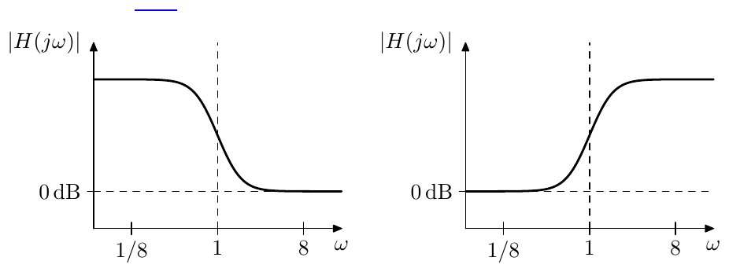

*Figure 10.1: Shelving amplitude responses, ideally symmetric in
fully logarithmic scale.*

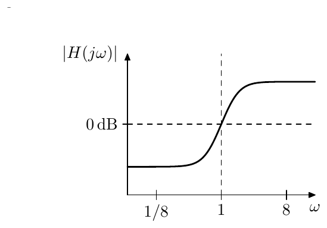

*Figure 10.2: Tilting amplitude response, ideally symmetric in fully
logarithmic scale.*

Fig. 10.1 apparently shows low-shelving (left) and high-shelving (right) am-
plitude responses. The amplitude response in Fig. 10.2 can be referred to as
*tilting* amplitude response. It is easy to notice that the low- and high-shelving
responses can be obtained from the tilting one by vertical shifts. Vertical shifts
in decibel scale are corresponding to multiplication of the signal by a constant.
That is tilting and low- and high-shelving filters can be obtained from each other
by a multiplication by a constant. We will therefore not make much distinction
between these types, arbitrarily jumping from one type to the other, whenever
the discussion requires so.

### Reciprocal symmetry of poles and zeros

Treating $|H(1)| = 1$ as the logarithmic origin of an amplitude response graph we
can express the desired symmetry of the tilting amplitude response in Fig. 10.2
as an odd logarithmic symmetry:

$$
\log|H(j\exp(-x))| = -\log|H(j\exp x)|
$$

### Construction as a lowpass ratio[^2]

Let $G(s)$ be a filter (now this is a different $G(s)$ than $G(s) = H(s)H(-s)$ we
have been using above) having the following properties: $G(s)$ doesn't have zeros,
all its poles are lying on the unit circle, and $G(0) = 1$.

Apparently, $G(s)$ is a lowpass filter, which should be obvious by considering
the factoring of $G(s)$ into a cascade of 1- and 2-poles. Such $G(s)$ also can be
factored as

$$
G(s) = \prod_{n=1}^{N} \frac{1}{s - p_n}
$$

(where the leading coefficient is 1 due to $G(s)$ being real stable, $G(0) = 1$,
$|p_n| = 1$ and $\operatorname{Re} p_n < 0$). The poles of $G(s)$ lying on the
unit circle and being conjugate symmetric imply the reciprocal symmetry of the
poles: if $p_n$ is a pole of $G(s)$ then so is $1/p_n$.

Let's apply the cutoff substitution $s \leftarrow s/M$ ($M \in \mathbb{R}$, $M >
0$) to $G(s)$. We obtain

$$
G(s/M) = \prod_{n=1}^{N} \frac{1}{s/M - p_n} = M^N \cdot \prod_{n=1}^{N} \frac{1}{s - M p_n}
$$

That is we obtain the filter with the poles $Mp_n$. Respectively, shifting the
cutoff in the opposite direction by the same logarithmic amount, we have

$$
G(Ms) = \prod_{n=1}^{N} \frac{1}{Ms - p_n} = M^{-N} \cdot \prod_{n=1}^{N} \frac{1}{s - M^{-1}p_n}
$$

That is we obtain the filter with the poles $M^{-1}p_n$.

Since for each $p_n$ there is $p_{n'} = 1/p_n$, for each $Mp_n$ there is
$M^{-1}p_{n'} = 1/Mp_n$. That is, the poles of $G(s/M)$ are mutually reciprocal
with the poles of $G(Ms)$ and we can construct

$$
H(s) = \frac{G(s/M)}{G(Ms)} \tag{10.6}
$$

By construction the poles of $G(Ms)$ are the zeros of $H(s)$ and the poles of
$G(s/M)$ are the poles of $H(s)$. Thus the poles of $H(s)$ are reciprocal to its
zeros and vice versa. However generally $|H(j)| \neq 1$ (a little bit later we'll
show that $|H(j)| = M^N$). This means that $H(s)$ is not a tilting filter, but is
related to the tilting filter by some factor. Noticing that $H(0) = G(0)/G(0) =
1$, we conclude that $H(s)$ must be a kind of high-shelving filter. The conversion
to the tilting filter is trivial: we can simply divide the result by $|H(j)|$.

The conversion to the low-shelving filter looks more complicated, since ap-
parently $G(\infty) = 0$ and we have a 0/0 uncertainty evaluating $H(\infty)$.
However we can notice that at $s \to \infty$ we have $G(s) \sim s^{-N}$, $G(s/M)
\sim M^N s^{-N}$ and $G(Ms) \sim M^{-N} s^{-N}$, thus $H(s) \sim M^{2N}$, that is
simply $H(\infty) = M^{2N}$. We therefore obtain the low-shelving filter from the
high-shelving one by dividing by $M^{2N}$.

We can also obtain the explicit expression for the value of $|H(j)|$, where we
can simply use the symmetries of the amplitude response. Since $H(s)/|H(j)|$ is
a tilting filter, it must have mutually reciprocal amplitude responses at $\omega
= 0$ and $\omega = \infty$, that is

$$
\left|\frac{H(0)}{|H(j)|}\right| = \left|\frac{|H(j)|}{H(\infty)}\right|
$$

from where $|H(j)|^2 = |H(0)| \cdot |H(\infty)| = M^{2N}$ and $|H(j)| = M^N$. Thus
the tilting filter is obtained from the high-shelving one by dividing by $M^N$.

Therefore we have

$$
H_{\mathrm{HS}}(s) = \frac{G(s/M)}{G(Ms)} \tag{10.7a}
$$

$$
H_{\mathrm{tilt}}(s) = M^{-N} \cdot \frac{G(s/M)}{G(Ms)} \tag{10.7b}
$$

$$
H_{\mathrm{LS}}(s) = M^{-2N} \cdot \frac{G(s/M)}{G(Ms)} \tag{10.7c}
$$

for the high-shelving, tilting and low-shelving filter respectively. From the
values $H(0)$, $|H(j)|$, $H(\infty)$ obtained earlier for the high-shelving filter
we thus obtain:

$$
\begin{aligned}
H_{\mathrm{HS}}(0) &= 1 & |H_{\mathrm{HS}}(j)| &= M^N & H_{\mathrm{HS}}(\infty) &= M^{2N} \\
H_{\mathrm{tilt}}(0) &= M^{-N} & |H_{\mathrm{tilt}}(j)| &= 1 & H_{\mathrm{tilt}}(\infty) &= M^N \\
H_{\mathrm{LS}}(0) &= M^{-2N} & |H_{\mathrm{LS}}(j)| &= M^{-N} & H_{\mathrm{LS}}(\infty) &= 1
\end{aligned} \tag{10.8}
$$

Apparently $M$ can be greater or smaller than 1, corresponding to increasing or
decreasing of the signal level in the respective range. Since $M$ and $1/M$ are
filter cutoff factors, $M$ must be positive.

The filters constructed by the lowpass ratio approach satisfy the symmetry
(10.5), however we know little about the shapes of their amplitude responses.
These shapes can be arbitrary odd functions (if seen in the logarithmic scale),
whereas we would like to obtain the shapes at least resembling those in Figs. 10.1
and 10.2.

Also, apparently the lowpass ratio approach can be easily applied to a But-
terworth $G(s)$, since Butterworth (unit-cutoff) filters have poles on the unit
circle. On the other hand, while EMQF filters also have poles on the unit circle,
they don't have only poles, but also zeros, therefore this method is not directly
applicable to EMQF filters.[^3] In order to have a better control of the amplitude
responses and to be able to build tilting and shelving filters based on EMQF
filter, we will need to address the problem from a different angle.

### Construction by mixing

We have already made some attempts of constructing a low-shelving filters by
mixing the lowpass signal with the input signal, which weren't too successful.
Instead we could attempt the same mixing in terms of squared amplitude re-
sponse, in which case we at least would not have the effects of the phase response
interfering. Also, rather that constructing a low-shelving filter, we shall attempt
to construct a tilting filter, in which case it is easier to express the symmetry
requirement (10.5).

Suppose $G(s)$ is defined by

$$
|G(j\omega)|^2 = \frac{1}{1 + f^2(\omega)}
$$

We construct the tilting squared amplitude response by mixing $|G(j\omega)|^2$
with the squared "amplitude response of the input signal", which is simply 1:

$$
|H(j\omega)|^2 = a^2 + \frac{b^2}{1 + f^2(\omega)} = \frac{\alpha^2 + \beta^2 f^2(\omega)}{1 + f^2(\omega)}
$$

where $a^2$ and $b^2$ (or, equivalently, $\alpha^2$ and $\beta^2$) denote the
unknown positive mixing coefficients. We wish $|H(j\omega)|^2$ to satisfy (10.5).

Assuming a lowpass $f(x)$, that is $f(x) \to 0$ for $x \to 0$ and $f(x) \to
\infty$ for $x \to \infty$, we notice that $|H(0)|^2 = \alpha^2$ and $|H(\infty)|^2
= \beta^2$, therefore (10.5) can be attained only at $\alpha^2\beta^2 = 1$ and we
can drop one of these variables obtaining:

$$
|H(j\omega)|^2 = \frac{\beta^{-2} + \beta^2 f^2(\omega)}{1 + f^2(\omega)} \tag{10.9}
$$

However there apparently are additional restrictions on $f(x)$ which ensure that
(10.5) holds for any $\omega$ and not just for $\omega = 0$ and $\omega = \infty$.
To find these restrictions let's substitute (10.9) into (10.5):

$$
\frac{\beta^{-2} + \beta^2 f^2(1/\omega)}{1 + f^2(1/\omega)} = \frac{1 + f^2(\omega)}{\beta^{-2} + \beta^2 f^2(\omega)}
$$

$$
\beta^{-4} + f^2(1/\omega) + f^2(\omega) + \beta^4 f^2(1/\omega)f(\omega) =
$$

$$
= 1 + f^2(1/\omega) + f^2(\omega) + f^2(1/\omega)f(\omega)
$$

$$
1 - \beta^{-4} = (\beta^4 - 1)f^2(1/\omega)f^2(\omega)
$$

$$
(\beta^4 - 1)f^2(1/\omega)f^2(\omega) = \frac{\beta^4 - 1}{\beta^4}
$$

and

$$
f^2(1/\omega)f^2(\omega) = \beta^{-4} \tag{10.10}
$$

The equation (10.10) thereby ensures that (10.5) will hold.

Let $\bar f(\omega) = \overline{\beta f(\omega)}$, or $f(\omega) = \beta^{-1}\bar
f(\omega)$. Then (10.10) becomes[^4]

$$
\bar f(1/\omega)\bar f(\omega) = 1 \tag{10.11}
$$

while (10.9) becomes

$$
|H(j\omega)|^2 = \frac{\beta^{-2} + \bar f^2(\omega)}{1 + \beta^{-2} f^2(\omega)} = \beta^{-2} \cdot \frac{1 + \beta^2 \bar f^2(\omega)}{1 + \beta^{-2} \bar f^2(\omega)} \tag{10.12}
$$

That is, we simply want $\bar f(\omega)$ satisfying (10.11). Then $f(\omega) =
\beta^{-1}\bar f(\omega)$ (for any arbitrarily picked $\beta$) will satisfy (10.10)
and respectively $H(s)$ will satisfy (10.5).

Comparing the above to the lowpass-ratio approach to the construction of
the tilting filters, that is comparing (10.12) to (10.6) we notice obvious similar-
ities. Essentially (10.12) is a ratio of two lowpasses $\beta^{-2}H_1/H_2$:

$$
|H_1(j\omega)|^2 = \frac{1}{1 + \beta^{-2}\bar f^2(\omega)} \qquad |H_2(j\omega)|^2 = \frac{1}{1 + \beta^2 \bar f^2(\omega)}
$$

with an additional gain of $\beta^{-2}$, which occurs since this is a tilting rather
than high-shelving filter.

Given a Butterworth $f(\omega) = \omega^N$, we have $f(\omega/M) = M^{-N}f(\omega)$,
that is the cutoff substitution $\omega \leftarrow \omega/M$ is equivalent to
choosing $\beta = M^N$, in which case (10.12) means essentially the same as (10.6).
The difference appears in the EMQF case where $f(\omega/M) \neq M^{-N}f(\omega)$.

The zeros of the EMQF filter would have been exactly the problem in
the case of (10.6), since the cutoff substitution also shifts the zeros, and the
zeros of $G(s/M)$ do not match the zeros of $G(Ms)$, respectively they cannot
cancel each other in $H(s)$ and would have resulted in zero amplitude response
at the zeros of the numerator and in infinite amplitude response at the zeros of
the denominator. On the other hand, in (10.12), where the EMQF zeros correspond
to the poles of $\bar f$, the poles of $\bar f$ will result in identical zeros of
the numerator and of the denominator of $|H(j\omega)|^2$, thus they will cancel
each other. In that sense, the approach of (10.12) is more general than the one
of (10.6).

We can also notice that the right-hand side of (10.12) monotonically maps
the range $[0, +\infty]$ of $\bar f^2$ onto $[\beta^{-2}, \beta^2]$ if $|\beta| > 1$
and onto $[\beta^2, \beta^{-2}]$ if $0 < |\beta| < 1$. Since negating $\beta$
doesn't have any effect on (10.12), therefore we can restrict $\beta$ to $\beta >
0$, in which case we can say $|H_{\mathrm{tilt}}(j\omega)|$ is varying between
$\beta^{-1}$ and $\beta$.

Obviously, (10.12) results in

$$
|H_{\mathrm{HS}}(j\omega)|^2 = \frac{1 + \beta^2 \bar f^2(\omega)}{1 + \beta^{-2} \bar f^2(\omega)} \tag{10.13a}
$$

$$
|H_{\mathrm{tilt}}(j\omega)|^2 = \beta^{-2} \cdot \frac{1 + \beta^2 \bar f^2(\omega)}{1 + \beta^{-2} \bar f^2(\omega)} \tag{10.13b}
$$

$$
|H_{\mathrm{LS}}(j\omega)|^2 = \beta^{-4} \cdot \frac{1 + \beta^2 \bar f^2(\omega)}{1 + \beta^{-2} \bar f^2(\omega)} \tag{10.13c}
$$

The values at the key points respectively are (under the restriction $\beta > 0$)

$$
\begin{aligned}
|H_{\mathrm{HS}}(0)| &= 1 & |H_{\mathrm{HS}}(j)| &= \beta & |H_{\mathrm{HS}}|(\infty) &= \beta^2 \\
|H_{\mathrm{tilt}}(0)| &= \beta^{-1} & |H_{\mathrm{tilt}}(j)| &= 1 & |H_{\mathrm{tilt}}|(\infty) &= \beta \\
|H_{\mathrm{LS}}(0)| &= \beta^{-2} & |H_{\mathrm{LS}}(j)| &= \beta^{-1} & |H_{\mathrm{LS}}|(\infty) &= 1
\end{aligned} \tag{10.14}
$$

where we also assume that $\bar f(0) = 0$ and $\bar f(\infty) = \infty$. In the
EMQF case, where $\bar f = \bar R_N$ this is not true for even $N$, and we need to
understand (10.14) as referring to the points where $\bar f(\omega) = 0$ and
$\bar f(\omega) = \infty$ instead (which we didn't explicitly write in (10.14) for
the sake of keeping the notation short).

As with $M$ in the lowpass ratio approach, $\beta$ can be greater than 1 or smaller
than 1.

## 10.3 Fixed-slope shelving

Using Butterworth filters as a basis for a shelving/tilting filter is compatible with
both lowpass ratio (10.6) and mixing (10.12) approaches, where both options
are giving equivalent results. For now we will continue the discussion in terms
of the lowpass ratio option (10.6).

We will be interested in shelving filters obtained from the Butterworth filters
of the 1st kind by (10.6). Noticing that (10.6) commutes with the Butterworth
transformation:

$$
\mathcal{B}_N\left[\frac{G(s/M)}{G(Ms)}\right] = \frac{\mathcal{B}_N[G(s/M)]}{\mathcal{B}_N[G(Ms)]} \tag{10.15}
$$

we can restrict our discussion to the shelving filters obtained by the application
of (10.6) to the 1st-order Butterworth lowpass. By (10.15) higher order shelving
filters will be simply Butterworth transformations of the 1st-order Butterworth
shelving filters, which is going to be covered in Section 10.5.

Since the 1st-order Butterworth lowpass coincides with the ordinary 1-pole
lowpass, we simply have

$$
G(s) = \frac{1}{1 + s}
$$

and respectively by (10.7)

$$
\begin{aligned}
H_{\mathrm{HS}}(s) &= \frac{G(s/M)}{G(Ms)} = \frac{1 + Ms}{1 + s/M} = M^2 \cdot \frac{s + 1/M}{s + M} \\
H_{\mathrm{tilt}}(s) &= M^{-1}H_{\mathrm{HS}}(s) = M^{-1} \cdot \frac{1 + Ms}{1 + s/M} = \frac{Ms + 1}{s + M} = M\frac{s + 1/M}{s + M} \\
H_{\mathrm{LS}}(s) &= M^{-1}H_{\mathrm{tilt}}(s) = M^{-2} \cdot \frac{1 + Ms}{1 + s/M} = \frac{s + 1/M}{s + M}
\end{aligned}
$$

By (10.8)

$$
\begin{aligned}
H_{\mathrm{HS}}(0) &= 1 & |H_{\mathrm{HS}}(j)| &= M & H_{\mathrm{HS}}(\infty) &= M^2 \\
H_{\mathrm{tilt}}(0) &= M^{-1} & |H_{\mathrm{tilt}}(j)| &= 1 & H_{\mathrm{tilt}}(\infty) &= M \\
H_{\mathrm{LS}}(0) &= M^{-2} & |H_{\mathrm{LS}}(j)| &= M^{-1} & H_{\mathrm{LS}}(\infty) &= 1
\end{aligned}
$$

### Implementation

The 1st-order tilting filter can be implemented as a linear combination of the
lowpass and highpass signals:

$$
\begin{aligned}
H_{\mathrm{tilt}}(s) &= \frac{Ms + 1}{s + M} = \frac{s + 1/M}{s/M + 1} = M\frac{s/M}{s/M + 1} + M^{-1}\frac{1}{s/M + 1} = \\
&= M^{-1} \cdot H_{\mathrm{LP}}(s) + M \cdot H_{\mathrm{HP}}(s)
\end{aligned}
$$

where the cutoff of the 1-pole multimode is at $\omega = M$. The low- and high-
shelving filters can be obtained from the above mixture by a division a or mul-
tiplication by $M$:

$$
H_{\mathrm{HS}}(s) = M \cdot H_{\mathrm{tilt}}(s) = H_{\mathrm{LP}}(s) + M^2 \cdot H_{\mathrm{HP}}(s)
$$

$$
H_{\mathrm{LS}}(s) = M^{-1} \cdot H_{\mathrm{tilt}}(s) = M^{-2} \cdot H_{\mathrm{LP}}(s) + H_{\mathrm{HP}}(s)k
$$

### Amplitude response

The example amplitude responses of the 1-pole tilting filter are presented in
Fig. 10.3, where the formal "cutoff" frequency is denoted as $\omega_{\text{mid}}$,
being the middle frequency of the tilting.

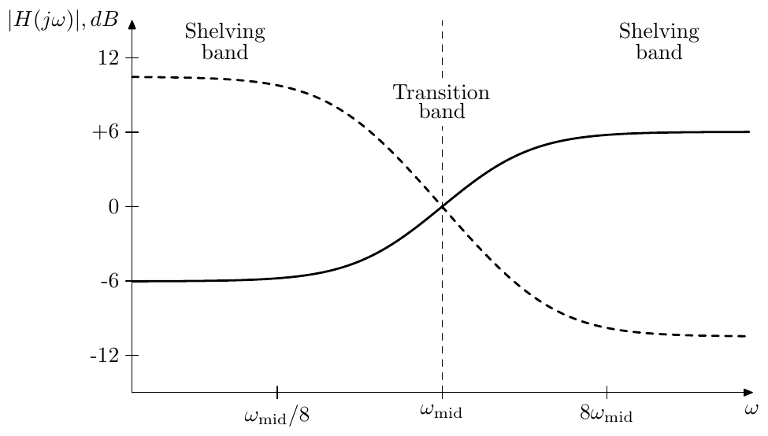

*Figure 10.3: Amplitude responses of a 1-pole tilting filter for $M > 1$
(solid) and $M < 1$ (dashed).*

Since the amplitude response of the tilting filter neither decreases to zero
anywhere, nor does it have a range where it is approximately unity, we can't
define pass- and stop-bands. Instead we can refer to the bands on the left and
on the right, where the amplitude response is almost constant, as *shelving
bands*. The band in the middle where the amplitude response is varying can be
referred to as *transition band*, as usual.

On the other hand, for low- and high-shelving filters we can define one of the
bands, where the amplitude response is approximately unity, as the passband
(Figs. 10.4, 10.5).

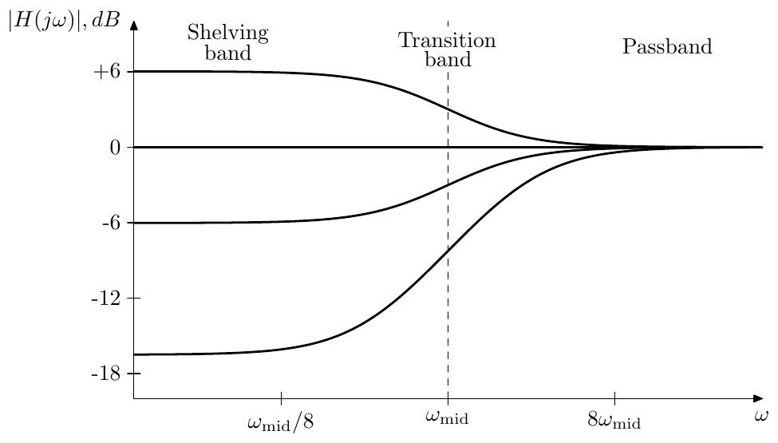

*Figure 10.4: Amplitude responses of a 1-pole low-shelving filter.*

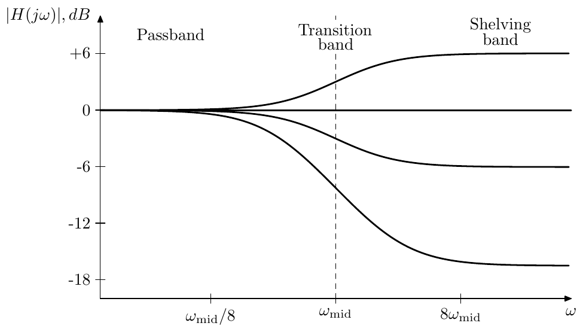

*Figure 10.5: Amplitude responses of a 1-pole high-shelving filter.*

### Phase response

The representation of the shelving filter as a ratio of two lowpasses with
cutoffs $M$ and $M^{-1}$ allows an intuitive derivation of the tilting filter's
phase response, the latter being equal to the difference of the lowpass phase
responses:

$$
\begin{aligned}
\arg H_{\text{HS}}(s) &= \arg\frac{1+Ms}{1+s/M} = \arg\frac{1+s/M^{-1}}{1+s/M} = \\
&= \arg\frac{1}{1+s/M} - \arg\frac{1}{1+s/M^{-1}} \qquad (s = j\omega)
\end{aligned}
$$

(since both shelving filters and the tilting filter all have identical phase
responses, we picked the one with the most convenient transfer function).

Recalling how the phase response of a 1-pole lowpass looks (Fig. 2.5) we can
conclude that the biggest deviation of the tilting filter's phase response from
$0^\circ$ (potentially reaching almost $\pm90^\circ$) should occur in the frequency band
between $M$ and $M^{-1}$, the deviation being positive if $M > 1 > M^{-1}$ and
negative if $M < 1 < M^{-1}$. Outside of this band the phase response cannot
exceed $\pm45^\circ$. Fig. 10.6 illustrates. Notice that therefore the phase
response is close to zero outside of the transition region.

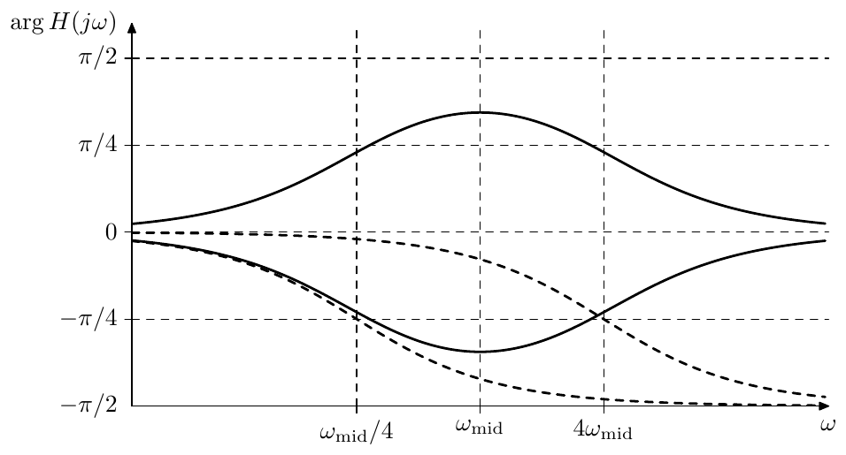

*Figure 10.6: Phase response of the 1-pole shelving/tilting filters for $M = 4$
(positive) and for $M = 1/4$ (negative). Dashed curves represent phase
responses of the underlying 1-pole lowpasses at cutoffs $M$ and $M^{-1}$.*

### Transition band width

In order to roughly estimate the width of the transition band of the tilting
filter's amplitude response we could divide the decibel difference in
amplitude response levels at $\omega \to 0$ and $\omega \to \infty$ by the
derivative of the amplitude response at the middle of the transition band
(Fig. 10.7).

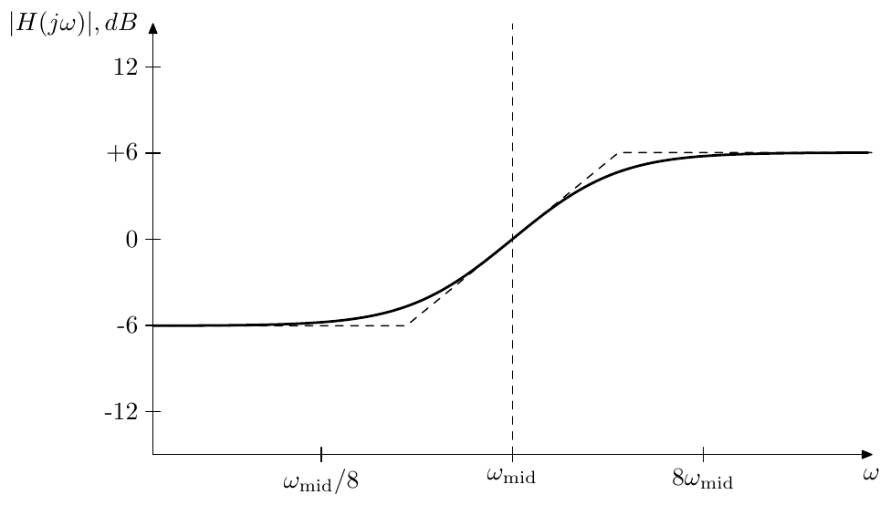

*Figure 10.7: Estimation of the transition bandwidth of the 1-pole tilting
filter by approximating the amplitude response by a broken line tangential to
the amplitude response at the middle frequency.*

Writing out the derivative of the amplitude response in the logarithmic
frequency and amplitude scales (where we use natural logarithms to simplify
the math), we obtain

$$
\begin{aligned}
\frac{\mathrm{d}}{\mathrm{d}x}\ln|H_{\text{tilt}}(je^x)|\bigg|_{x=0}
&= |H_{\text{tilt}}(je^x)|^{-1}\bigg|_{x=0} \cdot \frac{\mathrm{d}}{\mathrm{d}x}|H_{\text{tilt}}(je^x)|\bigg|_{x=0} = \\
&= \frac{\mathrm{d}}{\mathrm{d}x}|H_{\text{tilt}}(je^x)| = \frac{\mathrm{d}}{2\mathrm{d}x}|H_{\text{tilt}}(je^x)|^2 = \frac{\mathrm{d}}{2\mathrm{d}x}\left|\frac{jMe^x+1}{je^x+M}\right|^2 = \\
&= \frac{\mathrm{d}}{2\mathrm{d}x}\left(\frac{M^2e^{2x}+1}{e^{2x}+M^2}\right)
= \frac{2M^2e^{2x}(e^{2x}+M^2) - 2e^{2x}(M^2e^{2x}+1)}{2(e^{2x}+M^2)^2}\bigg|_{x=0} = \\
&= \frac{2M^2(1+M^2) - 2(M^2+1)}{2(1+M^2)^2} = \frac{M^2-1}{M^2+1} = \frac{M-M^{-1}}{M+M^{-1}}
\end{aligned}
$$

(where we have assumed $x = 0$ throughout the entire transformation chain).
The logarithmic amplitude difference is $\ln M - \ln M^{-1} = 2\ln M$ and thus
the bandwidth in terms of natural logarithmic scale is the ratio of that
difference and the derivative at $x = 0$:

$$
\Delta_{\ln} = 2\ln M \cdot \frac{M+M^{-1}}{M-M^{-1}}
$$

Introducing the natural-logarithmic amplitude boost $m = \ln M$, we rewrite
the above as

$$
\Delta_{\ln} = 2m \cdot \frac{e^m+e^{-m}}{e^m-e^{-m}} = 2\cdot\frac{m}{\tanh m} = \frac{2}{\operatorname{tanhc} m}
$$

where

$$
\operatorname{tanhc} m = \frac{\tanh m}{m}
$$

is the "cardinal hyperbolic tangent" function, introduced similarly to the more
commonly known cardinal sine function $\operatorname{sinc} x = \frac{\sin x}{x}$.

Introducing the decibel difference betwen the right and left "shelves"

$$
G_{\text{dB}} = 20\log_{10}M^2
$$

we can switch the amplitude scale from natural logarithmic to decibel:

$$
M = e^m \qquad M^2 = 10^{G_{\text{dB}}/20}
$$

$$
2m = \ln 10^{G_{\text{dB}}/20} = G_{\text{dB}}/20 \cdot \ln 10
$$

$$
m = G_{\text{dB}}/40 \cdot \ln 10 \approx 0.0576 \cdot G_{\text{dB}}
$$

Then

$$
\Delta_{\ln} \approx \frac{2}{\operatorname{tanhc}(0.0576 \cdot G_{\text{dB}})}
$$

Switching from the natural logarithmic bandwidth to the octave bandwidth we
have

$$
e^{\Delta_{\ln}} = 2^{\Delta_{\text{oct}}}
$$

$$
\Delta_{\ln} = \Delta_{\text{oct}} \cdot \ln 2
$$

and we have obtained the octave bandwidth formula:

$$
\Delta_{\text{oct}} \approx \frac{2}{\ln 2 \cdot \operatorname{tanhc}(0.0576 \cdot G_{\text{dB}})} \approx \frac{2.89}{\operatorname{tanhc}(0.0576 \cdot G_{\text{dB}})}
$$

The graph of the dependency is plotted in Fig. 10.8. At $G_{\text{dB}} = 0$ we
have $\Delta_{\text{oct}} \approx 2.89$. At $|G_{\text{dB}}| \to \infty$ we have
$\Delta_{\text{oct}} \sim G_{\text{dB}}/6$, that is the bandwidth is growing
proportionally to the decibel boost.[^5] Since the shelving boosts are
typically within the range of $\pm12$dB, or maybe $\pm18$dB, we could say that
the typical transition band width of the titling filter is roughly 3 octaves.

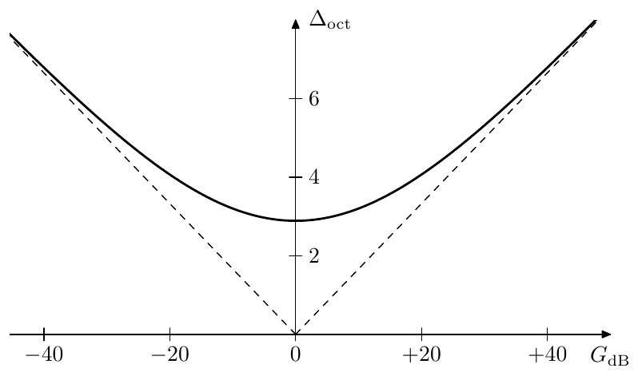

*Figure 10.8: Transition bandwidth (estimated) as a function of the total
decibel boost.*

## 10.4 Variable-slope shelving

With shelving filters based on Butterworth filters of the 1st kind we didn't
have any control over the steepness of the transition slope, or, respectively
over the transition band width. In order to introduce that kind of control we
can use Butterworth filters of the 2nd kind.

The commutativity relation (10.15) still applies, since it's independent of
whether the involved filters are 1st or 2nd kind Butterworth, and we can
restrict our discussion to the 2-pole shelving filters. Shelving filters of
higher (even) orders can be obtained from those by Butterworth transformation,
which is going to be covered in Section 10.5.

A generic unit-cutoff 2-pole lowpass filter

$$
G(s) = \frac{1}{s^2+2Rs+1} \tag{10.16}
$$

has its poles on the unit circle, no zeros and unity gain at $\omega = 0$, thus
the requirements of the lowpass ratio approach are fulfilled and we can obtain
the respective shelving filters by (10.7):

$$
H_{\text{HS}}(s) = \frac{G(s/M)}{G(Ms)} = \frac{M^2s^2+2RMs+1}{s^2/M^2+2Rs/M+1} = M^2 \cdot \frac{M^2s^2+2RMs+1}{s^2+2RMs+M^2}
$$

$$
H_{\text{tilt}}(s) = M^{-2}H_{\text{HS}}(s) = \frac{M^2s^2+2RMs+1}{s^2+2RMs+M^2}
$$

$$
H_{\text{LS}}(s) = M^{-2}H_{\text{tilt}}(s) = M^{-2}\cdot\frac{M^2s^2+2RMs+1}{s^2+2RMs+M^2} = \frac{s^2+2Rs/M+1/M^2}{s^2+2RMs+M^2}
$$

where by (10.8)

$$
\begin{aligned}
H_{\text{HS}}(0) &= 1 & |H_{\text{HS}}(j)| &= M^2 & H_{\text{HS}}(\infty) &= M^4 \\
H_{\text{tilt}}(0) &= M^{-2} & |H_{\text{tilt}}(j)| &= 1 & H_{\text{tilt}}(\infty) &= M^2 \\
H_{\text{LS}}(0) &= M^{-4} & |H_{\text{LS}}(j)| &= M^{-2} & H_{\text{LS}}(\infty) &= 1
\end{aligned}
$$

### Implementation

In order to construct an implementation of the tilting filter, we simply
express its transfer function in terms of the SVF modes:

$$
\begin{aligned}
H_{\text{tilt}}(s) &= \frac{M^2s^2+2RMs+1}{s^2+2RMs+M^2} = \frac{s^2+2R(s/M)+1/M^2}{(s/M)^2+2R(s/M)+1} = \\
&= \frac{M^2(s/M)^2+2R(s/M)+1/M^2}{(s/M)^2+2R(s/M)+1} = \\
&= M^{-2}H_{\text{LP}}(s) + H_{\text{BP1}}(s) + M^2H_{\text{HP}}(s)
\end{aligned}
$$

where the cutoff of the multimode SVF is $\omega_c = M$ (notice that we used
the normalized bandpass mode instead of the ordinary bandpass). Respectively

$$
H_{\text{HS}}(s) = M^2H_{\text{tilt}}(s) = H_{\text{LP}}(s) + M^2H_{\text{BP1}}(s) + M^4H_{\text{HP}}(s)
$$

$$
H_{\text{LS}}(s) = M^{-2}H_{\text{tilt}}(s) = M^{-4}H_{\text{LP}}(s) + M^{-2}H_{\text{BP1}}(s) + H_{\text{HP}}(s)
$$

### Amplitude and phase response

Notably, $G(s)$ defined by (10.16) cannot be conveniently expressed in terms of
(9.18), since

$$
|G(j\omega)|^2 = \frac{1}{(\omega^2-1)^2+4R^2\omega^2} = \frac{1}{4R^2(1-R^2)}\cdot\frac{1}{1+\left(\dfrac{\omega^2+2R^2-1}{2R\sqrt{1-R^2}}\right)^2}
$$

Respectively, (10.12) doesn't apply and we cannot use the associated
interpretation to reason about the shelving amplitude response shapes obtained
from $G(s)$. However, we could notice that at $R = 1$ the filter $G(s)$ turns
into a squared 1st-order Butterworth, while at $R = 1/\sqrt{2}$ it turns into a
2nd-order Butterworth of the 1st kind, therefore we can apply the results of
Section 10.3 concluding that at least at these values of $R$ we should expect
to obtain a resonable shelving shape.

The family of amplitude responses of a 2-pole tilting filter for various $R$
is shown in Fig. 10.9. One can see in the picture that $R$ controls the slope,
or equivalently, the width of the transition band, however only a small range
of $R$ generates "reasonable" tilting curves. We'll analyse this topic in
detail a bit later.

The phase response expressed in terms of a lowpass ratio gives

$$
\begin{aligned}
\arg H_{\text{HS}}(s) &= \arg\frac{M^2s^2+2RMs+1}{s^2/M^2+2Rs/M+1} = \arg\frac{s^2/M^{-2}+2Rs/M^{-1}+1}{s^2/M^2+2Rs/M+1} = \\
&= \arg\frac{1}{(s/M)^2+2R(s/M)+1} - \arg\frac{1}{(s/M^{-1})^2+2R(s/M^{-1})+1}
\end{aligned}
$$

(where $s = j\omega$). Recalling the 2-pole lowpass phase response (Fig. 4.6)
we can conclude that the biggest deviation of the 2-pole tilting filter's
phase response from $0^\circ$ (potentially reaching almost $\pm180^\circ$) should occur in
the frequency band between $M$ and $M^{-1}$, the deviation being positive if
$M > 1 > M^{-1}$ and negative if $M < 1 < M^{-1}$. Outside of this band the
phase response cannot exceed $\pm90^\circ$. Fig. 10.10 illustrates. Notice that
thus the phase response is close to zero outside of the transition region.

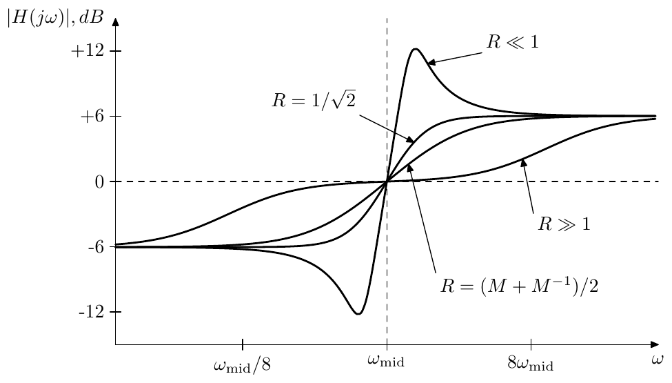

*Figure 10.9: Amplitude responses of a 2-pole tilting filter for $M^2 = 2$ and
various $R$.*

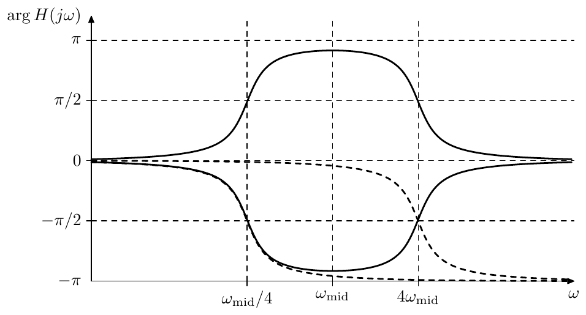

*Figure 10.10: Phase response of the 2-pole tilting filter for $M = 4$
(positive) and for $M = 1/4$ (negative). Damping $R = 1/4$. Dashed curves
represent phase responses of the underlying 2-pole lowpasses at cutoffs $M$ and
$M^{-1}$.*

### Steepness control

As one could notice from Fig. 10.9, the damping parameter $R$ affects the
steepness of the amplitude response slope at $\omega = 1$. Let's analyse it in
more detail. First, we write $H_{\text{tilt}}(s)$ as

$$
H_{\text{tilt}}(s) = \frac{M^2s^2+2RMs+1}{s^2+2RMs+M^2} = \frac{M^2s+2RM+1/s}{s+2RM+M^2/s} = \frac{G(s)}{G(1/s)}
$$

where

$$
G(s) = M^2s + 2RM + 1/s
$$

Then, considering the derivative of the fully logarithmic-scale amplitude
response at $\omega = 1$, we obtain (assuming $x = 0$ thoughout the entire
transformation chain):

$$
\begin{aligned}
\frac{\mathrm{d}}{\mathrm{d}x}\ln|H_{\text{tilt}}(je^x)|\bigg|_{x=0}
&= \frac{\mathrm{d}}{\mathrm{d}x}\ln\frac{|G(je^x)|}{|G(-je^{-x})|} = \frac{\mathrm{d}}{\mathrm{d}x}\ln\frac{|G(je^x)|}{|G(je^{-x})|} = \\
&= \frac{\mathrm{d}}{\mathrm{d}x}\bigl(\ln|G(je^x)| - \ln|G(je^{-x})|\bigr) = 2\frac{\mathrm{d}}{\mathrm{d}x}\ln|G(je^x)| = \frac{\mathrm{d}}{\mathrm{d}x}\ln|G(je^x)|^2 = \\
&= \frac{\dfrac{\mathrm{d}}{\mathrm{d}x}|G(je^x)|^2}{|G(je^x)|^2} = \frac{\dfrac{\mathrm{d}}{\mathrm{d}x}|jM^2e^x+2RM-je^{-x}|^2}{|G(j)|^2} = \\
&= \frac{\dfrac{\mathrm{d}}{\mathrm{d}x}\bigl(4R^2M^2+(M^2e^x-e^{-x})^2\bigr)}{4R^2M^2+(M^2-1)^2} = \frac{\dfrac{\mathrm{d}}{\mathrm{d}x}\bigl(M^4e^{2x}-2M+e^{-2x}\bigr)}{4R^2M^2+(M^2-1)^2} = \\
&= \frac{2M^4e^{2x}-2e^{-2x}}{4R^2M^2+(M^2-1)^2} = \frac{2(M^2-M^{-2})}{4R^2+(M-M^{-1})^2}
\end{aligned}
\tag{10.17}
$$

The maximum possible value is attained at $R = 0$ and is equal to

$$
\frac{\mathrm{d}}{\mathrm{d}x}\ln|H_{\text{tilt}}(je^x)|\bigg|_{x=0} = \frac{2(M^2-M^{-2})}{(M-M^{-1})^2} = 2\cdot\frac{M+M^{-1}}{M-M^{-1}} < \infty \qquad \text{for } M \neq 1
$$

That is, we can't reach infinite steepness. Further, as one can see from Fig.
10.9, for $R \to 0$ the amplitude response gets a peak and a dip, which are
generally undesired for a shelving EQ.

On the other hand, given a sufficiently large $R$, we can attain arbitrarily
small steepness. However, for $R \geq 1$ the filter falls apart into a product
of two 1-pole tilting filters.[^6] As $R$ grows, the 1-pole cutoffs get further
apart and one can see the two separate "tilting inflection points" in the
amplitude response (Fig. 10.9).

We need therefore to restrict $R$ to "a reasonable range". But how do we
define this range? Let's analyse several characteristic values of $R$.

At $R = 1$ we have a two times vertically stretched (in the decibel scale)
amplitude response of the 1-pole tilting filter with the same cutoff
$\omega_c = M$:

$$
\frac{M^2s^2+2Ms+1}{s^2+2Ms+M^2} = \left(\frac{Ms+1}{s+M}\right)^2
$$

It should be no surprise that at $R = 1/\sqrt{2}$ we obtain a Butterworth
transform of the 1-pole tilting filter with cutoff $\omega_c = M^2$:

$$
\begin{aligned}
\left|\frac{M^2s^2+\sqrt2\cdot Ms+1}{s^2+\sqrt2\cdot Ms+M^2}\right|^2\bigg|_{s=j\omega}
&= \frac{(1-M^2\omega^2)^2+2M^2\omega^2}{(M^2-\omega^2)^2+2M^2\omega^2} = \\
&= \frac{1+M^4\omega^4}{M^4+\omega^4} = \left|\frac{M^2\cdot j\omega^2+1}{j\omega^2+M^2}\right| = \left|\frac{M^2s+1}{s+M^2}\right|\bigg|_{s=j\omega^2}
\end{aligned}
$$

We can also obtain the response identical to the response of the just
mentioned 1-pole tilting filter with cutoff $\omega_c = M^2$ by combining such
1-pole tilting filter with a "unit-gain" (fully transparent) tilting filter
$(s+1)/(s+1)$:

$$
\begin{aligned}
H_{\text{tilt}}(s) &= \frac{M^2s+1}{s+M^2} = \frac{M^2s+1}{s+M^2}\cdot\frac{s+1}{s+1} = \frac{M^2s^2+(M^2+1)s+1}{s^2+(M^2+1)s+M^2} = \\
&= \frac{M^2s^2+\dfrac{M^2+1}{M}\cdot Ms+1}{s^2+\dfrac{M^2+1}{M}\cdot Ms+M^2} = \frac{M^2s^2+(M+M^{-1})\cdot Ms+1}{s^2+(M+M^{-1})\cdot Ms+M^2}
\end{aligned}
$$

Therefore, such response is attained at $R = (M+M^{-1})/2 \geq 1$.

Thus we are having two good candidates for the boundaries of the "reasonable
range of $R$". One boundary can be at $R = (M+M^{-1})/2$, corresponding to the
amplitude response of the 1-pole tilting filter with cutoff $\omega_c = M^2$,
the other boundary is at $R = 1/\sqrt{2}$, corresponding to the same response
shrunk horizontally two times.[^7] The steepness at $\omega = 1$ therefore
varies by a factor of 2 within that range, which also can be verified
explicitly:

$$
\begin{aligned}
\frac{\dfrac{\mathrm{d}}{\mathrm{d}x}\ln|H_{\text{tilt}}(je^x)|\Big|_{x=0,\ R=1/\sqrt{2}}}{\dfrac{\mathrm{d}}{\mathrm{d}x}\ln|H_{\text{tilt}}(je^x)|\Big|_{x=0,\ R=(M+M^{-1})/2}}
&= \frac{2(M^2-M^{-2})}{2+(M-M^{-1})^2}\cdot\frac{(M+M^{-1})^2+(M-M^{-1})^2}{2(M^2-M^{-2})} = \\
&= \frac{(M+M^{-1})^2+(M-M^{-1})^2}{2+(M-M^{-1})^2} = \frac{2(M^2+M^{-2})}{M^2+M^{-2}} = 2
\end{aligned}
$$

These boundary responses of the "reasonable range of $R$" can be found among
the responses shown by Fig. 10.9.

## 10.5 Higher-order shelving

### Butterworth shelving of the 1st kind

Given a 1-pole tilting filter:

$$
H_{\text{tilt}}(s) = \frac{Ms+1}{s+M} = M\frac{s+M^{-1}}{s+M}
$$

we have reciprocal "cutoffs" in the numerator and the denominator.
Respectively, the zero is reciprocal to the pole. According to (8.12c) and
(8.12d), this property is preserved by the Butterworth transformation. The
dampings of the poles and zeros obtained after the Butterworth transformation
of the 1st kind depend solely on the transformation order and thus are
identical in the numerator and denominator:

$$
\begin{aligned}
\mathcal{B}\bigl[H_{\text{tilt}}(s)\bigr] &= M\cdot\left(\frac{s+M^{-1/N}}{s+M^{1/N}}\right)^{N\wedge1}\cdot\prod_n\frac{s^2+2R_nM^{-1/N}s+(M^{-1/N})^2}{s^2+2R_nM^{1/N}s+(M^{1/N})^2} = \\
&= \left(M^{1/N}\frac{s+M^{-1/N}}{s+M^{1/N}}\right)^{N\wedge1}\cdot\prod_n(M^{1/N})^2\frac{s^2+2R_nM^{-1/N}s+(M^{-1/N})^2}{s^2+2R_nM^{1/N}s+(M^{1/N})^2}
\end{aligned}
$$

Therefore we obtain a serial chain of 1- and 2-pole tilting filters. The low-
and high-shelving filters are transformed similarly. Alternatively we can
simply reuse the obtained Butterworth transformation of the tilting filter,
multiplying or dividing it by the factor $M$.

Notice that the factor being $M$ rather than $M^N$ is a kind of a notational
difference. After the Butterworth transformation of $N$-th order the original
change of cutoff by the $M$ factor will turn into a change of cutoff by the
$M^{1/N}$ factor. Raising $M^{1/N}$ to the $N$-th power (according to (10.8))
to obtain the multiplication factors gives $M$.

### Butterworth shelving of the 2nd kind

Remember that the "cutoffs" of the numerator and denominator of a 2-pole
tilting filter are mutually reciprocal, while the "dampings" are equal:

$$
H_{\text{tilt}}(s) = \frac{M^2s^2+2RMs+1}{s^2+2RMs+M^2} = M^2\cdot\frac{s^2+2RM^{-1}s+M^{-2}}{s^2+2RMs+M^2}
$$

so the numerator "cutoff" is $M^{-1}$ and the denominator "cutoff" is $M$.

By using the Butterworth transform cutoff property (8.12c) we obtain that
$\mathcal{B}[H_{\text{tilt}}(s)]$ must have the following form:

$$
\begin{aligned}
\mathcal{B}\bigl[H_{\text{tilt}}(s)\bigr] &= M^2\cdot\prod_{n=1}^{N}\frac{s^2+2R_nM^{-1/N}s+M^{-2/N}}{s^2+2R_nM^{1/N}s+M^{2/N}} = \\
&= \prod_{n=1}^{N}M^{2/N}\frac{s^2+2R_nM^{-1/N}s+M^{-2/N}}{s^2+2R_nM^{1/N}s+M^{2/N}}
\end{aligned}
$$

which is in agreement with the reciprocal cutoff preservation property of the
Butterworth transformation. Thus we have obtained a serial chain of 2-pole
tilting filters with numerator "cutoff" $M^{-1/N}$ and denominator "cutoff"
$M^{1/N}$. The low- and high-shelving filters can be transformed similarly or
obtained from the transformed tilting filter.

### Wide-range slope

Let $H_2(s)$ be a 2-pole tilting filter. In the discussion of the 2-pole
shelving filters we mentioned that such filter smoothly varies its response
from the one of a 1-pole shelving filter $H_1(s)$ to $\mathcal{B}_2[H_1(s)]$ as
$R$ varies from $R_1 = (M+M^{-1})/2$ to
$R_2 = 1/\sqrt{2}$:

$$
H_2(s)\Big|_{R=R_1} = H_1(s) \tag{10.18a}
$$

$$
H_2(s)\Big|_{R=R_2} = \mathcal{B}_2[H_1(s)] \tag{10.18b}
$$

where the steepness of the amplitude response respectively doubles on that
range.

Now let $R$ initially be equal to $R_1$ and imagine we have smoothly decreased
it to $R = R_2$. Suppose at this moment we swapped the 2-pole tilting filter
$H_2(s)$ with a 4-pole tilting filter $H_4(s) = \mathcal{B}_2[H_2(s)]$ simultaneously
resetting the damping back to $R = R_1$. Using (10.18) we have

$$
\mathcal{B}_2\left[H_2(s)\Big|_{R=R_1}\right] = H_2(s)\Big|_{R=R_2}
$$

and thus this swapping doesn't change the frequency response of the filter. Now
we can vary $R$ from $R_1$ to $R_2$ again to smoothly double the amplitude
response once more.

So it seems we have found a way to vary the steepness of the tilting filter by
a factor of 4 without getting the unwanted amplitude response artifacts which
occur in a 2-pole tilting filter on an excessive range of $R$. However the problem
is the swapping of $H_2(s)$ with $H_4(s)$ and back. In mathematical notation the
swapping is seamless, because the transfer function doesn't change during the
swap. In a real implementation however the swapping means replacing one
filter structure with another and this will generate a transient, unless the
internal states of the two filters are perfectly matched at the moment of the
swapping.

Recall, however, that at $R = R_1$ the 2-pole $H_2(s)$ can be decomposed into
two 1-poles, where the second of the 1-poles is fully transparent:

$$
H_2(s)\Big|_{R=R_1} = H_1(s) \cdot \frac{s+1}{s+1}
$$

Applying Butterworth transformation of order $N=2$ to both sides we obtain

$$
H_4(s)\Big|_{R=R_1} = \mathcal{B}_2[H_1(s)] \cdot \mathcal{B}_2\left[\frac{s+1}{s+1}\right] = H_2(s)\Big|_{R=R_2} \cdot \frac{s^2+\sqrt{2}s+1}{s^2+\sqrt{2}s+1}
$$

This means that we could have a 4-pole filter

$$
H_4(s) = H_{2a}(s) \cdot H_{2b}(s)
$$

(where $H_{2a}(s)$ and $H_{2b}(s)$ are 2-pole sections) all the time. As long as
we are interested in a 2-pole response $H_2(s)$ we let

$$
\begin{aligned}
H_{2a}(s) &= H_2(s) \\
H_{2b}(s) &= \frac{s^2+\sqrt{2}s+1}{s^2+\sqrt{2}s+1}
\end{aligned}
$$

As we are switching from $H_2(s)\big|_{R=R_2}$ to $\mathcal{B}_2\left[H_2(s)\big|_{R=R_1}\right]$
neither of the sections $H_{2a}(s)$ $H_{2b}(s)$ is changed. From this point on we
can further change $R$ from $R_1$ to $R_2$ updating the coefficients of $H_{2a}(s)$
$H_{2b}(s)$ according to $H_{2a}(s) \cdot H_{2b}(s) = \mathcal{B}_2[H_2(s)]$.

This procedure can be repeated again, that is, having reached $R = R_2$ for
the 4-pole shelving response, we can replace $H_4(s)$ by

$$
H_8(s) = \mathcal{B}_2[H_4(s)] = \mathcal{B}_4[H_2(s)]
$$

simultaneously resetting $R$ to $R = R_1$. The idea is the same, we decompose
$H_8(s)$ into

$$
H_8(s) = H_{4a}(s) \cdot H_{4b}(s)
$$

and we let

$$
\begin{aligned}
H_{4a}(s) &= H_4(s) \\
H_{4b}(s) &= \mathcal{B}_2\left[\frac{s^2+\sqrt{2}s+1}{s^2+\sqrt{2}s+1}\right] = \mathcal{B}_4\left[\frac{s+1}{s+1}\right]
\end{aligned}
$$

until the point of the switching from $H_4(s)$ to $H_8(s)$ where we start having

$$
\begin{aligned}
H_{4a}(s) &= \mathcal{B}_2[H_{2a}(s)] \\
H_{4b}(s) &= \mathcal{B}_2[H_{2b}(s)]
\end{aligned}
$$

Of course the same procedure can be further repeated as many times as
desired (keeping in mind that the order of the resulting filter grows
exponentially). Thus we can choose some power of 2 as a maximum desired
filter order and switch this filter's response from $H_2(s)$ to $H_4(s)$ to $H_8(s)$
etc. each time $R$ reaches $R_2$. The steepness of the amplitude response
thereby smoothly varies by a factor equal to the filter's order.[^8]

Another way of looking at this is noticing that, as the response steepness
grows, we are traversing the responses defined by $H_1(s)$, $\mathcal{B}_2[H_1(s)]$,
$\mathcal{B}_4[H_1(s)]$, etc. Therefore we can consider this as if it was a smooth
variation of the Butterworth tilting filter's order.[^9]

## 10.6 Band shelving

The 2-pole bandshelving filter can be easily obtained by applying the LP to
BP substitution to the 1-pole low-shelving filter. Or, we can apply the LP to
BP substitution to the 1-pole tilting filter (obtaining a kind of a "band-tilting"
filter) and multiply the result by the necessary gain factor.

Let's do the latter. Given

$$
H_{\text{tilt}}(s) = \frac{Ms+1}{s+M} = \frac{s+1/M}{s/M+1}
$$

we perform the substitution

$$
s \leftarrow \frac{1}{2R}\left(s+s^{-1}\right)
$$

obtaining

$$
H(s) = \frac{\dfrac{1}{2R}\left(s+s^{-1}\right)+1/M}{\dfrac{1}{2RM}\left(s+s^{-1}\right)+1} = \frac{Ms+2R+Ms^{-1}}{s+2RM+s^{-1}} = \frac{Ms^2+2Rs+M}{s^2+2RMs+1} =
$$

$$
= \frac{Ms^2+M^{-1}\cdot 2RMs+M}{s^2+2RMs+1} = MH_{\text{LP}}(s)+M^{-1}H_{\text{BP1}}(s)+MH_{\text{HP}}(s)
$$

where the SVF damping is equal to $RM$, where $R$ is determined by the
bandwidth of the LP to BP transformation. The obtained filter could be
referred to as "band-tilting" filter (Fig. 10.11).

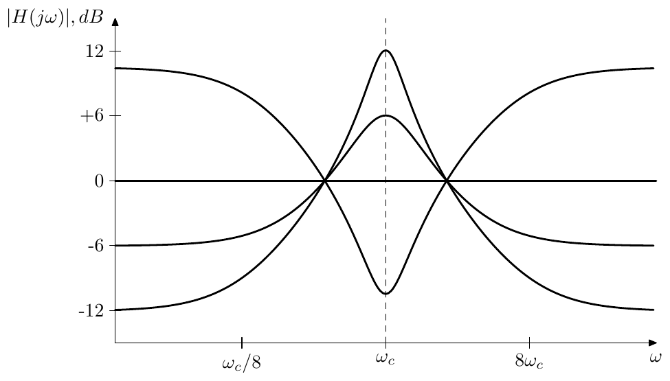

*Figure 10.11: Amplitude response of 2-pole band-tilting filter for
various $M$.*

In order to turn this filter into the band-shelving filter, apparently, we have
to divide the response by $M$:[^10]

$$
H(s) = \frac{s^2+M^{-2}\cdot 2RMs+1}{s^2+2RMs+1} =
$$

$$
= H_{\text{LP}}(s)+M^{-2}H_{\text{BP1}}(s)+H_{\text{HP}}(s) = 1+(M^{-2}-1)H_{\text{BP1}}(s)
$$

(mind that the SVF damping is still being equal to $RM$). Thus, the 2-pole
band-shelving filter can be implemented by mixing the (normalized) bandpass
signal to the input signal. The amplitude response at the cutoff is
$H(j) = M^{-2}$ which thereby defines the shelving gain. The desired
bandwidth of the shelving can be achieved using the properties of the LP to
BP substition, namely the formula (4.20).

It is interesting to observe that the above band-shelving transfer function
can be rewritten as

$$
H(s) = \frac{s^2+2RM^{-1}s+1}{s^2+2RMs+1} \tag{10.19}
$$

that is we have a ratio of two filters with different dampings $RM$ and
$RM^{-1}$, where the filters themselves could be lowpass, highpass or bandpass
(the important thing being that they have identical numerators, which then
cancel each other).

### Band shelving of higher orders

The band-shelving Butterworth filter of the 2nd kind is obtained by applying
the Butterworth transformation to the 2-pole band-shelving filter (10.19):

$$
H(s) = \frac{s^2+2RM^{-1}s+1}{s^2+2RMs+1}
$$

Thus we have a ratio of two 2nd order polynomials both having unit cutoff
but different damping. Applying the Butterworth transformation we therefore
obtain a cascade of 2nd-order sections with unit cutoff:

$$
H'(s) = \prod_n \frac{s^2+2R_n's+1}{s^2+2R_ns+1}
$$

Apparently each such 2nd-order section is a 2-pole bandshelving filter with
the shelving boost and the bandwidth defined by the parametrs $R_n$ and
$R_n'$. Fig. 10.12 shows the amplitude response.

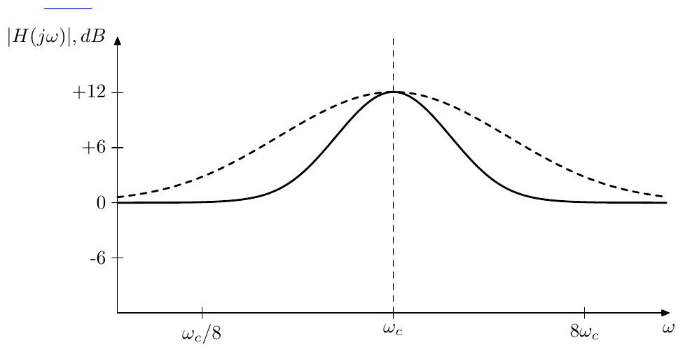

*Figure 10.12: 4th order band-shelving Butterworth filter of the 2nd
kind vs. 2nd order band-shelving filter (dashed line).*

Another kind of band-shelving filter can be obtained by applying the LP
to BP substitution to a Butterworth low-shelving filter of the 2nd kind. A
useful feature of this approach is that by choosing the order of the low-shelving
filter (and thus choosing the steepness of the low-shelving filter's slope) one can
choose the steepness of the slopes of the band-shelving filter.

## 10.7 Elliptic shelving

We have mentioned that the mixing approach of (10.12) can be applied to
EMQF filters. Of all equations (10.13) it's probably easiest to use (10.13a) to
construct a high-shelving filter, the other filters can be derived from it in a
trivial way. As (10.13a) is a monotonic mapping of the range $[0,+\infty]$ of
$\bar f^2$ onto the range of $|H_{\text{HS}}(j\omega)|$ contained between 1 and $\beta^2$, we are
going to have $|H_{\text{HS}}(j\omega)|$ smoothly varying from 1 to $\beta^2$ as $\bar R_N$ varies
from 0 to $\infty$, just with some ripples in the pass and shelving bands.

Letting $\bar f(\omega) = \bar R_N(\omega)$ in (10.13a):

$$
|H_{\text{HS}}(j\omega)|^2 = \frac{1+\beta^2\bar R_N^2(\omega)}{1+\beta^{-2}\bar R_N^2(\omega)} \tag{10.20}
$$

we obtain the amplitude response shown in Fig. 10.13. Notice that due to the
monotonic nature of the mapping (10.13a) the pass and shelving band ripples
do not oscillate around the *reference gains* 1 and $\beta^2$ (corresponding to
$\bar R_N = 0$ and $\bar R_N = \infty$), but are rather occurring "into the inside" of the
range between 1 and $\beta^2$.

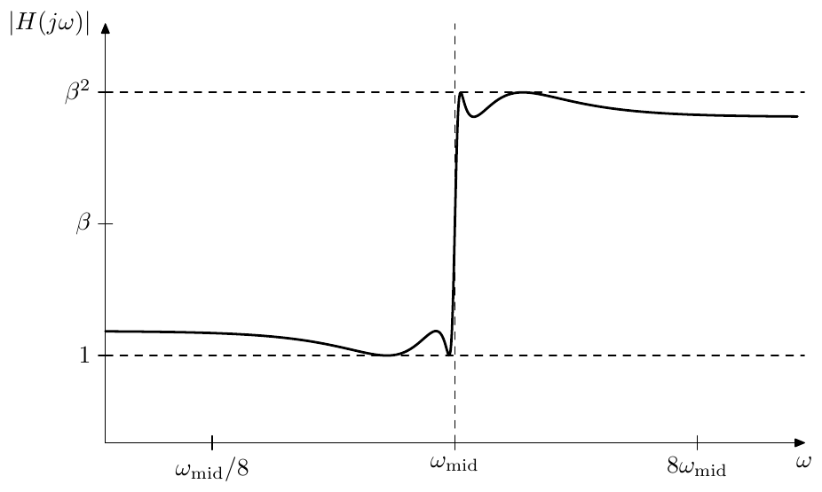

*Figure 10.13: Amplitude response of an elliptic high-shelving filter.
Horizontal dashed lines denote the reference gains 1 and $\beta^2$.*

### Implementation

From (10.20) we obtain the pole and zero equations for $H_{\text{HS}}(s)$:

$$
1+\beta^{-2}\bar R_N^2(\omega) = 0 \tag{10.21a}
$$

$$
1+\beta^2\bar R_N^2(\omega) = 0 \tag{10.21b}
$$

where we ignore the poles of $\bar R_N$, since they cancel each other within
$H_{\text{HS}}(s)$ anyway. The equations (10.21) are essentially identical to (9.152),
where we let $\lambda = 1$ and $\varepsilon = \beta^{-1}$ or $\varepsilon = \beta$ respectively.[^11]

Having obtained the poles and zeros we can define the leading gain coefficient
$g$ of the cascade form (8.1) from the requirement

$$
H(0) = \sqrt{\frac{1+\beta^2\bar R_N^2(0)}{1+\beta^{-2}\bar R_N^2(0)}} = \sqrt{\frac{1+\beta^2(\operatorname{Re}j^N)^2\tilde k}{1+\beta^{-2}(\operatorname{Re}j^N)^2\tilde k}}
$$

We could also use a simpler requirement:

$$
|H(j)| = \beta
$$

however we should mind the possibility of accidentally obtaining a $180^\circ$ phase
response at $\omega = 0$.

### Control parameters

In order to compute the passband ($\omega \ll 1$) ripple amplitude, we can notice
that in the passband the value of $\bar R^2(\omega)$ varies between 0 and $\tilde k$. By
(10.20) the maximum deviation from the reference gain 1 will be at the gain
equal to

$$
\delta = \sqrt{\frac{1+\beta^2\tilde k}{1+\beta^{-2}\tilde k}} \tag{10.22}
$$

thus in the passband $|H_{\text{HS}}(j\omega)|$ varies between 1 and $\delta$. If $\beta > 1$ then
$\delta > 1$ and vice versa. By the reciprocal symmetry (10.5) the deviation from
the shelving band's reference gain $\beta^2$ is the same, just in the opposite
direction, thus in the shelving band $|H_{\text{HS}}(j\omega)|$ varies between $\beta^2$ and
$\beta^2/\delta$.

From (10.22) it's easy to notice that reciprocating $\beta$ reciprocates $\delta$ and
vice versa. Therefore without loss of generality, for the sake of simplicity we
can restrict the discussion to $\beta \ge 1$, $\delta \ge 1$, in which case the passband
ripples occcur within $[1,\delta]$ and the shelving band ripples occur within
$[\beta^2/\delta,\beta^2]$. The case of $\beta \le 1$, $\delta \le 1$ will follow automatically, where
the ripple ranges will be $[\delta,1]$ and $[\beta^2,\beta^2/\delta]$ respectively.

Recall that the value of $\tilde k$ grows simultaneously with $k$, where the
latter is defining the elliptic transition band $[\sqrt{k},1/\sqrt{k}]$. Thus we are
having three user-facing parameters, each of those being independently related
to its respective variable:[^12]

Transition bandwidth: $\tilde k$
Shelving gain: $\beta$
Ripple amplitude: $\delta$

where the dependency between the three variables is given by (10.22).

Apparently at fixed $\tilde k > 0$ the value of $\delta$ grows with $\beta$ and vice
versa. At fixed $\beta > 1$, the value of $\delta$ grows with $\tilde k$ and vice versa. At
fixed $\delta > 1$, the values of $\beta$ and $k$ change in opposite directions. Thus,
if e.g. we want a smaller transition band, this means we want larger $k$ and
larger $\tilde k$, which means larger $\delta$ (given a fixed $\beta$). This means there is a
tradeoff between the transition bandwidth (which we usually want small) and
the ripple amplitude (which we also usually want small). There are similar
tradeoffs between the other two pairs of the user-facing parameters.

Given any two of the three parameters, we can find the third one from
(10.22). The explicit expressions for $\beta$ and $\tilde k$ can be obtained by
transforming (10.22) to

$$
1+\beta^2\tilde k = \delta^2+\beta^{-2}\tilde k\delta^2
$$

$$
\beta^2+\beta^4\tilde k = \beta^2\delta^2+\tilde k\delta^2
$$

from where on one hand

$$
\beta^4\tilde k-(\delta^2-1)\beta^2-\tilde k\delta^2 = 0
$$

$$
\beta^2 = \frac{\delta^2-1}{2\tilde k}+\sqrt{\left(\frac{\delta^2-1}{2\tilde k}\right)^2+\delta^2} \tag{10.23}
$$

(where apparently the restriction is $\delta \ge 1$), on the other hand

$$
(\beta^4-\delta^2)\tilde k = \beta^2(\delta^2-1)
$$

$$
\tilde k = \beta^2\frac{\delta^2-1}{\beta^4-\delta^2} \tag{10.24}
$$

(where $1 \le \delta < \beta$ will ensure $0 < \tilde k < 1$) and $k$ can be obtained by
(9.138).

At $\beta = 1$ the formula (10.24) doesn't work, since the amplitude response
of $H_{\text{HS}}$ is simply a horizontal line at unity gain and any of the values of
$\tilde k$ will do. Respectively at $\tilde k = 0$ the formula (10.23) doesn't work, since
$\delta$ must be equal to 1 in this case.

Notably, since (10.22) works equally well for $\beta < 1$ and $\delta < 1$, so do
(10.23) (under the restriction $\delta \le 1$) and (10.24) (under the restriction
$\beta < \delta \le 1$). In practice the numerical evaluation of (10.23) for $\delta < 1$
could raise concerns of potential precision losses, therefore it's better to apply
(10.23) to the reciprocal value of $\delta$, which is larger than 1, and then
reciprocate the result once again.

### Steepness control

As with 2nd kind Butterworth shelving filters, we would like to be able to
estimate the logarithmic midslope steepness of the elliptic shelving filter.
Evaluating the following derivative at $x = 0$, by (10.20) we have

$$
\frac{d}{dx}\ln|H_{\text{HS}}(je^x)|\bigg|_{x=0} = \frac{d}{2\,dx}\ln|H_{\text{HS}}(je^x)|^2 = \frac{d}{2\,dx}\ln\frac{1+\beta^2\bar R_N^2(e^x)}{1+\beta^{-2}\bar R_N^2(e^x)} =
$$

$$
= \frac{d}{2\,dx}\left(\ln\left(1+\beta^2\bar R_N^2(e^x)\right)-\ln\left(1+\beta^{-2}\bar R_N^2(e^x)\right)\right) =
$$

$$
= \frac{1}{2}\left(\frac{2\beta^2\bar R_N(e^x)\bar R_N'(e^x)e^x}{1+\beta^2\bar R_N^2(e^x)}-\frac{2\beta^{-2}\bar R_N(e^x)\bar R_N'(e^x)e^x}{1+\beta^{-2}\bar R_N^2(e^x)}\right) =
$$

$$
= \frac{\beta^2\bar R_N'(1)}{1+\beta^2}-\frac{\beta^{-2}\bar R_N'(1)}{1+\beta^{-2}} = \left(\frac{\beta^2}{1+\beta^2}-\frac{\beta^{-2}}{1+\beta^{-2}}\right)\bar R_N'(1) =
$$

$$
= \frac{\beta^2(1+\beta^{-2})-\beta^{-2}(1+\beta^2)}{(1+\beta^2)(1+\beta^{-2})}\bar R_N'(1) = \frac{\beta^2-\beta^{-2}}{\beta^2+2+\beta^{-2}}\bar R_N'(1) =
$$

$$
= \frac{\beta^2-\beta^{-2}}{(\beta+\beta^{-1})^2}\bar R_N'(1) = \frac{\beta-\beta^{-1}}{\beta+\beta^{-1}}\bar R_N'(1) \tag{10.25}
$$

Recalling the formulas (9.145), (9.150) and Fig. 9.61, we find that, as
expected, steepness grows with $k$ and $N$. Unfortunately, differently from the
2nd kind Butterworth case, the expression (10.25) (or, specifically, (9.145)) is
not easily invertible as a function of $k$, which means we cannot easily find $k$
from the desired slope steepness. However, for each given $N$ this function's
inverse can be tabulated and we could use the midslope steepness instead of
transition bandwidth as a control parameter.

### Centered ripples

If we allow equiripples in the pass and shelving bands, it would be reasonable
to require that these equiripples are not unipolar but rather centered around
the required reference gains of these bands. We are going now to derive the
respective formulas, which will be slightly simpler to do in terms of the
tilting filter:

$$
|H_{\text{tilt}}(j\omega)|^2 = \beta^{-2}\frac{1+\beta^2\bar R_N^2(\omega)}{1+\beta^{-2}\bar R_N^2(\omega)}
$$

where again, for simplicity of discussion, without loss of generality we will
assume $\beta \ge 1$, $\delta \ge 1$.

As a first step, we shall define the new reference gains, corresponding to
the logarithmic centers of the equiripples. Since the left shelving band ripples
occur within $[\beta^{-1},\beta^{-1}\delta]$, their logarithmic center is at $\beta^{-1}\sqrt{\delta}$.
Similarly, since the right shelving band ripples occur within $[\beta/\delta,\beta]$, their
logarithmic center is at $\beta/\sqrt{\delta}$. Therefore we introduce $\tilde\beta = \beta/\sqrt{\delta}$
and the new reference gains $\tilde\beta^{-1}$ and $\tilde\beta$ at the logarithmic centers of
the equiripple ranges (Fig. 10.14).

We want to use $\tilde\beta$ instead of $\beta$ as one of the three control parameters.
Since the entire framework of elliptic shelving filters has been developed in
terms of $k$, $\beta$ and $\delta$, we'll need to be able to convert from $\tilde\beta$ to $\beta$.
At the first sight this seems to be trivially done by $\beta = \tilde\beta\sqrt{\delta}$, however
this can be done only if we know $\delta$.

Recall that we have three control parameters $\tilde k$, $\beta$ and $\delta$ but only two
freedom degrees, which means that we can specify only two of the three
parameters, while the third parameter needs to be found by the respective
relations. Similarly, if the three control parameters are now $\tilde k$, $\tilde\beta$ and
$\delta$, we are going to specify only two of them. So, if we specify $\tilde\beta$ and $\delta$,
then indeed we can simply find $\beta = \tilde\beta\sqrt{\delta}$ and then find $\tilde k$ by (10.24).
Specifying $\tilde k$ and $\delta$ is apparently the same as before and doesn't pose any
new probleems. However there is yet an option of specifying $\tilde k$ and $\tilde\beta$, in
which case we need to find either $\beta$ or $\delta$, so that the other variable can be
found from (10.23) or (10.22).

Let's find $\beta$. Substituting the equation (10.22) into $\beta = \tilde\beta\sqrt{\delta}$ we
obtain

$$
\beta^4 = \tilde\beta^4 \cdot \frac{1+\beta^2\tilde k}{1+\beta^{-2}\tilde k}
$$

$$
\beta^4+\tilde k\beta^2 = \tilde\beta^4+\tilde k\tilde\beta^4\beta^2
$$

$$
\beta^4-\tilde k(\tilde\beta^4-1)\beta^2-\tilde\beta^4 = 0
$$

$$
\beta^2 = \tilde k\frac{\tilde\beta^4-1}{2}+\sqrt{\left(\tilde k\frac{\tilde\beta^4-1}{2}\right)^2+\tilde\beta^4} \tag{10.26}
$$

Similarly to (10.23), formula (10.26) also works for $\beta \le 1$, $\delta \le 1$, but due
to numeric reasons in this case it's better to apply it to the reciprocal $\delta$ and
then reciprocate the result.

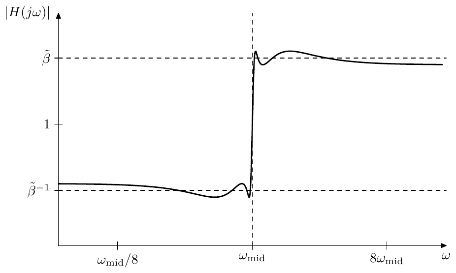

*Figure 10.14: Centered reference gains $\tilde\beta^{-1}$ and $\tilde\beta$ of an elliptic
tilting filter.*

Thus we have developed a way to express the tilting filter in terms of the
centered reference gains $\beta^{-1}$ and $\beta$ by converting from $\tilde\beta$ to $\beta$ either
by $\beta = \tilde\beta\sqrt{\delta}$ or by (10.26). For the high- and low-shelving filters one
needs to additionally take into account that the new reference gains imply
different multiplication factors for conversion from tilting to the respective
shelving factors:

$$
\begin{aligned}
H_{\text{HS}}(s) &= \tilde\beta \cdot H_{\text{tilt}}(s) \\
H_{\text{LS}}(s) &= \tilde\beta^{-1} \cdot H_{\text{tilt}}(s)
\end{aligned}
$$

so that the centered passband reference gain is at 1 and the centered
shelving reference gain is at $\tilde\beta^2$ or $\tilde\beta^{-1}$ respectively.

### Relation to Butterworth shelving

At $k = 0$ we have $\bar R_N(x) = x^N$ and the elliptic shelving filters turn into
respective 1st-kind Butterworth shelving filters. However also notice that a
2nd-kind Butterworth shelving filter of order $N$ at $R = 1/\sqrt{2}$ is equal to
the 1st-kind Butteworth shelving of the same order, which in turn is equal to
the elliptic shelving filter of the same order at $k = 0$. That is at
$R = 1/\sqrt{2}$ and $k = 0$ all three kinds of shelving filters coincide.[^13]

In that sense elliptic shelving can be seen as another way of extending the
2nd-kind Butterworth variable-slope shelving into the range beyond
$R = 1/\sqrt{2}$. Instead of reducing $R$ below $1/\sqrt{2}$ (which would result in
one large resonance peak in each of the pass and/or shelving bands), we could
switch to the elliptic filter parameters[^14] obtaining a number of smaller
equiripples. This particularly means that in the wide-range slope technique
described in Section 10.5 instead of increasing the filter order at
$R = 1/\sqrt{2}$ we could switch to elliptic equations (if we are willing to accept
the ripples).

At $N = 2$ however there is essentially no difference between 2nd-kind
Butterworth shelving at $R \le 1/\sqrt{2}$ and elliptic shelving, except for
different formal control parameters. Indeed, both filters have two poles and
two zeros which are mutually reciprocal and are also having conjugate
symmetry. This leaves only two degrees of freedom, one degree corresponds to
choosing the cutoff of the poles (which simultaneously defines the cutoff of the
zeros as the reciprocal value of the poles cutoff) the other degree being the
damping of the poles (which simultaneously defines the damping of the zeros
as both dampings must be equal). However the first degree of freedom is
taken by controlling the shelving gain and the second degree of freedom is
taken by varying the $R$ or the $k$ parameter respectively. Thus the difference
between the two filters can be only in how the control parameters are
translated to the transfer function and in the leading gain coefficients of the
transfer functions (where we would have $|H_{\text{HS}}(0)| = 1$ in the Butterworth
case and $|H_{\text{HS}}(0)| = \delta$ in the elliptic case).

### Combining with other techniques

Elliptic design of shelving filters can be combined with other design
techniques. Particulary, we can apply the LP to BP transformation to an
elliptic low-shelving filter to obtain an elliptic band-shelving filter.

In principle one also could apply Butterworth transformation to elliptic
filters to increase the slope steepness. However, since we are already having
ripples in the pass and shelving bands, it would be more efficient to simply
increase the order of elliptic filter, thereby attaining higher slope steepnesses
(compared to applying the Butterworth transformation) at the same ripple
amplitude.

## 10.8 Crossovers

Sometimes we would like to process different frequency bands of a signal
differently. In the simplest case we would want to split the signal into low-
and high-frequency parts, process one of them or both in some way and then
merge
them back (Fig. 10.15). This kind of filters, splitting the signal into different
frequency bands are called *crossovers*.

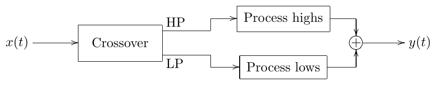

*Figure 10.15: The crosssover idea.*

In principle we could take any a pair of lowpass and highpass filters to
build a crossover, but some combinations would work better than the others.
Particularly, imagine that the processing of different bands changes the signals
very slightly, or sometimes maybe even doesn't change them at all. In that case
it would be really nice if the original signal was unaltered by the structure in
Fig. 10.15, that is $y(t) = x(t)$. However, this naturally expected property will
not be given for granted.

Suppose we use a multimode 1-pole as a crossover basis, in which case the
low- and high-pass filters share the same cutoff. Without loss of generality we
could let $\omega_c = 1$ (in other words, the *crossover frequency* will be at $\omega = 1$):

$$
H_{LP}(s) = \frac{1}{1+s}
$$

$$
H_{HP}(s) = \frac{s}{1+s}
$$

Adding low- and high-pass transfer functions we have

$$
H(s) = H_{LP}(s) + H_{HP}(s) = \frac{1}{1+s} + \frac{s}{1+s} = 1
$$

Thus, if the low- and high-pass signals are unmodified by the processing, adding
them together at the end of the network in Fig. 10.15 would restore the original
signal exactly.

However the same doesn't hold anymore for 2-poles:

$$
H_{LP}(s) = \frac{1}{1+2Rs+s^2}
$$

$$
H_{HP}(s) = \frac{s^2}{1+2Rs+s^2}
$$

in which case we have

$$
H(s) = H_{LP}(s) + H_{HP}(s) = \frac{s^2+1}{s^2+2Rs+1} \neq 1
$$

In fact, as we may recall, the above $H(s)$ is a notch filter. Of course, we could
add the missing bandpass component, e.g. splitting it equally between the low-
and high-bands:

$$
\frac{1+Rs}{1+2Rs+s^2} + \frac{s^2+Rs}{1+2Rs+s^2} = 1
$$

but then the rolloff of the resulting low- and high-pass filters becomes 6dB/oct
instead of former 12dB/oct, leading to the question, why using such 2-pole in
the first place when a 1-pole would have done similarly.

### Butterworth crossovers

If we relax the requirement of the sum of unprocessed signals being exactly
equal to the original signal and allow a phase shift in the sum, while retaining
the amplitudes, we essentially require that the low- and high-passes should add
to an allpass:

$$
|H(s)| = |H_{LP}(s) + H_{HP}(s)| = 1
$$

Let's take (1st kind) Butterworth low- and high-passes at the same cutoff $\omega_c = 1$:

$$
H_{LP}(s) = \frac{1}{P(s)}
$$

$$
H_{HP}(s) = \frac{s^N}{P(s)}
$$

where $N$ is the filter order and $P(s)$ denotes the common denominator of $H_{LP}(s)$
and $H_{HP}(s)$. Remember that the denominator $P(s)$ is defined by the equation

$$
|P(j\omega)|^2 = 1 + \omega^{2N}
$$

while all roots of $P(s)$ must lie in the left complex semiplane.

Adding the low- and high-passes together we obtain

$$
H(s) = H_{LP}(s) + H_{HP}(s) = \frac{1}{P(s)} + \frac{s^N}{P(s)} = \frac{1+s^N}{P(s)}
$$

Assuming $N$ is odd, for $s = j\omega$ we get

$$
|H(j\omega)|^2 = \left|\frac{1+(j\omega)^N}{P(j\omega)}\right|^2 = \frac{1+\omega^{2N}}{|P(j\omega)|^2} = 1 \qquad (N \text{ odd})
$$

Notably, the same property holds for the difference of Butterworth low- and
high-passes of odd order

$$
|H_{LP}(s) - H_{HP}(s)|^2 = \left|\frac{1-(j\omega)^N}{P(j\omega)}\right|^2 = \frac{1+\omega^{2N}}{|P(j\omega)|^2} = 1 \qquad (N \text{ odd})
$$

For an even order however $1 \pm s^N$ becomes purely real for $s = j\omega$

$$
1 \pm s^N = 1 \pm j^N\omega^N = 1 \pm (-1)^{N/2}\omega^N
$$

and we get either a zero at $\omega = 1$ if the above gets the form $1 - \omega^N$, or, if it
gets the form $1 + \omega^N$ then

$$
|H(j\omega)|^2 = \left|\frac{1+(j\omega)^N}{P(j\omega)}\right|^2 = \frac{(1+\omega^N)^2}{1+\omega^{2N}} = \frac{1+2\omega^N+\omega^{2N}}{1+\omega^{2N}} =
$$

$$
= 1 + \frac{2\omega^N}{1+\omega^{2N}} = 1 + \left(\frac{1+\omega^{2N}}{2\omega^N}\right)^{-1} = 1 + 2\left(\omega^N + \frac{1}{\omega^N}\right)^{-1}
$$

Apparently the expression in parentheses is symmetric in logarithmic scale
around $\omega = 1$ and attains a minumum at this point, respectively $|H(j\omega)|^2$
attains a maximum, which we can evaluate by substituting $\omega = 1$, obtaining
$|H(j)|^2 = 2$. Respectively $|H(j)| = \sqrt{2}$ thus the amplitude response of $H(s)$
has a +3dB bump at $\omega = 1$.

As both $H_{LP}(s)$ and $H_{HP}(s)$ share the same denominator, they can be implemented
by a single generalized SVF (the controllable canonical form in Fig. 8.1)
using the modal outputs for the numerators 1 and $s^N$ respectively. Alternatively
one could use multimode features of the serial cascade representation. Parallel
representation is also possible, where we would pick up different modal mixtures
of the same parallel 2-poles as the low- and high-pass signal respectively.

### Linkwitz-Riley crossovers

If instead of Butterworth lowpass and highpass filters we take squared Butterworth filters:

$$
H(s) = H_1(s) + H_2(s)
$$

$$
H_1(s) = H_{LP}^2(s) = \left(\frac{1}{P(s)}\right)^2
$$

$$
H_2(s) = (-1)^N H_{HP}^2(s) = (-1)^N \left(\frac{s^N}{P(s)}\right)^2
$$

$$
|P(j\omega)|^2 = 1 + \omega^{2N}
$$

(notice the conditional inversion of the squared highpass signal) we do obtain a
perfect allpass $H(s)$ for any $N$:

$$
\begin{aligned}
H(j\omega) &= H_1(j\omega) + H_2(j\omega) = \frac{1}{P^2(j\omega)} + (-1)^N \frac{(j\omega)^{2N}}{P^2(j\omega)} = \\
&= \frac{1+(-1)^N j^{2N}\omega^{2N}}{P^2(j\omega)} = \frac{1+\omega^{2N}}{P^2(j\omega)} = \frac{P(j\omega)P(-j\omega)}{P^2(j\omega)} = \frac{P(-j\omega)}{P(j\omega)}
\end{aligned} \tag{10.27}
$$

and thus, since $P(j\omega)$ is Hermitian, $|H(j\omega)| = 1$. A crossover designed in this
way is referred to as *Linkwitz-Riley crossover*. Since the denominators in (10.27)
are identical, we again can use a shared structure, such as a generalized SVF or
a multimode serial cascase to produce the output signals of both $H_1$ and $H_2$.
The parallel representation is problematic, since we are now having repeated
poles due to the squaring of the denominators.[^15]

Note that the phase responses of $H_1(s)$ and $H_2(s)$ are identical, since the
phase contributions of their numerators are zero, while the phase contributions
of their denominators are identical. This in-phase relationship of the split bands
is the key feature of Linkwitz-Riley crossovers[^16] (contrary to the somewhat
common opinion that the key feature of Linkwitz-Riley crossovers is the absence
of the +3dB bump, which, as we have seen is also e.g. the case with odd-order
Butterworth crossovers).

The in-phase relationship actually also includes $H(s)$:

$$
\arg H_1(j\omega) = \arg H_2(j\omega) = \arg H(j\omega)
$$

Indeed

$$
\arg H(j\omega) = \arg P(-j\omega) - \arg P(j\omega) = -2\arg P(j\omega) = \arg \frac{1}{P^2(j\omega)}
$$

where we used the Hermitian property of $P(j\omega)$.

### Generalized Linkwitz-Riley crossovers

The Linkwitz-Riley design consisting of two squared Butterworth filters is a
special case of a more generic idea which we will discuss below.[^17]

First we need a kind of auxiliary lemma. Let $Q(s)$ be a real polynomial of
$s$. We now state that the formal frequency response $Q(j\omega)$ is real nonnegative
if and only if $Q(s)$ can be written in the form $Q(s) = P(s)P(-s)$, where $P(s)$
is some other real polynomial of $s$. The proof goes like follows.

Suppose $Q(s) = P(s)P(-s)$. Then for $\omega \in \mathbb{R}$

$$
Q(j\omega) = P(j\omega)P(-j\omega) = P(j\omega)P((j\omega)^*) = P(j\omega)P^*(j\omega) = |P(j\omega)|^2 \geq 0
$$

Conversely, suppose $Q(j\omega) \geq 0$. Since $Q(j\omega)$ is simultaneously real and
Hermitian, it must be even, and so must be $Q(s)$. Therefore it can be factored
into $Q(s) = P(s)P(-s)$. Let's chose $P(s)$ to contain the left complex semiplane
roots of $Q(s)$, thereby $P(-s)$ will contain the right complex semiplane roots. If
$Q(s)$ has roots on the imaginary axis, these roots will all have even multiplicities
(since otherwise $Q(j\omega)$ will be changing sign at these points) and therefore we
can split these roots into two identical halves, which we assign to $P(s)$ and
$P(-s)$ respectively. Since $Q(s)$ is real, its poles are conjugate symmetric and
so will be the poles of $P(s)$ and $P(-s)$.

We still need to show that the leading coefficient of $P(s)$ will be real. Let $g$
denote the leading coefficient of $P$. Then the leading term of $Q(s) = P(s)P(-s)$
is $gs^N g(-s)^N = (-1)^N g^2 s^{2N}$. By substituting $s = j\omega$ we obtain the leading
term of $Q(j\omega)$, which is $(-1)^N g^2 (j\omega)^{2N} = (-1)^N g^2 (-1)^N \omega^{2N} = g^2 \omega^{2N}$. However
the coefficient $g^2$ of the leading term $g^2\omega^{2N}$ of $Q(j\omega)$ must be positive,
otherwise $Q(j\omega)$ would become negative at large $\omega$. Since $g^2$ is positive, $g$ is
real. That completes the proof.

Now, given two real polynomials $Q_1(s)$ and $Q_2(s)$ with real nonnegative
frequency responses, we can construct a third real polynomial as their sum

$$
Q_1(s) + Q_2(s) = Q(s) \tag{10.28}
$$

Since the frequency responses of $Q_1(s)$ and $Q_2(s)$ are nonnegative, so is the
frequency response of $Q(s)$. By the previous discussion, the above equation can
be rewritten as

$$
P_1(s)P_1(-s) + P_2(s)P_2(-s) = P(s)P(-s) \tag{10.29}
$$

Dividing both sides by the right-hand side, we obtain

$$
\frac{P_1(s)P_1(-s)}{P(s)P(-s)} + \frac{P_2(s)P_2(-s)}{P(s)P(-s)} = 1 \tag{10.30}
$$

We wish to interpret the two terms in the left-hand side as transfer functions.
However, these functions are not stable, since the roots of $P(-s)$ are lying in
the right semiplane. We can however multiply both parts by $P(-s)/P(s)$:

$$
\frac{P_1(s)P_1(-s)}{P^2(s)} + \frac{P_2(s)P_2(-s)}{P^2(s)} = \frac{P(-s)}{P(s)} \tag{10.31}
$$

thereby making both filters stable and turning the right-hand side into an (also
stable) allpass. Also notice that the orders of $P_1(s)$ and $P_2(s)$ do not exceed
the order of $P(s)$, therefore the terms of (10.31) are nonstrictly proper rational
functions of $s$, as required for transfer functions of (integrator-based) differential
filters. Introducing

$$
H_1(s) = \frac{P_1(s)}{P(s)} \cdot \frac{P_1(-s)}{P(s)} \tag{10.32a}
$$

$$
H_2(s) = \frac{P_2(s)}{P(s)} \cdot \frac{P_2(-s)}{P(s)} \tag{10.32b}
$$

$$
H_{AP}(s) = \frac{P(-s)}{P(s)} \tag{10.32c}
$$

we rewrite (10.31) as

$$
H_1(s) + H_2(s) = H_{AP}(s) \tag{10.33}
$$

and thus we have built a crossover (provided $H_1(s)$ is a kind of a lowpass and
$H_2(s)$ is a kind of a highpass). Again, the denominators are identical and we
can use a shared structure for $H_1$ and $H_2$.

Notice that (10.33) is simply (10.28) divided by $P^2(s)$. The phase responses
of all terms of (10.28) are apparently zero, therefore the phase responses of all
terms of (10.33) are identical and simply equal to $-2\arg P(j\omega)$:

$$
\arg H_1(j\omega) = \arg H_2(j\omega) = \arg H(j\omega) = -2\arg P(j\omega)
$$

The identical phase responses, as we should remember, are the key feature
of Linkwitz-Riley crossover design, thus we have built a kind of generalized
Linkwitz-Riley crossover.

The identical phase responses of $H_1$, $H_2$ and $H_{AP}$ also allow to rewrite
(10.33) in terms of amplitude responses:

$$
|H_1(s)| + |H_2(s)| = 1 \tag{10.34}
$$

It is often convenient to define

$$
G_1(s) = \frac{P_1(s)}{P(s)}
$$

$$
G_2(s) = \frac{P_2(s)}{P(s)}
$$

By (10.32), $H_n(s) = G_n(s)G_n^-(s)$ where $G_n^-(s) = P_n(-s)/P(s)$. Apparently
$|H_n(j\omega)| = |G_n(j\omega)|^2$ and therefore (10.34) turns into

$$
|G_1(j\omega)|^2 + |G_2(j\omega)|^2 = 1 \tag{10.35}
$$

The interpretation in terms of $G_1$ and $G_2$ suggests another, somewhat more
practical approach to building generalized Linkwitz-Riley crossovers. We start
with a pretty much random filter $G_1(s) = P_1(s)/P(s)$, although satisfying
$|G_1(j\omega)|^2 \leq 1$, so that (10.35) can hold. From $P_1(s)$ and $P(s)$, using (10.32), we
obtain $H_1(s)$ and $H_{AP}(s)$ and can simply find $H_2(s)$ as $H_2(s) = H_{AP}(s) - H_1(s)$.
In principle, the obtained $H_2(s)$ can be used as it is, but we can also further
factor it into $H_2(s) = P_2(s)P_2(-s)/P^2(s)$ thereby obtaining $G_2(s)$.[^18] Of course,
in order for $H_1(s)$ and $H_2(s)$ to count as a "reasonable" crossover, $H_1(s)$ must
be a lowpass or lowpass-like filter (which can be ensured by choosing a lowpass-
like $G_1(s)$), and the obtained $H_2(s)$ must be highpass-like. Or the other way
around.

Alternatively we might be able to simply "guess" $H_1(s)$ and $H_2(s)$ (or, equivalently,
$P_1(s)$ and $P_2(s)$, or $G_1(s)$ and $G_2(s)$). E.g. the previously discussed Butterworth
filter-based Linkwitz-Riley crossover arises by choosing $G_1(s)$ to be a
Butterworth lowpass and $G_2(s) = G_1(1/s)$ to be a Butterworth highpass, which
gives $G_1^-(s) = G_1(s)$, $G_2^-(s) = (-1)^N G_2(s)$ and respectively $H_1(s) = G_1^2(s)$,
$H_2(s) = (-1)^N G_2^2(s)$. The same result is obtained by by choosing $P_1(s) = 1$,
$P_2(s) = s^N$ (respectively $P_1(-s) = 1$ and $P_2(-s) = (-1)^N s^N$). This gives
(10.29) in the form

$$
P(s)P(-s) = P_1(s)P_1(-s) + P_2(s)P_2(-s) = 1 + (-1)^N s^{2N}
$$

from where

$$
Q(j\omega) = 1 + \omega^{2N} = |P(j\omega)|^2 = P(j\omega)P(-j\omega)
$$

where $P(s)$ is the Butterworth denominator. The equation (10.31) respectively
takes the form

$$
\left(\frac{1}{P(s)}\right)^2 + (-1)^N \left(\frac{s^N}{P(s)}\right)^2 = \frac{P(-s)}{P(s)}
$$

which is essentially the same as (10.27).

### Symmetric generalized Linkwitz-Riley crossovers

Ideally in (10.33) we would like to have symmetric amplitude responses

$$
|H_2(j\omega)| = |H_1(j/\omega)| \tag{10.36}
$$

as it was e.g. the case with Butterworth-based Linkwitz-Riley crossover. Apparently
(10.36) is not guaranteed for an arbitrary pair of $H_1(s)$ and $H_2(s)$ which
satisfies (10.33) (where satisfying (10.33) is understood in the sense that the
sum of $H_1(s)$ and $H_2(s)$ is an allpass). We would like to find a way of obtaining
generalized Linkwitz-Riley crossovers satisfying (10.36).

Recall that (10.35) is just another intepretation of the crossover equation
(10.33). On the other hand, compare (10.35) to (10.4). By (10.4), the equation
(10.35) will be satisfied by $G_1$ and $G_2$ related through an LP to HP transformation,
if $f(1/x) = 1/f(x)$, where $f(x)$ is the function used to construct $G_1$ by
(9.18).

This is not sufficient yet, as besides satisfying (10.35) (and respectively
(10.33)), we need to have the same poles in $G_1(s)$ and $G_2(s)$, so that they
can share the same denominator $P(s)$. However we have already shown that
$G_1(s)$ and $G_2(s)$ will have the same poles if $f(1/x) = 1/f(x)$.

Therefore, in order to obtain a generalized Linkwitz-Riley crossover with
symmetric amplitude responses, we need to take $G_1(s)$ obtained from $f(x)$ satisfying
$f(1/x) = 1/f(x)$ and $G_2(s) = G_1(1/s)$.

### EMQF Linkwitz-Riley crossovers

We already know one function $f(\omega)$ satisfying $f(1/x) = 1/f(x)$: the normalized
elliptic rational function $\bar{R}_N$. Therefore EMQF filters might be a good
candidate for symmetric generalized Linkwitz-Riley crossovers. Notice that at
$k \to 0$ EMQF filters turn into Butterworth filters and we obtain a classical
(Butterworth-based) Linkwitz-Riley crossover.

Therefore let $G_1(s) = P_1(s)/P(s)$ be an EMQF (lowpass) filter and $G_2(s) =
G_1(1/s) = P_2(s)/P(s)$ be the respective highpass. Recall that the zeros of
elliptic lowpass filters are positioned on the imaginary axis in pairs symmetric
relatively to the origin, with the exception of the zero at the infinity, which
occurs if the order $N$ of the filter is odd. Therefore $P_1(s)$ can be written as

$$
P_1(s) = g_1 \cdot \prod_{\operatorname{Im} z_n > 0} (s^2 - z_n^2)
$$

which means that $P_1(-s) = (-1)^N P_1(s)$. Respectively $P_2(s)$ can be written as

$$
P_2(s) = g_2 \cdot s^{N \wedge 1} \prod_{\operatorname{Im} z_n > 0} (s^2 - 1/z_n^2)
$$

where the $s^{N \wedge 1}$ factor arises from the zero of $G_1(s)$ occuring at the infinity
which turns into a zero of $G_2(s)$ occurring at the origin. Therefore $P_2(-s) =
(-1)^N P_2(s)$.

Therefore $H_1(s) = G_1^2(s)$, $H_2(s) = (-1)^N G_2^2(s)$ and (10.33) takes the form

$$
G_1^2(s) + (-1)^N G_2^2(s) = \frac{P(-s)}{P(s)}
$$

Fig. 10.16 shows the example of amplitude responses of $H_1$ and $H_2$.

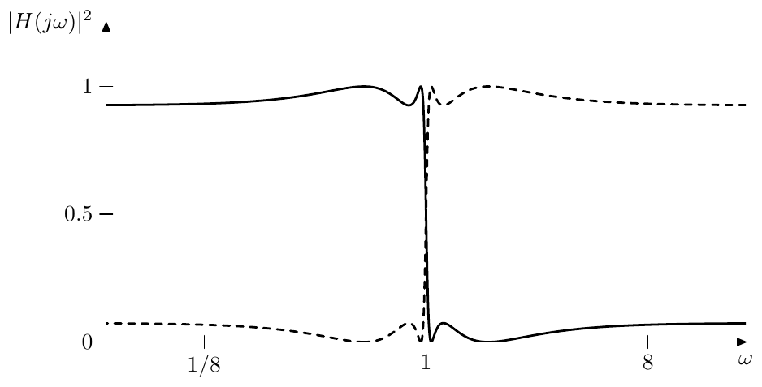

*Figure 10.16: Amplitude responses of EMQF crossover low- (solid) and high-pass (dashed) outputs.*

### Centered ripples

Next we will describe a way to further improve the amplitude response of generalized
Linkwitz-Riley crossovers. The techniques can be applied to pretty much
any generalized Linkwitz-Riley crossover, but for the sake of simpler presentation
we'll be using the EMQF crossover as an example.

Recall that the phase responses of $H_1$, $H_2$ and $H_{AP}$ are identical. Let $\varphi(\omega) =
\arg H_1(j\omega) = \arg H_2(j\omega) = \arg H_{AP}(j\omega)$ be this common phase response. Then
we can introduce the zero phase frequency response functions

$$
\bar{H}_1(j\omega) = e^{-j\varphi(\omega)} H_1(j\omega)
$$

$$
\bar{H}_2(j\omega) = e^{-j\varphi(\omega)} H_2(j\omega)
$$

$$
\bar{H}_{AP}(j\omega) = e^{-j\varphi(\omega)} H_{AP}(j\omega) \equiv 1
$$

Notice that since $\arg \bar{H}_1(j\omega) = \arg \bar{H}_2(j\omega) = \arg \bar{H}_{AP}(j\omega) = 0$, we have

$$
\bar{H}_1(j\omega) = |H_1(j\omega)|
$$

$$
\bar{H}_2(j\omega) = |H_2(j\omega)|
$$

$$
\bar{H}_{AP}(j\omega) = |H_{AP}(j\omega)| = 1
$$

That is we can consider $\bar{H}_1(j\omega)$, $\bar{H}_2(j\omega)$ and $\bar{H}_{AP}(j\omega)$ as amplitude response
functions.

We are now going to construct some linear combinations of the above zero
phase frequency responses. Since they are all related to the original frequency
responses via one and the same factor $e^{-j\varphi(\omega)}$, linear combinations of $\bar{H}_1$, $\bar{H}_2$
and $\bar{H}_{AP}$ correspond to exactly the same linear combinations of $H_1$, $H_2$ and
$H_{AP}$. E.g.

$$
\alpha \bar{H}_1(j\omega) + \beta \bar{H}_2(j\omega) = e^{-j\varphi(\omega)} \cdot (\alpha H_1(j\omega) + \beta H_2(j\omega))
$$

We can think of these linear combinations as of linear combinations of amplitude
responses, resulting in the new amplitude responses, with the reservation that
the new "amplitude responses" may become negative (which in terms of true
amplitude responses would have been interpreted as changing the phase response
by $180^\circ$).

Consider that the passband ripple amplitude of $\bar{R}_N$ is $\sqrt{\tilde{k}}$, while the stopband
ripple amplitude is $1/\sqrt{\tilde{k}}$. Respectively the passband ripples of $\bar{H}_1$ and
$\bar{H}_2$ oscillate within $[1/(1+\tilde{k}), 1]$, while the stopband ripples oscillate within
$[0, \tilde{k}/(1+\tilde{k})]$, which corresponds to the absolute maximum deviations $\tilde{k}/(1+\tilde{k})$
from the ideal values of 1 (passband) and 0 (stopband).

Note that so far the deviations are unipolar. The deviation from 1 occurs
towards zero, while the deviation from zero occurs towards 1. We could make
these deviations bipolar instead, simultaneously reducing the maximum deviation.
The (linear) midpoints of the oscillation ranges are $(\tilde{k}/2)/(1+\tilde{k})$ for
the stopband and $(1+\tilde{k}/2)/(1+\tilde{k})$ for the passband. We can take the range
$[(\tilde{k}/2)/(1+\tilde{k}), (1+\tilde{k}/2)/(1+\tilde{k})]$ between these middles and stretch it to $[0,1]$
This can be achieved by the transformation

$$
\bar{H}' = (1+\tilde{k})\bar{H} - \tilde{k}/2 = (1+\tilde{k})\bar{H} - \frac{\tilde{k}}{2} \cdot \bar{H}_{AP}
$$

which should be applied to both lowpass and highpass:

$$
\bar{H}_1' = (1+\tilde{k})\bar{H}_1 - \frac{\tilde{k}}{2} \cdot \bar{H}_{AP}
$$

$$
\bar{H}_2' = (1+\tilde{k})\bar{H}_2 - \frac{\tilde{k}}{2} \cdot \bar{H}_{AP}
$$

Thereby the deviation amplitude is multiplied by $1+\tilde{k}$, but simultaneously the
deviations become centered around the ideal values 0 and 1, which effectively
halves the deviations. Thus the deviation amplitude is effectively multiplied by
$(1+\tilde{k})/2$ becoming equal simply to $\tilde{k}/2$ (Fig. 10.17).

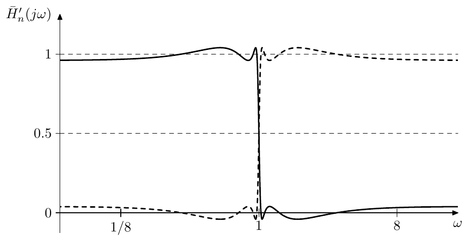

*Figure 10.17: Zero-phase frequency responses of adjusted EMQF crossover low- (solid) and high-pass (dashed) outputs.*

Multiplying the above equations by $e^{j\varphi(\omega)}$ we obtain the same transformation
for $H_1$ and $H_2$:

$$
H_1' = (1+\tilde{k})H_1 - \frac{\tilde{k}}{2} \cdot H_{AP}
$$

$$
H_2' = (1+\tilde{k})H_2 - \frac{\tilde{k}}{2} \cdot H_{AP}
$$

Note that thereby we still have

$$
H_1' + H_2' = (1+\tilde{k})H_1 + (1+\tilde{k})H_2 - \tilde{k}H_{AP} = H_{AP} + \tilde{k}H_{AP} - \tilde{k}H_{AP} = H_{AP}
$$

### Phase correction

If we need to do some processing in parallel to the crossover, then we should
keep in mind that the crossover signals are phase shifted, therefore it could be a
good idea to introduce the same phase shift into the signal which bypasses the
crossover.

At this point we will assume that the crossover is (generalized) Linkwitz-
Riley, therefore all phase shifts are identical. In this case the simplest way to
construct a phase-shifted bypass signal is by adding the LP and HP outputs of
the crossover together, which by the previous discussion should be an allpass
signal with exactly the same phase shift as in LP and HP signals (Fig. 10.18).
Notice that the LP and HP outputs of the crossover in Fig. 10.18 correspond to
the $H_1(s)$ and $H_2(s)$ transfer functions in (10.33). Particularly, if we're using a
Butterworth or an EMQF crossover, the squared HP signal needs to be inverted
for odd $N$.

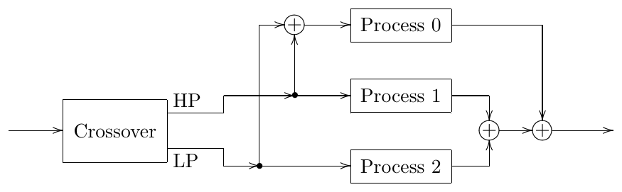

*Figure 10.18: Adjusting the phase of the bypass signal.*

The approach of Fig. 10.18 doesn't work if the bypass signal processing path
is not starting from the same point where the crossover is connected. In this
case we might need an explicit phase-correction allpass. Fig. 10.19 shows the
option of doing the phase correction prior to the processing of the bypass signal.

Rather than constructing the correction allpass following the idea of Fig. 10.18
(that is building such an allpass as another crossover with LP and HP outputs
added), it is more efficient to construct this allpass directly. Indeed, by
(10.32), given a crossover whose order is $2N$, the order of the allpass $H_{AP}(s) =
P(-s)/P(s)$ is only $N$. Therefore it is more efficient to implement the correction
allpass simply as an $N$-th order filter:

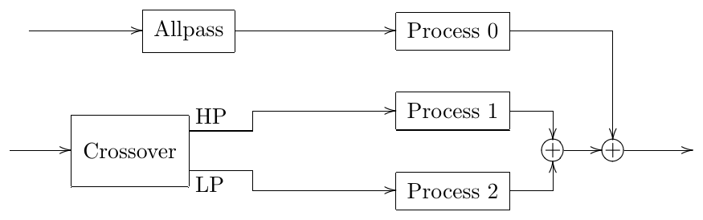

*Figure 10.19: Adjusting the phase of the signal from a different source.*

In Fig. 10.19 we could swap the order of the phase correction and the processing of the bypass signal as shown in Fig. 10.20. If the processing is nonlinear, this may result in an audible change in the sound. One could argue that the option shown in Fig. 10.20 is better, since the nonlinear processing is done on the original signal, while the allpass correction of the processing results would be usually inaudible (unless another nonlinear processor is following), and thus the bypass processing would sound pretty much identical to the one in the absence of the phase shifts. However, there is a counterargument that all other processing is done on phase-shifted signals, and it would be more consistent to do the same for the bypass signal.

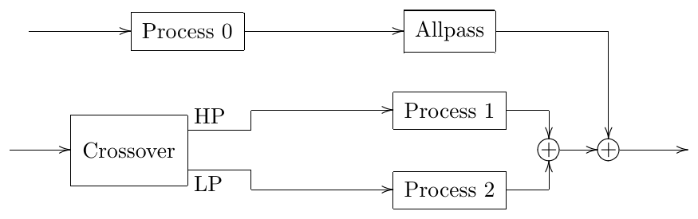

*Figure 10.20: Correction allpass at the end of processing.*

A more complicated situation arises if we want to stack the crossovers to make a multiband crossover because in this case the phase correction is needed even if there is no bypass signal. Consider Fig. 10.21, where $A_2$ denotes an allpass introducing the phase shift corresponding to the crossover $C_2$. The LP and HP outputs of the crossover $C_1$ are completely in-phase, therefore the signal going through the processor $P_1$ is, from the phase shift perspective, essentially the same as bypass signal of the crossover $C_2$ and thus needs phase correction equivalent to the phase contribution of $C_2$. Or, looking from a slightly different angle, the input signals of processors $P_2$ and $P_3$ contain phase shifts from both crossovers, while the input signal of processor $P_1$ contains the phase shift only from the first crossover and thus needs an additional phase shift by $A_2$.

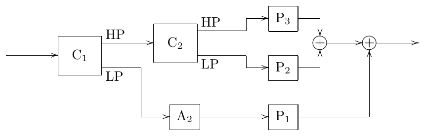

*Figure 10.21: Phase correction in 3-way crossover mixing.*

If the bypass signal processing is present, we could modify the structure of Fig. 10.21 as shown in Fig. 10.22. An alternative option is presented in Fig. 10.23 and yet another option (requiring one more corection allpass) in Fig. 10.24. Notice that Fig. 10.22 does all phase shifting at the beginning and Fig. 10.24 does all phase shifting at the end, while the structure in Fig. 10.23 is a kind of in-between mixture of Fig. 10.22 and Fig. 10.24. These ideas generalize by induction to higher numbers of bands, where in Fig. 10.22 we'll be adding new crossover-allpass pairs on the left, whereas in Fig. 10.24 we would be adding crossovers on the left and allpasses on the right.

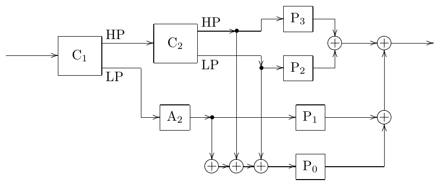

*Figure 10.22: Phase correction of bypass signal in 3-way crossover mixing.*

In four-way crossover mixing there are new options, e.g. there is a symmetric band splitting option shown in Fig. 10.25. However practically it is not much different from the approach of Fig. 10.22 generalized to 4 bands, since the total phase shifts in the input signals of all processing units contain the total sums of the phase shifts associated with all crossovers in either case.

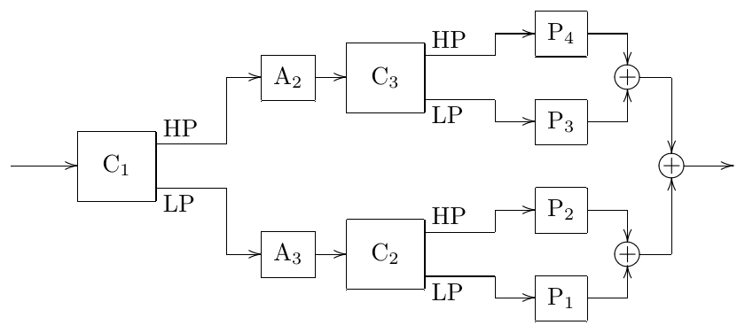

*Figure 10.25: Symmetric 4-way crossover.*

Note that in Fig. 10.25 one could also wish to replace the allpasses $A_2$ and $A_3$ with a single allpass $A_{23}$ in one of the paths, which just corrects the difference between the phase responses of $C_2$ and $C_3$. This is however not possible. Indeed,
assuming identical orders of $C_2$ and $C_3$, their phase responses are identical at each of the points $\omega = 0$ and $\omega = \infty$. Therefore the phase response of $A_{23}$ must be equal to zero at both $\omega = 0$ and $\omega = \infty$. But this is not possible for a differential allpass.[^19] The argument becomes somewhat more complicated if the crossovers are allowed to have different orders, where one would need to consider the factored forms of $A_2$ and $A_3$, essentially reaching the same conclusion.

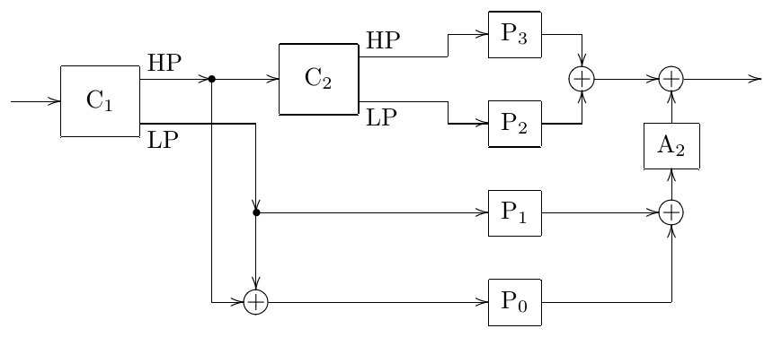

*Figure 10.23: Another way of phase correction of bypass signal in 3-way crossover mixing.*

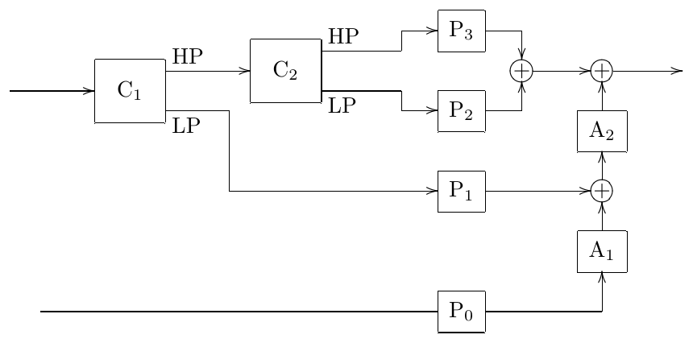

*Figure 10.24: 3-way crossover mixing with all phase correction done at the end.*

## 10.9 Even/odd allpass decomposition

Suppose we are given a filter $H(s)$ defined by (9.18). In this section we are going to show that $H(s)$ is expressible as a linear combination of the "even" and "odd" allpasses, that is allpasses based on the even and odd poles of $H(s)$.

Recall that we have defined even poles as solutions of $f = j$ (or equivalently $1 + jf = 0$) and odd poles as solutions of $f = -j$ (or equivalently $1 - jf = 0$). Let's introduce the following notation:

$$
\begin{aligned}
(1+jf)_- &= \prod_{\substack{1+jf(-jp_n)=0 \\ \operatorname{Re} p_n < 0}} (s - p_n) \\
(1+jf)_+ &= \prod_{\substack{1+jf(-jp_n)=0 \\ \operatorname{Re} p_n > 0}} (s - p_n) \\
(1+jf)_\pm &= \prod_{1+jf(-jp_n)=0} (s - p_n) = (1+jf)_+ (1+jf)_-
\end{aligned}
$$

that is the product is being taken over all left- or respectively right-semiplane *even* poles $p_n$ of $H(s)H(-s)$ in the first two lines, and over all even poles of $H(s)H(-s)$ in the third line. We will also use $(1-jf)_-$, $(1-jf)_+$ and $(1-jf)_\pm$ with similar meanings for the respective products based on the odd poles of $H(s)H(-s)$. We also introduce

$$
(f)_\infty = \prod_{f(-jz_n)=\infty} (s - z_n)
$$

where $z_n$ goes over all poles of $f(-js)$, or, equivalently, over all zeros of $H(s)$.

In this notation we could express the construction of $H(s)$ from its poles and zeros as

$$
\begin{aligned}
H(s) &= g_? \cdot \frac{(f)_\infty}{(1-jf)_-(1+jf)_-} = \\
&= H(j\omega_0) \frac{[(1-jf)_-](j\omega_0) \cdot [(1+jf)_-](j\omega_0)}{[(f)_\infty](j\omega_0)} \cdot \frac{(f)_\infty}{(1-jf)_-(1+jf)_-}
\end{aligned}
\tag{10.37}
$$

where $g_?$ denotes a placeholder for the yet unknown gain coefficient, which we then find from the requirement of $H(s)$ to have a specific value $H(j\omega_0)$ at some point $s = j\omega_0$ on the imaginary axis, and where $[(1-jf)_-](\omega_0)$ denotes the value of $(1-jf)_-$ at $s = j\omega_0$ and so on. In the simplest case we will let $\omega_0 = 0$, which gives $H(j\omega_0) = H(0) = 1/\sqrt{1+f^2(0)}$, however we will also need to be able to take other choices of $\omega_0$.

Now let's introduce the "even" and "odd" allpasses:

$$
H_e(s) = g_e \cdot \frac{(1-jf)_+}{(1+jf)_-} \tag{10.38a}
$$

$$
H_o(s) = g_o \cdot \frac{(1+jf)_+}{(1-jf)_-} \tag{10.38b}
$$

where the gains $g_e$ and $g_o$ are defined by the conditions $H_e(j\omega_0) = 1$ and $H_o(j\omega_0) = 1$:

$$
\begin{aligned}
g_e &= \frac{[(1+jf)_-](j\omega_0)}{[(1-jf)_+](j\omega_0)} \\
g_o &= \frac{[(1-jf)_-](j\omega_0)}{[(1+jf)_+](j\omega_0)}
\end{aligned}
$$

(note that allpasses defined in this manner can be trivially built as cascades of 2nd- and 1st-order sections). The allpass property of $H_e$ and $H_o$ follows from the fact that $f(\omega)$ is a real function of $\omega$, therefore the even an odd poles of $H(s)H(-s)$ (which are respectively the solutions of $1+jf=0$ and $1-jf=0$) are mutually conjugate in terms of $\omega$, that is they are symmetric with respect to the imaginary axis in terms of $s$. Figs. 8.11, 8.12 and other similar figures illustrate.

Apparently both $H_e$ and $H_o$ are stable filters. If additionally $f(\omega)$ is an odd function and $\omega_0 = 0$, then $H_e$ and $H_o$ are real. Indeed, suppose $1+jf(-js) = 0$, that is $s$ is an even pole. Then $s^*$ is also an even pole since

$$
\begin{aligned}
1 + jf(-js^*) &= 1 - jf(js^*) = 1 - jf((-js)^*) = 1 - j \cdot (f(-js))^* = \\
&= 1 + (jf(-js))^* = (1 + jf(-js))^* = 0^* = 0
\end{aligned}
$$

The same can be shown for odd poles. Therefore the poles of each of the $H_e$ and $H_o$ are mutually conjugate and, since $H_e(0) = H_o(0) = 1$, both fiilters are real. If $f(\omega)$ is not an odd function, particularly if $f(\omega)$ is even, then the poles of $H_e$ and $H_o$ do not have the conjugate symmetry, therefore $H_e$ and $H_o$ are essentially complex filters. However this shouldn't be a problem, since we will use $H_e$ and $H_o$ only as intermediate transformation helpers.

Now we attempt express $H(s)$ as a linear combination of $H_e$ and $H_o$. Consider the obvious algebraic relationship:

$$
1 + \frac{1-jf}{1+jf} = 2\frac{1}{1+jf} \tag{10.39}
$$

where $f = f(\omega)$. Equation (10.39), if interpreted in terms of $s=j\omega$, can be understood as a relationship between three transfer functions, the two transfer functions $1$ and $(1-jf)/(1+jf)$ in the left-hand side adding up to the doubled transfer function $1/(1+jf)$ in the right-hand side. The poles of these transfer functions are identical[^20] and consist of the full set of the even poles of $H(s)H(-s)$.

By analysing the behavior of these transfer functions for $\omega \in \mathbb{R}$ we also notice that the two functions in the left-hand side of (10.39) are allpasses, while the transfer function $1/(1+jf)$ in the right-hand side has an amplitude response identical to $|H(s)|$. So, amplitude response-wise (10.39) is already what we are looking for and we just need to correct it so that it also becomes what we want transfer function-wise.

Let's multiply (10.39) by $H_o$:

$$
H_o(s) + \frac{1-jf}{1+jf}H_o(s) = 2\frac{1}{1+jf}H_o(s) \tag{10.40}
$$

Considering the product in the right-hand side of (10.40) we have

$$
\frac{1}{1+jf}H_o(s) = g_? \cdot \frac{(f)_\infty}{(1+jf)_\pm} \cdot \frac{(1+jf)_+}{(1-jf)_-} = g_? \cdot \frac{(f)_\infty}{(1+jf)_-(1-jf)_-}
$$

Comparing to (10.37) we notice that we essentially have obtained $H(s)$. Matching the values at $s = j\omega_0$ to find $g_?$ (and remembering that $H_o(j\omega_0) = 1$) we obtain

$$
\frac{1}{1+jf}H_o(s) = \frac{H(s)}{(1+jf(\omega_0))H(j\omega_0)}
$$

Considering the second term in the left-hand side of (10.40) we obtain

$$
\frac{1-jf}{1+jf}H_o(s) = g_? \cdot \frac{(1-jf)_\pm}{(1+jf)_\pm} \cdot \frac{(1+jf)_+}{(1-jf)_-} = g_? \cdot \frac{(1-jf)_+}{(1+jf)_-}
$$

Comparing to (10.38a) we notice that we essentially have obtained $H_e(s)$. Matching the values at $s = j\omega_0$ we obtain

$$
\frac{1-jf}{1+jf}H_o(s) = \frac{1-jf(\omega_0)}{1+jf(\omega_0)}H_e(s)
$$

Thus (10.40) turns into

$$
H_o(s) + \frac{1-jf(\omega_0)}{1+jf(\omega_0)}H_e(s) = 2\frac{H(s)}{(1+jf(\omega_0))H(j\omega_0)}
$$

or

$$
(1+jf(\omega_0))H_o(s) + (1-jf(\omega_0))H_e(s) = 2\frac{H(s)}{H(j\omega_0)} \tag{10.41}
$$

Thus we have represented $H(s)$ as a linear combination of $H_o(s)$ and $H_e(s)$.

If $\omega_0 = 0$ and $f$ is an odd function, then $f(j\omega_0) = f(0) = 0$. Thus we obtain $1 \pm jf(\omega_0) = 1$ and $H(j\omega_0) = 1/\sqrt{1+f^2(0)} = 1$ and therefore (10.41) turns into

$$
H_o(s) + H_e(s) = 2H(s)
$$

If the order of $f$ is even, then generally $f(0) \neq 0$ and the coefficients of the linear combination (10.41) are complex. Note that forcing $f(0) = 0$ or choosing another $\omega_0$ such that $f(\omega_0) = 0$ in this case doesn't help, since the allpasses themselves are still complex. However, as we already mentioned, this won't be a problem for our puproses.

## 10.10 Analytic filter

Sometimes in signal processing we want to deal with the so called *analytic signals*, which are defined as signals whose Fourier spectrum doesn't contain any negative frequencies (that is the amplitudes of the negative frequency partials are all zero). Since spectra of real signals must be Hermitian, apparently analytic signals can't be real, thus they are essentially complex.

Occasionally there is a need to convert a real signal into an analytic signal by dropping all of its negative frequency partials. This is very similar to the lowpass filtering, except that this time we want to dampen not the frequencies $|\omega| > 1$ but the frequencies $\omega < 0$. Such filter can be referred to as *analytic filter*. The process of removing the negative frequencies from a real signal is also known as the *Hilbert transform*, for that reason the analytic filter is probably more commonly known under the name *Hilbert transformer*.

The opposite conversion is simple: we just take the doubled real part of the analytic signal. That is, given an analytic signal $x_{>0}(t)$ we can restore the original signal $x(t)$ by

$$
x(t) = 2\operatorname{Re} x_{>0}(t) \tag{10.42}
$$

This effectively turns each complex partial of the form $X(\omega)e^{j\omega t}$ to a real partial $2\cdot|X(\omega)|\cdot\cos(\omega t + \arg X(\omega))$, which can be equivalently seen as adding a negative frequency partial $X^*(\omega)e^{-j\omega t}$.

### Construction from a lowpass

The basic idea of constructing an analytic filter is simple, we take a unit-cutoff lowpass filter (so that the passband is $|\omega| < 1$ and the stopband is $|\omega| > 1$) and rotate its transfer functions along the imaginary Riemann circle:

$$
H_{>0}(s) = H_{\mathrm{LP}}(\rho_{-j}(s)) \tag{10.43}
$$

This effectively rotates the frequency response along the real Riemann circle:

$$
H_{>0}(j\omega) = H_{\mathrm{LP}}(j\rho_{-1}(\omega))
$$

thereby transforming the passband $(-1,1)$ to $(0,+\infty)$ and the stopband $|\omega| > 1$ to $(-\infty,0)$ (Fig. 10.26).

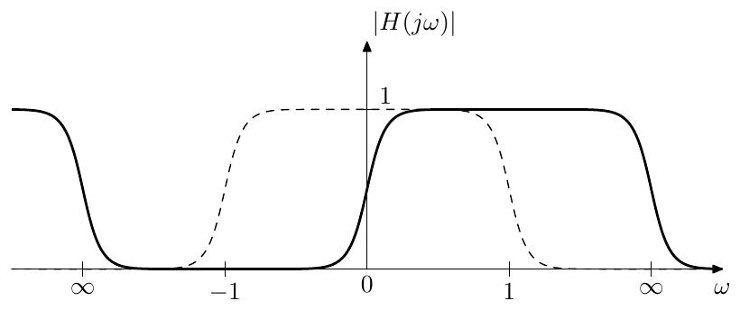

*Figure 10.26: Conversion of a unit-cutoff lowpass filter into an analytic filter by a rotation of the real Riemann circle.*

The poles and zeros of $H_{\mathrm{LP}}$ are respectively transformed by the inverse of $\rho_{-j}$, which is $\rho_{+j}$. Therefore the poles $\tilde p_n$ and zeros $\tilde z_n$ of $H_{>0}$ can be explicitly obtained from the poles $p_n$ and zeros $z_n$ of $H_{\mathrm{LP}}$ by $\tilde p_n = \rho_{+j}(p_n)$, $\tilde z_n = \rho_{+j}(z_n)$. The gain coefficient of $H_{>0}$ can be found by equating the frequency responses of $H_{>0}$ and $H_{\mathrm{LP}}$ at corresponding frequencies, e.g. $H_{>0}(j) = H_{\mathrm{LP}}(0)$. Note that in principle, we can multiply $H_{>0}(s)$ by an arbitrary complex number of unit magnitude, as this wouldn't change the amplitude response of $H_{>0}$. Particularly, we could let $H_{>0}(0) = |H_{\mathrm{LP}}(-j)| = 1/\sqrt{1+f^2(-1)}$.

### Parallel allpass implementation

In practical implementation we usually don't want to deal with complex signals. In this case the output of the filter is a fundamentally complex signal, so we can't avoid that. However we could try to construct as much as possible of $H_{>0}$ staying in real signal domain. Particularly we could attempt to express $H_{>0}$ using real filters, where we then do some postprocessing by mixing the real outputs of those filters with possibly complex coefficients. This is indeed possible.

Suppose $H_{\mathrm{LP}}$ is implemented using (9.18). Recall that by (10.41) the lowpass filter $H_{\mathrm{LP}}$ can be represented as a linear combination of allpasses. This linear combination must be preserved by the rotation $\rho_{-j}$ in (10.43) giving

$$
\frac{2H_{>0}(s)}{H_{\mathrm{LP}}(\omega_0)} = (1+jf(\omega_0))H_o(\rho_{-j}(s)) + (1-jf(\omega_0))H_e(\rho_{-j}(s))
$$

Since $\rho_{-j}$ rotates along the imaginary axis (in terms of $s$ plane and its respective Riemann sphere), the allpass property should be preserved by this transformation and $H_o(\rho_{-j}(s))$ and $H_o(\rho_{-j}(s))$ must still be allpasses. It would be convenient to reexpress $H_o(\rho_{-j}(s))$ and $H_o(\rho_{-j}(s))$ in terms of their new poles after the transformation by $\rho_{-j}$.

As mentioned, the poles are transformed by $\tilde p_n = \rho_{+j}(p_n)$. Therefore let's introduce the new allpasses

$$
\begin{aligned}
\tilde H_o(s) &= \tilde g_o \cdot \prod_{p_n \text{ odd}} \frac{s+\tilde p_n^*}{s-\tilde p_n} \\
\tilde H_e(s) &= \tilde g_e \cdot \prod_{p_n \text{ even}} \frac{s+\tilde p_n^*}{s-\tilde p_n}
\end{aligned}
$$

where $\tilde g_o$ and $\tilde g_e$ are defined from the conditions $\tilde H_o(0) = 1$, $\tilde H_e(0) = 1$. Apparently,

$$
\begin{aligned}
H_o(\rho_{-j}(s)) &= g_? \cdot \tilde H_o(s) \\
H_e(\rho_{-j}(s)) &= g_? \cdot \tilde H_e(s)
\end{aligned}
$$

where $g_?$ denote two different yet uknown coefficients. Substituting $s = 0$ into the above we find that these coefficients must be simply equal to $H_o(-j)$ and $H_e(-j)$ respectively and therefore

$$
\frac{2H_{>0}(s)}{H_{\mathrm{LP}}(j\omega_0)} = (1+jf(\omega_0))H_o(-j)\tilde H_o(s) + (1-jf(\omega_0))H_e(-j)\tilde H_e(s)
$$

Up to this point we have been explicitly keeping the freedom of choice of $\omega_0$. This has been done on purpose, as now we can see a good choice for $\omega_0$. By letting $\omega_0 = -1$ we have $H_o(-j) = 1$ and $H_e(-j) = 1$ and thereby

$$
\frac{2H_{>0}(s)}{H_{\mathrm{LP}}(-j)} = (1+jf(-1))\tilde H_o(s) + (1-jf(-1))\tilde H_e(s)
$$

or

$$
H_{>0}(s) = H_{\mathrm{LP}}(-j) \cdot \left(\frac{1+jf(-1)}{2}\tilde H_o(s) + \frac{1-jf(-1)}{2}\tilde H_e(s)\right) \tag{10.44}
$$

Equation (10.44) would be an acceptable answer, provided $\tilde H_o(s)$ and $\tilde H_e(s)$ are real filters. Since $\tilde H_o(0) = 1$ and $\tilde H_e(0) = 1$ by construction, we only need to make sure that the poles of each of the $\tilde H_o(s)$ and $\tilde H_e(s)$ are conjugate symmetric.

Recall that the poles of $\tilde H_o(s)$ and $\tilde H_e(s)$ are obtained by $\tilde p_n = \rho_{+j}(p_n)$. We therefore wonder, what would be the relationship between the two preimages $p_1, p_2$ of a conjugate pair of poles $\tilde p_2 = \tilde p_1^*$. Considering visually the effect of $\rho_{+j}$ on the Riemann sphere, we could guess that $p_2 = 1/p_1^*$. Verifying algebraically:

$$
\begin{aligned}
\tilde p_2 = \rho_{+j}(p_2) &= \rho_{+j}(1/p_1^*) = j\rho_{+1}(-j/p_1^*) = j\rho_{+1}\left((j/p_1)^*\right) = j\left(\rho_{+1}(j/p_1)\right)^* = \\
&= \left(-j\rho_{+1}(j/p_1)\right)^* = \left(j\rho_{+1}(p_1/j)\right)^* = \left(j\rho_{+1}(-jp_1)\right)^* = \left(\rho_{+j}(p_1)\right)^* = \tilde p_1^*
\end{aligned}
$$

Therefore, given that poles of $H_{\mathrm{LP}}$ have the conjugate reciprocal symmetry $p_2 = 1/p_1^*$ (that is, if $s$ is a pole of $H_{\mathrm{LP}}$ then so is $1/s^*$), the poles of $\tilde H_o$ and $\tilde H_e$ will have the conjugate symmetry.

The poles of $H_{\mathrm{LP}}$ will have the conjugate reciprocal symmetry, given that $f(\omega)$ is a real function such that $f(1/x) = 1/f(x)$. Indeed, suppose $f(1/x) = 1/f(x)$ and $1 + f^2(-js) = 0$. Then

$$
\begin{aligned}
1 + f^2(-j/s^*) &= 1 + f^2(1/js^*) = 1 + f^2(1/(-js)^*) = \left(1 + f^2(1/(-js))\right)^* = \\
&= \left(1 + \frac{1}{f^2(-js)}\right)^* = \left(\frac{1+f^2(-js)}{f^2(1/(-js))}\right)^* = 0^* = 0
\end{aligned}
$$

We already know one specific kind of lowpass filter where $f$ has such reciprocal symmetry: the EMQF filter (with the Butterworth filter as its limiting case). Note that EMQF poles not only have conjugate reciprocal symmetry, but are simply lying on the unit circle, in which case conjugate reciprocation simply maps the poles to themselves: $1/p^* = p$. Since $\rho_{+j}$ maps the unit circle to the real axis, the poles $\tilde p_n$ are real. Also, since $\rho_{+j}$ is a rotation in the direction of the imaginary axis, it maps left semiplane poles to the left semiplane poles and thus $\tilde p_n < 0\ \forall n$. Thus, we are having stable real $H_o$ and $H_e$ whose poles are also all real.

### Real and imaginary allpasses

The expression (10.44) can be simplified a bit further. Notice that for an EMQF filter we are having $f(-1) = (-1)^N$ where $N$ is the filter's order. Respectively $H_{\mathrm{LP}}(-j) = 1/\sqrt{2}$. Therefore (10.44) turns into

$$
H_{>0}(s) = \begin{cases}
\dfrac{1}{\sqrt{2}} \cdot \left(\dfrac{1+j}{2}\tilde H_o(s) + \dfrac{1-j}{2}\tilde H_e(s)\right) & N \text{ even} \\[2ex]
\dfrac{1}{\sqrt{2}} \cdot \left(\dfrac{1-j}{2}\tilde H_o(s) + \dfrac{1+j}{2}\tilde H_e(s)\right) & N \text{ odd}
\end{cases}
$$

Recall that we can multiply $H_{>0}(s)$ by any unit-magnitude complex number without changing the amplitude response. Particulary, we could multiply it by $j^{1/2} = (1+j)/\sqrt{2}$ obtaining

$$
H_{>0}(s) = \begin{cases}
\dfrac{\tilde H_e(s) + j\tilde H_o(s)}{2} & N \text{ even} \\[2ex]
\dfrac{\tilde H_o(s) + j\tilde H_e(s)}{2} & N \text{ odd}
\end{cases}
\tag{10.45}
$$

Thus the real and imaginary parts of the output signal of $H_{>0}$ are obtained completely separately from two parallel allpasses $\tilde H_o$ and $\tilde H_e$.

## 10.11 Phase splitter

There is another, conceptually completely different, but closely mathematically related approach to constructing the Hilbert transformer. Considering a single positive-frequency complex sinusoidal partial

$$
e^{j\omega t} = \cos\omega t + j\sin\omega t = \cos\omega t + j\cos(\omega t - \pi/2) \qquad (\omega > 0)
$$

we notice that the imaginary part of the signal is phase-delayed by $90^\circ$ relatively to the real part. Now let $\hat H_{>0}$ denote the analytic filter operator. That is, applying $\hat H_{>0}$ discards the negative frequency partials from the signal. Then, applying analytic filtering to $\cos\omega t$ we have

$$
\hat H_{>0}\cos\omega t = \hat H_{>0}\frac{e^{j\omega t} + e^{-j\omega t}}{2} = \frac{e^{j\omega t}}{2} = \frac{\cos\omega t + j\cos(\omega t - \pi/2)}{2} \qquad (\omega > 0)
$$

Respectively, for a general real signal we have

$$
\begin{aligned}
\hat H_{>0}\int_0^\infty a(\omega)\cos(\omega t + \varphi(\omega))\,\frac{d\omega}{2\pi} &= \\
&= \frac{1}{2}\int_0^\infty a(\omega)\cos(\omega t + \varphi(\omega))\,\frac{d\omega}{2\pi} + \frac{j}{2}\int_0^\infty a(\omega)\cos(\omega t + \varphi(\omega) - \pi/2)\,\frac{d\omega}{2\pi}
\end{aligned}
$$

Introducing notations:

$$
x(t) = \int_0^\infty a(\omega)\cos(\omega t + \varphi(\omega))\,\frac{d\omega}{2\pi}
$$

$$
x_{-90}(t) = \int_0^\infty a(\omega)\cos(\omega t + \varphi(\omega) - \pi/2)\,\frac{d\omega}{2\pi}
$$

(where $x_{-90}(t)$ is the signal $x(t)$ with all real sinusoidal partials phase-shifted by $-90^\circ$) we have

$$
\hat H_{>0}x(t) = \frac{x(t) + jx_{-90}(t)}{2} \tag{10.46}
$$

Equation (10.46) gives us another approach to the implementation of the
analytic filter: we take the halved original signal as its own real part, and
phase shift the partials of its real spectrum by $-90^\circ$ to obtain the
imaginary part. Also notice that (10.46) is exactly the opposite of (10.42).

Differently from the approach in Section 10.10 where we didn't care about the
phase, the approach of (10.46) explicitly preserves the phase of the partials,
thus (10.46) defines a zero-phase analytic filter. Unfortunately, as we shall
see later, such filter cannot be implemented by a stable differential system.
Still, the whole approach is somewhat more straightforward than the one of
Section 10.10.

We will also develop a number of useful explicit expressions, which will be
helpful in the construction of $H_{>0}$. In principle, the same expressions
could have been derived in Section 10.10 (as the answers are essentially the
same), however the derivations will be somewhat more direct in the context of
the new approach.

### Complex spectral form

Before we get to the construction of the $-90^\circ$ phase shifter, we need to
reexpress this phase shifting in terms of complex spectral partials:

$$
\begin{aligned}
x(t) &= \int_0^{\infty} \frac{a(|\omega|)}{2}\left(e^{j(\omega t+\varphi(\omega))} + e^{-j(\omega t+\varphi(\omega))}\right)\frac{d\omega}{2\pi} \\
x_{-90}(t) &= \int_0^{\infty} \frac{a(|\omega|)}{2}\left(e^{j(\omega t+\varphi(\omega)-\pi/2)} + e^{-j(\omega t+\varphi(\omega)-\pi/2)}\right)\frac{d\omega}{2\pi} = \\
&= \int_0^{\infty} \frac{a(|\omega|)}{2}\left(e^{-j\pi/2}e^{j(\omega t+\varphi(\omega))} + e^{j\pi/2}e^{-j(\omega t+\varphi(\omega))}\right)\frac{d\omega}{2\pi}
\end{aligned} \tag{10.47}
$$

That is we need to phase shift the positive frequency partials by $-90^\circ$
and phase shift the negative frequency partials by $+90^\circ$. Since the
amplitudes are unchanged by the phase-shifting, this is an allpass
transformation, which we can denote by the $\hat H_{-90}$ operator:

$$
x_{-90}(t) = \hat H_{-90}x(t)
$$

Note that the fact that the negative frequencies need to be phase shifted by
the opposite amount is in agreement with the fact that $x_{-90}(t)$, being the
imaginary part of $\hat H_{>0}x(t)$, needs to be a real signal. Therefore
$\hat H_{-90}$ needs to preserve the hermiticity of the spectrum of $x(t)$.
This means that the frequency response of $\hat H_{-90}$ must be a Hermitian
function, which implies the phase response being an odd function.

The frequency response of the $\hat H_{-90}$ allpass is obviously

$$
H_{-90}(j\omega) = \begin{cases} -j & \text{if } \omega > 0 \\ j & \text{if } \omega < 0 \end{cases}
$$

We are still uncertain as to which value to assign to $H_{-90}(0)$. In
principle, according to (10.47) the zero-frequency partial should be
completely killed in $x_{-90}$, thus

$$
H_{-90}(j\omega) = -j\operatorname{sgn}\omega = \begin{cases} -j & \text{if } \omega > 0 \\ 0 & \text{if } \omega = 0 \\ j & \text{if } \omega < 0 \end{cases}
$$

Strictly speaking, this kills the allpass property of $\hat H_{-90}$ at
$\omega = 0$, but this is actually the only way to keep $H_{-90}(j\omega)$
Hermitian.

Now we can rewrite (10.46) in the pure operator form

$$
\hat H_{>0} = \frac{1+j\hat H_{-90}}{2} \tag{10.48}
$$

or in the frequency response form

$$
H_{>0}(j\omega) = \frac{1+jH_{-90}(j\omega)}{2} = \frac{1+\operatorname{sgn}\omega}{2} \tag{10.49}
$$

The complex spectrum interpretation of (10.46) gives another insight into why
does it describe an analytic filter. Given a positive-frequency complex
sinusoidal signal $x(t) = e^{j\omega t}$ we have $x_{-90}(t) = -je^{j\omega t}$
and respectively

$$
\hat H_{>0}x(t) = \frac{e^{j\omega t} + j\cdot(-j)e^{j\omega t}}{2} = \frac{e^{j\omega t}+e^{j\omega t}}{2} = x(t) \qquad (\omega > 0)
$$

that is $x(t)$ is unchanged by $\hat H_{>0}$. On the other hand, if
$\omega < 0$, then $x_{-90}(t) = je^{j\omega t}$ and respectively

$$
\hat H_{>0}x(t) = \frac{e^{j\omega t} + j\cdot je^{j\omega t}}{2} = \frac{e^{j\omega t}-e^{j\omega t}}{2} = 0 \qquad (\omega < 0)
$$

The DC at $\omega = 0$ is neither a positive- nor a negative-frequency
partial. According to what we discussed above, it is killed by
$\hat H_{-90}$ and thus

$$
\hat H_{>0}1(t) = \frac{1(t)+0j}{2} = \frac{1}{2} \qquad (\omega = 0)
$$

(where $1(t)$ denotes a signal equal to 1 everywhere).

### Rational $90^\circ$ phase shifting allpass

We are looking for an allpass filter $H_{-90}$ whose frequency response is

$$
H_{-90}(j\omega) = -j\operatorname{sgn}\omega \tag{10.50}
$$

Apparently $H_{-90}(s)$ can't be a rational function, since rational functions
are continuous everywhere except at their poles, where they gradually
approach infinity, thus a rational function cannot accommodate a jump from
$j$ to $-j$ which $H_{-90}(j\omega)$ has at $\omega = 0$. But we still can
build a rational $H(s)$ which approximates the ideal $H_{-90}(j\omega)$ for
$s = j\omega$.

As mentioned earlier, the ideal $H_{-90}$ is an allpass everywhere except at
$\omega = 0$. Since we are building an approximation of $H_{-90}$ anyway, we
can ignore that fact and build an approximation which is a perfect allpass.
This will simplify our goal, since then we can construct the allpass in terms
of its phase response. Therefore let

$$
\varphi_\infty(\omega) = \begin{cases} -90^\circ & \forall \omega > 0 \\ +90^\circ & \forall \omega < 0 \end{cases}
$$

be the ideal phase response of our allpass.[^21] So, how can we build a
rational allpass transfer function approximating $\varphi_\infty(\omega)$?

Consider the fact that the frequency response of an allpass can be explicitly
written in terms of its phase response:

$$
H(j\omega) = e^{j\varphi(\omega)}
$$

Using (9.11a) we can rewrite the same as

$$
H(j\omega) = \rho_{+1}\!\left(j\tan\frac{\varphi(\omega)}{2}\right)
$$

However $\rho_{+1}$, being a 1st-order rational function, maps rational
functions to rational functions of the same order and back. Thus, if we have
a rational function $\Phi(\omega)$ of some order $N$ such that

$$
\Phi(\omega) = \tan\frac{\varphi(\omega)}{2} \tag{10.51}
$$

then $j\Phi(\omega)$ and $H(j\omega) = \rho_{+1}(j\Phi(\omega))$ will also be
rational functions of the same order $N$ and the phase response of $H$ will
be equal to $\varphi(\omega)$.

Letting $s = j\omega$ we rewrite $H(j\omega) = \rho_{+1}(j\Phi(\omega))$ as

$$
H(s) = \rho_{+1}(j\Phi(-js)) \tag{10.52}
$$

Will $H(s)$ be a real function of $s$? Since $\varphi(\omega)$ must be real
odd, so must be $\Phi(\omega)$. This implies that it must be representable in
the form $\Phi(\omega) = \omega\Phi_2(\omega^2)$ where $\Phi_2$ is some other
real function. Therefore

$$
H(s) = \rho_{+1}(j\Phi(-js)) = \rho_{+1}\bigl(j\cdot(-js)\Phi_2((-js)^2)\bigr) = \rho_{+1}(s\Phi_2(-s^2))
$$

and thus $H(s)$ is real.

Before proceeding to the construction of $\Phi(\omega)$ we would like to give
one warning. The allpass transfer functions $H(s)$, which will arise from the
application of (10.52) to the obtained $\Phi(\omega)$, will be unstable. This
corresponds to the fact that phase responses of stable differential allpasses
cannot stay around $\pm90^\circ$ over a large range of $\omega$.[^22] This is
a fundamental limitation, which we'll have to deal with. Later in this
section we will describe a way of addressing this problem.

### Construction of $\Phi(\omega)$

The ideal $\Phi(\omega)$ is apparently

$$
\Phi_\infty(\omega) = \tan\frac{\varphi_\infty(\omega)}{2} = \begin{cases} -1 & \forall \omega > 0 \\ 1 & \forall \omega < 0 \end{cases}
$$

We wish to find a rational $\Phi(\omega) \approx \Phi_\infty(\omega)$. This
will ensure $\varphi(\omega) \approx \varphi_\infty(\omega)$.

Let $f(x)$ be a real rational function satisfying the unit-cutoff lowpass
conditions (9.21). We would like to compose $f(x)$ with other functions in
such a way that the result is an approximation of $\Phi_\infty$. This
composition should still result in a real rational function and, ideally,
also preserve the order of $f$. Therefore, good candidates for the elements
of such composition are the rotations of real Riemann circle $\rho_{\pm1}$.

As a first step, we map the pass- and stop-band areas of $f(x)$ (that is
$f(x) \approx 0$ and $f(x) \approx \infty$) to the areas where
$\Phi(x) = \pm1$. This is achieved by $\Phi(x) = \rho_{\pm1}(f(x))$ (where the
$\pm$ signs are matched). We thereby obtain $\Phi(x)$ which has the desired
values in the "pass"- and "stop"-bands, however the bands themselves are
incorrectly positioned on the argument axis, still coinciding with the pass-
and stop-bands of a unit-cutoff lowpass. We could fix this by a real Riemann
circle rotation of the argument. Which turns our candidate compositions into

$$
\Phi(x) = \rho_{\pm1}(f(\rho_{\pm1}(x))) \tag{10.53}
$$

where we initially treat the $\pm$ signs as independent.

However actually the $\pm$ signs in (10.53) cannot be independent. E.g. if we
choose the "inner rotation" (the rotation of the argument of $f(x)$) to be
$\rho_{+1}$, this maps the original lowpass passband $|x| \ll 1$ to
$-\infty \ll x \ll 0$. In this area we want $\Phi(x) = 1$, therefore we have
to choose the "outer rotation" (the rotation of the value of $f(x)$) to be
$\rho_{+1}$ as well. In a similar way we could choose both rotations to be
$\rho_{-1}$. This means that the $\pm$ signs in (10.53) must be matched.

Intuitively it is clear that any "lowpass" kind of $f(x)$ should result in
(10.53) giving an approximation of $\Phi_\infty$. However we also need
$\Phi(\omega)$ to be an odd function. Let's see what kind of restriction this
means for $f(x)$. By (9.13) the rotations $\rho_{\pm1}$ map the odd symmetry
to the reciprocal symmetry, which means that

$$
\Phi(-\omega) = -\Phi(\omega) \iff f(1/x) = 1/f(x)
$$

which effectively brings us to the idea to use the EMQF function
$f(x) = \bar R_N(x)$ (or the Butterworth filter function $f(x) = x^N$ as its
limiting case).

Having chosen $f(x) = \bar R_N(x)$ we can refine the formula (10.53) a
little. Suppose we chose the "+" signs in (10.53). Then
$\Phi(0) = \rho_{+1}(f(1)) = \rho_{+1}(1) = \infty$. Vice versa, if we choose
the "$-$" signs, then $\Phi(0) = \rho_{-1}(f(-1)) = \rho_{+1}((-1)^N)$ which
is $0$ if $N$ is odd and $\infty$ if $N$ is even. In principle, this is not a
very big problem, and both options are valid, but it would be just nice to
have $\Phi(0) = 0$ and respectively $H(0) = 1$ all the time. This is achieved
by changing (10.53) into

$$
\Phi(\omega) = -\rho_{-1}(f(\rho_{+1}(\omega))) \tag{10.54}
$$

The readers can convince themselves that (10.54) also gives an approximation
of $\Phi_\infty$ and that in this case $\Phi(0) = 0$ regardless of $N$.
Fig. 10.27 illustrates.

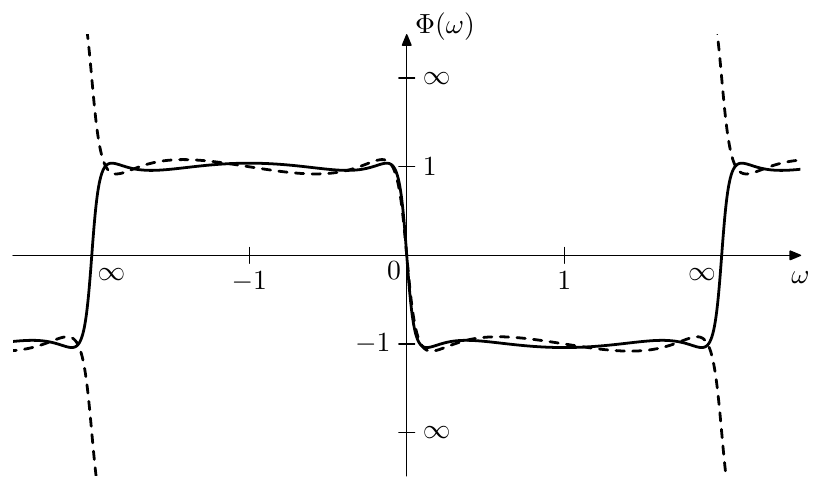

*Figure 10.27: $\Phi(\omega)$ obtained from (10.54) and $f(x) = \bar R_N(x)$
for even (solid) and odd (dashed) $N$.*

### Explicit expression for EMQF $\Phi(\omega)$

Sticking to the idea to use the EMQF function $f(x) = \bar R_N(x)$ we will
refer to the $90^\circ$ phase shifter that we are constructing as "EMQF phase
shifter". Even though this is some kind of a misnomer, this should provide a
pretty clear identification of the approach we use.

Substituting $f(x) = \bar R_N(x)$ into (10.54) we obtain

$$
\Phi(\omega) = -\rho_{-1}(\bar R_N(\rho_{+1}(\omega))) \tag{10.55}
$$

Since $\bar R_N$ is a real rational function of order $N$, so is $\Phi(\omega)$.

In the real period-based preimage representation terms we have

$$
\begin{aligned}
x &= \overline{\operatorname{cd}}_K u \\
v &= Nu \\
\bar R_N(x) &= \overline{\operatorname{cd}}_{\tilde K}(v)
\end{aligned}
$$

Expressing (10.55) in the same terms we have

$$
\begin{aligned}
\omega &= \rho_{-1}\bigl(\overline{\operatorname{cd}}_K u\bigr) \\
v &= Nu \\
\Phi(\omega) &= -\rho_{-1}\bigl(\overline{\operatorname{cd}}_{\tilde K} v\bigr)
\end{aligned}
$$

which by (9.111) turns into

$$
\begin{aligned}
\omega &= -\overline{\operatorname{nd}}_{K_2}\frac{u}{2} \\
\frac{v}{2} &= N\frac{u}{2} \\
\Phi(\omega) &= \overline{\operatorname{nd}}_{\tilde K_2}\frac{v}{2}
\end{aligned}
$$

Replacing $u/2$ with $u$ and $v/2$ with $v$ we obtain

$$
\begin{aligned}
\omega &= -\overline{\operatorname{nd}}_{K_2}u \\
v &= Nu \\
\Phi(\omega) &= \overline{\operatorname{nd}}_{\tilde K_2}v
\end{aligned}
$$

and finally, switching to the explicit scaling form:

$$
\omega = -\operatorname{nd}(u, k_2) \tag{10.56a}
$$

$$
v = N\frac{\tilde K_2}{K_2}u = \frac{\tilde K_2'}{K_2'}u \tag{10.56b}
$$

$$
\Phi(\omega) = \operatorname{nd}(v, \tilde k_2) \tag{10.56c}
$$

where $K_2 = K(k_2)$ and $\tilde K_2 = K(\tilde k_2)$ are the quarter periods
corresponding to the elliptic moduli $k_2 = \mathcal{L}^2(k)$ and $\tilde k_2 =
\mathcal{L}^2(\tilde k)$, that is $k_2$ and $\tilde k_2$ are obtained by the double
Landen transformation from $k$ and $\tilde k$. Note that, since double Landen
transformation solely changes the quarter period ratios $K'/K$ and
$\tilde K'/\tilde K$ by a factor of 4, the degree equation (9.112) stays
essentially the same: $\tilde K_2'/\tilde K_2 = NK_2'/K_2$. Thus the
imaginary periods of the two $\overline{\operatorname{nd}}$ functions are
matched, while the real period is scaled by $N$.

Turning the representation form into the explicit form we obtain, e.g. using
real period argument normalization

$$
\Phi(\omega) = \overline{\operatorname{nd}}_{\tilde K_2}\Bigl(N\,\overline{\operatorname{nd}}_{K_2}^{-1}(-\omega)\Bigr) \tag{10.57}
$$

Expression (10.57) defines another (normalized) elliptic rational function.
Differently from the already familiar $\bar R_N$, this function has
equiripples around $\pm1$ in the bands centered around $\omega = \pm1$.
Strictly speaking the amplitudes of the upwards- and downwards-pointing
ripples of $\Phi(\omega)$ (shown in Fig. 10.27) are not equal, rather, the
values are mutually reciprocal at the upwards- and downward-pointing peaks.
It is just that in arctangent scale the reciprocal values correspond to equal
deviations from 1 or from $-1$. Therefore the true equiripple behavior occurs
in the arctangent rather than linear scale. However according to (10.51) the
function $\varphi(\omega)$ (which is our true goal) is exactly the arctangent
scale representation of $\Phi(\omega)$. Therefore $\varphi(\omega)$ will have
true equiripples. For the sake of clarity we provide a graph of
$\varphi(\omega)$ in Fig. 10.28, however notice that the only difference
between Figs. 10.28 and 10.27. is the labelling of the vertical axis.

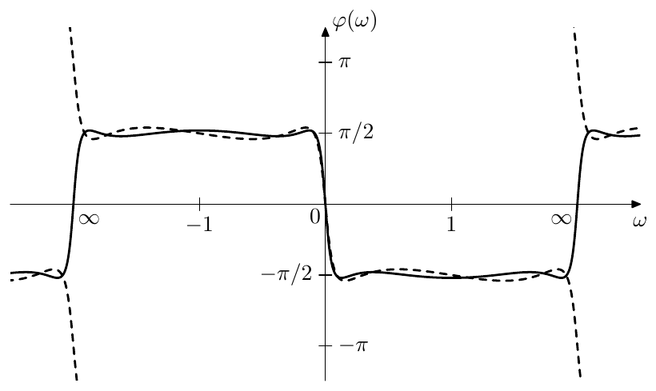

*Figure 10.28: $\varphi(\omega)$ obtained from (10.57) and (10.51) for even
(solid) and odd (dashed) $N$.*

### Bands of EMQF $\Phi(\omega)$

It is instructive to analyse $\Phi(\omega)$ in terms of its bands in the
preimage domain. The readers can convince themselves that the bands are:

| | $\omega$ | $\Phi(\omega)$ |
|---|---|---|
| Transition band 1 | $\lvert\omega\rvert \le \sqrt{k_2'}$ | $\lvert\Phi(\omega)\rvert \le \sqrt{\tilde k_2'}$ |
| Passband 1 | $\sqrt{k_2'} \le \omega \le 1/\sqrt{k_2'}$ | $-1/\sqrt{\tilde k_2'} \le \Phi(\omega) \le -\sqrt{\tilde k_2'}$ |
| Transition band 2 | $\lvert\omega\rvert \ge 1/\sqrt{k_2'}$ | depends on $N$ |
| Passband 2 | $-1/\sqrt{k_2'} \le \omega \le -\sqrt{k_2'}$ | $\sqrt{\tilde k_2'} \le \Phi(\omega) \le 1/\sqrt{\tilde k_2'}$ |

where in the transition band 2 we have $\lvert\Phi(\omega)\rvert \le
\sqrt{\tilde k_2'}$ for even $N$ and $\lvert\Phi(\omega)\rvert \ge
1/\sqrt{\tilde k_2'}$ for odd $N$. Fig. 9.51 can be referred to as an
illustration.

It is not difficult to realize that that the "passband" ripples of
$\Phi(\omega)$ are essentially obtained from the ripples that the
$\overline{\operatorname{nd}}$ function has on the real axis (which thereby
results in the upwards-pointing peaks being reciprocal to the
downwards-pointing peaks) and on a parallel line which is away from the real
axis by one half of its imaginary period. The details are left as an
exercise to the reader.

### Poles and zeros of EMQF phase shifter

We would like to construct $H(s)$ from its poles and zeros. Since $H(s)$ is
an allpass, it is sufficient to find the poles, while the zeros can be
trivially obtained from the poles. However we could also consider obtaining
the zeros explicitly.

Starting with the equations $H(s) = \infty$ and $H(s) = 0$ we apply the
inverted (10.52), which is $\Phi(-js) = -j\rho_{-1}(H(s))$, yielding

$$
\Phi(-js) = \mp j \tag{10.58}
$$

where "$-$" should be taken for poles and "$+$" for zeros.

At this point there are different possibilities how to continue.
Particularly, we could apply (10.55) which gives
$\bar R_N(\rho_{+1}(-js)) = \pm j$ or equivalently
$\bar R_N(-j\rho_{+j}(s)) = \pm j$. This would be pretty much the same as
what we have been solving in Section 10.10.[^23] It could be more
interesting and practical, though, to take a different path, which will
allow us to obtain simple explicit expressions for the poles and zeros of
$H(s)$. The obtained poles and zeros will be of course the same, since we
are solving the same equations, just in a different way.

Let's use the preimage representation (10.56) to solve (10.58), in a similar
way to how we were solving the pole equations for other filter types. Recall
that by the imaginary argument property, $\operatorname{nd}$ is essentially
the same as $\operatorname{cd}$, just rotated $90^\circ$ in its complex
argument plane. Therefore, while $\operatorname{cd}$ was generating
quasielliptic curves for its argument moving parallel to the real axis,
$\operatorname{nd}$ will generate the same curves for its argument moving
parallel to the imaginary axis. In order to solve (10.58), we would like the
curves to go through $\pm j$, however the movement parallel to the imaginary
axis in the preimage domain is not very useful for solving (10.58), since the
imaginary periods are matched for the preimages of $\omega$ and $\Phi(\omega)$,
and therefore we will not obtain all possible solutions.

We should rather move parallel to the real axis. Apparently, in this case we
won't generate quasielliptic curves in the representation domain, but rather
the kind of lines shown in Fig. 9.54. Since $\operatorname{cd}$ and
respectively $\operatorname{nd}$ take each value only once within a
quater-period grid cell, and since the values $\pm j$ occur on horizontal
lines where $\operatorname{nd}$ turns into $j\operatorname{sc}$ or
$-j\operatorname{sc}$ (Fig. 9.51), we need to move in one of these lines. The
representation will then simply move along the imaginary axis[^24] in one
and the same direction, looping through the $\infty$ point.

Choosing the horizontal line $\operatorname{Im}v = \tilde K_2'$ as the
principal preimage line we have $\overline{\operatorname{nd}}(v, \tilde k_2)
= j\operatorname{sc}(\operatorname{Re}v, \tilde k_2)$. We wish to have
representation moving upwards along the imaginary axis therefore the
preimages need to move towards the right (going along the line
$\operatorname{Im}v = \tilde K_2'$). In terms of $u$ the same movement
corresponds to moving along the line

$$
\operatorname{Im}u = \frac{K_2'}{\tilde K_2'}\operatorname{Im}v = K_2'
$$

where the direction of movement of $u$ is, obviously, also towards the
right. Notice that any other possible choices of the principal preimage line
of $v$ do not generate any additional solutions of (10.58), since $\omega$
will be simply traversing along the entire imaginary axis in any case.

The value $\Phi(\omega) = \operatorname{nd}(v, \tilde k_2)$ moving upwards
along the imagniary axis will be traversing the points $\pm j$ at

$$
v = j\tilde K_2' + \left(\frac{1}{2}+n\right)\tilde K_2 \qquad (n \in \mathbb{Z})
$$

where at even $n$ we'll have $\Phi(\omega) = j$ and at odd $n$ we'll have
$\Phi(\omega) = -j$. That is, even $n$ correspond to zeros and odd $n$
correspond to poles. The values of $u$ are respectively

$$
u = j\frac{K_2'}{\tilde K_2'}\tilde K_2' + \frac{K_2}{N\tilde K_2}\left(\frac{1}{2}+n\right)\tilde K_2 = jK_2' + \frac{\frac12+n}{N}K_2
$$

from where

$$
\omega = -\operatorname{nd}u = -j\operatorname{sc}\left(\frac{\frac12+n}{N}K_2, k_2\right)
$$

from where by $s = j\omega$ we obtain

$$
s = \operatorname{sc}\left(\frac{\frac12+n}{N}K_2, k_2\right) \tag{10.59}
$$

where even $n$ correspond to zeros and odd $n$ correspond to poles. Note that
in the Butterworth limit $k_2 \to 0$ the equation (10.59) turns into

$$
s = \tan\left(\frac{\pi}{2}\cdot\frac{\frac12+n}{N}\right)
$$

Since all values in (10.59) are real, the solutions given by (10.59) are also
real. That is the poles and zeros of $H(s)$ are real and $H(s)$ can be
factored into 1st-order allpasses.

Since the period of $\operatorname{sc}$ is $2K_2$, there are $2N$ different
values of $s$ given by (10.59). Half of them are zeros and the other half are
poles, thus there are $N$ zeros and $N$ poles, where the poles and zeros are
inverleaved (Fig. 10.29). Apparently, $n$ can run over any range of $2N$
consecutive integers. A particularly convenient range is
$n = -N\ldots(N-1)$. In this case $n = -1$ and $n = 0$ give one pole/zero
pair where the pole and the zero are mutually opposite. This pole/zero pair
corresponds to the lowest-cutoff 1-pole allpass factor, which is stable since
the pole is obtained from $n = -1$. The values $n = 1$ and $n = -2$ give
another pole/zero pair corresponding to the next 1-pole factor, which is
unstable since the pole is obtained from $n = 1$. The third 1-pole factor
will be stable again etc.

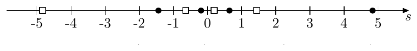

*Figure 10.29: Poles (black dots) and zeros (white squares) of an EMQF phase
shifter $H(s)$ for $N = 4$.*

One could notice in Fig. 10.29 that there is reciprocal symmetry within the
set of poles and zeros of $H(s)$. That is if $s$ is a pole or a zero of
$H(s)$, then so is $1/s$. Apparently, this is due to the property (9.74b) of
the elliptic tangent function $\operatorname{sc}$.

We could also derive a simple rule for remembering, whether for $n = -1$ one
obtains a pole or a zero, that is whether the closest to zero negative value
of $s$ given by (10.59) is a stable allpass factor's pole or an unstable
allpass factor's zero. First, notice that negating the allpass's cutoff is
equivalent to the substitution $\omega \leftarrow -\omega$. Since the
frequency response of a real filter is Hermitian, its phase response is odd,
thus negating $\omega$ is equivalent to negating the phase response. Thus,
since the phase responses of stable allpasses are decreasing, the phase
responses of unstable (negative cutoff) allpasses are increasing. Now
consider the phase shifter $H(s)$ which is a product of stable and unstable
allpasses. Intuitively, as $\omega$ starts to increase from 0, the phase
response first has to decrease to approximately $-90^\circ$, therefore the
allpass factor with the lowest cutoff in the chain must be stable.[^25]

### Bandwidth of EMQF phase shifter

In our discussion of the bands of EMQF $\Phi(\omega)$ we have established
that the equiripple "passband" ranges are

$$
\begin{aligned}
-{k_2'}^{-1/2} &< \omega < -{k_2'}^{1/2} \\
{k_2'}^{1/2} &< \omega < {k_2'}^{-1/2}
\end{aligned}
$$

that is

$$
{k_2'}^{1/2} < \lvert\omega\rvert < {k_2'}^{-1/2}
$$

where we could notice that the logarithmic center of the "passband" is
thereby at $\omega = 1$.

Respectively, the logarithmic bandwidth $\Delta$ expressed in octaves is a
logarithm base 2 of the ratio of the passband's boundaries:

$$
\Delta = \log_2\frac{{k_2'}^{-1/2}}{{k_2'}^{1/2}} = \log_2{k_2'}^{-1} = -\log_2 k_2'
$$

which gives us a way to immediately find $k_2'$ from a given bandwidth:[^26]

$$
k_2' = 2^{-\Delta}
$$

Since the boundaries of the bands of $\varphi(\omega)$ are identical to the
bands of $\Phi(\omega)$, the above formulas equally apply to the bands of
$\varphi(\omega)$.

The value of $\tilde k_2'$, which effectively defines the amplitude of the
ripples, can be computed (after having constructeed $\Phi(\omega)$) from

$$
{\tilde k_2'}^{1/2} = -\Phi({k_2'}^{1/2})
$$

However it is more practical to directly compute the deviation of
$\arg H(j{k_2'}^{1/2})$ from the target value $-90^\circ$ (after having
constructed $H(s)$). According to the above formula,
$\omega = {k_2'}^{1/2}$ should be the point of maximum phase deviation
(within the equiripple range) and thus the deviation of
$\varphi({k_2'}^{1/2}) = \arg H(j{k_2'}^{1/2})$ from $-90^\circ$ should give
the amplitude of the equiripples.

Since $\tilde k_2'$ and $k_2'$ increase or decrease simultaneously, $H(s)$
will get larger ripple amplitudes for larger bandwidths and vice versa.
Increasing the order $N$ will result in a smaller ripple amplitude for the
same bandwidth.

Apparently the "passband" doesn't need to be centered at $\omega = 1$ and can
be shifted to any other center frequency by the cutoff substitution
$s \leftarrow s/\omega_c$. This raises a related question of prewarping,
where we could notice that the situation is pretty similar to the
prewarping of a normalized 2-pole bandpass filter (discussed in connection
with the LP to BP transformation in Section 4.6). Therefore the suggested
way of handling the prewarping of $H(s)$ consists of the following steps:

1. Given the desired "passband" $[\omega_1, \omega_2]$:

$$
\begin{aligned}
\omega_1 &= \omega_c \cdot 2^{-\Delta/2} \\
\omega_2 &= \omega_c \cdot 2^{\Delta/2}
\end{aligned}
$$

   prewarp its boundaries separately:

$$
\begin{aligned}
\tilde\omega_1 &= \mu(\omega_1) \\
\tilde\omega_2 &= \mu(\omega_2)
\end{aligned}
$$

thereby obtaining the new prewarped "passband" of a different bandwidth
and center frequency:

$$
\tilde\omega_c = \sqrt{\tilde\omega_1\tilde\omega_2}
$$

$$
\tilde\Delta = \log_2\frac{\tilde\omega_2}{\tilde\omega_1}
$$

2. Given the new bandwidth and assuming a unit center frequency, construct
   the allpass $H(s)$ as previously described in this section.
3. Apply the cutoff substitution $s \leftarrow s/\tilde\omega_c$ to $H(s)$, which effectively means
   multiplying the cutoffs of the underlying 1-poles by the new center frequency $\tilde\omega_c$.

This approach effectively implements an idea similar to the usage of a single
prewarping point discussed in Section 3.8, which takes care of preserving the
correct ratios between the cutoffs of the individual filters in the system. In
principle it could be okay to prewarp each of the 1-pole factors of $H(s)$
individually instead, however that apparently will somewhat destroy the
optimality of the equiripple $\varphi(\omega)$.

### Phase splitter

Half (or approximately half, if $N$ is odd) of the poles of $H(s)$ are unstable
and we can't implement $H(s)$ directly. However, there is one trick which
allows to work around this limitation. Before describing this trick we will
switch the notation back from $H(s)$ to $H_{-90}(s)$ to highlight the fact
that the filter performs a $-90^\circ$ phase shift (of the positive
frequencies).

Let's factor $H_{-90}(s)$ into a product of two allpasses:

$$
H_{-90}(s) = H_+(s)H_-(s)
$$

where $H_+(s)$ contains only the right-semiplane (unstable) poles and $H_-(s)$
contains only the left-semiplane (stable) poles. As usual, we could assume or
require that $H_+(0) = 1$ and $H_-(0) = 1$, which is achievable, given
$\varphi(\omega) = 0$ and respectively $H(0) = 1$.

Given a signal $x(t) = e^{st}$ we wish to obtain the signal $y(t) = H_{-90}(s)x(t)$.
Consider two other signals:

$$
\begin{aligned}
x'(t) &= H_+^{-1}(s)x(t) \\
y'(t) &= H_+^{-1}(s)y(t) = H_-(s)x(t)
\end{aligned}
$$

where $H_+^{-1}(s) = 1/H_+(s)$. Notice that $H_+^{-1}$ is a stable allpass and
so is apparently $H_-$, thus $x'(t)$ and $y'(t)$ can be obtained from $x(t)$ by
processing $x(t)$ by stable allpasses $H_+^{-1}$ and $H_-$. Notice that

$$
y'(t) = H_-(s)x(t) = H_-(s)H_+(s)x'(t) = H_{-90}(s)x'(t)
$$

that is $y'(t)$ and $x'(t)$ are in a 90$^\circ$ phase shift relationship.

Apparently the same idea applies to arbitrary $x(t)$, which we can express in
the operator notation as

$$
x'(t) = \hat H_+^{-1}x(t) \tag{10.60a}
$$

$$
y'(t) = \hat H_+^{-1}y(t) = \hat H_- x(t) \tag{10.60b}
$$

$$
y'(t) = \hat H_{-90}x'(t) \tag{10.60c}
$$

where $\hat H_{-90}$ is the operator denoting the processing of a signal by
the filter $H_{-90}$. Thus, even though we cannot phase-shift the input signal
$x$ by 90$^\circ$, we can obtain two derived allpass signals $x'$ and $y'$,
where the phase difference between $x'$ and $y'$ is 90$^\circ$. Respectively,
the combined signal

$$
x_{>0}(t) = \frac{x'(t) + jy'(t)}{2} = \frac{\hat H_+^{-1} + j\hat H_-}{2}x(t) =
\hat H_+^{-1}\frac{x(t) + jy(t)}{2} = \hat H_+^{-1}\frac{1 + j\hat H_{-90}}{2}x(t) \tag{10.61}
$$

is an analytic version of $x(t)$, where the phase shift of this analytic
version relatively to $x(t)$ is defined by $H_+^{-1}$. The approach of
generating two allpass signals which are in a 90$^\circ$ phase relationship is
referred to as *phase splitting* and is illustrated in Fig. 10.30. Since
$x'/2$ is the real part of the analytic signal and $y'/2$ is the imaginary
part, the allpass $H_+^{-1}$ produces the (doubled) real part and the allpass
$H_-$ produces the (doubled) imaginary part and therefore we can refer to
$H_+^{-1}$ and $H_-$ as real and imaginary allpasses respectively.

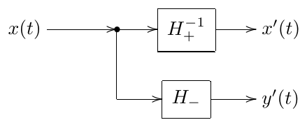

*Figure 10.30: Phase splitter.*

Notice that (10.61) is essentially the same as we have in (10.45), where $H_o$
and $H_e$ are corresponding to $H_+^{-1}$ and $H_-$ (where which specific
filter corresponds to which depends on the order $N$). Thus (10.45) also
describes a phase splitter, just obtained from a different angle.

## 10.12 Frequency shifter

Even though frequency shifter is not a filter in the strict sense, its most
critical part will be based around the Hilbert transformer, which *is* a
filter. For that reason the discussion of frequency shifters may belong to
the filter topic.

Suppose we are given a signal $x(t)$ represented by its complex spectrum:

$$
x(t) = \int_{-\infty}^{\infty} X(\omega)e^{j\omega t}\,\frac{d\omega}{2\pi}
$$

By multiplying the signal $x(t)$ with a complex sinusoidal signal
$e^{j\Delta\omega\cdot t}$ we effectively shift the frequencies of all
partials by $\Delta\omega$:

$$
y(t) = e^{j\Delta\omega\cdot t}x(t) = e^{j\Delta\omega\cdot t}\int_{-\infty}^{\infty} X(\omega)e^{j\omega t}\,\frac{d\omega}{2\pi} = \int_{-\infty}^{\infty} X(\omega)e^{j\Delta\omega\cdot t}e^{j\omega t}\,\frac{d\omega}{2\pi} =
$$

$$
= \int_{-\infty}^{\infty} X(\omega)e^{j(\omega+\Delta\omega)t}\,\frac{d\omega}{2\pi} \tag{10.62}
$$

This is not very interesting, since given a real $x(t)$ we obtain a complex
$y(t)$. Obviously, it's because we multiplied by the complex signal
$e^{j\Delta\omega\cdot t}$. In terms of signal spectra, the spectrum of $x(t)$
was Hermitian, however by shifting the spectrum by $\Delta\omega$ we destroyed
the Hermitian property.

However, this is also not exactly what we want if we think of frequency
shifting. The complex spectrum is a more or less purely mathematical concept,
while the one more intuitively related to our hearing of sounds is the real
spectrum, and it's the partials of the real spectrum whose frequencies we'd
rather want to shift. That is, given

$$
x(t) = \int_0^{\infty} a(\omega)\cos\bigl(\omega t + \varphi(\omega)\bigr)\,\frac{d\omega}{2\pi}
$$

we wish to obtain

$$
y(t) = \int_0^{\infty} a(\omega)\cos\bigl((\omega+\Delta\omega)t + \varphi(\omega)\bigr)\,\frac{d\omega}{2\pi} \tag{10.63}
$$

Notably, if $\Delta\omega < 0$, then some of the frequencies $\omega +
\Delta\omega$ in (10.63) will be negative and will alias with the positive
frequencies of the same absolute magnitude. This can be either ignored, or
$x(t)$ can be prefiltered to make sure it doesn't contain frequencies below
$-\Delta\omega$. So, except for the just mentioned highpass prefiltering
option, the possible aliasing of the negative frequencies doesn't affect the
subsequent discussion.

We can rewrite (10.63) as

$$
\begin{aligned}
y(t) &= \int_0^{\infty} a(\omega)\cos\bigl((\omega+\Delta\omega)t + \varphi(\omega)\bigr)\,\frac{d\omega}{2\pi} = \\
&= \int_0^{\infty} a(\omega)\cos\bigl(\Delta\omega t + \omega t + \varphi(\omega)\bigr)\,\frac{d\omega}{2\pi} = \\
&= \int_0^{\infty} a(\omega)\Bigl(\cos\Delta\omega t\cos\bigl(\omega t + \varphi(\omega)\bigr) - \sin\Delta\omega t\sin\bigl(\omega t + \varphi(\omega)\bigr)\Bigr)\,\frac{d\omega}{2\pi} = \\
&= \cos\Delta\omega t\cdot\int_0^{\infty} a(\omega)\cos\bigl(\omega t + \varphi(\omega)\bigr)\,\frac{d\omega}{2\pi} - \\
&\qquad - \sin\Delta\omega t\cdot\int_0^{\infty} a(\omega)\sin\bigl(\omega t + \varphi(\omega)\bigr)\,\frac{d\omega}{2\pi} = \\
&= \cos\Delta\omega t\cdot\int_0^{\infty} a(\omega)\cos\bigl(\omega t + \varphi(\omega)\bigr)\,\frac{d\omega}{2\pi} - \\
&\qquad - \sin\Delta\omega t\cdot\int_0^{\infty} a(\omega)\cos\Bigl(\omega t + \varphi(\omega) - \frac{\pi}{2}\Bigr)\,\frac{d\omega}{2\pi} = \\
&= x(t)\cos\Delta\omega t - x_{-90}(t)\sin\Delta\omega t
\end{aligned} \tag{10.64}
$$

where

$$
x_{-90}(t) = \int_0^{\infty} a(\omega)\cos\Bigl(\omega t + \varphi(\omega) - \frac{\pi}{2}\Bigr)\,\frac{d\omega}{2\pi}
$$

is a signal obtained from $x(t)$ by phase-shifting all partials by $-90^\circ$.
In the operator notation the same can be expressed as

$$
y(t) = \cos\Delta\omega t\cdot x(t) - \sin\Delta\omega t\cdot\hat H_{-90}x(t) = \bigl(\cos\Delta\omega t - \sin\Delta\omega t\cdot\hat H_{-90}\bigr)x(t) \tag{10.65}
$$

We have already found out how to obtain a $-90^\circ$ phase shifted signal in
Section 10.11, except that we also found than such signal cannot be directly
obtained. We will address this slightly later, while for now we shall take a
different look at the same problem of frequency shifting.

### Analytic signal approach

Looking again at (10.62) we can notice that the positive frequency partials
are correctly shifted and it's the negative frequency partials which make
trouble. So, if the negative partials weren't there in the first place:

$$
x_{>0}(t) = \int_0^{\infty} X(\omega)e^{j\omega t}\,\frac{d\omega}{2\pi}
$$

we would have obtained

$$
y_{>0}(t) = e^{j\Delta\omega\cdot t}x_{>0}(t) = e^{j\Delta\omega\cdot t}\int_0^{\infty} X(\omega)e^{j\omega t}\,\frac{d\omega}{2\pi} = \int_0^{\infty} X(\omega)e^{j\Delta\omega\cdot t}e^{j\omega t}\,\frac{d\omega}{2\pi} =
$$

$$
= \int_0^{\infty} X(\omega)e^{j(\omega+\Delta\omega)t}\,\frac{d\omega}{2\pi} \tag{10.66}
$$

Comparing (10.66) to (10.63) we notice that they essentially consist of the
same frequency partials, except that $y_{>0}(t)$ is missing the negative part
of its spectrum. The negative part of the spectrum can be restored by (10.42),
and thus (10.66) and (10.63) are related via

$$
y(t) = 2\operatorname{Re}y_{>0}(t)
$$

This is easier to see in the operator notation:

$$
\begin{aligned}
y(t) &= 2\operatorname{Re}y_{>0}(t) = 2\operatorname{Re}\bigl(e^{j\Delta\omega t}x_{>0}(t)\bigr) = 2\operatorname{Re}\bigl(e^{j\Delta\omega t}\hat H_{>0}x(t)\bigr) = \\
&= 2\operatorname{Re}\left(e^{j\Delta\omega t}\frac{1+j\hat H_{-90}}{2}x(t)\right) = \operatorname{Re}\bigl(e^{j\Delta\omega t}(1+j\hat H_{-90})x(t)\bigr) = \\
&= \operatorname{Re}\bigl((\cos\Delta\omega t + j\sin\Delta\omega t)(1+j\hat H_{-90})x(t)\bigr) = \\
&= \bigl(\cos\Delta\omega t - \sin\Delta\omega t\hat H_{-90}\bigr)x(t)
\end{aligned}
$$

which is identical to (10.65), thus both approaches are equivalent.

### Implementation

Let $\hat H_+^{-1}$ be the allpass from (10.60). Multiplying (10.65) by
$\hat H_+^{-1}$ we obtain

$$
\begin{aligned}
\hat H_+^{-1}y(t) &= \hat H_+^{-1}\bigl(\cos\Delta\omega t - \sin\Delta\omega t\cdot\hat H_{-90}\bigr)x(t) = \\
&= \Bigl(\cos\Delta\omega t\cdot\hat H_+^{-1} - \sin\Delta\omega t\cdot\hat H_{-90}\hat H_+^{-1}\Bigr)x(t) = \\
&= \Bigl(\cos\Delta\omega t\cdot\hat H_+^{-1} - \sin\Delta\omega t\cdot\hat H_-\Bigr)x(t)
\end{aligned} \tag{10.67}
$$

If we are willing to accept the phase-shifted signal $\hat H_+^{-1}y(t)$
instead of $y(t)$ (and as it seems, we don't have much other choice) a
frequency shifter can be simply implemented by the structure in Fig. 10.31.

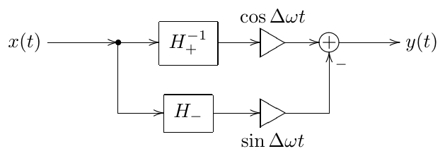

*Figure 10.31: Frequency shifter.*

Notably, replacing $\Delta\omega$ by $-\Delta\omega$ in (10.67) we obtain

$$
\begin{aligned}
\hat H_+^{-1}y(t) &= \hat H_+^{-1}\bigl(\cos\Delta\omega t + \sin\Delta\omega t\cdot\hat H_{-90}\bigr)x(t) = \\
&= \Bigl(\cos\Delta\omega t\cdot\hat H_+^{-1} + \sin\Delta\omega t\cdot\hat H_-\Bigr)x(t)
\end{aligned} \tag{10.68}
$$

This means that we can extend the frequency shifter in Fig. 10.31 to a one
that shifts simultaneously in both directions, obtaining the diagram in
Fig. 10.32.[^27]

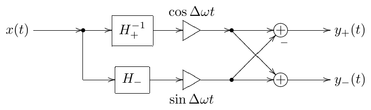

*Figure 10.32: A bidirectional frequency shifter.*

Adding together the frequency-shifted signals from (10.67) and (10.68) we
notice that

$$
\begin{aligned}
&\hat H_+^{-1}\bigl(\cos\Delta\omega t - \sin\Delta\omega t\cdot\hat H_{-90}\bigr) + \\
&\qquad + \hat H_+^{-1}\bigl(\cos\Delta\omega t + \sin\Delta\omega t\cdot\hat H_{-90}\bigr) = \hat H_+^{-1}\cdot 2\cos\Delta\omega t
\end{aligned}
$$

or

$$
\begin{aligned}
&\Bigl(\cos\Delta\omega t\cdot\hat H_+^{-1} - \sin\Delta\omega t\cdot\hat H_-\Bigr) + \\
&\qquad + \Bigl(\cos\Delta\omega t\cdot\hat H_+^{-1} + \sin\Delta\omega t\cdot\hat H_-\Bigr) = \hat H_+^{-1}\cdot 2\cos\Delta\omega t
\end{aligned}
$$

That is, the sum of $y_+$ and $y_-$ in Fig. 10.32 essentially produces the
ring modulation of $x(t)$ by $\cos\Delta\omega t$, except that the result of
this ring modulation is doubled and phase-shifted by $\hat H_+^{-1}$. So
frequency-shifting and ring-modulation by a sinusoid seem are very closely
related. The same can be analyzed in the complex spectral domain:

$$
\begin{aligned}
\cos\Delta\omega t\cdot x(t) &= \frac{e^{j\Delta\omega t} + e^{-j\Delta\omega t}}{2}\int_{-\infty}^{\infty} X(\omega)e^{j\omega t}\,\frac{d\omega}{2\pi} = \\
&= \frac{1}{2}\int_{-\infty}^{\infty} X(\omega)e^{j\omega t}e^{j\Delta\omega t}\,\frac{d\omega}{2\pi} + \frac{1}{2}\int_{-\infty}^{\infty} X(\omega)e^{j\omega t}e^{-j\Delta\omega t}\,\frac{d\omega}{2\pi} = \\
&= \frac{1}{2}\int_{-\infty}^{\infty} X(\omega)e^{j(\omega+\Delta\omega)t}\,\frac{d\omega}{2\pi} + \frac{1}{2}\int_{-\infty}^{\infty} X(\omega)e^{j(\omega-\Delta\omega)t}\,\frac{d\omega}{2\pi}
\end{aligned}
$$

Thus in the case of the ring modulation by a sinusoid, the partials are
frequency-shifted in both directions.

### Aliasing

If $\Delta\omega > 0$ then for some partials the sum $\omega + \Delta\omega$
may exceed the Nyquist frequency, respectively they will alias to
$2\pi - (\omega+\Delta\omega)$ (assuming unit sampling period $T = 1$). This
kind of aliasing is similar to the one occurring at $\omega+\Delta\omega < 0$
in case of $\Delta\omega < 0$, however, while the aliasing around $\omega = 0$
also occurs in the analog case, aliasing around Nyquist frequency is a purely
digital phenomenon.

It is therefore up to the effect designer, whether the aliasing around
$\omega = 0$ should be prevented, or allowed. The aliasing at Nyquist is
however usually undesired. It can be avoided by prefiltering the frequency
band $[\pi - \Delta\omega, \pi]$, which can be done by a lowpass filter with a
cutoff around $\pi - \Delta\omega$. Notice that $\pi - \Delta\omega$ is a
discrete-time cutoff value and thus doesn't need prewarping.

The aliasing around $\omega = 0$ can be prevented in a similar way by using a
highpass with a cutoff at $-\Delta\omega$ (since in this case we assume
$\Delta\omega < 0$, the cutoff will thereby be positive). Note that since the
phase splitter has a limited bandwidth, one also may consider filtering out
the signal outside that bandwidth anyway, regardless of $\Delta\omega$.

## 10.13 Remez algorithm

The equiripple behavior of Chebyshev polynomials and elliptic rational
functions is a characteristic feature of the so-called *minimax
approximations*. $T_N$, $\mathcal{L}_N$, $R_N$, $\bar R_N$ and the function
$\Phi(\omega)$ used to build the phase splitter all provide specific
analytic-form solutions to specific minimax problems. However, in a more
general situation we might want a numerical solution approach.[^28]

Suppose we are given a function $f(x)$ and its approximation $\tilde f(x)$.
There are different ways to measure the quality of the approximation. One way
to measure this quality is the maximum error of the approximation on the
given interval of interest $x \in [a,b]$:

$$
E = \max_{[a,b]}\bigl|\tilde f(x) - f(x)\bigr| \tag{10.69}
$$

We therefore wish to minimize the value of $E$. That is we want to minimize
the maximum error of the approximation. Such approximations are hence called
*minimax approximations*.[^29]

Gradient search methods do not work well for minimax optimizations.
Therefore a different method, called *Remez algorithm*,[^30] needs to be used.
As of today, internet resources concerning the Remez algorithm seem quite
scarce, nor does this method seem to be a subject of common math textbooks.
This might suggest that Remez algorithm belongs to a rather esoteric math
area. The algorithm itself, however, is very simple. We will therefore cover
the essentials of that algorithm in this book.[^31]

Suppose $\tilde f(x)$ is a polynomial:

$$
\tilde f(x) = \sum_{n=0}^{N} a_n x^n \tag{10.70}
$$

Apparently, there are $N+1$ degrees of freedom in the choice of $\tilde f(x)$,
each degree corresponding to one of the coefficients $a_n$. Therefore we can
force the function $\tilde f(x)$ to take arbitrarily specified values at
$N+1$ arbitrarily chosen points $\bar x_n$. Particularly, we can require

$$
\tilde f(\bar x_n) = f(\bar x_n) \qquad n = 0,\ldots,N
$$

or equivalently require the error to be zero at $\bar x_n$:

$$
\tilde f(\bar x_n) - f(\bar x_n) = 0 \qquad n = 0,\ldots,N \tag{10.71}
$$

(notice that the equations (10.71) are linear in respect to the unknowns
$a_n$ and therefore are easily solvable). If the points $\bar x_n$ are
approximately uniformly spread over the interval of interest $[a,b]$ then
intuitively we can expect $\tilde f(x)$ to be a reasonably good approximation
of $f(x)$ (Fig. 10.33).

This based on the uniform zero spacing approximation is however not the best
one. Indeed, instead let $\bar x_n$ equal the (properly scaled) zeros of the
Chebyshev polynomial of order $N+1$:

$$
\bar x_n = \frac{a+b}{2} + \frac{b-a}{2}z_n \qquad \bar x_n \in (a,b) \qquad z_n \in (-1,1)
$$

$$
T_{N+1}(z_n) = \cos\bigl((N+1)\arccos z_n\bigr) = 0
$$

$$
z_n = -\cos\frac{\frac{1}{2}+n}{N+1}\pi \qquad n = 0,\ldots,N
$$

![Figure 10.33: The error of the 4-th order polynomial approximations of sin x on [0, pi/2]. The approximation with uniformly spaced zeros at 9, 27, 45, 63, 81 degrees (solid line) and the one with Chebyshev zeros (dashed line). The empty square-shaped dots at the extrema of the error are the control points of the Remez algorithm.](figures/fig-10.33.png)

*Figure 10.33: The error of the 4-th order polynomial approximations of $\sin x$
on $[0, \pi/2]$. The approximation with uniformly spaced zeros at $9^\circ$,
$27^\circ$, $45^\circ$, $63^\circ$, $81^\circ$ (solid line) and the one with
Chebyshev zeros (dashed line). The empty square-shaped dots at the extrema of
the error are the control points of the Remez algorithm.*

where the minus sign in front of the cosine ensures that $z_n$ are in
ascending order. Comparing Chebyshev zeros approximation (the dashed line in
Fig. 10.33) to the uniform zeros approximation, we can see that the former is
much better than the latter, at least in the minimax sense.

A noticeable property of the Chebyshev zeros approximation clearly observable
in Fig. 10.33 is that the extrema of the approximation error (counting the
extrema at the boundaries of the interval $[a,b]$!) are approximately equal in
absolute magnitude and have alternating signs. This is a characteristic trait
of minimax approximations: the error extrema are equal in magnitude and
alternating in sign.

So, we might attempt to build a minimax approximation by trying to satisfy
the equiripple error oscillation requirement. That is, instead of seeking to
minimize the maximum error, we simply seek an error which oscillates between
the two boundaries of opposite sign and equal absolute value. Somewhat
surprisingly, this is a much simpler task.

### Intuitive description of Remez algorithm

Consider the solid line graph in Fig. 10.33. Intuitively, imagine a "control
point" at each of the extrema. Now we "take" the control point which has the
largest error (the one at $x = 0$) and attempt to move it towards the $x$
axis, reducing the error value at $x = 0$. Since there are 6 control points (4
at local extrema plus 2 at the boundaries), but only 5 degrees of freedom
(corresponding to the coefficients $a_n$), at least one of the other control
points needs to move (or several or all of them can move). Intuitively it's
clear that if we lower the error at $x = 0$, then it will grow at some other
points of $[a,b]$. However, since we have the largest error at $x = 0$
anyway, we can afford the error growing elsewhere on $[a,b]$, at least for a
while. Notice that during such change the $x$ positions of control points
will also change, since the extrema of the error do not have to stay at the
same $x$ coordinates.

As the error elsewhere at $[a,b]$ becomes equal in absolute magnitude to the
one at $x = 0$, we have two largest-error control points which need to be
moved simultaneously from now on. This can be continued until only one
"free" control point remains. Simultaneously reducing the error at 5 of 6
control points we thereby increase the error at the remaining control point.
At some moment both errors will become equal in absolute magnitude, which
means that the error at all control points is equal in absolute magnitude.
Since the control points are located at the error extrema, we have thereby an
equiripple oscillating error.

### Remez algorithm for polynomial approximation

Given $\tilde f(x)$ which is a polynomial (10.70), the process of "pushing the
control points towards zero" has a simple algorithmic expression. Indeed, we
seek $\tilde f(x)$ which satisfies

$$
\tilde f(\hat x_n) + (-1)^n\varepsilon = f(\hat x_n) \qquad n = 0,\ldots,N+1 \tag{10.72}
$$

where $\hat x_n$ are the (unknown) control points (including $\hat x_0 = a$
and $\hat x_{N+1} = b$) and $\varepsilon$ is the (unknown) signed maximum
error. Thus, the unknowns in (10.72) are $a_n$ (the polynomial coefficients),
$\hat x_n$ (the control points at the extrema) and $\varepsilon$ (the signed
maximum error). Notice that the equations (10.72) are linear in respect to
$a_n$ and $\varepsilon$, which leads us to the following idea.

Suppose we already have some initial guess for $\tilde f(x)$, like the
uniform zero polynomial in Fig. 10.33 (or the Chebyshev zero polynomial,
which is even better). Identifying the extrema of $\tilde f(x) - f(x)$ we
obtain a set of control points $\hat x_n$. Now, given these $\hat x_n$, we
simply solve (10.72) for $a_n$ and $\varepsilon$ (where we have $N+2$
equations and $N+2$ unknowns in total), thereby obtaining a new set of $a_n$.
In a way this is cheating, because $\hat x_n$ are not the control points
anymore, since they are not anymore the extrema of the error (and if they
were, we would already have obtained a minimax approximation by simply
finding these new $a_n$). However, the polynomial defined by the new $a_n$
has a much better maximum error (Fig. 10.34)!

So we simply update the control points $\hat x_n$ to the new positions of the
extrema and solve (10.72) again. Then again update the control points and
solve (10.72) and so on. This is the Remez algorithm for polynomial
approximation. We still need to refine some details about the algorithm
though.

- The function $f(x)$ should be reasonably well-behaved (whatever that could
  mean) in order for Remez algorithm to work.

- As a termination condition for the iteration we can simply check the
  equiripple property of the error at the control points. That is, having
  obtained the new $a_n$, we find the new control points $\hat x_n$ and then
  compute the errors $\varepsilon_n = \tilde f(\hat x_n) - f(\hat x_n)$. If the
  absolute values of $\varepsilon_n$ are equal up to the specified precision,
  this means that we have an approximation which is minimax up to the
  specified error, and the algorithm may be stopped.

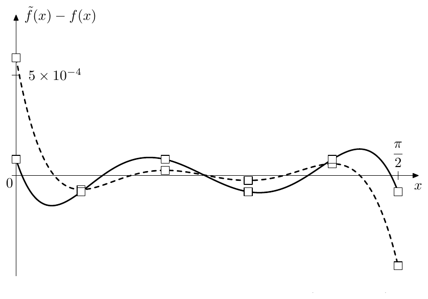

*Figure 10.34: The approximation error before (dashed line) and after (solid
line) a single step of the Remez polynomial approximation algorithm. The
empty square-shaped dots are the control points.*

- The initial approximation $\tilde f(x)$ needs to have the alternating sign
  property. This is more or less ensured by using (10.71) to construct the
  initial approximation. A good choice for $\bar x_n$ (as demonstrated by
  Fig. 10.33) are the roots of the Chebyshev polynomial of order one higher
  than the order of the approximating polynomial $\tilde f(x)$.[^32]

- The control points $\hat x_n$ are the zeros of the error derivative
  $(\tilde f - f)'$ (except for $\hat x_0 = a$ and $\hat x_{N+1} = b$). There
  is exactly one local extremum on each interval $(\bar x_n, \bar x_{n+1})$
  between the zeros of the error. Therefore, $\hat x_{n+1}$ can be simply
  found as the zeros of the error derivative by bisection of the intervals
  $(\bar x_n, \bar x_{n+1})$.

- After having obtained new $a_n$, the old control points $\hat x_n$ are not
  the extrema anymore, however the errors at $\hat x_n$ are still alternating
  in sign. Therefore the new zeros $\bar x_n$ (needed to find the new control
  points by bisection) can be found by bisection of the intervals
  $(\hat x_n, \hat x_{n+1})$.

### Restrictions and variations

Often it is desired to obtain a function which is odd or even, or has some
other restrictions. This can be done by simply fixing the respective $a_n$,
thereby reducing the number of control variables $a_n$ and reducing the
number of control points $\hat x_n$ and zero crossings $\bar x_n$
accordingly.

Remez algorithm can also be easily modified to accommodate a weight function in the minimax norm (10.69):

$$
E = \max_{[a,b]}\Bigl(W(x) \cdot \bigl|\tilde{f}(x) - f(x)\bigr|\Bigr) \qquad W(x) > 0
$$

The error function therefore turns into $W(x)(\tilde{f}(x) - f(x))$, while the
minimax equations (10.72) turn into

$$
\tilde{f}(\hat{x}_n) + (-1)^n W^{-1}(\hat{x}_n)\varepsilon = f(\hat{x}_n) \qquad n = 0, \ldots, N+1
$$

(where $W^{-1}(x)$ is the reciprocal of $W(x)$).

### Remez algorithm for rational approximation

Instead of using a polynomial $\tilde{f}(x)$, better approximations can be
often achieved by rational $\tilde{f}(x)$:

$$
\tilde{f}(x) = \frac{\displaystyle\sum_{n=0}^{N} a_n x^n}{\displaystyle 1 + \sum_{n=1}^{M} b_n x^n} \tag{10.73}
$$

Besides being able to deliver better approximations in certain cases, rational
functions can be often useful for obtaining approximations on infinite
intervals such as $[a, +\infty)$, because by varying the degrees of the
numerator and denominator the asymptotic behavior of $\tilde{f}(x)$ at
$x \to \infty$ can be controlled.

For a rational $\tilde{f}(x)$ defined by (10.73) the minimax equations (10.72)
become nonlinear in respect to the unknowns $\varepsilon$ and $b_n$, although
they are still linear in respect to the unknowns $a_n$:

$$
\begin{aligned}
&\sum_{i=0}^{N} a_i \hat{x}_n^i + (-1)^n \left(1 + \sum_{i=1}^{M} b_i \hat{x}_n^i\right)\varepsilon = \left(1 + \sum_{i=1}^{M} b_i \hat{x}_n^i\right) f(\hat{x}_n) \\
&\hspace{10em} n = 0, \ldots, N+M+1
\end{aligned} \tag{10.74}
$$

Notice that the number of degrees of freedom is now $N + M + 1$. The equations
(10.74) can be solved using different numeric methods for nonlinear equation
solution, however there is one simple trick.[^33] Rewrite (10.74) as

$$
\sum_{i=0}^{N} a_i \hat{x}_n^i + (-1)^n\varepsilon\sum_{i=1}^{M} b_i \hat{x}_n^i + (-1)^n\varepsilon = \left(1 + \sum_{i=1}^{M} b_i \hat{x}_n^i\right) f(\hat{x}_n)
$$

Now we pretend we don't know the free term $\varepsilon$, but we do know the
value of $\varepsilon$ before the sum of $b_i \hat{x}_n^i$:

$$
\sum_{i=0}^{N} a_i \hat{x}_n^i + (-1)^n\varepsilon_0\sum_{i=1}^{M} b_i \hat{x}_n^i + (-1)^n\varepsilon = \left(1 + \sum_{i=1}^{M} b_i \hat{x}_n^i\right) f(\hat{x}_n) \tag{10.75}
$$

where $\varepsilon_0$ is this "known" value of $\varepsilon$. The value of
$\varepsilon_0$ can be estimated e.g. as the average absolute error at the
control points $\hat{x}_n$. Then (10.75) are linear equations in respect to
$a_n$, $b_n$ and $\varepsilon$ and can be easily solved. Having obtained the
new $a_n$ and $b_n$, we can obtain a new estimation for $\varepsilon_0$ and
solve (10.75) again. We repeat until the errors $\tilde{f}(\hat{x}_n) - f(\hat{x}_n)$
at the control points $\hat{x}_n$ become equal in absolute value up to a
necessary precision. At this point we can consider the solution of (10.74) as
being obtained to a sufficient precision and proceed with the usual Remez
algorithm routine (find the new $\bar{x}_n$, new $\hat{x}_n$ etc.)

Here are some further notes.

- In principle the solution of (10.74) doesn't need to be obtained to a very
  high precision, except in the final step of the Remez algorithm. However, in
  order to know whether the current step is the final one or not, we need to
  know the true control points, so that we can estimate how well the
  equiripple condition is satisfied. Ultimately, this is a question of the
  computational expense of finding the new control points vs. computing
  another iteration of (10.75).

- Sometimes, if the equations are strongly nonlinear, the trick (10.75) may
  fail to converge. In this case one could attempt to use the discussed below
  more general Newton-Raphson approach (10.81), where the damping parameter
  may be used to mitigate the convergence problems.

- In regards to the problem of choice of the initial $\tilde{f}(x)$ for the
  rational Remez approximation, notice that the zero error equations (10.71)
  take the form

$$
\sum_{n=0}^{N} a_n \bar{x}^n = f(\bar{x}_n)\left(1 + \sum_{n=1}^{M} b_n \bar{x}^n\right)
$$

  which is fully linear in respect to $a_n$ and $b_n$, and can be easily
  solved.

### Other kinds of approximating functions

In certain cases one could use even more complicated forms of $\tilde{f}(x)$,
which are neither polynomial nor rational. In the general case such function
$\tilde{f}(x)$ is controlled by a number of parameters $a_n$:

$$
\tilde{f}(x) = \tilde{f}(x, a_1, a_2, \ldots, a_N)
$$

(notice that this time the numbering of $a_n$ is starting at one, so that
there are $N$ parameters in total, giving $N$ degrees of freedom). The
minimax equations (10.72) become

$$
\tilde{f}(\hat{x}_n, a_1, a_2, \ldots, a_N) + (-1)^n\varepsilon = f(\hat{x}_n) \qquad n = 0, \ldots, N \tag{10.76}
$$

Introducing functions

$$
\phi_n(a_1, a_2, \ldots, a_N, \varepsilon) = \tilde{f}(\hat{x}_n, a_1, a_2, \ldots, a_N) + (-1)^n\varepsilon - f(\hat{x}_n)
$$

we rewrite the equations (10.76) as

$$
\phi_n(a_1, a_2, \ldots, a_N, \varepsilon) = 0 \qquad n = 0, \ldots, N \tag{10.77}
$$

Introducing vector notation

$$
\boldsymbol{\Phi} = \begin{pmatrix} \phi_0 & \phi_1 & \ldots & \phi_N \end{pmatrix}^{\mathsf{T}}
$$

$$
\mathbf{a} = \begin{pmatrix} a_1 & a_2 & \ldots & a_N & \varepsilon \end{pmatrix}^{\mathsf{T}}
$$

we rewrite (10.77) as

$$
\boldsymbol{\Phi}(\mathbf{a}) = 0 \tag{10.78}
$$

Apparently, (10.78) is a vector form of (10.72), except that now we consider
it as a generally nonlinear equation. Both the function's argument $\mathbf{a}$
and the function's value $\boldsymbol{\Phi}(\mathbf{a})$ have the dimension
$N + 1$, therefore the equation (10.78) is fully defined.

Different numeric methods can be applied to solving (10.78). We will be
particularly interested in the application of multidimensional
Newton-Raphson method. Expanding $\boldsymbol{\Phi}(\mathbf{a})$ into Taylor
series at some fixed point $\mathbf{a}_0$ we transform (10.78) into:

$$
\boldsymbol{\Phi}(\mathbf{a}_0) + \frac{\partial\boldsymbol{\Phi}}{\partial\mathbf{a}}(\mathbf{a}_0) \cdot \Delta\mathbf{a} + o(\Delta\mathbf{a}) = 0 \tag{10.79}
$$

where $\partial\boldsymbol{\Phi}/\partial\mathbf{a}$ is the Jacobian matrix and
$\mathbf{a} = \mathbf{a}_0 + \Delta\mathbf{a}$. By discarding the higher order
terms $o(\Delta\mathbf{a})$, the equation (10.79) is turned into

$$
\Delta\mathbf{a} = -\left(\frac{\partial\boldsymbol{\Phi}}{\partial\mathbf{a}}(\mathbf{a}_0)\right)^{-1} \cdot \boldsymbol{\Phi}(\mathbf{a}_0) \tag{10.80}
$$

The equation (10.80) implies the Newton-Raphson iteration scheme

$$
\mathbf{a}_{n+1} = \mathbf{a}_n - \alpha \cdot \left(\frac{\partial\boldsymbol{\Phi}}{\partial\mathbf{a}}(\mathbf{a}_n)\right)^{-1} \cdot \boldsymbol{\Phi}(\mathbf{a}_n) \tag{10.81}
$$

where the damping factor $\alpha$ is either set to unity, or to a lower value,
if the nonlinearity of $\boldsymbol{\Phi}(\mathbf{a})$ is too strong and
prevents the iterations from convergening. The initial value $\mathbf{a}_0$ is
obtained from the initial settings of the parameters $a_n$ and the estimated
initial value of $\varepsilon$. As for the rational $\tilde{f}(x)$, the
initial value of $\varepsilon$ can be estimated e.g. as the average error at
the control points.

Similarly to the rational approximation case, the solution of (10.78) doesn't
need to be obtained to a very high precision during the intermediate steps of
the Remez algorithm. However the same tradeoff between computing the
iteration step (10.81) and finding the new control points applies.

The choice of the initial $\tilde{f}(x)$ can be done based on the same
principles. The zero error equations (10.71) turn into

$$
\phi_n(a_1, a_2, \ldots, a_N, 0) = 0 \qquad n = 1, \ldots, N
$$

(notice that compared to (10.77) we have set $\varepsilon$ to zero and we have
$N$ rather than $N+1$ equations). Letting

$$
\bar{\boldsymbol{\Phi}} = \begin{pmatrix} \phi_1 & \phi_2 & \ldots & \phi_N \end{pmatrix}^{\mathsf{T}}
$$

$$
\bar{\mathbf{a}} = \begin{pmatrix} a_1 & a_2 & \ldots & a_N \end{pmatrix}^{\mathsf{T}}
$$

we have an $N$-dimensional nonlinear equation

$$
\bar{\boldsymbol{\Phi}}(\bar{\mathbf{a}}) = 0
$$

which can be solved by the same Newton-Raphson method:

$$
\bar{\mathbf{a}}_{n+1} = \bar{\mathbf{a}}_n - \alpha \cdot \left(\frac{\partial\bar{\boldsymbol{\Phi}}}{\partial\bar{\mathbf{a}}}(\bar{\mathbf{a}}_0)\right)^{-1} \cdot \bar{\boldsymbol{\Phi}}(\bar{\mathbf{a}}_0) \tag{10.82}
$$

## 10.14 Numerical construction of phase splitter

For the sake of a demonstration example we are now going to use Remez
algorithm to build an approximation of the ideal $90^\circ$ allpass phase
shifter defined by (10.50), while deliberately staying away from the entire
framework of elliptic functions. The obtained results shall be identical to
the ones previously obtained analytically.

We will retain the mentioned allpass property in the approximation, therefore
let $H(s)$ denote the allpass which should approximate the ideal phase shifter
(10.50). Using serial decomposition, $H(s)$ can be decomposed into series of
2- and 1-pole allpasses. Since we aim to have $H(s)$ with as flat (actually,
constant in the range of interest) phase response as possible, 2-poles seem
to be less useful than 1-poles, due to steeper phase responses of the former
(Figs. 10.35 and 10.36).

Restricting ourselves to using just 1-poles we have:

$$
H(s) = \prod_{n=1}^{N} A_n(s) = \prod_{n=1}^{N} \frac{\omega_n - s}{\omega_n + s} \tag{10.83}
$$

where $\omega_n$ are the cutoffs of the 1-pole allpasses $A_n(s)$. Notice that
the specific form of specifying $H(s)$ in (10.83) ensures $H(0) = 1\ \forall N$,
that is we wish to have a $0^\circ$ rather than $-180^\circ$ phase response at
$\omega = 0$.

Now the idea is the following. Suppose $N = 0$ in (10.83) (that is we have no
1-pole allpasses in the serial decomposition yet). Adding the first allpass
$A_1$ at the cutoff $\omega_1$ we make the phase response of (10.83) equal to
the one of a 1-pole allpass (Fig. 10.35). From $\omega = 0$ to $\omega = \omega_n$
the phase response is kind of what we expect it to be: it starts at
$\arg H(0) = 0$ and then decreases to $\arg H(j\omega_n) = -\pi/2$. However,
after $\omega = \omega_n$ it continues to decrease, which is not what we want.
Therefore we insert another allpass $A_2$ with a *negative cutoff* $-\omega_2$:

$$
H(s) = \frac{\omega_1 - s}{\omega_1 + s} \cdot \frac{-\omega_2 - s}{-\omega_2 + s} \qquad 0 < \omega_1 < \omega_2
$$

Clearly, $A_2$ is unstable. However, we already know that unstable components
of $H(s)$ are not a problem, since they simply go into the $H_+^{-1}$ part of
the phase splitter.

The phase response of a negative-cutoff allpass (Fig. 10.37) is the inversion
of Fig. 10.35. Therefore, given sufficient distance between $\omega_1$ and
$\omega_2$, the phase response of $H$ will first drop below $-\pi/2$ (shortly
after $\omega = \omega_1$) and then at some point turn around and grow back
again (Fig. 10.38). Then we insert another positive-cutoff allpass $A_3$,
then a negative-cutoff allpass $A_4$ etc., obtaining if not an equiripple
approximation of $-90^\circ$ phase response, then something of a very similar
nature (Fig. 10.39).

The curve in Fig. 10.39 has two obvious problems. The ripple amplitude is way
too large. Furthermore, in order to obtain this kind of curve, we need to
position the cutoffs $\omega_n$ pretty wide apart (4 octaves between the
neighboring cutoffs is a safe bet). We would like to position the cutoffs
closer together, thereby reducing the ripple amplitude, however the uniform
spacing of the cutoffs doesn't work very well for denser spacings of the
cutoffs. We need to find a way to identify the optimum cutoff positions.

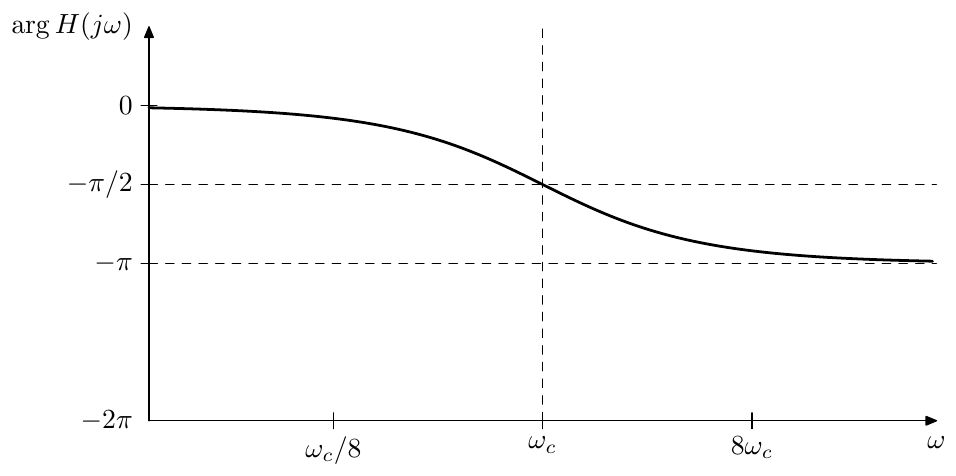

*Figure 10.35: Phase response of a 1-pole allpass filter.*

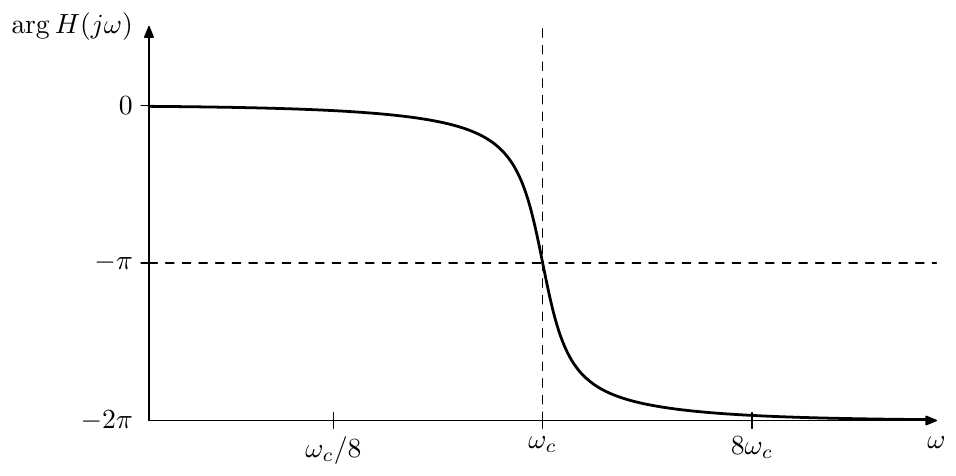

*Figure 10.36: Phase response of a 2-pole allpass filter.*

Using cutoffs of alternating signs, we rewrite the transfer function
expression (10.83) as

$$
H(s) = \prod_{n=1}^{N} A_n(s) = \prod_{n=1}^{N} \frac{(-1)^{n+1}\omega_n - s}{(-1)^{n+1}\omega_n + s} \qquad 0 < \omega_1 < \omega_2 < \ldots < \omega_N \tag{10.84}
$$

(the cutoff of $A_1$ needs to be positive in order for the phase response of
$H$ to have a negative derivative at $\omega = 0$). Considering that the phase
response of a 1-pole allpass with cutoff $\omega_c$ is

$$
H(j\omega) = -2\arctan\frac{\omega}{\omega_c}
$$

the phase response of the serial decomposition (10.84) is

$$
\varphi(x) = \arg H(j\omega) = 2\sum_{n=1}^{N} (-1)^n \arctan\frac{\omega}{\omega_n} = 2\sum_{n=1}^{N} (-1)^n \arctan e^{x - a_n} \tag{10.85}
$$

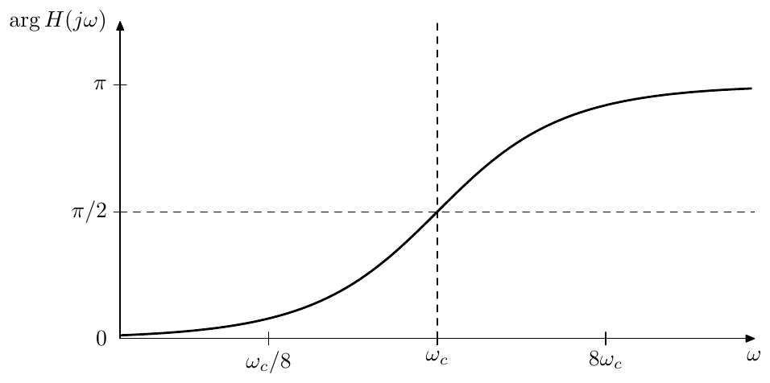

*Figure 10.37: Phase response of a negative-cutoff 1-pole allpass filter.*

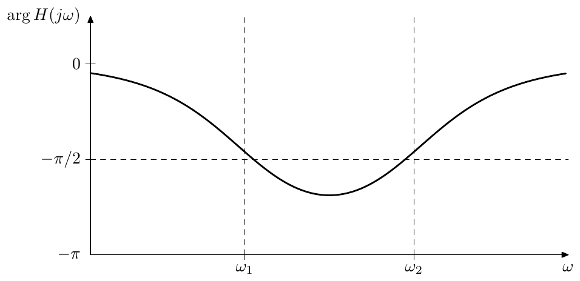

*Figure 10.38: Phase response of a pair of a positive-cutoff and a
negative-cutoff 1-pole allpass filters. Frequency scale is logarithmic.*

$$
\begin{aligned}
\omega &= e^x \\
\omega_n &= e^{a_n}
\end{aligned}
$$

where $x$ and $a_n$ are the logarithmic scale counterparts of $\omega$ and
$\omega_n$ (essentially these are the pitch-scale values, we have just used
$e$ rather than 2 as the base to simplify the expressions of the derivatives
of $\varphi$). The reason to use the logarithmic scale in (10.85) is that the
phase responses of 1-pole allpasses are symmetric in the logarithmic scale,
therefore the entire problem gets certain symmetry and uniformity.

Now we are in a position to specify the minimax approximation problem of
construction of the phase shifter $H_{-90}$. We wish to find the minimax
approximation of $f(x) \equiv -\pi/2$ on the specified interval
$x \in [x_{\min}, x_{\max}]$, where the approximating function $\varphi(x)$
needs to be of the form (10.85).

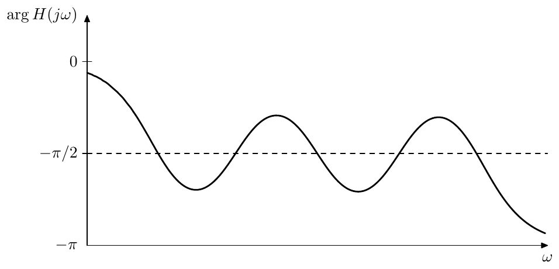

*Figure 10.39: Phase response of a series of alternating positive-cutoff and
negative-cutoff 1-pole allpass filters. Frequency scale is logarithmic.*

The approximating function $\varphi(x)$ has $N$ parameters:

$$
\varphi(x) = \varphi(x, a_1, a_2, \ldots, a_N)
$$

which can be found by using the Remez algorithm for approximations of general
form. Notably, for larger $N$ and smaller intervals $[x_{\min}, x_{\max}]$ the
problem becomes more and more nonlinear, requiring smaller damping factors
$\alpha$ in (10.81) and (10.82). The damping factors may be chosen by
restricting the lengths $|\mathbf{a}_{n+1} - \mathbf{a}_n|$ and
$|\bar{\mathbf{a}}_{n+1} - \bar{\mathbf{a}}_n|$ in (10.81) and (10.82).

In order to further employ the logarithmic symmetry of the problem (although
this is not a must), we may require $x_{\min} + x_{\max} = 0$ corresponding to
$\omega_{\min}\omega_{\max} = 1$. Then the following applies.

- Due to the symmetry $\omega_{\min}\omega_{\max} = 1$ the obtained cutoffs
  $\omega_n$ will also be symmetric: $\omega_n \omega_{N+1-n} = 1$. (Actually
  they will be symmetric relatively to $\sqrt{\omega_{\min}\omega_{\max}}$ no
  matter what the $\omega_{\min}$ and $\omega_{\max}$ are, but it's convenient
  to have this symmetry more explicitly visible.)

- Using this symmetry the number of cutoff parameters can be halved (for odd
  $N$ the middle cutoff $\omega_{(N+1)/2}$ is always at unity and therefore
  can be also excluded from the set of varying parameters). Essentially we
  simply restrict $\varphi(x)$ to be an odd (for odd $N$) or even (for even
  $N$) function of $x$.

- The obtained symmetric range $[\omega_{\min}, \omega_{\max}]$ can be scaled
  by an arbitrary constant $A$ by scaling the allpass cutoffs by the same
  constant:

$$
\begin{aligned}
[\omega_{\min}, \omega_{\max}] &\leftarrow [A\omega_{\min}, A\omega_{\max}] \\
\omega_n &\leftarrow A\omega_n
\end{aligned}
$$

Figs. 10.40 and 10.41 contain example approximations of $H_{-90}(s)$ obtained
by cutoff optimization (for the demonstration purposes, the approximation
orders have been chosen relatively low, giving the phase ripple amplitude of
an order of magnitude of $1^\circ$). The readers are encouraged to compare
these pictures (qualitatively, since the specified filter orders and
bandwidths do not match) to Fig. 10.28.

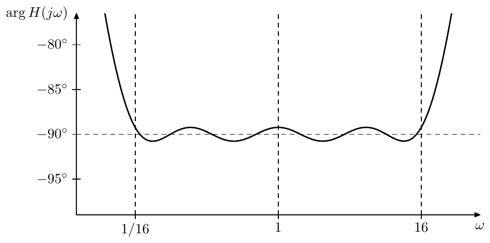

*Figure 10.40: 8th-order minimax approximation of the ideal $H_{-90}(s)$.*

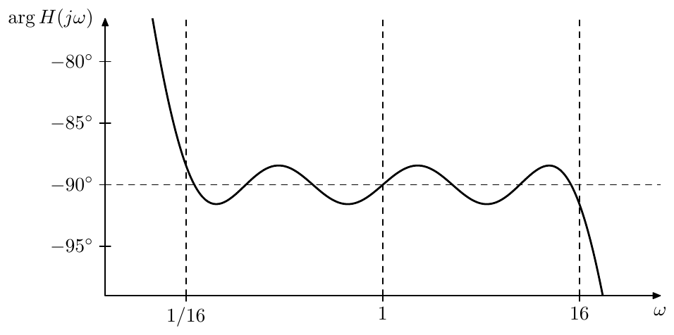

*Figure 10.41: 7th-order minimax approximation of the ideal $H_{-90}(s)$.*

Instead of solving the initial approximation equation (10.82) there is a
different approach, which generally results in the nonlinearity of
$\boldsymbol{\Phi}(\mathbf{a})$ not so strongly affecting the algorithm
convergence. We could take the manually constructed (10.84) with 4-octave
spaced cutoffs $\omega_{n+1} = 16\omega_n$ as our initial approximation. The
formal range of interest could contain two additional octaves on each side:
$\omega_{\min} = \omega_1/4$, $\omega_{\max} = 4\omega_N$. Employing the
logarithmic symmetry, we center the whole range around $\omega = 1$, so that
$\omega_{\min}\omega_{\max} = 1$.

Using (10.81) (in the logarithmic scale $x$) we refine the initial
approximation to the ripples of equal amplitude. Then we simply shrink the
range a little bit. An efficient shrinking substitution is using the
geometric averages:

$$
\begin{aligned}
\omega_{\min} &\leftarrow \sqrt{\omega_{\min}\omega_1} \\
\omega_{\max} &\leftarrow \sqrt{\omega_{\max}\omega_N}
\end{aligned} \tag{10.86}
$$

The substitution (10.86) doesn't affect the control points $\hat{x}_n$ or the
zeros $\bar{x}_n$ of the Remez algorithm. Therefore after the substitution the
Remez algorithm can be simply run again. Then the substitution is performed
again, and so on, until we shrink the interval $[\omega_{\min}, \omega_{\max}]$
to the exact desired range.[^34]

Notice that the approximations on the intermediate ranges
$[\omega_{\min}, \omega_{\max}]$ do not need to be obtained with a very high
precision, since their only purpose is to provide a starting point for the
next application of the Remez algorithm on a smaller range. It is only the
Remez algorithm on the exact desired range, which needs to be run to a high
precision. This can noticeably improve the algorithm's running time.

## Summary

We have discussed various approaches to the construction of shelving filters,
crossovers and Hilbert transformers. The basis for the construction happened
to be mostly EMQF filters, with 1st-kind Butterworth as their limiting case.
The slope control in higher-order shelving filters was implemented using
2nd-kind Butterworth filters, although EMQF filters can also be used here with
the drawback of having ripples in the pass and shelving bands.

### Further reading

S.J.Orfanidis, *Lecture notes on elliptic filter design* (available on the
author's webpage).

M.Kleehammer, *Mathematical development of the elliptic filter* (available in
QSpace online repository).

*Elliptic filter* (Wikipedia artile).

L.M.Milne-Thomson, *Jacobian elliptic functions and theta functions* and
*Elliptic Integrals* (contained in *Handbook of mathematical functions* by
M.Abramowitz and I.A.Stegun, available on the internet).

[^1]: Notice that incidentally this implies that $f(x)$ is a discrete-time allpass transfer function, although not necessarily describing a stable allpass.

[^2]: The author has learned the approach of constructing a shelving filter as a ratio of two lowpasses from Teemu Voipio.

[^3]: It would have been okay, if all zeros of $G(s)$ were at the origin, since in this case the zeros of $G(s/M)$ and $G(Ms)$ would be also at the origin and therefore would cancel each other. Particularly, we could have used Butterworth highpass filters in (10.6), but this wouldn't have produced any new results compared to Butterworth lowpasses.

[^4]: The other option $\bar f(1/\omega)\bar f(\omega) = -1$ implied by (10.10) implies $\bar f^2(1) = -1$, therefore we ignore it.

[^5]: It's not difficult to realize that the 6 in the denominator is 1-pole
    lowpass filter's rolloff of 6dB/oct.

[^6]: This can be derived from the fact that in this case $H(s)$ has real poles
    and zeros which are mutually reciprocal. Thus, each such reciprocal
    pole/zero pair makes up a 1-pole tilting filter. The gain $M^2$ of the
    tilting 2-pole filter is distributed into two 1-pole tilting filter's
    gains, each equal to $M$.

[^7]: Since the 2-pole tilting filter is essentially a ratio of two 2-pole
    lowpass filters with mutually reciprocal cutoffs, and since these
    lowpasses obtain a resonance peak at $R < 1/\sqrt{2}$, it is intuitively
    clear that either immediately below $R = 1/\sqrt{2}$ or possibly starting
    from a slightly lower boundary these peaks will show up in amplitude
    response of the tilting filter. In Section 10.7 we will establish that at
    $R < 1\sqrt{2}$ the filter will go into elliptic range, and it will follow
    that the elliptic ripples (showing up as resonance peaks for 2nd-order
    filters) will appear immediately below $R = 1/\sqrt{2}$.

[^8]: Note that the relative steepness $\kappa$ of the amplitude response thereby
    provides a natural way to control the steepness variation, where $\kappa = k/k_1$,
    where $k$ is the actual derivative of the amplitude response at the midpoint
    and $k_1$ is the same derivative for $H_1(s)$ (for the currently chosen tilting
    amount $M$).

[^9]: Unfortunately there is no 100% generalization of this process for
    lowpass, highpass or bandpass filters, since the rolloff of these filter types
    is fixed to an integer multiple of 6dB/oct and can't be varied in a smooth
    way.

[^10]: Alternatively, by multiplying the response by $M$ we obtain a kind of
    "inverted band-shelving" filter, where the shelving bands are to the left
    and to the right of the passband in the middle.

[^11]: Thus, differently from how we used (9.152) in the discussion of
    elliptic lowpass, we treat $\varepsilon$ and $\lambda$ now as independent variables.
    This doesn't affect the solution process of (9.152), since the respective
    transformations didn't use the interdependency of $\varepsilon$ and $\lambda$.

[^12]: We should mind that the dependency between the transition bandwidth
    and $\tilde k$ is reciprocal-like: larger $\tilde k$ means smaller bandwidth. The
    other two dependencies are straightforward.

[^13]: Particularly, notice that (10.25) becomes identical to (10.17) for
    $\beta = M^2$.

[^14]: Notice that such switching is completely smooth, as the transfer
    functions of the filters are completely identical at this point and the
    "physical" orders of the filters are identical too (there is no pole/zero
    cancellation as we had in the Butterworth filter order switching). Strictly
    speaking, the statement that the transfer functions are identical holds
    only under the restriction that the phase responses of the filters are in
    sync, rather that $180^\circ$ off, which is a matter of the sign in front of the
    transfer functions. However usually we are having zero phase responses at
    $\omega = 0$, therefore the signs will be automatically matched.

[^15]: In principle, by general considerations, one should be able to connect two identical parallel
    representations in series and obtain modal mixtures from those in a fashion similar to the
    multimode serial cascade. The author however didn't verify the feasibility of this approach.

[^16]: The author has been made aware of the importance of the in-phase property of Linkwitz-
    Riley crossovers by a remark by Teemu Voipio. The author also learned the cascaded phase
    correction approach shown in Fig. 10.24 from the same person.

[^17]: The idea to generalize the Linkwitz-Riley design arose from a remark by Max Mikhailov,
    that Linkwitz-Riley crossovers can be also built based on naive 1-pole lowpasses, which in the
    BLT terms can be formally seen as a special kind of high-shelving filters. It is quite possible
    that this idea has been already developed elsewhere, however at the time of the writing the
    author is not aware of other sources.

[^18]: In order to show that this factoring is possible, multiply $H_2(j\omega) = H_{AP}(j\omega) - H_1(j\omega)$
    by $P^2(j\omega)$, obtaining $H_2(j\omega)P^2(j\omega) = P(j\omega)P(-j\omega) - P_1(j\omega)P_1(-j\omega) \geq 0$, where the latter
    inequality follows from $|G_1(j\omega)|^2 \leq 1$.

[^19]: This would have been formally possible if $A_{23}$ is allowed to be unstable, however the order of $A_{23}$ would have been equal to the sum of the orders of $A_2$ and $A_3$. We mention this because this has a clear analogy to the phase splitter discussed later in the text.

[^20]: The identity transfer function 1 in the left-hand side obviously has no poles, but we could also write it as $(1+jf)/(1+jf)$ in which case it formally has the same poles (which are then cancelled by the zeros).

[^21]: Since we want our allpass approximation of $H_{-90}$ to be a real
    filter, its phase response must be odd, which leaves only two possible
    values at $\omega = 0$: $\varphi(0) = 0$ or $\varphi(0) = 180^\circ$. If
    we formally include $\omega = \infty$ into the range of frequencies of
    interest, then we notice that the phase response at $\omega = \infty$
    has the same two options.

[^22]: In order to convince oneself that this is indeed so, one could factor
    a generic stable allpass tranfer function into 1st- and 2nd-order
    sections and consider their phase responses, which are monotonically
    decaying.

[^23]: Except that we would obtain both stable and unstable poles this time,
    since there is no explicit restriction of the solutions having to be in
    the left semiplane.

[^24]: Apparently the imaginary axis belongs to the family of lines shown in
    Fig. 9.54, being the boundary case between the two groups of lines on
    the left and on the right.

[^25]: The same reasoning can be applied to (10.45), where we want the
    imaginary signal to be phase shifted by $-90^\circ$ compared to the real
    one. Therefore the lowest-cutoff allpass factor (corresponding to the
    pole closest to the origin) must be in the imaginary signal's allpass.
    Since the poles of the allpasses in (10.45) are obtained by Riemann
    sphere rotation $\rho_{+j}$, the pole closest to the origin will be
    obtained from the pole closest to $-j$, which is an even pole for $N$
    odd and an odd pole for $N$ even.

[^26]: Note that if desired, we can also find $k$ from $k_2'$ by (9.110)
    (where we let $k_0 = k$).

[^27]: The signal notations $y_+$ and $y_-$ denote the positive- and
    negative-shifted signals respectively and shouldn't be confused with the
    "+" and "-" subscripts of $H_+^{-1}$ and $H_-$ which denote the stable and
    unstable poles.

[^28]: The description of Remez algorithm (which is a numerical minimax
    optimization algorithm) was included into earlier revisions of this book
    as an alternative to the use of elliptic functions to construct phase
    splitters. Now that the book is strongly focusing on elliptic functions
    anyway, the discussion of Remez algorithm might feel almost redundant.
    However the author felt that this is still quite valuable resource to be
    simply dropped from the book. Particularly, Remez algorithm is useful for
    building low-cost approximations of functions, although, depending on the
    context, minimax solutions are not necessarily the best ones for a given
    purpose.

[^29]: The maximum of the absolute value of a function is also the
    $L_\infty$ norm of the function. Therefore minimax approximations are
    optimizations of the $L_\infty$ norm.

[^30]: The Remez algorithm should not be confused with the Parks-McClellan
    algorithm. The latter is a specific restricted version of the former. For
    whatever reason, the Parks-McClellan algorithm is often referred to as
    the Remez algorithm in the signal processing literature.

[^31]: The author's primary resource for the information about the Remez
    algorithm was the documentation for the math toolkit of the *boost*
    library by J.Maddock, P.A.Bristow, H.Holin and X.Zhang.

[^32]: This becomes kind of intuitive after considering Chebyshev polynomials
    as *some kind* of minimax approximations of the zero constant function
    $f(x) \equiv 0$ on the interval $[-1,1]$.

[^33]: This trick is adapted from the *boost* library documentation and
    sources.

[^34]: Of course at the last step we simply set $\omega_{\min}$ and
    $\omega_{\max}$ to the desired values, rather than perform the
    substitution (10.86).
