# Chapter 11: Multinotch filters

Multinotch filters have various uses. One of their most common applications
is in phaser and flanger effects, which are built by modulating the parameters
(in the simplest and the most common case just the cutoff) of the respective
multinotch by an LFO. The main difference between a phaser and a flanger is
that in the former the multinotch filter is based around a chain of
differential allpass filters, while in the latter the allpass chain is
replaced by a delay (thus making a comb filter).

## 11.1 Basic multinotch structure

Let $G(s)$ be an arbitrary allpass:

$$
|G(j\omega)| = 1
$$

$$
\arg G(j\omega) = e^{j\varphi(\omega)}
$$

where $\varphi(\omega)$ is the allpass's phase response, and consider the
transfer function of the form

$$
H(s) = \frac{1 + G(s)}{2} \tag{11.1}
$$

corresponding to the system in Fig. 11.1.

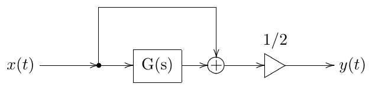

*Figure 11.1: A basic multinotch. $G(s)$ is an allpass.*

Writing out the amplitude response of $H(s)$ we have

$$
\begin{aligned}
|H(j\omega)|^2 &= \left|\frac{1+e^{j\varphi}}{2}\right|^2 = \left|\frac{1+\cos\varphi+j\sin\varphi}{2}\right|^2 = \\
&= \frac{(1+\cos\varphi)^2+\sin^2\varphi}{4} = \frac{2+2\cos\varphi}{4} = \frac{1+\cos\varphi}{2} = \cos^2\frac{\varphi}{2}
\end{aligned}
$$

and

$$
|H(j\omega)| = \left|\cos\frac{\varphi(\omega)}{2}\right|
$$

Thus

$$
\begin{aligned}
|H(j\omega)| = 1 &\iff \varphi = 2\pi n \\
|H(j\omega)| = 0 &\iff \varphi = \pi + 2\pi n
\end{aligned}
\qquad (n \in \mathbb{Z})
$$

The points $|H(j\omega)| = 1$ where the amplitude response of $H(s)$ is
maximal are referred to as *peaks* and the points $|H(j\omega)| = 0$ where the
amplitude response of $H(s)$ is minimal are referred to as *notches*. So the
peaks occur where the phase response of the allpass $G(s)$ is zero and the
notches occur where the phase response of the allpass $G(s)$ is $180^\circ$. This is
also fully intuitive: when the phase response of $G(s)$ is zero, both mixed
signals add together, when the phase response of $G(s)$ is $180^\circ$, both mixed
signals cancel each other.

The filters whose phase response contains several notches are referred to as
*multinotch* filters. Apparently the filter in Fig. 11.1 is a multinotch.

## 11.2 1-pole-based multinotches

The allpass $G(s)$ can be arbitrary. However there are some commonly used
options. One of such options is to use a chain of identically tuned 1-pole
allpasses:

$$
G(s) = G_1^N(s) \qquad G_1(s) = \frac{1-s}{1+s}
$$

The phase response of a 1-pole allpass according to (2.13) is

$$
\arg G_1(j\omega) = -2\arctan\omega
$$

Respectively

$$
\varphi(\omega) = \arg G(j\omega) = N \arg G_1(j\omega) = -2N\arctan\omega
$$

(Fig. 11.2). The symmetry of the graph of $\varphi(\omega)$ in the logarithmic
frequency scale is apparently due to the same symmetry of the phase response
of the 1-pole allpass.

So the peaks occur whenever

$$
\varphi = -2N\arctan\omega = -2\pi n \iff \omega = \tan\frac{2\pi n}{2N} = \tan\frac{\pi n}{N}
$$

and the notches occur whenever

$$
\varphi = -2N\arctan\omega = -\pi - 2\pi n \iff \omega = \tan\frac{\pi+2\pi n}{2N} = \tan\frac{\frac{\pi}{2}+\pi n}{N}
$$

Or, combining peaks and notches together, we have

$$
\varphi = -2N\arctan\omega = -\pi n \iff \omega = \tan\frac{\pi n}{2N}
$$

Since we need $0 \le \omega \le +\infty$, the range of values of $n$ is
obtained from

$$
0 \le \frac{\pi n}{2N} \le \frac{\pi}{2}
$$

giving

$$
0 \le n \le N
$$

Thus the total count of peaks plus notches is $N+1$. Noticing that the peaks
correspond to even values of $n$ and notches correspond to odd values of $n$
we have the following pictures:

**If $N$ is even** there are $N/2+1$ peaks (including the ones at $\omega=0$
and $\omega=+\infty$) and $N/2$ notches. Figs. 11.3 and 11.4 illustrate.

**If $N$ is odd** there are $(N+1)/2$ peaks (starting at the one at
$\omega=0$) and $(N+1)/2$ notches (the last notch occuring at $\omega=+\infty$).
Fig. 11.5 illustrates.

Odd counts are less commonly used due to unsymmetric shape of the amplitude
response.

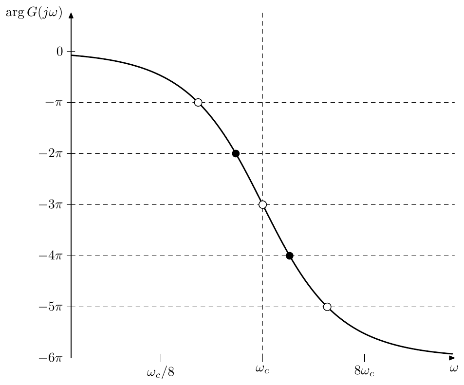

*Figure 11.2: Phase response of a chain of 6 identical 1-pole allpasses. Black
dots correspond to multinotch's peaks, white dots correspond to multinotch's
notches.*

## 11.3 2-pole-based multinotches

Instead of 1-pole allpasses we could use 2-pole allpasses:

$$
G(s) = G_2^N(s) \qquad G_2(s) = \frac{1-2Rs+s^2}{1+2Rs+s^2}
$$

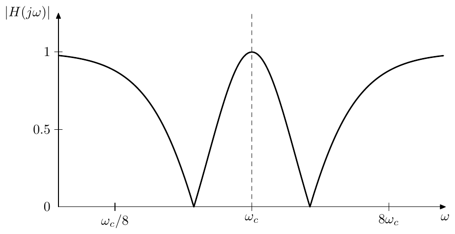

*Figure 11.3: Amplitude response of a multinotch built around a chain of 4
identical 1-pole allpasses.*

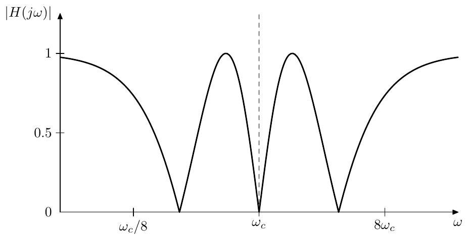

*Figure 11.4: Amplitude response of a multinotch built around a chain of 6
identical 1-pole allpasses.*

Note that at $R=1$ we obtain an equivalent of a chain of $2N$ 1-pole allpasses.

According to (4.24) and (4.5) the phase response of a 2-pole allpass is

$$
\arg G_2(j\omega) = -2\operatorname{arccot}\frac{\omega^{-1}-\omega}{2R}
$$

or, in terms of logarithmic frequency scale (where we also use (4.6))

$$
\arg G_2(je^x) = -2\operatorname{arccot}\frac{-\sinh x}{R}
$$

Thus

$$
\begin{aligned}
\varphi(\omega) &= \arg G(j\omega) = N \arg G_2(j\omega) = -2N\operatorname{arccot}\frac{\omega^{-1}-\omega}{2R} \\
\varphi(e^x) &= \arg G(je^x) = N \arg G_2(je^x) = -2N\operatorname{arccot}\frac{-\sinh x}{R}
\end{aligned}
$$

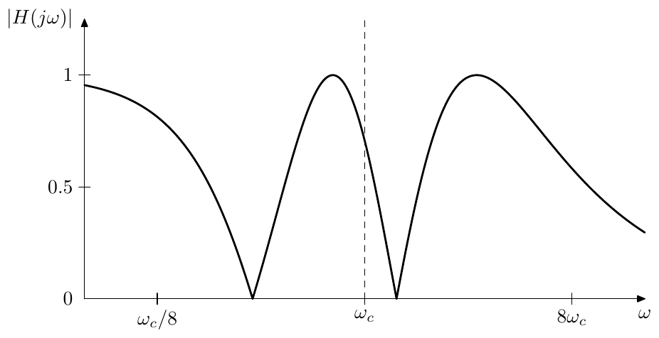

*Figure 11.5: Amplitude response of a multinotch built around a chain of 5
identical 1-pole allpasses.*

Thus this time $\varphi(\omega)$ is going from $0$ to $-2\pi N$, which means
that we obtain only symmetric amplitude responses, similar to the ones which
we were getting for even numbers of 1-pole allpasses. Fig. 11.6 illustrates.
By adjusting the value of $R$ we change the steepness of the phase response
and thereby the distance between the notches.

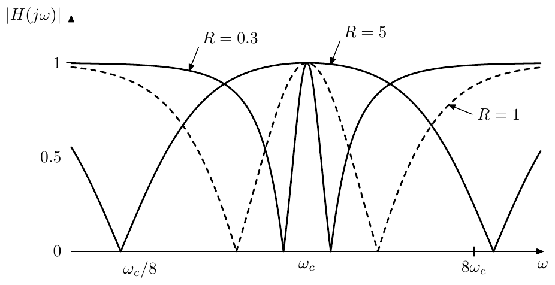

*Figure 11.6: Amplitude response of a multinotch built around a chain of 2
identical 2-pole allpasses (at different damping values).*

The first notch occurs at $\varphi = -\pi$, that is

$$
-2N\operatorname{arccot}\frac{-\sinh x}{R} = -\pi
$$

or

$$
\sinh x = -R\cot\frac{\pi}{2N}
$$

from where we can obtain the logarithmic position of the first notch

$$
x = -\sinh^{-1}\left(R\cot\frac{\pi}{2N}\right) < 0
$$

The logarithmic position of the last notch is respectively $-x$ and the
logarithmic bandwidth (in base $e$) is therefore $-2x$, while the respective
bandwidth in octaves is $-2x/\ln 2$:

$$
\Delta = \frac{2}{\ln 2}\sinh^{-1}\left(R\cot\frac{\pi}{2N}\right)
$$

Notice the obvious similarly of the above formula to (4.19).

## 11.4 Inversion

By multiplying an allpass filter's output by $-1$ we obtain another allpass.
At frequencies where the phase response was $0^\circ$ we thereby obtain $180^\circ$ and
vice versa. This means that if such allpass is used as a core of the
multinotch in Fig. 11.1, inverting the allpass's output will swap the peak
and notch positions (compare Fig. 11.7 vs. Fig. 11.4).

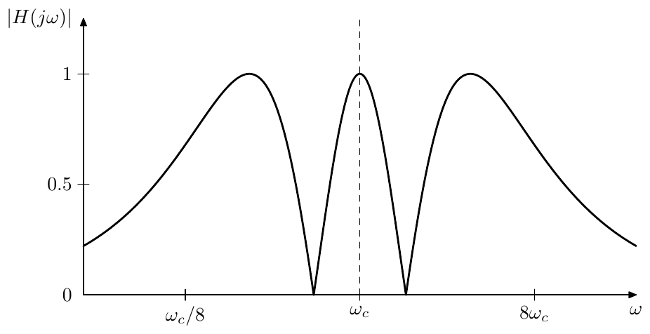

*Figure 11.7: Amplitude response of a multinotch built around a chain of 6
identical 1-pole allpasses with inversion (compare to Fig. 11.4).*

The structure of Fig. 11.1 can be modified as shown in Fig. 11.8 to
accomodate optional inversion.

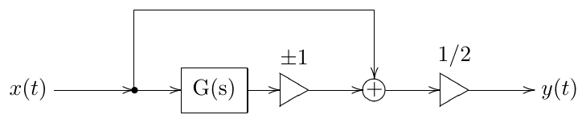

*Figure 11.8: Multinotch from Fig. 11.1 with optional inversion.*

## 11.5 Comb filters

A delay is also an allpass. It is not a differential allpass, since it's not
based on integrators, but it is still an allpass. Indeed, taking the delay
equation

$$
y(t) = x(t-T)
$$

where $T$ is delay time and letting $x(t) = Ae^{st}$ we have

$$
y(t) = Ae^{s(t-T)} = e^{-sT}\cdot Ae^{st} = e^{-sT}\cdot x(t)
$$

Since the delay is linear (in the sense that a delayed linear combination of
two signals is equal to the same linear combination of these signals delayed
separately) we could apply (2.7) which means that the transfer function of
the delay is

$$
H(s) = e^{-sT}
$$

Apparently

$$
\begin{aligned}
|H(j\omega)| &= 1 \\
\arg H(j\omega) &= -\omega T
\end{aligned}
$$

and thus the delay is an allpass.

Therefore we can use the delay as the allpass core of the multnotch filter in
Fig. 11.1. Letting $G(s) = e^{-sT}$ we have $\varphi(\omega) = -\omega T$
(Fig. 11.9). The peak/notch equation is respectively

$$
-\omega T = -\pi n
$$

from where

$$
\omega = \frac{\pi n}{T} = 2\pi \cdot \frac{n}{2T}
$$

or, in ordinary frequency scale

$$
f = \frac{n}{2T}
$$

The peaks and notches are therefore harmonically spaced with a step of $1/2T$
Hertz (Fig. 11.10). The amplitude response in Fig. 11.10 looks like a comb.
Hence this kind of multinotch filters are referred to as *comb filters*.

Since the peaks and notches of the comb filter's amplitude response occur at
$f = n/2T$, the frequency $1/2T$ is the fundamental frequency of this
harmonic series. It is convenient to use this frequency as comb's filter
formal cutoff $f_c = 1/2T$.

If there is no inversion, then (excluding the DC peak at $f=0$) the peaks of
the amplitude response are located at frequencies $2f_c, 4f_c, 6f_c$, etc.
This makes the perceived fundamental frequency of the comb filter (especially
in the case of a strong resonance[^1]) rather be $2f_c$. However in the case
of inversion the peaks are located at $f_c, 3f_c, 5f_c$, etc., giving an
impression (which is stronger in the case of a strong resonance) of an
odd-harmonics-only signal at frequency $f_c$.

## 11.6 Feedback

Suppose we introduce feedback into the structure of Fig. 11.1 as shown Fig.
11.11. Now the output of the allpass $G(s)$ is not anymore purely the
allpassed input signal. Let's introduce the notation $\tilde y(t)$ for the
post-allpass signal (as shown in Fig. 11.11) and $\tilde G(s)$ for the
respective transfer function (in the sense of $\tilde y = G(s)x$ for complex
exponential $x$). We also introduce the pre-allpass signal $\tilde x(t)$, but
we are not going to use it for now. Then we are having

$$
\tilde G(s) = \frac{G(s)}{1 - kG(s)}
$$

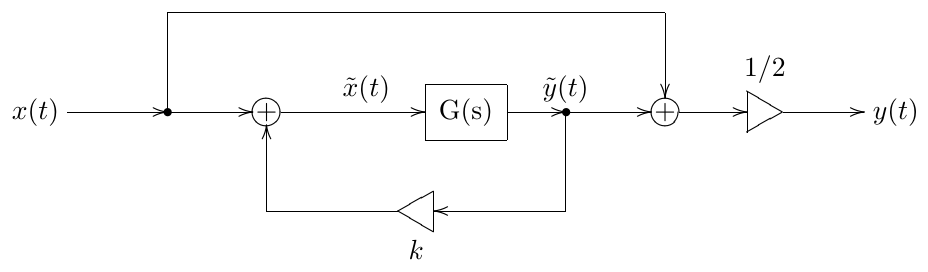

*Figure 11.11: Multinotch from Fig. 11.1 with added feedback. Note that this
figure is showing a poor mixing option.*

The transfer function of the entire multinotch thereby turns into

$$
H(s) = \frac{1 + \tilde G(s)}{2} = \frac{1}{2}\cdot\frac{1 - kG(s) + G(s)}{1 - kG(s)} = \frac{1}{2}\cdot\frac{1 + (1-k)G(s)}{G(s)}
$$

or, in frequency response terms

$$
H(j\omega) = \frac{1}{2}\cdot\frac{1 + (1-k)e^{j\varphi}}{1 - ke^{j\varphi}}
$$

We can immediately notice that as soon as $k > 0$ the numerator of the
frequency response doesn't turn to zero anymore, respectively we are not
having fully deep notches in the amplitude response (Fig. 11.12).

Instead of mixing $\tilde y(t)$ with $x(t)$ let's mix it with $\tilde x(t)$,
as shown in Fig. 11.13. The transfer function corresponding to the signal
$\tilde x(t)$ in Fig. 11.11 is

$$
\frac{\tilde G(s)}{G(s)} = \frac{1}{1-kG(s)}
$$

and thus we obtain

$$
H(s) = \frac{1}{2}\cdot\left(\frac{1}{1-kG(s)} + \frac{G(s)}{1-kG(s)}\right) = \frac{1}{2}\cdot\frac{1+G(s)}{1-kG(s)}
$$

This transfer funtion looks much better, since it preserves fully deep
notches. The frequency response turns into

$$
H(j\omega) = \frac{1}{2}\cdot\frac{1+e^{j\varphi}}{1-ke^{j\varphi}}
$$

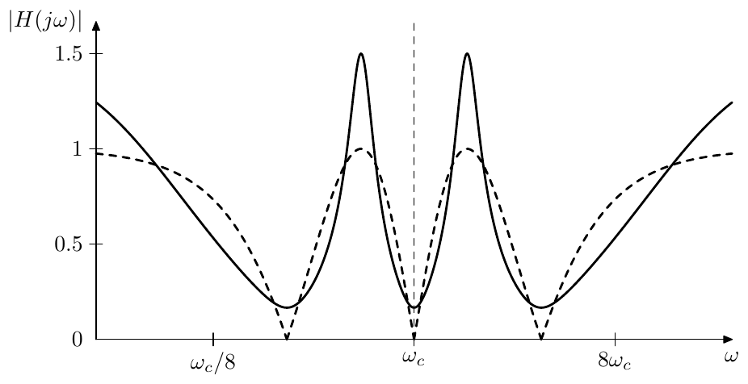

*Figure 11.12: Amplitude response of the multinotch in Fig. 11.11 built around
a chain of 6 identical 1-pole allpasses at $k = 0.5$. Dashed curve corresponds
to $k = 0$ (the same response as in Fig. 11.4).*

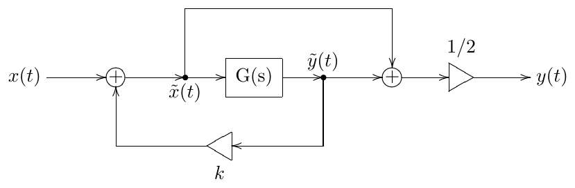

*Figure 11.13: Multinotch from Fig. 11.1 with added feedback and corrected
mixing.*

which varies between

$$
H(j\omega) = \frac{1}{2}\cdot\frac{1+1}{1-k} = \frac{1}{1-k} \qquad \text{when } \varphi = 2\pi n \tag{11.2a}
$$

and

$$
H(j\omega) = \frac{1}{2}\cdot\frac{1-1}{1-k} = 0 \qquad \text{when } \varphi = \pi + 2\pi n \tag{11.2b}
$$

The amplitude response is then

$$
\begin{aligned}
|H(j\omega)|^2 &= \frac{1}{4}\cdot\left|\frac{1+e^{j\varphi}}{1-ke^{j\varphi}}\right|^2 = \frac{1}{4}\cdot\left|\frac{1+\cos\varphi+j\sin\varphi}{1-k\cos\varphi-jk\sin\varphi}\right|^2 = \\
&= \frac{1}{4}\cdot\frac{(1+\cos\varphi)^2+\sin^2\varphi}{(1-k\cos\varphi)^2+k^2\sin^2\varphi} = \frac{1}{4}\cdot\frac{2+2\cos\varphi}{1+k^2-2k\cos\varphi} = \\
&= \frac{1}{2}\cdot\frac{1+\cos\varphi}{1+k^2+2k-2k(1+\cos\varphi)} = \frac{\cos^2\dfrac{\varphi}{2}}{(1+k)^2-4k\cos^2\dfrac{\varphi}{2}}
\end{aligned}
$$

Again one can see that $|H(j\omega)| = 1/(1-k)$ when $\cos^2(\varphi/2) = 1$
and $H(j\omega) = 0$ when $\cos^2(\varphi/2) = 0$. Thus the effect of the
feedback in Fig. 11.13 is that the peaks become $1/(1-k)$ times higher (given
$0 < k < 1$) and notches stay intact. Fig. 11.14 illustrates. Observe that the
peaks become higher and narrower.[^2]

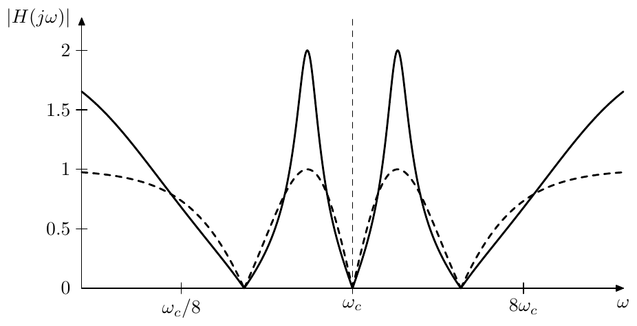

*Figure 11.14: Amplitude response of the multinotch in Fig. 11.13 built around
a chain of 6 identical 1-pole allpasses at $k = 0.5$. Dashed curve corresponds
to $k = 0$ (the same response as in Fig. 11.4).*

We could combine the feedback (Fig. 11.13) and the inversion (Fig. 11.8), as
shown in Fig. 11.15. Apparently the inversion only adds another $180^\circ$
to $\varphi(\omega)$, swapping peaks and notches. Therefore the results of the
previous discussion of Fig. 11.13 equally apply to Fig. 11.15.

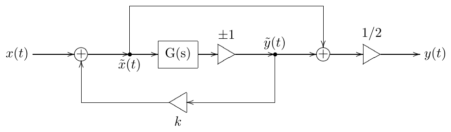

*Figure 11.15: Multinotch with feedback and inversion.*

As we should recall from the discussion of ladder filters, the feedback
becomes unstable when the total gain across the feedback loop, computed at a
frequency where the total phase shift across the feedback loop is zero,
exceeds 1. Apparently in the case of Fig. 11.15 the zero total phase shift is
occurring exactly at the frequencies where the multinotch has peaks, while
the total feedback loop gain at these frequencies is simply $k$. Therefore the
multinotch filter becomes unstable at $k = 1$ and the suggested range of $k$
is $0 \le k < 1$.[^3] Note that the presence of the inversion doesn't really
change the stable range of $k$, since the allpass $G(s)$ is anyway delivering
all possible phase shifts across the frequency range $0 \le \omega < +\infty$,
and there always will be frequencies at which the total feedback loop phase
shift is zero (thereby producing amplitude response peaks), regardless of
whether the inversion is on or off. Thus the feedback loop will be stable as
long as $|k| < 1$.

### Feedback shaping

Being essentially a ladder allpass, the multnotch in Fig. 11.15 can
accomodate feedback shaping, as discussed in Section 5.4. Notably, as long as
the amplitude responses of the shaping filters do not exceed 1, neither will
the total feedback loop gain (since in the absence of shaping filters the
feedback loop gain is exactly 1 at all frequencies). This means that the
stability of the feedback loop for $|k| < 1$ will not be destroyed, no matter
what the phase responses of the shaping filters are.

## 11.7 Dry/wet mixing

So far we have been mixing the allpass-processed signal and the input signal
(or, if we are using feedback, the pre-allpass signal $\tilde x(t)$ with the
post-allpass signal $\tilde y(t)$) in equal amounts:

$$
y = \frac{\tilde x + \tilde y}{2}
$$

Let's crossfade the multinotch filter output signal with the input signal:

$$
y = a\frac{\tilde x + \tilde y}{2} + (1-a)x \tag{11.3}
$$

If the multinotch is being used as a part of a phaser or flanger effect, the
input signal is commonly referred to as the *dry signal* while the
multinotch output signal $(\tilde x + \tilde y)/2$ is referred to as the *wet
signal*.[^4]

According to (11.2a) the phase response of the feedback multinotch at the
peak is zero, therefore the peak, having the height $1/(1-k)$ should mix
naturally with the input signal (corresponding to the transfer function equal
to 1 everywhere), producing a smooth crossfade between $1/(1-k)$ and 1 in the
amplitude response at this frequency. This is indeed the case and the
amplitude response of a multinotch will nicely crossfade into a unity gain
response (Fig. 11.16). The respective structure is shown in Fig. 11.17.

*Figure 11.16: Amplitude response of the multinotch in Fig. 11.13 built around
a chain of 6 identical 1-pole allpasses at $k = 0.5$ with a dry/wet mixing
ratio of 50%. Dashed curve corresponds to a dry/wet mixing ratio of 100%
(same response as in Fig. 11.14).*

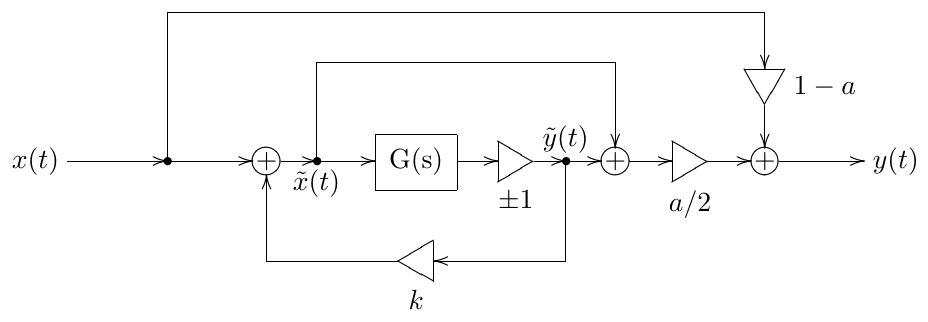

*Figure 11.17: Multinotch with feedback, inversion and dry/wet mixing.*

Since $\tilde x = x + k\tilde y$, we can rewrite (11.3) as

$$
\begin{aligned}
y &= a\frac{x+k\tilde y+\tilde y}{2}+(1-a)x = \frac{a}{2}(x+(1+k)\tilde y)+(1-a)x = \\
&= \left(1-\frac{a}{2}\right)x+\frac{a}{2}(1+k)\tilde y
\end{aligned}
$$

Thus, even though normally $0 \le a \le 1$, we could let $a$ grow all the way
to $a = 2$, in which case only the allpass output $\tilde y$ (albeit boosted
by $1+k$) will be present in the output signal.

## 11.8 Barberpole notches

Consider the frequency shifter in Fig. 10.31 and let's replace
$\Delta\omega\cdot t$ with some fixed value $\Delta\varphi$, obtaining a
similar structure shown in Fig. 11.18.[^5]

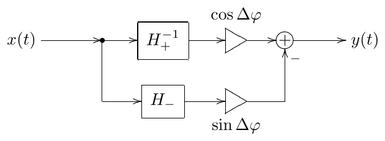

*Figure 11.18: Barberpole allpass, obtained from the frequency shifter in Fig.
10.31.*

Across the supported bandwidth of the frequency shifter the phase difference
between the allpasses $H_+^{-1}$ and $H_-$ is $90^\circ$. That is

$$
\varphi_+(\omega) - \varphi_-(\omega) = 90^\circ
$$

where

$$
\begin{aligned}
\varphi_+(\omega) &= \arg H_+^{-1}(j\omega) \\
\varphi_-(\omega) &= \arg H_-(j\omega)
\end{aligned}
$$

or simply

$$
H_-(s) = -jH_+^{-1}(s)
$$

The frequency response of the structure in Fig. 11.18 (within the supported
bandwidth of the frequency shifter) is thereby

$$
\begin{aligned}
G(j\omega) &= H_+^{-1}(j\omega)\cdot\cos\Delta\varphi - H_-(j\omega)\cdot\sin\Delta\varphi = \\
&= H_+^{-1}(j\omega)\cdot\cos\Delta\varphi + jH_+^{-1}(j\omega)\cdot\sin\Delta\varphi = \\
&= H_+^{-1}(j\omega)\cdot(\cos\Delta\varphi+j\sin\Delta\varphi) = e^{j\Delta\varphi}\cdot H_+^{-1}(j\omega)
\end{aligned}
$$

from where we repsectively obtain

$$
|G(j\omega)| = \left|e^{j\Delta\varphi}\right|\cdot\left|H_+^{-1}(j\omega)\right| = 1 \tag{11.4a}
$$

$$
\arg G(j\omega) = \arg e^{j\Delta\varphi} + \arg H_+^{-1}(j\omega) = \arg H_+^{-1}(j\omega) + \Delta\varphi \tag{11.4b}
$$

That is, $G(s)$ is an allpass and by varying $\Delta\varphi$ we can arbitrarily
offset its phase response! Of course, this holds only within the frequency
shifter's bandwidth, but nevertheless it's a very remarkable property.

But what does the phase response of $G(s)$ actually look like? Apparently it
depends on the details of $H_+^{-1}$ and $H_-$ implementations. If $H_+^{-1}$
and $H_-$ are built from 1-pole allpasses obtained by minimax optimization of
the phase difference (e.g. by using formula eq:ellip:PhaseSplit:PolesZeros),
the phase responses of $H_+^{-1}$ and $H_-$ will look like the ones in Fig.
11.19, where we first should concentrate on the phase responses shown by
solid lines.

*Figure 11.19: Phase responses of $H_+^{-1}$ and $H_-$ (each consisting of six
1-pole allpasses). The frequency shifter bandwidth is 10 octaves (bounded by
vertical dashed lines at $\omega = 1/32$ and $\omega = 32$). Black dots
correspond to multinotch's peaks arising out of $H_+^{-1}$, white dots
correspond to the respective notches. Dashed curves show "aliased" phase
responses.*

Aside from being $90^\circ$ apart across the frequency shifter bandwidth, the
phase responses in Fig. 11.19 do not look much different from the phase
responses we have been using earlier, such as e.g. in Fig. 11.2. Thus
$H_+^{-1}$ or $H_-$ will provide a decent allpass to be used in a multinotch.
By using (11.4b) we can obtain an offset phase response of $H_+^{-1}$ as the
phase response of $G(s)$, which will result in shifted peaks and notches of
the multinotch (compared to their positions arising out of $H_+^{-1}$).

However, recall that the phase is defined modulo $360^\circ$. That is a phase
response of $-20^\circ$ is exactly the same as the phase response of
$-380^\circ$ or of $-740^\circ$ etc. This has been shown by the dashed curves
in Fig. 11.19, they represent alternative interpretations or "aliased"
versions of the "principal" (solid-line) phase responses. Notice how the
black and white dots on the aliased responses of $H_+^{-1}$ correspond to
exactly the same peak and notch frequencies as the ones arising out of the
principal phase responses (reflecting the fact that it doesn't matter if we
use a principal or an aliased phase response to determine peak and notch
positions). By offsetting the phase response of $H_+^{-1}$ (visually this
corresponds to a vertical shifting of the responses in Fig. 11.19) we
simultaneously offset all its aliases by the same amount.

Imagine that $\Delta\varphi$ is increasing, thus the principal and aliased
responses of $H_+^{-1}$ in Fig. 11.19 are continuously moving upwards, and
the notches and peaks are continuously moving to the right.[^6] In turn, each
of the peaks and notches will disappear on the right at $\omega = +\infty$
simultaneously reappearing from the left at $\omega = 0$. Thus the peaks and
notches will move "endlessly" from left to the right. Respectively if
$\Delta\varphi$ is decreasing, they will move from right to the left. This is
the so-called *barberpole effect*.

In reality, however, the peaks and notches will not move all the way to
$\omega = +\infty$ or $\omega = 0$. At some point they will leave the
frequency shifter bandwidth, at which moment (11.4b) will no longer hold.
Particularly, the amplitude response of $G(s)$ will no longer stay allpass.
At $\omega = 0$ we have $H_+^{-1}(0) = H_-(0) = 1$, which means that

$$
G(0) = 1\cdot\cos\Delta\varphi + 1\cdot\sin\Delta\varphi = \cos\Delta\varphi+\sin\Delta\varphi = \sqrt{2}\cdot\cos\left(\Delta\varphi-\frac{\pi}{4}\right)
$$

which means that the amplitude response of $G(s)$ at $\omega = 0$ can get as
large as $\sqrt{2}$. The same situation occurs at $\omega = +\infty$.
Respectively, if the multinotch contains feedback, it will explode at
$k = 1/\sqrt{2}$. The explosion can be prevented by introducing low- and
high-pass or -shelving filters into the feedback loop.[^7]

Thus, we have built a *barberpole phaser*, where the peaks and notches can
move endlessly to the left or to the right. The same technique cannot be
directly used to build a barberpole flanger, since, while we have a phase
splitter acting as a differential allpass, we do not have a phase splitter
acting as a delay. This would not be even possible in theory, since the phase
response of a delay must be proportional to the frequency (this is the
property which ensures the harmonic spacing of comb filter's peaks and
notches), but adding any constant to such phase response will destroy this
property. What is however possible is using an allpass arising out of a
serial connection of a delay and a barberpole allpass in Fig. 11.18. This
would destroy the perfect harmonic spacing of flanger's peaks and notches,
but one gets a barberpole effect in return, as the phase responses of the
delay and the barberpole allpass add up.

## Summary

Multinotch filters can be build by mixing a signal with its allpassed
version, where the allpass could be a differential allpass or a delay, the
latter resulting in a comb filter. Inverting the allpass's output swaps the
peaks and the notches. Adding feedback makes the peaks more prominent.

[^1]: Resonating multinotches will be discussed later in this chapter.

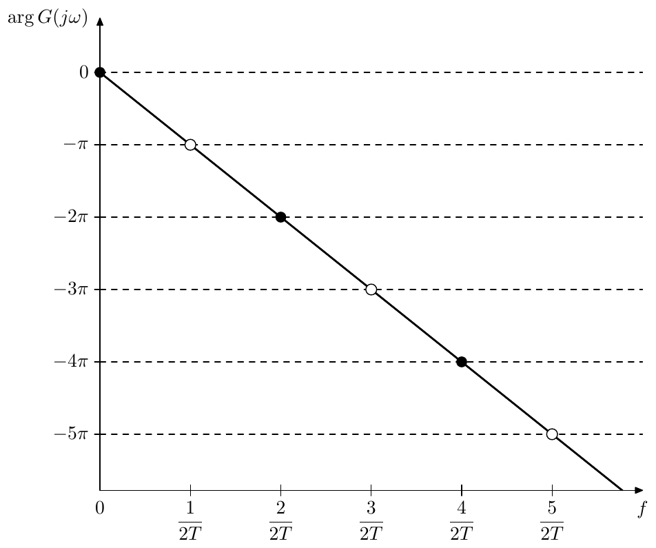

*Figure 11.9: Phase response of a delay. Black dots correspond to multinotch's
peaks, white dots correspond to multinotch's notches. The frequency scale is
linear!*

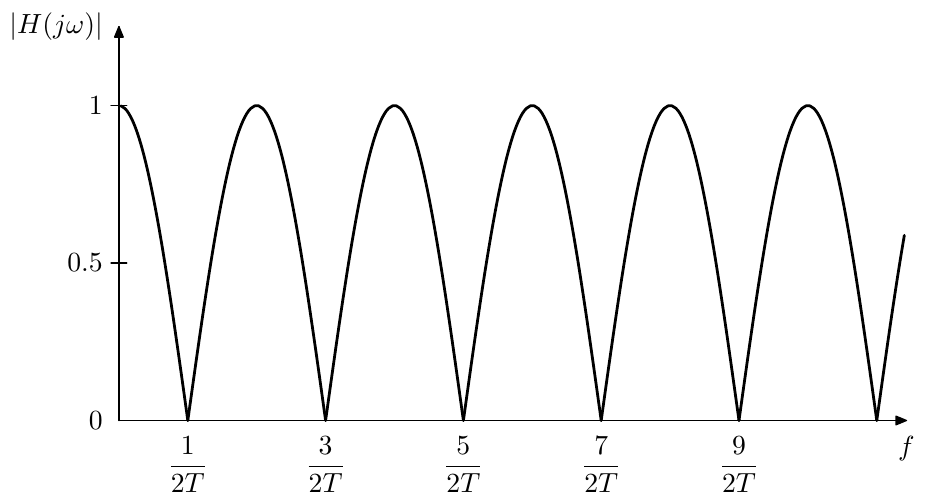

*Figure 11.10: Amplitude response of a multinotch built around a delay (comb
filter). The frequency scale is linear!*

[^2]: Since $\tilde x = x + k\tilde y$, instead of simple averaging
    $y = (\tilde x+\tilde y)/2$ we could have had
    $$y = \frac{x+k\tilde y+\tilde y}{2} = \frac{1}{2}x+\frac{1+k}{2}\tilde y$$
    however this doesn't seem to give any benefits compared to the previous
    option, while we need to adjust the mixing coefficient for $\tilde y$
    depending on the feedback amount, which is rather a drawback.

[^3]: Negative values of $k$ lower the amplitude response peaks below 1,
    simultaneously making them wider and respectively making the notches
    narrower. Being narrower, such notches become less audible, even if we
    compensate for the amplitude loss by multiplying the signal by $1-k$,
    thus the case of $k < 0$ is less common.

[^4]: Sometimes just the allpass output signal $\tilde y$ is referred to as
    the wet signal. Such terminology is however more appropriate for an
    effect such as e.g. chorus, where the main idea of the effect is the
    pitch detuning produced by delay modulation. In comparison e.g. in a
    flanger the main idea of the effect is the appearance of the notches,
    while pitch detuning, if present at all, is rather a modulation
    artifact. Thus, in absence of strong modulation, the output of the
    flanger's delay will be hardly distinguishable by ear from the dry
    signal, not really being "wet".

[^5]: The author was introduced to the approach of using the frequency
    shifter structure to implement barberpole phasers and flangers by Dr.
    Julian Parker.

[^6]: In a practical implementation $\Delta\varphi$ would not be able to
    increase endlessly, as at some point it will leave the representable
    range of values. If floating point representation is used, precision
    losses will become intolerably large even before the value gets out of
    range. However, we don't really need to increase or decrease
    $\Delta\varphi$ endlessly, since what matters in the end (according to
    Fig. 11.18) are the values of its sine and cosine. Thus we could wrap
    $\Delta\varphi$ to the range $[-\pi, \pi]$, or work directly with sine
    and cosine values (in which case it's convenient to treat them as real
    and imaginary parts of a complex number $e^{j\Delta\varphi}$).

[^7]: Particularly, for the 1-pole lowpass (or any 1st kind Butterworth
    lowpass) we have $|H(j\omega)| \le 1/\sqrt{2}\ \forall \omega \ge
    \omega_c$, while outside of that range we still have $|H(j\omega)| \le
    1$. Therefore such filter, placed at the upper boundary of the frequency
    shifter's bandwidth, will be guaranteed to mitigate the unwanted
    amplitude response boost in the high frequency range. A highpass of the
    same kind placed at the lower boundary of the frequency shifter's
    bandwidth will perform the same in the low frequency range.
